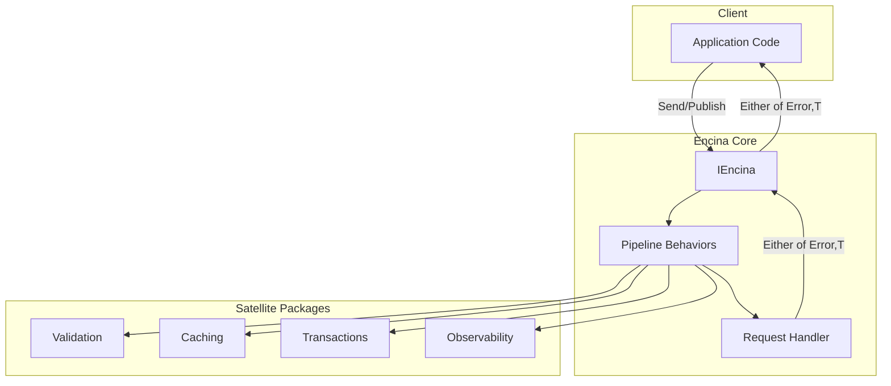
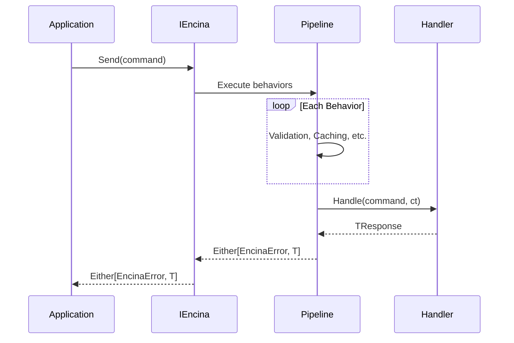
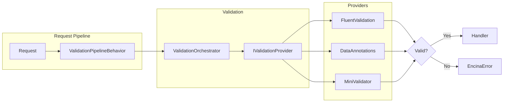
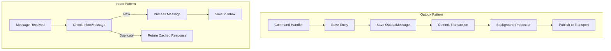

# Encina

<!-- CI/CD Status -->
[](https://github.com/dlrivada/Encina/actions/workflows/dotnet-ci.yml)
[](https://github.com/dlrivada/Encina/actions/workflows/sonarcloud.yml)
[](https://github.com/dlrivada/Encina/actions/workflows/codeql.yml)
[](https://github.com/dlrivada/Encina/actions/workflows/sbom.yml)
[](https://github.com/dlrivada/Encina/actions/workflows/benchmarks.yml)

<!-- Project Info -->


[](LICENSE)
[](https://docs.github.com/code-security/dependabot)
[](https://www.conventionalcommits.org/)

<!-- Code Quality (SonarCloud) -->
[](https://sonarcloud.io/summary/new_code?id=dlrivada_Encina)
[](https://sonarcloud.io/summary/new_code?id=dlrivada_Encina)
[](https://sonarcloud.io/summary/new_code?id=dlrivada_Encina)
[](https://sonarcloud.io/summary/new_code?id=dlrivada_Encina)
[](https://sonarcloud.io/summary/new_code?id=dlrivada_Encina)
[](https://sonarcloud.io/summary/new_code?id=dlrivada_Encina)
[](https://sonarcloud.io/summary/new_code?id=dlrivada_Encina)
[](https://sonarcloud.io/summary/new_code?id=dlrivada_Encina)


**Build resilient .NET applications with Railway Oriented Programming.**

Encina is a comprehensive toolkit for building robust .NET applications. Built on [LanguageExt](https://github.com/louthy/language-ext), it provides explicit error handling through `Either<EncinaError, T>`, CQRS patterns, messaging infrastructure, and composable pipeline behaviors.

## Key Features

- **Railway Oriented Programming**: All operations return `Either<EncinaError, T>` - no exceptions for business logic
- **CQRS Support**: Explicit `ICommand<T>` and `IQuery<T>` contracts with dedicated handlers
- **Pipeline Behaviors**: Composable middleware for validation, caching, transactions, and more
- **Streaming**: `IAsyncEnumerable` support via `IStreamRequest<TItem>`
- **Observability**: Built-in OpenTelemetry integration with ActivitySource and Metrics
- **Pay-for-What-You-Use**: All features are opt-in via satellite packages

## Architecture



## Quick Start

### 1. Install the Package

```bash
dotnet add package Encina
```

### 2. Configure Services

```csharp
using Encina;

var builder = WebApplication.CreateBuilder(args);

builder.Services.AddEncina(typeof(Program).Assembly);
```

### 3. Define a Command

```csharp
public sealed record CreateOrder(Guid CustomerId, List<OrderItem> Items) : ICommand<OrderId>;

public sealed class CreateOrderHandler : ICommandHandler<CreateOrder, OrderId>
{
    public async Task<OrderId> Handle(CreateOrder command, CancellationToken ct)
    {
        var order = Order.Create(command.CustomerId, command.Items);
        await _repository.SaveAsync(order, ct);
        return order.Id;
    }
}
```

### 4. Send the Command

```csharp
var result = await encina.Send(new CreateOrder(customerId, items), ct);

result.Match(
    Left: error => logger.LogError("Order failed: {Code}", error.Code),
    Right: orderId => logger.LogInformation("Order created: {Id}", orderId));
```

## Request Lifecycle



## Packages (39 Active)

| Category | Packages | Description |
|----------|----------|-------------|
| **Core** | `Encina` | ROP, CQRS, pipeline behaviors |
| **Validation** | `FluentValidation`, `DataAnnotations`, `MiniValidator`, `GuardClauses` | Request validation with ROP integration |
| **Web** | `AspNetCore`, `SignalR` | Middleware, authorization, real-time notifications |
| **Database** | `EntityFrameworkCore`, `MongoDB`, `Dapper.{5}`, `ADO.{5}` | Persistence with messaging patterns |
| **Messaging** | `Messaging`, `RabbitMQ`, `Kafka`, `AzureServiceBus`, `AmazonSQS`, `NATS`, `MQTT`, `Redis.PubSub`, `InMemory`, `gRPC`, `GraphQL` | Message transports |
| **Caching** | `Caching`, `Caching.Memory`, `Caching.Hybrid`, `Caching.Redis`, `Caching.Valkey`, `Caching.KeyDB`, `Caching.Dragonfly`, `Caching.Garnet` | Multi-tier caching |
| **Scheduling** | `Hangfire`, `Quartz` | Job scheduling adapters |
| **Resilience** | `Extensions.Resilience`, `Polly`, `Refit` | Retry, circuit breaker, HTTP clients |
| **Event Sourcing** | `Marten` | Event store with projections |
| **Observability** | `OpenTelemetry` | Distributed tracing and metrics |

> **Note**: 3,800+ tests across all packages

## Validation

Encina provides three validation approaches, all using the centralized Orchestrator pattern:



### FluentValidation

```csharp
// Registration
builder.Services.AddEncinaFluentValidation(typeof(Program).Assembly);

// Validator
public class CreateOrderValidator : AbstractValidator<CreateOrder>
{
    public CreateOrderValidator()
    {
        RuleFor(x => x.CustomerId).NotEmpty();
        RuleFor(x => x.Items).NotEmpty();
    }
}
```

### DataAnnotations

```csharp
// Registration
builder.Services.AddDataAnnotationsValidation();

// Request with attributes
public sealed record CreateOrder(
    [Required] Guid CustomerId,
    [Required, MinLength(1)] List<OrderItem> Items) : ICommand<OrderId>;
```

### MiniValidator

```csharp
// Registration
builder.Services.AddMiniValidation();

// Uses DataAnnotations attributes - ultra-lightweight (~20KB)
```

## Messaging Patterns

Encina provides enterprise messaging patterns for distributed systems:



### Entity Framework Core

```csharp
builder.Services.AddEncinaEntityFrameworkCore<AppDbContext>(config =>
{
    config.UseTransactions = true;  // Automatic transaction management
    config.UseOutbox = true;        // Reliable event publishing
    config.UseInbox = true;         // Idempotent message processing
    config.UseSagas = true;         // Distributed transactions
    config.UseScheduling = true;    // Delayed/recurring execution
});
```

### Dapper / ADO.NET / PostgreSQL / MySQL / SQLite / Oracle

```csharp
// SQL Server with Dapper
builder.Services.AddEncinaDapper(config =>
{
    config.UseOutbox = true;
    config.UseInbox = true;
}, connectionString);
```

## Caching

```csharp
// Configure caching
builder.Services.AddEncinaCaching(options =>
{
    options.EnableQueryCaching = true;
    options.DefaultDuration = TimeSpan.FromMinutes(10);
});

// Add a cache provider
builder.Services.AddEncinaRedisCache("localhost:6379");
// Or: AddEncinaMemoryCache(), AddEncinaHybridCache(), etc.

// Mark queries as cacheable
[Cache(Duration = 300)]
public sealed record GetProductById(Guid Id) : IQuery<Product>;
```

## Resilience

```csharp
builder.Services.AddEncinaStandardResilience(options =>
{
    options.Retry.MaxRetryAttempts = 3;
    options.CircuitBreaker.FailureRatio = 0.5;
    options.Timeout.Timeout = TimeSpan.FromSeconds(30);
});
```

## Streaming

```csharp
// Define a stream request
public sealed record StreamProducts(string Category) : IStreamRequest<Product>;

public sealed class StreamProductsHandler : IStreamRequestHandler<StreamProducts, Product>
{
    public async IAsyncEnumerable<Product> Handle(
        StreamProducts request,
        [EnumeratorCancellation] CancellationToken ct)
    {
        await foreach (var product in _repository.StreamByCategory(request.Category, ct))
        {
            yield return product;
        }
    }
}

// Consume the stream
await foreach (var result in encina.Stream(new StreamProducts("Electronics"), ct))
{
    result.Match(
        Left: error => logger.LogError("Stream error: {Error}", error.Message),
        Right: product => Console.WriteLine(product.Name));
}
```

## Real-time Notifications (SignalR)

```csharp
builder.Services.AddEncinaSignalR();

// Declarative broadcasting
[BroadcastToSignalR("OrderUpdated")]
public sealed record OrderStatusChanged(Guid OrderId, string Status) : INotification;
```

## OpenTelemetry Integration

```csharp
builder.Services.AddOpenTelemetry()
    .WithTracing(b => b.AddSource("Encina"))
    .WithMetrics(b => b.AddMeter("Encina"));
```

## Health Checks

Encina provides automatic health check registration for all providers. When you configure a provider, health checks are registered automatically.

```csharp
// Health checks registered automatically
builder.Services.AddEncinaDapper<PostgreSqlConnection>(config =>
{
    config.UseOutbox = true;
    config.ProviderHealthCheck.Enabled = true; // Default
});

// Configure ASP.NET Core health endpoints
builder.Services.AddHealthChecks();

app.MapHealthChecks("/health");
app.MapHealthChecks("/health/ready", new HealthCheckOptions
{
    Predicate = check => check.Tags.Contains("ready")
});
```

### Available Health Checks

| Category | Providers | Default Tags |
|----------|-----------|--------------|
| **Databases** | PostgreSQL, MySQL, SQL Server, SQLite, Oracle, MongoDB, Marten | `database`, `ready` |
| **Message Brokers** | RabbitMQ, Kafka, NATS, MQTT, Azure Service Bus, Amazon SQS | `messaging`, `ready` |
| **Caching** | Redis (and compatible: Valkey, KeyDB, Dragonfly, Garnet) | `caching`, `ready` |
| **Scheduling** | Hangfire, Quartz | `scheduling`, `ready` |
| **Other** | SignalR, gRPC, EF Core | `messaging`/`database`, `ready` |

See [Encina.Messaging README](src/Encina.Messaging/README.md#health-checks) for detailed configuration options.

## Pipeline Behavior Example

```csharp
public sealed class LoggingBehavior<TRequest, TResponse>
    : IPipelineBehavior<TRequest, TResponse>
    where TRequest : IRequest<TResponse>
{
    public async ValueTask<Either<EncinaError, TResponse>> Handle(
        TRequest request,
        RequestHandlerDelegate<TResponse> next,
        CancellationToken ct)
    {
        _logger.LogInformation("Handling {Request}", typeof(TRequest).Name);

        var result = await next();

        result.Match(
            Left: error => _logger.LogWarning("Failed: {Error}", error.Code),
            Right: _ => _logger.LogInformation("Completed successfully"));

        return result;
    }
}
```

## Project Structure

```
src/
├── Encina/                    # Core library
├── Encina.Messaging/          # Messaging abstractions
├── Encina.AspNetCore/         # Web integration
├── Encina.EntityFrameworkCore/# EF Core provider
├── Encina.Dapper.*/           # Dapper providers (5 databases)
├── Encina.ADO.*/              # ADO.NET providers (5 databases)
├── Encina.Caching.*/          # Caching providers (8 packages)
├── Encina.FluentValidation/   # FluentValidation integration
└── ...                        # 39 packages total

tests/
├── Encina.Tests/              # Unit tests
├── Encina.ContractTests/      # API contract tests
├── Encina.PropertyTests/      # Property-based tests
└── ...                        # 3,800+ tests

benchmarks/
└── Encina.Benchmarks/         # BenchmarkDotNet harness
```

## Solution Filters

For focused development, use solution filters:

```bash
dotnet build Encina.Core.slnf       # Core packages only
dotnet build Encina.Caching.slnf    # Caching packages only
dotnet build Encina.Database.slnf   # Database providers only
dotnet build Encina.Validation.slnf # Validation packages only
```

## Testing

```bash
# Run all tests
dotnet test Encina.slnx --configuration Release

# Run with coverage
dotnet test --collect:"XPlat Code Coverage"

# Run mutation testing
dotnet run --file scripts/run-stryker.cs
```

## Documentation

- [ROADMAP.md](ROADMAP.md) - Development phases and planned features
- [CHANGELOG.md](CHANGELOG.md) - Version history
- [docs/history/](docs/history/) - Detailed implementation records
- [docs/messaging/](docs/messaging/) - Saga patterns and transport guides

## Roadmap

Encina is in active development toward **1.0**. See [ROADMAP.md](ROADMAP.md) for details.

### Current Progress

| Phase | Status | Description |
|-------|--------|-------------|
| Phase 1 | ✅ Complete | Stability - All tests passing |
| **Phase 2** | **In Progress** | Functionality - 364 issues across 10 milestones |
| Phase 3 | Pending | Testing & Quality - Coverage targets (85%+) |
| Phase 4 | Pending | Code Quality - SonarCloud compliance |
| Phase 5 | Pending | Documentation - User guides and examples |
| Phase 6 | Pending | Release - NuGet publishing, branding |

### Phase 2 Milestones (v0.10.0 → v0.19.0)

| Version | Focus | Issues |
|---------|-------|--------|
| v0.10.0 | DDD Foundations | 31 |
| v0.11.0 | Testing Infrastructure | 25 |
| v0.12.0 | Database & Repository | 22 |
| v0.13.0 | Security & Compliance | 25 |
| v0.14.0 | Cloud-Native & Aspire | 23 |
| v0.15.0 | Messaging & EIP | 71 |
| v0.16.0 | Multi-Tenancy & Modular | 21 |
| v0.17.0 | AI/LLM Patterns | 16 |
| v0.18.0 | Developer Experience | 43 |
| v0.19.0 | Observability & Resilience | 87 |

→ [View all milestones](https://github.com/dlrivada/Encina/milestones)

## Contributing

See [CONTRIBUTING.md](CONTRIBUTING.md) for guidelines.

## License

This project is licensed under the [MIT License](LICENSE).

---

**Maintained by**: [@dlrivada](https://github.com/dlrivada)
