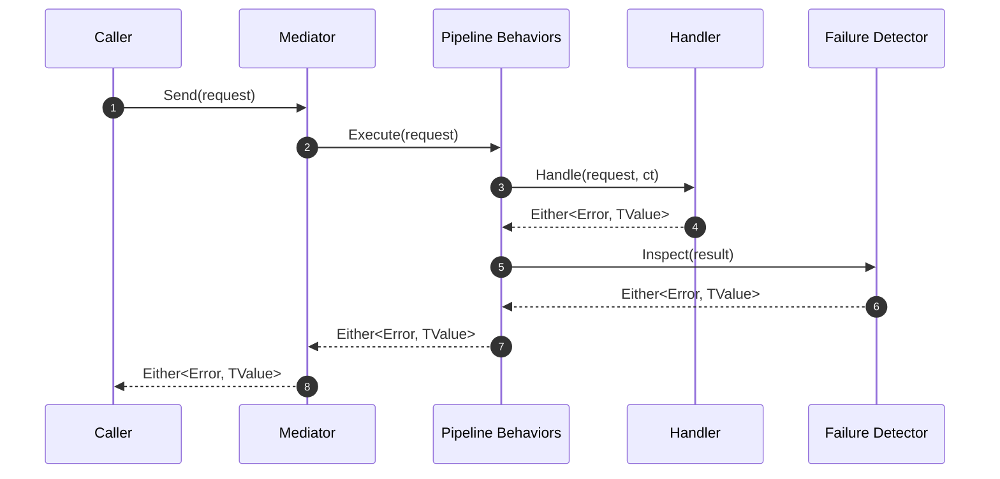

# SimpleMediator


SimpleMediator is a lightweight mediator abstraction for .NET applications that lean on functional programming principles. It keeps request and response contracts explicit, integrates naturally with [LanguageExt](https://github.com/louthy/language-ext), and embraces pipeline behaviors so cross-cutting concerns stay composable.

## Table of Contents

- [Why SimpleMediator](#why-simplemediator)
- [Quick Start](#quick-start)
- [Request Lifecycle](#request-lifecycle)
- [Handlers and Contracts](#handlers-and-contracts)
- [Pipeline Behaviors](#pipeline-behaviors)
- [Functional Failure Detection](#functional-failure-detection)
- [Diagnostics and Metrics](#diagnostics-and-metrics)
- [Configuration Reference](#configuration-reference)
- [Testing](#testing)
- [FAQ](#faq)
- [Future Work](#future-work)
- [License](#license)

## Why SimpleMediator

- Built for functional error handling with `Either` and `Option` from LanguageExt.
- Lightweight dependency footprint: `LanguageExt.Core` and `Microsoft.Extensions.*` abstractions.
- Pipelines, pre-processors, and post-processors make cross-cutting concerns pluggable.
- Provides telemetry hooks (logging, metrics, activity tracing) without coupling to specific vendors.
- Ships with guardrails such as functional failure detection to keep domain invariants explicit.

## Quick Start

### 1. Reference the Package

Add the GitHub Packages feed once per environment:

```bash
dotnet nuget add source "https://nuget.pkg.github.com/dlrivada/index.json" \
    --name dlrivada-github \
    --username <your-gh-username> \
    --password <PAT-with-write-packages>
```

Then reference the package from your project:

```bash
dotnet add <YourProject>.csproj package SimpleMediator --version 0.1.0
```

### 2. Configure Dependency Injection

```csharp
using LanguageExt;
using Microsoft.Extensions.DependencyInjection;
using SimpleMediator;

var services = new ServiceCollection();

services.AddSimpleMediator(cfg =>
{
    cfg.AddPipelineBehavior(typeof(ActivityPipelineBehavior<,>))
       .AddPipelineBehavior(typeof(MetricsPipelineBehavior<,>))
       .AddFunctionalFailureDetector<DefaultFunctionalFailureDetector>();
}, typeof(ApplicationAssemblyMarker).Assembly);

var provider = services.BuildServiceProvider();
var mediator = provider.GetRequiredService<IMediator>();
```

### 3. Send a Command

```csharp
public sealed record RegisterUser(string Email, string Password) : ICommand<Unit>;

public sealed class RegisterUserHandler : ICommandHandler<RegisterUser, Unit>
{
    public async Task<Either<Error, Unit>> Handle(RegisterUser command, CancellationToken ct)
    {
        var hashed = await Hashing.HashPassword(command.Password, ct);
        await Users.StoreAsync(command.Email, hashed, ct);
        return Unit.Default;
    }
}

var result = await mediator.Send(new RegisterUser("user@example.com", "Pass@123"), cancellationToken);

result.Match(
    _ => Console.WriteLine("User registered"),
    err => Console.WriteLine(err.Message));
```

### 4. Query Data

```csharp
public sealed record GetUserProfile(string Email) : IQuery<UserProfile>;

public sealed class GetUserProfileHandler : IQueryHandler<GetUserProfile, UserProfile>
{
    public Task<Either<Error, UserProfile>> Handle(GetUserProfile query, CancellationToken ct)
        => Users.FindAsync(query.Email, ct);
}

var profile = await mediator.Send(new GetUserProfile("user@example.com"), cancellationToken);
```

## Request Lifecycle



## Handlers and Contracts

SimpleMediator relies on explicit interfaces and result types so each operation documents its intent.

| Contract | Purpose | Default Expectations |
| --- | --- | --- |
| `ICommand<TResult>` | Mutation or side effect returning `TResult`. | Handler returns `Either<Error, TResult>`. |
| `IQuery<TResult>` | Read operation returning `TResult`. | Handler returns `Either<Error, TResult>`. |
| `INotification` | Fire-and-forget signals. | Zero or more notification handlers. |

```csharp
public sealed record SendWelcomeEmail(string Email) : INotification;

public sealed class SendWelcomeEmailHandler : INotificationHandler<SendWelcomeEmail>
{
    public Task<Unit> Handle(SendWelcomeEmail notification, CancellationToken ct)
        => EmailGateway.SendAsync(notification.Email, ct).Map(_ => Unit.Default);
}

await mediator.Publish(new SendWelcomeEmail("user@example.com"), cancellationToken);
```

## Pipeline Behaviors

Pipeline behaviors wrap handler execution so concerns such as logging, validation, and retries stay isolated. Behaviors are executed in the order they are registered.

```csharp
services.AddSimpleMediator(cfg =>
{
    cfg.AddPipelineBehavior(typeof(ActivityPipelineBehavior<,>))
       .AddPipelineBehavior(typeof(ValidationPipelineBehavior<,>))
       .AddRequestPreProcessor(typeof(NormalizeWhitespacePreProcessor<>))
       .AddRequestPostProcessor(typeof(AuditTrailPostProcessor<,>));
}, typeof(ApplicationAssemblyMarker).Assembly);
```

### Built-in Behaviors

| Behavior | Responsibility |
| --- | --- |
| `ActivityPipelineBehavior<,>` | Creates OpenTelemetry `Activity` scopes per request. |
| `MetricsPipelineBehavior<,>` | Emits meters for handler duration and outcome. |
| `ValidationPipelineBehavior<,>` | Runs registered validators before handler execution. |
| `LoggingPipelineBehavior<,>` | Logs request execution details with structured properties. |

### Custom Behavior Example

```csharp
public sealed class TimeoutPipelineBehavior<TRequest, TResponse> : IPipelineBehavior<TRequest, TResponse>
    where TRequest : notnull
{
    private static readonly TimeSpan DefaultTimeout = TimeSpan.FromSeconds(5);

    public async Task<TResponse> Handle(
        TRequest request,
        RequestHandlerDelegate<TResponse> next,
        CancellationToken cancellationToken)
    {
        using var cts = CancellationTokenSource.CreateLinkedTokenSource(cancellationToken);
        cts.CancelAfter(DefaultTimeout);
        return await next().WaitAsync(cts.Token);
    }
}

cfg.AddPipelineBehavior(typeof(TimeoutPipelineBehavior<,>));
```

## Functional Failure Detection

Functional failure detection inspects handler results to translate domain-specific error envelopes into consistent mediator failures.

```csharp
public sealed class AppFunctionalFailureDetector : IFunctionalFailureDetector
{
    public Either<Error, T> DetectFailure<T>(Either<Error, T> result)
    {
        return result.Match(
            Right: value => Validate(value),
            Left: error => Either<Error, T>.Left(error));
    }

    private Either<Error, T> Validate<T>(T value)
        => value is ValidationError validation
            ? Either<Error, T>.Left(validation.ToError())
            : value;
}

cfg.AddFunctionalFailureDetector<AppFunctionalFailureDetector>();
```

## Diagnostics and Metrics

- `MediatorDiagnostics` wires logging scopes and structured information for each request.
- `MediatorMetrics` exposes counters and histograms via `System.Diagnostics.Metrics`.
- `ActivityPipelineBehavior` integrates with `System.Diagnostics.ActivitySource` so OpenTelemetry exporters can pick up traces.

```csharp
services.AddOpenTelemetry()
    .WithTracing(b => b.AddSource(MediatorDiagnostics.ActivitySourceName))
    .WithMetrics(b => b.AddMeter(MediatorMetrics.MeterName));
```

## Configuration Reference

```csharp
services.AddSimpleMediator(cfg =>
{
    cfg.Assemblies.Add(typeof(ApplicationAssemblyMarker).Assembly);
    cfg.AddPipelineBehavior(typeof(ActivityPipelineBehavior<,>));
    cfg.AddRequestPreProcessor(typeof(ValidationPreProcessor<>));
    cfg.AddRequestPostProcessor(typeof(AuditTrailPostProcessor<,>));
    cfg.AddStreamingHandler(typeof(StreamNotificationHandler<>));
    cfg.AddFunctionalFailureDetector<AppFunctionalFailureDetector>();
});
```

| API | Description |
| --- | --- |
| `Assemblies` | Assemblies scanned for handlers, behaviors, processors, and notifications. |
| `AddPipelineBehavior` | Registers a scoped pipeline behavior. |
| `AddRequestPreProcessor` | Executes before handler invocation. |
| `AddRequestPostProcessor` | Executes after handler success or failure. |
| `AddFunctionalFailureDetector` | Registers a singleton detector (defaults to `DefaultFunctionalFailureDetector`). |
| `AddStreamingHandler` | Enables streaming or notification handlers discovered by assembly scanning. |

## Testing

```bash
dotnet test
```

Tests cover mediator behaviors, pipeline orchestration, and functional failure scenarios. Integrate the mediator in your solution tests to validate request flow and ensure custom behaviors execute as expected.

## FAQ

- **Does SimpleMediator replace MediatR?** It takes inspiration from MediatR but focuses on functional result types and richer telemetry hooks.
- **Can I use it without LanguageExt?** Handlers rely on `Either` and `Unit` from LanguageExt; alternative abstractions would require custom adapters.
- **How do I handle retries?** Wrap logic inside a custom pipeline behavior or delegate to Polly policies executed inside the handler.
- **Is streaming supported?** Streaming notifications are supported via processors that work with `IAsyncEnumerable` payloads.

## Future Work

- Contravariant handler resolution to reduce duplication when commands share interfaces.
- Additional first-party behaviors (idempotency, Polly-based retries) for common patterns.
- Templates for publishing to internal feeds (GitHub Packages, Azure Artifacts) with automated semantic versioning.

## License

This repository is distributed under a private license. See `LICENSE` for details.
