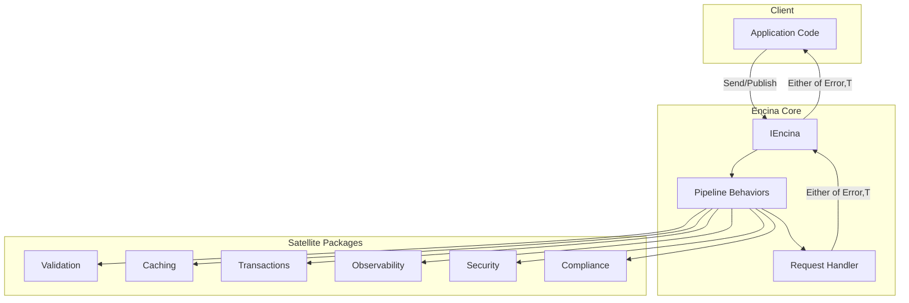
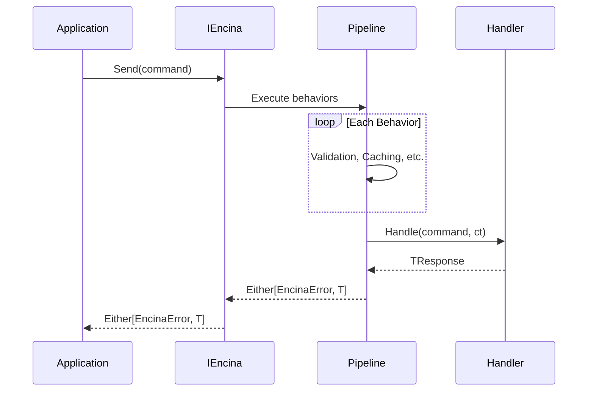
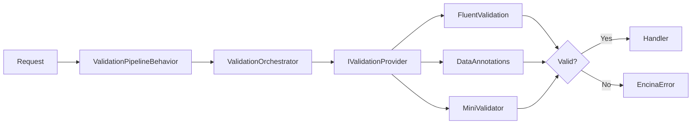
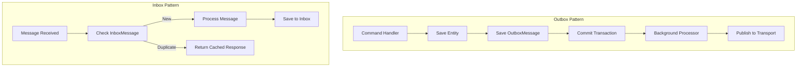

# Encina

<!-- CI/CD Status -->
[](https://github.com/dlrivada/Encina/actions/workflows/ci.yml)
[](https://github.com/dlrivada/Encina/actions/workflows/sonarcloud.yml)
[](https://github.com/dlrivada/Encina/actions/workflows/codeql.yml)
[](https://github.com/dlrivada/Encina/actions/workflows/sbom.yml)
[](https://github.com/dlrivada/Encina/actions/workflows/benchmarks.yml)

<!-- Project Info -->


[](LICENSE)
[](https://docs.github.com/en/code-security/how-tos/secure-your-supply-chain)
[](https://www.conventionalcommits.org/)

<!-- Code Quality (SonarCloud) -->
[](https://sonarcloud.io/summary/new_code?id=dlrivada_Encina)
[](https://sonarcloud.io/summary/new_code?id=dlrivada_Encina)
[](https://sonarcloud.io/summary/new_code?id=dlrivada_Encina)
[](https://sonarcloud.io/summary/new_code?id=dlrivada_Encina)
[](https://sonarcloud.io/summary/new_code?id=dlrivada_Encina)
[](https://sonarcloud.io/summary/new_code?id=dlrivada_Encina)
[](https://sonarcloud.io/summary/new_code?id=dlrivada_Encina)
[](https://sonarcloud.io/summary/new_code?id=dlrivada_Encina)
[](https://img.shields.io/badge/mutation-79.75%25-4C934C.svg)
<!-- AI -->
[](https://img.shields.io/coderabbit/prs/github/dlrivada/Encina?logo=coderabbit)   

**Build resilient, regulation-ready .NET applications with Railway Oriented Programming.**

Encina is a comprehensive toolkit for building robust .NET 10 applications. Built on [LanguageExt](https://github.com/louthy/language-ext), it provides explicit error handling through `Either<EncinaError, T>`, CQRS patterns, enterprise messaging, multi-provider database access, built-in GDPR/NIS2/AI Act compliance, and composable pipeline behaviors — all opt-in, pay-for-what-you-use.

> **112 packages** | **13,000+ tests** | **13 database providers** | **8 cache providers** | **10 messaging transports** | **15 compliance modules**

## Why Encina?

- **Railway Oriented Programming**: All operations return `Either<EncinaError, T>` — no exceptions for business logic, explicit error propagation throughout every layer
- **CQRS & Pipeline Behaviors**: `ICommand<T>`, `IQuery<T>`, `INotification` with composable middleware for validation, caching, transactions, authorization, and more
- **Regulation-Ready**: 15 compliance packages covering GDPR (Articles 5–49), NIS2, and EU AI Act — consent management, data subject rights, breach notification, DPIA, crypto-shredding, and more
- **Security Built-In**: XACML 3.0 ABAC engine with custom expression language, field-level encryption, PII masking, anti-tampering, and read audit trails
- **13 Database Providers**: ADO.NET, Dapper, and EF Core across SQLite, SQL Server, PostgreSQL, MySQL — plus MongoDB. Same interfaces, swap with one line of DI
- **Enterprise Messaging**: Outbox, Inbox, Saga, and Scheduling patterns across 10 transports (RabbitMQ, Kafka, NATS, Azure Service Bus, Amazon SQS, MQTT, and more)
- **Database Sharding**: Hash, Range, Directory, and Geo routing — compound keys, entity co-location, time-based tiering, shadow sharding, scatter-gather queries
- **Multi-Tier Caching**: 8 providers (Memory, Hybrid, Redis, Valkey, Dragonfly, Garnet, KeyDB, Memcached) with stampede protection, tag invalidation, and eager refresh
- **Change Data Capture**: Real-time database change streaming for SQL Server, PostgreSQL, MySQL, MongoDB, and Debezium
- **Event Sourcing**: Marten-based event store with projections, snapshots, and GDPR crypto-shredding
- **Observability**: OpenTelemetry tracing and metrics, structured logging with source-generated `[LoggerMessage]`, automatic health checks
- **Pay-for-What-You-Use**: Every feature is opt-in via satellite packages — your application only loads what it actually needs

## Architecture


```mermaid
flowchart TB
    subgraph Client
        A[Application Code]
    end

    subgraph Encina["Encina Core"]
        B[IEncina]
        C[Pipeline Behaviors]
        D[Request Handler]
    end

    subgraph Satellites["Satellite Packages"]
        E[Validation]
        F[Caching]
        G[Transactions]
        H[Observability]
        I[Security]
        J[Compliance]
    end

    A -->|Send/Publish| B
    B --> C
    C --> E & F & G & H & I & J
    C --> D
    D -->|Either of Error,T| B
    B -->|Either of Error,T| A
```

## Quick Start

### 1. Install the Package

```bash
dotnet add package Encina
```

### 2. Configure Services

```csharp
using Encina;

var builder = WebApplication.CreateBuilder(args);

builder.Services.AddEncina(typeof(Program).Assembly);
```

### 3. Define a Command

```csharp
public sealed record CreateOrder(Guid CustomerId, List<OrderItem> Items) : ICommand<OrderId>;

public sealed class CreateOrderHandler : ICommandHandler<CreateOrder, OrderId>
{
    public async Task<OrderId> Handle(CreateOrder command, CancellationToken ct)
    {
        var order = Order.Create(command.CustomerId, command.Items);
        await _repository.SaveAsync(order, ct);
        return order.Id;
    }
}
```

### 4. Send the Command

```csharp
var result = await encina.Send(new CreateOrder(customerId, items), ct);

result.Match(
    Left: error => logger.LogError("Order failed: {Code}", error.Code),
    Right: orderId => logger.LogInformation("Order created: {Id}", orderId));
```

## Request Lifecycle


```mermaid
sequenceDiagram
    participant App as Application
    participant Enc as IEncina
    participant Pipe as Pipeline
    participant Handler

    App->>Enc: Send(command)
    Enc->>Pipe: Execute behaviors

    loop Each Behavior
        Pipe->>Pipe: Validation, Caching, etc.
    end

    Pipe->>Handler: Handle(command, ct)
    Handler-->>Pipe: TResponse
    Pipe-->>Enc: Either[EncinaError, T]
    Enc-->>App: Either[EncinaError, T]
```

## Packages (112)

### Core

| Package | Description |
|---------|-------------|
| `Encina` | ROP foundations, CQRS, pipeline behaviors, `Either<EncinaError, T>` |
| `Encina.DomainModeling` | Entity, AggregateRoot, ValueObject, Domain Events |
| `Encina.GuardClauses` | Guard clause utilities for parameter validation |
| `Encina.AspNetCore` | ASP.NET Core middleware, authorization, health checks |
| `Encina.SignalR` | Real-time notifications via SignalR |
| `Encina.gRPC` | gRPC service integration |
| `Encina.GraphQL` | GraphQL API integration |
| `Encina.Refit` | Refit HTTP client integration |
| `Encina.Cli` | CLI tool for scaffolding and migrations |

### Database Providers (13)

Every database feature (Repository, Unit of Work, Bulk Operations, Outbox, Inbox, Saga, Scheduling) is implemented identically across all 13 providers. Switch with one line of DI.

| Category | Providers |
|----------|-----------|
| **ADO.NET** | `Encina.ADO.Sqlite`, `Encina.ADO.SqlServer`, `Encina.ADO.PostgreSQL`, `Encina.ADO.MySQL` |
| **Dapper** | `Encina.Dapper.Sqlite`, `Encina.Dapper.SqlServer`, `Encina.Dapper.PostgreSQL`, `Encina.Dapper.MySQL` |
| **EF Core** | `Encina.EntityFrameworkCore` (supports all 4 databases) |
| **MongoDB** | `Encina.MongoDB` |

### Caching (8)

| Package | Type |
|---------|------|
| `Encina.Caching` | Abstractions (`ICacheProvider`, tag invalidation, stampede protection) |
| `Encina.Caching.Memory` | L1 in-memory via `IMemoryCache` |
| `Encina.Caching.Hybrid` | L1+L2 via .NET 10 `HybridCache` |
| `Encina.Caching.Redis` | L2 distributed (StackExchange.Redis) |
| `Encina.Caching.Valkey` | L2 distributed (open-source Redis fork) |
| `Encina.Caching.Dragonfly` | L2 distributed (Redis-compatible, lower latency) |
| `Encina.Caching.Garnet` | L2 distributed (Microsoft's Redis alternative) |
| `Encina.Caching.KeyDB` | L2 distributed (Redis-compatible, multi-threaded) |

### Messaging & Transports (10)

| Package | Strategy |
|---------|----------|
| `Encina.Messaging` | Shared abstractions (Outbox, Inbox, Saga, Scheduling) |
| `Encina.RabbitMQ` | Message broker — task distribution, work queues |
| `Encina.Kafka` | Event streaming — audit logs, replay |
| `Encina.AzureServiceBus` | Azure-native enterprise messaging |
| `Encina.AmazonSQS` | AWS-native serverless messaging |
| `Encina.NATS` | Pub/Sub + JetStream — real-time, IoT, edge |
| `Encina.Redis.PubSub` | Real-time broadcasting |
| `Encina.MQTT` | IoT protocol for constrained networks |
| `Encina.InMemory` | In-memory transport for testing |

### Message Encryption (4)

| Package | Backend |
|---------|---------|
| `Encina.Messaging.Encryption` | Encryption abstractions |
| `Encina.Messaging.Encryption.DataProtection` | ASP.NET Data Protection API |
| `Encina.Messaging.Encryption.AwsKms` | AWS KMS |
| `Encina.Messaging.Encryption.AzureKeyVault` | Azure Key Vault |

### Security (12)

| Package | Purpose |
|---------|---------|
| `Encina.Security` | Core security context, `SecurityPipelineBehavior`, attributes |
| `Encina.Security.ABAC` | XACML 3.0 ABAC engine with Encina Expression Language (EEL) |
| `Encina.Security.ABAC.Analyzers` | Roslyn analyzers for ABAC policies |
| `Encina.Security.Encryption` | Field-level encryption |
| `Encina.Security.PII` | PII detection and masking |
| `Encina.Security.Sanitization` | Input sanitization |
| `Encina.Security.AntiTampering` | Tamper detection for audit records |
| `Encina.Security.Audit` | Read audit trail (Article 32) |
| `Encina.Security.Secrets` | Secret caching decorator |
| `Encina.Security.Secrets.AwsSecretsManager` | AWS Secrets Manager |
| `Encina.Security.Secrets.AzureKeyVault` | Azure Key Vault |
| `Encina.Security.Secrets.GoogleCloudSecretManager` | Google Secret Manager |
| `Encina.Security.Secrets.HashiCorpVault` | HashiCorp Vault |

### Secrets Management (5)

| Package | Provider |
|---------|----------|
| `Encina.Secrets` | Secrets reader/writer abstractions |
| `Encina.Secrets.AWSSecretsManager` | AWS Secrets Manager |
| `Encina.Secrets.AzureKeyVault` | Azure Key Vault |
| `Encina.Secrets.GoogleSecretManager` | Google Secret Manager |
| `Encina.Secrets.HashiCorpVault` | HashiCorp Vault |

### Compliance — GDPR & Privacy (11)

| Package | GDPR Articles |
|---------|---------------|
| `Encina.Compliance.GDPR` | Core GDPR (Art. 5, 6, 30, 32, 37–39) |
| `Encina.Compliance.Consent` | Consent management (Art. 6(1)(a), 7, 8) |
| `Encina.Compliance.LawfulBasis` | Lawful basis validation (Art. 6) |
| `Encina.Compliance.DataSubjectRights` | DSR execution — access, erasure, portability (Art. 12–22) |
| `Encina.Compliance.Anonymization` | Anonymization and pseudonymization |
| `Encina.Compliance.DataResidency` | Data residency policies (Art. 44) |
| `Encina.Compliance.CrossBorderTransfer` | International transfer safeguards (Art. 44–49) |
| `Encina.Compliance.DPIA` | Data Protection Impact Assessment (Art. 35) |
| `Encina.Compliance.Retention` | Data retention lifecycle |
| `Encina.Compliance.PrivacyByDesign` | Privacy by design patterns |
| `Encina.Compliance.ProcessorAgreements` | Data Processing Agreements (Art. 28, 82) |

### Compliance — Other Regulations (4)

| Package | Regulation |
|---------|------------|
| `Encina.Compliance.BreachNotification` | Breach notification (GDPR Art. 33–34) |
| `Encina.Compliance.Attestation` | Provider-agnostic tamper-evident attestation |
| `Encina.Compliance.NIS2` | NIS2 Directive (cybersecurity) |
| `Encina.Compliance.AIAct` | EU AI Act governance |

### Change Data Capture (6)

| Package | Source |
|---------|--------|
| `Encina.Cdc` | CDC abstractions |
| `Encina.Cdc.SqlServer` | SQL Server Change Tracking |
| `Encina.Cdc.PostgreSql` | PostgreSQL logical decoding |
| `Encina.Cdc.MySql` | MySQL binlog streaming |
| `Encina.Cdc.MongoDb` | MongoDB change streams |
| `Encina.Cdc.Debezium` | Debezium (HTTP + Kafka modes) |

### Infrastructure

| Package | Purpose |
|---------|---------|
| `Encina.DistributedLock` | Lock abstractions |
| `Encina.DistributedLock.InMemory` | In-memory locks (testing) |
| `Encina.DistributedLock.Redis` | Redis Redlock algorithm |
| `Encina.DistributedLock.SqlServer` | SQL Server `sp_getapplock` |
| `Encina.IdGeneration` | Multi-strategy IDs (GUID, Int, Snowflake, Ulid) |
| `Encina.Hangfire` | Hangfire scheduling adapter |
| `Encina.Quartz` | Quartz.NET scheduling adapter |
| `Encina.Polly` | Circuit breaker, retry, bulkhead |
| `Encina.Extensions.Resilience` | .NET 10 native resilience patterns |
| `Encina.OpenTelemetry` | Distributed tracing and metrics |
| `Encina.Tenancy` | Multi-tenancy abstractions |
| `Encina.Tenancy.AspNetCore` | ASP.NET Core tenancy middleware |

### Validation (3)

| Package | Framework |
|---------|-----------|
| `Encina.FluentValidation` | FluentValidation — fluent rules, async |
| `Encina.DataAnnotations` | DataAnnotations — attribute-based |
| `Encina.MiniValidator` | MiniValidator — ultra-lightweight (~20KB) |

### Event Sourcing (2)

| Package | Purpose |
|---------|---------|
| `Encina.Marten` | Marten event store with projections and snapshots |
| `Encina.Marten.GDPR` | Crypto-shredding for event store compliance |

### Cloud & Serverless (3)

| Package | Platform |
|---------|----------|
| `Encina.AwsLambda` | AWS Lambda integration |
| `Encina.AzureFunctions` | Azure Functions integration |
| `Encina.Aspire.Testing` | .NET Aspire testing support |

### Testing (12)

| Package | Purpose |
|---------|---------|
| `Encina.Testing` | Core test fixtures and fluent assertions |
| `Encina.Testing.Fakes` | Fake IEncina, stores, and collectors |
| `Encina.Testing.Respawn` | Database reset between tests |
| `Encina.Testing.WireMock` | HTTP mock server |
| `Encina.Testing.Shouldly` | Shouldly assertions |
| `Encina.Testing.Verify` | Snapshot testing |
| `Encina.Testing.Bogus` | Fake data generation |
| `Encina.Testing.FsCheck` | Property-based testing |
| `Encina.Testing.Architecture` | ArchUnitNET architecture rules |
| `Encina.Testing.Testcontainers` | Docker-based DB testing |
| `Encina.Testing.TUnit` | NativeAOT-compatible test framework |
| `Encina.Testing.Pact` | Contract testing |

## Feature Highlights

### Validation

Three validation providers, all routing through a centralized Orchestrator pattern. Pick the one that fits your team:

```csharp
// FluentValidation
builder.Services.AddEncinaFluentValidation(typeof(Program).Assembly);

// DataAnnotations
builder.Services.AddDataAnnotationsValidation();

// MiniValidator (~20KB, zero overhead)
builder.Services.AddMiniValidation();
```


```mermaid
flowchart LR
    A[Request] --> B[ValidationPipelineBehavior]
    B --> C[ValidationOrchestrator]
    C --> D[IValidationProvider]
    D --> E[FluentValidation]
    D --> F[DataAnnotations]
    D --> G[MiniValidator]
    E & F & G --> H{Valid?}
    H -->|Yes| I[Handler]
    H -->|No| J[EncinaError]
```

> [Validation docs](docs/features/authorization.md)

### Messaging Patterns

Enterprise messaging patterns that guarantee delivery, prevent duplicates, coordinate distributed transactions, and schedule future work. Every pattern works identically across all 13 database providers and 10 message transports.

```csharp
builder.Services.AddEncinaEntityFrameworkCore<AppDbContext>(config =>
{
    config.UseTransactions = true;  // Automatic commit/rollback
    config.UseOutbox = true;        // Reliable event publishing
    config.UseInbox = true;         // Idempotent message processing
    config.UseSagas = true;         // Distributed transactions with compensation
    config.UseScheduling = true;    // Delayed/recurring execution
});
```


```mermaid
flowchart TB
    subgraph Outbox Pattern
        A1[Command Handler] --> B1[Save Entity]
        B1 --> C1[Save OutboxMessage]
        C1 --> D1[Commit Transaction]
        D1 --> E1[Background Processor]
        E1 --> F1[Publish to Transport]
    end

    subgraph Inbox Pattern
        A2[Message Received] --> B2[Check InboxMessage]
        B2 -->|New| C2[Process Message]
        B2 -->|Duplicate| D2[Return Cached Response]
        C2 --> E2[Save to Inbox]
    end
```

> [Messaging docs](docs/messaging/index.md) | [Saga patterns](docs/messaging/sagas.md) | [Transport guides](docs/messaging/transports.md)

### Security & Access Control

A complete security layer with XACML 3.0 Attribute-Based Access Control, a custom expression language (EEL), field-level encryption, PII masking, input sanitization, and anti-tampering detection.

```csharp
// XACML 3.0 ABAC with the Encina Expression Language
builder.Services.AddEncinaAbac(options =>
{
    options.AddPolicyFromJson("policies/order-access.json");
});

// Field-level encryption — transparent at the persistence layer
builder.Services.AddFieldLevelEncryption(options =>
{
    options.UseAesGcm();
    options.EncryptProperties<Customer>(c => c.SocialSecurityNumber, c => c.BankAccount);
});

// PII detection and masking
builder.Services.AddPiiMasking(options =>
{
    options.MaskEmails = true;
    options.MaskCreditCards = true;
});
```

> [ABAC quick start](docs/features/abac/quick-start.md) | [EEL syntax](docs/features/abac/eel/syntax-reference.md) | [Field-level encryption](docs/features/field-level-encryption.md) | [PII masking](docs/features/pii-masking.md) | [Anti-tampering](docs/features/anti-tampering.md)

### GDPR & Privacy Compliance

11 dedicated packages covering the GDPR lifecycle — from consent collection through data subject rights, retention, anonymization, cross-border transfers, and breach notification. Each module maps directly to specific GDPR articles.

```csharp
// Consent management (Art. 6(1)(a), 7, 8)
builder.Services.AddEncinaConsent(options =>
{
    options.RequireExplicitConsent = true;
    options.TrackConsentHistory = true;
});

// Data Subject Rights — access, erasure, portability (Art. 12-22)
builder.Services.AddEncinaDataSubjectRights();

// Crypto-shredding — GDPR-compliant data erasure without losing audit history
builder.Services.AddCryptoShredding(options =>
{
    options.UseAes256Gcm();
    options.ShredOnErasureRequest = true;
});
```

> [GDPR overview](docs/features/gdpr-compliance.md) | [Consent](docs/features/consent-management.md) | [Data Subject Rights](docs/features/data-subject-rights.md) | [Crypto-shredding](docs/features/crypto-shredding.md) | [Data residency](docs/features/data-residency.md) | [Breach notification](docs/features/breach-notification.md) | [DPIA](docs/features/dpia.md)

### NIS2 & EU AI Act

Beyond GDPR, Encina covers the NIS2 Directive for cybersecurity risk management and the EU AI Act for AI system governance and transparency.

```csharp
// NIS2 cybersecurity compliance
builder.Services.AddEncinaNis2(options =>
{
    options.EnableIncidentReporting = true;
    options.EnableRiskAssessment = true;
});

// EU AI Act governance
builder.Services.AddEncinaAIAct(options =>
{
    options.RiskClassification = AIRiskLevel.HighRisk;
    options.EnableTransparencyLogging = true;
});
```

> [NIS2 compliance](docs/features/nis2-compliance.md) | [AI Act compliance](docs/features/aiact-compliance.md)

### Secrets Management

Unified interface for reading and writing secrets across AWS Secrets Manager, Azure Key Vault, Google Secret Manager, and HashiCorp Vault. Automatic rotation, caching, and health checks included.

```csharp
builder.Services.AddEncinaSecrets(options =>
{
    options.UseAzureKeyVault("https://my-vault.vault.azure.net/");
    // or: options.UseAwsSecretsManager()
    // or: options.UseHashiCorpVault("https://vault.example.com")
    // or: options.UseGoogleSecretManager("my-project")
});

// Read a secret — same API regardless of provider
var connectionString = await secretsReader.GetSecretAsync("db-connection-string", ct);
```

> [Secrets management](docs/features/secrets-management.md) | [AWS](docs/features/secrets-management-awssecretsmanager.md) | [Azure](docs/features/secrets-management-azurekeyvault.md) | [Google](docs/features/secrets-management-googlecloudsecretmanager.md) | [Vault](docs/features/secrets-management-hashicorpvault.md)

### Change Data Capture

Real-time database change streaming that captures inserts, updates, and deletes as they happen. Use it for cache invalidation, event-driven architectures, or audit trails.

```csharp
builder.Services.AddEncinaCdc(options =>
{
    options.UsePostgreSql(connectionString);
    options.OnChange<Order>(async change =>
    {
        await cache.InvalidateAsync($"order:{change.Entity.Id}");
    });
});
```

> [CDC overview](docs/features/cdc.md) | [SQL Server](docs/features/cdc-sqlserver.md) | [PostgreSQL](docs/features/cdc-postgresql.md) | [MySQL](docs/features/cdc-mysql.md) | [MongoDB](docs/features/cdc-mongodb.md) | [Debezium](docs/features/cdc-debezium.md) | [Sharded CDC](docs/features/cdc-sharding.md)

### Database Sharding

Horizontal partitioning with 4 routing strategies, compound shard keys, entity co-location for optimized local JOINs, time-based tiering (Hot/Warm/Cold/Archived), and shadow sharding for risk-free topology testing.

```csharp
builder.Services.AddEncinaSharding(options =>
{
    options.UseHashRouting<Order>(o => o.CustomerId);
    options.AddShard("shard-1", connectionString1);
    options.AddShard("shard-2", connectionString2);
});
```

> [Sharding configuration](docs/sharding/configuration.md) | [Compound keys](docs/features/compound-shard-keys.md) | [Co-location](docs/features/sharding-colocation.md) | [Time-based](docs/features/time-based-sharding.md) | [Shadow sharding](docs/features/shadow-sharding.md) | [Read/write separation](docs/features/read-write-separation.md)

### Caching

Handler-level caching via pipeline behavior, plus EF Core second-level query cache. 8 providers covering in-memory, hybrid, and distributed strategies.

```csharp
// Handler-level caching
builder.Services.AddEncinaCaching(options =>
{
    options.EnableQueryCaching = true;
    options.DefaultDuration = TimeSpan.FromMinutes(10);
});
builder.Services.AddEncinaRedisCache("localhost:6379");

// Mark queries as cacheable
[Cache(Duration = 300)]
public sealed record GetProductById(Guid Id) : IQuery<Product>;
```

> [Query caching](docs/features/query-caching.md)

### Distributed Locking

Prevent concurrent access to shared resources with distributed locks. Supports Redis (Redlock), SQL Server (`sp_getapplock`), and in-memory for testing.

```csharp
builder.Services.AddEncinaDistributedLock(options =>
{
    options.UseRedis("localhost:6379");
});

await using var handle = await lockProvider.TryAcquireAsync("order-processing:123", timeout, ct);
if (handle is not null)
{
    // Exclusive access guaranteed
}
```

### ID Generation

Multiple strategies for generating entity identifiers — sequential GUIDs, Snowflake IDs, ULIDs, or plain integers. Each strategy optimizes for different trade-offs (sortability, distribution, compactness).

```csharp
builder.Services.AddEncinaIdGeneration(options =>
{
    options.UseUlid<Order>();           // Sortable, compact, URL-safe
    options.UseSnowflake<Event>();      // Distributed, time-ordered
    options.UseSequentialGuid<User>();  // DB-friendly sequential GUID
});
```

> [ID generation](docs/features/id-generation.md)

### Event Sourcing

Marten-based event store with projections, snapshots, and full GDPR compliance through temporal crypto-shredding.

```csharp
builder.Services.AddEncinaMarten(options =>
{
    options.Connection(connectionString);
    options.Events.AddEventType<OrderPlaced>();
    options.Projections.Add<OrderSummaryProjection>(ProjectionLifecycle.Inline);
});

// GDPR crypto-shredding for event stores
builder.Services.AddMartenGdpr(options =>
{
    options.EnableCryptoShredding = true;
});
```

> [Marten event sourcing](docs/features/audit-marten.md)

### Audit Trail & Attestation

Automatic tracking of who created/modified entities and when, plus provider-agnostic tamper-evident attestation with cryptographic proof (SHA-256 hash chains, Ed25519 signatures, RFC 3161 timestamps).

```csharp
services.AddEncinaAttestation(options =>
{
    options.UseHashChain();       // Self-hosted hash chain
    // or: options.UseHttp(...)   // External (Sigstore/Rekor)
});
```

> [Audit tracking](docs/features/audit-tracking.md) | [Read auditing](docs/features/read-auditing.md) | [Attestation](docs/features/audit-attestation.md) | [Anti-tampering](docs/features/anti-tampering.md)

### Immutable Domain Models

Immutable C# records as aggregate roots — EF Core tracks and dispatches domain events even when entities are replaced via `with` expressions.

```csharp
public record Order : AggregateRoot<OrderId>
{
    public required string CustomerName { get; init; }
    public required OrderStatus Status { get; init; }

    public Order Ship()
    {
        AddDomainEvent(new OrderShippedEvent(Id));
        return this with { Status = OrderStatus.Shipped };
    }
}

var shippedOrder = order.Ship().WithPreservedEvents(order);
context.UpdateImmutable(shippedOrder);
```

> [Immutable domain models](docs/features/immutable-domain-models.md)

### Streaming

`IAsyncEnumerable` support via `IStreamRequest<TItem>` — stream results item by item with full ROP error handling.

```csharp
public sealed record StreamProducts(string Category) : IStreamRequest<Product>;

await foreach (var result in encina.Stream(new StreamProducts("Electronics"), ct))
{
    result.Match(
        Left: error => logger.LogError("Stream error: {Error}", error.Message),
        Right: product => Console.WriteLine(product.Name));
}
```

### Resilience

Retry, circuit breaker, bulkhead, and timeout — via Polly or .NET 10 native resilience patterns.

```csharp
builder.Services.AddEncinaStandardResilience(options =>
{
    options.Retry.MaxRetryAttempts = 3;
    options.CircuitBreaker.FailureRatio = 0.5;
    options.Timeout.Timeout = TimeSpan.FromSeconds(30);
});
```

### Real-time Notifications (SignalR)

```csharp
builder.Services.AddEncinaSignalR();

[BroadcastToSignalR("OrderUpdated")]
public sealed record OrderStatusChanged(Guid OrderId, string Status) : INotification;
```

### OpenTelemetry

Every Encina package emits traces and metrics through a unified `ActivitySource` and `Meter`.

```csharp
builder.Services.AddOpenTelemetry()
    .WithTracing(b => b.AddSource("Encina"))
    .WithMetrics(b => b.AddMeter("Encina"));
```

### Health Checks

Automatic health check registration for all providers — databases, brokers, caches, schedulers.

```csharp
app.MapHealthChecks("/health");
app.MapHealthChecks("/health/ready", new HealthCheckOptions
{
    Predicate = check => check.Tags.Contains("ready")
});
```

| Category | Providers | Tags |
|----------|-----------|------|
| **Databases** | PostgreSQL, MySQL, SQL Server, SQLite, MongoDB, Marten | `database`, `ready` |
| **Brokers** | RabbitMQ, Kafka, NATS, MQTT, Azure Service Bus, Amazon SQS | `messaging`, `ready` |
| **Caching** | Redis, Valkey, KeyDB, Dragonfly, Garnet | `caching`, `ready` |
| **Scheduling** | Hangfire, Quartz | `scheduling`, `ready` |

### Pipeline Behavior Example

```csharp
public sealed class LoggingBehavior<TRequest, TResponse>
    : IPipelineBehavior<TRequest, TResponse>
    where TRequest : IRequest<TResponse>
{
    public async ValueTask<Either<EncinaError, TResponse>> Handle(
        TRequest request,
        RequestHandlerDelegate<TResponse> next,
        CancellationToken ct)
    {
        _logger.LogInformation("Handling {Request}", typeof(TRequest).Name);
        var result = await next();
        result.Match(
            Left: error => _logger.LogWarning("Failed: {Error}", error.Code),
            Right: _ => _logger.LogInformation("Completed successfully"));
        return result;
    }
}
```

## Project Structure

```text
src/
├── Encina/                          # Core library (ROP, CQRS, Pipeline)
├── Encina.DomainModeling/           # DDD building blocks
├── Encina.AspNetCore/               # ASP.NET Core integration
├── Encina.Messaging/                # Messaging abstractions
├── Encina.EntityFrameworkCore/      # EF Core provider
├── Encina.Dapper.*/                 # Dapper providers (4 databases)
├── Encina.ADO.*/                    # ADO.NET providers (4 databases)
├── Encina.MongoDB/                  # MongoDB provider
├── Encina.Caching.*/                # 8 caching providers
├── Encina.Security.*/               # Security (ABAC, Encryption, PII, Audit)
├── Encina.Compliance.*/             # 15 compliance modules (GDPR, NIS2, AI Act)
├── Encina.Secrets.*/                # 5 secrets management providers
├── Encina.Cdc.*/                    # 6 CDC providers
├── Encina.DistributedLock.*/        # 4 distributed lock providers
├── Encina.Marten/                   # Event sourcing
├── Encina.RabbitMQ/                 # Message transports
├── Encina.Kafka/                    #   ...and more
└── ...                              # 112 packages total

tests/
├── Encina.UnitTests/                # ~9,100+ unit tests
├── Encina.IntegrationTests/         # ~2,250+ integration tests
├── Encina.PropertyTests/            # ~350+ property-based tests
├── Encina.ContractTests/            # ~250+ API contract tests
├── Encina.GuardTests/               # ~1,000+ guard clause tests
├── Encina.LoadTests/                # Load testing harness
├── Encina.NBomber/                  # NBomber scenarios
└── Encina.BenchmarkTests/           # BenchmarkDotNet benchmarks
```

## Testing

```bash
# Run all tests
dotnet test Encina.slnx --configuration Release

# Run with coverage
dotnet test --collect:"XPlat Code Coverage"

# Run mutation testing
dotnet run --file scripts/run-stryker.cs
```

> **13,000+ tests** across 8 test projects | **92%+ line coverage** | **~80% mutation score**

## Documentation

- [ROADMAP.md](ROADMAP.md) — Development phases and planned features
- [CHANGELOG.md](CHANGELOG.md) — Version history
- [docs/features/](docs/features/) — 60+ feature guides
- [docs/architecture/adr/](docs/architecture/adr/) — 22 Architecture Decision Records
- [docs/messaging/](docs/messaging/) — Saga patterns and transport guides
- [docs/sharding/](docs/sharding/) — Sharding configuration and scaling
- [docs/releases/](docs/releases/) — Version-based release docs
- [docs/testing/](docs/testing/) — Testing infrastructure and guides

## Roadmap

Encina is in active development toward **1.0** across 44 milestones. See [ROADMAP.md](ROADMAP.md) for the full plan.

### Completed Milestones (19)

| Version | Focus |
|---------|-------|
| v0.02.0 | CI/CD stability — green builds, badge configuration, MSBuild crash fixes |
| v0.03.0 | Core refinements — `EncinaError` immutability, delegate cache optimization, pipeline architecture |
| v0.04.0 | Messaging patterns — Saga timeouts, Dead Letter Queue, Routing Slip, Scatter-Gather, Content-Based Router, rate limiting |
| v0.05.0 | Event sourcing — Projections, event versioning and upcasting, aggregate snapshotting, Given/When/Then test base |
| v0.06.0 | DDD building blocks — Value Objects, Strongly Typed IDs, Domain vs Integration Events, Specification Pattern, Bounded Contexts |
| v0.07.0 | Platform features — Health Checks, Modular Monolith (`IModule`), Distributed Locks, Serverless (Azure Functions, AWS Lambda), CLI scaffolding |
| v0.08.0 | Testing foundations — `Encina.Testing`, ROP assertions (`ShouldBeSuccess`/`ShouldBeError`), ArchUnitNET, Orchestrator pattern refactor (Caching, Validation, ES) |
| v0.09.0 | Code quality — `[LoggerMessage]` source generators, ROP normalization of store interfaces, Dapper/ADO duplication reduction |
| v0.10.0 | DDD Foundations — Entity, AggregateRoot, ValueObject, Specifications, Domain Events, ACL |
| v0.11.0 | Testing packages — Fakes, Respawn, WireMock, Shouldly, Verify, Bogus, FsCheck, Pact, TUnit, Testcontainers, Stryker.NET |
| v0.11.1 | Test dogfooding — migrate all tests to `Encina.Testing` packages (10 phases), FluentAssertions-to-Shouldly migration, Aspire evaluation |
| v0.12.0 | Data access — Generic Repository, Specification, Unit of Work, Bulk Operations, Read/Write Separation, Optimistic Concurrency, Audit Trail, Soft Delete, Pagination, Query Caching |
| v0.12.1 | ROP compliance — eliminate all non-ROP error handling (exceptions, bool returns, void) and enforce `Either<EncinaError, T>` across the entire codebase |
| v0.12.2 | Dependency updates — Dependabot/Renovate automation during v0.12.0 cycle |
| v0.12.3 | Sharding & CDC — compound keys, co-location groups, resharding, scatter-gather, distributed aggregation, CDC per-shard connectors, time-based archival |
| v0.12.4 | Database testing — integration tests with Docker/Testcontainers, EF Core/Dapper/ADO.NET benchmarks, load tests, immutable records support, Oracle removal |
| v0.13.1 | Dependency updates — NuGet bumps, GitHub Actions upgrades during v0.13.0 cycle |
| v0.13.2 | GDPR & EU compliance — 12 compliance modules: GDPR core, Consent, DSR, Retention, DataResidency, BreachNotification, DPIA, ProcessorAgreements, LawfulBasis, PrivacyByDesign, CrossBorderTransfer, Anonymization, plus NIS2 and AI Act |
| v0.13.3 | Compliance testing & EventId enforcement — Marten ES migration for compliance modules, EventId collision fixes across 6 module pairs, central EventId registry + architecture test |

### Current

| Version | Focus | Progress |
|---------|-------|----------|
| **v0.13.0** | Security core — ABAC/XACML 3.0, PII masking, field-level encryption, audit trail, anti-tampering, secrets management (4 cloud providers), attestation framework | 29/34 |
| v0.13.4 | Bug fixes — ThreadPool starvation, EventId collisions, security debt | 0/24 |
| v0.13.5 | Cross-cutting locks — distributed lock integration for Outbox/Inbox/Saga/Scheduler, leader election, multi-tenant lock scoping | 1/23 |
| v0.13.6 | Compliance close — Applicability Resolver, Rule-Based Compliance Engine, OPA integration, persistent PAP | 1/22 |

### Upcoming

| Version | Focus |
|---------|-------|
| **v0.14.x** | **Cross-Cutting & Observability** — 18 cache integrations across subsystems, OTel instrumentation (ADO, Dapper, Caching, Locks, Transports, Validation, Polly, MongoDB), persistent stores (DLQ, AuditLog, RoutingSlip, ClaimCheck) across 13 DB providers |
| **v0.15.x** | **Multi-Tenancy, Aspire & Modular Monolith** — `ITenantResolver` + pipeline behaviors + filtering across all providers, .NET Aspire hosting/dashboard/Dapr, `IModule` lifecycle + integration events + data isolation + feature flags |
| **v0.16.x** | **Advanced Caching, Resilience & Regulations** — OTel cache metrics, chaos engineering, backpressure, hedging, load shedding; NIS2 full lifecycle (Art. 21–23, DORA, eIDAS2); AI Act extensions (Risk Management, Bias Detection, GPAI) |
| **v0.17.x** | **Scheduling & Enterprise Integration Patterns** — Recurring messages (cron), DLQ, conditional execution; EIP (Splitter, Aggregator, Claim Check, Process Manager, FSM); 9 new transports (Pulsar, EventBridge, Dapr, Redis Streams, ZeroMQ) |
| **v0.18.x** | **Locks, Validation & AI/LLM** — 8 new lock providers (PostgreSQL, MySQL, Azure Blob, DynamoDB, Consul, etcd, ZooKeeper); OpenAPI/OWASP validation, Zod-like schema builder; AI Guardrails, RAG Pipelines, Vector Store, MCP, Semantic Caching |
| **v0.19.0** | **OTel Exporters & Monitoring** — Azure Monitor, AWS X-Ray, Prometheus, Jaeger, Datadog, New Relic; Serilog integration; Sentry/Raygun/Rollbar; Grafana dashboards |
| **v0.20.x** | **Source Generators & Web** — Zero-reflection dispatch, Roslyn analyzers; SSE, REPR, RFC 9457, API versioning, Minimal APIs, OpenAPI 3.1, BFF; webhooks, passkey auth, GCP Functions, DX tooling (saga visualizer, dev dashboard) |
| **v0.21.0** | **Guard Clauses & Performance** — Complete guard clause operators; BenchmarkDotNet suites (Core, Messaging, Caching, DomainModeling, Locks, Polly, Marten); NBomber load tests (Kafka, SQS, NATS, MQTT, Redis, HTTP) |
| **v0.22.0** | **Quality & Documentation** — SonarCloud quality gates (0 bugs, Maintainability A, duplication <3%); docs site, MediatR migration guide, quickstart, fundamentals, examples, API reference |
| **v0.23.0** | **Release** — SLSA Level 2, Sigstore package signing, NuGet publishing, package metadata, logo/branding, community governance |

> [View all milestones](https://github.com/dlrivada/Encina/milestones)

## From Our Contributors

We are proud of the people who contribute to Encina. Here are some of their independent projects — check them out if you're into compliance, security, or AI governance.

| Contributor | Project | Description |
|-------------|---------|-------------|
| [@desiorac](https://github.com/desiorac) | [trust-layer](https://github.com/ark-forge/trust-layer) | Certifying proxy for agent-to-agent transactions — SHA-256 proof chain, Ed25519 signatures, RFC 3161 timestamps |
| [@desiorac](https://github.com/desiorac) | [mcp-eu-ai-act](https://github.com/ark-forge/mcp-eu-ai-act) | MCP EU AI Act Compliance Scanner — detect EU AI Act violations in codebases |

> **Disclaimer**: These are independent projects maintained by their respective authors. Encina does not endorse, guarantee, or provide support for them. They are listed here to recognize our contributors' work in the broader ecosystem.

## Support the Project

If Encina is useful for your team, a star on GitHub helps other developers and compliance teams discover it. It takes two seconds and makes a real difference.

[](https://github.com/dlrivada/Encina)

## Contributing

See [CONTRIBUTING.md](CONTRIBUTING.md) for guidelines.

## License

This project is licensed under the [MIT License](LICENSE).

---

**Maintained by**: [@dlrivada](https://github.com/dlrivada)
