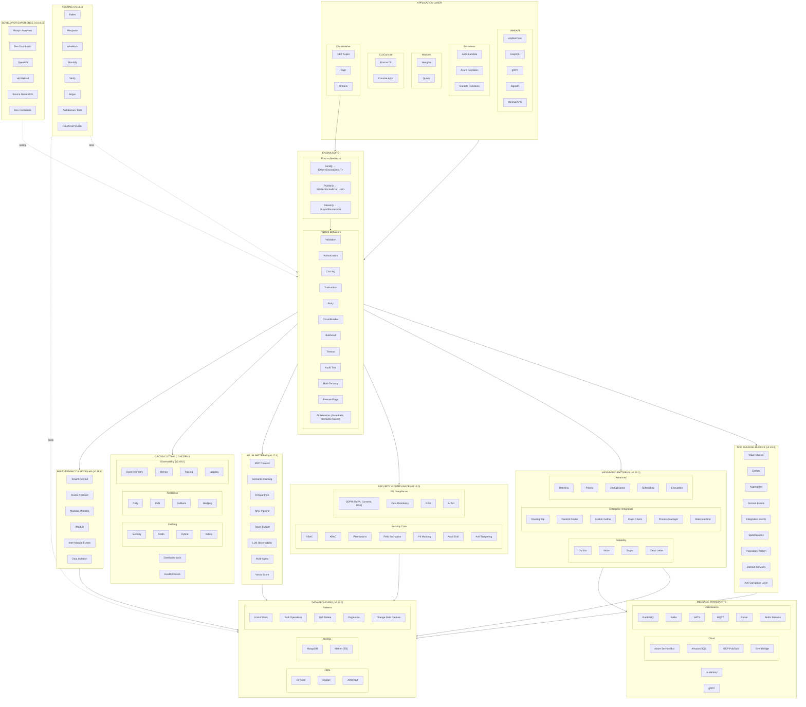

# Encina - Inventario Completo

> **Documento generado**: 29 de diciembre de 2025
> **Versión**: Pre-1.0 (Phase 2 reorganizada en 10 milestones: v0.10.0 → v0.19.0)
> **Propósito**: Inventario exhaustivo de todas las funcionalidades, patrones, paquetes y características de Encina

---

## Tabla de Contenidos

1. [Resumen Ejecutivo](#resumen-ejecutivo)
2. [Arquitectura General](#arquitectura-general)
3. [Paquetes por Categoría](#paquetes-por-categoría)
4. [Patrones Implementados](#patrones-implementados)
5. [Características por Ángulo](#características-por-ángulo)
6. [Features Pendientes (v0.10.0 → v0.19.0)](#features-pendientes-v0100--v0190)
7. [Matriz de Completitud](#matriz-de-completitud)

---

## Resumen Ejecutivo

### Estadísticas Globales

| Métrica | Valor |
|---------|-------|
| **Total de Paquetes** | 53 (+ 6 transportes planificados + 3 caching planificados + 5 tenancy planificados + 10 EDA planificados + 1 GDPR planificado + 16 microservices planificados + 8 security planificados + 14 compliance planificados + 9 TDD testing planificados) |
| **Patrones de Messaging** | 10 (+ 18 planificados) |
| **Patrones EDA Avanzados** | 0 (+ 12 planificados) |
| **Patrones DDD & Workflow** | 0 (+ 10 planificados) |
| **Domain Modeling Building Blocks** | 0 (+ 15 planificados: #367-#381) |
| **Patrones Microservices** | 0 (+ 12 planificados: #382-#393) |
| **Patrones Security** | 0 (+ 8 planificados: #394-#401) |
| **Patrones Compliance (GDPR/EU)** | 0 (+ 14 planificados: #402-#415) |
| **Patrones Event Sourcing** | 4 implementados (+ 13 planificados) |
| **Providers de Base de Datos** | 14 (+ 16 patrones planificados) |
| **Providers de Caching** | 8 (+ 13 mejoras planificadas) |
| **Transportes/Message Brokers** | 8 (+ 6 planificados: GCP, EventBridge, Pulsar, Redis Streams, ActiveMQ, Dapr) |
| **Integraciones Web/Serverless** | 6 |
| **Interfaces Públicas (Core)** | ~25 |
| **Pipeline Behaviors** | ~20+ |
| **Phase 2 Milestones** | 10 milestones (v0.10.0 → v0.19.0) |
| **v0.10.0 - DDD Foundations** | 31 issues ✅ **COMPLETADO** |
| **v0.11.0 - Testing Infrastructure** | 25 issues 🔄 En Progreso (12/25 completado) | 
| **v0.12.0 - Database & Repository** | 22 issues |
| **v0.13.0 - Security & Compliance** | 25 issues |
| **v0.14.0 - Cloud-Native & Aspire** | 23 issues |
| **v0.15.0 - Messaging & EIP** | 71 issues |
| **v0.16.0 - Multi-Tenancy & Modular** | 21 issues |
| **v0.17.0 - AI/LLM Patterns** | 16 issues |
| **v0.18.0 - Developer Experience** | 43 issues |
| **v0.19.0 - Observability & Resilience** | 87 issues |
| **Total Issues Phase 2** | 364 issues |

### Filosofía de Diseño

- **Railway Oriented Programming (ROP)**: `Either<EncinaError, T>` en todo el sistema
- **Pay-for-what-you-use**: Todos los patrones son opt-in
- **Provider-agnostic**: Mismas interfaces, diferentes implementaciones
- **.NET 10 Only**: Sin soporte para versiones anteriores
- **Zero Backward Compatibility**: Pre-1.0, cambios breaking aceptados

---

## Arquitectura General



### Leyenda de Milestones

| Color/Etiqueta | Milestone | Estado |
|----------------|-----------|--------|
| (sin etiqueta) | Implementado | ✅ Producción |
| **(v0.10.0)** | DDD Foundations | ✅ **COMPLETADO** |
| **(v0.11.0)** | Testing Infrastructure | 🔜 Próximo |
| **(v0.12.0)** | Database & Repository | 📋 Planificado |
| **(v0.13.0)** | Security & Compliance | 📋 Planificado |
| **(v0.14.0)** | Cloud-Native & Aspire | 📋 Planificado |
| **(v0.15.0)** | Messaging & EIP | 📋 Planificado |
| **(v0.16.0)** | Multi-Tenancy & Modular | 📋 Planificado |
| **(v0.17.0)** | AI/LLM Patterns | 📋 Planificado |
| **(v0.18.0)** | Developer Experience | 📋 Planificado |
| **(v0.19.0)** | Observability & Resilience | 📋 Planificado |

---

## Paquetes por Categoría

### 1. Core (2 paquetes)

| Paquete | Descripción | Estado |
|---------|-------------|--------|
| **Encina** | Core del mediador, CQRS, pipeline, handlers | ✅ Completo |
| **Encina.Messaging** | Abstracciones de patrones de mensajería | ✅ Completo |

#### Encina (Core) - Contenido Detallado

**Interfaces Principales:**
- `IEncina` - Mediador central
- `IRequest<TResponse>`, `ICommand<TResponse>`, `IQuery<TResponse>` - Contratos CQRS
- `INotification` - Eventos/señales
- `IRequestHandler<TRequest, TResponse>`, `ICommandHandler`, `IQueryHandler`
- `INotificationHandler<TNotification>`
- `IPipelineBehavior<TRequest, TResponse>`
- `IStreamPipelineBehavior<TRequest, TItem>`
- `IRequestPreProcessor<TRequest>`, `IRequestPostProcessor<TRequest, TResponse>`
- `IRequestContext` - Contexto con CorrelationId, UserId, TenantId, IdempotencyKey
- `IValidationProvider` - Abstracción de validación
- `IModule`, `IModuleRegistry`, `IModuleLifecycle` - Sistema de módulos
- `IFunctionalFailureDetector` - Detección de fallos funcionales
- `IEncinaMetrics` - Métricas

**Clases Principales:**
- `Encina` - Implementación del mediador
- `RequestContext` - Contexto inmutable
- `EncinaError` - Record struct para errores
- `EncinaErrors` - Factory de errores
- `ValidationResult`, `ValidationError` - Resultados de validación
- `ValidationOrchestrator`, `ValidationPipelineBehavior`

**Behaviors Incorporados:**
- `CommandActivityPipelineBehavior` - Trazas para comandos
- `QueryActivityPipelineBehavior` - Trazas para queries
- `CommandMetricsPipelineBehavior` - Métricas para comandos
- `QueryMetricsPipelineBehavior` - Métricas para queries

**Dispatchers:**
- `RequestDispatcher` - Despacho de requests
- `NotificationDispatcher` - Despacho de notificaciones (Sequential/Parallel/ParallelWhenAll)
- `StreamDispatcher` - Despacho de streaming

---

### 2. Messaging Patterns (1 paquete, 10 patrones implementados + 18 planificados)

#### Patrones Implementados

| Patrón | Descripción | Estado |
|--------|-------------|--------|
| **Outbox** | Publishing confiable (at-least-once) | ✅ Completo |
| **Inbox** | Procesamiento idempotente (exactly-once) | ✅ Completo |
| **Saga** | Transacciones distribuidas con compensación | ✅ Completo |
| **Scheduling** | Ejecución programada/recurrente | ✅ Completo |
| **Dead Letter Queue** | Manejo de fallos permanentes | ✅ Completo |
| **Recoverability** | Reintentos inteligentes (immediate + delayed) | ✅ Completo |
| **Routing Slip** | Enrutamiento dinámico de pasos | ✅ Completo |
| **Content Router** | Enrutamiento basado en contenido | ✅ Completo |
| **Scatter-Gather** | Distribución y agregación | ✅ Completo |
| **Choreography** | Event bus para sagas coreografiadas | ✅ Completo |

#### Patrones Planificados (Phase 2)

| Issue | Patrón | Descripción | Prioridad |
|-------|--------|-------------|-----------|
| **#121** | Message Batching | Procesar múltiples mensajes en una sola invocación | Alta |
| **#122** | Claim Check | Almacenar payloads grandes externamente | Alta |
| **#123** | Message Priority | Procesar mensajes de alta prioridad primero | Media |
| **#124** | Enhanced Deduplication | Estrategias de deduplicación (TimeWindow, ContentHash, etc.) | Media |
| **#125** | Multi-Tenancy Messaging | Aislamiento de mensajes por tenant (SaaS) | Alta |
| **#126** | Message TTL | Expiración automática de mensajes | Media |
| **#127** | Request/Response RPC | Comunicación estilo RPC sobre messaging | Media |
| **#128** | Saga Visibility | APIs de consulta, historial de pasos, métricas | Media |
| **#129** | Message Encryption | Encriptación de mensajes para compliance | Media |
| **#130** | Competing Consumers | Gestión de grupos de consumidores | Media |
| **#131** | Backpressure | Control de flujo cuando consumidores saturados | Media |
| **#132** | W3C Trace Context | Propagación de contexto distribuido OpenTelemetry | Media |
| **#133** | Recurring Messages | Mensajes recurrentes con expresiones cron | Media |
| **#134** | Message Versioning | Versionado y upcasting de mensajes | Media |
| **#135** | Poison Message Detection | Detección inteligente de mensajes tóxicos | Baja |
| **#298** | Claim Check Pattern | Almacenar payloads grandes externamente (EIP) | Alta |
| **#301** | Priority Queue Support | Procesar mensajes por prioridad (Outbox/Scheduling) | Media |
| **#302** | Batching/Bulk Operations | Procesar múltiples requests en batch | Media |

#### Detalle de Cada Patrón

**Outbox Pattern:**
- `IOutboxMessage`, `IOutboxStore`, `IOutboxMessageFactory`
- `OutboxOrchestrator`, `OutboxPostProcessor`
- Configuración: `OutboxOptions` (ProcessingInterval, BatchSize, MaxRetries, BaseRetryDelay)

**Inbox Pattern:**
- `IInboxMessage`, `IInboxStore`, `IInboxMessageFactory`
- `InboxOrchestrator`, `InboxPipelineBehavior`
- `IIdempotentRequest` - Marker interface
- Configuración: `InboxOptions` (MaxRetries, MessageRetentionPeriod, PurgeInterval)

**Saga Pattern:**
- `ISagaState`, `ISagaStore`, `ISagaStateFactory`
- `SagaOrchestrator` (Start, Advance, Complete, Compensate, Fail, Timeout)
- Estados: Running, Completed, Compensating, Compensated, Failed, TimedOut
- Configuración: `SagaOptions` (StuckSagaThreshold, DefaultSagaTimeout)

**Scheduling Pattern:**
- `IScheduledMessage`, `IScheduledMessageStore`
- `SchedulerOrchestrator`
- Soporte para CRON y mensajes recurrentes
- Configuración: `SchedulingOptions` (ProcessingInterval, BatchSize, EnableRecurringMessages)

**Dead Letter Queue:**
- `IDeadLetterMessage`, `IDeadLetterStore`, `IDeadLetterManager`
- `DeadLetterOrchestrator`
- Replay individual y batch
- Configuración: `DeadLetterOptions`

**Recoverability:**
- `IErrorClassifier`, `IDelayedRetryScheduler`
- `RecoverabilityPipelineBehavior`
- Dos fases: Immediate retries + Delayed retries
- Jitter configurable
- Configuración: `RecoverabilityOptions` (ImmediateRetries, DelayedRetries, UseExponentialBackoff)

**Routing Slip:**
- `IRoutingSlipRunner`, `IRoutingSlipState`, `IRoutingSlipStore`
- `RoutingSlipBuilder<TData>` - Fluent API
- Capacidad de añadir/remover pasos dinámicamente
- Activity log completo

**Content Router:**
- `IContentRouter`
- `ContentRouterBuilder<TMessage, TResult>` - Fluent API
- Prioridades, metadata, default routes

**Scatter-Gather:**
- `IScatterGatherRunner`
- `ScatterGatherBuilder<TRequest, TResponse>` - Fluent API
- Estrategias: WaitForAll, WaitForFirst, WaitForQuorum, WaitForAllAllowPartial
- Ejecución paralela o secuencial

**Choreography:**
- `IChoreographyEventBus`, `IChoreographyState`, `IChoreographyStateStore`
- Event-driven sagas sin orquestador central

#### Nuevos Patrones de Mensajería Planificados (Diciembre 2025)

**#298 - Claim Check Pattern** (Alta Prioridad):
- Enterprise Integration Pattern para payloads grandes (>256KB)
- `IClaimCheckStore` para almacenar payloads externamente
- `[ClaimCheck]` attribute con ThresholdBytes y ExpiryDays
- `ClaimCheckPipelineBehavior` para manejo automático
- Providers: Azure Blob, S3, File System, In-Memory
- Labels: `pattern-claim-check`, `area-eip`, `area-messaging`, `area-scalability`

**#301 - Priority Queue Support** (Media Prioridad):
- `MessagePriority` enum (Critical, High, Normal, Low, Background)
- `[MessagePriority]` attribute para requests/notifications
- Priority-aware batch fetching en Outbox y Scheduling
- Configuración de intervalos de procesamiento por prioridad
- Labels: `area-messaging`, `area-scheduling`, `area-scalability`

**#302 - Batching/Bulk Operations** (Media Prioridad):
- `IBatchHandler<TRequest, TResponse>` para handlers de batch
- `IBatchableRequest<TResponse>` marker interface
- `IBatchDispatcher` para envío de batches
- `BatchingPipelineBehavior` con auto-batching
- `[BatchOptions]` con MaxBatchSize, MaxDelayMs
- Estrategias de fallo: Individual, FailAll, RetryFailed
- Labels: `area-bulk-operations`, `area-messaging`, `area-performance`

---

### 2.6. Advanced EDA Patterns (12 patrones planificados - Diciembre 2025)

Esta nueva categoría agrupa patrones avanzados de Event-Driven Architecture identificados en la investigación de frameworks líderes (MassTransit, Wolverine, Axon, Temporal, Debezium) y tendencias de la comunidad .NET en 2025.

#### Patrones Planificados (Phase 2)

| Issue | Patrón | Descripción | Prioridad | Complejidad |
|-------|--------|-------------|-----------|-------------|
| **#308** | CDC (Change Data Capture) | Captura de cambios en base de datos como eventos | Alta | Alta |
| **#309** | Schema Registry Integration | Governance de esquemas de eventos | Alta | Media |
| **#310** | Event Mesh / Event Gateway | Distribución empresarial de eventos | Alta | Alta |
| **#311** | Claim Check Pattern | Almacenamiento externo para payloads grandes | Media | Media |
| **#312** | Domain vs Integration Events | Separación clara de tipos de eventos | Alta | Baja |
| **#313** | Event Correlation & Causation | Trazabilidad completa de flujos de eventos | Alta | Baja |
| **#314** | Temporal Queries (Time Travel) | Consultas de estado en cualquier punto del tiempo | Media | Media |
| **#315** | Durable Execution / Workflow Engine | Motor de workflows duraderos (Temporal-inspired) | Alta | Muy Alta |
| **#316** | Event Enrichment Pipeline | Enriquecimiento de eventos antes de proyecciones | Alta | Baja |
| **#317** | Process Manager Pattern | Coordinación de agregados múltiples | Media | Media |
| **#318** | Event Streaming Abstractions | Suscripción a streams de eventos | Media | Media |
| **#319** | Idempotency Key Generator | Generación estandarizada de claves de idempotencia | Alta | Baja |

#### Detalle de Cada Patrón

##### Infrastructure Patterns

**#308 - CDC (Change Data Capture) Pattern** (Alta Prioridad):
- `ICdcConnector` para streaming de cambios de base de datos
- `IChangeEventHandler<TEntity>` para HandleInsert/Update/Delete
- `ChangeEvent` con Operation, Before, After, Metadata
- **Nuevos paquetes planificados**: `Encina.CDC`, `Encina.CDC.Debezium`, `Encina.CDC.SqlServer`, `Encina.CDC.PostgreSQL`
- **Use case**: Migración con Strangler Fig, sincronización sin modificar aplicaciones
- Labels: `area-cdc`, `area-microservices`, `industry-best-practice`, `aot-compatible`
- Referencias: [Debezium](https://debezium.io/), [CDC CQRS Pattern](https://debezium.io/blog/2025/11/28/cqrs/)

**#309 - Schema Registry Integration** (Alta Prioridad):
- `ISchemaRegistry` con GetSchema, RegisterSchema, CheckCompatibility
- `SchemaDefinition` con Format (Avro, Protobuf, JsonSchema)
- `CompatibilityResult` para validación forward/backward
- **Nuevos paquetes planificados**: `Encina.SchemaRegistry`, `Encina.SchemaRegistry.Confluent`, `Encina.SchemaRegistry.Azure`
- **Use case**: Governance de eventos, evolución de esquemas, CI/CD
- Labels: `area-schema-registry`, `transport-kafka`, `area-compliance`, `industry-best-practice`
- Referencias: [Confluent Schema Registry](https://docs.confluent.io/platform/current/schema-registry/index.html)

**#310 - Event Mesh / Event Gateway** (Alta Prioridad):
- `IEventMesh` para PublishToMesh, Subscribe, GetTopology
- `IEventGateway` para Route, TransformAndForward
- Cross-transport routing (Kafka → RabbitMQ → Azure SB)
- **Nuevos paquetes planificados**: `Encina.EventMesh`, `Encina.EventMesh.Dapr`, `Encina.EventMesh.CloudEvents`
- **Use case**: Arquitecturas empresariales multi-bounded-context
- Labels: `area-cloud-native`, `area-integration`, `industry-best-practice`
- Referencias: [Solace Event Mesh](https://solace.com/), [Apache EventMesh](https://eventmesh.apache.org/)

##### DDD & Domain Patterns

**#311 - Claim Check Pattern** (Media Prioridad):
- `IClaimCheckStore` con Store/Retrieve/Delete
- `ClaimTicket` con Id, StoreType, ExpiresAtUtc
- `[ClaimCheck]` attribute con ThresholdBytes
- **Nuevos paquetes planificados**: `Encina.ClaimCheck`, `Encina.ClaimCheck.AzureBlob`, `Encina.ClaimCheck.S3`
- **Use case**: Eventos con payloads grandes (>256KB)
- Labels: `area-eip`, `area-performance`, `cloud-azure`, `cloud-aws`
- Referencias: [Azure Claim Check Pattern](https://learn.microsoft.com/en-us/azure/architecture/patterns/claim-check)

**#312 - Domain Events vs Integration Events** (Alta Prioridad):
- `IDomainEvent : INotification` para eventos in-process
- `IIntegrationEvent : INotification` con EventId, Version
- `IEventTranslator<TDomain, TIntegration>` para Anti-Corruption Layer
- `IDomainEventToIntegrationEventDispatcher` para traducción automática
- **Use case**: Separación clara de bounded contexts, DDD puro
- Labels: `area-ddd`, `area-event-sourcing`, `area-modular-monolith`, `area-microservices`
- Referencias: [Milan Jovanovic - Domain vs Integration Events](https://www.milanjovanovic.tech/blog)

**#313 - Event Correlation & Causation Tracking** (Alta Prioridad):
- `IEventMetadata` con EventId, CorrelationId, CausationId, Timestamp
- `IEventMetadataAccessor` para crear/acceder metadata
- `EventCorrelationPipelineBehavior` para propagación automática
- OpenTelemetry integration con span tags
- **Use case**: Trazabilidad end-to-end, debugging distribuido
- Labels: `area-observability`, `netflix-pattern`, `industry-best-practice`
- Referencias: [OpenTelemetry Correlation](https://opentelemetry.io/docs/concepts/signals/traces/)

##### Temporal & Query Patterns

**#314 - Temporal Queries (Time Travel)** (Media Prioridad):
- `ITemporalRepository<T>` con GetAt(pointInTime), GetAtVersion
- `GetHistoryAsync` para stream de eventos filtrado
- `AggregateDiff<T>` para comparar estados
- **Use case**: Auditoría, debugging, what-if scenarios
- Labels: `area-event-sourcing`, `area-compliance`, `industry-best-practice`
- Referencias: [Axon Framework Temporal Queries](https://docs.axoniq.io/)

**#316 - Event Enrichment Pipeline** (Alta Prioridad):
- `IEventEnricher<TEvent>` para enriquecimiento individual
- `IBatchEventEnricher` para batch lookup (evitar N+1)
- `EnrichmentContext` con StreamId, Version, Services
- **Use case**: Proyecciones que necesitan datos de referencia
- Labels: `area-event-sourcing`, `area-performance`, `area-pipeline`
- Referencias: [Marten Event Enrichment](https://jeremydmiller.com/2025/09/17/event-enrichment-in-marten-projections/)

##### Workflow & Coordination Patterns

**#315 - Durable Execution / Workflow Engine** (Alta Prioridad - Muy Alta Complejidad):
- `IDurableWorkflow<TInput, TOutput>` interface
- `IWorkflowContext` con ExecuteActivity, Sleep, WaitForSignal
- `IWorkflowRunner` para Start, GetHandle
- `WorkflowHandle<T>` con GetResult, Signal, Cancel
- **Nuevos paquetes planificados**: `Encina.DurableExecution`, `Encina.DurableExecution.EntityFrameworkCore`
- **Use case**: Workflows que sobreviven reinicios (días/semanas)
- Labels: `area-workflow`, `temporal-pattern`, `uber-pattern`, `netflix-pattern`
- Referencias: [Temporal.io](https://temporal.io/), [Azure Durable Functions](https://learn.microsoft.com/en-us/azure/azure-functions/durable/)

**#317 - Process Manager Pattern** (Media Prioridad):
- `IProcessManager<TState>` con ProcessId, State, IsComplete
- `ProcessManagerBase<TState>` con CommandsToDispatch
- `IProcessManagerStore` para persistence
- **Diferencia con Saga**: Coordinación de agregados a largo plazo, event-driven
- Labels: `area-saga`, `area-event-sourcing`, `area-coordination`
- Referencias: [EIP Process Manager](https://www.enterpriseintegrationpatterns.com/patterns/messaging/ProcessManager.html)

##### Streaming & Idempotency Patterns

**#318 - Event Streaming Abstractions** (Media Prioridad):
- `IEventStreamPublisher` con Append, AppendBatch
- `IEventStreamSubscription` con Consume, Acknowledge
- Consumer groups, position tracking, replay
- **Use case**: Streaming de eventos como first-class citizen
- Labels: `area-event-streaming`, `transport-kafka`, `transport-redis`, `netflix-pattern`
- Referencias: [RabbitMQ Streams](https://www.rabbitmq.com/docs/streams), [Kafka Streams](https://kafka.apache.org/documentation/streams/)

**#319 - Idempotency Key Generator** (Alta Prioridad):
- `IIdempotencyKeyGenerator` con Generate, GenerateFromParts
- `[IdempotencyKey]` attribute con Properties, Namespace, Format
- Estrategias: Hash (SHA256), Composite, UUID v5
- Integración con `IIdempotentRequest` y `InboxPipelineBehavior`
- **Use case**: Exactly-once execution de APIs y handlers
- Labels: `area-idempotency`, `stripe-pattern`, `uber-pattern`, `netflix-pattern`
- Referencias: [Stripe Idempotency](https://stripe.com/docs/api/idempotent_requests)

#### Labels Nuevas Creadas (6)

| Label | Descripción | Color |
|-------|-------------|-------|
| `area-schema-registry` | Schema Registry and event schema governance | #9B59B6 |
| `area-event-streaming` | Event streaming and persistent log patterns | #1ABC9C |
| `area-idempotency` | Idempotency and exactly-once processing | #3498DB |
| `uber-pattern` | Pattern inspired by Uber engineering | #000000 |
| `stripe-pattern` | Pattern inspired by Stripe engineering | #635BFF |
| `temporal-pattern` | Pattern inspired by Temporal.io | #8B5CF6 |

#### Orden de Implementación Recomendado

1. **Quick Wins (Alta Prioridad - Baja Complejidad)**:
   - #312 (Domain/Integration Events) - Fundamental para DDD
   - #313 (Correlation/Causation) - Observabilidad crítica
   - #316 (Event Enrichment) - Performance de proyecciones
   - #319 (Idempotency Keys) - Base para exactly-once

2. **High Value (Alta Prioridad - Media/Alta Complejidad)**:
   - #308 (CDC) - Integración enterprise
   - #309 (Schema Registry) - Governance de eventos
   - #311 (Claim Check) - Large payloads

3. **Strategic (Media Prioridad)**:
   - #310 (Event Mesh) - Arquitectura empresarial
   - #314 (Temporal Queries) - Auditoría avanzada
   - #317 (Process Manager) - Workflows complejos
   - #318 (Event Streaming) - Streaming patterns

4. **Major Investment (Alta Complejidad)**:
   - #315 (Durable Execution) - Implementar post-quick-wins

#### Referencias de Investigación (Diciembre 2025)

- [MassTransit 2025](https://masstransit.io/) - Ahora con licencia comercial v9+
- [Wolverine 5.0](https://jeremydmiller.com/2025/10/23/wolverine-5-0-is-here/) - MIT licensed, Marten integration
- [Temporal.io](https://temporal.io/) - Durable execution platform
- [Debezium 2025](https://debezium.io/) - CDC leader
- [Axon Framework](https://www.axoniq.io/) - Event sourcing y CQRS
- [Milan Jovanovic Blog](https://www.milanjovanovic.tech/) - .NET patterns
- [Architecture Weekly](https://www.architecture-weekly.com/) - Deduplication patterns
- [Netflix Tech Blog](https://netflixtechblog.com/) - Event streaming at scale

---

### 2.7. Advanced DDD & Workflow Patterns (10 patrones planificados - Diciembre 2025)

Esta nueva categoría agrupa patrones avanzados de Domain-Driven Design, workflow orchestration, y cross-cutting concerns identificados en la investigación de frameworks líderes (.NET y otros ecosistemas) realizada el 29 de diciembre de 2025.

#### Patrones Planificados (Phase 2)

| Issue | Patrón | Descripción | Prioridad | Complejidad |
|-------|--------|-------------|-----------|-------------|
| **#295** | Specification Pattern | Encapsular queries en objetos reutilizables | Alta | Media |
| **#296** | Process Manager | Workflow orchestration con decisiones dinámicas | Alta | Alta |
| **#297** | State Machine (FSM) | Máquina de estados fluent para ciclo de vida | Alta | Media |
| **#299** | Anti-Corruption Layer | Protección del dominio contra APIs externas | Alta | Media |
| **#300** | Feature Flags | Integración con Microsoft.FeatureManagement | Media | Baja |
| **#303** | Durable Execution | Checkpointing para workflows de larga duración | Media | Alta |
| **#304** | Multi-Tenancy Pipeline | Aislamiento automático de tenants | Media | Media |
| **#305** | AI Agent Orchestration | Orquestación de agentes LLM (Semantic Kernel) | Baja | Alta |
| **#306** | Integration Events | Eventos tipados inter-módulo (Modular Monolith) | Baja | Media |
| **#307** | Request Versioning | Versionado y upcasting de requests | Baja | Media |

#### Detalle de Cada Patrón

##### DDD Patterns

**#295 - Specification Pattern** (Alta Prioridad):
- `ISpecification<T>` con Criteria, Includes, OrderBy, Paging
- `Specification<T>` base class con fluent builder
- Composición: AND/OR/NOT operators
- `ISpecificationQuery<T, TResponse>` para queries tipadas
- `SpecificationQueryBehavior` para aplicación automática
- Providers: EF Core evaluator, Dapper SQL generator
- Inspirado en [Ardalis.Specification](https://github.com/ardalis/Specification)
- Labels: `pattern-specification`, `area-ddd`, `area-repository`, `area-cqrs`, `industry-best-practice`

**#299 - Anti-Corruption Layer (ACL)** (Alta Prioridad):
- `IAntiCorruptionLayer<TExternal, TInternal>` interface
- `IAsyncAntiCorruptionLayer` para traducciones async
- `IExternalRequest<TResponse>` marker interface
- `AntiCorruptionLayerBehavior` para traducción automática
- `IExternalEventTranslator` para eventos de integración
- Patrón DDD de Eric Evans para proteger el dominio
- Labels: `pattern-acl`, `area-ddd`, `area-integration`, `area-microservices`, `industry-best-practice`

##### Workflow Patterns

**#296 - Process Manager Pattern** (Alta Prioridad):
- `IProcessManager<TData>` interface
- `ProcessManagerDefinition<TData>` base class
- `ProcessDecision` types: Continue, Wait, Branch, Complete, Compensate, Fail
- `IProcessManagerStore` con EF Core implementation
- Background processor para avance de procesos
- Diferencia con Saga: decisiones dinámicas en runtime
- Inspirado en [EIP Process Manager](https://www.enterpriseintegrationpatterns.com/patterns/messaging/ProcessManager.html)
- Labels: `pattern-process-manager`, `area-saga`, `area-workflow`, `area-eip`, `masstransit-inspired`

**#297 - State Machine Pattern (Fluent FSM)** (Alta Prioridad):
- `StateMachineBuilder<TState, TTrigger>` fluent API
- `StateConfiguration` con Permit, PermitIf, Ignore, PermitReentry
- Entry/Exit actions (sync y async)
- Substates (estados jerárquicos)
- External state accessor para ORM integration
- `Either<EncinaError, Unit>` para transiciones fallidas
- DOT graph export para visualización
- Inspirado en [Stateless](https://github.com/dotnet-state-machine/stateless)
- Labels: `pattern-state-machine`, `area-saga`, `area-workflow`, `masstransit-inspired`

**#303 - Durable Execution / Checkpointing** (Media Prioridad):
- `IDurableContext` con ExecuteActivityAsync, WaitForEventAsync, CreateTimerAsync
- `IDurableWorkflow<TInput, TOutput>` interface
- `IDurableWorkflowState` con history para replay
- `IDurableWorkflowClient` para gestión de workflows
- Checkpointing automático por actividad
- Tiempo y GUIDs determinísticos para replay
- Background processor para continuación
- Inspirado en [Azure Durable Functions](https://learn.microsoft.com/en-us/azure/azure-functions/durable/durable-functions-overview) y [Temporal](https://temporal.io/)
- Labels: `pattern-durable-execution`, `area-workflow`, `temporal-inspired`, `cloud-azure`

##### Cross-Cutting Patterns

**#300 - Feature Flag Integration** (Media Prioridad):
- `[FeatureGate]` attribute con FeatureName y Behavior
- `FeatureFlagPipelineBehavior` para short-circuit
- Integración con Microsoft.FeatureManagement
- Contextual targeting via IRequestContext
- Fallback handler support
- Use cases: dark deployments, canary releases, A/B testing
- Labels: `pattern-feature-flags`, `area-feature-management`, `area-pipeline`, `cloud-azure`

**#304 - Multi-Tenancy Pipeline Behavior** (Media Prioridad):
- `ITenantScopedQuery<TResponse>` marker interface
- `ITenantScopedCommand<TResponse>` marker interface
- `ITenantEntity` para entidades multi-tenant
- `TenantIsolationPipelineBehavior` para enforcement automático
- `ITenantValidator` con ownership validation
- EF Core global query filter extension
- `[AllowCrossTenant]` para escenarios admin
- Labels: `area-multi-tenancy`, `area-security`, `area-compliance`, `area-gdpr`, `industry-best-practice`

**#307 - Request Versioning Pattern** (Baja Prioridad):
- `[RequestVersion]` attribute
- `IUpgradableFrom<TOldVersion>` interface
- `IRequestUpcasterRegistry` service
- `RequestVersioningBehavior` para auto-upgrade
- `[DeprecatedRequest]` con warnings
- Serialization support para Scheduling
- Inspirado en Marten Event Upcasting
- Labels: `pattern-versioning`, `area-messaging`, `area-event-sourcing`

##### Emerging Patterns (Future)

**#305 - AI/LLM Agent Orchestration** (Baja Prioridad - Futuro):
- `IAgentHandler<TRequest, TResponse>` con capabilities
- Orchestration patterns: Sequential, Concurrent, Handoff
- `IAgentSelector` para routing dinámico
- Semantic Kernel adapter
- Token usage tracking
- Nuevo paquete: `Encina.Agents.SemanticKernel`
- Inspirado en [Microsoft Agent Framework](https://learn.microsoft.com/en-us/agent-framework/overview/agent-framework-overview) (Oct 2025)
- Labels: `area-ai-ml`, `area-workflow`, `new-package`
- **Ampliado significativamente en Issue #487** (29 Dic 2025) - Multi-Agent Orchestration Patterns

**#306 - Modular Monolith Integration Events** (Baja Prioridad):
- `IIntegrationEvent` con EventId, OccurredAtUtc, SourceModule
- `IntegrationEventBase` base record
- `IModuleEventBus` para publicación in-process
- `IIntegrationEventHandler<TEvent>` interface
- `IModuleEventCatalog` para descubrimiento de eventos
- Outbox integration para reliability
- Dependency validation on startup
- Extiende el Module System existente
- Inspirado en [Spring Modulith 2.0](https://junkangworld.com/blog/5-game-changing-spring-modulith-20-features-for-2025)
- Labels: `area-modular-monolith`, `area-messaging`, `area-microservices`

#### Labels Nuevas Creadas (12)

| Label | Descripción | Color |
|-------|-------------|-------|
| `pattern-specification` | Specification pattern for query composition | #2E8B57 |
| `pattern-process-manager` | Process Manager workflow orchestration pattern | #8B008B |
| `pattern-state-machine` | Finite State Machine pattern | #3CB371 |
| `pattern-claim-check` | Claim Check pattern for large payloads | #DAA520 |
| `pattern-acl` | Anti-Corruption Layer pattern for domain protection | #B22222 |
| `pattern-feature-flags` | Feature Flags/Feature Toggles pattern | #32CD32 |
| `pattern-durable-execution` | Durable Execution and checkpointing pattern | #0D2192 |
| `pattern-versioning` | Request/Event versioning and upcasting pattern | #6F42C1 |
| `area-feature-management` | Feature flag management and toggles | #32CD32 |
| `area-workflow` | Workflow and process orchestration | #8B008B |
| `temporal-inspired` | Pattern inspired by Temporal.io | #0D2192 |
| `masstransit-inspired` | Pattern inspired by MassTransit library | #8B008B |

#### Orden de Implementación Recomendado

1. **Inmediato (Alta Prioridad - DDD foundations)**:
   - #295 (Specification) - Complementa repository pattern existente
   - #297 (State Machine) - Competir con MassTransit Automatonymous
   - #298 (Claim Check) - Bajo esfuerzo, alto impacto

2. **Corto plazo (Alta-Media Prioridad)**:
   - #296 (Process Manager) - Workflows complejos
   - #299 (ACL) - Integraciones enterprise
   - #300 (Feature Flags) - DevOps moderno

3. **Medio plazo (Media Prioridad)**:
   - #301 + #302 (Priority + Batching) - Performance
   - #303 (Durable Execution) - Long-running workflows
   - #304 (Multi-Tenancy) - Mercado SaaS

4. **Largo plazo (Baja Prioridad - Post 1.0 evaluation)**:
   - #305 (AI Agents) - Evaluar madurez Microsoft Agent Framework
   - #306 (Integration Events) - Cuando Module System sea más adoptado
   - #307 (Request Versioning) - Necesario post-1.0 para compatibility

#### Referencias de Investigación

- [Ardalis.Specification](https://github.com/ardalis/Specification) - Specification pattern gold standard
- [Stateless](https://github.com/dotnet-state-machine/stateless) - State machine library (6k+ stars)
- [MassTransit Automatonymous](https://masstransit.io/documentation/patterns/saga) - Saga state machines
- [Enterprise Integration Patterns](https://www.enterpriseintegrationpatterns.com/) - Process Manager, Claim Check
- [Azure Durable Functions](https://learn.microsoft.com/en-us/azure/azure-functions/durable/durable-functions-overview) - Durable execution
- [Temporal](https://temporal.io/) - Durable workflow engine
- [Microsoft.FeatureManagement](https://github.com/microsoft/FeatureManagement-Dotnet) - Feature flags
- [Microsoft Agent Framework](https://learn.microsoft.com/en-us/agent-framework/) - AI agent orchestration
- [Spring Modulith 2.0](https://junkangworld.com/blog/5-game-changing-spring-modulith-20-features-for-2025) - Integration events
- [Anti-Corruption Layer - Azure](https://learn.microsoft.com/en-us/azure/architecture/patterns/anti-corruption-layer) - ACL pattern

---

### 2.8. Domain Modeling Building Blocks (15 patrones planificados - Diciembre 2025)

Nueva categoría que agrupa los bloques tácticos de Domain-Driven Design: Value Objects, Entities, Aggregates, Specifications, Business Rules, etc. Identificados en investigación de la comunidad .NET (Diciembre 2025) basándose en demanda de Vogen (~5M downloads), Ardalis.Specification (~7M downloads), StronglyTypedId (~3M downloads), y frameworks como ABP.

**Nuevo paquete planificado**: `Encina.DomainModeling`

#### Patrones Planificados (Phase 2)

| Issue | Patrón | Descripción | Prioridad | Complejidad | Labels Principales |
|-------|--------|-------------|-----------|-------------|-------------------|
| **#367** | Value Objects | Base class con igualdad estructural e inmutabilidad | Critical | Media | `foundational`, `aot-compatible` |
| **#368** | Rich Domain Events | DomainEvent con metadata (CorrelationId, Causation, Version) | Critical | Media | `foundational`, `area-messaging` |
| **#369** | Entity Base Class | Entity<TId> con igualdad por identidad | Critical | Baja | `foundational`, `aot-compatible` |
| **#370** | AggregateRoot | Provider-agnostic AggregateRoot con domain events | Critical | Media | `foundational`, `area-messaging` |
| **#371** | Specification Pattern | Queries composables con And/Or/Not | Alta | Media | `new-package`, `area-specifications` |
| **#372** | Business Rules | Validación de reglas de dominio (separada de input validation) | Alta | Baja | `foundational`, `area-validation` |
| **#373** | Integration Events | Eventos de integración cross-bounded-context | Alta | Media | `area-modular-monolith`, `area-microservices` |
| **#374** | Strongly Typed IDs | StronglyTypedId<TValue> para type-safe identifiers | Alta | Media | `foundational`, `aot-compatible` |
| **#375** | Soft Delete | ISoftDeletable con auto-filtering | Alta | Baja | `area-auditing`, `area-gdpr` |
| **#376** | Auditing | IAudited con CreatedBy/ModifiedBy auto-population | Media | Baja | `area-auditing`, `area-compliance` |
| **#377** | Domain Service | IDomainService marker interface | Media | Baja | `aot-compatible` |
| **#378** | Anti-Corruption Layer | IAntiCorruptionTranslator para integración externa | Baja | Media | `area-integration`, `area-microservices` |
| **#379** | Bounded Context | BoundedContext helpers y ContextMap | Baja | Media | `area-modular-monolith` |
| **#380** | Generic Repository | IRepository<T,TId> provider-agnostic | Baja | Media | `area-specifications` |
| **#381** | Domain DSL | DomainBuilder y fluent helpers para ubiquitous language | Baja | Media | `aot-compatible` |

#### Detalle de Patrones Críticos (P0)

##### #367 - Value Objects Base Class

```csharp
// Encina.DomainModeling
public abstract record ValueObject<T> where T : ValueObject<T>
{
    protected abstract IEnumerable<object> GetEqualityComponents();

    public virtual bool Equals(T? other)
    {
        if (other is null) return false;
        return GetEqualityComponents()
            .SequenceEqual(other.GetEqualityComponents());
    }
}

// Uso con ROP:
public sealed record Email : ValueObject<Email>
{
    public string Value { get; }
    private Email(string value) => Value = value;

    public static Either<EncinaError, Email> Create(string value)
    {
        if (string.IsNullOrWhiteSpace(value))
            return EncinaErrors.Validation("Email cannot be empty");
        return new Email(value);
    }

    protected override IEnumerable<object> GetEqualityComponents()
    {
        yield return Value.ToLowerInvariant();
    }
}
```

**Por qué importa**: Previene "primitive obsession", encapsula invariantes a nivel de tipo. Vogen tiene ~5M descargas - alta demanda.

##### #368 - Rich Domain Events

```csharp
public abstract record DomainEvent : INotification
{
    public Guid EventId { get; init; } = Guid.NewGuid();
    public DateTime OccurredAtUtc { get; init; } = DateTime.UtcNow;
    public int EventVersion { get; init; } = 1;
    public string? CorrelationId { get; init; }
    public string? CausationId { get; init; }
    public Guid AggregateId { get; init; }
    public long AggregateVersion { get; init; }
}
```

**Por qué importa**: Central para event-driven DDD, trazabilidad, event sourcing, debugging en producción.

##### #369 - Entity Base Class

```csharp
public abstract class Entity<TId> : IEquatable<Entity<TId>>
    where TId : notnull
{
    public TId Id { get; protected set; } = default!;

    public bool Equals(Entity<TId>? other) =>
        other is not null && Id.Equals(other.Id);

    public override int GetHashCode() => Id?.GetHashCode() ?? 0;
}
```

**Por qué importa**: Igualdad por identidad, separación de entidades simples vs aggregates.

##### #370 - Provider-Agnostic AggregateRoot

```csharp
public abstract class AggregateRoot<TId> : Entity<TId>, IAggregateRoot
{
    private readonly List<DomainEvent> _domainEvents = [];

    public IReadOnlyCollection<DomainEvent> DomainEvents => _domainEvents.AsReadOnly();
    public long Version { get; protected set; }

    protected void RaiseDomainEvent(DomainEvent @event)
    {
        _domainEvents.Add(@event with { AggregateVersion = Version + 1 });
    }

    public void ClearDomainEvents() => _domainEvents.Clear();

    protected void CheckRule(IBusinessRule rule)
    {
        if (!rule.IsSatisfied())
            throw new BusinessRuleViolationException(rule);
    }
}
```

**Por qué importa**: El actual `AggregateBase` en Marten es solo para event sourcing. Este es provider-agnostic para EF Core, Dapper, etc.

#### Detalle de Patrones de Alta Prioridad (P1)

##### #371 - Specification Pattern

```csharp
public abstract class Specification<T>
{
    public abstract Expression<Func<T, bool>> ToExpression();

    public Specification<T> And(Specification<T> other)
        => new AndSpecification<T>(this, other);
    public Specification<T> Or(Specification<T> other)
        => new OrSpecification<T>(this, other);
    public Specification<T> Not()
        => new NotSpecification<T>(this);
}

// Uso:
var spec = new ActiveOrdersSpec()
    .And(new HighValueSpec(1000))
    .And(new RecentOrdersSpec(30));

var orders = dbContext.Orders.Where(spec.ToExpression());
```

**Paquete nuevo**: `Encina.Specifications` + `Encina.Specifications.EntityFrameworkCore`

##### #372 - Business Rules (Separadas de Input Validation)

```csharp
public interface IBusinessRule
{
    string ErrorCode { get; }
    string ErrorMessage { get; }
    bool IsSatisfied();
}

// Extensión ROP:
public static Either<EncinaError, Unit> Check(this IBusinessRule rule)
{
    return rule.IsSatisfied()
        ? Unit.Default
        : EncinaErrors.BusinessRule(rule.ErrorCode, rule.ErrorMessage);
}

// Uso en aggregate:
public void PlaceOrder()
{
    CheckRule(new OrderMustHaveItemsRule(this));
    Status = OrderStatus.Placed;
    RaiseDomainEvent(new OrderPlacedEvent(Id, Total));
}
```

**Por qué importa**: Encina ya tiene input validation (FluentValidation). Esto es validación de invariantes de dominio.

##### #373 - Integration Events

```csharp
public abstract record IntegrationEvent
{
    public Guid EventId { get; init; } = Guid.NewGuid();
    public DateTime OccurredAtUtc { get; init; } = DateTime.UtcNow;
    public int SchemaVersion { get; init; } = 1;
    public string SourceBoundedContext { get; init; } = string.Empty;
}

public interface IDomainToIntegrationEventMapper<in TDomain, out TIntegration>
    where TDomain : DomainEvent
    where TIntegration : IntegrationEvent
{
    TIntegration Map(TDomain domainEvent);
}
```

**Por qué importa**: Separa eventos internos (DomainEvent) de externos (IntegrationEvent). Bounded context isolation.

##### #374 - Strongly Typed IDs

```csharp
public abstract record StronglyTypedId<TValue>(TValue Value)
    where TValue : notnull
{
    public override string ToString() => Value.ToString()!;
    public static implicit operator TValue(StronglyTypedId<TValue> id) => id.Value;
}

public sealed record OrderId(Guid Value) : StronglyTypedId<Guid>(Value)
{
    public static OrderId New() => new(Guid.NewGuid());
}

// Type safety - compile error si mezclas OrderId con CustomerId
void ProcessOrder(OrderId orderId, CustomerId customerId) { }
```

**Por qué importa**: StronglyTypedId tiene ~3M descargas. Previene bugs de mezclar IDs.

##### #375 - Soft Delete Pattern

```csharp
public interface ISoftDeletable
{
    bool IsDeleted { get; set; }
    DateTime? DeletedAtUtc { get; set; }
    string? DeletedBy { get; set; }
}

// Auto-filtering via EF Core global query filter
// Pipeline behavior para queries
```

**Por qué importa**: Compliance (GDPR), data recovery, audit trails.

#### Detalle de Patrones de Media/Baja Prioridad (P2-P3)

##### #376 - Auditing

```csharp
public interface IAudited
{
    DateTime CreatedAtUtc { get; set; }
    string? CreatedBy { get; set; }
    DateTime? LastModifiedAtUtc { get; set; }
    string? LastModifiedBy { get; set; }
}

// Auto-population via EF Core SaveChanges interceptor
// Usa IRequestContext.UserId
```

##### #377 - Domain Service Marker

```csharp
public interface IDomainService { }

// Uso semántico y auto-registration:
public class OrderPricingService : IDomainService
{
    public Either<EncinaError, decimal> CalculateTotal(Order order, IEnumerable<Discount> discounts)
    {
        // Lógica de dominio compleja
    }
}
```

##### #378 - Anti-Corruption Layer

```csharp
public interface IAntiCorruptionTranslator<TExternal, TDomain>
{
    Either<EncinaError, TDomain> Translate(TExternal external);
}

// Protege el dominio de sistemas legacy/externos
```

##### #379 - Bounded Context Helpers

```csharp
[BoundedContext("Orders")]
public sealed class OrdersContext : BoundedContext
{
    public override void Configure(IServiceCollection services) { ... }
}

public sealed class ContextMap
{
    public ContextMap AddRelation(string upstream, string downstream,
        ContextRelationship relationship) { ... }
}
```

##### #380 - Generic Repository

```csharp
public interface IRepository<TAggregate, TId>
    where TAggregate : class, IAggregateRoot
{
    ValueTask<Either<EncinaError, TAggregate?>> GetByIdAsync(TId id, CancellationToken ct);
    ValueTask<Either<EncinaError, TAggregate>> AddAsync(TAggregate aggregate, CancellationToken ct);
    // ...
}

// Nota: Controversial en .NET - muchos prefieren DbContext directo
```

##### #381 - Domain Language DSL

```csharp
public abstract class AggregateBuilder<TAggregate, TId, TBuilder>
{
    protected void AddRule(IBusinessRule rule) => _rules.Add(rule);

    public override Either<EncinaError, TAggregate> Build()
    {
        return _rules.CheckAll().Bind(_ => CreateAggregate());
    }
}

// Fluent API para crear aggregates
var order = new OrderBuilder()
    .ForCustomer(customerId)
    .WithItem(laptop, 1, Money.USD(999.99m))
    .Build();
```

#### Labels Nuevas Creadas (4)

| Label | Descripción | Color |
|-------|-------------|-------|
| `area-domain-modeling` | Domain modeling building blocks (Entities, Value Objects, Aggregates) | #2E8B57 |
| `area-specifications` | Specification pattern for composable queries | #4682B4 |
| `area-auditing` | Auditing, change tracking, and soft delete patterns | #8B4513 |
| `foundational` | Core building block that other features depend on | #FFD700 |

#### Orden de Implementación Recomendado

1. **Inmediato (P0 - Foundational)**:
   - #369 (Entity) - Dependencia de otros
   - #367 (Value Objects) - Bloque fundamental
   - #368 (DomainEvent) - Integra con Marten existente
   - #370 (AggregateRoot) - Depende de #369, #368

2. **Corto plazo (P1 - Alta demanda)**:
   - #372 (Business Rules) - Complementa validation existente
   - #374 (Strongly Typed IDs) - Alta demanda (~3M downloads StronglyTypedId)
   - #371 (Specifications) - Nueva package, alta demanda (~7M downloads Ardalis)

3. **Medio plazo (P1-P2)**:
   - #373 (Integration Events) - Modular monolith / microservices
   - #375 (Soft Delete) - Compliance GDPR
   - #376 (Auditing) - Enterprise requirement

4. **Largo plazo (P3 - Nice-to-have)**:
   - #377, #378, #379, #380, #381 - Features complementarias

#### Estructura de Paquetes Propuesta

```
src/
├── Encina.DomainModeling/              # NUEVO - Core DDD Building Blocks
│   ├── ValueObject<T>
│   ├── Entity<TId>
│   ├── AggregateRoot<TId>
│   ├── DomainEvent
│   ├── IntegrationEvent
│   ├── IBusinessRule
│   ├── StronglyTypedId<T>
│   ├── ISoftDeletable
│   ├── IAudited
│   └── IDomainService
│
├── Encina.Specifications/              # NUEVO - Specification Pattern
│   ├── Specification<T>
│   ├── AndSpecification<T>
│   ├── OrSpecification<T>
│   └── NotSpecification<T>
│
├── Encina.Specifications.EntityFrameworkCore/   # NUEVO - EF Core integration
│   └── SpecificationEvaluator
```

#### Referencias de Investigación

- [Vogen](https://github.com/SteveDunn/Vogen) - Value Objects (~5M downloads)
- [StronglyTypedId](https://github.com/andrewlock/StronglyTypedId) - Type-safe IDs (~3M downloads)
- [Ardalis.Specification](https://github.com/ardalis/Specification) - Specification Pattern (~7M downloads)
- [Martin Fowler - Value Object](https://martinfowler.com/bliki/ValueObject.html)
- [Eric Evans - DDD Blue Book](https://www.dddcommunity.org/book/evans_2003/)
- [ABP Framework](https://abp.io/) - Full DDD framework reference

---

### 3. Database Providers (14 paquetes implementados + 16 patrones planificados)

| Paquete | Tecnología | Bases de Datos | Estado |
|---------|------------|----------------|--------|
| **Encina.EntityFrameworkCore** | EF Core | Cualquiera soportada | ✅ Completo |
| **Encina.Dapper.SqlServer** | Dapper | SQL Server | ✅ Completo |
| **Encina.Dapper.PostgreSQL** | Dapper | PostgreSQL | ✅ Completo |
| **Encina.Dapper.MySQL** | Dapper | MySQL/MariaDB | ✅ Completo |
| **Encina.Dapper.Oracle** | Dapper | Oracle | ✅ Completo |
| **Encina.Dapper.Sqlite** | Dapper | SQLite | ✅ Completo |
| **Encina.ADO.SqlServer** | ADO.NET | SQL Server | ✅ Completo |
| **Encina.ADO.PostgreSQL** | ADO.NET | PostgreSQL | ✅ Completo |
| **Encina.ADO.MySQL** | ADO.NET | MySQL/MariaDB | ✅ Completo |
| **Encina.ADO.Oracle** | ADO.NET | Oracle | ✅ Completo |
| **Encina.ADO.Sqlite** | ADO.NET | SQLite | ✅ Completo |
| **Encina.MongoDB** | MongoDB Driver | MongoDB | ✅ Completo |
| **Encina.Marten** | Marten | PostgreSQL (Event Store) | ✅ Completo |
| **Encina.InMemory** | Channels | N/A (Testing) | ✅ Completo |

#### Stores Implementados por Provider

| Store | EF Core | Dapper | ADO.NET | MongoDB | Marten |
|-------|---------|--------|---------|---------|--------|
| OutboxStore | ✅ | ✅ | ✅ | ✅ | N/A |
| InboxStore | ✅ | ✅ | ✅ | ✅ | N/A |
| SagaStore | ✅ | ✅ | ✅ | ✅ | N/A |
| ScheduledMessageStore | ✅ | ✅ | ✅ | ✅ | N/A |
| AggregateRepository | N/A | N/A | N/A | N/A | ✅ |
| SnapshotStore | N/A | N/A | N/A | N/A | ✅ |
| ProjectionManager | N/A | N/A | N/A | N/A | ✅ |

#### Marten (Event Sourcing) - Features Específicas

- `MartenAggregateRepository<TAggregate>` - Repository de agregados
- `IAggregate`, `AggregateBase<TId>` - Base para agregados
- **Projections**: `IProjection`, `MartenProjectionManager`, `InlineProjectionDispatcher`
- **Snapshots**: `ISnapshotStore`, `SnapshotAwareAggregateRepository`
- **Event Versioning**: `IEventUpcaster`, `EventUpcasterRegistry`
- Concurrency detection (optimistic locking)

#### Event Sourcing Patterns Planificados (Phase 2) - Diciembre 2025

Basado en investigación exhaustiva del ecosistema Event Sourcing .NET (Marten, EventStoreDB, Eventuous, EventSourcingDB) y cross-platform (Axon Framework, Eventuate), además de demanda de la comunidad 2025:

##### Tier 1: Críticos para Pre-1.0 (Alta Prioridad)

| Issue | Patrón | Descripción | Prioridad | Complejidad | Labels |
|-------|--------|-------------|-----------|-------------|--------|
| **#320** | Decider Pattern | Patrón funcional `Decide(cmd, state) → events` + `Evolve(state, event) → state` | Alta | Media | `pattern-decider`, `area-ddd`, `area-cqrs`, `industry-best-practice` |
| **#321** | Causation/Correlation IDs | Tracking automático de CausationId y CorrelationId en metadatos | Alta | Baja | `area-observability`, `area-messaging`, `area-microservices`, `area-audit` |
| **#322** | Crypto-Shredding GDPR | Encriptación de PII con clave por sujeto, borrar clave = "olvidar" | Crítica | Alta | `pattern-crypto-shredding`, `area-compliance`, `area-security`, `new-package` |
| **#323** | Advanced Snapshot Strategies | TimeInterval, BusinessBoundary además del actual EventCount | Media | Baja | `pattern-snapshot`, `area-performance`, `area-ddd` |
| **#324** | Blue-Green Projection Rebuild | Reconstruir proyecciones sin downtime usando schemas secundarios | Alta | Media | `pattern-blue-green`, `area-cqrs`, `area-scalability` |
| **#326** | Multi-Tenancy Event Sourcing | Soporte para Conjoined y Dedicated isolation en event stores | Alta | Media | `area-multitenancy`, `area-cloud-native`, `area-scalability` |

**#320 - Decider Pattern Support** (Industry Best Practice 2025):
- `IDecider<TCommand, TEvent, TState>` interface con `Decide`, `Evolve`, `InitialState`
- Funciones puras = testing trivial sin mocks
- Alineado con Railway Oriented Programming de Encina
- Inspirado en Marten Wolverine Aggregate Handler Workflow
- Referencias: [Functional Event Sourcing Decider](https://delta-base.com/docs/concepts/functional-event-sourcing-decider/)

**#321 - Causation and Correlation ID Tracking**:
- `EventMetadata` record con MessageId, CausationId, CorrelationId
- `EventMetadataOptions` en `EncinaMartenOptions`
- Propagación automática desde `IRequestContext`
- Query by correlation/causation ID
- Integración con `Encina.OpenTelemetry`
- 30-40% reducción en tiempo de troubleshooting (estudios empíricos)

**#322 - Crypto-Shredding for GDPR Compliance** (Nuevo paquete: `Encina.Marten.GDPR`):
- `[PersonalData]` attribute para marcar propiedades PII
- `ICryptoShredder` interface con `EncryptAsync`, `DecryptAsync`, `ForgetAsync`
- Integración con key vaults: HashiCorp Vault, Azure Key Vault, AWS KMS
- Cifrar PII con clave por sujeto, borrar clave = datos ilegibles
- **Ninguna librería .NET ofrece GDPR first-class** - diferenciación competitiva
- Referencias: [Crypto-Shredding Patterns](https://dev.to/alex_aslam/event-sourcing-for-gdpr-how-to-forget-data-without-breaking-history-4013)

**#323 - Advanced Snapshot Strategies**:
- `SnapshotStrategy` enum: EventCount, TimeInterval, BusinessBoundary, Composite
- `ISnapshotBoundaryDetector` para detectar límites de negocio
- Per-aggregate configuration
- Backward compatible con `SnapshotEvery` existente
- Referencias: [Snapshot Strategies](https://www.eventstore.com/blog/snapshotting-strategies)

**#324 - Blue-Green Projection Rebuild**:
- `IProjectionRebuildManager` con `StartRebuildAsync`, `GetStatusAsync`, `SwitchToGreenAsync`
- `RebuildStatus` con `Phase`, `ProgressPercent`, `LagBehindLive`, `ReadyToSwitch`
- Zero downtime durante rebuild
- Auto-switch cuando green alcanza a live
- CLI command: `encina projections rebuild <name>`

**#326 - Multi-Tenancy Support**:
- `MultiTenancyMode`: Conjoined, Dedicated, SchemaPerTenant
- Automatic tenant filtering en repositories
- Integración con `IRequestContext.TenantId`
- `ITenantManager` para provisioning/deprovisioning
- Cross-tenant query protection

##### Tier 2: Post-1.0 (Media Prioridad)

| Issue | Patrón | Descripción | Prioridad | Complejidad | Labels |
|-------|--------|-------------|-----------|-------------|--------|
| **#325** | Temporal Queries | Reconstruir estado en punto arbitrario del tiempo | Media | Alta | `pattern-temporal-query`, `area-audit`, `temporal-inspired` |
| **#327** | Event Archival/Compaction | Hot/warm/cold tiering y stream compaction | Media | Alta | `area-archival`, `area-scalability`, `cloud-azure`, `cloud-aws` |
| **#329** | Visual Event Stream Explorer | CLI tool para debugging: `encina events list`, `trace`, `replay` | Media | Media | `area-developer-experience`, `area-cli`, `area-observability` |

**#325 - Temporal Queries and Point-in-Time Reconstruction**:
- `LoadAtAsync(id, timestamp)` para cargar estado histórico
- `LoadAtVersionAsync(id, version)` para versión específica
- `ITemporalEventStore` con `GetEventsInRangeAsync`, `GetTemporalSnapshotsAsync`
- 30% mejora en tiempo de debugging (estudios empíricos)
- Referencias: [Temporal Query Patterns](https://docs.eventsourcingdb.io/best-practices/patterns-for-temporal-queries/)

**#327 - Event Archival and Stream Compaction**:
- `ArchivalOptions` con HotRetention, WarmRetention, ColdStorageProvider
- `IArchivalProvider` implementations: Azure Blob, S3, FileSystem
- `CompactionOptions` con threshold y strategies
- Split Stream Pattern para streams muy largos
- Background archival service

**#329 - Visual Event Stream Explorer**:
- `encina events list <aggregate-id>` - Ver eventos en stream
- `encina events show <id> --version N` - Ver payload completo
- `encina events replay <id> [--at timestamp]` - Reconstruir estado
- `encina events trace <event-id>` - Trazar cadena de causación
- `encina projections status` - Ver lag de proyecciones
- Rich terminal output con Spectre.Console

##### Tier 3: Nice-to-Have (Baja Prioridad)

| Issue | Patrón | Descripción | Prioridad | Complejidad | Labels |
|-------|--------|-------------|-----------|-------------|--------|
| **#328** | Bi-Temporal Modeling | Transaction time + Valid time para dominios complejos | Baja | Alta | `pattern-temporal-query`, `area-compliance`, `temporal-inspired` |
| **#330** | Actor-Based Event Sourcing | Alternativa al repository pattern (Orleans/Akka-inspired) | Baja | Muy Alta | `area-actors`, `area-concurrency`, `new-package` |
| **#331** | EventQL Preconditions | Precondiciones query-based antes de append | Baja | Media | `area-concurrency`, `pattern-specification` |
| **#332** | Tri-Temporal Modeling | Transaction + Valid + Decision time | Baja | Muy Alta | `pattern-temporal-query`, `area-compliance` |

**#328 - Bi-Temporal Modeling**:
- `IBiTemporalEvent` con ValidTime + TransactionTime
- `IBiTemporalRepository<T>` con `LoadAsOfAsync`, `LoadValidAtAsync`, `LoadBiTemporalAsync`
- Timeline visualization para auditoría
- Use cases: Finanzas, seguros, HR
- Referencias: [Bi-Temporal Event Sourcing](https://blog.arkency.com/fixing-the-past-and-dealing-with-the-future-using-bi-temporal-eventsourcing/)

**#330 - Actor-Based Event Sourcing**:
- `IEventSourcedActor<TState, TCommand, TEvent>` interface
- Built-in concurrency (one message at a time per actor)
- Automatic lifecycle management (activation/passivation)
- Integration options: Orleans, Proto.Actor
- Alternative to repository pattern, not replacement

**#331 - EventQL Preconditions**:
- `IAppendPrecondition` interface con `EvaluateAsync`
- Built-in preconditions: `StreamExists`, `NoEventOfType<T>`, `ExpectedVersion`, `ModifiedWithin`
- Composite preconditions with `Preconditions.All()` / `Preconditions.Any()`
- Fluent builder API
- Inspirado en EventSourcingDB EventQL

**#332 - Tri-Temporal Modeling**:
- `ITriTemporalEvent` extends `IBiTemporalEvent` con DecisionTime
- Use cases: Fraud detection, legal discovery, regulatory audits
- Timeline visualization con tres dimensiones
- Solo para dominios especializados

#### Patrones de Data Access Planificados (Phase 2) - Diciembre 2025

Basado en investigación exhaustiva de patrones enterprise .NET (Ardalis.Specification, EFCore.BulkExtensions, FusionCache), frameworks (MassTransit, Wolverine, NServiceBus), y tendencias de la comunidad 2025:

##### Data Access Patterns (Issues #279-#281)

| Issue | Patrón | Descripción | Prioridad | Complejidad | Labels |
|-------|--------|-------------|-----------|-------------|--------|
| **#279** | Generic Repository | `IRepository<TEntity, TId>` con CRUD + Specification | Crítica | Media | `area-repository`, `area-ddd`, `industry-best-practice`, `aot-compatible` |
| **#280** | Specification Pattern | `ISpecification<T>` para encapsular queries reutilizables | Crítica | Media | `area-repository`, `area-ddd`, `industry-best-practice` |
| **#281** | Unit of Work | `IUnitOfWork` para transacciones cross-aggregate | Alta | Media | `area-unit-of-work`, `area-ddd`, `area-microservices` |

**#279 - Generic Repository Pattern**:
- Interface unificada para CRUD: `GetByIdAsync`, `AddAsync`, `UpdateAsync`, `DeleteAsync`, `ListAsync`
- `IReadRepository<TEntity, TId>` para escenarios CQRS
- Implementaciones: `RepositoryEF`, `RepositoryDapper`, `RepositoryMongoDB`
- Integración con Specification Pattern para queries complejas
- Inspirado en [Ardalis.Specification](https://github.com/ardalis/Specification)

**#280 - Specification Pattern**:
- `ISpecification<T>` con Criteria, Includes, OrderBy, Paging
- `Specification<T>` base class con fluent API
- `ISpecificationEvaluator<T>` por provider (EF Core, Dapper, MongoDB)
- Elimina duplicación de lambda expressions
- Inspirado en [DevIQ Specification Pattern](https://deviq.com/design-patterns/specification-pattern/)

**#281 - Unit of Work Pattern**:
- `IUnitOfWork` con `SaveChangesAsync`, `BeginTransactionAsync`, `CommitAsync`, `RollbackAsync`
- `Repository<TEntity, TId>()` factory method
- Implementaciones para EF Core, Dapper, MongoDB
- Inspirado en [Microsoft UoW Pattern](https://learn.microsoft.com/en-us/dotnet/architecture/microservices/microservice-ddd-cqrs-patterns/infrastructure-persistence-layer-implementation-entity-framework-core)

##### Multi-Tenancy (Issue #282)

| Issue | Feature | Descripción | Prioridad | Complejidad | Labels |
|-------|---------|-------------|-----------|-------------|--------|
| **#282** | Multi-Tenancy Database | Aislamiento de datos por tenant para SaaS | Crítica | Alta | `area-multi-tenancy`, `area-compliance`, `area-cloud-native`, `new-package` |

**#282 - Multi-Tenancy Database Support**:
- **Abstracciones**: `ITenantProvider`, `ITenantEntity`, `TenantInfo`
- **Estrategias de aislamiento**:
  - Shared Schema (TenantId column)
  - Schema per Tenant
  - Database per Tenant
- **Tenant Resolvers**: Header, Subdomain, JWT Claim, Route
- **Nuevos paquetes planificados**:
  - `Encina.Tenancy` - Core abstractions
  - `Encina.Tenancy.SharedSchema`
  - `Encina.Tenancy.SchemaIsolation`
  - `Encina.Tenancy.DatabaseIsolation`
  - `Encina.Tenancy.AspNetCore`
- Inspirado en [Azure Multi-Tenant Patterns](https://learn.microsoft.com/en-us/azure/architecture/guide/multitenant/approaches/storage-data)

##### Performance Patterns (Issues #283-#284, #289, #290-#291, #294)

| Issue | Feature | Descripción | Prioridad | Complejidad | Labels |
|-------|---------|-------------|-----------|-------------|--------|
| **#283** | Read/Write Separation | CQRS físico con read replicas | Alta | Media | `area-cqrs`, `area-scalability`, `cloud-azure` |
| **#284** | Bulk Operations | BulkInsert, BulkUpdate, BulkDelete, BulkMerge | Crítica | Media | `area-bulk-operations`, `area-scalability`, `aot-compatible` |
| **#289** | Database Sharding | Particionamiento horizontal con shard routing | Baja | Muy Alta | `area-sharding`, `area-scalability`, `area-cloud-native` |
| **#290** | Connection Pool Resilience | Monitoreo de pool, circuit breaker, warm-up | Media | Media | `area-connection-pool`, `area-health-checks`, `area-polly` |
| **#291** | Query Cache Interceptor | Second-level cache para EF Core queries | Media | Media | `area-caching`, `area-pipeline` |
| **#294** | Cursor-based Pagination | Keyset pagination O(1) vs offset O(n) | Alta | Media | `area-pagination`, `area-graphql`, `area-scalability` |

**#283 - Read/Write Separation**:
- `IReadWriteDbContextFactory<TContext>` con `CreateWriteContext()` y `CreateReadContext()`
- Routing automático basado en IQuery/ICommand
- Replica selection: RoundRobin, Random, LeastConnections
- `[ForceWriteDatabase]` para read-after-write
- Soporte Azure SQL `ApplicationIntent=ReadOnly`

**#284 - Bulk Operations** (Performance crítico):
- `IBulkOperations<TEntity>`: BulkInsertAsync, BulkUpdateAsync, BulkDeleteAsync, BulkMergeAsync
- **Benchmarks típicos**:
  - SaveChanges(): ~17,000 segundos para 1M filas
  - SqlBulkCopy: ~25 segundos para 1M filas (**680x más rápido**)
- `BulkConfig`: BatchSize, SetOutputIdentity, PreserveInsertOrder, Timeout
- Inspirado en [EFCore.BulkExtensions](https://github.com/borisdj/EFCore.BulkExtensions)

**#289 - Database Sharding**:
- `IShardable`, `IShardRouter<TEntity>`, `IShardedRepository<TEntity, TId>`
- Estrategias: Hash (consistent hashing), Range, Directory, Geo
- Scatter-Gather para queries cross-shard
- Consideración: Muy alta complejidad, usar solo cuando realmente necesario

**#290 - Connection Pool & Resilience**:
- `IDatabaseHealthMonitor` con `ConnectionPoolStats`
- Database-aware circuit breaker
- `IConnectionWarmup` para pre-crear conexiones al startup
- Health probing periódico
- Integración con `Encina.Extensions.Resilience` existente

**#291 - Query Cache Interceptor**:
- EF Core `IDbCommandInterceptor` para cachear resultados de queries
- Invalidación automática en SaveChanges
- Integración con `ICacheProvider` existente
- Inspirado en [EFCoreSecondLevelCacheInterceptor](https://github.com/VahidN/EFCoreSecondLevelCacheInterceptor)

**#294 - Cursor-based Pagination (RESEARCH)**:
- `Cursor` value type, `CursorPaginationOptions`, `CursorPagedResult<T>`
- **GraphQL Relay Connection spec** compatible (Edge, PageInfo)
- Benchmark: Offset O(n) vs Cursor O(1) en datasets grandes
- Use cases: Infinite scroll, real-time feeds, APIs públicas

##### Audit & Compliance Patterns (Issues #285-#286)

| Issue | Feature | Descripción | Prioridad | Complejidad | Labels |
|-------|---------|-------------|-----------|-------------|--------|
| **#285** | Soft Delete & Temporal | Borrado lógico + tablas temporales SQL Server | Alta | Baja | `area-audit`, `area-compliance`, `area-gdpr`, `dotnet-10` |
| **#286** | Audit Trail | IAuditableEntity con CreatedAt/By, ModifiedAt/By | Alta | Baja | `area-audit`, `area-compliance`, `area-observability` |

**#285 - Soft Delete & Temporal Tables**:
- `ISoftDeletable`: IsDeleted, DeletedAtUtc, DeletedBy
- `ISoftDeleteRepository<TEntity, TId>` con RestoreAsync, HardDeleteAsync
- Global query filter automático
- `ITemporalRepository<TEntity, TId>` para SQL Server temporal tables
- Queries: GetAsOfAsync, GetHistoryAsync, GetChangedBetweenAsync

**#286 - Audit Trail Pattern**:
- Interfaces: `ICreatedAtUtc`, `ICreatedBy`, `IModifiedAtUtc`, `IModifiedBy`, `IAuditableEntity`
- `AuditInterceptor` para población automática en SaveChanges
- Integración con `IRequestContext.UserId`
- `TimeProvider` para timestamps testeables
- Opcional: `IAuditLogStore` para log detallado de cambios

##### Domain Model Patterns (Issues #287, #292-#293)

| Issue | Feature | Descripción | Prioridad | Complejidad | Labels |
|-------|---------|-------------|-----------|-------------|--------|
| **#287** | Optimistic Concurrency | `IConcurrencyAware` con RowVersion + conflict resolution | Alta | Baja | `area-concurrency`, `area-event-sourcing` |
| **#292** | Domain Entity Base | `Entity<TId>`, `AggregateRoot<TId>` con domain events | Alta | Baja | `area-ddd`, `area-event-sourcing`, `area-messaging`, `aot-compatible` |
| **#293** | Pagination Abstractions | `PagedResult<T>`, `PaginationOptions`, `IPagedSpecification<T>` | Crítica | Baja | `area-pagination`, `area-repository`, `area-web-api`, `aot-compatible` |

**#287 - Optimistic Concurrency**:
- `IConcurrencyAware` (RowVersion) e `IVersioned` (integer version)
- `ConcurrencyConflictException` con detalles de entidad
- `IConcurrencyConflictResolver<TEntity>`: ClientWins, DatabaseWins, Merge
- `IConcurrentRepository<TEntity, TId>` con retry support

**#292 - Domain Entity Base Classes**:
- `Entity<TId>` con equality, domain events collection
- `AggregateRoot<TId>` con audit + concurrency
- `SoftDeletableAggregateRoot<TId>` variante
- `IDomainEvent`, `DomainEvent` base record
- `DomainEventDispatcher` SaveChanges interceptor
- Integración con `INotification` y Outbox pattern

**#293 - Pagination Abstractions**:
- `PaginationOptions(PageNumber, PageSize)` con Skip calculation
- `SortedPaginationOptions` con sorting
- `PagedResult<T>` con TotalCount, TotalPages, HasNext/Previous
- `IPagedSpecification<T>`, `PagedSpecification<T>` base class
- Repository: `ListPagedAsync(IPagedSpecification<T>)`

##### Integration Patterns (Issue #288)

| Issue | Feature | Descripción | Prioridad | Complejidad | Labels |
|-------|---------|-------------|-----------|-------------|--------|
| **#288** | CDC Integration | Change Data Capture como alternativa/complemento a Outbox | Media | Alta | `area-cdc`, `area-event-sourcing`, `transport-kafka`, `new-package` |

**#288 - Change Data Capture (CDC)**:
- `ChangeEvent<T>` con Operation (Insert/Update/Delete), Before, After, Metadata
- `ICDCConsumer<T>`, `ICDCSubscriptionManager`
- **Nuevos paquetes planificados**:
  - `Encina.CDC` - Core abstractions
  - `Encina.CDC.Debezium` - Debezium/Kafka integration
  - `Encina.CDC.SqlServer` - SQL Server native CDC
  - `Encina.CDC.PostgreSQL` - PostgreSQL logical replication
- Complementa Outbox pattern para sistemas legacy
- Inspirado en [Debezium](https://debezium.io/)

##### Labels Nuevas Creadas (10)

| Label | Descripción | Color |
|-------|-------------|-------|
| `area-repository` | Repository pattern and data access abstractions | #8B4513 |
| `area-unit-of-work` | Unit of Work and transaction patterns | #CD853F |
| `area-cqrs` | CQRS and read/write separation patterns | #4682B4 |
| `area-bulk-operations` | Bulk insert, update, delete operations | #FF6347 |
| `area-audit` | Audit trails and change tracking | #9370DB |
| `area-cdc` | Change Data Capture patterns | #20B2AA |
| `area-sharding` | Database sharding and horizontal partitioning | #FF8C00 |
| `area-pagination` | Pagination patterns (offset, cursor, keyset) | #32CD32 |
| `area-concurrency` | Concurrency control and conflict resolution | #BA55D3 |
| `area-connection-pool` | Connection pooling and management | #5F9EA0 |

##### Orden de Implementación Recomendado

1. **Inmediato (Cierra gaps críticos)**:
   - #279 (Generic Repository) + #280 (Specification) - Fundamentos de data access
   - #293 (Pagination) - Básico pero faltante
   - #284 (Bulk Operations) - Performance crítico para ETL
   - #282 (Multi-Tenancy) - Esencial para SaaS

2. **Corto plazo (Mejora experiencia de desarrollo)**:
   - #281 (Unit of Work) - Transacciones complejas
   - #292 (Domain Entity Base) - DDD foundations
   - #285 + #286 (Soft Delete + Audit) - Compliance

3. **Medio plazo (Optimización)**:
   - #283 (Read/Write Separation) - Escalado de reads
   - #287 (Optimistic Concurrency) - Conflict handling
   - #290 + #291 (Pool + Query Cache) - Performance
   - #294 (Cursor Pagination) - Research y decisión

4. **Largo plazo (Escenarios avanzados)**:
   - #288 (CDC) - Integración con sistemas legacy
   - #289 (Sharding) - Solo si realmente necesario

##### Referencias de Investigación

- [Ardalis.Specification](https://github.com/ardalis/Specification) - Specification pattern gold standard
- [EFCore.BulkExtensions](https://github.com/borisdj/EFCore.BulkExtensions) - Bulk operations
- [Debezium](https://debezium.io/) - Change Data Capture
- [Azure Multi-Tenant Patterns](https://learn.microsoft.com/en-us/azure/architecture/guide/multitenant/approaches/storage-data)
- [EF Core Temporal Tables](https://learn.microsoft.com/en-us/ef/core/providers/sql-server/temporal-tables)
- [Cursor Pagination at Slack](https://slack.engineering/evolving-api-pagination-at-slack/)
- [GraphQL Relay Connection Spec](https://relay.dev/graphql/connections.htm)
- [Use The Index, Luke - Pagination](https://use-the-index-luke.com/no-offset)

---

### 4. Caching (8 paquetes implementados + 3 planificados, 13 mejoras planificadas)

#### Paquetes Implementados

| Paquete | Tecnología | Tipo | Estado |
|---------|------------|------|--------|
| **Encina.Caching** | Abstracciones | Base | ✅ Completo |
| **Encina.Caching.Memory** | IMemoryCache | Single-instance | ✅ Completo |
| **Encina.Caching.Redis** | StackExchange.Redis | Distributed | ✅ Completo |
| **Encina.Caching.Valkey** | (wrapper Redis) | Distributed | ✅ Completo |
| **Encina.Caching.KeyDB** | (wrapper Redis) | Distributed | ✅ Completo |
| **Encina.Caching.Garnet** | (wrapper Redis) | Distributed | ✅ Completo |
| **Encina.Caching.Dragonfly** | (wrapper Redis) | Distributed | ✅ Completo |
| **Encina.Caching.Hybrid** | HybridCache | L1+L2 | ✅ Completo |

#### Paquetes Planificados (Phase 2)

| Issue | Paquete | Descripción | Prioridad |
|-------|---------|-------------|-----------|
| **#277** | `Encina.Caching.Memcached` | Memcached puro para key-value | Baja |
| **#277** | `Encina.Caching.MemoryPack` | Serialización AOT-friendly | Media |
| **#277** | `Encina.Caching.Pogocache` | Nuevo cache 2025, multi-protocolo | Baja (emergente) |

#### Interfaces y Abstracciones

- `ICacheProvider` - GetAsync, SetAsync, RemoveAsync, GetOrSetAsync, RefreshAsync
- `ICacheKeyGenerator` - GenerateKey, GeneratePattern, GeneratePatternFromTemplate
- `IPubSubProvider` - PublishAsync, SubscribeAsync, UnsubscribeAsync

#### Atributos

- `[Cache]` - Cachear respuesta (DurationSeconds, KeyTemplate, VaryByUser, VaryByTenant, Priority)
- `[InvalidatesCache]` - Invalidar cache por patrón (KeyPattern, BroadcastInvalidation, DelayMilliseconds)
- `[CacheableQuery]` - Marker para queries cacheables

#### Behaviors

- `QueryCachingPipelineBehavior` - Cache de queries
- `CacheInvalidationPipelineBehavior` - Invalidación de cache
- `DistributedIdempotencyPipelineBehavior` - Idempotencia vía cache

#### Mejoras Planificadas de Caching (Phase 2) - Diciembre 2025

Basado en investigación exhaustiva de FusionCache, HybridCache .NET 9, y tendencias 2025:

| Issue | Feature | Descripción | Prioridad | Complejidad |
|-------|---------|-------------|-----------|-------------|
| **#266** | Cache Stampede Protection | Single-Flight, PER, TTL Jitter | Alta | Media |
| **#267** | Eager Refresh / Background Refresh | Refresh proactivo antes de expiración | Alta | Media |
| **#268** | Fail-Safe / Stale-While-Revalidate | Servir datos stale cuando factory falla | Alta | Media |
| **#269** | Cache Warming / Pre-warming | Precarga de cache al inicio/despliegue | Media | Media |
| **#270** | Cache Backplane | Sincronización L1 multi-nodo vía Pub/Sub | Alta | Alta |
| **#271** | Tag-Based Invalidation | Invalidación por tags en lugar de patrones | Media | Baja |
| **#272** | Read/Write-Through Patterns | Estrategias alternativas a cache-aside | Media | Media |
| **#273** | Cache Metrics OpenTelemetry | Métricas detalladas: hits, misses, latency | Media | Baja |
| **#274** | Advanced Serialization | MemoryPack, Zstd, per-type serializers | Baja | Baja |
| **#275** | Multi-Tenant Policies | Quotas y políticas por tenant (SaaS) | Media | Media |
| **#276** | Cache Diagnostics | Headers HTTP, endpoints debug, inspector API | Baja | Baja |
| **#277** | New Providers | Memcached, Pogocache, MemoryPack serializer | Baja | Media |
| **#278** | Auto-Recovery / Self-Healing | Retry, Circuit Breaker, reconnexión automática | Media | Media |

**Labels clave**: `area-caching`, `fustioncache-inspired`, `pattern-stampede-protection`, `pattern-stale-while-revalidate`, `pattern-backplane`, `industry-best-practice`

**Fuentes de investigación**:
- [FusionCache](https://github.com/ZiggyCreatures/FusionCache) - Eager refresh, fail-safe, backplane
- [HybridCache .NET 9](https://devblogs.microsoft.com/dotnet/hybrid-cache-is-now-ga/) - Tag invalidation, L1+L2
- [Thundering Herd Solutions](https://howtech.substack.com/p/thundering-herd-problem-cache-stampede) - Stampede prevention
- [Cache Warming Strategies 2025](https://newsletter.scalablethread.com/p/how-to-optimize-performance-with) - Pre-warming patterns

---

### 5. Message Transports (8 paquetes implementados + 6 planificados)

#### Paquetes Implementados

| Paquete | Broker | Tipo | Estado |
|---------|--------|------|--------|
| **Encina.RabbitMQ** | RabbitMQ | Queue/Pub-Sub | ✅ Completo |
| **Encina.Kafka** | Apache Kafka | Stream | ✅ Completo |
| **Encina.AzureServiceBus** | Azure Service Bus | Queue/Topic | ✅ Completo |
| **Encina.AmazonSQS** | AWS SQS/SNS | Queue/Topic | ✅ Completo |
| **Encina.NATS** | NATS | Pub-Sub | ✅ Completo |
| **Encina.MQTT** | MQTT (MQTTnet) | Pub-Sub | ✅ Completo |
| **Encina.Redis.PubSub** | Redis Pub/Sub | Pub-Sub | ✅ Completo |
| **Encina.SignalR** | SignalR | WebSocket | ✅ Completo |

#### Interfaces por Transport

| Transport | Publisher Interface | Features Especiales |
|-----------|---------------------|---------------------|
| RabbitMQ | `IRabbitMQMessagePublisher` | Publisher confirms, Durable messages |
| Kafka | `IKafkaMessagePublisher` | Batch, Headers, Idempotence |
| Azure SB | `IAzureServiceBusMessagePublisher` | Scheduling nativo |
| SQS/SNS | `IAmazonSQSMessagePublisher` | FIFO, Batch, Deduplication |
| NATS | `INATSMessagePublisher` | Request/Reply, JetStream |
| MQTT | `IMQTTMessagePublisher` | QoS levels, Subscriptions |
| Redis | `IRedisPubSubMessagePublisher` | Pattern subscriptions |
| SignalR | `ISignalRNotificationBroadcaster` | Client broadcast, Groups |

#### Nuevos Transportes Planificados (Phase 2) - Basados en investigación Diciembre 2025

| Issue | Paquete | Broker | Prioridad | Inspiración |
|-------|---------|--------|-----------|-------------|
| **#237** | `Encina.GoogleCloudPubSub` | Google Cloud Pub/Sub | Alta | Completar triángulo cloud (AWS, Azure, **GCP**) |
| **#238** | `Encina.AmazonEventBridge` | AWS EventBridge | Alta | AWS .NET Messaging SDK, CloudEvents nativo |
| **#239** | `Encina.Pulsar` | Apache Pulsar | Media | Multi-tenancy, tiered storage, streaming+queuing |
| **#240** | `Encina.Redis.Streams` | Redis Streams | Alta | Consumer groups, persistencia, complementa Pub/Sub |
| **#241** | `Encina.ActiveMQ` | Apache ActiveMQ Artemis | Media | TLP Apache Dec 2025, AMQP 1.0, enterprise-grade |
| **#242** | `Encina.Dapr` | Dapr Runtime | Media | .NET Aspire integration, broker-agnostic |

#### Detalle de Nuevos Transportes

**#237 - Encina.GoogleCloudPubSub** (Alta Prioridad):
- Completa el triángulo de cloud providers (AWS, Azure, GCP)
- Topic/Subscription model con message ordering
- Dead-letter topics y filtering nativo
- Exactly-once delivery
- Labels: `transport-pubsub`, `cloud-gcp`, `area-cloud-native`, `industry-best-practice`

**#238 - Encina.AmazonEventBridge** (Alta Prioridad):
- AWS event bus para arquitecturas event-driven
- CloudEvents format nativo (AWS SDK ya lo usa)
- Schema registry y archive/replay
- Integración con Lambda, Step Functions
- Labels: `transport-eventbridge`, `cloud-aws`, `area-serverless`

**#239 - Encina.Pulsar** (Media Prioridad):
- Multi-tenancy built-in (tenant/namespace/topic)
- Combina lo mejor de Kafka y RabbitMQ
- Schema registry (Avro, JSON, Protobuf)
- Subscription types: Exclusive, Shared, Failover, Key_Shared
- Labels: `transport-pulsar`, `area-scalability`, `industry-best-practice`

**#240 - Encina.Redis.Streams** (Alta Prioridad):
- Complementa Redis.PubSub con persistencia
- Consumer groups con `XREADGROUP`
- Message acknowledgment con `XACK`
- Dead-letter via `XCLAIM` para pending messages
- Labels: `transport-redis`, `area-caching`, `area-scalability`

**#241 - Encina.ActiveMQ** (Media Prioridad):
- Apache Artemis promovido a TLP (Diciembre 2025)
- AMQP 1.0 como protocolo principal
- Millones de mensajes/segundo
- Queue y Topic destinations
- Labels: `transport-activemq`, `industry-best-practice`

**#242 - Encina.Dapr** (Media Prioridad):
- Abstrae múltiples brokers (Redis, RabbitMQ, Kafka, etc.)
- Integración con .NET Aspire (Marzo 2025)
- CloudEvents format nativo
- Service invocation para request/reply
- Labels: `transport-dapr`, `area-cloud-native`, `area-integration`

#### Enterprise Integration Patterns Planificados (Phase 2)

| Issue | Patrón | Descripción | Prioridad | Labels |
|-------|--------|-------------|-----------|--------|
| **#243** | Message Translator | Transformación de formato entre sistemas | Media | `area-eip`, `area-pipeline` |
| **#244** | Content Enricher | Enriquecimiento de mensajes con datos externos | Media | `area-eip`, `area-pipeline` |
| **#245** | Splitter | Dividir mensajes compuestos en partes | Media | `area-eip`, `area-pipeline` |
| **#246** | Aggregator | Combinar mensajes relacionados | Media | `area-eip`, `area-coordination`, `area-saga` |
| **#247** | Claim Check | Almacenar payloads grandes externamente | Alta | `area-eip`, `area-scalability`, `cloud-azure`, `cloud-aws` |
| **#248** | Async Request-Reply | Correlación de respuestas asíncronas | Alta | `area-eip`, `area-coordination`, `area-saga` |
| **#249** | Competing Consumers | Consumidores paralelos con load balancing | Alta | `area-eip`, `area-scalability`, `netflix-pattern` |
| **#250** | Message Filter | Filtrar mensajes antes del handler | Media | `area-eip`, `area-pipeline`, `area-multi-tenancy` |
| **#251** | Priority Queue | Procesamiento basado en prioridad | Media | `area-eip`, `area-scheduling`, `area-scalability` |

#### Advanced Transport Features Planificadas (Phase 2)

| Issue | Feature | Descripción | Prioridad | Labels |
|-------|---------|-------------|-----------|--------|
| **#252** | Message Batching | Publicar múltiples mensajes en lote | Alta | `area-performance`, `transport-kafka`, `transport-sqs` |
| **#253** | Native Delayed Delivery | Scheduling en el broker (no DB) | Media | `area-scheduling`, `transport-azure-sb`, `transport-sqs` |
| **#254** | Message Deduplication | Dedup a nivel de transporte | Media | `area-messaging`, `transport-sqs`, `transport-kafka` |
| **#255** | Message Partitioning | Distribuir por partition key | Media | `area-scalability`, `transport-kafka`, `area-event-sourcing` |
| **#256** | Consumer Groups | Abstracción unificada de consumer groups | Media | `area-scalability`, `transport-kafka`, `transport-redis` |
| **#257** | Bidirectional Streaming | gRPC-style streaming para mensajes | Media | `area-realtime`, `area-grpc`, `transport-grpc` |
| **#258** | Message Compression | Compresión de payload (gzip, lz4, zstd) | Baja | `area-performance`, `transport-kafka` |
| **#259** | Schema Registry | Validación de schema con evolución | Media | `transport-kafka`, `area-validation`, `cloud-azure` |

#### Interoperabilidad Planificada (Phase 2)

| Issue | Feature | Descripción | Prioridad | Labels |
|-------|---------|-------------|-----------|--------|
| **#260** | CloudEvents Format | Formato estándar CNCF para eventos | Alta | `area-interop`, `area-cloud-native`, `industry-best-practice` |
| **#261** | NServiceBus Interop | Consumir/publicar mensajes NServiceBus | Media | `area-interop`, `area-microservices`, `transport-rabbitmq` |
| **#262** | MassTransit Interop | Consumir/publicar mensajes MassTransit | Media | `area-interop`, `area-microservices`, `transport-rabbitmq` |

#### Transport Observability Planificada (Phase 2)

| Issue | Feature | Descripción | Prioridad | Labels |
|-------|---------|-------------|-----------|--------|
| **#263** | Transport Health Checks | Connection y queue health detallados | Alta | `area-observability`, `area-health-checks` |
| **#264** | Transport Metrics | Queue depth, processing rate, consumer lag | Alta | `area-observability`, `area-performance` |
| **#265** | Distributed Tracing | W3C trace context propagation cross-service | Alta | `area-observability`, `area-microservices` |

#### Investigación de Message Transports - Fuentes Consultadas (Diciembre 2025)

Los nuevos transportes y patrones fueron identificados tras investigación exhaustiva de:
- **MassTransit** - Transactional outbox, mediator, batching patterns
- **NServiceBus** - Enterprise messaging, saga patterns, interoperability
- **Wolverine** - NServiceBus/MassTransit interop, streaming
- **Rebus** - Sagas, request-reply, simple API
- **Brighter** - Command processor, RabbitMQ, Kafka, Redis Streams
- **AWS .NET Messaging SDK** - EventBridge, CloudEvents format
- **Apache Artemis TLP** (Dec 2025) - AMQP 1.0, enterprise messaging
- **Dapr + .NET Aspire** (Mar 2025) - Cloud-native integration
- **Enterprise Integration Patterns** (Hohpe/Woolf) - Canonical patterns
- **Redis Streams** (redis.io) - Consumer groups, persistence
- **r/dotnet, Stack Overflow, Lobsters** - Community demand analysis (Dec 2025)

---

### 6. Validation (4 paquetes implementados + 5 paquetes planificados + 10 mejoras)

#### Paquetes Implementados

| Paquete | Librería | Tipo | Estado |
|---------|----------|------|--------|
| **Encina.FluentValidation** | FluentValidation | Validadores fluent | ✅ Completo |
| **Encina.DataAnnotations** | System.ComponentModel | Atributos built-in | ✅ Completo |
| **Encina.MiniValidator** | MiniValidation | Minimalista | ✅ Completo |
| **Encina.GuardClauses** | Custom | Guards de dominio | ✅ Completo |

#### Arquitectura de Validación

```
IValidationProvider (interface)
    │
    ├── FluentValidationProvider
    ├── DataAnnotationsValidationProvider
    └── MiniValidationProvider

ValidationOrchestrator (coordina validación)
    │
    └── ValidationPipelineBehavior<TRequest, TResponse>
```

#### GuardClauses (Validación de Invariantes)

Métodos Try-pattern:
- `TryValidateNotNull`, `TryValidateNotEmpty`, `TryValidateNotWhiteSpace`
- `TryValidatePositive`, `TryValidateNegative`, `TryValidateInRange`
- `TryValidateEmail`, `TryValidateUrl`, `TryValidatePattern`

#### Nuevos Paquetes Planificados (Phase 2) - Basados en investigación Diciembre 2025

| Issue | Paquete | Descripción | Prioridad | Inspiración |
|-------|---------|-------------|-----------|-------------|
| **#227** | `Encina.Validation.Generators` | Source generators para validación compile-time | Alta | Validot, Microsoft Options Validation |
| **#228** | `Encina.Validation.Domain` | Value Objects y Always-Valid Domain Model | Alta | DDD, Enterprise Craftsmanship |
| **#231** | `Encina.Validation.OpenApi` | Validación contra contratos OpenAPI 3.1 | Media | Zuplo, openVALIDATION |
| **#232** | `Encina.Validation.Security` | Validación OWASP y sanitización | Alta | OWASP Cheat Sheet, HtmlSanitizer |
| **#235** | `Encina.Validation.Schema` | Schema builder estilo Zod (TypeScript) | Baja | Zod, zod-rs |

#### Mejoras al Sistema de Validación Planificadas (Phase 2)

| Issue | Mejora | Descripción | Prioridad | Tipo |
|-------|--------|-------------|-----------|------|
| **#229** | ✅ ~~Consolidar ValidationPipelineBehavior~~ | ~~Eliminar behaviors duplicados en providers~~ | ~~Crítica~~ | ~~Technical Debt~~ - **COMPLETADO** |
| **#230** | Async/Cross-Field Validation | Mejoras para validación asíncrona y campos cruzados | Media | Enhancement |
| **#233** | Localization/i18n | Internacionalización de mensajes de error | Media | Enhancement |
| **#234** | Validation Aggregation | Agregación de resultados de múltiples validadores | Baja | Enhancement |
| **#236** | Two-Phase Validation | Patrón de validación Pipeline + Domain | Media | Pattern |

#### Detalle de Nuevos Paquetes

**#227 - Encina.Validation.Generators** (Alta Prioridad):
- Source generators para validación en compile-time
- Zero reflection, compatible con NativeAOT y trimming
- ~1.6x más rápido, ~4.7x menos memoria (benchmarks Validot)
- Atributos: `[GenerateValidation]`, `[NotEmpty]`, `[Email]`, `[Positive]`, etc.
- Genera implementaciones `IValidator<T>` automáticamente
- Integración con `IValidationProvider` existente

```csharp
[GenerateValidation]
public partial record CreateOrderCommand : ICommand<OrderId>
{
    [NotEmpty, MaxLength(100)]
    public required string CustomerName { get; init; }

    [Positive]
    public required decimal Amount { get; init; }
}
// Generates: CreateOrderCommandValidator at compile-time
```

**#228 - Encina.Validation.Domain** (Alta Prioridad):
- Value Objects con validación integrada
- Always-Valid Domain Model (principio DDD fundamental)
- Factory methods retornan `Either<EncinaError, T>`
- Base classes: `ValueObject<TSelf>`, `SingleValueObject<TSelf, TValue>`
- Value Objects incluidos: `Email`, `PhoneNumber`, `Url`, `Money`, `NonEmptyString`

```csharp
public sealed class Email : ValueObject<Email>
{
    public string Value { get; }

    public static Either<EncinaError, Email> Create(string value)
        => Guards.TryValidateEmail(value, out var error)
            ? new Email(value)
            : error;
}
```

**#231 - Encina.Validation.OpenApi** (Media Prioridad):
- Validación automática contra esquemas OpenAPI 3.1
- Contract-first development
- Request/Response validation
- Soporte para JSON Schema 2020-12
- Previene API drift

```csharp
services.AddEncinaOpenApiValidation(options =>
{
    options.SchemaPath = "openapi.yaml";
    options.ValidateRequests = true;
    options.ValidateResponses = true; // Development only
});
```

**#232 - Encina.Validation.Security** (Alta Prioridad):
- Validación OWASP-compliant
- Previene >90% de ataques de inyección
- Allowlist pattern (positivo) vs denylist
- Sanitizers: HTML, SQL, Path, Command injection
- Validators: `NoSqlInjection()`, `NoXss()`, `SafeUrl()`, `NoPathTraversal()`

```csharp
RuleFor(x => x.Username)
    .AllowlistPattern(@"^[a-zA-Z0-9_-]+$")
    .MaxLength(50);

RuleFor(x => x.Comment)
    .SanitizeHtml(allowedTags: ["b", "i", "a"]);
```

**#235 - Encina.Validation.Schema** (Baja Prioridad):
- API fluent inspirada en Zod (TypeScript)
- Schema builder chainable
- Type inference con source generators
- Parse devuelve `Either<EncinaError, T>`

```csharp
var userSchema = Schema.Object(new
{
    Name = Schema.String().Min(1).Max(100),
    Email = Schema.String().Email(),
    Age = Schema.Number<int>().Min(0).Optional()
});

Either<ValidationError, User> result = userSchema.Parse(input);
```

#### Detalle de Mejoras

**#229 - Consolidar ValidationPipelineBehavior** ✅ **COMPLETADO**:
- ~~Problema: Cada provider tiene su propio behavior duplicado~~
- **Eliminados**:
  - `FluentValidation/ValidationPipelineBehavior.cs`
  - `DataAnnotations/DataAnnotationsValidationBehavior.cs`
  - `MiniValidator/MiniValidationBehavior.cs`
- **Solución aplicada**: Todos los providers ahora usan `Encina.Validation.ValidationPipelineBehavior<,>` centralizado
- **Breaking Changes**: Los behaviors eliminados eran públicos pero nunca se usaban en runtime (los ServiceCollectionExtensions ya registraban el centralizado)

**#230 - Async/Cross-Field Validation**:
- Extensions: `MustExistAsync()`, `MustBeUniqueAsync()`, `GreaterThan(x => x.OtherProperty)`
- Validación con acceso a BD
- Conditional validation mejorada con `WhenAsync()`

**#233 - Localization/i18n**:
- Integración con `IStringLocalizer`
- Traducciones built-in para 12+ idiomas
- Soporte para placeholders: `{PropertyName}`, `{PropertyValue}`

**#234 - Validation Aggregation**:
- `ValidationAggregator` para múltiples fuentes
- Estrategias: FailFast, CollectAll, ParallelCollectAll
- Similar al patrón Scatter-Gather

**#236 - Two-Phase Validation**:
- Phase 1 (Pipeline): Validación estructural rápida
- Phase 2 (Handler): Validación de dominio con contexto
- Interfaces: `IDomainValidator<TRequest>`, `IDomainValidatedRequest`

#### Referencias de Investigación

- [Validot - Performance-first validation](https://github.com/bartoszlenar/Validot)
- [Microsoft Options Validation Source Generator](https://learn.microsoft.com/en-us/dotnet/core/extensions/options-validation-generator)
- [OWASP Input Validation Cheat Sheet](https://cheatsheetseries.owasp.org/cheatsheets/Input_Validation_Cheat_Sheet.html)
- [Always-Valid Domain Model - Enterprise Craftsmanship](https://enterprisecraftsmanship.com/posts/always-valid-domain-model/)
- [Zod - TypeScript-first schema validation](https://github.com/colinhacks/zod)
- [FluentValidation Localization](https://docs.fluentvalidation.net/en/latest/localization.html)
- [Rethinking MediatR Validation](https://goatreview.com/rethinking-mediatr-pipeline-validation-pattern/)

---

### 7. Resilience (3 paquetes implementados + 10 patrones planificados)

#### Paquetes Implementados

| Paquete | Descripción | Estado |
|---------|-------------|--------|
| **Encina.Extensions.Resilience** | Standard resilience pipeline | ✅ Completo |
| **Encina.Polly** | Políticas vía atributos | ✅ Completo |
| **Encina.DistributedLock** | Abstracciones de locks | ✅ Completo |

#### Encina.Extensions.Resilience

`StandardResiliencePipelineBehavior`:
1. Rate Limiter (1,000 permits default)
2. Total Timeout (30s)
3. Retry (3 attempts, exponential backoff)
4. Circuit Breaker (10% failure threshold)
5. Attempt Timeout (10s)

#### Encina.Polly - Atributos

| Atributo | Función |
|----------|---------|
| `[Retry]` | Reintentos con backoff configurable |
| `[CircuitBreaker]` | Circuit breaker por tipo de request |
| `[RateLimit]` | Rate limiting adaptativo con throttling |
| `[Bulkhead]` | Aislamiento de recursos (semáforos) |

#### Managers

- `IBulkheadManager`, `BulkheadManager` - Gestión de semáforos por handler
- `IRateLimiter`, `AdaptiveRateLimiter` - Rate limiting con estados (Normal/Throttled/Recovering)

#### Patrones Planificados (Phase 2) - Basados en investigación 2025

| Issue | Patrón | Descripción | Prioridad | Inspiración |
|-------|--------|-------------|-----------|-------------|
| **#136** | Hedging | Requests paralelas redundantes para reducir latencia | Crítica | Polly v8, Istio |
| **#137** | Fallback / Graceful Degradation | Respuestas alternativas cuando operaciones primarias fallan | Crítica | Resilience4j, Polly |
| **#138** | Load Shedding with Priority | Descarte proactivo de requests de baja prioridad | Alta | Netflix, Uber |
| **#139** | Adaptive Concurrency Control | Ajuste dinámico de límites de concurrencia | Alta | Netflix `concurrency-limits` |
| **#140** | Cache Stampede Prevention | Prevención de thundering herd en caché | Media | FusionCache, BentoCache |
| **#141** | Cascading Timeout Coordination | Coordinación de timeouts en cadenas de llamadas | Media | gRPC deadlines |
| **#142** | Health Checks Standardization | Estandarización de health checks en todos los providers | Media | Kubernetes probes |
| **#143** | Observability-Resilience Correlation | Correlación de eventos de resiliencia con OpenTelemetry | Media | OTel 2025 |
| **#144** | Backpressure / Flow Control | Control de flujo para consumidores saturados | Baja | Reactive Streams |
| **#145** | Chaos Engineering Integration | Inyección de fallos para testing de resiliencia | Baja | Polly Chaos, Azure Chaos Studio |

#### Detalle de Patrones Planificados

**#136 - Hedging Pattern**:
- Envía múltiples solicitudes en paralelo para reducir latencia tail
- Primera respuesta exitosa gana, otras se cancelan
- Atributo `[Hedging]` y `HedgingPipelineBehavior`
- Integración con Polly v8 `AddHedging`

**#137 - Fallback / Graceful Degradation**:
- Proporciona respuestas alternativas (datos cacheados, valores por defecto)
- Atributo `[Fallback]` con múltiples estrategias
- Interface `IFallbackHandler<TRequest, TResponse>`
- Soporte para context-aware fallbacks

**#138 - Load Shedding with Priority** (Netflix/Uber Pattern):
- Cuatro niveles de prioridad: Critical, Degraded, BestEffort, Bulk
- Descarte progresivo basado en utilización (CPU, latencia)
- Interface `IPrioritizedRequest` para requests
- Nuevo paquete: `Encina.LoadShedding`

**#139 - Adaptive Concurrency Control**:
- Algoritmos: Gradient (Netflix), AIMD (TCP-style)
- Auto-ajuste basado en latencia P99 y tasa de errores
- Atributo `[AdaptiveConcurrency]`
- Integración con `BulkheadManager` existente

**#140 - Cache Stampede Prevention**:
- Estrategias: DistributedLock, StaleWhileRevalidate, ProbabilisticEarlyExpiration
- Aprovecha `Encina.DistributedLock` existente
- Jitter configurable para expiración
- Extensión de `Encina.Caching`

**#142 - Health Checks Standardization**:
- Auto-registro de health checks para todos los providers
- Interface `IEncinaHealthCheck` estandarizada
- Tags para Kubernetes (liveness, readiness, startup)
- Atributo `[HealthCheck]` para handlers

---

### 8. Distributed Lock (4 paquetes implementados + 8 providers + 12 mejoras planificadas)

#### Paquetes Implementados

| Paquete | Backend | Estado |
|---------|---------|--------|
| **Encina.DistributedLock** | Abstracciones | ✅ Completo |
| **Encina.DistributedLock.InMemory** | ConcurrentDictionary | ✅ Completo |
| **Encina.DistributedLock.Redis** | Redis (SET NX + Lua) | ✅ Completo |
| **Encina.DistributedLock.SqlServer** | sp_getapplock | ✅ Completo |

#### Interface Principal

```csharp
public interface IDistributedLockProvider
{
    Task<IAsyncDisposable?> TryAcquireAsync(string resource, TimeSpan expiry, TimeSpan wait, TimeSpan retry, CancellationToken ct);
    Task<IAsyncDisposable> AcquireAsync(string resource, TimeSpan expiry, TimeSpan retry, CancellationToken ct);
    Task<bool> IsLockedAsync(string resource, CancellationToken ct);
    Task<bool> ExtendAsync(string resource, string lockId, TimeSpan extension, CancellationToken ct);
}
```

#### Nuevos Providers Planificados (Phase 2) - Basados en investigación Diciembre 2025

| Issue | Provider | Backend | Prioridad | Inspiración |
|-------|----------|---------|-----------|-------------|
| **#207** | PostgreSQL | `pg_advisory_lock` / `pg_advisory_lock_shared` | Alta | DistributedLock (madelson) |
| **#208** | MySQL | `GET_LOCK` / `RELEASE_LOCK` | Media | DistributedLock (madelson) |
| **#209** | Azure Blob Storage | Blob Leases (60s max, renewable) | Media | DistributedLock (madelson), Azure SDK |
| **#210** | DynamoDB | Conditional writes + TTL | Media | AWS DynamoDB Locking Client |
| **#211** | Consul | Session-based locking + health checks | Media | HashiCorp Consul |
| **#212** | etcd | Lease-based locking + watch | Media | etcd.io |
| **#213** | ZooKeeper | Ephemeral sequential nodes | Baja | Apache ZooKeeper |
| **#214** | Oracle | DBMS_LOCK package | Baja | DistributedLock (madelson) |

#### Patrones Avanzados Planificados (Phase 2)

| Issue | Patrón | Descripción | Prioridad | Inspiración |
|-------|--------|-------------|-----------|-------------|
| **#215** | Distributed Semaphores | Limitar acceso concurrente a N instancias | Alta | DistributedLock (madelson) |
| **#216** | Leader Election | Elegir líder único en cluster | Alta | Consul, etcd, Kubernetes |
| **#217** | Read/Write Locks | Lectores múltiples, escritor único | Media | PostgreSQL, ReaderWriterLock |
| **#218** | Fencing Tokens | Prevención de split-brain con tokens monotónicos | Media | Martin Kleppmann, RedLock |
| **#219** | Multi-Resource Locks | Adquirir múltiples recursos atómicamente | Baja | Two-Phase Locking |

#### Pipeline Behaviors Planificados (Phase 2)

| Issue | Behavior | Descripción | Prioridad |
|-------|----------|-------------|-----------|
| **#220** | DistributedLockPipelineBehavior | Atributo `[DistributedLock]` para handlers | Alta |
| **#221** | LeaderElectionPipelineBehavior | Atributo `[RequiresLeadership]` para handlers | Alta |

#### Observabilidad y Features Adicionales (Phase 2)

| Issue | Feature | Descripción | Prioridad |
|-------|---------|-------------|-----------|
| **#222** | OpenTelemetry Integration | Métricas y trazas para locks | Media |
| **#223** | Auto-extend Locks | Extensión automática de locks activos | Media |
| **#224** | Lock Metadata | Información de quién tiene el lock | Baja |
| **#225** | Lock Queuing & Fairness | FIFO ordering para waiters | Baja |
| **#226** | RedLock Algorithm | Alta disponibilidad con múltiples Redis | Media |

#### Detalle de Nuevos Providers

**#207 - PostgreSQL Provider** (Alta Prioridad):
- `pg_advisory_lock(key)` para locks exclusivos
- `pg_advisory_lock_shared(key)` para locks compartidos
- `pg_try_advisory_lock()` para non-blocking
- Dos APIs: session-level vs transaction-level
- No requiere tabla adicional, locks nativos de PostgreSQL
- Inspiración: DistributedLock by madelson

**#209 - Azure Blob Storage Provider** (Media Prioridad):
- Blob leases con 60 segundos máximo (renewable)
- Auto-renovación en background thread
- `IDistributedLockProvider` + `IAzureBlobLockProvider` específico
- Health checks incluidos
- Inspiración: Azure SDK, Medallion.Threading

**#210 - DynamoDB Provider** (Media Prioridad):
- Conditional writes para atomicidad
- TTL automático para locks expirados
- Heartbeat para extensión de lease
- Fence tokens para consistencia
- Inspiración: AWS DynamoDB Locking Client

**#211 - Consul Provider** (Media Prioridad):
- Session-based locking con TTL
- Health check integration
- Leader election primitives
- Watch para cambios de estado
- Inspiración: HashiCorp Consul

#### Detalle de Patrones Avanzados

**#215 - Distributed Semaphores** (Alta Prioridad):
```csharp
public interface IDistributedSemaphore
{
    Task<IAsyncDisposable?> TryAcquireAsync(string resource, int maxCount, TimeSpan expiry, CancellationToken ct);
    Task<int> GetAvailableCountAsync(string resource, CancellationToken ct);
}
```
- Permite N holders simultáneos (configurable)
- Casos de uso: rate limiting, connection pooling
- Implementación: Redis (Lua scripts), PostgreSQL, SQL Server

**#216 - Leader Election** (Alta Prioridad):
```csharp
public interface ILeaderElectionProvider
{
    Task<ILeadershipLease> AcquireLeadershipAsync(string electionName, CancellationToken ct);
    Task<bool> IsLeaderAsync(string electionName, CancellationToken ct);
    IAsyncEnumerable<LeadershipChange> WatchLeadershipAsync(string electionName, CancellationToken ct);
}
```
- Único líder garantizado
- Notificación de cambios de liderazgo
- Renovación automática de lease
- Casos de uso: singleton services, scheduled jobs

**#218 - Fencing Tokens** (Media Prioridad):
- Token monotónicamente creciente con cada adquisición
- El storage rechaza operaciones con tokens antiguos
- Previene split-brain en locks vencidos
- Inspiración: Martin Kleppmann "Designing Data-Intensive Applications"

**#220 - DistributedLockPipelineBehavior** (Alta Prioridad):
```csharp
[DistributedLock("{request.EntityId}", ExpirySeconds = 30)]
public class UpdateEntityCommand : ICommand<Unit> { ... }
```
- Decorative attribute para handlers
- Key templates con placeholders
- Configuración de expiry, retry, wait
- Integración automática con pipeline

**#226 - RedLock Algorithm** (Media Prioridad):
- Algoritmo de consenso para N/2+1 instancias Redis
- Alta disponibilidad sin single point of failure
- Clock drift compensation
- Implementación: `IRedLockProvider` como wrapper de `IDistributedLockProvider`

#### Paquetes Nuevos Planificados (Distributed Lock)

| Paquete | Issue | Descripción |
|---------|-------|-------------|
| `Encina.DistributedLock.PostgreSQL` | #207 | pg_advisory_lock implementation |
| `Encina.DistributedLock.MySQL` | #208 | GET_LOCK implementation |
| `Encina.DistributedLock.AzureBlob` | #209 | Azure Blob leases |
| `Encina.DistributedLock.DynamoDB` | #210 | DynamoDB conditional writes |
| `Encina.DistributedLock.Consul` | #211 | Consul sessions |
| `Encina.DistributedLock.Etcd` | #212 | etcd leases |
| `Encina.DistributedLock.ZooKeeper` | #213 | ZK ephemeral nodes |
| `Encina.DistributedLock.Oracle` | #214 | DBMS_LOCK |

#### Labels Específicas de Distributed Lock (Nuevas - Diciembre 2025)

| Label | Descripción | Color |
|-------|-------------|-------|
| `area-distributed-lock` | Distributed locking patterns | #8B0000 |
| `area-leader-election` | Leader election and coordination | #FF6347 |
| `area-semaphore` | Distributed semaphores and counting locks | #FF7F50 |
| `area-coordination` | Distributed coordination primitives | #CD5C5C |
| `area-pipeline` | Pipeline behaviors and middleware | #DC143C |

#### Investigación de Distributed Lock - Fuentes Consultadas

Los patrones de distributed lock fueron identificados tras investigación exhaustiva de:
- **DistributedLock by madelson** - 14 backends, interface unificada, .NET ecosystem leader
- **RedLock.net** - RedLock algorithm implementation for high availability
- **Medallion.Threading** - Alternative locking library
- **HashiCorp Consul** - Session-based locking, leader election
- **etcd.io** - Lease-based distributed coordination
- **Apache ZooKeeper** - Ephemeral nodes, recipes
- **Martin Kleppmann** - Fencing tokens, split-brain prevention
- **AWS DynamoDB Locking** - Cloud-native locking patterns
- **Azure Blob Leases** - Cloud-native locking patterns
- **r/dotnet, Stack Overflow** - Community demand analysis (December 2025)

---

### 9. Scheduling (2 paquetes implementados + 15 mejoras planificadas)

#### Paquetes Implementados

| Paquete | Librería | Estado |
|---------|----------|--------|
| **Encina.Hangfire** | Hangfire | ✅ Completo |
| **Encina.Quartz** | Quartz.NET | ✅ Completo |

#### Hangfire

- Adapters: `HangfireRequestJobAdapter`, `HangfireNotificationJobAdapter`
- Extensions para `IBackgroundJobClient`: Enqueue, Schedule, Recurring
- Health check incluido

#### Quartz

- Jobs: `QuartzRequestJob`, `QuartzNotificationJob` (con `[DisallowConcurrentExecution]`)
- Extensions para `IScheduler` y `IServiceCollectionQuartzConfigurator`
- HostedService integrado

#### Scheduling Pattern (Encina.Messaging)

- `IScheduledMessage`, `IScheduledMessageStore`
- `SchedulerOrchestrator`
- Soporte para CRON y mensajes recurrentes
- Configuración: `SchedulingOptions` (ProcessingInterval, BatchSize, EnableRecurringMessages)

#### Mejoras Planificadas (Phase 2) - Basadas en investigación 2025

| Issue | Mejora | Descripción | Prioridad | Inspiración |
|-------|--------|-------------|-----------|-------------|
| **#146** | Cancellation & Update API | Cancelar, reprogramar o actualizar mensajes scheduled | Alta | MassTransit, Hangfire |
| **#147** | Priority Queue Support | Priorizar mensajes (Critical/High/Normal/Low) | Alta | Meta FOQS, BullMQ |
| **#148** | Idempotency Keys | Garantizar exactly-once con claves de idempotencia | Alta | Temporal, Durable Functions |
| **#149** | Dead Letter Queue | Mover mensajes fallidos a DLQ para análisis | Alta | AWS SQS, Azure Service Bus |
| **#150** | Timezone-Aware Scheduling | Soporte para timezones en cron expressions | Alta | Quartz.NET |
| **#151** | Message Grouping & Batching | Agrupar mensajes por `GroupKey` para batch processing | Media | Wolverine |
| **#152** | Tracing & Observability | OpenTelemetry integration para scheduled messages | Media | Quartz.NET OTel |
| **#153** | Backpressure Handling | Throttling cuando hay demasiados mensajes pendientes | Media | Meta FOQS |
| **#154** | Rate Limiting per Type | Limitar velocidad por tipo de mensaje | Media | BullMQ |
| **#155** | Conditional Execution | Ejecutar solo si condición se cumple | Media | Wolverine |
| **#156** | Chaining (Continuations) | Agendar mensaje siguiente después de éxito | Baja | Hangfire Pro |
| **#157** | Custom Retry Strategies | Linear, Fibonacci, constant backoff | Baja | Polly |
| **#158** | Compensation (Undo) | Ejecutar undo si falla después de N intentos | Baja | Saga pattern |
| **#159** | Analytics & Metrics API | Métricas de throughput, latency, error rate | Baja | Hangfire Dashboard |
| **#160** | Webhook Notifications | POST a webhook cuando mensaje falla/ejecuta | Baja | Stripe Webhooks |

#### Detalle de Mejoras Planificadas

**#146 - Cancellation & Update API**:
- Métodos: `UpdateScheduledAtAsync()`, `RescheduleAsync()`, `UpdatePayloadAsync()`
- Validación de si el mensaje ya está siendo procesado
- Caso de uso: Producto eliminado → cancelar recordatorio

**#147 - Priority Queue Support** (Meta Pattern):
- Enum `ScheduledMessagePriority`: Critical, High, Normal, Low
- `GetDueMessagesAsync()` ordena por Priority DESC, ScheduledAtUtc ASC
- ~50% mejora en throughput para operaciones críticas

**#148 - Idempotency Keys**:
- Propiedad `IdempotencyKey?: string` en `IScheduledMessage`
- Tabla `ProcessedIdempotencyKeys` para tracking
- Error `SchedulingErrorCodes.DuplicateIdempotencyKey`

**#149 - Dead Letter Queue for Scheduled Messages**:
- Interface `IScheduledMessageDeadLetterStore`
- Replay individual y batch
- Integración con Dead Letter Queue existente

**#150 - Timezone-Aware Scheduling**:
- Propiedad `TimeZoneId?: string` (IANA format)
- Soporte DST (Daylight Saving Time)
- Cross-platform con TimeZoneConverter

---

### 10. Web/API Integration (6 paquetes implementados + 18 mejoras planificadas)

| Paquete | Framework | Estado |
|---------|-----------|--------|
| **Encina.AspNetCore** | ASP.NET Core | ✅ Completo |
| **Encina.AwsLambda** | AWS Lambda | ✅ Completo |
| **Encina.AzureFunctions** | Azure Functions | ✅ Completo |
| **Encina.GraphQL** | HotChocolate/GraphQL | ✅ Completo |
| **Encina.gRPC** | gRPC | ✅ Completo |
| **Encina.Refit** | Refit | ✅ Completo |

#### Encina.AspNetCore

- `EncinaContextMiddleware` - Extrae contexto HTTP
- `AuthorizationPipelineBehavior` - Autorización por atributos
- `ProblemDetailsExtensions` - RFC 7807 responses
- Health checks integration

#### Encina.AwsLambda

- `EventBridgeHandler` - Procesamiento de eventos
- `SqsMessageHandler` - Procesamiento de mensajes SQS (batch)
- `ApiGatewayResponseExtensions` - Conversión a API Gateway format

#### Encina.AzureFunctions

- `EncinaFunctionMiddleware` - Enriquecimiento de contexto
- `DurableSagaBuilder<TData>` - Sagas con Durable Functions
- Health checks incluidos

#### Mejoras Planificadas (Phase 2) - Basadas en investigación Diciembre 2025

| Issue | Mejora | Descripción | Prioridad | Complejidad |
|-------|--------|-------------|-----------|-------------|
| **#189** | Server-Sent Events (SSE) | Soporte nativo SSE con .NET 10 `TypedResults.ServerSentEvents` | Alta | Baja |
| **#190** | REPR Pattern Support | Request-Endpoint-Response pattern para Vertical Slice Architecture | Alta | Media |
| **#191** | Problem Details RFC 9457 | Actualización a RFC 9457 con TraceId automático | Alta | Baja |
| **#192** | API Versioning Helpers | Integración con `Asp.Versioning.Http` y deprecation handling | Alta | Media |
| **#193** | Minimal APIs Organization | Extension methods para `MapGroup`, registro modular de endpoints | Alta | Baja |
| **#194** | Encina.SignalR Package | Real-time bidireccional con SignalR hubs | Alta | Media |
| **#195** | GraphQL/HotChocolate Full | Schema generation, subscriptions, DataLoader support | Alta | Alta |
| **#196** | gRPC Improvements | Strong typing, proto generation, streaming support | Media | Alta |
| **#197** | Rate Limiting Pipeline | Rate limiting como pipeline behavior con .NET 7+ | Alta | Media |
| **#198** | OpenAPI 3.1 Enhanced | Auto-schema generation, SDK generation, error documentation | Media | Media |
| **#199** | BFF Pattern Support | Backend for Frontend con aggregation y transformation | Media | Alta |
| **#200** | AI/LLM Integration | Provider-agnostic AI integration (OpenAI, Azure, Ollama) | Media | Alta |
| **#201** | VSA Templates (CLI) | Templates de Vertical Slice Architecture para Encina.Cli | Media | Baja |
| **#202** | WebHook Support | Signature validation, retry, integración con Inbox | Media | Media |
| **#203** | Health Aggregation Endpoint | Endpoint `/health` agregado con readiness/liveness | Media | Baja |
| **#204** | Passkey Authentication | WebAuthn/FIDO2 support en authorization behavior | Baja | Media |
| **#205** | Google Cloud Functions | Paridad con AWS Lambda y Azure Functions | Baja | Media |
| **#206** | Cloudflare Workers | Edge computing con Workers y KV integration | Baja | Alta |

#### Detalle de Mejoras Planificadas

**#189 - Server-Sent Events (SSE)** (Alta Prioridad):
- Nueva feature de .NET 10: `TypedResults.ServerSentEvents`
- Streaming unidireccional server→client
- Heartbeat y keep-alive automático
- Casos de uso: dashboards, notificaciones, progreso de tareas
- Inspiración: MDN SSE, .NET 10 ASP.NET Core

**#190 - REPR Pattern Support** (Alta Prioridad):
- Request-Endpoint-Response: un endpoint = una clase
- Base classes: `EncinaEndpoint<TRequest, TResponse>`, `CommandEndpoint`, `QueryEndpoint`
- Fluent `EndpointBuilder` para configuración
- Auto-registration desde assembly scanning
- Inspiración: FastEndpoints, Vertical Slice Architecture

**#191 - Problem Details RFC 9457** (Alta Prioridad):
- RFC 7807 obsoleto por RFC 9457 (2023)
- TraceId automático en extensions
- `IExceptionHandler` implementation para manejo global
- Timestamp y error code en respuestas
- Inspiración: RFC 9457, ASP.NET Core Problem Details

**#192 - API Versioning Helpers** (Alta Prioridad):
- Integración con `Asp.Versioning.Http`
- `[ApiVersion]` attribute para handlers
- Version-aware handler resolution
- Deprecation headers (Sunset, Deprecation)
- Inspiración: Asp.Versioning, RFC 8594 Sunset

**#194 - Encina.SignalR Package** (Alta Prioridad):
- Paquete documentado en INVENTORY pero no implementado
- `ISignalRNotificationBroadcaster` para broadcasting
- `EncinaHub` base class con Send/Publish methods
- Group management con tenant isolation
- `[BroadcastToSignalR]` attribute
- Inspiración: ASP.NET Core SignalR

**#195 - GraphQL/HotChocolate Full Integration** (Alta Prioridad):
- Estado actual: solo bridge genérico
- Auto-generate Query/Mutation types desde handlers
- Subscription support con pub/sub integration
- DataLoader base class para N+1 prevention
- `Either<EncinaError, T>` → GraphQL error mapping
- Inspiración: HotChocolate, GraphQL best practices

**#197 - Rate Limiting Pipeline Behavior** (Alta Prioridad):
- `[RateLimit]` attribute para handler-level configuration
- Support para Fixed/Sliding/Token/Concurrency limiters
- Partition keys: User, Tenant, IP, ApiKey, Custom
- Response headers: X-RateLimit-*, Retry-After
- Distributed rate limiting (Redis, SQL Server)
- Inspiración: ASP.NET Core Rate Limiting, Milan Jovanović

**#200 - AI/LLM Integration Patterns** (Media Prioridad):
- Nuevo paquete: `Encina.AI`
- `IAIProvider` abstraction (OpenAI, Azure, Anthropic, Ollama)
- Chat completion, embedding, structured output
- Streaming via `IAsyncEnumerable`
- Prompt validation behavior (PII, injection)
- Semantic Kernel adapter
- Inspiración: Microsoft.Extensions.AI, Semantic Kernel
- **Ampliado significativamente en Issues #481-#492** (29 Dic 2025) - Ver sección "AI/LLM Patterns"

#### Paquetes Nuevos Planificados (Web/API)

| Paquete | Issue | Descripción |
|---------|-------|-------------|
| `Encina.SignalR` | #194 | Real-time bidirectional communication |
| `Encina.AspNetCore.BFF` | #199 | Backend for Frontend pattern support |
| `Encina.AI` | #200 | Core AI/LLM abstractions |
| `Encina.AI.OpenAI` | #200 | OpenAI provider |
| `Encina.AI.Azure` | #200 | Azure OpenAI provider |
| `Encina.AI.Anthropic` | #200 | Anthropic Claude provider |
| `Encina.AI.Ollama` | #200 | Ollama local models provider |
| `Encina.AI.SemanticKernel` | #200 | Semantic Kernel adapter |
| `Encina.GoogleCloudFunctions` | #205 | Google Cloud Functions integration |
| `Encina.CloudflareWorkers` | #206 | Cloudflare Workers edge computing |

#### Labels Nuevas Creadas (Web/API - Diciembre 2025)

| Label | Descripción | Color |
|-------|-------------|-------|
| `area-ai-ml` | AI/ML and LLM integration patterns | #7B68EE |
| `area-bff` | Backend for Frontend patterns | #20B2AA |
| `area-openapi` | OpenAPI/Swagger documentation and generation | #85EA2D |
| `area-webhooks` | Webhook receiving and sending patterns | #FF6B6B |
| `area-rate-limiting` | Rate limiting and throttling patterns | #FFA07A |
| `area-health-checks` | Health checks and readiness probes | #32CD32 |
| `area-authentication` | Authentication patterns (Passkeys, OAuth, etc.) | #8B0000 |
| `cloud-cloudflare` | Cloudflare Workers and services | #F38020 |

#### Investigación de Web/API - Fuentes Consultadas

Los patrones de Web/API fueron identificados tras investigación exhaustiva de:
- **ASP.NET Core 10** - Server-Sent Events, OpenAPI 3.1, built-in validation
- **FastEndpoints** - REPR pattern, Vertical Slice Architecture
- **Wolverine** - HTTP endpoints, messaging integration
- **Carter** - Modular Minimal APIs organization
- **HotChocolate** - GraphQL schema generation, subscriptions
- **Asp.Versioning** - API versioning strategies
- **Microsoft.Extensions.AI** - LLM abstraction layer
- **Semantic Kernel** - AI orchestration
- **Milan Jovanović Blog** - Rate limiting, SSE, Problem Details best practices
- **r/dotnet, Stack Overflow** - Community demand analysis (December 2025)

---

### 11. Observability (1 paquete implementado + 15 mejoras planificadas)

#### Paquete Implementado

| Paquete | Descripción | Estado |
|---------|-------------|--------|
| **Encina.OpenTelemetry** | Trazas y métricas | ✅ Completo |

#### Features Actuales

- `MessagingEnricherPipelineBehavior` - Enriquecimiento automático de actividades
- `MessagingActivityEnricher` - Tags para Outbox, Inbox, Saga, Scheduling
- Integración con traces: `"Encina"` source
- Integración con metrics: `"Encina"` meter

#### Mejoras Planificadas (Phase 2) - Basadas en investigación Diciembre 2025

| Issue | Mejora | Descripción | Prioridad | Inspiración |
|-------|--------|-------------|-----------|-------------|
| **#174** | Real Metrics Collection (EncinaMetrics) | Métricas reales con System.Diagnostics.Metrics | Alta | MassTransit, Wolverine, OTel |
| **#175** | Correlation & Causation ID Support | Soporte para CorrelationId/CausationId en headers | Alta | NServiceBus, MassTransit |
| **#176** | Baggage Propagation Utilities | Helpers para W3C Baggage en pipeline | Alta | OpenTelemetry, .NET Aspire |
| **#177** | Missing Semantic Convention Attributes | Atributos semánticos completos para messaging | Media | OTel Semantic Conventions |
| **#178** | Encina.OpenTelemetry.AzureMonitor | Integración con Azure Monitor/App Insights | Media | Azure SDK, App Insights |
| **#179** | Encina.OpenTelemetry.AwsXRay | Integración con AWS X-Ray via ADOT | Media | AWS ADOT, X-Ray |
| **#180** | Encina.OpenTelemetry.Prometheus | Métricas nativas para Prometheus | Media | Prometheus, OpenMetrics |
| **#181** | Encina.HealthChecks Package | Paquete dedicado de health checks | Alta | AspNetCore.HealthChecks |
| **#182** | Encina.Serilog.OpenTelemetry | Integración Serilog → OpenTelemetry | Media | Serilog.Sinks.OTel |
| **#183** | Sampling Behaviors | Behaviors configurables para sampling | Media | OTel Sampling, Polly |
| **#184** | Request Tracing Behavior | Behavior para trazas detalladas por request | Media | Jaeger, Zipkin |
| **#185** | Error Recording Enhancements | Captura detallada de errores en spans | Media | OTel Error Semantics |
| **#186** | Distributed Context Properties | Propagación de propiedades distribuidas | Media | W3C Trace Context |
| **#187** | Grafana Dashboards | Dashboards predefinidos para Grafana | Media | Grafana Labs |
| **#188** | Aspire Dashboard Integration Guide | Guía de integración con .NET Aspire | Baja | .NET Aspire |

#### Detalle de Mejoras Planificadas

**#174 - Real Metrics Collection (EncinaMetrics)** (Alta Prioridad):
- Implementación completa de `IEncinaMetrics` con métricas reales
- Uso de `System.Diagnostics.Metrics` para zero-allocation
- Histogramas: `encina.request.duration`, `encina.handler.duration`
- Contadores: `encina.requests.total`, `encina.errors.total`
- Gauges: `encina.active.handlers`, `encina.pending.outbox`
- Tags: `encina.request.type`, `encina.handler.name`, `encina.status`
- Inspiración: MassTransit metrics, Wolverine OpenTelemetry

**#175 - Correlation & Causation ID Support** (Alta Prioridad):
- Propagación automática de CorrelationId a través del pipeline
- CausationId para cadenas de causalidad entre mensajes
- Extension methods: `SetCorrelationId()`, `SetCausationId()`
- Headers estándar para transports (RabbitMQ, Kafka, etc.)
- Inspiración: NServiceBus, MassTransit conversation tracking

**#176 - Baggage Propagation Utilities** (Alta Prioridad):
- Helpers para W3C Baggage en `IRequestContext`
- `AddBaggage()`, `GetBaggage()`, `GetAllBaggage()`
- Propagación automática a handlers downstream
- Integración con Activity.Baggage
- Inspiración: OpenTelemetry Baggage spec, .NET Aspire

**#178 - Encina.OpenTelemetry.AzureMonitor**:
- Nuevo paquete: `Encina.OpenTelemetry.AzureMonitor`
- Integración con Azure Application Insights
- Exportadores nativos para Azure Monitor
- Distributed tracing en Azure
- Soporte para Live Metrics Stream

**#179 - Encina.OpenTelemetry.AwsXRay**:
- Nuevo paquete: `Encina.OpenTelemetry.AwsXRay`
- Integración con AWS X-Ray via ADOT
- Exportadores nativos para AWS
- Distributed tracing en AWS
- Soporte para AWS Lambda

**#180 - Encina.OpenTelemetry.Prometheus**:
- Nuevo paquete: `Encina.OpenTelemetry.Prometheus`
- Endpoint `/metrics` para Prometheus scraping
- Métricas en formato OpenMetrics
- Labels configurables
- Integration con Grafana

**#181 - Encina.HealthChecks Package** (Alta Prioridad):
- Nuevo paquete: `Encina.HealthChecks`
- Health checks dedicados para todos los patrones
- Kubernetes probes: liveness, readiness, startup
- Agregación de health checks
- Dashboard de estado

**#182 - Encina.Serilog.OpenTelemetry**:
- Nuevo paquete: `Encina.Serilog.OpenTelemetry`
- Bridge Serilog → OpenTelemetry Logs
- Enriquecimiento automático con trace context
- Formatters optimizados para OTel

**#187 - Grafana Dashboards**:
- Dashboards JSON predefinidos
- Dashboard principal Encina
- Dashboards por patrón (Outbox, Saga, etc.)
- Alertas configurables
- Importación one-click

**#188 - Aspire Dashboard Integration**:
- Guía de integración con .NET Aspire Dashboard
- Configuración de Aspire.Dashboard
- Visualización de trazas Encina
- Setup de desarrollo local

#### Paquetes Nuevos Planificados (Observability)

| Paquete | Issue | Descripción |
|---------|-------|-------------|
| `Encina.OpenTelemetry.AzureMonitor` | #178 | Azure Monitor/App Insights integration |
| `Encina.OpenTelemetry.AwsXRay` | #179 | AWS X-Ray via ADOT integration |
| `Encina.OpenTelemetry.Prometheus` | #180 | Native Prometheus metrics endpoint |
| `Encina.HealthChecks` | #181 | Dedicated health checks package |
| `Encina.Serilog.OpenTelemetry` | #182 | Serilog to OpenTelemetry bridge |

#### Investigación de Observability - Fuentes Consultadas

Los patrones de observabilidad fueron identificados tras investigación exhaustiva de:
- **MassTransit v9** - OpenTelemetry integration, metrics, distributed tracing
- **Wolverine** - Native OpenTelemetry support, Activity-based tracing
- **OpenTelemetry .NET** - Semantic conventions, instrumentation libraries
- **.NET Aspire** - Dashboard, resource visualization, service defaults
- **Dapr** - Observability building blocks, distributed tracing
- **Azure Monitor SDK** - Application Insights integration patterns
- **AWS ADOT** - X-Ray integration, Lambda instrumentation
- **Prometheus/Grafana** - Metrics exposition, dashboard patterns

---

### 12. Testing (6 paquetes implementados + 22 mejoras planificadas)

#### Paquetes Implementados

| Paquete | Descripción | Estado |
|---------|-------------|--------|
| **Encina.Testing** | Helpers para tests | ✅ Completo |
| **Encina.Testing.Fakes** | Test doubles para IEncina y stores (#426) | ✅ Completo |
| **Encina.Testing.Shouldly** | Assertions open-source para Either y Aggregates (#429) | ✅ Completo |
| **Encina.Testing.Respawn** | Database reset inteligente con Respawn (#427) | ✅ Completo |
| **Encina.Testing.WireMock** | HTTP API mocking con WireMock.NET (#428) | ✅ Completo |
| **Encina.Testing.Bogus** | Generación de datos realistas con Bogus (#431) | ✅ Completo |
| **Encina.Testing.Verify** | Snapshot testing con Verify (#430) | ✅ Completo |
| **Encina.Testing.Architecture** | Architecture testing rules con ArchUnitNET (#432) | ✅ Completo |
| **Encina.Aspire.Testing** | Aspire integration testing support (#418) | ✅ Completo |

#### Features Actuales

- `EncinaTestFixture` - Fluent builder para test setup (#444):
  - `WithMockedOutbox()`, `WithMockedInbox()`, `WithMockedSaga()` - Configure fake stores
  - `WithMockedScheduling()`, `WithMockedDeadLetter()` - Additional store mocking
  - `WithAllMockedStores()` - Enable all mocked stores at once
  - `WithHandler<THandler>()` - Register request/notification handlers
  - `WithService<TService>(instance)` - Register custom service instances
  - `SendAsync<TResponse>(IRequest)` - Send request and get test context
  - `PublishAsync(INotification)` - Publish notification and get test context
  - Properties: `Outbox`, `Inbox`, `SagaStore`, `ScheduledMessageStore`, `DeadLetterStore`
  - `ClearStores()` - Reset all stores for test isolation
- `EncinaTestContext<TResponse>` - Chainable assertion context (#444):
  - `ShouldSucceed()`, `ShouldFail()` - Assert result state
  - `ShouldSucceedWith(Action<TResponse>)`, `ShouldFailWith(Action<EncinaError>)`
  - `OutboxShouldContain<TNotification>()`, `OutboxShouldBeEmpty()`
  - `SagaShouldBeStarted<TSaga>()` - Verify saga lifecycle
  - `And` property for fluent chaining
  - Implicit conversion to `Either<EncinaError, TResponse>`
- `EitherAssertions` - Assertions para `Either<L, R>` (#170):
  - `ShouldBeSuccess`, `ShouldBeError` - Basic assertions
  - `ShouldBeSuccessAnd`, `ShouldBeErrorAnd` - Fluent chaining con `AndConstraint<T>`
  - `ShouldBeErrorWithCode`, `ShouldBeValidationError`, `ShouldBeAuthorizationError`, `ShouldBeNotFoundError`
  - `ShouldBeValidationErrorForProperty` - Property-specific validation errors
  - Variantes async: `ShouldBeSuccessAsync`, `ShouldBeErrorAsync`, `*AndAsync`
- `AndConstraint<T>` - Fluent chaining pattern (#170):
  - `Value`, `And` properties for chaining
  - `ShouldSatisfy(Action<T>)` for custom assertions
  - Implicit conversion to `T`
- `EitherCollectionAssertions` - Collection assertions (#170):
  - `ShouldAllBeSuccess`, `ShouldAllBeError` - All results verification
  - `ShouldContainSuccess`, `ShouldContainError` - At-least-one verification
  - `ShouldHaveSuccessCount`, `ShouldHaveErrorCount` - Count assertions
  - EncinaError-specific: `ShouldContainValidationErrorFor`, `ShouldNotContainAuthorizationErrors`
  - Helper methods: `GetSuccesses`, `GetErrors`
- `StreamingAssertions` - IAsyncEnumerable assertions (#170):
  - `ShouldAllBeSuccessAsync`, `ShouldAllBeErrorAsync` for streams
  - `FirstShouldBeSuccessAsync`, `FirstShouldBeErrorAsync` for first item
  - `ShouldBeEmptyAsync`, `ShouldNotBeEmptyAsync` for emptiness
  - `CollectAsync` helper to materialize streams
- `AggregateTestBase<TAggregate, TId>` - Given/When/Then para Event Sourcing
- **Messaging Pattern Test Helpers** (#169) - BDD Given/When/Then para messaging patterns:
  - `OutboxTestHelper` - Outbox pattern testing con time-travel
  - `InboxTestHelper` - Inbox/idempotency testing con cached response verification
  - `SagaTestHelper` - Saga orchestration testing con state transitions
  - `SchedulingTestHelper` - Scheduled message testing con CRON support
- `EncinaWireMockFixture` - HTTP mocking con WireMock.NET
  - Fluent API: `StubGet`, `StubPost`, `StubPut`, `StubPatch`, `StubDelete`
  - Fault simulation: `StubFault` con `FaultType` (EmptyResponse, MalformedResponse, Timeout)
  - Delayed responses: `StubDelay` para simular latencia
  - Sequence stubs: `StubSequence` para respuestas secuenciales
  - Verificación: `VerifyCallMade`, `VerifyNoCallsMade`, `GetReceivedRequests`
- `WireMockContainerFixture` - Testcontainers integration para WireMock en Docker

#### Mejoras Planificadas (Phase 2) - Basadas en investigación 2025

| Issue | Mejora | Descripción | Prioridad | Inspiración |
|-------|--------|-------------|-----------|-------------|
| ~~#161~~ | ~~Test Data Generation~~ | ✅ Implementado como extensiones en Encina.Testing.Bogus | - | Bogus |
| ~~#162~~ | ~~Testcontainers Integration~~ | ✅ Implementado como Encina.Testing.Testcontainers | - | Testcontainers .NET |
| ~~#163~~ | ~~Database Reset (Respawn)~~ | ✅ Implementado como integración Testcontainers+Respawn | - | - |
| ~~#164~~ | ~~HTTP Mocking (WireMock)~~ | ✅ Completo - EncinaRefitMockFixture<T>, WebhookTestingExtensions | - | - |
| ~~#165~~ | ~~Snapshot Testing (Verify)~~ | ✅ Implementado como Encina.Testing.Verify (#430) | - | - |
| ~~#166~~ | ~~Architecture Testing~~ | ✅ Validación de reglas CQRS y Saga | - | ArchUnitNET |
| **#167** | Handler Registration Tests | Verificar registros de handlers en DI | Alta | MediatR patterns |
| **#168** | Pipeline Testing Utilities | Control de behaviors en tests | Alta | Custom |
| ~~#169~~ | ~~Messaging Pattern Helpers~~ | ✅ Helpers para Outbox, Inbox, Saga, Scheduling | - | Custom |
| ~~#170~~ | ~~Improved Assertions~~ | ✅ AndConstraint, Collection, Streaming assertions | - | Shouldly |
| **#171** | TUnit Support | Soporte para TUnit (source-generated) | Baja | TUnit Framework |
| **#172** | Mutation Testing (Stryker) | Configuración y scripts para Stryker | Media | Stryker.NET |
| **#173** | CI/CD Templates | Workflows reutilizables para GitHub Actions | Baja | GitHub Actions |

#### Detalle de Mejoras Planificadas

**~~#162 - Testcontainers Integration~~** ✅ Completado:
- Implementado como `Encina.Testing.Testcontainers` package
- Fixtures: `SqlServerContainerFixture`, `PostgreSqlContainerFixture`, `MySqlContainerFixture`, `MongoDbContainerFixture`, `RedisContainerFixture`
- Factory class: `EncinaContainers` con métodos de configuración
- 51 unit tests

**~~#163 - Database Reset (Respawn) Integration~~** ✅ Completado:
- Integración de `Encina.Testing.Testcontainers` con `Encina.Testing.Respawn`
- `DatabaseIntegrationTestBase<TFixture>` - Clase base abstracta combinando containers con Respawn
- `SqlServerIntegrationTestBase` - Base pre-configurada para SQL Server
- `PostgreSqlIntegrationTestBase` - Base pre-configurada para PostgreSQL
- `MySqlIntegrationTestBase` - Base pre-configurada para MySQL
- Reset automático de base de datos antes de cada test
- Opciones personalizables vía `RespawnOptions` override
- Exclusión por defecto de tablas de mensajería Encina

**#167 - Handler Registration Tests** (Alta Prioridad):
- `EncinaRegistrationAssertions.AllRequestsShouldHaveHandlers(assembly)`
- `EncinaRegistrationAssertions.AllNotificationsShouldHaveHandlers(assembly)`
- Detección temprana de handlers faltantes en DI
- Fluent API con `RegistrationVerifier`

**#168 - Pipeline Testing Utilities** (Alta Prioridad):
- `PipelineTestContext<TRequest, TResponse>` para testing de pipeline
- Métodos: `WithBehavior<T>()`, `WithoutBehavior<T>()`, `WithMockedHandler()`
- Verificación de llamadas: `VerifyBehaviorCalled<T>(Times)`
- Factory: `PipelineTest.For<TRequest, TResponse>()`

**#169 - Messaging Pattern Helpers** (Alta Prioridad):
- `OutboxTestHelper`: `CaptureMessages()`, `VerifyMessagePublished<T>()`
- `InboxTestHelper`: `SimulateIdempotentMessage()`, `VerifyProcessedOnce()`
- `SagaTestBase<TSaga, TData>`: Given/When/Then para sagas
- `SchedulingTestHelper`: `AdvanceTimeAndGetDue()`, `VerifyCronNextExecution()`

**~~#161 - Test Data Generation~~** ✅ Completado:
- Implementado como extensiones en `Encina.Testing.Bogus` (siguiendo recomendación CodeRabbit)
- Domain Model Faker Extensions: `EntityId<TId>()`, `StronglyTypedIdValue<TValue>()`, `QuantityValue()`, `PercentageValue()`, `DateRangeValue()`, `TimeRangeValue()`
- 54 unit tests + 23 property-based tests
- Seed reproducibility para datos determinísticos

**~~#164 - HTTP Mocking (WireMock)~~** ✅ Completado:
- `EncinaWireMockFixture` con fluent API: `StubGet()`, `StubPost()`, `StubFault()`, `StubDelay()`
- `EncinaRefitMockFixture<TApiClient>` para clientes Refit con auto-configuración
- `WebhookTestingExtensions`: `SetupOutboxWebhook()`, `SetupWebhookFailure()`, `SetupWebhookTimeout()`
- Verificación: `VerifyWebhookReceived()`, `GetReceivedWebhooks()`, `GetReceivedWebhookBodies<T>()`
- 147 unit tests (fault simulation, sequence, guard clauses)
- Paquete: `Encina.Testing.WireMock`

**~~#166 - Architecture Testing~~** ✅ Completado:
- `EncinaArchitectureRules` con reglas CQRS y Saga
- `HandlersShouldImplementCorrectInterface()`, `CommandsShouldImplementICommand()`, `QueriesShouldImplementIQuery()`
- `HandlersShouldNotDependOnControllers()`, `PipelineBehaviorsShouldImplementCorrectInterface()`
- `SagaDataShouldBeSealed()` - Saga data sealing verification
- `ApplyAllStandardRules()`, `ApplyAllSagaRules()` builder methods
- Opt-in test methods in `EncinaArchitectureTestBase`

**~~#170 - Improved Assertions~~** ✅ Completado:
- `AndConstraint<T>` - Fluent chaining pattern (FluentAssertions-style)
- `EitherAssertions` enhancements: `*And()` variants for all assertion methods
- `ShouldBeValidationErrorForProperty()` - Property-specific validation
- `EitherCollectionAssertions` - Collection assertions con `And` variants
- `StreamingAssertions` - `IAsyncEnumerable<Either<,>>` assertions
- `StreamingShouldlyExtensions` - Shouldly version of streaming assertions
- 85+ unit tests

**#171 - TUnit Support**:
- Soporte para TUnit (source-generated, NativeAOT compatible)
- `EncinaTUnitFixture` adaptado al modelo TUnit
- Compatible con Source Generators de Encina (#50)
- Nuevo paquete: `Encina.Testing.TUnit`

#### Paquetes Nuevos Planificados (Testing)

| Paquete | Issue | Descripción |
|---------|-------|-------------|
| `Encina.Testing.Testcontainers` | #162 | Docker fixtures para bases de datos |
| ~~`Encina.Testing.DataGeneration`~~ | ~~#161~~ | ✅ Implementado como extensiones en `Encina.Testing.Bogus` |
| ~~`Encina.Testing.WireMock`~~ | ~~#164~~ | ✅ HTTP mocking con WireMock.NET + Refit + Webhooks |
| `Encina.Testing.Architecture` | #166 | Architecture testing con ArchUnitNET |
| `Encina.Testing.TUnit` | #171 | Soporte para TUnit framework |

#### Labels Específicas de Testing (Nuevas)

| Label | Descripción | Color |
|-------|-------------|-------|
| `area-testing` | Testing utilities and frameworks | #9932CC |
| `testing-integration` | Integration testing utilities | #27AE60 |
| `testing-unit` | Unit testing utilities | #3498DB |
| `testing-mocking` | Mocking and stubbing utilities | #E74C3C |
| `testing-snapshot` | Snapshot and approval testing | #F39C12 |
| `testing-data-generation` | Test data generation and fixtures | #1ABC9C |
| `area-mutation-testing` | Mutation testing and test quality | #FF6B6B |
| `area-architecture-testing` | Architecture rules and verification | #9B59B6 |
| `area-ci-cd` | CI/CD pipelines and automation | #2088FF |
| `area-docker` | Docker and containerization | #2496ED |
| `aot-compatible` | NativeAOT and trimming compatible | #7D3C98 |
| `testing-property-based` | Property-based testing and invariant verification | #9B59B6 |
| `testing-contract` | Contract testing and consumer-driven contracts | #8E44AD |
| `testing-bdd` | Behavior-driven development and Given/When/Then patterns | #A569BD |
| `testing-time-control` | Time manipulation and FakeTimeProvider for testing | #7D3C98 |
| `testing-assertions` | Assertion libraries and fluent assertions | #6C3483 |
| `testing-database-reset` | Database cleanup and reset between tests | #5B2C6F |

#### TDD Patterns - Advanced Testing (12 nuevas issues - Diciembre 29, 2025)

Esta nueva categoría agrupa patrones avanzados de TDD identificados tras investigación exhaustiva de la comunidad .NET en diciembre 2025, incluyendo librerías líderes (Verify, Bogus, Respawn, WireMock, Shouldly, ArchUnitNET, FsCheck, PactNet) y las tendencias de testing más demandadas.

##### Issues Nuevas (Phase 2)

| Issue | Patrón | Descripción | Prioridad | Complejidad | Labels |
|-------|--------|-------------|-----------|-------------|--------|
| **#426** | Fakes/Stubs | Test doubles para `IEncina` y messaging stores | Alta | Baja | `testing-mocking`, `testing-unit`, `foundational`, `new-package` |
| **#427** | Respawn Integration | Reset inteligente de BD entre tests | Alta | Baja | `testing-integration`, `testing-database-reset`, `area-database`, `foundational`, `new-package` |
| **#428** | WireMock Integration | Mocking de HTTP APIs externas | Alta | Media | `testing-integration`, `testing-mocking`, `area-resilience`, `area-interop`, `new-package` |
| **#429** | Shouldly Assertions | Assertions open-source (alternativa a FluentAssertions) | Alta | Baja | `testing-unit`, `testing-assertions`, `foundational`, `new-package` |
| **#430** | Verify Snapshot Testing | Snapshot/approval testing para responses complejas | Media | Media | `testing-unit`, `testing-snapshot`, `new-package` |
| **#431** | Bogus Generators | Generación de datos realistas con Bogus | Media | Media | `testing-unit`, `testing-data-generation`, `new-package` |
| ~~**#432**~~ | ~~Architecture Testing~~ | ✅ Implementado como Encina.Testing.Architecture | - | - | - |
| **#433** | FakeTimeProvider | Control de tiempo en tests (.NET 8+ TimeProvider) | Media | Baja | `testing-unit`, `testing-time-control`, `foundational`, `dotnet-10` |
| **#434** | BDD Specifications | Given/When/Then para handlers (extensión de AggregateTestBase) | Baja | Media | `testing-unit`, `testing-bdd`, `area-ddd`, `area-event-sourcing` |
| **#435** | FsCheck Extensions | Property-based testing con arbitraries Encina | Baja | Alta | `testing-unit`, `testing-property-based`, `industry-best-practice`, `new-package` |
| **#436** | Pact Contract Testing | Consumer-Driven Contracts para microservicios | Baja | Alta | `testing-integration`, `testing-contract`, `area-microservices`, `area-interop`, `new-package` |
| **#437** | Stryker.NET Config | Templates y scripts para mutation testing | Baja | Baja | `area-mutation-testing`, `area-ci-cd`, `industry-best-practice`, `phase-3-testing` |

##### Detalle de Issues TDD Patterns

**#426 - Encina.Testing.Fakes** (Alta Prioridad):
- `FakeEncina : IEncina` con handlers configurables
- `WithHandler<TRequest, TResponse>()`, `WithError<TRequest>()`
- Verificaciones: `VerifySent<TRequest>(times)`, `VerifyPublished<TNotification>(times)`
- `GetSentRequests()`, `GetPublishedNotifications()` para inspección
- `FakeOutboxStore`, `FakeInboxStore`, `FakeSagaStore`, `FakeScheduledMessageStore`
- Thread-safe, in-memory implementations
- **Nuevo paquete**: `Encina.Testing.Fakes`
- **Inspiración**: MediatR testing patterns, in-memory implementations

**#427 - Encina.Testing.Respawn** (Alta Prioridad):
- `RespawnDatabaseFixture<TContainer>` base class
- Análisis de FK para delete determinístico (3x más rápido que truncate)
- `ResetDatabaseAsync()` entre tests
- Configuración: `TablesToIgnore`, `ResetEncinaMessagingTables`
- Providers: SQL Server, PostgreSQL, MySQL, Oracle, SQLite
- Integración con Testcontainers existentes
- **Nuevo paquete**: `Encina.Testing.Respawn`
- **Inspiración**: [Respawn](https://github.com/jbogard/Respawn) de Jimmy Bogard

**#428 - Encina.Testing.WireMock** (Alta Prioridad):
- `EncinaWireMockFixture : IAsyncLifetime`
- Fluent stubbing: `StubGet()`, `StubPost()`, `StubFault()`, `StubDelay()`
- `FaultType`: ConnectionReset, EmptyResponse, MalformedResponse, Timeout
- Verificaciones: `VerifyCallMade()`, `VerifyNoCallsMade()`, `GetReceivedRequests()`
- Integración con resilience behaviors para testing
- Container-based fixture opcional
- **Nuevo paquete**: `Encina.Testing.WireMock`
- **Inspiración**: [WireMock.NET](https://github.com/wiremock/WireMock.Net)

**#429 - Encina.Testing.Shouldly** (Alta Prioridad):
- Alternativa open-source a FluentAssertions (licencia comercial desde Enero 2025)
- `ShouldBeSuccess()`, `ShouldBeError()` para `Either<EncinaError, T>`
- `ShouldBeValidationError()`, `ShouldBeNotFoundError()`, `ShouldBeAuthorizationError()`
- `ShouldBeErrorWithCode()`, `ShouldBeErrorContaining()`
- Collection assertions: `ShouldAllBeSuccess()`, `ShouldAllBeError()`
- Async support: `ShouldBeSuccessAsync()`, `ShouldBeErrorAsync()`
- Aggregate assertions: `ShouldHaveRaisedEvent<T>()`, `ShouldHaveNoUncommittedEvents()`
- **Nuevo paquete**: `Encina.Testing.Shouldly`
- **Inspiración**: [Shouldly](https://github.com/shouldly/shouldly)

**~~#430 - Encina.Testing.Verify~~** ✅ Completado:
- `PrepareEither()`, `ExtractSuccess()`, `ExtractError()` métodos estáticos
- `PrepareUncommittedEvents()` para event sourcing
- `PrepareSagaState()`, `PrepareOutboxMessages()`, `PrepareInboxMessages()`
- `PrepareScheduledMessages()`, `PrepareDeadLetterMessages()` para messaging
- Scrubbers automáticos: timestamps UTC, GUIDs, stack traces, ISO 8601
- Custom `EncinaErrorConverter` para Argon (JSON de Verify)
- `EncinaVerifySettings.Initialize()` module initializer idempotente
- **Paquete**: `Encina.Testing.Verify`
- **Inspiración**: [Verify](https://github.com/VerifyTests/Verify) de Simon Cropp

**#431 - Encina.Testing.Bogus** (Media Prioridad):
- `EncinaFaker<TRequest>` base class con convenciones
- Reproducible seeds por defecto
- `WithCorrelationId()`, `WithUserId()`, `WithTenantId()`, `WithIdempotencyKey()`
- Pre-built fakers: `OutboxMessageFaker`, `InboxMessageFaker`, `SagaStateFaker`, `ScheduledMessageFaker`
- Integración con builders existentes via `WithBogusData()`
- Domain-specific faker patterns
- **Nuevo paquete**: `Encina.Testing.Bogus`
- **Inspiración**: [Bogus](https://github.com/bchavez/Bogus)

**~~#432 - Encina.Testing.Architecture~~** ✅ Completado:
- `EncinaArchitectureRules` con reglas predefinidas:
  - `HandlersShouldNotDependOnInfrastructure()` - Handlers usan abstracciones
  - `HandlersShouldBeSealed()` - Handlers deben ser sealed
  - `NotificationsShouldBeSealed()` - Notifications deben ser sealed
  - `BehaviorsShouldBeSealed()` - Behaviors deben ser sealed
  - `ValidatorsShouldFollowNamingConvention()` - Naming conventions
  - `DomainShouldNotDependOnMessaging()` - Aislamiento de dominio
  - `DomainShouldNotDependOnApplication()` - Layer separation
  - `ApplicationShouldNotDependOnInfrastructure()` - Clean architecture
  - `CleanArchitectureLayersShouldBeSeparated()` - Combined rule
  - `RepositoryInterfacesShouldResideInDomain()` - Repository location
  - `RepositoryImplementationsShouldResideInInfrastructure()` - Impl location
  - **(#166)** `HandlersShouldImplementCorrectInterface()` - CQRS handler interface enforcement
  - **(#166)** `CommandsShouldImplementICommand()` - Command interface enforcement
  - **(#166)** `QueriesShouldImplementIQuery()` - Query interface enforcement
  - **(#166)** `HandlersShouldNotDependOnControllers()` - Handler-controller separation
  - **(#166)** `PipelineBehaviorsShouldImplementCorrectInterface()` - Behavior interface enforcement
  - **(#166)** `SagaDataShouldBeSealed()` - Saga data sealing
- `EncinaArchitectureTestBase` abstract class con tests predefinidos
- `EncinaArchitectureRulesBuilder` para fluent rule composition
- `ArchitectureVerificationResult` con `IsSuccess`, `IsFailure`, `Violations`
- `ArchitectureRuleException` con mensajes formateados
- Soporte xUnit
- **Paquete**: `Encina.Testing.Architecture`

**#433 - FakeTimeProvider** (Media Prioridad):
- `FakeTimeProvider : TimeProvider` (.NET 8+ compatible)
- `SetUtcNow()`, `Advance()`, `AdvanceToNextDay()`, `AdvanceToNextHour()`
- `AdvanceMinutes()`, `AdvanceSeconds()` convenience methods
- Timer support via `FakeTimer` para scheduled operations
- `Freeze()` scope para tests de tiempo aislados
- Integración con `EncinaFixture` (auto-inject)
- Uso de `TimeProvider` en todo código time-dependent de Encina
- **Ubicación**: `Encina.Testing` (core package)
- **Inspiración**: [.NET 8 TimeProvider](https://learn.microsoft.com/en-us/dotnet/api/system.timeprovider)

**#434 - BDD Specification Testing** (Baja Prioridad):
- `HandlerSpecification<TRequest, TResponse>` base class
- `Given()`, `When()`, `Then()` pattern para handlers
- `ThenSuccess()`, `ThenError()`, `ThenValidationError()`, `ThenThrows<T>()`
- `SagaSpecification<TSaga, TData>` para sagas
- `Scenario<TRequest, TResponse>` fluent builder
- Extensión del pattern `AggregateTestBase` existente
- **Ubicación**: `Encina.Testing` (extensión)
- **Inspiración**: [xBehave.net](https://github.com/xbehave/xbehave.net), SpecFlow

**#435 - Encina.Testing.FsCheck** (Baja Prioridad):
- `EncinaArbitraries`: `RequestContext()`, `EncinaError()`, `ValidationError()`
- Arbitraries para messaging: `OutboxMessage()`, `InboxMessage()`, `SagaState()`
- `EncinaProperties`:
  - `HandlerIsDeterministic<TRequest, TResponse>()`
  - `EitherIsExclusive<TLeft, TRight>()`
  - `ValidationIsConsistent<TRequest>()`
  - `OutboxProcessingIsIdempotent()`
- Generator combinators: `ValidRequest<T>()`, `InvalidRequest<T>()`, `EitherOf<T>()`
- xUnit integration con `[Property]` attribute
- `EncinaArbitraries.Register()` para registro global
- **Nuevo paquete**: `Encina.Testing.FsCheck`
- **Inspiración**: [FsCheck](https://fscheck.github.io/FsCheck/)

**#436 - Encina.Testing.Pact** (Baja Prioridad):
- `EncinaPactConsumerBuilder` para definir expectativas
- `WithCommandExpectation<TCommand, TResponse>()`, `WithQueryExpectation<TQuery, TResponse>()`
- `WithNotificationExpectation<TNotification>()` para async messaging
- `EncinaPactProviderVerifier` para verificar contratos
- `VerifyAsync(pactFilePath)`, `VerifyFromBrokerAsync(brokerUrl)`
- Provider state handlers
- `EncinaPactFixture` para consumer tests
- **Nuevo paquete**: `Encina.Testing.Pact`
- **Inspiración**: [PactNet](https://github.com/pact-foundation/pact-net), [Pact Docs](https://docs.pact.io/)

**#437 - Stryker.NET Configuration** (Baja Prioridad):
- `stryker-config.json` template básico
- `stryker-encina.json` template específico para proyectos Encina
- GitHub Actions workflow (`mutation.yml`)
- Azure DevOps pipeline (`azure-pipelines-mutation.yml`)
- CLI command: `encina generate stryker --project` via Encina.Cli
- Documentación con thresholds recomendados y tips
- Integración con test infrastructure existente
- **Ubicación**: Templates + Encina.Cli extension
- **Inspiración**: [Stryker.NET](https://stryker-mutator.io/docs/stryker-net/introduction/)

##### Paquetes Nuevos Planificados (TDD Patterns - Dic 2025)

| Paquete | Issue | Descripción | Prioridad |
|---------|-------|-------------|-----------|
| `Encina.Testing.Fakes` | #426 | Test doubles para IEncina y stores | Alta |
| `Encina.Testing.Respawn` | #427 | Database reset con Respawn | Alta |
| `Encina.Testing.WireMock` | #428 | HTTP API mocking | Alta |
| `Encina.Testing.Shouldly` | #429 | Assertions open-source | Alta |
| ~~`Encina.Testing.Verify`~~ | ~~#430~~ | ~~Snapshot testing~~ | ✅ Completo |
| ~~`Encina.Testing.Bogus`~~ | ~~#431~~ | ~~Data generation~~ | ✅ Completo |
| ~~`Encina.Testing.Architecture`~~ | ~~#432~~ | ~~Architecture testing~~ | ✅ Completo |
| `Encina.Testing.FsCheck` | #435 | Property-based testing | Baja |
| `Encina.Testing.Pact` | #436 | Contract testing | Baja |

##### Fuentes e Investigación (Diciembre 29, 2025)

La identificación de estos patrones TDD se basó en:

- **Tendencias Comunidad .NET 2025**:
  - [FluentAssertions licensing change](https://towardsdev.com/should-you-pay-for-fluentassertions-a-comparison-with-shouldly-ed59e142e850) → Shouldly como alternativa
  - [Microsoft .NET Testing Best Practices](https://learn.microsoft.com/en-us/dotnet/core/testing/unit-testing-best-practices)
  - [Testcontainers Best Practices](https://www.milanjovanovic.tech/blog/testcontainers-best-practices-dotnet-integration-testing)

- **Librerías Líderes**:
  - [Verify](https://github.com/VerifyTests/Verify) - 2.5K+ stars, de-facto snapshot testing
  - [Bogus](https://github.com/bchavez/Bogus) - 8K+ stars, realistic data generation
  - [Respawn](https://github.com/jbogard/Respawn) - 1.5K+ stars, intelligent DB reset
  - [WireMock.NET](https://github.com/wiremock/WireMock.Net) - 1.3K+ stars, HTTP mocking
  - [Shouldly](https://github.com/shouldly/shouldly) - 2K+ stars, readable assertions
  - [ArchUnitNET](https://github.com/TNG/ArchUnitNET) - 800+ stars, architecture testing
  - [FsCheck](https://fscheck.github.io/FsCheck/) - 1.1K+ stars, property-based testing
  - [PactNet](https://github.com/pact-foundation/pact-net) - 800+ stars, contract testing
  - [Stryker.NET](https://stryker-mutator.io/docs/stryker-net/introduction/) - mutation testing standard

- **Frameworks Inspiradores**:
  - MediatR testing patterns
  - MassTransit test harness
  - Wolverine test support
  - Vertical Slice Architecture testing (mehdihadeli/tdd-sample)

---

#### Clean Architecture Patterns - ROP Extensions (2 nuevas issues - Diciembre 29, 2025)

Esta categoría agrupa patrones adicionales de Clean Architecture identificados en la investigación de comunidad .NET de diciembre 2025, centrados en extensiones del patrón Result/Either y patrones de procesamiento de mensajes avanzados.

##### Issues Nuevas (Phase 2)

| Issue | Patrón | Descripción | Prioridad | Complejidad | Labels |
|-------|--------|-------------|-----------|-------------|--------|
| **#468** | Result Pattern Extensions | Fluent API para `Either<EncinaError, T>`: Combine, Accumulate, ToActionResult | Media | Baja | `area-result-pattern`, `area-pipeline`, `industry-best-practice` |
| **#469** | Partitioned Sequential Messaging | Procesamiento secuencial por partition key (SagaId, TenantId, AggregateId) | Media | Alta | `area-saga`, `area-coordination`, `area-scalability`, `area-messaging-patterns`, `industry-best-practice` |

##### Detalle de Cada Patrón

**#468 - Result Pattern Extensions (Either Fluent API)** (Media Prioridad):
- `EitherCombineExtensions`: `Combine<T1, T2>()`, `Combine<T1, T2, T3>()` para combinar múltiples resultados
- `EitherAccumulateExtensions`: Acumulación de errores en lugar de fail-fast
- `EitherAsyncExtensions`: `BindAsync()`, `MapAsync()`, `TapAsync()` para cadenas async
- `EitherHttpExtensions`: `ToProblemDetails()`, `ToActionResult()`, `ToResult()` para Minimal APIs
- `EitherConditionalExtensions`: `When()`, `Ensure()`, `OrElse()` para operaciones condicionales
- **Inspiración**: [FluentResults](https://github.com/altmann/FluentResults), [language-ext](https://github.com/louthy/language-ext), [CSharpFunctionalExtensions](https://github.com/vkhorikov/CSharpFunctionalExtensions)
- **Labels**: `area-result-pattern`, `area-pipeline`, `industry-best-practice`

```csharp
// Combining multiple results
var result = orderResult
    .Combine(customerResult)
    .Combine(inventoryResult)
    .Map((order, customer, inventory) => ProcessOrder(order, customer, inventory));

// Error accumulation for validation
var validationResult = command.ValidateAll(
    cmd => cmd.Email.IsValidEmail() ? cmd : EncinaErrors.Validation("Invalid email"),
    cmd => cmd.Age >= 18 ? cmd : EncinaErrors.Validation("Must be 18+"));

// HTTP response conversion (Minimal API)
app.MapGet("/orders/{id}", async (Guid id, IEncina encina) =>
{
    var result = await encina.SendAsync(new GetOrderById(id));
    return result.ToResult(); // Auto-converts to IResult
});
```

**#469 - Partitioned Sequential Messaging** (Media Prioridad):
- `IPartitionedMessage`: Interfaz base con `PartitionKey`
- `ISagaPartitionedMessage`, `ITenantPartitionedMessage`, `IAggregatePartitionedMessage`: Especializaciones
- `IPartitionedQueueManager`: Gestión de particiones con System.Threading.Channels
- `PartitionedMessageBehavior`: Integración con pipeline
- `IPartitionStore`: Persistencia opcional para durabilidad
- **Semántica**: Mensajes con mismo PartitionKey se procesan secuencialmente; diferentes particiones en paralelo
- **Inspiración**: [Wolverine 5.0](https://jeremydmiller.com/2025/08/31/update-on-wolverine-5-0-work/), Actor Model
- **Labels**: `area-saga`, `area-coordination`, `area-scalability`, `area-messaging-patterns`, `industry-best-practice`

```csharp
// Saga message - sequential per saga instance
public sealed record ProcessPaymentStep(Guid SagaId, Guid OrderId, decimal Amount)
    : ICommand<PaymentResult>, ISagaPartitionedMessage;

// Even if multiple messages for same SagaId arrive simultaneously,
// they process sequentially. Different sagas process in parallel.

// Configuration
services.AddEncina(config =>
{
    config.UsePartitionedMessaging(options =>
    {
        options.MaxConcurrentPartitions = 16;
        options.EnableDurability = true; // Persist to DB
    });
});
```

##### Relación con Issues Existentes

Los patrones de Clean Architecture están distribuidos en múltiples issues existentes. A continuación se listan los issues relacionados (ya existentes) que complementan esta categoría:

| Issue | Patrón | Descripción | Estado |
|-------|--------|-------------|--------|
| **#367** | Value Objects | `ValueObject<T>` base class con igualdad estructural | Planificado |
| **#374** | Strongly Typed IDs | `StronglyTypedId<TValue>` para type-safe identifiers | Planificado |
| **#350** | Domain vs Integration Events | Separación `IDomainEvent` / `IIntegrationEvent` | Planificado |
| **#347** | Specification Pattern | `Specification<T>` para query composition | Planificado |
| **#379** | Bounded Context Helpers | `BoundedContext`, `ContextMap` para relaciones | Planificado |
| **#365** | Vertical Slice Architecture | Feature folders, `IFeature`, `[Feature]` attribute | Planificado |
| **#377** | Domain Services | `IDomainService` marker interface | Planificado |
| **#166** | Architecture Tests | ArchUnitNET rules para CQRS/DDD | Planificado |

##### Fuentes e Investigación (Diciembre 29, 2025)

- **Comunidad .NET 2025**:
  - [Clean Architecture in .NET 10 - DEV Community](https://dev.to/nikhilwagh/clean-architecture-in-net-10-patterns-that-actually-work-in-production-2025-guide-36b0)
  - [Jimmy Bogard - Vertical Slice Architecture](https://www.jimmybogard.com/vertical-slice-architecture/)
  - [Ardalis.Specification](https://github.com/ardalis/Specification) - ~7M downloads
  - [Wolverine 5.0 Partitioned Messaging](https://jeremydmiller.com/2025/08/31/update-on-wolverine-5-0-work/)

- **Functional Error Handling**:
  - [FluentResults](https://github.com/altmann/FluentResults) - Result pattern gold standard
  - [Milan Jovanović - Functional Error Handling](https://www.milanjovanovic.tech/blog/functional-error-handling-in-dotnet-with-the-result-pattern)

---

#### Hexagonal Architecture Patterns (10 nuevas issues - Diciembre 29, 2025)

Esta categoría agrupa patrones de **Arquitectura Hexagonal** (Ports & Adapters) identificados en la investigación de comunidad .NET de diciembre 2025. Estos patrones complementan y formalizan los patrones de Domain Modeling existentes (#367-#381) con enfoque específico en boundaries arquitectónicos.

##### Issues Nuevas (Phase 2)

| Issue | Patrón | Descripción | Prioridad | Complejidad | Labels Clave |
|-------|--------|-------------|-----------|-------------|--------------|
| **#470** | Domain Events vs Integration Events | Separación formal entre eventos de dominio (in-process) e integración (cross-service) | Critical | Baja | `area-domain-events`, `area-messaging`, `area-microservices`, `foundational`, `clean-architecture` |
| **#471** | Specification Pattern | Queries composables y testeables con `Specification<T>` | Critical | Media | `area-specification`, `pattern-specification`, `area-repository`, `foundational`, `ardalis-inspired` |
| **#472** | Value Objects & Aggregates | Base classes para DDD: `ValueObject`, `AggregateRoot<TId>`, `StronglyTypedId<T>` | Critical | Media | `area-value-objects`, `area-strongly-typed-ids`, `area-domain-modeling`, `foundational` |
| **#473** | Domain Services | `IDomainService` marker interface para lógica de dominio cross-aggregate | Alta | Baja | `area-domain-services`, `foundational`, `abp-inspired` |
| **#474** | Anti-Corruption Layer (ACL) | `IAntiCorruptionLayer<TExternal, TDomain>` para integración con sistemas externos | Alta | Media | `area-acl`, `pattern-acl`, `area-hexagonal`, `area-integration` |
| **#475** | Ports & Adapters Factory | `IPort`, `IInboundPort`, `IOutboundPort` + registro explícito de adapters | Alta | Media | `area-ports-adapters`, `area-hexagonal`, `foundational` |
| **#476** | Vertical Slice + Hexagonal | `IFeatureSlice` para combinar organización por features con boundaries hexagonales | Media | Baja | `area-vertical-slice`, `wolverine-inspired`, `clean-architecture` |
| **#477** | Bounded Context Modules | `IBoundedContextModule` con contratos de eventos publicados/consumidos | Media | Baja | `area-bounded-context`, `area-module-system`, `area-modular-monolith`, `saas-enabler` |
| **#478** | Result/DTO Mapping | `IResultMapper<TDomain, TDto>` con semántica ROP | Media | Baja | `area-dto-mapping`, `area-result-pattern` |
| **#479** | Application Services | `IApplicationService<TInput, TOutput>` para orchestración de use cases | Media | Baja | `area-application-services`, `area-cqrs`, `abp-inspired` |

##### Detalle de Cada Patrón

**#470 - Domain Events vs Integration Events** (Critical):
- `DomainEvent` base class con `AggregateId`, `OccurredAtUtc`, `Version`
- `IntegrationEvent` base class con `EventType`, `PublishedAtUtc`, `CorrelationId`
- `IDomainEventHandler<TEvent>` para procesamiento in-process
- Integración con Outbox pattern para integration events
- **Inspiración**: Microsoft Learn, MassTransit, Wolverine

```csharp
public abstract class DomainEvent
{
    public Guid AggregateId { get; protected set; }
    public DateTime OccurredAtUtc { get; } = DateTime.UtcNow;
}

public abstract class IntegrationEvent : INotification
{
    public string EventType { get; protected set; }
    public string CorrelationId { get; set; }
}
```

**#471 - Specification Pattern** (Critical):
- `Specification<T>` y `Specification<T, TResult>` base classes
- `ISpecificationRepository<T>` con soporte para EF Core y Dapper
- Composición con `And()`, `Or()`, `Not()` operators
- **Inspiración**: Ardalis.Specification (~9M downloads)

```csharp
public class ActiveOrdersSpec : Specification<Order, OrderDto>
{
    public ActiveOrdersSpec(int customerId)
    {
        Criteria = o => o.CustomerId == customerId && o.Status == OrderStatus.Active;
        Includes.Add(o => o.Items);
        OrderByDescending = o => o.OrderDate;
    }
}
```

**#472 - Value Objects & Aggregates** (Critical):
- `ValueObject` con igualdad estructural automática
- `StronglyTypedId<T>` para IDs type-safe
- `Entity<TId>` para entidades no-root
- `AggregateRoot<TId>` con domain events y version para concurrency
- **Inspiración**: Vogen, StronglyTypedId, Clean Architecture templates

```csharp
public sealed class Money : ValueObject
{
    public decimal Amount { get; }
    public string Currency { get; }

    protected override IEnumerable<object?> GetAtomicValues()
    {
        yield return Amount;
        yield return Currency;
    }
}

public sealed class OrderId : StronglyTypedId<Guid>
{
    public static OrderId New() => new(Guid.NewGuid());
}
```

**#473 - Domain Services** (Alta):
- `IDomainService` marker interface
- Lógica de dominio que no pertenece a una entidad específica
- Sin dependencias de infraestructura
- **Inspiración**: ABP Framework

**#474 - Anti-Corruption Layer** (Alta):
- `IAntiCorruptionLayer<TExternal, TDomain>` bidireccional
- `IInboundAntiCorruptionLayer` para integraciones read-only
- `IOutboundAntiCorruptionLayer` para integraciones write-only
- Protege el modelo de dominio de conceptos externos
- **Inspiración**: AWS Prescriptive Guidance, Microsoft Learn

**#475 - Ports & Adapters** (Alta):
- `IPort`, `IInboundPort`, `IOutboundPort` marker interfaces
- `AddPort<TPort, TAdapter>()` registration method
- `AdapterBase<TPort>` con logging y error handling
- **Inspiración**: Hexagonal Architecture (Alistair Cockburn)

**#476 - Vertical Slice + Hexagonal** (Media):
- `IFeatureSlice` extending `IModule`
- Organización por features con boundaries hexagonales
- `MapEncinaSlices()` para endpoint mapping
- **Inspiración**: Jimmy Bogard, Wolverine

**#477 - Bounded Context Modules** (Media):
- `IBoundedContextModule` con `PublishedIntegrationEvents` y `ConsumedIntegrationEvents`
- `IContextMap` para visualización de relaciones
- `BoundedContextAnalyzer` para validación
- Generación de diagramas Mermaid
- **Inspiración**: ABP Framework, DDD Blue Book

**#478 - Result/DTO Mapping** (Media):
- `IResultMapper<TDomain, TDto>` con semántica Either
- `IAsyncResultMapper<TDomain, TDto>` para mappings async
- `MapAll()` y `MapAllCollectErrors()` para colecciones
- **Inspiración**: AutoMapper, Mapster con ROP

**#479 - Application Services** (Media):
- `IApplicationService<TInput, TOutput>` para use cases
- Separación clara de Domain Services (lógica) vs Application Services (orquestación)
- **Inspiración**: ABP Framework, Clean Architecture

##### Paquetes Nuevos Propuestos

| Paquete | Contenido | Issues |
|---------|-----------|--------|
| **Encina.DDD** | ValueObject, AggregateRoot, DomainEvent, Domain/Application Services, Result Mapping | #470, #472, #473, #478, #479 |
| **Encina.Specifications** | Specification<T>, ISpecificationRepository | #471 |
| **Encina.Specifications.EFCore** | SpecificationRepositoryEF | #471 |
| **Encina.Hexagonal** | Ports, Adapters, Anti-Corruption Layer | #474, #475 |

##### Labels Nuevas Creadas

| Label | Descripción | Color |
|-------|-------------|-------|
| `area-application-services` | Application Services and use case orchestration | #2E8B57 |
| `area-ports-adapters` | Ports and Adapters (Hexagonal Architecture) patterns | #4169E1 |
| `area-hexagonal` | Hexagonal Architecture patterns and infrastructure | #6A5ACD |
| `area-dto-mapping` | DTO mapping and object transformation patterns | #9370DB |
| `clean-architecture` | Clean Architecture patterns and structure | #32CD32 |
| `abp-inspired` | Pattern inspired by ABP Framework | #FF6B6B |
| `ardalis-inspired` | Pattern inspired by Steve Smith (Ardalis) libraries | #FF8C00 |

##### Relación con Issues Existentes

Estas issues complementan y en algunos casos consolidan issues existentes:

| Nueva Issue | Issues Relacionadas | Relación |
|-------------|---------------------|----------|
| #470 (Domain vs Integration Events) | #350, #312, #384 | Consolidación y formalización |
| #471 (Specification) | #347, #371, #280, #295 | Implementación definitiva |
| #472 (Value Objects/Aggregates) | #367, #370, #374 | Complemento con base classes |
| #473 (Domain Services) | #377 | Formalización |
| #474 (ACL) | #378, #386, #363, #299 | Implementación definitiva |
| #475 (Ports & Adapters) | - | Nuevo concepto |
| #476 (Vertical Slices) | #365 | Extensión con hexagonal |
| #477 (Bounded Context) | #379 | Extensión con module system |
| #478 (DTO Mapping) | #468 | Complemento específico |
| #479 (Application Services) | - | Nuevo concepto |

##### Fuentes e Investigación (Diciembre 29, 2025)

- **Arquitectura Hexagonal**:
  - [Hexagonal Architecture - Wikipedia](https://en.wikipedia.org/wiki/Hexagonal_architecture_(software))
  - [Alistair Cockburn - Hexagonal Architecture](https://alistair.cockburn.us/hexagonal-architecture/)
  - [Code Maze - Hexagonal Pattern in C#](https://code-maze.com/csharp-hexagonal-architectural-pattern/)

- **Patrones DDD**:
  - [Microsoft Learn - Domain Events](https://learn.microsoft.com/en-us/dotnet/architecture/microservices/microservice-ddd-cqrs-patterns/domain-events-design-implementation)
  - [Microsoft Learn - Implement Value Objects](https://learn.microsoft.com/en-us/dotnet/architecture/microservices/microservice-ddd-cqrs-patterns/implement-value-objects)
  - [ABP Framework - Domain Services](https://abp.io/docs/latest/framework/architecture/domain-driven-design/domain-services)

- **Specification Pattern**:
  - [Ardalis.Specification](https://github.com/ardalis/Specification) - ~9M downloads
  - [DevIQ - Specification Pattern](https://deviq.com/design-patterns/specification-pattern/)

- **Vertical Slice Architecture**:
  - [Jimmy Bogard - Vertical Slice Architecture](https://www.jimmybogard.com/vertical-slice-architecture/)
  - [Wolverine - Vertical Slice Architecture](https://wolverinefx.net/tutorials/vertical-slice-architecture)
  - [N-Layered vs Clean vs Vertical Slice 2025](https://antondevtips.com/blog/n-layered-vs-clean-vs-vertical-slice-architecture)

##### Prioridades de Implementación

1. **Tier 1 - Inmediato** (Critical):
   - #470 (Domain vs Integration Events) - Foundational para messaging
   - #471 (Specification Pattern) - Alta demanda (~9M downloads de Ardalis)
   - #472 (Value Objects & Aggregates) - Core DDD building blocks

2. **Tier 2 - Corto Plazo** (Alta):
   - #473 (Domain Services) - Complementa handlers
   - #474 (Anti-Corruption Layer) - Esencial para integraciones
   - #475 (Ports & Adapters) - Formaliza hexagonal

3. **Tier 3 - Medio Plazo** (Media):
   - #476, #477, #478, #479 - Patterns organizacionales y helpers

---

## Patrones Implementados

### Patrones Arquitectónicos

| Patrón | Ubicación | Descripción |
|--------|-----------|-------------|
| **CQRS** | Encina Core | Separación Command/Query |
| **Mediator** | Encina Core | Desacoplamiento sender/handler |
| **Pipeline** | Encina Core | Behaviors en cadena |
| **Railway Oriented Programming** | Todo | `Either<EncinaError, T>` |
| **Module Pattern** | Encina Core | Organización en módulos |
| **Strategy Pattern** | Múltiples | Dispatch strategies, providers |
| **Factory Pattern** | Múltiples | `*Factory` interfaces |

### Patrones de Messaging

| Patrón | Paquete | Descripción |
|--------|---------|-------------|
| **Transactional Outbox** | Encina.Messaging | Publishing confiable |
| **Idempotent Consumer** | Encina.Messaging (Inbox) | Procesamiento exactly-once |
| **Saga (Orchestration)** | Encina.Messaging | Transacciones distribuidas |
| **Saga (Choreography)** | Encina.Messaging | Event-driven sagas |
| **Routing Slip** | Encina.Messaging | Enrutamiento dinámico |
| **Content-Based Router** | Encina.Messaging | Enrutamiento por contenido |
| **Scatter-Gather** | Encina.Messaging | Distribución y agregación |
| **Dead Letter Channel** | Encina.Messaging | Manejo de fallos |

### Patrones de Resilience

#### Implementados

| Patrón | Paquete | Descripción |
|--------|---------|-------------|
| **Retry** | Encina.Polly | Reintentos con backoff |
| **Circuit Breaker** | Encina.Polly | Fail-fast protection |
| **Bulkhead** | Encina.Polly | Aislamiento de recursos |
| **Rate Limiting** | Encina.Polly | Throttling adaptativo |
| **Timeout** | Encina.Extensions.Resilience | Timeouts por operación |

#### Planificados (Phase 2)

| Patrón | Issue | Descripción | Inspiración |
|--------|-------|-------------|-------------|
| **Hedging** | #136 | Requests paralelas redundantes | Polly v8, Envoy |
| **Fallback** | #137 | Respuestas alternativas en fallos | Resilience4j |
| **Load Shedding** | #138 | Descarte por prioridad | Netflix, Uber |
| **Adaptive Concurrency** | #139 | Límites dinámicos | Netflix |
| **Cache Stampede Prevention** | #140 | Prevención thundering herd | FusionCache |
| **Cascading Timeout** | #141 | Coordinación de timeouts | gRPC |
| **Backpressure** | #144 | Control de flujo | Reactive Streams |
| **Chaos Engineering** | #145 | Inyección de fallos | Polly Chaos |

### Patrones de Data Access

| Patrón | Paquete | Descripción |
|--------|---------|-------------|
| **Repository** | Encina.Marten | Aggregate repositories |
| **Unit of Work** | EF Core, Dapper | Transacciones |
| **Event Sourcing** | Encina.Marten | Persistencia de eventos |
| **CQRS Read Models** | Encina.Marten (Projections) | Modelos de lectura |
| **Snapshotting** | Encina.Marten | Optimización de carga |

---

## Características por Ángulo

### Desde la perspectiva EDA (Event-Driven Architecture)

| Característica | Soporte | Paquetes/Issues |
|----------------|---------|-----------------|
| Event Publishing | ✅ | Encina.Messaging (Outbox) |
| Event Subscription | ✅ | Todos los transports |
| Event Sourcing | ✅ | Encina.Marten |
| Event Replay | ✅ | Encina.Marten, Dead Letter |
| Event Versioning | ✅ | Encina.Marten (Upcasters) |
| At-least-once delivery | ✅ | Outbox pattern |
| Exactly-once processing | ✅ | Inbox pattern |
| Domain vs Integration Events | 📋 | Issue #312 |
| Event Correlation/Causation | 📋 | Issue #313 |
| Temporal Queries | 📋 | Issue #314 |
| Event Enrichment | 📋 | Issue #316 |
| Event Streaming | 📋 | Issue #318 |
| Idempotency Key Generation | 📋 | Issue #319 |
| CDC (Change Data Capture) | 📋 | Issue #308 |
| Schema Registry | 📋 | Issue #309 |
| Event Mesh/Gateway | 📋 | Issue #310 |
| Claim Check Pattern | 📋 | Issue #311 |
| Durable Execution | 📋 | Issue #315 |
| Process Manager | 📋 | Issue #317 |

> 📋 = Planificado (Phase 2)

### Desde la perspectiva CQRS

| Característica | Soporte | Paquetes |
|----------------|---------|----------|
| Command/Query separation | ✅ | Encina Core |
| Dedicated handlers | ✅ | ICommandHandler, IQueryHandler |
| Read model projections | ✅ | Encina.Marten |
| Command behaviors | ✅ | ICommandPipelineBehavior |
| Query behaviors | ✅ | IQueryPipelineBehavior |
| Query caching | ✅ | Encina.Caching |
| Zero-interface handlers | 📋 | #333 - Convention-based (Wolverine-inspired) |
| Idempotency pipeline | 📋 | #334 - Lightweight deduplication |
| Request timeout behavior | 📋 | #335 - Per-request timeouts (Brighter-inspired) |
| Cursor-based pagination | 📋 | #336 - O(1) pagination helpers |
| Request versioning | 📋 | #337 - Upcasting (Axon-inspired) |
| Batch command processing | 📋 | #339 - Atomic batch operations |
| Request enrichment | 📋 | #340 - Auto-populate from context |
| Notification fanout strategies | 📋 | #341 - Priority, throttling, quorum |
| Request composition | 📋 | #342 - Combine multiple queries (GraphQL-inspired) |
| Handler analyzers | 📋 | #343 - Roslyn compile-time validation |

### Desde la perspectiva Microservicios

| Característica | Soporte | Paquetes/Issues |
|----------------|---------|-----------------|
| Inter-service messaging | ✅ | Todos los transports |
| Distributed transactions | ✅ | Sagas, Routing Slips |
| Service resilience | ✅ | Encina.Polly, Extensions.Resilience |
| Distributed caching | ✅ | Encina.Caching.Redis/Valkey/etc. |
| Distributed locking | ✅ | Encina.DistributedLock.* |
| Health checks | ✅ | Todos los providers |
| Observability | ✅ | Encina.OpenTelemetry |
| **Service Discovery** | 📋 | #382 - Service Discovery & Configuration Management |
| **API Gateway / BFF** | 📋 | #383 - Backends for Frontends Pattern |
| **Domain vs Integration Events** | 📋 | #384 - Event separation for DDD |
| **Multi-Tenancy** | 📋 | #385 - SaaS tenant isolation |
| **Anti-Corruption Layer** | 📋 | #386 - Legacy system integration |
| **Dapr Integration** | 📋 | #387 - CNCF Dapr runtime |
| **Virtual Actors (Orleans)** | 📋 | #388 - Orleans Grains integration |
| **API Versioning** | 📋 | #389 - Version-aware handlers |
| **Enhanced Deduplication** | 📋 | #390 - Content-based dedup |
| **Sidecar/Ambassador** | 📋 | #391 - Kubernetes-native patterns |
| **Process Manager** | 📋 | #392 - Choreography with visibility |
| **Eventual Consistency** | 📋 | #393 - Consistency helpers |

### Desde la perspectiva Cloud-Native

| Característica | Soporte | Paquetes |
|----------------|---------|----------|
| Serverless (AWS) | ✅ | Encina.AwsLambda |
| Serverless (Azure) | ✅ | Encina.AzureFunctions |
| Container-ready | ✅ | Todos (DI-based) |
| Cloud message brokers | ✅ | Azure SB, SQS/SNS |
| Cloud databases | ✅ | MongoDB, PostgreSQL, etc. |
| **.NET Aspire Integration** | 🔄 Planned | Encina.Aspire (#449) |
| **Dapr Building Blocks** | 🔄 Planned | Encina.Dapr (#450) |
| **Feature Flags** | 🔄 Planned | Encina.FeatureFlags (#451) |
| **Secrets Management** | 🔄 Planned | Encina.Secrets (#452) |
| **Service Discovery** | 🔄 Planned | Encina.ServiceDiscovery (#453) |
| **Health Checks (K8s probes)** | 🔄 Planned | Encina.HealthChecks (#454) |
| **Graceful Shutdown** | 🔄 Planned | Encina.GracefulShutdown (#455) |
| **Multi-Tenancy (SaaS)** | 🔄 Planned | Encina.MultiTenancy (#456) |
| **Change Data Capture (CDC)** | 🔄 Planned | Encina.CDC (#457) |
| **API Versioning** | 🔄 Planned | Encina.ApiVersioning (#458) |
| **Orleans Integration** | 🔄 Planned | Encina.Orleans (#459) |

---

## Features Pendientes (v0.10.0 → v0.19.0)

> **Nota**: Phase 2 ha sido reorganizada en 10 milestones incrementales (29-dic-2025).
> Ver [ROADMAP.md](../ROADMAP.md) para detalles completos.

### Resumen de Milestones

| Milestone | Issues | Descripción |
|-----------|--------|-------------|
| [v0.10.0 - DDD Foundations](https://github.com/dlrivada/Encina/milestone/7) | 31 ✅ | Value Objects, Entities, Aggregates, Specifications, ACL - **COMPLETADO** |
| [v0.11.0 - Testing Infrastructure](https://github.com/dlrivada/Encina/milestone/8) | 25 🔜 | Fakes, Respawn, WireMock, Shouldly, Bogus |
| [v0.12.0 - Database & Repository](https://github.com/dlrivada/Encina/milestone/9) | 22 | Repository, UoW, Bulk Ops, Pagination |
| [v0.13.0 - Security & Compliance](https://github.com/dlrivada/Encina/milestone/10) | 25 | Security, GDPR, NIS2, AI Act |
| [v0.14.0 - Cloud-Native & Aspire](https://github.com/dlrivada/Encina/milestone/11) | 23 | Aspire, Dapr, Orleans, HealthChecks |
| [v0.15.0 - Messaging & EIP](https://github.com/dlrivada/Encina/milestone/12) | 71 | EIP, Transports, Process Manager |
| [v0.16.0 - Multi-Tenancy & Modular](https://github.com/dlrivada/Encina/milestone/13) | 21 | Multi-Tenancy, Modular Monolith |
| [v0.17.0 - AI/LLM Patterns](https://github.com/dlrivada/Encina/milestone/14) | 16 | MCP, RAG, Semantic Cache, Agents |
| [v0.18.0 - Developer Experience](https://github.com/dlrivada/Encina/milestone/15) | 43 | Analyzers, Dashboard, OpenAPI |
| [v0.19.0 - Observability & Resilience](https://github.com/dlrivada/Encina/milestone/16) | 87 | OpenTelemetry, Caching, Locks |

**Total: 364 issues**

---

### Messaging Patterns - Nuevas Issues (Diciembre 2025)

| Issue | Título | Complejidad | Prioridad | Labels |
|-------|--------|-------------|-----------|--------|
| **#121** | Message Batching / Batch Handlers | Media | Alta | `area-messaging`, `area-eip`, `area-performance` |
| **#122** | Claim Check Pattern for Large Payloads | Media | Alta | `area-messaging`, `new-package`, `cloud-aws` |
| **#123** | Message Priority / Priority Queue Pattern | Baja | Media | `area-messaging`, `area-eip` |
| **#124** | Enhanced Message Deduplication Strategies | Media | Media | `area-messaging`, `area-resilience` |
| **#125** | Multi-Tenancy Messaging Support | Alta | Alta | `area-messaging`, `area-multitenancy`, `area-compliance` |
| **#126** | Message TTL (Time-To-Live) & Expiration | Baja | Media | `area-messaging`, `area-eip` |
| **#127** | Request/Response Pattern (RPC over Messaging) | Media | Media | `area-messaging`, `area-interop` |
| **#128** | Enhanced Saga Visibility & Process Manager | Media | Media | `area-messaging`, `area-saga`, `area-observability` |
| **#129** | Message Encryption & Security | Alta | Media | `area-encryption`, `area-security`, `new-package` |
| **#130** | Competing Consumers Management | Alta | Media | `area-scalability`, `area-cloud-native` |
| **#131** | Backpressure & Flow Control | Media | Media | `area-resilience`, `area-performance` |
| **#132** | Enhanced Distributed Context Propagation | Baja | Media | `area-observability`, `area-interop` |
| **#133** | Recurring Messages (Cron-style Scheduling) | Baja | Media | `area-scheduling`, `area-eip` |
| **#134** | Message Versioning & Upcasting | Media | Media | `area-event-sourcing`, `area-eip` |
| **#135** | Enhanced Poison Message Detection | Baja | Baja | `area-resilience`, `area-observability` |

#### Detalle de Nuevos Patrones

**#121 - Message Batching**: Inspirado en Wolverine 4.0, permite procesar múltiples mensajes en una sola invocación del handler. Mejora significativa del throughput para escenarios de alto volumen.

**#122 - Claim Check**: Almacena payloads grandes en storage externo (Azure Blob, S3, FileSystem) y pasa solo una referencia. Reduce costos de messaging y mejora rendimiento.

**#125 - Multi-Tenancy Messaging**: Soporte first-class para SaaS con aislamiento por tenant. Incluye propagación automática del TenantId, stores aislados y configuración per-tenant.

**#129 - Message Encryption**: Encriptación transparente de mensajes para cumplimiento regulatorio (GDPR, HIPAA, PCI-DSS). Soporta múltiples providers (Azure Key Vault, AWS KMS, Data Protection).

**#130 - Competing Consumers**: Gestión de grupos de consumidores para escalado horizontal. Incluye rebalanceo, asignación de particiones y métricas de lag.

### Performance Issues

| Issue | Título | Complejidad | Prioridad |
|-------|--------|-------------|-----------|
| **#50** | Source Generators - Zero-reflection, NativeAOT ready | Muy Alta | Media |
| **#51** | Switch-based dispatch - No dictionary lookup | Alta | Media |

### Issues Completados Recientemente

#### ✅ #47 - Encina.Cli (Completado 27-dic-2025)

CLI tool para scaffolding de proyectos y componentes Encina.

**Comandos implementados**:
- `encina new <template> <name>` - Crear proyecto (api, worker, console)
  - Opciones: `--database`, `--caching`, `--transport`, `--output`, `--force`
- `encina generate handler <name>` - Generar command handlers
- `encina generate query <name> --response <type>` - Generar query handlers
- `encina generate saga <name> --steps <steps>` - Generar sagas
- `encina generate notification <name>` - Generar notifications
- `encina add <category> <provider>` - Añadir paquetes Encina

**Tecnología**: System.CommandLine 2.0.1 + Spectre.Console

### Issues Pendientes (Performance)

#### #50 - Source Generators

**Descripción**: Generadores de código en tiempo de compilación para zero-reflection dispatch.

**Features planificadas**:
- Handler discovery en compile-time
- Switch-based dispatch (en lugar de diccionarios)
- NativeAOT compatible
- Trimming-safe

#### #51 - Switch-based Dispatch

**Descripción**: Reemplazar dictionary lookups con switch expressions generadas.

**Dependencia**: Requiere #50 (Source Generators)

**Beneficios**:
- Mejor rendimiento en hot path
- Eliminación de reflection en runtime
- Compatibilidad con AOT compilation

---

## Matriz de Completitud

### Por Categoría

| Categoría | Paquetes | Completos | Porcentaje |
|-----------|----------|-----------|------------|
| Core | 2 | 2 | 100% |
| Messaging | 1 | 1 | 100% |
| Database | 14 | 14 | 100% |
| Caching | 8 | 8 | 100% |
| Transports | 8 | 8 | 100% |
| Validation | 4 | 4 | 100% |
| Resilience | 3 | 3 | 100% |
| Dist. Lock | 4 | 4 | 100% |
| Scheduling | 2 | 2 | 100% |
| Web/API | 6 | 6 | 100% |
| Observability | 1 | 1 | 100% |
| Testing | 2 | 2 | 100% |
| CLI | 1 | 1 | 100% |
| **Total** | **54** | **54** | **100%** |

### Features Pendientes Phase 2

| Categoría | Issues | Prioridad Crítica/Alta | Requiere Nuevo Paquete |
|-----------|--------|------------------------|------------------------|
| Messaging Patterns | 15 (#121-#135) | 3 (#121, #122, #125) | 2 (#122, #129) |
| Resilience Patterns | 9 (#136-#139, #141-#145) | 4 (#136, #137, #138, #139) | 1 (#138) |
| **Caching Patterns** | **13 (#266-#278)** | **4 (#266, #267, #268, #270)** | **3 (#277)** |
| Scheduling Patterns | 15 (#146-#160) | 5 (#146, #147, #148, #149, #150) | 0 |
| Testing Patterns | 13 (#161-#173) | 4 (#167, #168, #169) | 7 (#161✅, #162✅, #164✅, #166, #171) |
| Observability Patterns | 15 (#174-#188) | 4 (#174, #175, #176, #181) | 5 (#178, #179, #180, #181, #182) |
| Web/API Patterns | 18 (#189-#206) | 9 (#189-#195, #197) | 10 (#194, #199, #200, #205, #206) |
| Distributed Lock Patterns | 20 (#207-#226) | 6 (#207, #215, #216, #220, #221) | 8 (#207-#214) |
| Validation Patterns | 10 (#227-#236) | 4 (#227, #228, #229, #232) | 5 (#227, #228, #231, #232, #235) |
| **Message Transport Patterns** | **29 (#237-#265)** | **12** | **9** |
| **Advanced CQRS Patterns** | **12 (#333-#344)** | **4 (#333, #334, #335, #336)** | **1 (#343)** |
| Performance | 2 (#50, #51) | 0 | 0 |
| **Total** | **171** | **59** | **49** |

### Message Transport Patterns - Nuevas Issues (Diciembre 2025)

| Issue | Título | Complejidad | Prioridad | Labels |
|-------|--------|-------------|-----------|--------|
| **#237** | Encina.GoogleCloudPubSub | Alta | Alta | `transport-pubsub`, `cloud-gcp`, `area-cloud-native`, `new-package` |
| **#238** | Encina.AmazonEventBridge | Alta | Alta | `transport-eventbridge`, `cloud-aws`, `area-serverless`, `new-package` |
| **#239** | Encina.Pulsar | Alta | Media | `transport-pulsar`, `area-scalability`, `new-package` |
| **#240** | Encina.Redis.Streams | Media | Alta | `transport-redis`, `area-caching`, `new-package` |
| **#241** | Encina.ActiveMQ | Alta | Media | `transport-activemq`, `industry-best-practice`, `new-package` |
| **#242** | Encina.Dapr | Media | Media | `transport-dapr`, `area-cloud-native`, `area-integration`, `new-package` |
| **#243** | Message Translator Pattern | Media | Media | `area-eip`, `area-pipeline`, `industry-best-practice` |
| **#244** | Content Enricher Pattern | Media | Media | `area-eip`, `area-pipeline`, `industry-best-practice` |
| **#245** | Splitter Pattern | Media | Media | `area-eip`, `area-pipeline`, `industry-best-practice` |
| **#246** | Aggregator Pattern | Alta | Media | `area-eip`, `area-coordination`, `area-saga` |
| **#247** | Claim Check Pattern | Media | Alta | `area-eip`, `area-scalability`, `cloud-azure`, `cloud-aws` |
| **#248** | Async Request-Reply Pattern | Alta | Alta | `area-eip`, `area-coordination`, `area-saga`, `area-microservices` |
| **#249** | Competing Consumers Pattern | Media | Alta | `area-eip`, `area-scalability`, `netflix-pattern` |
| **#250** | Message Filter Pattern | Baja | Media | `area-eip`, `area-pipeline`, `area-multi-tenancy` |
| **#251** | Priority Queue Pattern | Media | Media | `area-eip`, `area-scheduling`, `area-scalability` |
| **#252** | Message Batching | Media | Alta | `area-performance`, `transport-kafka`, `transport-sqs` |
| **#253** | Native Delayed Delivery | Media | Media | `area-scheduling`, `transport-azure-sb`, `transport-sqs` |
| **#254** | Message Deduplication | Media | Media | `area-messaging`, `transport-sqs`, `transport-kafka` |
| **#255** | Message Partitioning | Media | Media | `area-scalability`, `transport-kafka`, `area-event-sourcing` |
| **#256** | Consumer Groups Abstraction | Alta | Media | `area-scalability`, `transport-kafka`, `transport-redis` |
| **#257** | Bidirectional Streaming | Alta | Media | `area-realtime`, `area-grpc`, `transport-grpc` |
| **#258** | Message Compression | Baja | Baja | `area-performance`, `transport-kafka` |
| **#259** | Schema Registry Integration | Alta | Media | `transport-kafka`, `area-validation`, `cloud-azure`, `new-package` |
| **#260** | CloudEvents Format Support | Media | Alta | `area-interop`, `area-cloud-native`, `industry-best-practice` |
| **#261** | NServiceBus Interoperability | Alta | Media | `area-interop`, `area-microservices`, `new-package` |
| **#262** | MassTransit Interoperability | Alta | Media | `area-interop`, `area-microservices`, `new-package` |
| **#263** | Transport Health Checks | Media | Alta | `area-observability`, `area-health-checks`, `area-aspnetcore` |
| **#264** | Transport Metrics | Media | Alta | `area-observability`, `area-performance` |
| **#265** | Distributed Tracing | Media | Alta | `area-observability`, `area-microservices` |

### Caching Patterns - Nuevas Issues (Diciembre 2025)

**Contexto**: Investigación exhaustiva de patrones de caching avanzados basada en FusionCache (la librería de caching más popular de .NET 2025), HybridCache de .NET 9, y tendencias de la industria. Issues creadas para cerrar gaps con los líderes del mercado.

| Issue | Título | Complejidad | Prioridad | Labels |
|-------|--------|-------------|-----------|--------|
| **#266** | Cache Stampede Protection: Single-Flight, PER, Jitter | Media | Alta | `pattern-stampede-protection`, `area-resilience`, `area-performance`, `industry-best-practice` |
| **#267** | Eager Refresh / Background Refresh | Media | Alta | `pattern-stale-while-revalidate`, `area-performance`, `fustioncache-inspired`, `industry-best-practice` |
| **#268** | Fail-Safe / Stale-While-Revalidate | Media | Alta | `pattern-stale-while-revalidate`, `area-resilience`, `fustioncache-inspired`, `industry-best-practice` |
| **#269** | Cache Warming / Pre-warming System | Media | Media | `area-performance`, `area-scalability`, `industry-best-practice` |
| **#270** | Cache Backplane for Multi-Node Sync | Alta | Alta | `pattern-backplane`, `area-coordination`, `area-microservices`, `fustioncache-inspired`, `transport-redis` |
| **#271** | Enhanced Tag-Based Invalidation | Baja | Media | `area-messaging`, `industry-best-practice` |
| **#272** | Read/Write-Through Patterns | Media | Media | `pattern-read-through`, `pattern-write-through`, `pattern-cache-aside`, `area-database`, `industry-best-practice` |
| **#273** | Cache Metrics OpenTelemetry | Baja | Media | `area-observability`, `area-health-checks`, `industry-best-practice` |
| **#274** | Advanced Serialization Options | Baja | Baja | `area-performance`, `aot-compatible` |
| **#275** | Multi-Tenant Cache Policies | Media | Media | `area-multi-tenancy`, `area-security`, `area-rate-limiting`, `industry-best-practice` |
| **#276** | Cache Diagnostics & Debugging | Baja | Baja | `area-health-checks`, `area-web-api` |
| **#277** | New Providers (Memcached, MemoryPack) | Media | Baja | `aot-compatible`, `area-performance`, `new-package` |
| **#278** | Auto-Recovery / Self-Healing | Media | Media | `pattern-circuit-breaker`, `area-resilience`, `area-health-checks`, `fustioncache-inspired`, `industry-best-practice` |

#### Nuevas Labels Creadas para Caching

| Label | Descripción | Color |
|-------|-------------|-------|
| `pattern-stampede-protection` | Cache stampede and thundering herd protection | #DC143C |
| `pattern-stale-while-revalidate` | Stale-While-Revalidate caching pattern | #20B2AA |
| `pattern-read-through` | Read-Through caching pattern | #20B2AA |
| `pattern-write-through` | Write-Through caching pattern | #20B2AA |
| `pattern-cache-aside` | Cache-Aside caching pattern | #20B2AA |
| `pattern-backplane` | Cache backplane synchronization pattern | #9370DB |
| `pattern-circuit-breaker` | Circuit Breaker resilience pattern | #DC143C |
| `fustioncache-inspired` | Pattern inspired by FusionCache library | #FF6347 |

#### Fuentes de Investigación

- **[FusionCache](https://github.com/ZiggyCreatures/FusionCache)** - Eager refresh, fail-safe, backplane, auto-recovery
- **[HybridCache .NET 9](https://devblogs.microsoft.com/dotnet/hybrid-cache-is-now-ga/)** - Tag invalidation, L1+L2, Microsoft implementation
- **[Cache Stampede Solutions](https://howtech.substack.com/p/thundering-herd-problem-cache-stampede)** - Single-flight, PER, jitter patterns
- **[Cache Warming 2025](https://newsletter.scalablethread.com/p/how-to-optimize-performance-with)** - Pre-warming strategies
- **[OpenTelemetry Cache Metrics](https://uptrace.dev/blog/opentelemetry-metrics-cache-stats.html)** - Hit rate, latency metrics
- **[Multi-tenant Azure Cache](https://learn.microsoft.com/en-us/azure/architecture/guide/multitenant/service/cache-redis)** - SaaS caching patterns

#### Prioridades de Implementación

1. **Inmediato (Alta Prioridad)**:
   - #266 (Stampede Protection) - Crítico para alta carga
   - #267 (Eager Refresh) - Mejora latencia sin cambios de código
   - #268 (Fail-Safe) - Resiliencia ante fallos
   - #270 (Backplane) - Esencial para multi-nodo

2. **Corto Plazo (Media Prioridad)**:
   - #269 (Cache Warming) - Elimina cold starts
   - #271 (Tag Invalidation) - Mejor que glob patterns
   - #272 (Read/Write-Through) - Patrones alternativos
   - #273 (Metrics) - Observabilidad

3. **Medio Plazo (Baja Prioridad)**:
   - #274, #276, #277 - Optimizaciones y tooling
   - #275 (Multi-tenant) - SaaS-specific
   - #278 (Auto-recovery) - Complementa #268

### Advanced CQRS Patterns - Nuevas Issues (29 Diciembre 2025)

**Contexto**: Investigación exhaustiva del ecosistema CQRS/Mediator .NET basada en la transición comercial de MediatR (julio 2025), el crecimiento de Wolverine, y las demandas de la comunidad. Encina se posiciona como alternativa open-source con características avanzadas.

| Issue | Título | Complejidad | Prioridad | Labels |
|-------|--------|-------------|-----------|--------|
| **#333** | Zero-Interface Handlers (Convention-based) | Alta | Alta | `area-cqrs`, `area-source-generators`, `wolverine-inspired`, `aot-compatible` |
| **#334** | Idempotency Pipeline Behavior | Media | Alta | `area-cqrs`, `area-idempotency`, `masstransit-inspired`, `industry-best-practice` |
| **#335** | Request Timeout Pipeline Behavior | Baja | Alta | `area-cqrs`, `area-resilience`, `brighter-inspired`, `area-polly` |
| **#336** | Cursor-Based Pagination Helpers | Media | Alta | `area-cqrs`, `area-pagination`, `graphql-inspired`, `area-scalability` |
| **#337** | Request Versioning Support | Media | Media | `area-cqrs`, `pattern-versioning`, `axon-inspired`, `area-microservices` |
| **#338** | Multi-Tenant Context Middleware | Alta | Media | `area-cqrs`, `area-multitenancy`, `area-security`, `industry-best-practice` |
| **#339** | Batch Command Processing | Media | Media | `area-cqrs`, `pattern-batch-processing`, `masstransit-inspired`, `area-bulk-operations` |
| **#340** | Request Pre/Post Enrichment Pipeline | Baja | Media | `area-cqrs`, `area-pipeline`, `wolverine-inspired`, `area-developer-experience` |
| **#341** | Advanced Notification Fanout Strategies | Media | Media | `area-cqrs`, `area-messaging`, `masstransit-inspired`, `pattern-process-manager` |
| **#342** | Request Composition (Combine Queries) | Media | Baja | `area-cqrs`, `pattern-request-composition`, `graphql-inspired`, `area-bff` |
| **#343** | Handler Discovery Roslyn Analyzers | Alta | Baja | `area-cqrs`, `area-source-generators`, `area-developer-experience`, `new-package` |
| **#344** | Progressive CQRS Adoption Guide | Baja | Baja | `documentation`, `area-cqrs`, `area-developer-experience`, `industry-best-practice` |

#### Detalle de Nuevos Patrones CQRS

##### Tier 1: Alta Prioridad (Impacto Inmediato)

**#333 - Zero-Interface Handlers** (Wolverine-inspired):
- Handlers descubiertos por convención de nombres, sin `IRequestHandler<,>`
- Handlers estáticos soportados (`public static class CreateOrderHandler`)
- Reduce boilerplate y mejora alineamiento con DDD (domain objects sin dependencias de framework)
- Depende de #50 (Source Generators)
- Labels: `wolverine-inspired`, `aot-compatible`, `area-source-generators`

**#334 - Idempotency Pipeline Behavior**:
- `IIdempotencyStore` interface para tracking de claves
- `IdempotencyPipelineBehavior<,>` para verificación automática
- Almacenamiento en cache (Redis, In-memory) para deduplicación ligera
- Complementa el patrón Inbox existente para casos simples (APIs, webhooks)
- Labels: `area-idempotency`, `masstransit-inspired`, `industry-best-practice`

**#335 - Request Timeout Pipeline Behavior** (Brighter-inspired):
- `[Timeout(Seconds = 30)]` atributo declarativo
- `IHasTimeout` interface para configuración programática
- Estrategias de fallback: ThrowException, ReturnDefault, ReturnCached
- Integración con OpenTelemetry para eventos de timeout
- Labels: `brighter-inspired`, `area-polly`, `area-resilience`

**#336 - Cursor-Based Pagination Helpers** (GraphQL-inspired):
- `ICursorPaginatedQuery<T>` interface
- `CursorPaginatedResult<T>` con NextCursor, HasNextPage
- `ToCursorPaginatedAsync()` extension para EF Core
- Rendimiento O(1) vs O(n) de offset pagination
- Encodificación Base64 de cursores compuestos
- Labels: `graphql-inspired`, `area-pagination`, `area-scalability`

##### Tier 2: Media Prioridad (Funcionalidad Avanzada)

**#337 - Request Versioning Support** (Axon-inspired):
- `[RequestVersion(1)]` atributo para versionado
- `IRequestUpcaster<TFrom, TTo>` para migración automática
- Cadenas de upcasting V1 → V2 → V3
- Logging de deprecación
- Labels: `axon-inspired`, `pattern-versioning`, `area-schema-registry`

**#338 - Multi-Tenant Context Middleware**:
- `ITenantResolver` con implementations (Header, Subdomain, Claims, Route)
- `TenantValidationBehavior` para validación de tenant
- `TenantIsolationBehavior` para enforcement de aislamiento
- Integración con EF Core global query filters
- Labels: `area-multitenancy`, `area-security`, `industry-best-practice`

**#339 - Batch Command Processing** (MassTransit-inspired):
- `IBatchCommand<TCommand, TResponse>` interface
- Estrategias: AllOrNothing, PartialSuccess, StopOnFirstError, ContinueOnError
- Deduplicación en batch
- Procesamiento paralelo opcional
- Labels: `masstransit-inspired`, `pattern-batch-processing`, `area-bulk-operations`

**#340 - Request Pre/Post Enrichment Pipeline** (Wolverine-inspired):
- `[EnrichFrom(ContextProperty.UserId)]` para auto-población
- `[EnrichFromClaim("claim_name")]` para JWT claims
- `IRequestEnricher<T>`, `IResponseEnricher<T>` interfaces
- Reduce boilerplate en handlers
- Labels: `wolverine-inspired`, `area-pipeline`, `area-developer-experience`

**#341 - Advanced Notification Fanout Strategies**:
- `NotificationStrategy.PriorityOrdered`, `Throttled`, `Quorum`, `FirstSuccessful`
- `[NotificationPriority]` atributo para ordenación
- Dead letter handling para notificaciones fallidas
- Integración con circuit breakers existentes
- Labels: `masstransit-inspired`, `pattern-process-manager`, `area-messaging`

##### Tier 3: Baja Prioridad (Nice-to-have)

**#342 - Request Composition** (GraphQL-inspired):
- `QueryComposer<TResult>` fluent builder
- Ejecución paralela de queries independientes
- Resolución de dependencias para queries dependientes
- Reduce chattiness en APIs REST
- Labels: `graphql-inspired`, `pattern-request-composition`, `area-bff`

**#343 - Handler Discovery Roslyn Analyzers**:
- ENCINA001: Handler not registered
- ENCINA002: Handler naming convention mismatch
- ENCINA003: Query modifies state (anti-pattern)
- ENCINA004: Response type mismatch
- ENCINA005: Missing validator
- Code fixes automáticos
- Nuevo paquete: `Encina.Analyzers`
- Labels: `area-source-generators`, `area-ci-cd`, `new-package`

**#344 - Progressive CQRS Adoption Guide** (Documentation):
- Decision tree: cuándo usar/no usar CQRS
- Adoption levels (0-4)
- Anti-patterns a evitar
- Integración con Vertical Slice Architecture
- Labels: `documentation`, `area-developer-experience`, `industry-best-practice`

#### Nuevas Labels Creadas (6)

| Label | Descripción | Color |
|-------|-------------|-------|
| `wolverine-inspired` | Pattern inspired by Wolverine library | #6B8E23 |
| `brighter-inspired` | Pattern inspired by Brighter library | #6B8E23 |
| `axon-inspired` | Pattern inspired by Axon Framework (Java) | #6B8E23 |
| `graphql-inspired` | Pattern inspired by GraphQL ecosystem | #E10098 |
| `pattern-batch-processing` | Batch processing and bulk command pattern | #DAA520 |
| `pattern-request-composition` | Request composition and aggregation pattern | #DAA520 |

#### Fuentes de Investigación

- **[MediatR Commercial Transition](https://www.jimmybogard.com/automapper-and-mediatr-licensing-update/)** - Julio 2025, oportunidad de mercado
- **[Wolverine for MediatR Users](https://jeremydmiller.com/2025/01/28/wolverine-for-mediatr-users/)** - Convention-based handlers
- **[Brighter](https://github.com/BrighterCommand/Brighter)** - Timeout middleware, QoS patterns
- **[Axon Framework](https://www.axoniq.io/)** - Event/command versioning, upcasting
- **[GraphQL Cursor Connections](https://relay.dev/graphql/connections.htm)** - Cursor pagination standard
- **[Milan Jovanovic - CQRS Best Practices](https://www.milanjovanovic.tech/)** - Idempotency, patterns
- **[Vertical Slice Architecture](https://www.jimmybogard.com/vertical-slice-architecture/)** - VSA + CQRS convergence

#### Prioridades de Implementación

1. **Inmediato (Alta Prioridad - Q1 2026)**:
   - #335 (Request Timeout) - Baja complejidad, alta demanda
   - #334 (Idempotency) - Complementa Inbox existente
   - #336 (Cursor Pagination) - Muy demandado en APIs

2. **Corto Plazo (Media Prioridad)**:
   - #340 (Request Enrichment) - Baja complejidad
   - #337 (Request Versioning) - API evolution
   - #339 (Batch Commands) - Enterprise scenarios
   - #338 (Multi-Tenant) - SaaS market

3. **Medio Plazo (Post Source Generators)**:
   - #333 (Zero-Interface Handlers) - Depende de #50
   - #341 (Notification Fanout) - Extiende dispatcher existente
   - #342 (Request Composition) - GraphQL alternative for REST

4. **Largo Plazo (Nice-to-have)**:
   - #343 (Roslyn Analyzers) - Developer experience
   - #344 (CQRS Adoption Guide) - Documentation

### Vertical Slice Architecture Patterns - Nuevas Issues (29 Diciembre 2025)

**Contexto**: Investigación exhaustiva basada en tendencias 2025 de la comunidad .NET, análisis de librerías líderes (Wolverine, NServiceBus, MassTransit, Rebus), frameworks populares (Microsoft.FeatureManagement, Ardalis.Specification), y demandas de aplicaciones SaaS enterprise. Encina se posiciona como framework completo para arquitectura Vertical Slice con patrones avanzados.

| Issue | Título | Complejidad | Prioridad | Labels |
|-------|--------|-------------|-----------|--------|
| **#345** | Feature Flags / Feature Toggles Integration | Media | Alta | `area-feature-flags`, `area-pipeline`, `saas-essential`, `industry-best-practice`, `aot-compatible`, `new-package` |
| **#346** | Multi-Tenancy Support | Alta | Alta | `area-multi-tenancy`, `area-security`, `area-database`, `saas-essential`, `industry-best-practice`, `new-package` |
| **#347** | Specification Pattern Integration | Baja | Media | `area-specification`, `area-ddd`, `area-database`, `area-pipeline`, `aot-compatible`, `new-package` |
| **#348** | API Versioning Integration | Media | Media | `area-versioning`, `area-web-api`, `area-openapi`, `industry-best-practice`, `new-package` |
| **#349** | Request Batching / Bulk Operations | Media | Media | `area-batching`, `area-ddd`, `area-performance`, `area-scalability`, `area-pipeline`, `new-package` |
| **#350** | Domain Events vs Integration Events Separation | Media | Alta | `area-domain-events`, `area-ddd`, `area-messaging`, `area-microservices`, `industry-best-practice` |
| **#351** | Audit Trail Pipeline Behavior | Baja | Media | `area-auditing`, `area-compliance`, `area-gdpr`, `area-security`, `area-pipeline`, `new-package` |
| **#352** | Modular Monolith Support | Alta | Alta | `area-modular-monolith`, `area-ddd`, `area-microservices`, `area-architecture-testing`, `saas-essential`, `industry-best-practice`, `new-package` |
| **#353** | Change Data Capture (CDC) Integration | Alta | Baja | `area-cdc`, `area-database`, `area-event-sourcing`, `area-realtime`, `area-scalability`, `new-package` |
| **#354** | Enhanced Streaming Support (IAsyncEnumerable) | Media | Baja | `area-streaming`, `area-pipeline`, `area-realtime`, `area-performance`, `aot-compatible` |
| **#355** | Request Deduplication / Enhanced Idempotency | Baja | Media | `area-idempotency`, `area-resilience`, `area-caching`, `industry-best-practice` |
| **#356** | Policy-Based Authorization Enhancement | Media | Media | `area-authorization`, `area-security`, `area-pipeline`, `saas-essential` |

#### Detalle de Nuevos Patrones VSA

##### Tier 1: Alta Prioridad (Crítico para SaaS)

**#345 - Feature Flags / Feature Toggles Integration**:
- `[FeatureFlag("NewCheckoutFlow")]` atributo para handlers
- `FeatureFlagPipelineBehavior<,>` que verifica feature antes de ejecutar
- Integración con `Microsoft.FeatureManagement`
- Built-in filters: Percentage, TimeWindow, Targeting, Contextual
- Nuevo paquete planificado: `Encina.FeatureFlags`
- Labels: `saas-essential`, `industry-best-practice`, `aot-compatible`
- Fuentes: [Microsoft.FeatureManagement](https://github.com/microsoft/FeatureManagement-Dotnet), [Martin Fowler - Feature Toggles](https://martinfowler.com/articles/feature-toggles.html)

**#346 - Multi-Tenancy Support**:
- `ITenantResolver` con implementaciones (Header, Subdomain, Claim, Route, QueryString)
- `TenantResolutionPipelineBehavior` y `TenantIsolationPipelineBehavior`
- `[TenantIsolated]`, `[TenantAgnostic]`, `[CrossTenant]` atributos
- Database strategies: DatabasePerTenant, SchemaPerTenant, SharedDatabase
- EF Core query filter integration automático
- Nuevo paquete planificado: `Encina.MultiTenancy`
- Labels: `saas-essential`, `area-security`, `industry-best-practice`
- Fuentes: [Azure SaaS Patterns](https://learn.microsoft.com/en-us/azure/azure-sql/database/saas-tenancy-app-design-patterns), [Finbuckle.MultiTenant](https://www.finbuckle.com/MultiTenant/)

**#350 - Domain Events vs Integration Events Separation**:
- `IDomainEvent` (in-process, síncronos) vs `IIntegrationEvent` (cross-boundary, async)
- `IDomainEventDispatcher` con dispatch timing configurable (Immediate, BeforeCommit, AfterCommit)
- `IIntegrationEventPublisher` que usa Outbox
- `IDomainToIntegrationEventConverter<,>` para conversión automática
- `AggregateRoot<TId>` base class con colección de domain events
- EF Core `DomainEventDispatchingInterceptor`
- Labels: `area-ddd`, `area-microservices`, `industry-best-practice`
- Fuentes: [Microsoft Domain Events](https://learn.microsoft.com/en-us/dotnet/architecture/microservices/microservice-ddd-cqrs-patterns/domain-events-design-implementation), [Cesar de la Torre - Domain vs Integration Events](https://devblogs.microsoft.com/cesardelatorre/domain-events-vs-integration-events-in-domain-driven-design-and-microservices-architectures/)

**#352 - Modular Monolith Support**:
- `EncinaModule` base class con ConfigureServices, Configure, OnStarting/Stopping
- `[Module("Orders")]` atributo para handlers
- `IModuleRegistry` para gestión de módulos
- `IModuleEventBus` para comunicación inter-módulo (in-process)
- Module contracts (Anti-Corruption Layer) con `IOrdersModuleContract`
- `ModuleIsolationPipelineBehavior` para enforcement de boundaries
- Database isolation: SharedDatabase, SchemaPerModule, DedicatedDatabase
- `ModuleStartupOrchestrator` para orden de arranque
- Nuevo paquete planificado: `Encina.Modules`
- Labels: `saas-essential`, `area-architecture-testing`, `industry-best-practice`
- Fuentes: [Milan Jovanovic - Modular Monolith](https://www.milanjovanovic.tech/blog/what-is-a-modular-monolith), [kgrzybek/modular-monolith-with-ddd](https://github.com/kgrzybek/modular-monolith-with-ddd)

##### Tier 2: Media Prioridad (Enterprise Features)

**#347 - Specification Pattern Integration**:
- `Specification<T>` base class con `ToExpression()`, `And()`, `Or()`, `Not()`
- `QuerySpecification<T>` con includes, ordering, paging, tracking options
- `ISpecificationEvaluator<T>` para EF Core y Dapper
- Composición fluida de especificaciones reutilizables
- Nuevo paquete planificado: `Encina.Specification`, `Encina.Specification.EntityFrameworkCore`
- Labels: `area-ddd`, `area-database`, `aot-compatible`
- Fuentes: [Ardalis Specification](http://specification.ardalis.com/), [DevIQ - Specification Pattern](https://deviq.com/design-patterns/specification-pattern/)

**#348 - API Versioning Integration**:
- `[ApiVersion("1.0")]` atributo para handlers versionados
- `VersionedRequestDispatcher` que enruta al handler correcto
- Version resolvers: UrlPath, QueryString, Header, MediaType
- Deprecation headers automáticos (Deprecation, Sunset, Link)
- Nuevo paquete planificado: `Encina.AspNetCore.Versioning`
- Labels: `area-web-api`, `area-openapi`, `industry-best-practice`
- Fuentes: [Microsoft API Versioning](https://learn.microsoft.com/en-us/azure/architecture/best-practices/api-design), [Asp.Versioning.Mvc](https://www.nuget.org/packages/Asp.Versioning.Mvc)

**#349 - Request Batching / Bulk Operations**:
- `BatchCommand<TCommand, TResponse>` y `BatchQuery<TQuery, TResponse>` wrappers
- Fluent `BatchBuilder<,>` API
- Strategies: AllOrNothing (transactional), PartialSuccess, StopOnFirstError, ParallelAll
- Transactional batching con rollback
- Procesamiento paralelo configurable
- Nuevo paquete planificado: `Encina.Batching`
- Labels: `area-ddd`, `area-scalability`, `area-performance`
- Fuentes: [DDD and Bulk Operations](https://enterprisecraftsmanship.com/posts/ddd-bulk-operations/), [Bulk Actions with CQRS](https://blog.sapiensworks.com/post/2013/12/16/Bulk-Actions-With-DDD-And-CQRS.aspx)

**#351 - Audit Trail Pipeline Behavior**:
- `[Auditable]`, `[NotAuditable]` atributos
- `IAuditStore` con implementaciones EF Core, Dapper, Elasticsearch
- `AuditingPipelineBehavior<,>` automático
- `ISensitiveDataRedactor` para redacción de PII
- Auto-purge con retention policy
- Captura: UserId, TenantId, IpAddress, UserAgent, Duration
- Nuevo paquete planificado: `Encina.Auditing`, `Encina.Auditing.EntityFrameworkCore`
- Labels: `area-compliance`, `area-gdpr`, `area-security`
- Fuentes: [Event Sourcing Pattern (Audit benefit)](https://learn.microsoft.com/en-us/azure/architecture/patterns/event-sourcing)

**#355 - Request Deduplication / Enhanced Idempotency**:
- `IIdempotentRequest` marker interface con `IdempotencyKey`
- `[Idempotent]` atributo para handlers
- `IIdempotencyStore` con TTL y locking distribuido
- `IdempotencyPipelineBehavior<,>` automático
- ASP.NET Core `IdempotencyMiddleware` para header X-Idempotency-Key
- Response caching con Idempotent-Replayed header
- Store implementations: Redis, SQL Server, In-Memory
- Labels: `area-resilience`, `area-caching`, `industry-best-practice`
- Fuentes: [Stripe Idempotency](https://stripe.com/docs/api/idempotent_requests), [Milan Jovanovic - Idempotent APIs](https://www.milanjovanovic.tech/blog/implementing-idempotent-rest-apis-in-aspnetcore)

**#356 - Policy-Based Authorization Enhancement**:
- `[Authorize(Policy = "...")]` mejorado para handlers
- `[AuthorizeRoles(...)]`, `[AuthorizeClaim(...)]` shortcuts
- `[ResourceAuthorize(typeof(Order), "Edit")]` para resource-based auth
- `IResourceAuthorizationHandler<T>` interface
- CQRS-aware default policies (Commands vs Queries)
- Pre/Post authorization processors
- Labels: `area-security`, `saas-essential`, `area-pipeline`
- Fuentes: [ASP.NET Core Policy-Based Authorization](https://learn.microsoft.com/en-us/aspnet/core/security/authorization/policies)

##### Tier 3: Baja Prioridad (Advanced/Specialized)

**#353 - Change Data Capture (CDC) Integration**:
- `ChangeDataEvent<T>` con Operation (Insert/Update/Delete), Before, After
- `IChangeDataHandler<T>` interface
- `ICDCNotificationMapper<TEntity, TNotification>` para mapeo a notifications
- Providers: SQL Server (CDC/CT), PostgreSQL (Logical Replication), Debezium/Kafka
- EF Core `EfCoreCDCInterceptor` para escenarios simples
- Nuevo paquete planificado: `Encina.CDC`, `Encina.CDC.SqlServer`, `Encina.CDC.Debezium`
- Labels: `area-event-sourcing`, `area-realtime`, `area-scalability`
- Fuentes: [CDC Pattern](https://www.confluent.io/blog/how-change-data-capture-works-patterns-solutions-implementation/), [Debezium](https://debezium.io/)

**#354 - Enhanced Streaming Support (IAsyncEnumerable)**:
- Stream-specific pipeline behaviors
- `StreamCachingPipelineBehavior<,>` para cachear streams
- `StreamRateLimitingPipelineBehavior<,>` para rate limiting por item
- `StreamBufferingPipelineBehavior<,>` con backpressure strategies
- Parallel stream processing con `ParallelStreamPipelineBehavior<,>`
- Extension methods: `ToListAsync()`, `FirstOrDefaultAsync()`, `TakeAsync()`
- Labels: `area-performance`, `area-realtime`, `aot-compatible`
- Fuentes: [IAsyncEnumerable in C#](https://learn.microsoft.com/en-us/dotnet/csharp/asynchronous-programming/generate-consume-asynchronous-stream)

#### Nuevas Labels Creadas (9)

| Label | Descripción | Color |
|-------|-------------|-------|
| `area-feature-flags` | Feature flags and feature toggles patterns | #FFD700 (Gold) |
| `area-authorization` | Authorization and access control patterns | #B22222 (Firebrick) |
| `area-streaming` | Streaming and IAsyncEnumerable patterns | #00CED1 (DarkTurquoise) |
| `area-batching` | Request batching and bulk operations | #FF8C00 (DarkOrange) |
| `area-specification` | Specification pattern for queries | #2E8B57 (SeaGreen) |
| `area-versioning` | API versioning patterns | #1E90FF (DodgerBlue) |
| `area-auditing` | Audit trail and logging patterns | #FF6347 (Tomato) |
| `area-domain-events` | Domain events and integration events | #6B8E23 (OliveDrab) |
| `saas-essential` | Essential pattern for SaaS applications | #9400D3 (DarkViolet) |

#### Paquetes Nuevos Planificados (VSA)

| Paquete | Issue | Descripción |
|---------|-------|-------------|
| `Encina.FeatureFlags` | #345 | Feature flags with Microsoft.FeatureManagement |
| `Encina.MultiTenancy` | #346 | Multi-tenant resolution and isolation |
| `Encina.MultiTenancy.EntityFrameworkCore` | #346 | EF Core tenant query filters |
| `Encina.Specification` | #347 | Specification pattern abstractions |
| `Encina.Specification.EntityFrameworkCore` | #347 | EF Core specification evaluator |
| `Encina.AspNetCore.Versioning` | #348 | API versioning for handlers |
| `Encina.Batching` | #349 | Batch command/query processing |
| `Encina.Auditing` | #351 | Audit trail abstractions |
| `Encina.Auditing.EntityFrameworkCore` | #351 | EF Core audit store |
| `Encina.Modules` | #352 | Modular monolith support |
| `Encina.CDC` | #353 | CDC abstractions |
| `Encina.CDC.SqlServer` | #353 | SQL Server CDC provider |
| `Encina.CDC.Debezium` | #353 | Debezium/Kafka CDC provider |

#### Fuentes de Investigación

- **[Wolverine](https://wolverinefx.net/)** - Modern .NET messaging framework
- **[NServiceBus](https://docs.particular.net/)** - Enterprise service bus with sagas
- **[MassTransit](https://masstransit.io/)** - Open-source distributed application framework
- **[Microsoft.FeatureManagement](https://github.com/microsoft/FeatureManagement-Dotnet)** - Feature flags for .NET
- **[Ardalis.Specification](http://specification.ardalis.com/)** - Specification pattern implementation
- **[Milan Jovanović](https://www.milanjovanovic.tech/)** - CQRS, Modular Monolith, best practices
- **[Jimmy Bogard - Vertical Slice Architecture](https://www.jimmybogard.com/vertical-slice-architecture/)** - VSA principles

#### Prioridades de Implementación

1. **Inmediato (Alta Prioridad - SaaS Critical)**:
   - #345 (Feature Flags) - Esencial para trunk-based development
   - #346 (Multi-Tenancy) - Crítico para aplicaciones SaaS
   - #350 (Domain vs Integration Events) - DDD best practice
   - #352 (Modular Monolith) - Arquitectura recomendada 2025

2. **Corto Plazo (Media Prioridad)**:
   - #351 (Audit Trail) - Baja complejidad, alta demanda enterprise
   - #355 (Idempotency) - Complementa Inbox existente
   - #356 (Authorization) - Mejora authorization existente
   - #347 (Specification) - Muy demandado para queries

3. **Medio Plazo (Funcionalidad Avanzada)**:
   - #348 (API Versioning) - API evolution
   - #349 (Batching) - Enterprise scenarios

4. **Largo Plazo (Specialized)**:
   - #353 (CDC) - Alta complejidad, casos específicos
   - #354 (Enhanced Streaming) - Performance optimization

### Resilience Patterns - Nuevas Issues (Diciembre 2025)

| Issue | Título | Complejidad | Prioridad | Labels |
|-------|--------|-------------|-----------|--------|
| **#136** | Hedging Pattern | Media | Crítica | `area-resilience`, `area-polly`, `industry-best-practice` |
| **#137** | Fallback / Graceful Degradation | Baja | Crítica | `area-resilience`, `area-polly`, `industry-best-practice` |
| **#138** | Load Shedding with Priority (Netflix/Uber) | Alta | Alta | `area-resilience`, `netflix-pattern`, `new-package` |
| **#139** | Adaptive Concurrency Control | Alta | Alta | `area-resilience`, `netflix-pattern`, `area-scalability` |
| ~~**#140**~~ | ~~Cache Stampede Prevention~~ | ~~Baja~~ | ~~Media~~ | Cerrada como duplicado de #266 |
| **#141** | Cascading Timeout Coordination | Media | Media | `area-resilience`, `area-microservices`, `new-package` |
| **#142** | Health Checks Standardization | Baja | Media | `area-resilience`, `area-cloud-native`, `area-observability` |
| **#143** | Observability-Resilience Correlation | Media | Media | `area-resilience`, `area-observability`, `dotnet-10` |
| **#144** | Backpressure / Flow Control | Media | Baja | `area-resilience`, `area-messaging`, `area-scalability` |
| **#145** | Chaos Engineering Integration | Baja | Baja | `area-resilience`, `area-polly`, `area-testing` |

#### Investigación de Mercado - Fuentes Consultadas

Los patrones de resiliencia fueron identificados tras investigación exhaustiva de:
- **Polly v8 & Microsoft.Extensions.Resilience** - Nuevas estrategias (Hedging, Chaos)
- **Netflix Engineering** (QCon SF 2025) - Load Shedding, Adaptive Concurrency
- **Uber Cinnamon Library** - Dynamic Load Shedding
- **Resilience4j** (Java) - Fallback, Circuit Breaker patterns
- **FusionCache & BentoCache** - Cache Stampede Prevention
- **Service Meshes** (Istio, Linkerd, Envoy) - Cloud-native resilience
- **OpenTelemetry 2025** - Observability correlation

### Testing Patterns - Nuevas Issues (Diciembre 2025)

| Issue | Título | Complejidad | Prioridad | Labels |
|-------|--------|-------------|-----------|--------|
| ~~#161~~ | ~~Test Data Generation (Bogus/AutoBogus)~~ | ✅ Completo | - | Implementado en Encina.Testing.Bogus |
| ~~#162~~ | ~~Testcontainers Integration~~ | ✅ Completo | - | Implementado como Encina.Testing.Testcontainers |
| ~~#163~~ | ~~Database Reset (Respawn)~~ | ✅ Completo | - | Integración Testcontainers+Respawn |
| ~~#164~~ | ~~HTTP Mocking (WireMock.NET)~~ | ✅ Completo | - | EncinaRefitMockFixture<T>, WebhookTestingExtensions |
| **#165** | Snapshot Testing (Verify) | Baja | Media | `area-testing`, `testing-snapshot` |
| **#166** | Architecture Testing (ArchUnitNET) | Baja | Baja | `area-testing`, `area-architecture-testing`, `new-package` |
| **#167** | Handler Registration Tests | Baja | Alta | `area-testing`, `testing-unit`, `area-messaging-patterns` |
| **#168** | Pipeline Testing Utilities | Media | Alta | `area-testing`, `testing-unit`, `testing-integration` |
| **#169** | Messaging Pattern Helpers | Media | Alta | `area-testing`, `area-messaging`, `area-saga`, `area-scheduling` |
| **#170** | Improved Assertions (Shouldly) | Baja | Media | `area-testing`, `testing-unit` |
| **#171** | TUnit Framework Support | Media | Baja | `area-testing`, `aot-compatible`, `new-package`, `dotnet-10` |
| **#172** | Mutation Testing (Stryker.NET) | Baja | Media | `area-testing`, `area-mutation-testing`, `area-ci-cd` |
| **#173** | CI/CD Workflow Templates | Baja | Baja | `area-testing`, `area-ci-cd`, `area-docker` |

#### Investigación de Testing - Fuentes Consultadas

Los patrones de testing fueron identificados tras investigación exhaustiva de:
- **Testcontainers .NET** - Integration testing con Docker containers
- **Bogus & AutoBogus** - Generación realista de datos de prueba
- **Respawn (Jimmy Bogard)** - Database reset inteligente entre tests
- **WireMock.NET** - HTTP mocking para APIs externas
- **Verify (Simon Cropp)** - Snapshot/Approval testing
- **ArchUnitNET** - Architecture testing inspirado en ArchUnit (Java)
- **TUnit** - Framework de testing moderno con source generators
- **Stryker.NET** - Mutation testing para validar calidad de tests
- **xUnit, NUnit, MSTest** - Best practices de testing en .NET 2025

### Observability Patterns - Nuevas Issues (Diciembre 2025)

| Issue | Título | Complejidad | Prioridad | Labels |
|-------|--------|-------------|-----------|--------|
| **#174** | Real Metrics Collection (EncinaMetrics) | Media | Alta | `area-observability`, `area-opentelemetry`, `industry-best-practice` |
| **#175** | Correlation & Causation ID Support | Baja | Alta | `area-observability`, `area-messaging`, `industry-best-practice` |
| **#176** | Baggage Propagation Utilities | Baja | Alta | `area-observability`, `area-opentelemetry`, `industry-best-practice` |
| **#177** | Missing Semantic Convention Attributes | Baja | Media | `area-observability`, `area-opentelemetry` |
| **#178** | Encina.OpenTelemetry.AzureMonitor | Media | Media | `area-observability`, `cloud-azure`, `new-package` |
| **#179** | Encina.OpenTelemetry.AwsXRay | Media | Media | `area-observability`, `cloud-aws`, `new-package` |
| **#180** | Encina.OpenTelemetry.Prometheus | Media | Media | `area-observability`, `area-cloud-native`, `new-package` |
| **#181** | Encina.HealthChecks Package | Media | Alta | `area-observability`, `area-cloud-native`, `new-package` |
| **#182** | Encina.Serilog.OpenTelemetry | Media | Media | `area-observability`, `area-opentelemetry`, `new-package` |
| **#183** | Sampling Behaviors | Baja | Media | `area-observability`, `area-opentelemetry` |
| **#184** | Request Tracing Behavior | Baja | Media | `area-observability`, `area-opentelemetry` |
| **#185** | Error Recording Enhancements | Baja | Media | `area-observability`, `area-opentelemetry` |
| **#186** | Distributed Context Properties | Baja | Media | `area-observability`, `area-opentelemetry` |
| **#187** | Grafana Dashboards | Baja | Media | `area-observability`, `documentation` |
| **#188** | Aspire Dashboard Integration Guide | Baja | Baja | `area-observability`, `documentation` |

### Web/API Patterns - Nuevas Issues (Diciembre 2025)

| Issue | Título | Complejidad | Prioridad | Labels |
|-------|--------|-------------|-----------|--------|
| **#189** | Server-Sent Events (SSE) Support | Baja | Alta | `area-web-api`, `area-aspnetcore`, `area-realtime`, `dotnet-10` |
| **#190** | REPR Pattern Support | Media | Alta | `area-web-api`, `area-aspnetcore`, `area-ddd`, `industry-best-practice` |
| **#191** | Problem Details RFC 9457 | Baja | Alta | `area-web-api`, `area-aspnetcore`, `area-observability` |
| **#192** | API Versioning Helpers | Media | Alta | `area-web-api`, `area-aspnetcore`, `area-microservices` |
| **#193** | Minimal APIs Organization | Baja | Alta | `area-web-api`, `area-aspnetcore`, `area-modular-monolith` |
| **#194** | Encina.SignalR Package | Media | Alta | `area-web-api`, `area-realtime`, `new-package` |
| **#195** | GraphQL/HotChocolate Full | Alta | Alta | `area-web-api`, `area-graphql`, `area-eip` |
| **#196** | gRPC Improvements | Alta | Media | `area-web-api`, `area-grpc`, `area-performance` |
| **#197** | Rate Limiting Pipeline | Media | Alta | `area-web-api`, `area-rate-limiting`, `area-resilience` |
| **#198** | OpenAPI 3.1 Enhanced | Media | Media | `area-web-api`, `area-openapi`, `dotnet-10` |
| **#199** | BFF Pattern Support | Alta | Media | `area-web-api`, `area-bff`, `netflix-pattern`, `new-package` |
| **#200** | AI/LLM Integration | Alta | Media | `area-web-api`, `area-ai-ml`, `new-package` |
| **#201** | VSA Templates (CLI) | Baja | Media | `area-web-api`, `area-cli`, `area-ddd` |
| **#202** | WebHook Support | Media | Media | `area-web-api`, `area-webhooks`, `area-messaging` |
| **#203** | Health Aggregation Endpoint | Baja | Media | `area-web-api`, `area-health-checks`, `area-cloud-native` |
| **#204** | Passkey Authentication | Media | Baja | `area-web-api`, `area-authentication`, `dotnet-10` |
| **#205** | Google Cloud Functions | Media | Baja | `area-web-api`, `area-serverless`, `cloud-gcp`, `new-package` |
| **#206** | Cloudflare Workers | Alta | Baja | `area-web-api`, `area-serverless`, `cloud-cloudflare`, `new-package` |

### Paquetes Nuevos Planificados

| Paquete | Issue | Descripción |
|---------|-------|-------------|
| `Encina.ClaimCheck` | #122 | Core abstractions para Claim Check |
| `Encina.ClaimCheck.AzureBlob` | #122 | Azure Blob Storage provider |
| `Encina.ClaimCheck.AmazonS3` | #122 | AWS S3 provider |
| `Encina.Encryption` | #129 | Core abstractions para encriptación |
| `Encina.Encryption.AzureKeyVault` | #129 | Azure Key Vault provider |
| `Encina.Encryption.AwsKms` | #129 | AWS KMS provider |
| `Encina.LoadShedding` | #138 | Load Shedding con prioridad (Netflix pattern) |
| `Encina.CascadingTimeout` | #141 | Coordinación de timeouts en cascada |
| `Encina.Testing.Testcontainers` | #162 | Docker fixtures para bases de datos |
| ~~`Encina.Testing.DataGeneration`~~ | ~~#161~~ | ✅ Implementado como extensiones en `Encina.Testing.Bogus` |
| ~~`Encina.Testing.WireMock`~~ | ~~#164~~ | ✅ HTTP mocking con WireMock.NET + Refit + Webhooks |
| `Encina.Testing.Architecture` | #166 | Architecture testing con ArchUnitNET |
| `Encina.Testing.TUnit` | #171 | Soporte para TUnit framework |
| `Encina.OpenTelemetry.AzureMonitor` | #178 | Azure Monitor/App Insights integration |
| `Encina.OpenTelemetry.AwsXRay` | #179 | AWS X-Ray via ADOT integration |
| `Encina.OpenTelemetry.Prometheus` | #180 | Native Prometheus metrics endpoint |
| `Encina.HealthChecks` | #181 | Dedicated health checks package |
| `Encina.Serilog.OpenTelemetry` | #182 | Serilog to OpenTelemetry bridge |
| `Encina.SignalR` | #194 | Real-time bidirectional communication |
| `Encina.AspNetCore.BFF` | #199 | Backend for Frontend pattern support |
| `Encina.AI` | #200 | Core AI/LLM abstractions |
| `Encina.AI.OpenAI` | #200 | OpenAI provider |
| `Encina.AI.Azure` | #200 | Azure OpenAI provider |
| `Encina.AI.Anthropic` | #200 | Anthropic Claude provider |
| `Encina.AI.Ollama` | #200 | Ollama local models provider |
| `Encina.AI.SemanticKernel` | #200 | Semantic Kernel adapter |
| `Encina.GoogleCloudFunctions` | #205 | Google Cloud Functions integration |
| `Encina.CloudflareWorkers` | #206 | Cloudflare Workers edge computing |
| `Encina.DistributedLock.PostgreSQL` | #207 | pg_advisory_lock implementation |
| `Encina.DistributedLock.MySQL` | #208 | GET_LOCK implementation |
| `Encina.DistributedLock.AzureBlob` | #209 | Azure Blob leases |
| `Encina.DistributedLock.DynamoDB` | #210 | DynamoDB conditional writes |
| `Encina.DistributedLock.Consul` | #211 | Consul sessions |
| `Encina.DistributedLock.Etcd` | #212 | etcd leases |
| `Encina.DistributedLock.ZooKeeper` | #213 | ZK ephemeral nodes |
| `Encina.DistributedLock.Oracle` | #214 | DBMS_LOCK |
| **`Encina.GoogleCloudPubSub`** | **#237** | **Google Cloud Pub/Sub transport** |
| **`Encina.AmazonEventBridge`** | **#238** | **AWS EventBridge transport** |
| **`Encina.Pulsar`** | **#239** | **Apache Pulsar transport** |
| **`Encina.Redis.Streams`** | **#240** | **Redis Streams transport (consumer groups)** |
| **`Encina.ActiveMQ`** | **#241** | **Apache ActiveMQ Artemis transport** |
| **`Encina.Dapr`** | **#242** | **Dapr runtime integration** |
| **`Encina.SchemaRegistry.Confluent`** | **#259** | **Confluent Schema Registry** |
| **`Encina.SchemaRegistry.Azure`** | **#259** | **Azure Schema Registry** |
| **`Encina.Interop.NServiceBus`** | **#261** | **NServiceBus interoperability** |
| **`Encina.Interop.MassTransit`** | **#262** | **MassTransit interoperability** |
| **`Encina.FeatureFlags`** | **#345** | **Feature flags with Microsoft.FeatureManagement** |
| **`Encina.MultiTenancy`** | **#346** | **Multi-tenant resolution and isolation** |
| **`Encina.MultiTenancy.EntityFrameworkCore`** | **#346** | **EF Core tenant query filters** |
| **`Encina.Specification`** | **#347** | **Specification pattern abstractions** |
| **`Encina.Specification.EntityFrameworkCore`** | **#347** | **EF Core specification evaluator** |
| **`Encina.AspNetCore.Versioning`** | **#348** | **API versioning for handlers** |
| **`Encina.Batching`** | **#349** | **Batch command/query processing** |
| **`Encina.Auditing`** | **#351** | **Audit trail abstractions** |
| **`Encina.Auditing.EntityFrameworkCore`** | **#351** | **EF Core audit store** |
| **`Encina.Modules`** | **#352** | **Modular monolith support** |
| **`Encina.CDC`** | **#353** | **CDC abstractions** |
| **`Encina.CDC.SqlServer`** | **#353** | **SQL Server CDC provider** |
| **`Encina.CDC.Debezium`** | **#353** | **Debezium/Kafka CDC provider** |

### Modular Monolith Architecture Patterns - Nuevas Issues (29 Diciembre 2025)

**Contexto**: Investigación exhaustiva de patrones de arquitectura Modular Monolith basada en ABP Framework, Wolverine, NestJS, Orchard Core, y las tendencias más demandadas en la comunidad .NET 2025. Encina se posiciona como framework completo para construir monolitos modulares con posibilidad de migración gradual a microservicios.

| Issue | Título | Complejidad | Prioridad | Labels |
|-------|--------|-------------|-----------|--------|
| **#357** | Multi-Tenancy Support (Encina.MultiTenancy) | Alta | Alta | `area-multitenancy`, `area-data-isolation`, `saas-enabler`, `industry-best-practice`, `cloud-azure`, `cloud-aws`, `new-package` |
| **#358** | Inter-Module Communication (Integration Events) | Alta | Alta | `area-messaging`, `area-microservices`, `area-ddd`, `area-modular-monolith`, `industry-best-practice` |
| **#359** | Data Isolation per Module (Encina.Modular.Data) | Alta | Alta | `area-data-isolation`, `area-architecture-testing`, `roslyn-analyzer`, `industry-best-practice`, `new-package` |
| **#360** | Module Lifecycle Enhancement | Media | Media | `area-module-system`, `area-pipeline`, `area-modular-monolith`, `industry-best-practice` |
| **#361** | Feature Flags Integration (Encina.FeatureManagement) | Media | Media | `area-feature-flags`, `area-pipeline`, `saas-enabler`, `cloud-azure`, `industry-best-practice`, `new-package` |
| **#362** | Module Testing Utilities | Media | Media | `area-testing`, `area-architecture-testing`, `testing-integration`, `testing-mocking`, `area-modular-monolith`, `industry-best-practice` |
| **#363** | Anti-Corruption Layer (ACL) Support | Media | Media | `area-acl`, `area-ddd`, `area-interop`, `area-microservices`, `area-modular-monolith`, `industry-best-practice` |
| **#364** | Module Health & Readiness Checks | Baja | Media | `area-health-checks`, `area-cloud-native`, `area-observability`, `cloud-aws`, `cloud-azure`, `area-modular-monolith` |
| **#365** | Vertical Slice Architecture Support | Media | Media | `area-vertical-slice`, `area-cli`, `area-modular-monolith`, `industry-best-practice` |
| **#366** | Module Versioning | Media | Baja | `area-versioning`, `area-openapi`, `roslyn-analyzer`, `area-modular-monolith`, `industry-best-practice` |

#### Detalle de Nuevos Patrones Modular Monolith

##### Tier 1: Alta Prioridad (Crítico para SaaS y Enterprise)

**#357 - Multi-Tenancy Support** (Nuevo paquete: `Encina.MultiTenancy`):
- `ITenantContext` con CurrentTenantId, CurrentTenantName, IsHost
- `ITenantResolver` con implementaciones (Header, Subdomain, QueryString, Route, Claim, Cookie)
- `TenantResolutionStrategy` enum para configuración declarativa
- `DataIsolationLevel` enum: RowLevel, Schema, Database
- `TenantContextPipelineBehavior` para propagación automática
- EF Core integration con `TenantQueryFilter` automático
- `ITenantConnectionStringResolver` para Database-per-tenant
- Labels: `saas-enabler`, `area-multitenancy`, `industry-best-practice`
- Fuentes: [ABP Multi-Tenancy](https://abp.io/architecture/multi-tenancy), [Milan Jovanović](https://www.milanjovanovic.tech/blog/multi-tenant-applications-with-ef-core)

**#358 - Inter-Module Communication (Integration Events)**:
- `IDomainEvent : INotification` para eventos internos (in-process, síncronos)
- `IIntegrationEvent : INotification` con EventId, OccurredAtUtc, SourceModule
- `IIntegrationEventBus` para comunicación inter-módulo (in-memory)
- `IModulePublicApi<TModule>` para contracts públicos de cada módulo
- Dispatch strategies: Sequential, Parallel
- Integración con Outbox para reliability
- Clear migration path to microservices (same event contracts)
- Labels: `area-messaging`, `area-ddd`, `area-microservices`, `industry-best-practice`
- Fuentes: [Microsoft Domain Events](https://learn.microsoft.com/en-us/dotnet/architecture/microservices/microservice-ddd-cqrs-patterns/domain-events-design-implementation), [Milan Jovanović](https://www.milanjovanovic.tech/blog/modular-monolith-communication-patterns)

**#359 - Data Isolation per Module** (Nuevo paquete: `Encina.Modular.Data`):
- `ModuleDataIsolation` enum: None, SeparateSchema, SeparateDatabase
- `[ModuleSchema("orders")]` attribute para marcar módulos
- `IModuleDbContext<TModule>` interface para isolation enforcement
- `ModuleDataIsolationAnalyzer` (Roslyn) para detectar cross-module access:
  - ENC001: Cross-module DbContext access detected
  - ENC002: Direct table reference to another module's schema
  - ENC003: JOIN across module boundaries
- Runtime query boundary enforcement con `FailOnCrossModuleQuery` option
- Labels: `area-data-isolation`, `roslyn-analyzer`, `area-architecture-testing`
- Fuentes: [Milan Jovanović - Data Isolation](https://www.milanjovanovic.tech/blog/modular-monolith-data-isolation)

##### Tier 2: Media Prioridad (Module System Enhancement)

**#360 - Module Lifecycle Enhancement**:
- Automatic module discovery: `DiscoverModulesFromAssemblies()`, `DiscoverModulesFromPattern()`
- `[DependsOn(typeof(OtherModule))]` attribute para declarar dependencias
- Topological sort automático para startup order
- Lifecycle hooks expandidos:
  - `OnModulePreConfigureAsync`, `OnModuleConfigureAsync`, `OnModulePostConfigureAsync`
  - `OnModuleInitializeAsync`, `OnModuleStartedAsync`
  - `OnModuleStopping`, `OnModuleStoppedAsync`
- Module configuration isolation con `Configuration.GetSection("Modules:{Name}")`
- Module exports (NestJS-inspired): `public override Type[] Exports`
- `ModuleGraph` para visualization/debugging
- Labels: `area-module-system`, `area-pipeline`, `industry-best-practice`
- Fuentes: [Orleans Lifecycle](https://learn.microsoft.com/en-us/dotnet/orleans/implementation/orleans-lifecycle), [NestJS Modules](https://docs.nestjs.com/modules)

**#361 - Feature Flags Integration** (Nuevo paquete: `Encina.FeatureManagement`):
- `[FeatureGate("FeatureName")]` attribute para handlers
- `FeatureGatePipelineBehavior` que short-circuits si feature está deshabilitado
- `[FallbackHandler]` attribute para handlers de fallback cuando feature está off
- Integración con `Microsoft.FeatureManagement`
- Per-tenant feature flags con `[TenantFeatureFilter]`
- `FeatureDisabledBehavior`: ReturnError, Skip, Fallback
- Support para Azure App Configuration
- Labels: `area-feature-flags`, `saas-enabler`, `cloud-azure`
- Fuentes: [Microsoft.FeatureManagement](https://github.com/microsoft/FeatureManagement-Dotnet)

**#362 - Module Testing Utilities** (Extensión de `Encina.Testing`):
- `ModuleTestBase<TModule>` base class para tests aislados por módulo
- `WithMockedModule<TApi>()` helper para mockear dependencias
- `WithFakeModule<TModule, TFake>()` para implementaciones fake
- `IntegrationEvents.ShouldContain<TEvent>()` assertions
- `ModuleArchitecture.Analyze()` para tests de arquitectura:
  - `ShouldHaveNoCircularDependencies()`
  - `ShouldNotReference(typeof(OtherDbContext))`
  - `ShouldOnlyAccessPublicApis()`
- `ModuleDataArchitecture` para data isolation tests
- Given/When/Then helpers para saga testing
- Labels: `area-testing`, `area-architecture-testing`, `testing-integration`
- Fuentes: [ArchUnitNET](https://github.com/TNG/ArchUnitNET), [NetArchTest](https://github.com/BenMorris/NetArchTest)

**#363 - Anti-Corruption Layer (ACL) Support**:
- `IAntiCorruptionLayer<TExternal, TInternal>` con `TranslateToInternal`/`TranslateToExternal`
- `IAsyncAntiCorruptionLayer<,>` para traducciones complejas con async
- `[ModuleAdapter(From, To)]` attribute para marcar adapters entre módulos
- `[ExternalSystemAdapter("LegacyERP")]` para sistemas externos
- `AntiCorruptionPipelineBehavior` para traducciones automáticas
- Composite adapters para chains de traducción
- Auto-discovery de adapters
- Labels: `area-acl`, `area-ddd`, `area-interop`, `area-microservices`
- Fuentes: [Azure ACL Pattern](https://learn.microsoft.com/en-us/azure/architecture/patterns/anti-corruption-layer)

##### Tier 3: Baja-Media Prioridad (Advanced Features)

**#364 - Module Health & Readiness Checks**:
- `IModuleHealthCheck` con `CheckHealthAsync()` per-module
- `IModuleReadinessCheck` para readiness probes
- `ModuleHealthStatus` con Status, Description, Duration, Data
- `ModuleHealthCheckBase` abstract class para easy implementation
- Dependency-aware health propagation (if OrdersModule is unhealthy, dependent modules report Degraded)
- ASP.NET Core integration: `AddEncinaModuleHealthChecks()`
- Per-module health endpoints: `/health/{moduleName}`
- Structured JSON response con module details
- Labels: `area-health-checks`, `area-cloud-native`, `cloud-aws`, `cloud-azure`

**#365 - Vertical Slice Architecture Support**:
- `[VerticalSlice("Orders/PlaceOrder")]` attribute para organizar slices
- `[SlicePipeline(...)]` para behaviors slice-scoped
- Feature folder convention: `Features/{Domain}/{Slice}/`
- CLI generator: `encina generate slice PlaceOrder --module Orders`
  - Genera: Command, Handler, Validator, Endpoint (Minimal API)
- `SliceTestBase<TSlice>` para testing aislado
- Auto-register de endpoints con `AutoRegisterEndpoints = true`
- Labels: `area-vertical-slice`, `area-cli`, `industry-best-practice`
- Fuentes: [Jimmy Bogard - VSA](https://jimmybogard.com/vertical-slice-architecture/)

**#366 - Module Versioning**:
- `[ModuleVersion("2.0")]` attribute para módulos
- `[ModuleApiVersion("1.0")]`, `[ModuleApiVersion("2.0")]` para APIs versionadas
- `[Deprecated("message", RemovalVersion = "3.0")]` con warnings
- Multiple API versions coexisting
- `IModuleVersionAdapter<TFrom, TTo>` para adaptación entre versiones
- Roslyn analyzer para deprecated API usage (ENC010)
- Version compatibility validation at startup
- Labels: `area-versioning`, `roslyn-analyzer`, `area-openapi`

#### Nuevos Paquetes Planificados (Modular Monolith)

| Paquete | Issue | Descripción |
|---------|-------|-------------|
| `Encina.MultiTenancy` | #357 | Multi-tenant resolution and isolation |
| `Encina.MultiTenancy.EntityFrameworkCore` | #357 | EF Core tenant query filters |
| `Encina.MultiTenancy.AspNetCore` | #357 | ASP.NET Core middleware |
| `Encina.Modular.Data` | #359 | Data isolation per module |
| `Encina.Modular.Data.Analyzers` | #359 | Roslyn analyzers for data isolation |
| `Encina.FeatureManagement` | #361 | Feature flags with Microsoft.FeatureManagement |
| `Encina.FeatureManagement.AspNetCore` | #361 | ASP.NET Core integration |

#### Fuentes de Investigación (Modular Monolith)

- **[ABP Framework](https://abp.io/)** - Full-featured modular monolith framework
- **[Wolverine](https://wolverinefx.net/)** - Modern .NET messaging framework
- **[NestJS](https://nestjs.com/)** - Module system inspiration (TypeScript)
- **[Orchard Core](https://orchardcore.net/)** - Modular CMS platform
- **[Milan Jovanović](https://www.milanjovanovic.tech/)** - Modular Monolith best practices
- **[kgrzybek/modular-monolith-with-ddd](https://github.com/kgrzybek/modular-monolith-with-ddd)** - Reference implementation
- **[Orleans Lifecycle](https://learn.microsoft.com/en-us/dotnet/orleans/implementation/orleans-lifecycle)** - Module lifecycle patterns

#### Prioridades de Implementación (Modular Monolith)

1. **Inmediato (Alta Prioridad - SaaS Critical)**:
   - #357 (Multi-Tenancy) - Crítico para aplicaciones SaaS
   - #358 (Integration Events) - DDD/microservices migration path
   - #359 (Data Isolation) - Enterprise architecture requirement

2. **Corto Plazo (Media Prioridad)**:
   - #360 (Module Lifecycle) - Foundation for module system
   - #361 (Feature Flags) - Trunk-based development enabler
   - #362 (Module Testing) - Developer productivity

3. **Medio Plazo (Post-Foundation)**:
   - #363 (ACL) - External system integration
   - #364 (Health Checks) - Cloud-native deployment
   - #365 (Vertical Slice) - Architecture formalization

4. **Largo Plazo (Nice-to-have)**:
   - #366 (Module Versioning) - API evolution

---

### Microservices Architecture Patterns - Nuevas Issues (29 Diciembre 2025)

Basado en investigación exhaustiva de tendencias en el ecosistema de microservicios .NET 2025, incluyendo análisis de MassTransit, Wolverine, NServiceBus, Dapr, Orleans, y las mejores prácticas de empresas como Netflix, Uber, y Stripe.

#### Issues Creadas (12 nuevas issues: #382-#393)

| Issue | Patrón | Descripción | Prioridad | Complejidad | Labels Principales |
|-------|--------|-------------|-----------|-------------|-------------------|
| **#382** | Service Discovery | Descubrimiento de servicios y gestión de configuración | Crítica | Media | `area-service-discovery`, `area-configuration`, `foundational`, `new-package` |
| **#383** | BFF / API Gateway | Backend for Frontend con agregación de respuestas | Crítica | Alta | `pattern-bff`, `area-bff`, `yarp-integration`, `new-package` |
| **#384** | Domain vs Integration Events | Separación clara entre eventos de dominio e integración | Crítica | Baja | `area-domain-events`, `foundational`, `masstransit-inspired` |
| **#385** | Multi-Tenancy | Soporte completo para SaaS con aislamiento de tenants | Alta | Alta | `area-multi-tenancy`, `saas-essential`, `foundational`, `new-package` |
| **#386** | Anti-Corruption Layer | Capa de protección para integración con sistemas legacy | Alta | Media | `pattern-acl`, `area-acl`, `area-interop`, `new-package` |
| **#387** | Dapr Integration | Integración con el runtime de Dapr (CNCF graduated) | Alta | Media | `dapr-integration`, `kubernetes-native`, `new-package` |
| **#388** | Virtual Actors (Orleans) | Integración con Microsoft Orleans para actores virtuales | Media | Alta | `orleans-integration`, `area-actors`, `area-scalability`, `new-package` |
| **#389** | API Versioning | Versionado de APIs a nivel de pipeline | Media | Baja | `area-versioning`, `pattern-versioning`, `area-pipeline` |
| **#390** | Enhanced Deduplication | Deduplicación mejorada con content-based y sliding window | Media | Baja | `area-idempotency`, `area-pipeline` |
| **#391** | Sidecar/Ambassador | Patrones para despliegue Kubernetes-native | Media | Media | `pattern-sidecar`, `kubernetes-native`, `area-docker`, `new-package` |
| **#392** | Process Manager | Patrón híbrido choreography + orchestration | Media | Media | `pattern-process-manager`, `area-saga`, `area-workflow` |
| **#393** | Eventual Consistency | Helpers para gestionar consistencia eventual | Baja | Media | `area-concurrency`, `marten-integration` |

#### Detalle de Nuevos Patrones

##### Tier 1: Crítica Prioridad (Foundational)

**#382 - Service Discovery & Configuration Management**:
- `IServiceDiscovery` con `ResolveAsync`, `RegisterAsync`, `DeregisterAsync`, `WatchAsync`
- `IConfigurationProvider` para configuración externalizada
- Múltiples backends: Consul, Kubernetes DNS, .NET Aspire
- **Nuevos paquetes planificados**: `Encina.ServiceDiscovery`, `Encina.ServiceDiscovery.Consul`, `Encina.ServiceDiscovery.Kubernetes`, `Encina.ServiceDiscovery.Aspire`
- **Demanda de comunidad**: MUY ALTA - Patrón fundamental ausente
- Labels: `area-service-discovery`, `area-configuration`, `area-cloud-native`, `foundational`, `consul-integration`, `aspire-integration`
- Referencias: [Microsoft Service Discovery](https://learn.microsoft.com/en-us/dotnet/core/extensions/service-discovery), [Consul patterns](https://developer.hashicorp.com/consul/tutorials/archive/kubernetes-consul-design-patterns)

**#383 - API Gateway / Backends for Frontends (BFF)**:
- `IBffRequestAdapter` para proxying con Encina pipeline
- `IResponseAggregator<T>` para combinar respuestas de múltiples servicios
- `[BffRoute]`, `[AggregateFrom]` atributos declarativos
- Integración con Microsoft YARP (Yet Another Reverse Proxy)
- **Nuevos paquetes planificados**: `Encina.BFF`, `Encina.BFF.YARP`, `Encina.BFF.Aggregation`
- **Demanda de comunidad**: MUY ALTA - Esencial para arquitecturas modernas
- Labels: `pattern-bff`, `area-bff`, `yarp-integration`, `pattern-request-composition`, `area-cloud-native`
- Referencias: [BFF Pattern](https://softwarepatternslexicon.com/c-sharp/microservices-design-patterns/backends-for-frontends-bff-pattern/), [YARP + Minimal APIs](https://medium.com/@amhemanth/implementing-the-backends-for-frontends-bff-pattern-with-microsofts-yarp-and-net-minimal-apis-41c391974f43)

**#384 - Domain Events vs Integration Events Separation**:
- `IDomainEvent` para eventos in-process dentro del bounded context
- `IIntegrationEvent` para eventos cross-service con `EventId`, `SourceService`, `Version`
- `IIntegrationEventMapper<TDomain, TIntegration>` para traducción automática
- `DomainToIntegrationEventBehavior` para publicar via Outbox automáticamente
- **Mejora**: Mejora las abstracciones existentes sin nuevo paquete
- **Demanda de comunidad**: ALTA - Best practice de MassTransit/NServiceBus
- Labels: `area-domain-events`, `foundational`, `masstransit-inspired`, `wolverine-inspired`, `area-ddd`
- Referencias: [Microsoft Domain Events](https://learn.microsoft.com/en-us/dotnet/architecture/microservices/microservice-ddd-cqrs-patterns/domain-events-design-implementation), [Integration Events](https://learn.microsoft.com/en-us/dotnet/architecture/microservices/multi-container-microservice-net-applications/integration-event-based-microservice-communications)

##### Tier 2: Alta Prioridad (Enterprise Features)

**#385 - Multi-Tenancy Support**:
- `ITenantContext` con `CurrentTenant`, `IsolationLevel`
- `TenantIsolationLevel` enum: SharedSchema, SeparateSchema, SeparateDatabase
- `ITenantResolver` con implementations: Header, Claims, Subdomain, Route
- `TenantFilteringPipelineBehavior` para auto-filtering de queries
- EF Core integration con query filtering automático
- Propagación de tenant en messaging (Outbox, Inbox)
- **Nuevos paquetes planificados**: `Encina.MultiTenancy`, `Encina.MultiTenancy.EntityFrameworkCore`
- **Demanda de comunidad**: ALTA - Crítico para SaaS
- Labels: `area-multi-tenancy`, `saas-essential`, `saas-enabler`, `foundational`, `area-data-isolation`, `area-security`
- Referencias: [Multi-Tenant Architecture 2025](https://www.aalpha.net/blog/multi-tenant-architecture-in-microservices/), [Isolation Lessons](https://medium.com/@systemdesignwithsage/isolation-in-multi-tenancy-and-the-lessons-we-learned-the-hard-way-3335801aa754)

**#386 - Anti-Corruption Layer (ACL) Pattern**:
- `IAntiCorruptionLayer<TExternal, TDomain>` con `Translate` y `TranslateBack`
- `IExternalToDomainTranslator<,>` para traducciones unidireccionales
- `[AntiCorruptionLayer]` atributo para HTTP clients (Refit integration)
- `AntiCorruptionPipelineBehavior` para traducciones automáticas
- **Nuevo paquete planificado**: `Encina.AntiCorruption`
- **Demanda de comunidad**: ALTA - Essential for brownfield development
- Labels: `pattern-acl`, `area-acl`, `area-interop`, `area-ddd`
- Referencias: [Microsoft ACL Pattern](https://learn.microsoft.com/en-us/azure/architecture/patterns/anti-corruption-layer)

**#387 - Dapr Integration**:
- State Store como backend para Outbox, Inbox, Saga stores
- Pub/Sub como transport de mensajería
- Service Invocation para inter-service communication
- Dapr Workflows como backend alternativo para Sagas
- Dapr Actors integration
- **Nuevos paquetes planificados**: `Encina.Dapr`, `Encina.Dapr.StateStore`, `Encina.Dapr.PubSub`, `Encina.Dapr.Workflows`, `Encina.Dapr.Actors`
- **Demanda de comunidad**: ALTA - CNCF graduated project más popular
- Labels: `dapr-integration`, `transport-dapr`, `area-cloud-native`, `kubernetes-native`, `area-workflow`
- Referencias: [Dapr as Ultimate Microservices Framework](https://www.diagrid.io/blog/dapr-as-the-ultimate-microservices-patterns-framework), [CNCF Dapr](https://www.cncf.io/blog/2025/12/09/building-microservices-the-easy-way-with-dapr/)

##### Tier 3: Media Prioridad (Advanced Patterns)

**#388 - Virtual Actors (Orleans Integration)**:
- `IEncinaActor` y `IEncinaActor<TState>` abstracciones
- `EncinaGrain<TState>` base class para Orleans integration
- Full Encina pipeline support dentro de actors
- Actor system configuration para DI
- **Nuevos paquetes planificados**: `Encina.Actors`, `Encina.Orleans`
- **Demanda de comunidad**: MEDIA-ALTA - Popular para gaming/IoT/alta concurrencia
- Labels: `orleans-integration`, `area-actors`, `area-concurrency`, `area-scalability`, `dotnet-10`
- Referencias: [Orleans Overview](https://learn.microsoft.com/en-us/dotnet/orleans/overview), [Orleans Virtual Actors](https://visualstudiomagazine.com/articles/2025/12/16/busy-net-developers-guide-to-orleans.aspx)

**#389 - API Versioning Pipeline Behavior**:
- `[ApiVersion]` atributo para requests con soporte de deprecation
- `IApiVersionContext` con `CurrentVersion`, `IsDeprecated`
- `IApiVersionResolver` con implementations: Header, QueryString, URL, MediaType
- `ApiVersioningPipelineBehavior` para routing a handlers versionados
- ASP.NET Core Minimal API integration
- **Mejora**: Behavior nuevo en paquete existente
- **Demanda de comunidad**: MEDIA - Importante para evolución de APIs
- Labels: `area-versioning`, `pattern-versioning`, `area-pipeline`, `area-web-api`, `area-aspnetcore`
- Referencias: [ASP.NET Core API Versioning](https://learn.microsoft.com/en-us/aspnet/core/web-api/versioning)

**#390 - Enhanced Message Deduplication**:
- `IDeduplicationKeyGenerator<T>` para keys basados en contenido
- `SlidingWindowDeduplicationOptions` con Window, Strategy, Cleanup
- `DeduplicationStrategy` enum: RejectSilently, ReturnCachedResult, ReturnError, LogAndIgnore
- `IEnhancedInboxStore` con `ExistsByKeyAsync`, `GetCachedResultAsync`
- `[Deduplicate]` atributo declarativo
- **Mejora**: Extensión del Inbox pattern existente
- **Demanda de comunidad**: MEDIA - Mejora sobre funcionalidad existente
- Labels: `area-idempotency`, `pattern-claim-check`, `area-pipeline`
- Referencias: [Idempotent Consumer Pattern](https://microservices.io/patterns/communication-style/idempotent-consumer.html), [Idempotency 2025](https://medium.com/@chinmayshringi4/why-idempotency-is-critical-for-reliable-modern-systems-in-2025-ea591a466aa0)

**#391 - Sidecar/Ambassador Pattern Support**:
- `ISidecarProxy` para ejecutar Encina como proxy sidecar
- `IAmbassadorProxy` para offloading de client connectivity
- `EncinaSidecarHost` BackgroundService standalone
- Health check integration para combined app+sidecar
- Kubernetes deployment examples y Docker images
- **Nuevo paquete planificado**: `Encina.Sidecar`
- **Demanda de comunidad**: MEDIA - Importante para Kubernetes deployments
- Labels: `pattern-sidecar`, `kubernetes-native`, `area-docker`, `area-cloud-native`
- Referencias: [Sidecar Pattern for .NET](https://developersvoice.com/blog/cloud-design-patterns/sidecar-pattern/), [Sidecar in Microservices](https://softwarepatternslexicon.com/patterns-c-sharp/8/9/)

**#392 - Event Collaboration / Process Manager Pattern**:
- `IProcessManager<TState>` con `HandleEventAsync`, `GetStateAsync`, `GetAuditTrailAsync`
- `ProcessManagerBase<TState>` base class
- `IProcessManagerRouter` para event correlation con `[CorrelateBy]` attribute
- `IProcessManagerStore` para state persistence
- `ProcessManagerRoutingBehavior` para automatic event routing
- Process dashboard/visibility queries
- **Mejora**: Extiende Saga pattern existente
- **Demanda de comunidad**: MEDIA - Hybrid choreography/orchestration
- Labels: `pattern-process-manager`, `area-saga`, `area-workflow`, `area-eip`, `masstransit-inspired`
- Referencias: [Choreography vs Orchestration](https://www.geeksforgeeks.org/system-design/orchestration-vs-choreography/), [Process Manager Pattern](https://www.enterpriseintegrationpatterns.com/patterns/messaging/ProcessManager.html)

##### Tier 4: Baja Prioridad (Nice-to-Have)

**#393 - Eventual Consistency Helpers**:
- `IEventualConsistencyMonitor` con `CheckAsync`, `WaitForConsistencyAsync`, `GetLagAsync`
- `IConflictResolver<TState>` con strategies: LastWriteWins, Merge, ManualResolution
- `[EventuallyConsistent]` atributo con `MaxLagMs`, `WaitForConsistency`
- `ConsistencyPipelineBehavior` para automatic consistency handling
- `IReadYourWritesGuarantee` para session-level consistency
- `IConsistencyReporter` para observability
- **Mejora**: Helpers en core, integración con Marten
- **Demanda de comunidad**: MEDIA-BAJA - Nice-to-have para sistemas complejos
- Labels: `area-concurrency`, `area-event-sourcing`, `marten-integration`
- Referencias: [CAP Theorem in Microservices](https://www.designgurus.io/answers/detail/how-does-the-cap-theorem-apply-to-microservices-architecture), [Eventual Consistency](https://learn.microsoft.com/en-us/dotnet/architecture/microservices/architect-microservice-container-applications/distributed-data-management)

#### Nuevos Paquetes Planificados (Microservices)

| Paquete | Issue | Descripción | Prioridad |
|---------|-------|-------------|-----------|
| `Encina.ServiceDiscovery` | #382 | Abstracciones de service discovery | Crítica |
| `Encina.ServiceDiscovery.Consul` | #382 | HashiCorp Consul integration | Crítica |
| `Encina.ServiceDiscovery.Kubernetes` | #382 | Kubernetes DNS/API integration | Alta |
| `Encina.ServiceDiscovery.Aspire` | #382 | .NET Aspire integration | Alta |
| `Encina.BFF` | #383 | BFF abstractions | Crítica |
| `Encina.BFF.YARP` | #383 | Microsoft YARP integration | Crítica |
| `Encina.BFF.Aggregation` | #383 | Response aggregation | Alta |
| `Encina.MultiTenancy` | #385 | Multi-tenancy core | Alta |
| `Encina.MultiTenancy.EntityFrameworkCore` | #385 | EF Core tenant filtering | Alta |
| `Encina.AntiCorruption` | #386 | ACL pattern | Alta |
| `Encina.Dapr` | #387 | Dapr core integration | Alta |
| `Encina.Dapr.StateStore` | #387 | Dapr State Store backend | Alta |
| `Encina.Dapr.PubSub` | #387 | Dapr Pub/Sub transport | Alta |
| `Encina.Actors` | #388 | Actor abstractions | Media |
| `Encina.Orleans` | #388 | Orleans integration | Media |
| `Encina.Sidecar` | #391 | Sidecar pattern | Media |

#### Labels Nuevas Creadas (10)

| Label | Descripción | Color |
|-------|-------------|-------|
| `area-service-discovery` | Service discovery and registry patterns | #00CED1 |
| `area-configuration` | Configuration management and externalization | #708090 |
| `orleans-integration` | Microsoft Orleans integration | #512BD4 |
| `dapr-integration` | Dapr runtime integration | #0D2192 |
| `yarp-integration` | Microsoft YARP reverse proxy integration | #512BD4 |
| `consul-integration` | HashiCorp Consul integration | #CA2171 |
| `aspire-integration` | .NET Aspire integration | #512BD4 |
| `kubernetes-native` | Kubernetes-native patterns and deployment | #326CE5 |
| `pattern-sidecar` | Sidecar and Ambassador patterns | #326CE5 |
| `pattern-bff` | Backend for Frontend pattern | #20B2AA |

#### Prioridades de Implementación (Microservices)

1. **Inmediato (Crítica Prioridad - Foundational)**:
   - #382 (Service Discovery) - Patrón fundamental ausente
   - #383 (BFF/API Gateway) - Demanda muy alta en 2025
   - #384 (Domain vs Integration Events) - Arquitectura DDD

2. **Corto Plazo (Alta Prioridad - SaaS/Enterprise)**:
   - #385 (Multi-Tenancy) - Crítico para SaaS
   - #386 (Anti-Corruption Layer) - Integración legacy
   - #387 (Dapr Integration) - CNCF framework líder

3. **Medio Plazo (Media Prioridad - Advanced)**:
   - #388 (Orleans/Actors) - Casos específicos alta concurrencia
   - #389 (API Versioning) - Evolución de APIs
   - #390 (Enhanced Deduplication) - Mejora incremental
   - #391 (Sidecar Pattern) - Kubernetes-native
   - #392 (Process Manager) - Hybrid choreography

4. **Largo Plazo (Baja Prioridad - Nice-to-Have)**:
   - #393 (Eventual Consistency) - Helpers avanzados

---

### Security Patterns - Nuevas Issues (29 Diciembre 2025)

Basado en investigación exhaustiva de Spring Security, NestJS Guards, MediatR, OWASP Top 10, patrones de Netflix/Uber, y demanda de la comunidad .NET 2025.

#### Issues Creadas (8 nuevas issues: #394-#401)

| Issue | Patrón | Descripción | Prioridad | Complejidad | Labels Principales |
|-------|--------|-------------|-----------|-------------|-------------------|
| **#394** | Security Core | Abstracciones core de seguridad con RBAC, policies y permission-based auth | Crítica | Alta | `area-security`, `area-authentication`, `area-authorization`, `owasp-pattern`, `aot-compatible` |
| **#395** | Audit Trail | Logging de auditoría con who/what/when/where para compliance | Crítica | Alta | `area-security`, `area-auditing`, `area-gdpr`, `eu-regulation` |
| **#396** | Field Encryption | Encriptación a nivel de campo con key rotation y Azure Key Vault/AWS KMS | Alta | Alta | `area-security`, `area-encryption`, `area-gdpr`, `pattern-crypto-shredding`, `owasp-pattern` |
| **#397** | PII Masking | Enmascaramiento de datos PII con redacción automática para GDPR | Alta | Media | `area-security`, `area-gdpr`, `pattern-data-masking`, `eu-regulation` |
| **#398** | Anti-Tampering | Firma de requests con HMAC/RSA para verificación de integridad | Alta | Media | `area-security`, `area-web-api`, `owasp-pattern` |
| **#399** | Sanitization | Sanitización de input/output contra XSS, SQL injection, command injection | Alta | Media | `area-security`, `area-validation`, `owasp-pattern` |
| **#400** | Secrets Management | Gestión de secretos con integración de Vault, Azure Key Vault, AWS Secrets Manager | Media | Alta | `area-security`, `cloud-aws`, `cloud-azure`, `cloud-gcp`, `area-cloud-native` |
| **#401** | ABAC | Attribute-Based Access Control engine con policies dinámicas | Media | Muy Alta | `area-security`, `area-authorization`, `netflix-pattern`, `area-cloud-native` |

#### Detalle de Nuevos Patrones

##### Tier 1: Crítica Prioridad (Foundational Security)

**#394 - Encina.Security - Core Security Abstractions**:
- `ISecurityContext` con `CurrentPrincipal`, `Permissions`, `Roles`, `Claims`
- `IPermissionEvaluator<TResource>` para evaluación dinámica de permisos
- `SecurityPipelineBehavior<TRequest, TResponse>` con evaluación declarativa
- `[Authorize]`, `[RequirePermission]`, `[RequireRole]`, `[RequireClaim]` atributos
- RBAC (Role-Based), ABAC (Attribute-Based), Permission-based authorization
- **Nuevo paquete planificado**: `Encina.Security`
- **Demanda de comunidad**: MUY ALTA - Patrón fundamental para enterprise
- Labels: `area-security`, `area-authentication`, `area-authorization`, `area-pipeline`, `industry-best-practice`, `owasp-pattern`, `aot-compatible`
- Referencias: [Spring Security](https://spring.io/projects/spring-security), [NestJS Guards](https://docs.nestjs.com/guards), [OWASP Authorization Cheat Sheet](https://cheatsheetseries.owasp.org/cheatsheets/Authorization_Cheat_Sheet.html)

**#395 - Encina.Security.Audit - Audit Trail Logging**:
- `IAuditLogger` con `LogAsync(AuditEvent)`, `QueryAsync(AuditQuery)`
- `AuditEvent` con Who, What, When, Where, Why, Resource, OldValue, NewValue
- `AuditPipelineBehavior` para captura automática de todas las operaciones
- `[Auditable]` atributo con niveles: None, Minimal, Standard, Detailed
- Storage backends: Database, Elasticsearch, Azure Table Storage, CloudWatch
- Sensitive data redaction automática
- **Nuevo paquete planificado**: `Encina.Security.Audit`
- **Demanda de comunidad**: MUY ALTA - Requerido para compliance (SOX, HIPAA, GDPR)
- Labels: `area-security`, `area-observability`, `area-auditing`, `area-gdpr`, `industry-best-practice`, `eu-regulation`
- Referencias: [NIST SP 800-92](https://csrc.nist.gov/publications/detail/sp/800-92/final), [OWASP Logging Cheat Sheet](https://cheatsheetseries.owasp.org/cheatsheets/Logging_Cheat_Sheet.html)

##### Tier 2: Alta Prioridad (Data Protection)

**#396 - Encina.Security.Encryption - Field-Level Encryption**:
- `IFieldEncryptor` con `EncryptAsync`, `DecryptAsync`, `RotateKeyAsync`
- `[Encrypt]` atributo para propiedades sensibles con algoritmo configurable
- `EncryptionPipelineBehavior` para encrypt/decrypt automático en pipeline
- Key rotation automático con versionado de claves
- Integración con Azure Key Vault, AWS KMS, HashiCorp Vault
- Crypto-shredding para GDPR: borrar clave = "olvidar" datos
- **Nuevo paquete planificado**: `Encina.Security.Encryption`
- **Demanda de comunidad**: ALTA - Crítico para datos sensibles (PCI-DSS, GDPR)
- Labels: `area-security`, `area-encryption`, `area-gdpr`, `area-data-protection`, `pattern-crypto-shredding`, `owasp-pattern`, `cloud-aws`, `cloud-azure`
- Referencias: [Azure Key Vault](https://learn.microsoft.com/en-us/azure/key-vault/), [AWS KMS](https://aws.amazon.com/kms/), [OWASP Cryptographic Storage](https://cheatsheetseries.owasp.org/cheatsheets/Cryptographic_Storage_Cheat_Sheet.html)

**#397 - Encina.Security.PII - PII Masking and Protection**:
- `IPIIMasker` con `Mask`, `Unmask`, `DetectPII`
- `[PII]` atributo con tipos: Email, Phone, SSN, CreditCard, Address, Name, Custom
- `PIIMaskingPipelineBehavior` para masking automático en respuestas
- Masking strategies: Full, Partial, Hash, Tokenize
- Auto-detection de PII en payloads
- Logging redaction para prevenir leaks en logs
- **Nuevo paquete planificado**: `Encina.Security.PII`
- **Demanda de comunidad**: ALTA - Esencial para GDPR compliance
- Labels: `area-security`, `area-gdpr`, `area-data-protection`, `pattern-data-masking`, `industry-best-practice`, `eu-regulation`
- Referencias: [Microsoft Presidio](https://github.com/microsoft/presidio), [GDPR Article 4](https://gdpr-info.eu/art-4-gdpr/)

**#398 - Encina.Security.AntiTampering - Request Signing**:
- `IRequestSigner` con `Sign`, `Verify`, métodos async
- `[SignedRequest]` atributo para handlers que requieren verificación
- `SignatureVerificationPipelineBehavior` para validación automática
- Algoritmos: HMAC-SHA256, HMAC-SHA512, RSA-SHA256, ECDSA
- Timestamp validation para prevenir replay attacks
- Nonce management para idempotencia
- **Nuevo paquete planificado**: `Encina.Security.AntiTampering`
- **Demanda de comunidad**: ALTA - API security para webhooks, inter-service communication
- Labels: `area-security`, `area-web-api`, `area-pipeline`, `industry-best-practice`, `owasp-pattern`
- Referencias: [AWS Signature Version 4](https://docs.aws.amazon.com/IAM/latest/UserGuide/reference_aws-signing.html), [Stripe Webhook Signatures](https://stripe.com/docs/webhooks/signatures)

**#399 - Encina.Security.Sanitization - Input/Output Sanitization**:
- `ISanitizer<T>` con `Sanitize`, `Validate`, `SanitizeAndValidate`
- `[Sanitize]` atributo con tipos: Html, Sql, Command, Path, Url
- `SanitizationPipelineBehavior` para limpieza automática de inputs
- Output encoding para prevenir XSS
- SQL injection prevention más allá de parameterized queries
- Path traversal prevention
- **Nuevo paquete planificado**: `Encina.Security.Sanitization`
- **Demanda de comunidad**: ALTA - OWASP Top 10 prevention
- Labels: `area-security`, `area-validation`, `area-pipeline`, `industry-best-practice`, `owasp-pattern`
- Referencias: [OWASP Input Validation](https://cheatsheetseries.owasp.org/cheatsheets/Input_Validation_Cheat_Sheet.html), [HtmlSanitizer](https://github.com/mganss/HtmlSanitizer)

##### Tier 3: Media Prioridad (Advanced Security)

**#400 - Encina.Security.Secrets - Secrets Management**:
- `ISecretProvider` con `GetSecretAsync`, `SetSecretAsync`, `RotateAsync`
- `SecretProviderChain` para fallback entre múltiples providers
- Integración: Azure Key Vault, AWS Secrets Manager, HashiCorp Vault, GCP Secret Manager
- Secret rotation automático con notificaciones
- Caching de secretos con TTL configurable
- `ISecretAuditor` para tracking de acceso a secretos
- **Nuevos paquetes planificados**: `Encina.Security.Secrets`, `Encina.Security.Secrets.AzureKeyVault`, `Encina.Security.Secrets.AwsSecretsManager`, `Encina.Security.Secrets.HashiCorpVault`
- **Demanda de comunidad**: MEDIA-ALTA - Cloud-native best practice
- Labels: `area-security`, `area-serverless`, `cloud-aws`, `cloud-azure`, `cloud-gcp`, `area-cloud-native`, `industry-best-practice`
- Referencias: [12-Factor App Config](https://12factor.net/config), [HashiCorp Vault](https://www.vaultproject.io/)

**#401 - Encina.Security.ABAC - Attribute-Based Access Control**:
- `IAbacEngine` con `EvaluateAsync(subject, resource, action, environment)`
- `Policy` DSL para definir políticas de acceso
- `AbacPipelineBehavior` para evaluación automática
- Attributes: Subject (user, role), Resource (type, owner), Action (CRUD), Environment (time, location, IP)
- Policy Decision Point (PDP) y Policy Enforcement Point (PEP)
- Policy storage: JSON, YAML, Database, External service (OPA)
- **Nuevo paquete planificado**: `Encina.Security.ABAC`
- **Demanda de comunidad**: MEDIA - Enterprise use cases complejos
- Labels: `area-security`, `area-authorization`, `area-multi-tenancy`, `netflix-pattern`, `area-cloud-native`, `industry-best-practice`
- Referencias: [NIST ABAC](https://csrc.nist.gov/projects/abac), [Open Policy Agent](https://www.openpolicyagent.org/)

#### Nuevos Paquetes Planificados (Security)

| Paquete | Issue | Descripción | Prioridad |
|---------|-------|-------------|-----------|
| `Encina.Security` | #394 | Core security abstractions, RBAC, policies | Crítica |
| `Encina.Security.Audit` | #395 | Audit trail logging | Crítica |
| `Encina.Security.Encryption` | #396 | Field-level encryption | Alta |
| `Encina.Security.PII` | #397 | PII masking and protection | Alta |
| `Encina.Security.AntiTampering` | #398 | Request signing and verification | Alta |
| `Encina.Security.Sanitization` | #399 | Input/output sanitization | Alta |
| `Encina.Security.Secrets` | #400 | Secrets management core | Media |
| `Encina.Security.Secrets.AzureKeyVault` | #400 | Azure Key Vault provider | Media |
| `Encina.Security.Secrets.AwsSecretsManager` | #400 | AWS Secrets Manager provider | Media |
| `Encina.Security.Secrets.HashiCorpVault` | #400 | HashiCorp Vault provider | Media |
| `Encina.Security.ABAC` | #401 | Attribute-Based Access Control | Media |

#### Labels Nuevas Creadas (Security - 2)

| Label | Descripción | Color |
|-------|-------------|-------|
| `area-security` | Security patterns and authentication/authorization | #B22222 |
| `owasp-pattern` | Based on OWASP security best practices | #DC143C |

#### Prioridades de Implementación (Security)

1. **Inmediato (Crítica Prioridad - Foundation)**:
   - #394 (Security Core) - Abstracciones base requeridas por todos los demás
   - #395 (Audit) - Compliance universal (SOX, HIPAA, GDPR, PCI)

2. **Corto Plazo (Alta Prioridad - Data Protection)**:
   - #396 (Encryption) - Protección de datos sensibles
   - #397 (PII) - GDPR compliance
   - #398 (AntiTampering) - API security
   - #399 (Sanitization) - OWASP Top 10

3. **Medio Plazo (Media Prioridad - Advanced)**:
   - #400 (Secrets) - Cloud-native secrets management
   - #401 (ABAC) - Enterprise complex authorization

#### Referencias de Investigación (Security)

- [Spring Security Architecture](https://spring.io/projects/spring-security)
- [NestJS Guards and Interceptors](https://docs.nestjs.com/guards)
- [OWASP Top 10 2021](https://owasp.org/Top10/)
- [OWASP Cheat Sheet Series](https://cheatsheetseries.owasp.org/)
- [Netflix Security Patterns](https://netflixtechblog.com/tagged/security)
- [Microsoft Security Best Practices](https://learn.microsoft.com/en-us/security/)
- [NIST Cybersecurity Framework](https://www.nist.gov/cyberframework)

---

### Compliance Patterns (GDPR & EU Laws) - Nuevas Issues (29 Diciembre 2025)

Basado en investigación exhaustiva de GDPR Articles 5-49, NIS2 Directive (EU 2022/2555), EU AI Act (EU 2024/1689), Schrems II, y demanda de la comunidad .NET 2025 para aplicaciones SaaS que operan en la UE.

#### Issues Creadas (14 nuevas issues: #402-#415)

| Issue | Patrón | Descripción | Prioridad | Complejidad | Labels Principales |
|-------|--------|-------------|-----------|-------------|-------------------|
| **#402** | GDPR Core | Abstracciones core GDPR con RoPA (Record of Processing Activities) | Crítica | Alta | `area-compliance`, `area-gdpr`, `eu-regulation`, `foundational` |
| **#403** | Consent Management | Gestión de consentimientos con versioning y withdrawal tracking | Crítica | Alta | `area-compliance`, `area-gdpr`, `eu-regulation`, `pattern-consent-management` |
| **#404** | Data Subject Rights | Implementación de Arts. 15-22 (Access, Rectification, Erasure, Portability) | Crítica | Muy Alta | `area-compliance`, `area-gdpr`, `eu-regulation`, `saas-essential` |
| **#405** | Data Residency | Enforcement de residencia de datos con routing geográfico | Crítica | Muy Alta | `area-compliance`, `area-gdpr`, `eu-regulation`, `pattern-data-sovereignty`, `area-cloud-native` |
| **#406** | Retention | Políticas de retención de datos con eliminación automática | Alta | Alta | `area-compliance`, `area-gdpr`, `eu-regulation`, `area-archival` |
| **#407** | Anonymization | Pseudonimización y anonimización reversible/irreversible | Alta | Alta | `area-compliance`, `area-gdpr`, `eu-regulation`, `pattern-crypto-shredding` |
| **#408** | Breach Notification | Sistema de notificación de brechas en 72 horas (Art. 33) | Alta | Alta | `area-compliance`, `area-gdpr`, `eu-regulation`, `area-observability` |
| **#409** | DPIA | Automatización de Data Protection Impact Assessment | Media | Alta | `area-compliance`, `area-gdpr`, `eu-regulation` |
| **#410** | Processor Agreements | Gestión de acuerdos con Data Processors (Art. 28) | Media | Media | `area-compliance`, `area-gdpr`, `eu-regulation`, `saas-enabler` |
| **#411** | Privacy by Design | Enforcement de Privacy by Design (Art. 25) | Media | Media | `area-compliance`, `area-gdpr`, `eu-regulation`, `foundational` |
| **#412** | Cross-Border Transfer | Transferencias internacionales con SCCs y adequacy (Schrems II) | Media | Alta | `area-compliance`, `area-gdpr`, `eu-regulation`, `pattern-data-sovereignty` |
| **#413** | Lawful Basis | Tracking y validación de base legal (Art. 6) | Media | Media | `area-compliance`, `area-gdpr`, `eu-regulation` |
| **#414** | NIS2 Compliance | Cumplimiento de NIS2 Directive para ciberseguridad | Media | Muy Alta | `area-compliance`, `eu-regulation`, `area-security`, `owasp-pattern` |
| **#415** | AI Act Compliance | Cumplimiento de EU AI Act para gobernanza de datos AI | Media | Muy Alta | `area-compliance`, `eu-regulation`, `area-ai-ml` |

#### Detalle de Nuevos Patrones

##### Tier 1: Crítica Prioridad (GDPR Foundation)

**#402 - Encina.Compliance.GDPR - Core GDPR Abstractions**:
- `IDataController`, `IDataProcessor` interfaces para roles GDPR
- `IGDPRContext` con `ProcessingActivities`, `LegalBases`, `RetentionPolicies`
- `RoPARegistry` (Record of Processing Activities) automático - Art. 30
- `ProcessingActivity` con Purpose, LegalBasis, Categories, Recipients, Retention
- `GDPRCompliancePipelineBehavior` para validación automática de operaciones
- Dashboard de compliance status
- **Nuevo paquete planificado**: `Encina.Compliance.GDPR`
- **Demanda de comunidad**: MUY ALTA - Obligatorio para operar en EU
- Labels: `area-compliance`, `area-gdpr`, `eu-regulation`, `area-data-protection`, `area-pipeline`, `industry-best-practice`, `foundational`
- Referencias: [GDPR Article 30](https://gdpr-info.eu/art-30-gdpr/), [ICO Records of Processing](https://ico.org.uk/for-organisations/uk-gdpr-guidance-and-resources/accountability-and-governance/documentation/records-of-processing-activities/)

**#403 - Encina.Compliance.Consent - Consent Management**:
- `IConsentManager` con `RequestAsync`, `GrantAsync`, `WithdrawAsync`, `CheckAsync`
- `Consent` con Purpose, Version, Timestamp, Source, WithdrawalTimestamp
- `ConsentPipelineBehavior` para verificación antes de procesamiento
- `[RequireConsent("purpose")]` atributo declarativo
- Consent versioning para cambios en terms
- Proof of consent para auditoría
- Granular consent por purpose (marketing, analytics, third-party)
- **Nuevo paquete planificado**: `Encina.Compliance.Consent`
- **Demanda de comunidad**: MUY ALTA - Art. 7 GDPR requirement
- Labels: `area-compliance`, `area-gdpr`, `eu-regulation`, `area-data-protection`, `area-pipeline`, `industry-best-practice`, `pattern-consent-management`
- Referencias: [GDPR Article 7](https://gdpr-info.eu/art-7-gdpr/), [Cookiebot Consent](https://www.cookiebot.com/en/gdpr-consent/)

**#404 - Encina.Compliance.DataSubjectRights - GDPR Rights (Arts. 15-22)**:
- `IDataSubjectRightsService` con todos los rights handlers
- **Right of Access (Art. 15)**: `GetDataAsync(subjectId)` - exportar todos los datos
- **Right to Rectification (Art. 16)**: `RectifyAsync(subjectId, corrections)`
- **Right to Erasure (Art. 17)**: `EraseAsync(subjectId)` - cascade delete
- **Right to Portability (Art. 20)**: `ExportAsync(subjectId, format)` - JSON, XML, CSV
- **Right to Restriction (Art. 18)**: `RestrictAsync(subjectId, scope)`
- **Right to Object (Art. 21)**: `ObjectAsync(subjectId, processingType)`
- Request tracking y SLA monitoring (30 days deadline)
- **Nuevo paquete planificado**: `Encina.Compliance.DataSubjectRights`
- **Demanda de comunidad**: MUY ALTA - Derechos fundamentales GDPR
- Labels: `area-compliance`, `area-gdpr`, `eu-regulation`, `area-data-protection`, `area-pipeline`, `industry-best-practice`, `saas-essential`
- Referencias: [GDPR Chapter III Rights](https://gdpr-info.eu/chapter-3/), [OneTrust Subject Requests](https://www.onetrust.com/products/subject-rights-requests/)

**#405 - Encina.Compliance.DataResidency - Data Sovereignty**:
- `IDataResidencyEnforcer` con `EnforceAsync`, `ValidateAsync`, `RouteAsync`
- `DataResidencyPolicy` con AllowedRegions, RestrictedRegions, DefaultRegion
- `DataResidencyPipelineBehavior` para routing automático por región
- `[DataResidency("EU")]` atributo para requests/entities
- Multi-region database routing
- Cross-region transfer validation contra SCCs
- Cloud provider region mapping (AWS, Azure, GCP)
- **Nuevo paquete planificado**: `Encina.Compliance.DataResidency`
- **Demanda de comunidad**: MUY ALTA - Post-Schrems II requirement
- Labels: `area-compliance`, `area-gdpr`, `eu-regulation`, `area-multi-tenancy`, `area-data-protection`, `pattern-data-sovereignty`, `area-cloud-native`, `saas-essential`
- Referencias: [Schrems II Decision](https://curia.europa.eu/juris/liste.jsf?num=C-311/18), [EU SCCs](https://commission.europa.eu/law/law-topic/data-protection/international-dimension-data-protection/standard-contractual-clauses-scc_en)

##### Tier 2: Alta Prioridad (Data Lifecycle)

**#406 - Encina.Compliance.Retention - Data Retention**:
- `IRetentionPolicyEngine` con `ApplyAsync`, `ScheduleDeletionAsync`, `AuditAsync`
- `RetentionPolicy` con Duration, LegalBasis, DataCategories, ExceptionRules
- `RetentionPipelineBehavior` para marcar datos con fecha de expiración
- Automatic deletion jobs con audit trail
- Legal hold support para litigation
- Retention reporting para compliance audits
- **Nuevo paquete planificado**: `Encina.Compliance.Retention`
- **Demanda de comunidad**: ALTA - Art. 5(1)(e) storage limitation
- Labels: `area-compliance`, `area-gdpr`, `eu-regulation`, `area-data-protection`, `area-pipeline`, `industry-best-practice`, `area-archival`
- Referencias: [GDPR Article 5](https://gdpr-info.eu/art-5-gdpr/), [NIST Data Retention](https://csrc.nist.gov/glossary/term/data_retention)

**#407 - Encina.Compliance.Anonymization - Pseudonymization & Anonymization**:
- `IAnonymizer` con `Anonymize`, `Pseudonymize`, `Depseudonymize`
- `AnonymizationStrategy`: KAnonymity, LDiversity, TCloseness, DifferentialPrivacy
- `PseudonymizationProvider` con key management
- `[Anonymize]`, `[Pseudonymize]` atributos para propiedades
- Re-identification risk assessment
- Crypto-shredding: delete key = data is "forgotten"
- **Nuevo paquete planificado**: `Encina.Compliance.Anonymization`
- **Demanda de comunidad**: ALTA - Art. 4(5) pseudonymization definition
- Labels: `area-compliance`, `area-gdpr`, `eu-regulation`, `area-data-protection`, `area-encryption`, `industry-best-practice`, `pattern-crypto-shredding`
- Referencias: [WP29 Anonymization Techniques](https://ec.europa.eu/justice/article-29/documentation/opinion-recommendation/files/2014/wp216_en.pdf), [ENISA Pseudonymization](https://www.enisa.europa.eu/publications/pseudonymisation-techniques-and-best-practices)

**#408 - Encina.Compliance.BreachNotification - 72-Hour Notification**:
- `IBreachNotificationService` con `DetectAsync`, `AssessAsync`, `NotifyAsync`
- `DataBreach` con Severity, AffectedSubjects, DataCategories, Timestamp
- Automatic DPA notification workflow (72 hours - Art. 33)
- Subject notification for high-risk breaches (Art. 34)
- Breach register maintenance
- Integration con SIEM tools (Splunk, Azure Sentinel)
- **Nuevo paquete planificado**: `Encina.Compliance.BreachNotification`
- **Demanda de comunidad**: ALTA - Mandatory under Art. 33-34
- Labels: `area-compliance`, `area-gdpr`, `eu-regulation`, `area-observability`, `area-data-protection`, `area-pipeline`, `industry-best-practice`
- Referencias: [GDPR Article 33](https://gdpr-info.eu/art-33-gdpr/), [EDPB Breach Guidelines](https://edpb.europa.eu/our-work-tools/our-documents/guidelines/guidelines-012021-examples-regarding-personal-data-breach_en)

##### Tier 3: Media Prioridad (Advanced Compliance)

**#409 - Encina.Compliance.DPIA - Impact Assessment Automation**:
- `IDPIAService` con `AssessAsync`, `GenerateReportAsync`, `ReviewAsync`
- `DPIA` con ProcessingDescription, NecessityAssessment, RiskAssessment, Measures
- Automatic DPIA triggering for high-risk processing (Art. 35)
- Risk scoring algorithms
- Consultation workflow con DPO
- Report generation para DPA submission
- **Nuevo paquete planificado**: `Encina.Compliance.DPIA`
- **Demanda de comunidad**: MEDIA-ALTA - Required for high-risk processing
- Labels: `area-compliance`, `area-gdpr`, `eu-regulation`, `area-data-protection`, `industry-best-practice`
- Referencias: [GDPR Article 35](https://gdpr-info.eu/art-35-gdpr/), [ICO DPIA Guidance](https://ico.org.uk/for-organisations/guide-to-data-protection/guide-to-the-general-data-protection-regulation-gdpr/data-protection-impact-assessments-dpias/)

**#410 - Encina.Compliance.ProcessorAgreements - DPA Management**:
- `IProcessorAgreementService` con `CreateAsync`, `ReviewAsync`, `TerminateAsync`
- `DataProcessingAgreement` con Terms, SubProcessors, SecurityMeasures
- Art. 28 compliance checklist automation
- Sub-processor management y notifications
- Agreement versioning y expiration tracking
- **Nuevo paquete planificado**: `Encina.Compliance.ProcessorAgreements`
- **Demanda de comunidad**: MEDIA - Required for B2B SaaS
- Labels: `area-compliance`, `area-gdpr`, `eu-regulation`, `area-data-protection`, `industry-best-practice`, `saas-enabler`
- Referencias: [GDPR Article 28](https://gdpr-info.eu/art-28-gdpr/), [Standard Processor Clauses](https://commission.europa.eu/publications/standard-contractual-clauses-controllers-and-processors-eueea_en)

**#411 - Encina.Compliance.PrivacyByDesign - Art. 25 Enforcement**:
- `IPrivacyByDesignValidator` con `ValidateAsync`, `RecommendAsync`
- Roslyn analyzer para detectar violaciones de privacy
- `[PrivacyReview]` atributo para marcar código que necesita revisión
- Default privacy settings enforcement
- Data minimization checks
- Purpose limitation validation
- **Nuevo paquete planificado**: `Encina.Compliance.PrivacyByDesign`
- **Demanda de comunidad**: MEDIA - Proactive compliance
- Labels: `area-compliance`, `area-gdpr`, `eu-regulation`, `area-data-protection`, `area-pipeline`, `industry-best-practice`, `foundational`
- Referencias: [GDPR Article 25](https://gdpr-info.eu/art-25-gdpr/), [7 Foundational Principles](https://www.ipc.on.ca/wp-content/uploads/resources/7foundationalprinciples.pdf)

**#412 - Encina.Compliance.CrossBorderTransfer - International Transfers**:
- `ICrossBorderTransferValidator` con `ValidateAsync`, `GetMechanismAsync`
- Transfer mechanisms: Adequacy, SCCs, BCRs, Derogations
- Country adequacy database (EU Commission decisions)
- Automatic SCC selection basado en países
- Transfer Impact Assessment (TIA) para Schrems II
- **Nuevo paquete planificado**: `Encina.Compliance.CrossBorderTransfer`
- **Demanda de comunidad**: MEDIA-ALTA - Post-Schrems II critical
- Labels: `area-compliance`, `area-gdpr`, `eu-regulation`, `area-data-protection`, `pattern-data-sovereignty`, `area-cloud-native`, `saas-essential`
- Referencias: [GDPR Chapter V](https://gdpr-info.eu/chapter-5/), [EDPB Transfer Recommendations](https://edpb.europa.eu/our-work-tools/our-documents/recommendations/recommendations-012020-measures-supplement-transfer_en)

**#413 - Encina.Compliance.LawfulBasis - Art. 6 Tracking**:
- `ILawfulBasisService` con `DetermineAsync`, `ValidateAsync`, `TrackAsync`
- `LawfulBasis` enum: Consent, Contract, LegalObligation, VitalInterests, PublicTask, LegitimateInterests
- `LawfulBasisPipelineBehavior` para validar base legal antes de procesamiento
- Legitimate Interest Assessment (LIA) workflow
- Basis change tracking con audit
- **Nuevo paquete planificado**: `Encina.Compliance.LawfulBasis`
- **Demanda de comunidad**: MEDIA - Foundation of lawful processing
- Labels: `area-compliance`, `area-gdpr`, `eu-regulation`, `area-data-protection`, `area-pipeline`, `industry-best-practice`
- Referencias: [GDPR Article 6](https://gdpr-info.eu/art-6-gdpr/), [ICO Lawful Basis Tool](https://ico.org.uk/for-organisations/guidance-for-organisations/lawful-basis-interactive-guidance-tool/)

##### Tier 4: Extensiones (Additional EU Regulations)

**#414 - Encina.Compliance.NIS2 - NIS2 Directive Compliance**:
- `INIS2ComplianceService` con `AssessAsync`, `ReportAsync`, `RemediateAsync`
- Incident reporting workflow (24h/72h requirements)
- Supply chain security assessment
- Risk management measures tracking
- Multi-factor authentication enforcement
- Encryption requirements validation
- **Nuevo paquete planificado**: `Encina.Compliance.NIS2`
- **Demanda de comunidad**: MEDIA - New directive effective 2024
- Labels: `area-compliance`, `eu-regulation`, `area-security`, `area-data-protection`, `owasp-pattern`, `area-cloud-native`
- Referencias: [NIS2 Directive](https://eur-lex.europa.eu/eli/dir/2022/2555/oj), [ENISA NIS2 Guidance](https://www.enisa.europa.eu/topics/nis-directive)

**#415 - Encina.Compliance.AIAct - EU AI Act Compliance**:
- `IAIActComplianceService` con `ClassifyRiskAsync`, `AssessAsync`, `DocumentAsync`
- AI system risk classification (Unacceptable, High, Limited, Minimal)
- Training data governance validation
- Transparency requirements for AI-generated content
- Human oversight documentation
- High-risk AI system registration
- **Nuevo paquete planificado**: `Encina.Compliance.AIAct`
- **Demanda de comunidad**: MEDIA-ALTA (growing) - World's first AI regulation
- Labels: `area-compliance`, `eu-regulation`, `area-ai-ml`, `area-data-protection`, `industry-best-practice`
- Referencias: [EU AI Act](https://eur-lex.europa.eu/eli/reg/2024/1689/oj), [AI Act Summary](https://artificialintelligenceact.eu/)

#### Nuevos Paquetes Planificados (Compliance)

| Paquete | Issue | Descripción | Prioridad |
|---------|-------|-------------|-----------|
| `Encina.Compliance.GDPR` | #402 | Core GDPR abstractions, RoPA | Crítica |
| `Encina.Compliance.Consent` | #403 | Consent management | Crítica |
| `Encina.Compliance.DataSubjectRights` | #404 | GDPR rights (Arts. 15-22) | Crítica |
| `Encina.Compliance.DataResidency` | #405 | Data sovereignty | Crítica |
| `Encina.Compliance.Retention` | #406 | Data retention policies | Alta |
| `Encina.Compliance.Anonymization` | #407 | Pseudonymization & anonymization | Alta |
| `Encina.Compliance.BreachNotification` | #408 | 72-hour breach notification | Alta |
| `Encina.Compliance.DPIA` | #409 | Impact assessment automation | Media |
| `Encina.Compliance.ProcessorAgreements` | #410 | DPA management | Media |
| `Encina.Compliance.PrivacyByDesign` | #411 | Privacy by Design enforcement | Media |
| `Encina.Compliance.CrossBorderTransfer` | #412 | International transfers | Media |
| `Encina.Compliance.LawfulBasis` | #413 | Lawful basis tracking | Media |
| `Encina.Compliance.NIS2` | #414 | NIS2 Directive compliance | Media |
| `Encina.Compliance.AIAct` | #415 | EU AI Act compliance | Media |

#### Labels Nuevas Creadas (Compliance - 6)

| Label | Descripción | Color |
|-------|-------------|-------|
| `area-compliance` | Regulatory compliance patterns (GDPR, NIS2, AI Act) | #4B0082 |
| `eu-regulation` | Related to European Union regulations | #4169E1 |
| `pattern-data-masking` | Data masking and PII protection | #9370DB |
| `pattern-consent-management` | Consent management and tracking | #9370DB |
| `pattern-data-sovereignty` | Data residency and sovereignty | #9370DB |
| `area-data-protection` | Data protection and privacy features | #4B0082 |

#### Prioridades de Implementación (Compliance)

1. **Inmediato (Crítica Prioridad - GDPR Foundation)**:
   - #402 (GDPR Core) - Base para todo lo demás
   - #403 (Consent) - Art. 7 requirement
   - #404 (DataSubjectRights) - Arts. 15-22 rights
   - #405 (DataResidency) - Post-Schrems II critical

2. **Corto Plazo (Alta Prioridad - Data Lifecycle)**:
   - #406 (Retention) - Storage limitation
   - #407 (Anonymization) - Privacy by default
   - #408 (BreachNotification) - 72-hour requirement

3. **Medio Plazo (Media Prioridad - Advanced)**:
   - #409 (DPIA) - High-risk processing
   - #410 (ProcessorAgreements) - B2B SaaS
   - #411 (PrivacyByDesign) - Proactive compliance
   - #412 (CrossBorderTransfer) - International
   - #413 (LawfulBasis) - Processing validation

4. **Largo Plazo (Extensiones EU)**:
   - #414 (NIS2) - Cybersecurity directive
   - #415 (AIAct) - AI regulation

#### Referencias de Investigación (Compliance)

- [GDPR Official Text](https://gdpr-info.eu/)
- [EDPB Guidelines](https://edpb.europa.eu/our-work-tools/general-guidance_en)
- [ICO Guidance](https://ico.org.uk/for-organisations/guide-to-data-protection/)
- [CNIL Best Practices](https://www.cnil.fr/en/home)
- [Schrems II Decision (C-311/18)](https://curia.europa.eu/juris/liste.jsf?num=C-311/18)
- [NIS2 Directive (EU 2022/2555)](https://eur-lex.europa.eu/eli/dir/2022/2555/oj)
- [EU AI Act (EU 2024/1689)](https://eur-lex.europa.eu/eli/reg/2024/1689/oj)
- [OneTrust GDPR Resources](https://www.onetrust.com/resources/)
- [Privacy by Design Principles](https://www.ipc.on.ca/wp-content/uploads/resources/7foundationalprinciples.pdf)

---

### 23. .NET Aspire Integration Patterns (10 issues planificadas: #416-#425)

> **Fecha de investigación**: 29 de diciembre de 2025
> **Fuentes**: [Aspire Roadmap 2025-2026](https://github.com/dotnet/aspire/discussions/10644), [Aspire Community Toolkit](https://github.com/CommunityToolkit/Aspire), [Aspire Service Defaults](https://learn.microsoft.com/en-us/dotnet/aspire/fundamentals/service-defaults)

#### Contexto

.NET Aspire (rebautizado a "Aspire" en 2025) se ha convertido en el estándar para desarrollo cloud-native en .NET. Aspire 13.0+ introdujo soporte polyglot completo (Python, JavaScript, .NET) y el 13.1 añadió soporte para MCP (Model Context Protocol) y AI agents.

La integración con Aspire es **crítica** para Encina porque:
- Aspire centraliza cross-cutting concerns (OpenTelemetry, health checks, resilience)
- El testing es "the largest gap" según el roadmap oficial - oportunidad para Encina
- Dapr + Aspire es la combinación más demandada para microservicios
- El Dashboard de Aspire permite custom commands para operaciones

#### Issues Planificadas

| Issue | Título | Descripción | Prioridad | Complejidad |
|-------|--------|-------------|-----------|-------------|
| **#416** | Encina.Aspire.Hosting | AppHost integration package con recursos Encina | Media | Alta |
| **#417** | Encina.Aspire.ServiceDefaults | Extensión de Service Defaults con OpenTelemetry, health checks, resilience | **Alta** | Media |
| **#418** | Encina.Aspire.Testing | Testing integration con `DistributedApplicationTestingBuilder` | **Alta** | Alta |
| **#419** | Encina.Aspire.Dashboard | Dashboard extensions con custom commands y métricas | Media | Media |
| **#420** | Encina.Dapr | Dapr building blocks integration (State, Pub/Sub, Service Invocation) | Media | Alta |
| **#421** | Encina.Aspire.Deployment | Deployment publishers para ACA, Kubernetes, Docker Compose | Baja | Alta |
| **#422** | Encina.Aspire.AI | AI Agent & MCP Server support | Baja | Muy Alta |
| **#423** | Modular Monolith Support | Arquitectura modular con Aspire orchestration | Media | Alta |
| **#424** | Multi-Repo Support | Servicios distribuidos en múltiples repositorios | Media | Media |
| **#425** | Hot Reload Support | Hot reload de handlers y configuration | Media | Media |

#### Detalle de Paquetes Planificados

**#416 - Encina.Aspire.Hosting** (Media Prioridad):
- Extension methods para `IDistributedApplicationBuilder`
- `WithEncina()` para configurar Outbox, Inbox, Sagas automáticamente
- Custom resource type `EncinaResource` para Dashboard
- Custom commands: Process Outbox, Retry Dead Letters, Cancel Saga
- Labels: `aspire-integration`, `area-aspire`, `new-package`, `foundational`

```csharp
// En AppHost Program.cs
var apiService = builder.AddProject<Projects.ApiService>("apiservice")
    .WithReference(postgres)
    .WithEncina(config => {
        config.UseOutbox = true;
        config.UseInbox = true;
        config.UseSagas = true;
    });
```

**#417 - Encina.Aspire.ServiceDefaults** (Alta Prioridad):
- `AddEncinaDefaults()` extension para `IHostApplicationBuilder`
- OpenTelemetry integration con Encina activities y meters
- Health checks para todos los messaging patterns
- Standard Resilience pipeline integration
- Labels: `aspire-integration`, `area-aspire`, `new-package`, `foundational`, `industry-best-practice`

```csharp
// En ServiceDefaults project
public static IHostApplicationBuilder AddEncinaDefaults(this IHostApplicationBuilder builder)
{
    builder.ConfigureOpenTelemetry()
        .WithTracing(tracing => tracing.AddEncinaInstrumentation())
        .WithMetrics(metrics => metrics.AddEncinaMeter());

    builder.Services.AddHealthChecks()
        .AddEncinaOutboxHealthCheck()
        .AddEncinaInboxHealthCheck()
        .AddEncinaSagaHealthCheck();

    return builder;
}
```

**#418 - Encina.Aspire.Testing** (Alta Prioridad):
- `WithEncinaTestSupport()` extension para `DistributedApplicationTestingBuilder`
- Assertion extensions: `AssertOutboxContains<T>()`, `AssertSagaCompleted<T>()`
- Test data reset helpers (clear outbox, inbox, sagas)
- Wait helpers: `WaitForOutboxProcessing()`, `WaitForSagaCompletion()`
- Soporte para MSTest, NUnit, xUnit
- Labels: `aspire-integration`, `area-aspire`, `new-package`, `testing-integration`

```csharp
[Fact]
public async Task CreateOrder_ShouldTriggerSaga_AndPublishEvents()
{
    var result = await _encina.Send(new CreateOrderCommand("product-1", 2));

    result.ShouldBeSuccess();
    await _app.AssertOutboxContains<OrderCreatedEvent>();
    await _app.AssertSagaCompleted<OrderSaga>(saga => saga.OrderId == result.Value.OrderId);
}
```

**#419 - Encina.Aspire.Dashboard** (Media Prioridad):
- Custom commands en Dashboard via `WithCommand()` API
- Métricas visibles: `encina_outbox_pending_total`, `encina_saga_running_total`, etc.
- Commands: `process-outbox`, `retry-dead-letters`, `cancel-saga`, `compensate-saga`
- Structured logging para Dashboard console view
- Labels: `aspire-integration`, `area-aspire`, `area-observability`

**#420 - Encina.Dapr** (Media Prioridad):
- Dapr State Store como backend para Saga, Scheduling
- Dapr Pub/Sub para Outbox publishing
- Dapr Service Invocation para inter-service commands
- Dapr Actors para saga orchestration (opcional)
- Interoperabilidad con Aspire Dapr hosting
- Labels: `dapr-integration`, `pattern-sidecar`, `area-cloud-native`, `industry-best-practice`

```csharp
builder.Services.AddEncina(encina => { encina.UseOutbox = true; })
    .AddEncinaDapr(dapr => {
        dapr.UseOutboxPublisher(pub => pub.PubSubName = "pubsub");
        dapr.UseSagaStateStore(state => state.StoreName = "statestore");
    });
```

**#421 - Encina.Aspire.Deployment** (Baja Prioridad):
- Azure Container Apps publisher con Encina infrastructure
- Kubernetes manifests generation para processors
- Docker Compose environment support
- KEDA scaling rules para outbox/saga processors
- Labels: `aspire-integration`, `area-aspire`, `kubernetes-native`, `area-ci-cd`

**#422 - Encina.Aspire.AI** (Baja Prioridad):
- MCP Server para exponer estado de Encina a AI agents
- Tools: `analyze_saga_failure`, `retry_dead_letter`, `get_recommendations`
- Azure AI Foundry integration
- Dashboard Copilot integration
- Labels: `aspire-integration`, `area-aspire`, `area-ai-ml`, `area-mcp`

**#423 - Modular Monolith Support** (Media Prioridad):
- `IEncinaModule` interface con lifecycle hooks
- `WithEncinaModules()` para AppHost
- Inter-module communication via Encina messaging
- Module isolation con DbContext separados
- Migration path hacia microservicios
- Labels: `aspire-integration`, `area-modular-monolith`, `area-vertical-slice`, `area-module-system`

**#424 - Multi-Repo Support** (Media Prioridad):
- `AddEncinaExternalService()` para servicios en otros repos
- Service discovery: Kubernetes, Consul, DNS
- Shared message broker configuration
- Contract-first approach con interfaces compartidas
- Labels: `aspire-integration`, `area-service-discovery`, `area-microservices`

**#425 - Hot Reload Support** (Media Prioridad):
- Hot reload de handlers durante desarrollo
- Integración con `MetadataUpdateHandler`
- State preservation (outbox, inbox, sagas)
- Dashboard indication durante reload
- Labels: `aspire-integration`, `area-hot-reload`, `area-developer-experience`

#### Nuevos Paquetes Planificados

| Paquete | Issue | Descripción | Prioridad |
|---------|-------|-------------|-----------|
| `Encina.Aspire.Hosting` | #416 | AppHost integration | Media |
| `Encina.Aspire.ServiceDefaults` | #417 | Service Defaults extension | **Alta** |
| `Encina.Aspire.Testing` | #418 | Testing integration | **Alta** |
| `Encina.Aspire.Dashboard` | #419 | Dashboard extensions | Media |
| `Encina.Dapr` | #420 | Dapr building blocks | Media |
| `Encina.Aspire.Deployment` | #421 | Deployment publishers | Baja |
| `Encina.Aspire.AI` | #422 | AI/MCP integration | Baja |

#### Labels Nuevas Creadas

| Label | Descripción | Color |
|-------|-------------|-------|
| `area-aspire` | Aspire hosting, orchestration, and deployment | #512BD4 |
| `area-mcp` | Model Context Protocol and AI agent integration | #8B5CF6 |
| `area-hot-reload` | Hot reload and live code updates | #F59E0B |

#### Roadmap de Implementación

1. **Inmediato (Alta Prioridad)**:
   - #417 (ServiceDefaults) - Centraliza cross-cutting concerns
   - #418 (Testing) - "Largest gap" según roadmap Aspire

2. **Corto Plazo (Media Prioridad)**:
   - #416 (Hosting) - Foundation para dashboard y commands
   - #420 (Dapr) - Combinación más demandada con Aspire
   - #419 (Dashboard) - Mejora observabilidad

3. **Medio Plazo (Media Prioridad)**:
   - #423 (Modular Monolith) - Arquitectura trending 2025
   - #424 (Multi-Repo) - Demanda enterprise alta
   - #425 (Hot Reload) - Developer experience

4. **Largo Plazo (Baja Prioridad)**:
   - #421 (Deployment) - azd ya automatiza mucho
   - #422 (AI) - Experimental, roadmap 2026

#### Referencias de Investigación (Aspire)

- [Aspire Roadmap 2025-2026](https://github.com/dotnet/aspire/discussions/10644)
- [Aspire End of Year Update December 2025](https://github.com/dotnet/aspire/discussions/13608)
- [Aspire Service Defaults](https://learn.microsoft.com/en-us/dotnet/aspire/fundamentals/service-defaults)
- [Aspire Community Toolkit](https://github.com/CommunityToolkit/Aspire)
- [Dapr + Aspire Integration](https://www.diagrid.io/blog/net-aspire-dapr-what-are-they-and-how-they-complement-each-other)
- [Custom Hosting Integrations](https://learn.microsoft.com/en-us/dotnet/aspire/extensibility/custom-hosting-integration)
- [Booking Modular Monolith Example](https://github.com/meysamhadeli/booking-modular-monolith)
- [VerticalCleanModularMicroservices by Ardalis](https://github.com/ardalis/VerticalCleanModularMicroservices)

---

### 24. Developer Tooling & Developer Experience (11 issues planificadas: #438-#448)

> **Fecha de investigación**: 29 de diciembre de 2025
> **Fuentes**: [Wolverine DX](https://wolverinefx.net/), [MassTransit Saga Visualizer](https://masstransit.io/), [Roslynator](https://github.com/dotnet/roslynator), [.NET Aspire Dashboard](https://aspire.dev/), Community research .NET 2025

#### Contexto

Developer Experience (DX) es un diferenciador clave en la adopción de frameworks. La investigación de diciembre 2025 reveló que la comunidad .NET demanda:
- **Tooling compilación**: Roslyn analyzers para errores en compile-time
- **Visualización**: Diagramas de sagas y pipelines
- **Debugging local**: Dashboards para desarrollo
- **Testing mejorado**: Fixtures fluent, time-travel, snapshots
- **Hot Reload**: Iteración rápida sin reiniciar

#### Issues Planificadas

| Issue | Título | Descripción | Prioridad | Complejidad |
|-------|--------|-------------|-----------|-------------|
| **#438** | Roslyn Analyzers & Code Fixes | Paquete `Encina.Analyzers` con analyzers y code fixes | **Alta** | Alta |
| **#439** | Saga Visualizer | Generación de diagramas Mermaid/Graphviz desde sagas | Media | Media |
| **#440** | .NET Aspire Integration | `Encina.Aspire` con dashboard panel y service defaults | **Alta** | Media |
| **#441** | Enhanced Exception Formatting | `Encina.Diagnostics` con pretty-print para errores | Media | Baja |
| **#442** | Hot Reload Support | Soporte para hot reload de handlers sin reiniciar | Media | Media |
| **#443** | AI-Ready Request Tracing | Tracing con redacción PII y export AI-compatible | Media | Media |
| ~~**#444**~~ | ~~Enhanced Testing Fixtures~~ | ✅ Completado: 6/6 phases (Time-travel, Snapshot, Contract) | Media | Media |
| **#445** | Developer Dashboard | Web UI local para debugging (tipo Hangfire Dashboard) | **Alta** | Alta |
| **#446** | OpenAPI Integration | `Encina.OpenApi` para generación automática de endpoints | Media | Media |
| **#447** | Dev Containers Support | Configuración para Dev Containers y GitHub Codespaces | Baja | Baja |
| **#448** | Interactive Documentation | Sitio de documentación con playground interactivo | Baja | Media |

#### Detalle de Paquetes Planificados

**#438 - Encina.Analyzers** (Alta Prioridad):
- Roslyn analyzers para detectar errores en compile-time
- 10+ analyzers: `ENC001` (CancellationToken), `ENC002` (Validator missing), `ENC003` (Saga sin compensación)...
- Code fixes automáticos: generar handler skeleton, añadir CancellationToken
- Compatible con NativeAOT y Source Generators
- Labels: `roslyn-analyzer`, `area-analyzers`, `area-source-generators`, `area-developer-experience`, `foundational`, `industry-best-practice`, `aot-compatible`

```csharp
// Analyzer detecta: Handler sin CancellationToken
// ENC001: Handler 'CreateOrderHandler' should accept CancellationToken
public class CreateOrderHandler : ICommandHandler<CreateOrderCommand, OrderResult>
{
    public Task<Either<EncinaError, OrderResult>> Handle(CreateOrderCommand cmd)
    // Code fix sugiere: Add CancellationToken parameter
}
```

**#439 - Saga Visualizer** (Media Prioridad):
- Generación de diagramas desde definiciones de saga
- Formatos: Mermaid, Graphviz (DOT), PlantUML
- Runtime visualization con estado actual highlighted
- CLI: `encina visualize saga OrderFulfillmentSaga --output mermaid`
- Labels: `area-visualization`, `area-saga`, `area-developer-experience`, `pattern-state-machine`, `masstransit-inspired`

```csharp
var diagram = SagaVisualizer.Generate<OrderFulfillmentSaga>();
Console.WriteLine(diagram.ToMermaid());
// Output: stateDiagram-v2 con estados, transiciones, compensaciones
```

**#440 - Encina.Aspire** (Alta Prioridad):
- Integración completa con .NET Aspire
- `EncinaResource` como recurso Aspire
- Dashboard panel para Outbox, Inbox, Sagas
- Health checks automáticos
- OTLP pre-configurado
- Labels: `area-aspire`, `aspire-integration`, `area-cloud-native`, `area-health-checks`, `area-developer-experience`, `area-docker`, `kubernetes-native`, `foundational`

```csharp
// AppHost
var encina = builder.AddEncina("encina-app")
    .WithOutbox()
    .WithSagas()
    .WithDashboard();

var api = builder.AddProject<Projects.MyApi>("api")
    .WithReference(encina);
```

**#441 - Encina.Diagnostics** (Media Prioridad):
- Pretty-print para `EncinaError` con box-drawing characters
- Stack traces demystificados (como Ben.Demystifier)
- Validation errors agrupados por propiedad
- ANSI colors con fallback a plain text
- Spectre.Console integration opcional
- Labels: `area-diagnostics`, `area-developer-experience`, `area-cli`, `industry-best-practice`

```
╭─ EncinaError ──────────────────────────────────────────╮
│ Code: VALIDATION_FAILED                                │
│ Message: Order validation failed                       │
├─ Details ──────────────────────────────────────────────┤
│ • OrderId: Cannot be empty                             │
│   └─ at OrderCommand.OrderId                           │
│ • Amount: Must be greater than 0                       │
│   └─ at OrderCommand.Amount                            │
╰────────────────────────────────────────────────────────╯
```

**#442 - Hot Reload Support** (Media Prioridad):
- Soporte para `dotnet watch` con handlers
- Integración con `MetadataUpdateHandler.ClearCache`
- Invalidación automática de pipeline cache
- Logs de qué handlers se recargaron
- Development-only (sin impacto en producción)
- Labels: `area-hot-reload`, `area-developer-experience`, `area-pipeline`, `dotnet-10`

```csharp
services.AddEncina(config => {
    if (env.IsDevelopment())
        config.EnableHotReloadSupport();
});
```

**#443 - AI-Ready Request Tracing** (Media Prioridad):
- Serialización automática de request/response en traces
- Redacción de PII configurable (por atributo, convención, patrón)
- Export format compatible con AI debugging tools
- Sampling strategies configurables
- Labels: `area-ai-ml`, `area-data-protection`, `area-developer-experience`, `pattern-data-masking`, `area-gdpr`, `area-compliance`, `industry-best-practice`

```csharp
[Trace(IncludeInput = true, RedactProperties = ["CreditCard", "SSN"])]
public class CreateOrderCommand : ICommand<OrderResult> { }
```

**~~#444 - Enhanced Testing Fixtures~~** ✅ COMPLETADO (6/6 Phases):
- **Phase 1 - EncinaTestFixture** ✅ COMPLETADO
  - `WithMockedOutbox()`, `WithMockedInbox()`, `WithMockedSaga()` ✅
  - `WithMockedScheduling()`, `WithMockedDeadLetter()`, `WithAllMockedStores()` ✅
  - `WithHandler<THandler>()`, `WithService<TService>()` ✅
  - `SendAsync()`, `PublishAsync()` ✅
  - Properties: `Outbox`, `Inbox`, `SagaStore`, `ScheduledMessageStore`, `DeadLetterStore` ✅
- **Phase 2 - Either assertions** ✅ Ya existen en `Encina.Testing.Shouldly`
- **Phase 3 - Time-travel testing** ✅ COMPLETADO
  - `WithFakeTimeProvider()`, `AdvanceTimeBy()`, `AdvanceTimeByHours()`, `SetTimeTo()` ✅
  - `ThenAdvanceTimeBy()`, `ThenAdvanceTimeByHours()` (chainable context) ✅
  - `SagaShouldHaveTimedOut()`, `SagaShouldHaveCompleted()`, `SagaShouldBeCompensating()` ✅
- **Phase 4 - Outbox/Inbox assertions** ✅ COMPLETADO (in EncinaTestContext)
- **Phase 5 - Snapshot testing** ✅ COMPLETADO
  - `PrepareHandlerResult()`, `PrepareSagaStates()`, `PrepareValidationError()` ✅
  - `PrepareTestScenario()` para snapshots completos ✅
  - `ForVerify()`, `SuccessForVerify()`, `ErrorForVerify()` extensions ✅
- **Phase 6 - Contract testing** ✅ COMPLETADO
  - `RequestsShouldFollowNamingConvention()`, `SagasShouldBeSealed()` ✅
  - `AggregatesShouldFollowPattern()`, `ValueObjectsShouldBeSealed()` ✅
  - `EnforceSealedSagas()`, `EnforceSealedEventHandlers()` ✅
- Labels: `area-testing`, `area-developer-experience`, `testing-assertions`, `testing-bdd`, `testing-snapshot`, `testing-time-control`, `testing-mocking`, `wolverine-inspired`

```csharp
// All 6 phases completed - comprehensive testing support
var fixture = new EncinaTestFixture()
    .WithMockedOutbox()
    .WithMockedSaga()
    .WithFakeTimeProvider(startTime)  // Phase 3
    .WithHandler<CreateOrderHandler>();

var context = await fixture.SendAsync(new CreateOrderCommand(...));
context.ShouldSucceed()
    .And.OutboxShouldContain<OrderCreatedEvent>()  // Phase 4
    .And.SagaShouldBeStarted<OrderSaga>()
    .ThenAdvanceTimeByHours(2)  // Phase 3
    .And.SagaShouldHaveCompleted<OrderSaga>();  // Phase 3

// Phase 5 - Snapshot testing
await Verify(context.Result.ForVerify());

// Phase 6 - Architecture rules
new EncinaArchitectureRulesBuilder(typeof(OrderHandler).Assembly)
    .ApplyAllStandardRules()  // Standard rules (handlers, behaviors, etc.)
    .ApplyAllSagaRules()      // Opt-in saga rules
    .Verify();
```

**#445 - Developer Dashboard** (Alta Prioridad):
- Web UI local para debugging (tipo Hangfire Dashboard)
- Paneles: Handlers, Pipeline, Outbox, Inbox, Sagas, Cache, Errors
- Real-time updates via SignalR
- Actions: Retry Outbox, Cancel Saga, Invalidate Cache
- Authentication opcional para producción
- Labels: `area-dashboard`, `area-developer-experience`, `area-realtime`, `area-health-checks`, `area-messaging`, `area-saga`, `area-caching`, `industry-best-practice`, `foundational`

```csharp
app.MapEncinaDashboard("/encina");
// Disponible en http://localhost:5000/encina
```

**#446 - OpenAPI Integration** (Media Prioridad):
- `Encina.OpenApi` para auto-generación de OpenAPI spec
- Commands → POST endpoints, Queries → GET endpoints
- Schema generation desde tipos C#
- Validation constraints desde FluentValidation
- OpenAPI 3.1 support (.NET 10)
- Labels: `area-openapi`, `area-developer-experience`, `area-validation`, `area-versioning`, `industry-best-practice`, `aot-compatible`

```csharp
builder.Services.AddEncinaOpenApi();
app.MapEncinaEndpoints(); // Auto-genera /api/orders, etc.
```

**#447 - Dev Containers Support** (Baja Prioridad):
- `.devcontainer/` para desarrollo en contenedores
- GitHub Codespaces configuration
- Docker Compose con Postgres, Redis, RabbitMQ
- CLI: `encina add devcontainer --services postgres,redis`
- Labels: `area-devcontainers`, `area-docker`, `area-developer-experience`, `area-ci-cd`, `area-cli`, `kubernetes-native`

**#448 - Interactive Documentation** (Baja Prioridad):
- Sitio de documentación (Docusaurus o DocFX)
- Playground con código ejecutable
- API reference auto-generado desde XML docs
- Versioned docs (pre-1.0, 1.0, etc.)
- Labels: `area-documentation-site`, `area-developer-experience`, `area-ci-cd`

#### Nuevos Paquetes Planificados

| Paquete | Issue | Descripción | Prioridad |
|---------|-------|-------------|-----------|
| `Encina.Analyzers` | #438 | Roslyn analyzers and code fixes | **Alta** |
| `Encina.Aspire` | #440 | .NET Aspire integration | **Alta** |
| `Encina.Aspire.Hosting` | #440 | AppHost resource | **Alta** |
| `Encina.Dashboard` | #445 | Developer dashboard web UI | **Alta** |
| `Encina.Diagnostics` | #441 | Exception formatting | Media |
| `Encina.OpenApi` | #446 | OpenAPI spec generation | Media |

#### Labels Nuevas Creadas

| Label | Descripción | Color |
|-------|-------------|-------|
| `area-analyzers` | Roslyn analyzers and code fixes | #5C2D91 |
| `area-visualization` | Visualization and diagram generation | #9B59B6 |
| `area-dashboard` | Developer dashboard and monitoring UI | #E74C3C |
| `area-diagnostics` | Diagnostics, error formatting, and debugging aids | #E67E22 |
| `area-devcontainers` | Dev Containers and Codespaces support | #0DB7ED |
| `area-documentation-site` | Documentation website and interactive docs | #3498DB |

#### Roadmap de Implementación

1. **Inmediato (Alta Prioridad)**:
   - #438 (Analyzers) - Errores en compile-time
   - #440 (Aspire) - Integración con stack moderno
   - #445 (Dashboard) - Visibilidad en desarrollo

2. **Corto Plazo (Media Prioridad)**:
   - #441 (Diagnostics) - Baja complejidad, alto impacto
   - #444 (Testing Fixtures) - Mejora testing DX
   - #439 (Saga Visualizer) - Documentación visual

3. **Medio Plazo (Media Prioridad)**:
   - #442 (Hot Reload) - Inner loop improvement
   - #443 (AI Tracing) - Debugging moderno
   - #446 (OpenAPI) - API-first development

4. **Largo Plazo (Baja Prioridad)**:
   - #447 (Dev Containers) - Onboarding
   - #448 (Documentation) - Community growth

#### Referencias de Investigación (Developer Tooling)

- [Wolverine Developer Experience](https://wolverinefx.net/)
- [Roslynator Analyzers](https://github.com/dotnet/roslynator)
- [awesome-analyzers](https://github.com/cybermaxs/awesome-analyzers)
- [MassTransit Saga Visualizer](https://github.com/MassTransit/MassTransit/discussions/3411)
- [.NET Aspire Dashboard](https://learn.microsoft.com/en-us/dotnet/core/diagnostics/observability-otlp-example)
- [Hangfire Dashboard](https://www.hangfire.io/)
- [Ben.Demystifier](https://github.com/benaadams/Ben.Demystifier)
- [elmah.io Stack Trace Formatter](https://elmah.io/tools/stack-trace-formatter/)
- [FluentAssertions](https://fluentassertions.com/)
- [Verify Snapshot Testing](https://github.com/VerifyTests/Verify)

---

### 25. Cloud-Native Patterns (11 issues planificadas: #449-#459)

> **Fecha de investigación**: 29 de diciembre de 2025
> **Fuentes**: [.NET Aspire Docs](https://learn.microsoft.com/en-us/dotnet/aspire/), [Dapr Building Blocks](https://docs.dapr.io/), [CNCF Cloud Native Definition](https://www.cncf.io/), [Kubernetes Patterns](https://kubernetes.io/docs/concepts/), Community research .NET 2025

#### Contexto

Cloud-Native patterns son esenciales para aplicaciones modernas desplegadas en Kubernetes, servicios cloud, y arquitecturas distribuidas. La investigación de diciembre 2025 identificó que la comunidad .NET demanda:
- **Integración con .NET Aspire**: El stack oficial de Microsoft para desarrollo cloud-native
- **Dapr Building Blocks**: Abstracción cloud-agnostic para state, pub/sub, secrets
- **Kubernetes-native**: Health probes, graceful shutdown, service discovery
- **SaaS enablers**: Multi-tenancy, feature flags, secrets management
- **Event-driven**: CDC para Outbox, Orleans para virtual actors

#### Issues Planificadas

| Issue | Título | Descripción | Prioridad | Complejidad | Labels Principales |
|-------|--------|-------------|-----------|-------------|-------------------|
| **#449** | Encina.Aspire | .NET Aspire integration con service discovery, health checks, resilience | **Alta** | Media | `aspire-integration`, `kubernetes-native`, `foundational` |
| **#450** | Encina.Dapr | Dapr Building Blocks (State, Pub/Sub, Service Invocation, Distributed Lock) | **Alta** | Alta | `dapr-integration`, `kubernetes-native`, `foundational`, `cloud-aws`, `cloud-azure`, `cloud-gcp` |
| **#451** | Encina.FeatureFlags | Feature flags con ConfigCat, LaunchDarkly, OpenFeature providers | Media | Media | `area-feature-flags`, `pattern-feature-flags`, `saas-enabler` |
| **#452** | Encina.Secrets | Secrets management con Azure Key Vault, AWS Secrets Manager, HashiCorp Vault | Media | Baja | `area-security`, `area-data-protection`, `cloud-aws`, `cloud-azure`, `cloud-gcp` |
| **#453** | Encina.ServiceDiscovery | Service discovery con Kubernetes, Consul, Aspire backends | Media | Media | `area-service-discovery`, `kubernetes-native`, `consul-integration` |
| **#454** | Encina.HealthChecks | Kubernetes health probes (liveness, readiness, startup) para Outbox, Inbox, Sagas | Media | Baja | `area-health-checks`, `kubernetes-native`, `foundational` |
| **#455** | Encina.GracefulShutdown | SIGTERM handling, in-flight request draining, Outbox flush | Media | Baja | `kubernetes-native`, `pattern-sidecar`, `foundational` |
| **#456** | Encina.MultiTenancy | Multi-tenancy para SaaS (tenant resolution, data isolation, tenant-aware messaging) | Media | Alta | `saas-essential`, `saas-enabler`, `area-gdpr`, `foundational` |
| **#457** | Encina.CDC | Change Data Capture para Outbox (SQL Server CDC, PostgreSQL Logical, Debezium) | Baja | Alta | `area-cdc`, `area-event-streaming`, `industry-best-practice` |
| **#458** | Encina.ApiVersioning | Handler versioning con `[ApiVersion]`, deprecation, version discovery | Baja | Media | `area-versioning`, `pattern-versioning`, `area-openapi` |
| **#459** | Encina.Orleans | Orleans virtual actors integration para handlers y sagas | Baja | Alta | `orleans-integration`, `area-actors`, `aspire-integration`, `area-scalability` |

#### Detalle de Paquetes Planificados

**#449 - Encina.Aspire** (Alta Prioridad):
- `AddEncinaAspireDefaults()` extension method
- Service Discovery integration para handlers distribuidos
- OpenTelemetry pre-configurado para pipeline Encina
- Health checks automáticos para Outbox, Inbox, Sagas
- Aspire Dashboard integration para visualizar pipelines
- Labels: `aspire-integration`, `area-aspire`, `area-observability`, `area-resilience`, `area-microservices`, `area-health-checks`, `foundational`, `kubernetes-native`

```csharp
// En ServiceDefaults o Program.cs
services.AddEncinaAspireDefaults(); // Configura todo automáticamente

// Permite llamar handlers en otros servicios Aspire
var result = await encina.SendToService<CreateOrder, Order>(
    serviceName: "order-service",
    command: new CreateOrder(...));
```

**#450 - Encina.Dapr** (Alta Prioridad):
- `DaprSagaStore`, `DaprOutboxStore`, `DaprInboxStore` via Dapr State API
- `DaprOutboxPublisher` via Dapr Pub/Sub (cualquier broker)
- `DaprDistributedLockProvider` via Dapr Lock API
- Service Invocation para cross-service handler calls
- Secrets injection via `[DaprSecret]` attribute
- Cloud-agnostic: mismo código en AWS, Azure, GCP, on-prem
- Labels: `dapr-integration`, `area-integration`, `area-messaging`, `area-distributed-lock`, `kubernetes-native`, `foundational`, `area-microservices`, `industry-best-practice`, `cloud-aws`, `cloud-azure`, `cloud-gcp`

```csharp
services.AddEncinaDapr(config =>
{
    config.UseStateStore = true;     // Saga/Outbox via Dapr state
    config.UsePubSub = true;         // Outbox publishing via Dapr pub/sub
    config.UseSecrets = true;        // Secrets via Dapr secrets API
    config.UseDistributedLock = true; // Locks via Dapr lock API
});
```

**#451 - Encina.FeatureFlags** (Media Prioridad):
- `IFeatureFlagProvider` abstraction
- `[Feature("key")]` attribute para inyección en handlers
- `FeatureFlagInjectionBehavior` pipeline behavior
- Providers: ConfigCat, LaunchDarkly, Azure App Configuration, OpenFeature
- Caching de flags con TTL configurable
- Integration con `IRequestContext` para targeting
- Labels: `area-feature-flags`, `area-feature-management`, `pattern-feature-flags`, `area-pipeline`, `saas-enabler`, `industry-best-practice`

```csharp
public class CreateOrderHandler : ICommandHandler<CreateOrder, Order>
{
    public async Task<Either<EncinaError, Order>> Handle(
        CreateOrder command,
        [Feature("new-checkout-flow")] bool useNewFlow,
        CancellationToken ct)
    {
        if (useNewFlow) { /* nuevo flujo */ }
    }
}
```

**#452 - Encina.Secrets** (Media Prioridad):
- `ISecretsProvider` abstraction
- `[Secret("key")]` attribute para DI injection
- In-memory caching con TTL
- Secret rotation monitoring (opcional)
- Providers: Azure Key Vault, AWS Secrets Manager, HashiCorp Vault, Dapr
- Labels: `area-security`, `area-configuration`, `area-data-protection`, `consul-integration`, `industry-best-practice`, `saas-enabler`, `cloud-aws`, `cloud-azure`, `cloud-gcp`

```csharp
public class PaymentHandler : ICommandHandler<ProcessPayment, Receipt>
{
    public PaymentHandler(
        [Secret("stripe-api-key")] string stripeKey,
        [Secret("payment-db-connection")] string connectionString) { }
}
```

**#453 - Encina.ServiceDiscovery** (Media Prioridad):
- `IServiceDiscoveryProvider` abstraction
- Load balancing strategies: RoundRobin, Random, LeastConnections
- `IEncina.SendToService<>()` extension methods
- Providers: Kubernetes DNS, Consul, Aspire configuration-based
- Endpoint caching con TTL
- Health-aware endpoint filtering
- Labels: `area-service-discovery`, `consul-integration`, `kubernetes-native`, `area-microservices`, `aspire-integration`, `foundational`

**#454 - Encina.HealthChecks** (Media Prioridad):
- `OutboxHealthCheck` - pending messages, age threshold
- `InboxHealthCheck` - backlog size, failed count
- `SagaHealthCheck` - stuck sagas, failure ratio
- `HandlerHealthCheck` - handler availability
- Separate endpoints: `/health/live`, `/health/ready`, `/health/startup`
- Integration con `Microsoft.Extensions.Diagnostics.HealthChecks`
- Labels: `area-health-checks`, `kubernetes-native`, `foundational`, `area-observability`, `area-messaging`, `area-saga`, `area-aspnetcore`

**#455 - Encina.GracefulShutdown** (Media Prioridad):
- `IInFlightRequestTracker` para tracking requests activos
- `InFlightTrackingBehavior` pipeline behavior
- Pre-stop delay para LB drain
- Outbox flush antes de shutdown
- Scheduled message release para otros instances
- Integration con `IHostApplicationLifetime`
- Labels: `kubernetes-native`, `area-messaging`, `area-scheduling`, `pattern-sidecar`, `area-pipeline`, `foundational`

**#456 - Encina.MultiTenancy** (Media Prioridad):
- Tenant resolution: Header, Subdomain, Route, Claim, Custom
- Data isolation: Row, Schema, Database strategies
- `TenantAwareOutboxStore`, `TenantAwareSagaStore`, `TenantAwareInboxStore`
- Tenant-aware cache key generation
- Cross-tenant admin operations
- GDPR data residency support
- Labels: `saas-essential`, `saas-enabler`, `area-gdpr`, `area-data-isolation`, `foundational`, `area-caching`, `area-messaging`, `area-saga`, `area-multi-tenancy`, `area-multitenancy`

**#457 - Encina.CDC** (Baja Prioridad):
- `ICdcProvider` abstraction para streaming de cambios
- CDC Orchestrator hosted service
- Position tracking para resume after restart
- Providers: SQL Server CDC, PostgreSQL Logical Replication, Debezium
- Fallback a polling cuando CDC no disponible
- Labels: `area-cdc`, `area-event-streaming`, `industry-best-practice`, `area-database`, `area-messaging`, `area-messaging-patterns`, `area-scalability`

**#458 - Encina.ApiVersioning** (Baja Prioridad):
- `[ApiVersion("1.0")]` attribute para handlers
- Version resolution: Header, Query, Path, MediaType
- Version-aware handler lookup
- Deprecation support con Sunset header
- Version discovery endpoint
- Labels: `area-versioning`, `pattern-versioning`, `area-openapi`, `area-aspnetcore`, `area-microservices`, `area-web-api`

**#459 - Encina.Orleans** (Baja Prioridad):
- `IGrainHandler<,>` interface
- Orleans-based request dispatcher
- Grain ID resolution desde request properties
- Saga grains con Orleans state y reminders
- Scheduling via grain timers
- Aspire Dashboard integration
- Labels: `orleans-integration`, `area-actors`, `aspire-integration`, `area-saga`, `area-scheduling`, `area-distributed-lock`, `dotnet-10`, `area-scalability`, `area-interop`

#### Nuevos Paquetes Planificados

| Paquete | Issue | Descripción | Prioridad |
|---------|-------|-------------|-----------|
| `Encina.Aspire` | #449 | .NET Aspire integration | **Alta** |
| `Encina.Dapr` | #450 | Dapr Building Blocks | **Alta** |
| `Encina.FeatureFlags` | #451 | Feature flags abstraction | Media |
| `Encina.FeatureFlags.ConfigCat` | #451 | ConfigCat provider | Media |
| `Encina.FeatureFlags.LaunchDarkly` | #451 | LaunchDarkly provider | Media |
| `Encina.FeatureFlags.AzureAppConfiguration` | #451 | Azure App Config provider | Media |
| `Encina.FeatureFlags.OpenFeature` | #451 | OpenFeature SDK provider | Media |
| `Encina.Secrets` | #452 | Secrets abstraction | Media |
| `Encina.Secrets.AzureKeyVault` | #452 | Azure Key Vault provider | Media |
| `Encina.Secrets.AwsSecretsManager` | #452 | AWS provider | Media |
| `Encina.Secrets.HashiCorpVault` | #452 | HashiCorp Vault provider | Media |
| `Encina.ServiceDiscovery` | #453 | Service discovery abstraction | Media |
| `Encina.ServiceDiscovery.Kubernetes` | #453 | Kubernetes DNS provider | Media |
| `Encina.ServiceDiscovery.Consul` | #453 | Consul provider | Media |
| `Encina.HealthChecks` | #454 | Kubernetes health probes | Media |
| `Encina.GracefulShutdown` | #455 | Graceful termination | Media |
| `Encina.MultiTenancy` | #456 | Multi-tenancy support | Media |
| `Encina.CDC` | #457 | Change Data Capture | Baja |
| `Encina.CDC.SqlServer` | #457 | SQL Server CDC | Baja |
| `Encina.CDC.PostgreSQL` | #457 | PostgreSQL Logical | Baja |
| `Encina.ApiVersioning` | #458 | Handler versioning | Baja |
| `Encina.Orleans` | #459 | Orleans integration | Baja |

#### Roadmap de Implementación

1. **Inmediato (Alta Prioridad)**:
   - #449 (Aspire) - Integración con stack cloud-native oficial de Microsoft
   - #450 (Dapr) - Abstracción cloud-agnostic muy demandada

2. **Corto Plazo (Media Prioridad)**:
   - #454 (HealthChecks) - Baja complejidad, alto impacto K8s
   - #455 (GracefulShutdown) - Baja complejidad, esencial para K8s
   - #451 (FeatureFlags) - Demanda alta para deployment progresivo

3. **Medio Plazo (Media Prioridad)**:
   - #452 (Secrets) - Complementa seguridad cloud-native
   - #453 (ServiceDiscovery) - Microservices fundamentals
   - #456 (MultiTenancy) - Mercado SaaS creciente

4. **Largo Plazo (Baja Prioridad)**:
   - #457 (CDC) - Alternativa a polling, alta complejidad
   - #458 (ApiVersioning) - Necesario para API evolution
   - #459 (Orleans) - Nicho pero creciente para high-concurrency

#### Referencias de Investigación (Cloud-Native)

- [.NET Aspire Documentation](https://learn.microsoft.com/en-us/dotnet/aspire/)
- [.NET Aspire Service Defaults](https://learn.microsoft.com/en-us/dotnet/aspire/fundamentals/service-defaults)
- [Dapr .NET Integration](https://docs.dapr.io/developing-applications/sdks/dotnet/)
- [Dapr + Aspire Integration](https://www.diagrid.io/blog/net-aspire-dapr-what-are-they-and-how-they-complement-each-other)
- [Secrets Management Tools 2025](https://www.pulumi.com/blog/secrets-management-tools-guide/)
- [HashiCorp Consul Service Discovery](https://developer.hashicorp.com/consul/docs/use-case/service-discovery)
- [Kubernetes Health Probes](https://kubernetes.io/docs/tasks/configure-pod-container/configure-liveness-readiness-startup-probes/)
- [.NET Graceful Shutdown in Kubernetes](https://github.com/dotnet/dotnet-docker/blob/main/samples/kubernetes/graceful-shutdown/graceful-shutdown.md)
- [Multi-Tenancy Patterns Azure](https://learn.microsoft.com/en-us/azure/architecture/guide/saas-multitenant-solution-architecture/)
- [Outbox CDC Debezium](https://debezium.io/blog/2019/02/19/reliable-microservices-data-exchange-with-the-outbox-pattern/)
- [Microsoft Orleans](https://learn.microsoft.com/en-us/dotnet/orleans/)

---

### 18. AI/LLM Patterns (12 patrones planificados - Diciembre 2025)

Nueva categoría que agrupa los patrones de integración con Inteligencia Artificial y Large Language Models. Identificados en investigación exhaustiva de la comunidad .NET (Diciembre 2025) basándose en Microsoft.Extensions.AI (GA), Semantic Kernel Agent Framework, Model Context Protocol (MCP), y las tendencias más demandadas en aplicaciones AI empresariales.

**Investigación realizada**: 29 Diciembre 2025

**Fuentes consultadas**:
- [Microsoft.Extensions.AI](https://learn.microsoft.com/en-us/dotnet/ai/microsoft-extensions-ai) - Abstracciones GA para LLMs
- [Semantic Kernel Agent Orchestration](https://learn.microsoft.com/en-us/semantic-kernel/frameworks/agent/agent-orchestration/) - Multi-agent patterns
- [Model Context Protocol (MCP)](https://devblogs.microsoft.com/dotnet/build-a-model-context-protocol-mcp-server-in-csharp/) - SDK oficial C#
- [Azure Prompt Shields](https://azure.microsoft.com/en-us/blog/enhance-ai-security-with-azure-prompt-shields-and-azure-ai-content-safety/) - AI Safety
- [LLM Observability Tools 2025](https://www.braintrust.dev/articles/top-10-llm-observability-tools-2025) - Métricas específicas LLM
- [RAG Patterns Microsoft](https://www.microsoft.com/en-us/microsoft-cloud/blog/2025/02/04/common-retrieval-augmented-generation-rag-techniques-explained/) - RAG best practices

#### Patrones Planificados (Phase 2)

| Issue | Patrón | Descripción | Prioridad | Complejidad | Labels Principales |
|-------|--------|-------------|-----------|-------------|-------------------|
| **#481** | MCP (Model Context Protocol) Support | MCP servers/clients para integración de herramientas AI | Alta | Alta | `new-package`, `area-ai-ml`, `area-mcp`, `area-interop` |
| **#482** | Semantic Caching Pipeline | Cache basado en similitud semántica (embeddings) | Alta | Media | `area-ai-ml`, `area-caching`, `area-pipeline` |
| **#483** | AI Guardrails & Safety | Prompt injection, PII detection, content moderation | Alta | Alta | `new-package`, `area-ai-ml`, `area-security`, `owasp-pattern` |
| **#484** | RAG Pipeline Patterns | Retrieval-Augmented Generation con query rewriting | Alta | Alta | `new-package`, `area-ai-ml`, `area-pipeline`, `area-eip` |
| **#485** | Token Budget & Cost Management | Límites de tokens por usuario/tenant, cost tracking | Media | Media | `area-ai-ml`, `area-pipeline`, `area-rate-limiting`, `saas-essential` |
| **#486** | LLM Observability Integration | Token usage, TTFT, cost attribution, semantic conventions | Alta | Media | `area-ai-ml`, `area-observability`, `area-pipeline` |
| **#487** | Multi-Agent Orchestration | Sequential, Concurrent, Handoff, GroupChat, Magentic patterns | Media | Alta | `new-package`, `area-ai-ml`, `area-workflow`, `area-mcp` |
| **#488** | Structured Output Handler | JSON Schema generation, response validation, retry | Media | Media | `area-ai-ml`, `area-pipeline`, `area-validation` |
| **#489** | Function Calling Orchestration | Auto/Manual invocation, parallel calls, Encina handlers as tools | Media | Media | `area-ai-ml`, `area-pipeline`, `area-interop` |
| **#490** | Vector Store Abstraction | IVectorStore con Qdrant, Azure AI Search, Milvus providers | Alta | Alta | `new-package`, `area-ai-ml`, `area-database` |
| **#491** | Prompt Management & Versioning | Versioned templates, A/B testing, analytics | Baja | Media | `area-ai-ml`, `area-versioning`, `saas-essential` |
| **#492** | AI Streaming Pipeline | Token-level streaming, backpressure, SSE integration | Media | Media | `area-ai-ml`, `area-streaming`, `area-realtime` |

#### Detalle de Cada Patrón

**#481 - MCP (Model Context Protocol) Support** (Alta Prioridad):
- Nuevo paquete: `Encina.MCP`
- `MCPServerBuilder` para crear MCP servers en C#
- `MCPClientBehavior` para consumir herramientas MCP externas
- Integración nativa con `IEncina` - exponer handlers como herramientas
- SSE y HTTP transports
- Azure Functions support para MCP servers remotos
- Parallel tool execution (spec 2025-11-25)
- Inspiración: [MCP C# SDK](https://devblogs.microsoft.com/dotnet/build-a-model-context-protocol-mcp-server-in-csharp/)
- Labels: `new-package`, `area-ai-ml`, `area-mcp`, `area-interop`

**#482 - Semantic Caching Pipeline Behavior** (Alta Prioridad):
- `SemanticCachingPipelineBehavior<TRequest, TResponse>`
- `ISemanticCacheProvider` abstraction
- Cache basado en similitud de embeddings (no exact match)
- Proveedores: Redis, Qdrant, Azure AI Search
- Umbral de similitud configurable (default 0.95)
- Métricas de cache hit/miss vía `IEncinaMetrics`
- Reduce costos LLM 40-70%, latencia de 850ms a <120ms
- Inspiración: [GPTCache](https://github.com/zilliztech/GPTCache), [ScyllaDB Semantic Caching](https://www.scylladb.com/2025/11/24/cut-llm-costs-and-latency-with-scylladb-semantic-caching/)
- Labels: `area-ai-ml`, `area-caching`, `area-pipeline`, `pattern-cache-aside`

**#483 - AI Guardrails & Safety Pipeline** (Alta Prioridad):
- Nuevo paquete: `Encina.AI.Safety`
- `PromptInjectionDetectionBehavior` - OWASP #1 threat for LLMs
- `PIIDetectionBehavior` - Detección y redacción de datos sensibles
- `ContentModerationBehavior` - Filtrado de contenido dañino
- `IGuardrailProvider` abstraction
- Proveedores: Azure AI Content Safety + Prompt Shields, AWS Bedrock Guardrails, OpenGuardrails
- Spotlighting support (distinguish trusted/untrusted inputs)
- Acciones configurables: Block, Warn, Log, Redact
- Inspiración: [Azure Prompt Shields](https://azure.microsoft.com/en-us/blog/enhance-ai-security-with-azure-prompt-shields-and-azure-ai-content-safety/)
- Labels: `new-package`, `area-ai-ml`, `area-security`, `owasp-pattern`

**#484 - RAG Pipeline Patterns** (Alta Prioridad):
- Nuevo paquete: `Encina.AI.RAG`
- `IRagPipeline<TQuery, TResponse>` abstraction
- `QueryRewritingBehavior` - Multi-query, HyDE
- `ChunkRetrievalBehavior` - Vector store integration
- `ReRankingBehavior` - Cross-encoder re-ranking
- Hybrid search (keyword + semantic)
- Agentic RAG con query planning
- Citation/source tracking
- Inspiración: [Azure AI Search RAG](https://learn.microsoft.com/en-us/azure/search/retrieval-augmented-generation-overview)
- Labels: `new-package`, `area-ai-ml`, `area-pipeline`, `area-eip`

**#485 - Token Budget & Cost Management** (Media Prioridad):
- `TokenBudgetPipelineBehavior<TRequest, TResponse>`
- `ITokenBudgetStore` con Redis/SQL providers
- `ITokenCounter` usando Microsoft.ML.Tokenizers
- Límites por user/tenant/request type
- Token counting pre-request
- Cost estimation y reporting
- Budget alerts vía `INotificationHandler`
- Fallback automático a modelos más económicos
- Inspiración: [Rate Limiting in AI Gateway](https://www.truefoundry.com/blog/rate-limiting-in-llm-gateway), LiteLLM
- Labels: `area-ai-ml`, `area-pipeline`, `area-rate-limiting`, `saas-essential`

**#486 - LLM Observability Integration** (Alta Prioridad):
- Enhancement a `Encina.OpenTelemetry`
- `LLMActivityEnricher` con semantic conventions GenAI
- `ILLMMetrics` con System.Diagnostics.Metrics
- Métricas: input/output/cached/reasoning tokens
- Time to first token (TTFT)
- Cost attribution per model/user/tenant
- Integración con Langfuse, Datadog LLM Observability
- Span events para streaming chunks
- Inspiración: [OpenTelemetry GenAI Semantic Conventions](https://opentelemetry.io/docs/specs/semconv/gen-ai/)
- Labels: `area-ai-ml`, `area-observability`, `area-pipeline`

**#487 - Multi-Agent Orchestration Patterns** (Media Prioridad):
- Nuevo paquete: `Encina.Agents`
- `IAgent` y `IAgentHandler<TRequest, TResponse>` interfaces
- Orchestration patterns:
  - Sequential - Pipeline, cada agente procesa en turno
  - Concurrent - Ejecución paralela, resultados agregados
  - Handoff - Transferencia dinámica entre agentes, HITL
  - GroupChat - Conversación colaborativa
  - Magentic - Colaboración libre (Magnetic One inspired)
- `IAgentSelector` para routing dinámico
- Human-in-the-Loop (HITL) support
- Cross-language agents vía MCP
- Semantic Kernel adapter: `SemanticKernelAgentAdapter`
- Inspiración: [Semantic Kernel Multi-Agent](https://devblogs.microsoft.com/semantic-kernel/semantic-kernel-multi-agent-orchestration/)
- Labels: `new-package`, `area-ai-ml`, `area-workflow`, `area-mcp`

**#488 - Structured Output Handler** (Media Prioridad):
- `IStructuredOutputHandler<TRequest, TOutput>` interface
- `IJsonSchemaGenerator` con System.Text.Json support
- `StructuredOutputPipelineBehavior` - Enforce JSON schema
- Response validation con retry on failure
- Fallback parsing para edge cases
- Support para nested objects, arrays, enums
- Handling de tipos no soportados (DateTime → string)
- Inspiración: [Structured Output in Semantic Kernel](https://devblogs.microsoft.com/semantic-kernel/using-json-schema-for-structured-output-in-net-for-openai-models/)
- Labels: `area-ai-ml`, `area-pipeline`, `area-validation`

**#489 - Function Calling Orchestration** (Media Prioridad):
- `IFunctionCallingOrchestrator` interface
- `IFunctionRegistry` para handler registration
- `[AIFunction]` attribute para decorar handlers
- Auto/Manual/Confirm invocation modes
- Parallel function calls support
- Nested function chaining
- Function result caching
- Semantic Kernel plugin adapter: `EncinaPluginAdapter`
- Inspiración: [Semantic Kernel Plugins](https://learn.microsoft.com/en-us/semantic-kernel/concepts/plugins/)
- Labels: `area-ai-ml`, `area-pipeline`, `area-interop`

**#490 - Vector Store Abstraction** (Alta Prioridad):
- Nuevo paquete: `Encina.VectorData`
- `IVectorStore` abstraction
- `IVectorRecord` interface
- Integration con `IEmbeddingGenerator` (Microsoft.Extensions.AI)
- Metadata filtering support
- Hybrid search (keyword + semantic)
- Batch operations
- Proveedores planificados:
  - `Encina.VectorData.Qdrant`
  - `Encina.VectorData.AzureSearch`
  - `Encina.VectorData.Milvus`
  - `Encina.VectorData.Chroma`
  - `Encina.VectorData.Weaviate`
  - `Encina.VectorData.InMemory` (dev/testing)
- Inspiración: [Microsoft.Extensions.VectorData](https://devblogs.microsoft.com/dotnet/ai-vector-data-dotnet-extensions-ga/)
- Labels: `new-package`, `area-ai-ml`, `area-database`

**#491 - Prompt Management & Versioning** (Baja Prioridad):
- `IPromptRepository` interface
- `IPromptTemplateEngine` con variable interpolation
- Versioned prompt templates
- A/B testing con weighted distribution
- Prompt analytics y performance tracking
- Rollback a versiones anteriores
- Storage providers: FileSystem (YAML/JSON), Database, Git
- Inspiración: [DotPrompt](https://dev.to/dazfuller/managing-llm-prompts-in-dotnet-with-dotprompt-51e)
- Labels: `area-ai-ml`, `area-versioning`, `saas-essential`

**#492 - AI Streaming Pipeline Enhancement** (Media Prioridad):
- `IAIStreamRequest<TChunk>` y `TokenChunk` types
- `IAIStreamHandler<TRequest>` interface
- `BackpressureStreamBehavior` - Manejo de consumidores lentos
- Token aggregation para respuestas parciales
- SSE endpoint helper en `Encina.AspNetCore`
- Time to first token (TTFT) measurement
- Streaming cancellation support
- Integration con `IChatClient.CompleteStreamingAsync`
- Inspiración: [Server-Sent Events in ASP.NET Core](https://learn.microsoft.com/en-us/aspnet/core/fundamentals/server-sent-events)
- Labels: `area-ai-ml`, `area-streaming`, `area-realtime`

#### Paquetes Nuevos Planificados (AI/LLM)

| Paquete | Issue | Descripción |
|---------|-------|-------------|
| `Encina.MCP` | #481 | Model Context Protocol server/client |
| `Encina.AI.Safety` | #483 | Guardrails, prompt injection, content moderation |
| `Encina.AI.Safety.Azure` | #483 | Azure AI Content Safety + Prompt Shields provider |
| `Encina.AI.Safety.AWS` | #483 | AWS Bedrock Guardrails provider |
| `Encina.AI.RAG` | #484 | RAG pipeline patterns |
| `Encina.Agents` | #487 | Multi-agent orchestration |
| `Encina.VectorData` | #490 | Vector store abstraction |
| `Encina.VectorData.Qdrant` | #490 | Qdrant provider |
| `Encina.VectorData.AzureSearch` | #490 | Azure AI Search provider |
| `Encina.VectorData.Milvus` | #490 | Milvus provider |
| `Encina.VectorData.Chroma` | #490 | Chroma provider |
| `Encina.VectorData.InMemory` | #490 | In-memory provider (dev/testing) |
| `Encina.AI.Caching.Redis` | #482 | Semantic caching with Redis |
| `Encina.AI.Caching.Qdrant` | #482 | Semantic caching with Qdrant |

#### Orden de Implementación Recomendado

1. **Inmediato (Alta Prioridad - Foundations)**:
   - #490 (Vector Store) - Fundación para RAG y Semantic Cache
   - #481 (MCP) - Estándar de la industria adoptado por OpenAI, Anthropic, Microsoft
   - #483 (AI Guardrails) - OWASP #1 threat, esencial para producción

2. **Corto plazo (Alta Prioridad - Core Patterns)**:
   - #484 (RAG Pipeline) - Patrón más demandado en apps LLM
   - #482 (Semantic Caching) - Reduce costos 40-70%
   - #486 (LLM Observability) - Métricas específicas para LLM

3. **Medio plazo (Media Prioridad - Advanced)**:
   - #487 (Multi-Agent) - Microsoft Agent Framework
   - #489 (Function Calling) - Native LLM feature
   - #485 (Token Budget) - Control de costos enterprise

4. **Largo plazo (Baja-Media Prioridad)**:
   - #488 (Structured Output) - Garantías de schema
   - #492 (AI Streaming) - UX enhancement
   - #491 (Prompt Management) - Enterprise prompt governance

#### Referencias de Investigación (AI/LLM - 29 Dic 2025)

- [Microsoft.Extensions.AI](https://learn.microsoft.com/en-us/dotnet/ai/microsoft-extensions-ai) - Unified AI abstractions
- [AI and Vector Data Extensions GA](https://devblogs.microsoft.com/dotnet/ai-vector-data-dotnet-extensions-ga/) - Production-ready
- [Semantic Kernel Agent Orchestration](https://learn.microsoft.com/en-us/semantic-kernel/frameworks/agent/agent-orchestration/) - Multi-agent patterns
- [MCP C# SDK](https://devblogs.microsoft.com/dotnet/build-a-model-context-protocol-mcp-server-in-csharp/) - Official SDK
- [Azure Prompt Shields](https://azure.microsoft.com/en-us/blog/enhance-ai-security-with-azure-prompt-shields-and-azure-ai-content-safety/) - AI security
- [LLM Observability 2025](https://www.braintrust.dev/articles/top-10-llm-observability-tools-2025) - Tools comparison
- [Semantic Caching](https://www.scylladb.com/2025/11/24/cut-llm-costs-and-latency-with-scylladb-semantic-caching/) - Cost reduction
- [RAG Patterns](https://www.microsoft.com/en-us/microsoft-cloud/blog/2025/02/04/common-retrieval-augmented-generation-rag-techniques-explained/) - Microsoft guide
- [Structured Outputs](https://devblogs.microsoft.com/semantic-kernel/using-json-schema-for-structured-output-in-net-for-openai-models/) - Schema enforcement
- [Rate Limiting AI Gateway](https://www.truefoundry.com/blog/rate-limiting-in-llm-gateway) - Token budgets

---

### Conclusión

**Phase 2 reorganizada en 10 milestones** (29-dic-2025) con 364 issues distribuidas:

| Milestone | Issues | Estado |
|-----------|--------|--------|
| v0.10.0 - DDD Foundations | 31 | ✅ **COMPLETADO** |
| v0.11.0 - Testing Infrastructure | 25 | 🔜 Próximo |
| v0.12.0 - Database & Repository | 22 | Pendiente |
| v0.13.0 - Security & Compliance | 25 | Pendiente |
| v0.14.0 - Cloud-Native & Aspire | 23 | Pendiente |
| v0.15.0 - Messaging & EIP | 71 | Pendiente |
| v0.16.0 - Multi-Tenancy & Modular | 21 | Pendiente |
| v0.17.0 - AI/LLM Patterns | 16 | Pendiente |
| v0.18.0 - Developer Experience | 43 | Pendiente |
| v0.19.0 - Observability & Resilience | 87 | Pendiente |

**Áreas cubiertas:**
- **AI/LLM Patterns** (NEW - 29 Dic 2025): 12 nuevas issues (#481-#492) incluyendo MCP (Model Context Protocol), Semantic Caching, AI Guardrails & Safety (prompt injection, PII), RAG Pipeline, Token Budget & Cost Management, LLM Observability, Multi-Agent Orchestration, Structured Output, Function Calling, Vector Store Abstraction, Prompt Management, AI Streaming
- **Cloud-Native Patterns** (NEW - 29 Dic 2025): 11 nuevas issues (#449-#459) incluyendo Encina.Aspire (.NET Aspire integration), Encina.Dapr (Building Blocks multi-cloud), Feature Flags, Secrets Management, Service Discovery, Kubernetes Health Checks, Graceful Shutdown, Multi-Tenancy (SaaS), CDC for Outbox, API Versioning, Orleans Integration
- **.NET Aspire Integration Patterns** (NEW - 29 Dic 2025): 10 nuevas issues (#416-#425) incluyendo Encina.Aspire.Hosting, ServiceDefaults (OpenTelemetry, health checks), Testing integration, Dashboard extensions, Dapr building blocks, Deployment publishers (ACA, K8s), AI/MCP Server, Modular Monolith support, Multi-Repo support, Hot Reload
- **Security Patterns** (NEW - 29 Dic 2025): 8 nuevas issues (#394-#401) incluyendo Core Security (RBAC/ABAC/Permissions), Audit Trail, Field-Level Encryption, PII Masking, Anti-Tampering (HMAC/RSA), Input Sanitization (OWASP), Secrets Management, ABAC Engine
- **Compliance Patterns (GDPR & EU Laws)** (NEW - 29 Dic 2025): 14 nuevas issues (#402-#415) incluyendo GDPR Core (RoPA), Consent Management, Data Subject Rights (Arts. 15-22), Data Residency/Sovereignty, Retention Policies, Anonymization/Pseudonymization, Breach Notification (72h), DPIA, Processor Agreements, Privacy by Design, Cross-Border Transfer (Schrems II), Lawful Basis, NIS2 Directive, EU AI Act
- **Microservices Architecture Patterns** (29 Dic 2025): 12 nuevas issues (#382-#393) incluyendo Service Discovery, BFF/API Gateway, Domain vs Integration Events, Multi-Tenancy, ACL, Dapr, Orleans, API Versioning, Enhanced Deduplication, Sidecar, Process Manager, Eventual Consistency
- **Modular Monolith Architecture Patterns** (29 Dic 2025): 10 nuevas issues (#357-#366) incluyendo Multi-Tenancy, Inter-Module Communication, Data Isolation, Module Lifecycle, Feature Flags, Module Testing, ACL Support, Module Health, Vertical Slice, Module Versioning
- **Vertical Slice Architecture Patterns**: 12 issues (#345-#356) incluyendo Feature Flags, Multi-Tenancy, Specification Pattern, API Versioning, Batching, Domain/Integration Events, Audit Trail, Modular Monolith, CDC, Enhanced Streaming, Idempotency, Authorization
- **Message Transport Patterns**: 29 issues (#237-#265) incluyendo 6 nuevos transportes (GCP Pub/Sub, EventBridge, Pulsar, Redis Streams, ActiveMQ, Dapr), 9 EIP patterns, 8 advanced features, 3 interop, 3 observability
- **Validation Patterns**: 10 nuevas mejoras identificadas (source generators, value objects, OWASP security, localization, OpenAPI)
- **Messaging Patterns**: 15 nuevos patrones identificados basados en investigación de mercado (MassTransit, Wolverine, NServiceBus)
- **Resilience Patterns**: 10 nuevos patrones basados en tendencias 2025 (Netflix, Polly v8, Resilience4j, FusionCache)
- **Scheduling Patterns**: 15 mejoras para scheduled messages (prioridad, idempotencia, DLQ, timezones)
- **Testing Patterns**: 13 mejoras para testing (Testcontainers, WireMock, Verify, ArchUnitNET, TUnit)
- **Observability Patterns**: 15 mejoras para observabilidad (OpenTelemetry, métricas, Azure Monitor, AWS X-Ray, Prometheus, Grafana)
- **Web/API Patterns**: 18 mejoras para integración web (SSE, REPR, GraphQL, gRPC, AI/LLM)
- **Distributed Lock Patterns**: 20 mejoras para distributed locking (8 nuevos backends, semaphores, leader election, pipeline behaviors, observability)
- **Performance**: 2 issues de optimización (NativeAOT, Source Generators)
- **Developer Tooling & DX** (NEW - 29 Dic 2025): 11 nuevas issues (#438-#448) incluyendo Roslyn Analyzers, Saga Visualizer, .NET Aspire Integration, Exception Formatting, Hot Reload, AI-Ready Tracing, Enhanced Testing Fixtures, Developer Dashboard, OpenAPI Integration, Dev Containers, Interactive Documentation

El framework tiene 53 paquetes funcionalmente completos para uso en producción + 16 nuevos paquetes planificados para Microservices + 6 nuevos paquetes planificados para Developer Tooling. Las nuevas issues amplían capacidades enterprise (service discovery, BFF/API gateway, multi-tenancy, Dapr/Orleans integration, encryption, batching, resiliencia avanzada, testing, observabilidad cloud-native, distributed coordination, advanced validation, **message transport expansion**, **vertical slice architecture patterns**, **microservices architecture patterns**) basadas en demanda de la comunidad .NET 2025 y patrones probados en producción por Netflix, Uber, Stripe y otras empresas de escala.

---

## Apéndice: Registro Completo de Paquetes

```
src/
├── Encina/                          # Core mediator, CQRS, pipeline
├── Encina.Messaging/                # Messaging patterns abstractions
├── Encina.EntityFrameworkCore/      # EF Core provider
├── Encina.Dapper.SqlServer/         # Dapper SQL Server
├── Encina.Dapper.PostgreSQL/        # Dapper PostgreSQL
├── Encina.Dapper.MySQL/             # Dapper MySQL
├── Encina.Dapper.Oracle/            # Dapper Oracle
├── Encina.Dapper.Sqlite/            # Dapper SQLite
├── Encina.ADO.SqlServer/            # ADO.NET SQL Server
├── Encina.ADO.PostgreSQL/           # ADO.NET PostgreSQL
├── Encina.ADO.MySQL/                # ADO.NET MySQL
├── Encina.ADO.Oracle/               # ADO.NET Oracle
├── Encina.ADO.Sqlite/               # ADO.NET SQLite
├── Encina.MongoDB/                  # MongoDB provider
├── Encina.Marten/                   # Event sourcing with Marten
├── Encina.InMemory/                 # In-memory message bus
├── Encina.Caching/                  # Caching abstractions
├── Encina.Caching.Memory/           # In-memory cache
├── Encina.Caching.Redis/            # Redis cache
├── Encina.Caching.Valkey/           # Valkey cache (Redis-compatible)
├── Encina.Caching.KeyDB/            # KeyDB cache (Redis-compatible)
├── Encina.Caching.Garnet/           # Garnet cache (Redis-compatible)
├── Encina.Caching.Dragonfly/        # Dragonfly cache (Redis-compatible)
├── Encina.Caching.Hybrid/           # Hybrid L1+L2 cache
├── Encina.RabbitMQ/                 # RabbitMQ transport
├── Encina.Kafka/                    # Kafka transport
├── Encina.AzureServiceBus/          # Azure Service Bus transport
├── Encina.AmazonSQS/                # AWS SQS/SNS transport
├── Encina.NATS/                     # NATS transport
├── Encina.MQTT/                     # MQTT transport
├── Encina.Redis.PubSub/             # Redis Pub/Sub transport
├── Encina.SignalR/                  # SignalR integration
├── Encina.FluentValidation/         # FluentValidation provider
├── Encina.DataAnnotations/          # DataAnnotations provider
├── Encina.MiniValidator/            # MiniValidator provider
├── Encina.GuardClauses/             # Guard clause utilities
├── Encina.Validation.Generators/    # (Planned) Source-generated validators
├── Encina.Validation.Domain/        # (Planned) Value Objects & Always-Valid DDD
├── Encina.Validation.OpenApi/       # (Planned) OpenAPI 3.1 contract validation
├── Encina.Validation.Security/      # (Planned) OWASP-compliant security validation
├── Encina.Validation.Schema/        # (Planned) Zod-like schema builder
├── Encina.Extensions.Resilience/    # Standard resilience pipeline
├── Encina.Polly/                    # Polly-based policies
├── Encina.DistributedLock/          # Distributed lock abstractions
├── Encina.DistributedLock.InMemory/ # In-memory locks
├── Encina.DistributedLock.Redis/    # Redis locks
├── Encina.DistributedLock.SqlServer/# SQL Server locks
├── Encina.Hangfire/                 # Hangfire integration
├── Encina.Quartz/                   # Quartz.NET integration
├── Encina.AspNetCore/               # ASP.NET Core integration
├── Encina.AwsLambda/                # AWS Lambda integration
├── Encina.AzureFunctions/           # Azure Functions integration
├── Encina.GraphQL/                  # GraphQL integration
├── Encina.gRPC/                     # gRPC integration
├── Encina.Refit/                    # Refit HTTP client integration
├── Encina.OpenTelemetry/            # OpenTelemetry observability
├── Encina.Testing/                  # Testing utilities
├── Encina.Cli/                      # CLI scaffolding tool
├── Encina.Aspire.Hosting/           # (Planned) AppHost integration
├── Encina.Aspire.ServiceDefaults/   # (Planned) Service Defaults extension
├── Encina.Aspire.Testing/           # (Planned) Aspire testing integration
├── Encina.Aspire.Dashboard/         # (Planned) Dashboard extensions
├── Encina.Dapr/                     # (Planned) Dapr building blocks
├── Encina.Aspire.Deployment/        # (Planned) Deployment publishers
├── Encina.Aspire.AI/                # (Planned) AI/MCP integration
├── Encina.Analyzers/                # (Planned) Roslyn analyzers and code fixes
├── Encina.Diagnostics/              # (Planned) Exception formatting and pretty-print
├── Encina.Dashboard/                # (Planned) Developer dashboard web UI
├── Encina.OpenApi/                  # (Planned) OpenAPI spec generation
├── Encina.Aspire/                   # (Planned #449) .NET Aspire integration
├── Encina.Dapr/                     # (Planned #450) Dapr Building Blocks
├── Encina.FeatureFlags/             # (Planned #451) Feature flags abstraction
├── Encina.FeatureFlags.ConfigCat/   # (Planned #451) ConfigCat provider
├── Encina.FeatureFlags.LaunchDarkly/ # (Planned #451) LaunchDarkly provider
├── Encina.FeatureFlags.OpenFeature/ # (Planned #451) OpenFeature SDK provider
├── Encina.Secrets/                  # (Planned #452) Secrets abstraction
├── Encina.Secrets.AzureKeyVault/    # (Planned #452) Azure Key Vault provider
├── Encina.Secrets.AwsSecretsManager/ # (Planned #452) AWS Secrets Manager provider
├── Encina.Secrets.HashiCorpVault/   # (Planned #452) HashiCorp Vault provider
├── Encina.ServiceDiscovery/         # (Planned #453) Service discovery abstraction
├── Encina.ServiceDiscovery.Kubernetes/ # (Planned #453) Kubernetes DNS provider
├── Encina.ServiceDiscovery.Consul/  # (Planned #453) Consul provider
├── Encina.HealthChecks/             # (Planned #454) Kubernetes health probes
├── Encina.GracefulShutdown/         # (Planned #455) Graceful termination
├── Encina.MultiTenancy/             # (Planned #456) Multi-tenancy support
├── Encina.CDC/                      # (Planned #457) Change Data Capture
├── Encina.CDC.SqlServer/            # (Planned #457) SQL Server CDC
├── Encina.CDC.PostgreSQL/           # (Planned #457) PostgreSQL Logical Replication
├── Encina.ApiVersioning/            # (Planned #458) Handler versioning
├── Encina.Orleans/                  # (Planned #459) Orleans integration
├── Encina.MCP/                      # (Planned #481) Model Context Protocol server/client
├── Encina.AI.Safety/                # (Planned #483) AI Guardrails and safety
├── Encina.AI.Safety.Azure/          # (Planned #483) Azure Prompt Shields provider
├── Encina.AI.Safety.AWS/            # (Planned #483) AWS Bedrock Guardrails provider
├── Encina.AI.RAG/                   # (Planned #484) RAG pipeline patterns
├── Encina.Agents/                   # (Planned #487) Multi-agent orchestration
├── Encina.VectorData/               # (Planned #490) Vector store abstraction
├── Encina.VectorData.Qdrant/        # (Planned #490) Qdrant provider
├── Encina.VectorData.AzureSearch/   # (Planned #490) Azure AI Search provider
├── Encina.VectorData.Milvus/        # (Planned #490) Milvus provider
├── Encina.VectorData.Chroma/        # (Planned #490) Chroma provider
├── Encina.VectorData.InMemory/      # (Planned #490) In-memory vector store
├── Encina.AI.Caching.Redis/         # (Planned #482) Semantic caching with Redis
└── Encina.AI.Caching.Qdrant/        # (Planned #482) Semantic caching with Qdrant
```

---

*Documento generado automáticamente mediante análisis exhaustivo del código fuente.*
