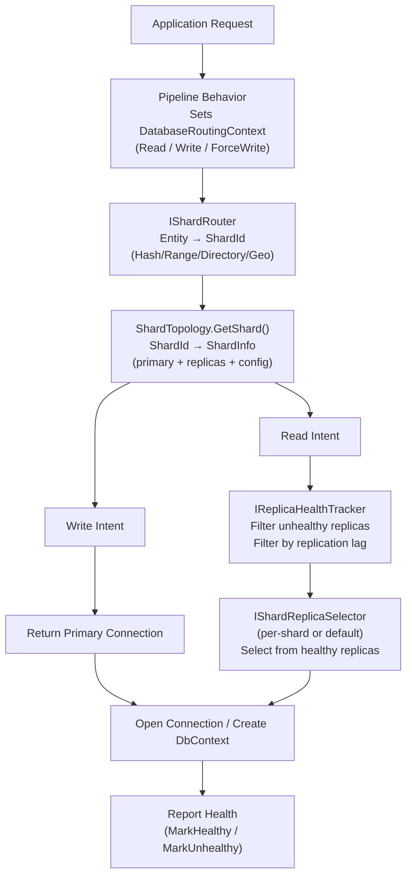
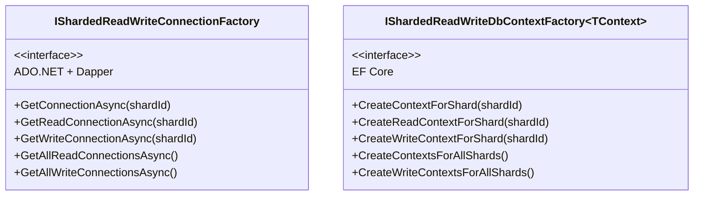
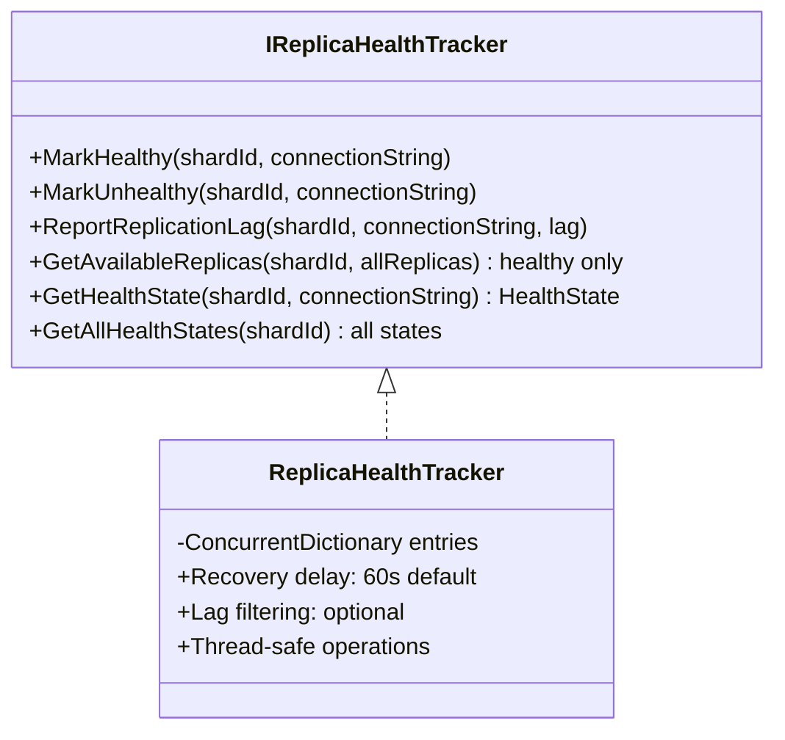
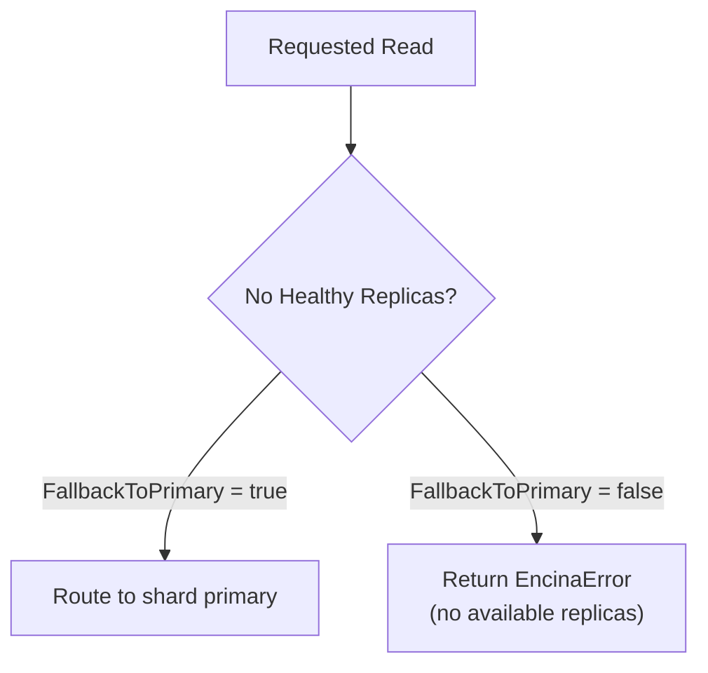
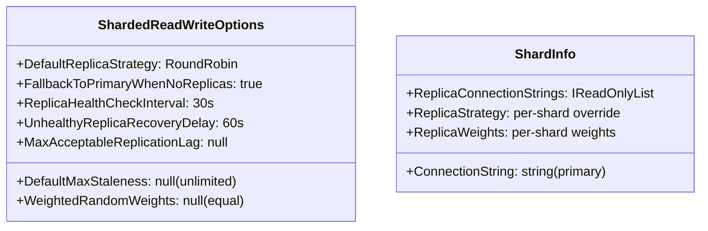
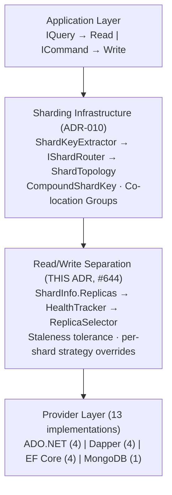

# ADR-012: Sharded Read/Write Separation

## Status

**Accepted** — February 2026

## Context

ADR-010 introduced database sharding with four routing strategies and 13-provider support. However, the sharding infrastructure only dealt with routing to shard primaries. In production sharded deployments, each shard typically has one or more read replicas to offload query traffic, improve geographic read locality, and increase read throughput.

### Problem Statement

| Challenge | Description |
|-----------|-------------|
| **Per-shard replica routing** | Each shard may have different numbers of replicas, different hardware, and different latency profiles |
| **Intent detection** | The system must determine whether a request is a read (safe for replicas) or write (must go to primary) |
| **Strategy diversity** | Different shards may need different selection strategies (e.g., geo-pinned shard uses LeastLatency, balanced shard uses RoundRobin) |
| **Health awareness** | Unhealthy replicas must be excluded without manual intervention |
| **Staleness tolerance** | Some reads accept slightly stale data; others (read-after-write) demand primary consistency |
| **Existing integration** | Encina already has non-sharded read/write separation (`Encina.Messaging.ReadWriteSeparation`). The sharded variant must compose cleanly with existing sharding and R/W abstractions |

### Design Constraints

1. **Compose with existing sharding** — Reuse `ShardTopology`, `IShardRouter`, `ShardInfo` from ADR-010
2. **Reuse intent detection** — Leverage `DatabaseRoutingContext` and `DatabaseIntent` from `Encina.Messaging.ReadWriteSeparation`
3. **Per-shard override** — Global defaults with per-shard strategy and staleness overrides
4. **Provider coherence** — Same factory interface across ADO.NET, Dapper, EF Core, MongoDB (10 providers)
5. **Zero overhead when disabled** — No replica infrastructure if no replicas are configured
6. **Thread-safe** — All selectors and health tracking must be safe under high concurrent access

## Decision

### Architecture: Request Flow

The sharded read/write separation adds a replica selection layer between shard resolution and connection creation:



### Core Abstraction: IShardedReadWriteConnectionFactory

Two factory variants serve different provider categories:



**Key design choice**: `GetConnectionAsync(shardId)` reads the ambient `DatabaseRoutingContext` to determine intent. `GetReadConnectionAsync` and `GetWriteConnectionAsync` bypass context detection for explicit control.

The non-generic `IShardedReadWriteConnectionFactory` returns `IDbConnection`; the generic `IShardedReadWriteConnectionFactory<TConnection>` (ADO.NET only) returns the provider-specific connection type (e.g., `SqlConnection`).

### Five Replica Selection Strategies

| Strategy | Algorithm | Thread Safety | Overhead | Best For |
|----------|-----------|---------------|----------|----------|
| **RoundRobin** | `Interlocked.Increment` modulo replica count | Lock-free | ~5ns | Even distribution, default |
| **Random** | `Random.Shared.Next` | Thread-safe (shared instance) | ~10ns | Simple, no state tracking |
| **LeastLatency** | EMA (alpha=0.3) over `ConcurrentDictionary` | Thread-safe reads | ~50ns | Performance-sensitive reads |
| **LeastConnections** | `Interlocked` counters per replica | Lock-free counters | ~30ns | Variable query durations |
| **WeightedRandom** | Cumulative weight array + binary search | Read-only weights | ~20ns | Heterogeneous replica capacity |

**Strategy resolution order**:

```text
1. Per-shard override (ShardInfo.ReplicaStrategy)
       ↓ (if null)
2. Global default (ShardedReadWriteOptions.DefaultReplicaStrategy)
       ↓ (if null)
3. Built-in fallback (RoundRobin)
```

Selectors are created by `ShardReplicaSelectorFactory` and cached per shard in the connection factory.

### Health Tracking



**Health check integration**: `ShardReplicaHealthCheck` extends `EncinaHealthCheck` and evaluates aggregate health across all shards:

| Condition | Status |
|-----------|--------|
| All replicas healthy | Healthy |
| Some replicas unhealthy | Degraded |
| All replicas unhealthy | Unhealthy |

### Failover Chain

When no healthy replicas are available for a read:



### Staleness Tolerance

Two levels of staleness control:

1. **Global**: `ShardedReadWriteOptions.DefaultMaxStaleness` — applies to all read operations
2. **Per-query**: `[StalenessOptions(MaxStaleness)]` attribute on query/request types — overrides global

The staleness tolerance interacts with health tracking by filtering replicas whose reported replication lag exceeds the acceptable threshold.

### Configuration Model



### Provider Implementation Matrix

| Category | Provider | Factory Type | Registration Method |
|----------|----------|-------------|---------------------|
| **ADO.NET** | SqlServer | `IShardedReadWriteConnectionFactory<SqlConnection>` | `AddEncinaADOShardedReadWrite()` |
| **ADO.NET** | PostgreSQL | `IShardedReadWriteConnectionFactory<NpgsqlConnection>` | `AddEncinaADOShardedReadWrite()` |
| **ADO.NET** | MySQL | `IShardedReadWriteConnectionFactory<MySqlConnection>` | `AddEncinaADOShardedReadWrite()` |
| **Dapper** | SqlServer | `IShardedReadWriteConnectionFactory` (non-generic) | `AddEncinaDapperShardedReadWrite()` |
| **Dapper** | PostgreSQL | `IShardedReadWriteConnectionFactory` (non-generic) | `AddEncinaDapperShardedReadWrite()` |
| **Dapper** | MySQL | `IShardedReadWriteConnectionFactory` (non-generic) | `AddEncinaDapperShardedReadWrite()` |
| **EF Core** | SqlServer | `IShardedReadWriteDbContextFactory<TContext>` | `AddEncinaEFCoreShardedReadWriteSqlServer<T>()` |
| **EF Core** | PostgreSQL | `IShardedReadWriteDbContextFactory<TContext>` | `AddEncinaEFCoreShardedReadWritePostgreSql<T>()` |
| **EF Core** | MySQL | `IShardedReadWriteDbContextFactory<TContext>` | `AddEncinaEFCoreShardedReadWriteMySql<T>()` |
| **MongoDB** | MongoDB | `IShardedReadWriteMongoCollectionFactory` | `AddEncinaMongoDBShardedReadWrite()` |

**Dapper design note**: Dapper only implements the non-generic `IShardedReadWriteConnectionFactory` because Dapper operates on `IDbConnection` rather than provider-specific connection types. This is by design — Dapper's API is inherently provider-agnostic through `IDbConnection`.

### Observability

Six metric instruments under the "Encina" meter:

| Instrument | Type | Description |
|------------|------|-------------|
| `encina.sharding.rw.read_operations` | Counter | Total read operations routed to replicas |
| `encina.sharding.rw.write_operations` | Counter | Total write operations routed to primaries |
| `encina.sharding.rw.replica_selection_duration_ms` | Histogram | Time to select a replica |
| `encina.sharding.rw.failover_to_primary` | Counter | Fallbacks from replica to primary |
| `encina.sharding.rw.unhealthy_replicas` | UpDownCounter | Currently unhealthy replicas |
| `encina.sharding.rw.replication_lag_ms` | Histogram | Reported replication lag |

All instruments tagged with `shard.id`, `replica.strategy`, and `database.provider`.

### Integration with Existing Sharding Features

The sharded read/write separation layer composes cleanly with features from ADR-010 and subsequent issues:



**Scatter-gather reads**: `GetAllReadConnectionsAsync()` opens replica connections across ALL shards for cross-shard queries. Used by specification-based scatter-gather (#652).

**CDC integration**: CDC per-shard connectors (#646) operate on primaries, unaffected by replica routing.

**Co-location**: Entities in the same co-location group (#647) share shard routing and therefore share the same shard's replica pool.

## Consequences

### Positive

- **Transparent read scaling**: Applications get read throughput scaling with zero code changes beyond configuration
- **Per-shard flexibility**: Different shards can use different strategies based on their hardware and access patterns
- **Health-aware routing**: Unhealthy replicas are automatically excluded with configurable recovery windows
- **Provider coherent**: All 10 providers support the same configuration model with identical factory interfaces
- **Composable**: Layers cleanly on top of existing sharding without modifying core routing
- **Thread-safe**: All selector implementations are lock-free or use `ConcurrentDictionary`, validated by benchmarks

### Negative

- **Configuration complexity**: Per-shard overrides add configuration surface area
- **Latency reporting is manual**: `LeastLatency` strategy requires the application to call `ReportLatency()` — there is no automatic latency probing
- **Eventual consistency risk**: Read replicas inherently serve stale data; staleness tolerance mitigates but does not eliminate this risk
- **Health tracking is in-process**: `ReplicaHealthTracker` is per-instance; in a multi-instance deployment each instance tracks health independently

### Neutral

- **No wire protocol changes**: Replica connections use the same connection strings and protocols as primary connections
- **Performance overhead is negligible**: Benchmark results show <50ns for RoundRobin selection, <200ns for LeastLatency
- **Selector caching**: Per-shard selector instances are created once and cached in the factory for the lifetime of the application

## Alternatives Considered

### 1. Database-Level Read Routing (Proxy)

**Rejected**: Proxy solutions (e.g., ProxySQL, PgBouncer) handle replica routing at the infrastructure level. This approach was rejected because:

- It removes application visibility into routing decisions
- It cannot implement per-shard strategy overrides
- It adds operational complexity (another service to manage)
- Encina's provider-agnostic approach cannot rely on database-specific proxies

### 2. Single Global Selector (No Per-Shard Override)

**Rejected**: A simpler design with one global replica selector was considered. Rejected because:

- Different shards may have heterogeneous replica hardware (requiring WeightedRandom for some, RoundRobin for others)
- Geographic shards benefit from LeastLatency while balanced shards work better with RoundRobin
- The per-shard override adds minimal complexity to configuration

### 3. Automatic Latency Probing

**Deferred**: Automatic latency probing (periodic health check queries to measure replica latency) was deferred because:

- It adds background thread overhead even when LeastLatency strategy is not used
- Connection pool warmup and query complexity affect measured latency
- Applications know their specific latency characteristics better than generic probes
- Can be added as an optional `ILatencyProbe` integration in a future version

### 4. Distributed Health Tracking (Redis/Shared State)

**Deferred**: Sharing health state across application instances via Redis or similar was deferred because:

- It adds an external dependency
- Per-instance health tracking is sufficient for most deployments
- Kubernetes readiness probes and load balancers handle instance-level failures
- Can be added as an `IDistributedHealthTracker` in a future version

## Related Decisions

- [ADR-001: Railway Oriented Programming](001-railway-oriented-programming.md) — All methods return `Either<EncinaError, T>`
- [ADR-010: Database Sharding](010-database-sharding.md) — Base sharding infrastructure this feature extends

## References

- [GitHub Issue #644: Read/Write Separation + Sharding](https://github.com/dlrivada/Encina/issues/644)
- [GitHub Issue #289: Database Sharding](https://github.com/dlrivada/Encina/issues/289)
- [GitHub Issue #283: Read/Write Separation](https://github.com/dlrivada/Encina/issues/283)
- [Usage Guide: docs/sharding/read-write-separation.md](../../sharding/read-write-separation.md)
- [Non-Sharded R/W Separation: docs/features/read-write-separation.md](../../features/read-write-separation.md)

## Notes

- **Benchmark validation**: All five selector strategies benchmarked under 1/4/8/16 thread concurrency with `ThreadingDiagnoser`
- **Load test validation**: Distribution fairness verified under 50 concurrent workers x 10,000 selections each
- **Test coverage**: 289+ tests across unit, guard, contract, and property test suites
