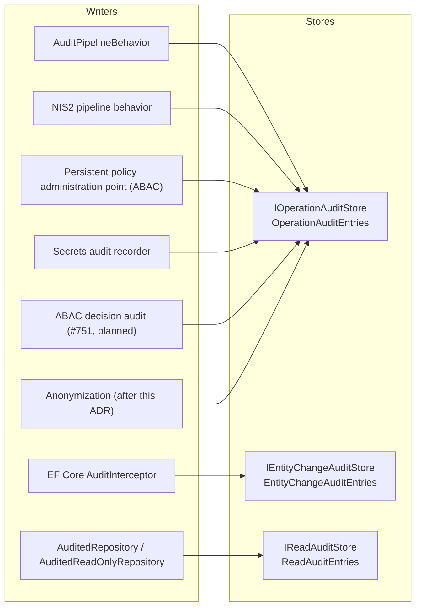

# ADR-036: Three Purpose-Named Audit Stores: Operation, Entity Change and Read Access

## Status

**Accepted** - decided by the maintainer on 2026-10-03 as option A of the spike #1674. The names below are final when this ADR merges; the implementation issues apply them and do not revisit them.

## Context

Encina grew four audit storage abstractions one issue at a time, with no ADR or SPEC deciding the set (#286, #395, #573, #407). Each answers a different question, but their contracts differ for accidental reasons, and one question is answered twice:

- **`IAuditLogStore`** (`src/Encina.DomainModeling/Auditing/IAuditLogStore.cs`): entity change history, one `AuditLogEntry` with old and new JSON per changed entity. Its only writer is the EF Core `AuditInterceptor`. It returns `Task`, not `Either` (ADR-001, ADR-006), and has no `TenantId`, `ModuleId`, purge, `TimeProvider`, query model or redaction of old and new values.
- **`IAuditStore`** (`src/Encina.Security.Audit/Abstractions/IAuditStore.cs`): one `AuditEntry` per operation (who, which request, outcome, duration, redacted payload, IP address). It is the general write-audit sink: `AuditPipelineBehavior`, NIS2, ABAC policy administration and Secrets all write to it (ADR-018, function 12). Its interface, its table `SecurityAuditEntries` and its flag `UseSecurityAuditStore` are three names for one thing. It is not registered for ADO.NET x3, Dapper x3 and MongoDB, and no DDL creates its table (#1633).
- **`IReadAuditStore`** (`src/Encina.Security.Audit/Abstractions/IReadAuditStore.cs`): who read which data and why. It is the only split with a written rationale: different fields, a much higher volume and a shorter default retention. Its XML documentation and `docs/features/read-auditing.md` call `IAuditStore` the "CUD" store, which is wrong: the operation store records reads handled by the pipeline, secret access and policy changes too.
- **`IAnonymizationAuditStore`** (`src/Encina.Compliance.Anonymization/Abstractions/IAnonymizationAuditStore.cs`): in-memory only, with no production caller of `AddEntryAsync`. ADR-019 removed the per-module audit stores of the other compliance modules; this one survived because Anonymization was considered stateless.

The real defect is not that there are several stores. It is that `IAuditLogStore.GetHistoryAsync` and `IAuditStore.GetByEntityAsync` answer the same question ("what happened to this entity") with different contracts, and that the names do not say what each store is for.

The spike evaluated three options (details in #1674):

- **A: three purpose-named, coherent stores** (chosen).
- **B: two stores**, entity changes folded into the operation store (rejected: nullable columns on `AuditEntry`, unredacted entity JSON next to redacted payloads, 1+N rows per command).
- **C: one store with record kinds** (rejected: about 24 provider classes and all schemas change, it contradicts the read-audit decision of #573 and SPEC-002 REQ-007's per-category retention, and it delays #1633 and #751).

External practice agrees with A: read-access audit is a separate opt-in stream in ABP, Azure, Dataverse, Django and Envers, and no standard cited by the spike (ISO 27002 8.15, NIST AU-2, HIPAA 164.312(b)) prescribes one store or several.

## Decision

Encina keeps exactly three audit stores. Each is named after its purpose, and the same naming line applies to its interface, entry record, table, MongoDB collection, configuration flag and implementations (`{Pattern}Store{Provider}`, AGENTS.md section 4; the Marten implementation keeps its existing `Marten` prefix). All three live in the `Encina.Security.Audit` namespace and package, return `Either<EncinaError, T>`, take `TimeProvider`, record `TenantId`, and share one query and paging model.

| | Operation audit | Entity-change audit | Read-access audit |
| --- | --- | --- | --- |
| Interface | `IOperationAuditStore` (was `IAuditStore`) | `IEntityChangeAuditStore` (was `IAuditLogStore`) | `IReadAuditStore` (unchanged) |
| Entry record | `OperationAuditEntry` (was `AuditEntry`) | `EntityChangeAuditEntry` (was `AuditLogEntry`) | `ReadAuditEntry` (unchanged) |
| Action enum | existing `AuditOutcome` stays | `EntityChangeAction` (was `AuditAction`) | existing `ReadAccessMethod` stays |
| Query | `OperationAuditQuery` (was `AuditQuery`) | `EntityChangeAuditQuery` (new) | `ReadAuditQuery` (unchanged) |
| Table / collection | `OperationAuditEntries` (was `SecurityAuditEntries`) | `EntityChangeAuditEntries` (was `AuditLogs`) | `ReadAuditEntries` (unchanged) |
| Flag on `MessagingConfiguration` and `EncinaMongoDbOptions` | `UseOperationAuditStore` (was `UseSecurityAuditStore`) | `UseEntityChangeAuditStore` (was `UseAuditLogStore`) | `UseReadAuditStore` (unchanged) |
| Options | `OperationAuditOptions` (was `AuditOptions`) | `EntityChangeAuditOptions` (new, retention) | `ReadAuditOptions` (unchanged) |
| Providers | `OperationAuditStoreEF`, `OperationAuditStoreADO`, `OperationAuditStoreDapper`, `OperationAuditStoreMongoDB`, `MartenOperationAuditStore`, `InMemoryOperationAuditStore` | `EntityChangeAuditStoreEF`, `...ADO`, `...Dapper`, `...MongoDB`, `InMemoryEntityChangeAuditStore` | `ReadAuditStoreEF`, `...ADO`, `...Dapper`, `...MongoDB`, `MartenReadAuditStore`, `InMemoryReadAuditStore` (unchanged) |

Further decisions:

1. **Entity-change store contract.** `IEntityChangeAuditStore` moves from `Encina.DomainModeling` to `Encina.Security.Audit`, returns `Either`, takes `TimeProvider`, carries `TenantId` and `ModuleId`, offers `PurgeEntriesAsync` like the other two, and gives the writer a redaction hook for old and new values so a sensitive property never reaches the table in clear. It gets integration tests on all 10 database providers (AGENTS.md section 5). The EF Core `AuditInterceptor` stays its only writer and stays off by default.
2. **Operation store is the general write sink.** The `AuditPipelineBehavior`, NIS2, ABAC policy administration, Secrets and the planned ABAC decision audit (#751) keep writing to `IOperationAuditStore`, distinguished by `Action` and `Metadata`. Anonymization writes there as well.
3. **`IAnonymizationAuditStore` is deleted**, with `InMemoryAnonymizationAuditStore` and its registration, option and health-check references. Anonymization records its operations in the operation store.
4. **Dead per-module leftovers are deleted**: the unread `TrackAuditTrail` options of BreachNotification, DSR, PrivacyByDesign and ProcessorAgreements, the unreferenced `DSRAuditEntry`, `BreachAuditEntry` and `ProcessorAgreementAuditEntry`, the never-populated `DPIAAssessment.AuditTrail`, and the stale comments on removed stores in `MessagingConfiguration`. The two unrelated public types named `AuditRecord` are renamed in the same cleanup so that "audit" names mean one thing.
5. **The "CUD" mislabel is fixed** in the XML documentation of `IReadAuditStore` and in `docs/features/read-auditing.md`.
6. **A Marten implementation of the entity-change store is not part of 1.0.** Marten is the event-sourcing provider (ADR-027) and its audit stores exist for the compliance modules (ADR-019); the entity-change interceptor is EF Core only. The decision is revisited if a non-EF writer appears.
7. **No compatibility layer.** The old names are removed in the same change that introduces the new ones (pre-1.0, AGENTS.md section 1).

## Diagram

## Comparison

| | Operation audit | Entity-change audit | Read-access audit |
| --- | --- | --- | --- |
| Question it answers | Who ran which operation, with what outcome | What did this entity look like before and after each change | Who read which data, when and for which purpose |
| Entry fields | Correlation id, user, tenant, action, entity type and id, outcome, error message, start and end time, IP address, user agent, payload hash, redacted payloads, metadata (`AuditEntry`) | Entity type and id, change action, user, timestamp, old and new values (`AuditLogEntry`), plus tenant and module after this ADR | Entity type and id, user, tenant, access time, correlation id, purpose, access method, entity count, metadata (`ReadAuditEntry`) |
| Volume | One row per audited operation | One row per changed entity per save | One row per read of an audited entity; the highest |
| Retention default | `AuditOptions.RetentionDays`, 2555 days | Set by `EntityChangeAuditOptions` (new); no default today | `ReadAuditOptions.RetentionDays`, 365 days; SPEC-002 REQ-007 makes it settable per data category |
| Write path | Pipeline behaviors and services, fail behavior per writer | EF Core `AuditInterceptor`, off by default | `AuditedRepository` and `AuditedReadOnlyRepository` decorators, opt-in |
| Providers today | EF Core x3 and Marten register it; ADO.NET x3, Dapper x3 and MongoDB have implementations without DI registration or DDL (#1633) | ADO.NET x3, Dapper x3, EF Core x3, MongoDB and in-memory; no Marten; no integration tests | ADO.NET x3, Dapper x3, EF Core x3, MongoDB, Marten and in-memory |
| Providers required | 10 database providers, plus Marten | 10 database providers | 10 database providers, plus Marten |

The retention defaults are the values of the `RetentionDays` properties in `src/Encina.Security.Audit/AuditOptions.cs` and `ReadAuditOptions.cs`. Read audit is shorter-lived because it is far larger; SPEC-002 REQ-007 requires its retention to be configurable per data category.

## Implementation order

1. **#1674**: this ADR. It merges first so that the names exist before any table does.
2. **#1633**: register the operation audit store on ADO.NET x3, Dapper x3 and MongoDB, create the `OperationAuditEntries` DDL for the 6 relational providers, and apply the rename of this ADR to the operation store (interface, entry, table, flag, implementations, options, query) in the same change, because the table is created once with its final name.
3. **#751**: the ABAC decision audit writes to `IOperationAuditStore` under the names of this ADR. Its plan (`docs/plans/abac-decision-audit-implementation-plan-751.md`) already waits for #1633.
4. **Follow-up implementation issues** opened from this ADR, not blocking #751: the entity-change store (contract, move, rename, tables and integration tests, re-scoping the backlog #574-#582 and #875 to the new contract); deleting `IAnonymizationAuditStore` and the dead leftovers; the "which audit store do I need" page and the READMEs of `Encina.Security.Audit` and `Encina.Compliance.Anonymization` (#1203).

## Consequences

- **Positive**: every audit question has exactly one store; the names say what each store is for; the entity-change store joins the ROP, tenancy and `TimeProvider` rules; the backlog for more backends (#575-#582, #875) replicates a sound contract instead of the accidental one; #1633 creates its table once.
- **Negative**: three tables to explain, so the documentation needs a page that tells a reader which store to enable; the renames are breaking, accepted pre-1.0 with no compatibility alias.
- **Neutral**: the read-audit design is untouched apart from the shared query and paging model and the documentation fix; event-sourced compliance audit (ADR-019, ADR-020) stays separate.

## Related

- [SPEC-002](../../specifications/SPEC-002-eu-regulatory-readiness.md), REQ-007 (read audit as evidence of access)
- [ADR-018](018-cross-cutting-integration-principle.md) (audit trail as cross-cutting function 12)
- [ADR-019](019-compliance-event-sourcing-marten.md) (per-module audit stores removed)
- Issues: #1674 (this spike), #1633 (registration and DDL), #751 (ABAC decision audit), #1193 and #1270 (read-audit decorators), #1203 (missing READMEs), #574-#582 and #875 (entity-change backlog)

## Date

2026-10-05
