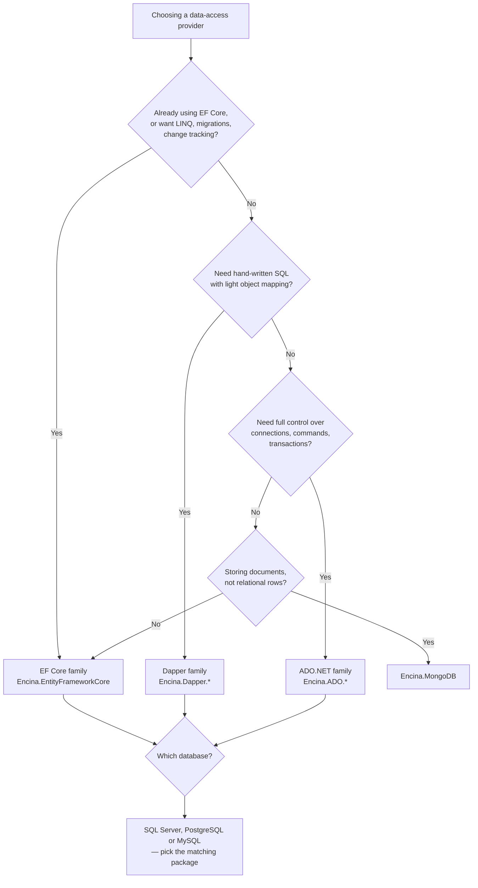

# About Encina's data-access providers

This page is for a developer who has to pick a data-access provider for Encina's stores (outbox, inbox, sagas, scheduling, audit, repositories, unit of work) and wants to understand *why* the provider set looks the way it does before reading the reference tables. It does not cover configuration or SQL syntax; that is [Database providers reference](../features/database-providers.md).

## What "provider" means here

Encina's database-provider matrix is a fundamental project rule, not just a testing convention (`AGENTS.md` §5, *Providers*). Any feature that touches a store — outbox, inbox, saga, scheduling, repository, unit of work, bulk operations, audit — ships on all of them, or the page for that feature says which ones it covers and links the issue for the rest.

There are **10 database providers**, grouped into three data-access families plus one document database:

| Family | Databases | Packages |
|---|---|---|
| **ADO.NET** | SQL Server, PostgreSQL, MySQL | `Encina.ADO.SqlServer`, `Encina.ADO.PostgreSQL`, `Encina.ADO.MySQL` |
| **Dapper** | SQL Server, PostgreSQL, MySQL | `Encina.Dapper.SqlServer`, `Encina.Dapper.PostgreSQL`, `Encina.Dapper.MySQL` |
| **EF Core** | SQL Server, PostgreSQL, MySQL | `Encina.EntityFrameworkCore` (one package, three EF Core database providers) |
| **Document** | MongoDB | `Encina.MongoDB` |

Two providers that used to be part of this matrix are gone, and the count used to be higher:

- **Oracle** was removed before 1.0. [ADR-009](adr/009-remove-oracle-provider-pre-1.0.md) records the reasons: a different parameter prefix, `RAW(16)` GUID storage, `FETCH FIRST n ROWS ONLY` instead of `TOP`/`LIMIT`, uppercase identifiers by default, positional parameter binding, and a maintenance cost disproportionate to its usage. Oracle code is kept in `.backup/oracle/` in case it is restored later.
- **SQLite** was removed for the same reason. [ADR-024](adr/024-remove-sqlite-provider-pre-1.0.md) records that SQLite lacks the DateTime/DateTimeOffset precision, concurrent-write support and distributed-scenario support that Encina's messaging patterns need in production. The SQLite packages moved to `.backup/`.

So the historical sequence is 16 planned providers → 13 after Oracle → 10 today. A page, an ADR or a README that still says "13" or lists a SQLite row is describing a pre-ADR-024 state and needs correcting.

## The provider-coherence rule

The three relational families and MongoDB implement the **same abstractions** from `Encina.Messaging` and `Encina.DomainModeling` — `IOutboxStore`, `IInboxStore`, `ISagaStore`, `IScheduledMessageStore`, the repository and unit-of-work interfaces — with a different implementation per provider. Switching providers is a change to one line of DI registration; the rest of the application code does not change (`AGENTS.md` §3, *Code rules*: provider coherence).

```csharp
// Using EF Core
services.AddEncinaEntityFrameworkCore<AppDbContext>(config => { config.UseOutbox = true; });

// Switching to Dapper on the same database: same configuration, different registration
services.AddEncinaDapper(config => { config.UseOutbox = true; });
```

Store implementations follow the naming pattern `{Pattern}Store{Provider}` — `OutboxStoreEF`, `OutboxStoreDapper`, `OutboxStoreADO`, `OutboxStoreMongoDB` — never a bare `Store` or `Repository` (`AGENTS.md` §4, *Naming*). The full type-per-provider list is in the [reference page](../features/database-providers.md).

## How to choose

The families answer different questions. Pick the abstraction level that matches how much control you need over the generated SQL and how much of an existing ORM investment you have:



Within a family, the choice of SQL Server, PostgreSQL or MySQL is usually dictated by what your organisation already runs, not by an Encina-side trade-off: the same feature set ships on all three (the SQL dialect differences are in the [reference page](../features/database-providers.md)).

## What the compliance modules need

Nine event-sourced compliance modules — Consent, Data Subject Rights, Lawful Basis, Breach Notification, DPIA, Processor Agreements, Retention, Data Residency, Cross-Border Transfer — plus `Encina.Marten.GDPR` do **not** follow the 10-provider rule. They are built on `Encina.Marten`, which requires PostgreSQL. [ADR-019](adr/019-compliance-event-sourcing-marten.md) explains the reasoning: these modules need to prove *how* a decision was reached (event history), not just what the current state is, which entity-based persistence across 10 providers cannot answer without becoming its own event store. Event sourcing is treated as a specialized infrastructure concern, the same way caching is not implemented across all 10 providers either.

[SPEC-002](../specifications/SPEC-002-eu-regulatory-readiness.md) DEC-008 confirms this stays the 1.0 scope: the nine modules and `Encina.Marten.GDPR` are PostgreSQL/Marten-only in 1.0, and applications that keep their own data in EF Core or Dapper on the same PostgreSQL server need a documented pattern (shared connection and transaction, or an outbox bridge) to keep application writes and compliance-aggregate writes consistent — SQL Server and MySQL users do not get these modules in 1.0. [SPEC-000](../specifications/SPEC-000-encina-1.0-baseline-and-release-scope.md) is the document that defines the overall 1.0 boundary these decisions sit inside.

## See also

- [Database providers reference](../features/database-providers.md) — package names, registration methods, the feature × provider matrix, and SQL dialect differences.
- [Messaging in Encina](../messaging/index.md) — the patterns (outbox, inbox, saga, scheduling) that the providers implement.
- [ADR-009](adr/009-remove-oracle-provider-pre-1.0.md), [ADR-024](adr/024-remove-sqlite-provider-pre-1.0.md), [ADR-019](adr/019-compliance-event-sourcing-marten.md).
- [SPEC-000](../specifications/SPEC-000-encina-1.0-baseline-and-release-scope.md), [SPEC-002](../specifications/SPEC-002-eu-regulatory-readiness.md).
