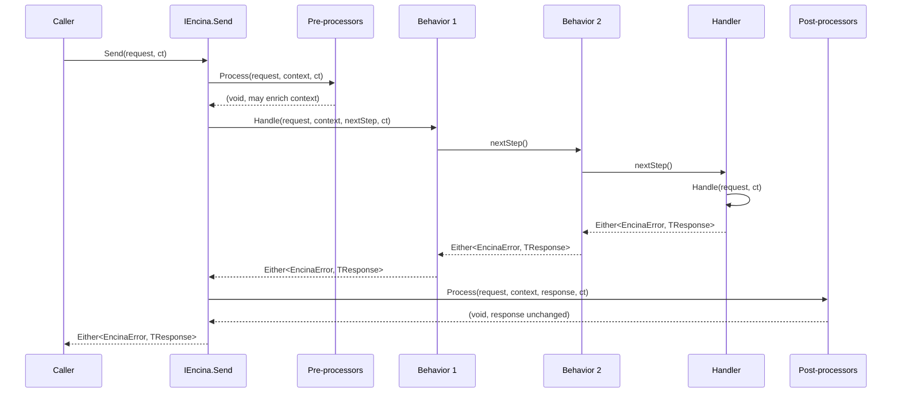

# About the request pipeline

This page is for a .NET developer who finished the [quickstart](../tutorials/quickstart.md) and wants to understand what actually happens between calling `IEncina.Send` and getting an `Either<EncinaError, TResponse>` back. It explains the concepts and the flow; it does not give steps. If you want to write a custom pipeline behavior, go to [How to write a pipeline behavior](../guides/how-to-write-a-pipeline-behavior.md). For the built-in behaviors and how to register them, see [Pipeline behaviors reference](../features/pipeline-behaviors.md).

## Requests, handlers and notifications

Encina's core abstractions live in `Encina.Abstractions` (namespace `Encina`):

- `IRequest<TResponse>` is the base of anything sent through `IEncina.Send`. `ICommand<TResponse>` and `IQuery<TResponse>` both extend it; `ICommand`/`IQuery` are the `Unit`-returning convenience variants. A command mutates state or triggers side effects; a query does not.
- `ICommandHandler<TCommand, TResponse>` and `IQueryHandler<TQuery, TResponse>` extend the shared `IRequestHandler<TRequest, TResponse>`, whose `Handle(TRequest request, CancellationToken cancellationToken)` method returns `Task<Either<EncinaError, TResponse>>`. Exactly one handler is resolved per request type; `Send` fails if none is registered.
- `INotification` is a marker interface for a signal that can reach zero or more handlers. `INotificationHandler<TNotification>.Handle(TNotification notification, CancellationToken cancellationToken)` returns `Task<Either<EncinaError, Unit>>`, so a notification handler can also report a functional failure.

## Pipeline behaviors

An `IPipelineBehavior<TRequest, TResponse>` wraps the handler call with cross-cutting logic. Its `Handle` method takes the request, the ambient `IRequestContext`, a `RequestHandlerCallback<TResponse> nextStep` and a `CancellationToken`, and returns `ValueTask<Either<EncinaError, TResponse>>`. A behavior decides whether to call `nextStep()` (continue the pipeline), skip it and return its own `Left` (short-circuit), or inspect and transform the `Either` that `nextStep()` produced.

`ICommandPipelineBehavior<TCommand, TResponse>` and `IQueryPipelineBehavior<TQuery, TResponse>` are the same contract specialised to commands or queries, useful when a behavior only makes sense for one side of CQRS (for example a query-only caching behavior).

`IRequestPreProcessor<TRequest>` and `IRequestPostProcessor<TRequest, TResponse>` sit outside the behavior chain: a pre-processor runs once before any behavior and can enrich the `IRequestContext` (it has no `nextStep` to call); a post-processor runs once after the handler, with read-only access to the request, the context and the final `Either<EncinaError, TResponse>`, and runs even when that `Either` is a `Left`.

## The dispatch flow

`IEncina.Send<TResponse>(IRequest<TResponse> request, CancellationToken cancellationToken = default)` builds one pipeline per call: a fresh `IRequestContext` is created for the request, then pre-processors, pipeline behaviors and the handler are composed into nested delegates, innermost first, so behaviors execute in registration order:

If a pre-processor's `Process` throws, or a behavior returns `Left` instead of calling `nextStep()`, the remaining behaviors and the handler never run; post-processors still run, and receive the `Left` that resulted. Any exception a behavior, handler or processor lets escape (other than an `OperationCanceledException` for a cancelled token) is a programming bug, not a functional failure, and propagates instead of becoming a `Left` — see [ADR-006](adr/006-pure-rop-exception-handling.md).

## Request context

`IRequestContext` carries the correlation ID, the optional user ID, idempotency key and tenant ID, a UTC timestamp and a metadata dictionary through the whole pipeline. It is immutable: pre-processors and behaviors that need to enrich it call `WithUserId`, `WithTenantId`, `WithIdempotencyKey` or `WithMetadata`, each of which returns a new instance. Post-processors only read it.

## Notifications fan out

`IEncina.Publish<TNotification>(TNotification notification, CancellationToken cancellationToken = default)` resolves every `INotificationHandler<TNotification>` registered for the notification's runtime type and dispatches to all of them — there is no behavior chain and no pre/post-processors for notifications, only handlers. The dispatch order (sequential, or one of the parallel strategies) is configured once for the whole `IEncina` instance through `EncinaConfiguration.UseParallelNotificationDispatch`; sequential dispatch is fail-fast, stopping at the first handler that returns `Left`, while both parallel strategies run every handler and surface the first `Left` encountered once all of them finish. Publishing to zero handlers is not an error: it returns `Right(Unit.Default)`.

## Why `Either<EncinaError, TResponse>`

Encina returns `Either<EncinaError, TResponse>` from every dispatch instead of throwing for expected failures, so that a failure is part of the method's return type and the pipeline can compose error handling without exception overhead or `try`/`catch` at every layer — see [ADR-001](adr/001-railway-oriented-programming.md). A `EncinaResult<T>` wrapper over `Either` was considered and rejected as unnecessary ceremony over a type LanguageExt already provides — see [ADR-004](adr/004-reject-mediator-result.md). Within that model, only cancellation is treated as an expected failure and converted to a `Left`; any other exception is a bug and is allowed to crash the pipeline (fail-fast), which also made the defensive catch-all code easier to remove and to reason about under mutation testing — see [ADR-006](adr/006-pure-rop-exception-handling.md).

## See also

- [How to write a pipeline behavior](../guides/how-to-write-a-pipeline-behavior.md) — write, register and order a custom behavior.
- [Pipeline behaviors reference](../features/pipeline-behaviors.md) — the built-in behaviors, one per row, with registration and ordering notes.
- [Quickstart](../tutorials/quickstart.md) — the first command and handler, if you have not run it yet.
