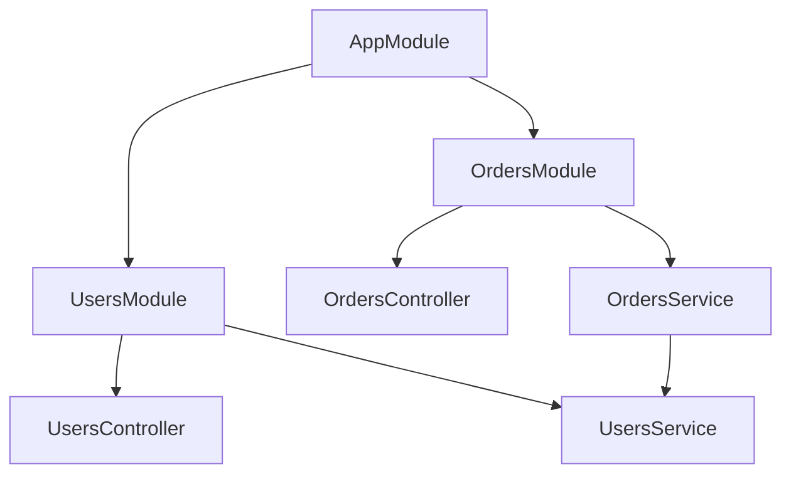

# SimpleMediator vs NestJS: Análisis Comparativo Detallado

> **Fecha**: 21 de diciembre de 2025  
> **Autor**: Análisis de arquitectura y capacidades  
> **Objetivo**: Identificar brechas, fortalezas y oportunidades de mejora de SimpleMediator frente a NestJS

---

## 📋 Tabla de Contenidos

1. [Resumen Ejecutivo](#resumen-ejecutivo)
2. [Estado Actual del Proyecto](#estado-actual-del-proyecto)
3. [Contexto y Filosofía](#contexto-y-filosofía)
4. [Análisis por Categorías](#análisis-por-categorías)
5. [Matriz de Características](#matriz-de-características)
6. [Áreas de Superioridad de SimpleMediator](#áreas-de-superioridad-de-simplemediator)
7. [Brechas Identificadas](#brechas-identificadas)
8. [Oportunidades de Mejora](#oportunidades-de-mejora)
9. [Roadmap Propuesto](#roadmap-propuesto)
10. [Conclusiones](#conclusiones)

---

## 📊 Estado Actual del Proyecto

> **Última actualización**: Diciembre 2025  
> **Versión**: Pre-1.0 (active development)  
> **Futuro nombre**: Encina (renombrado antes de 1.0)

### Progreso General: 85% hacia Pre-1.0

| Categoría | Completado | Total | % |
|-----------|------------|-------|---|
| Core Features | 1 | 1 | 100% ✅ |
| Validation Packages | 4 | 4 | 100% ✅ |
| Web Integration | 1 | 1 | 100% ✅ |
| Messaging Packages | 1 | 1 | 100% ✅ |
| Job Schedulers | 2 | 2 | 100% ✅ |
| Database Providers | 10 | 10 | 100% ✅ |
| Resilience Packages | 3 | 3 | 100% ✅ |
| Caching Packages | 8 | 8 | 95% 🟡 |
| OpenTelemetry | 1 | 1 | 100% ✅ |
| Stream Requests | 1 | 1 | 70% 🟡 |
| Tests | 3,444 | ~5,000+ | 69% 🟡 |
| Documentation | 80% | 100% | 80% 🟡 |

### Paquetes Completados (Producción Ready)

**Core & Validation**:

- ✅ `SimpleMediator` - Core mediator con ROP
- ✅ `SimpleMediator.FluentValidation` - Validación con FluentValidation
- ✅ `SimpleMediator.DataAnnotations` - Validación con atributos .NET
- ✅ `SimpleMediator.MiniValidator` - Validación ligera (~20KB)
- ✅ `SimpleMediator.GuardClauses` - Defensive programming

**Web**:

- ✅ `SimpleMediator.AspNetCore` - Middleware, autorización, Problem Details

**Mensajería & Bases de Datos** (10 proveedores completos):

- ✅ `SimpleMediator.EntityFrameworkCore` - EF Core con transacciones
- ✅ **Dapper Providers** (5): SqlServer, PostgreSQL, MySQL, Oracle, Sqlite
- ✅ **ADO Providers** (5): SqlServer, PostgreSQL, MySQL, Oracle, Sqlite

**Patrones Soportados en todos los proveedores**:

- ✅ Outbox Pattern (publicación confiable de eventos)
- ✅ Inbox Pattern (procesamiento idempotente)
- ✅ Saga Orchestration (transacciones distribuidas)
- ✅ Scheduled Messages (ejecución diferida/recurrente)

**Job Scheduling**:

- ✅ `SimpleMediator.Hangfire` - Fire-and-forget, delayed, recurring
- ✅ `SimpleMediator.Quartz` - Enterprise CRON, clustering

**Resilience & Service Mesh**:

- ✅ `SimpleMediator.Extensions.Resilience` - Microsoft Resilience Pipeline (Polly v8)
- ✅ `SimpleMediator.Polly` - Direct Polly v8 integration
- ✅ `SimpleMediator.Refit` - Type-safe REST API clients
- ✅ `SimpleMediator.Dapr` - Service mesh (invocation, pub/sub, state, secrets)

**Observability**:

- ✅ `SimpleMediator.OpenTelemetry` - Traces, métricas, enrichers automáticos

**Caching** (8 proveedores - 95% completo):

- ✅ `SimpleMediator.Caching` - Core abstractions, behaviors, attributes
- ✅ `SimpleMediator.Caching.Memory` - In-memory caching (IMemoryCache)
- ✅ `SimpleMediator.Caching.Redis` - Redis caching + Redlock
- ✅ `SimpleMediator.Caching.Garnet` - Microsoft Garnet (10-100x faster)
- ✅ `SimpleMediator.Caching.Valkey` - Valkey (AWS/Google/Linux Foundation)
- ✅ `SimpleMediator.Caching.Dragonfly` - Dragonfly (25x throughput)
- ✅ `SimpleMediator.Caching.KeyDB` - KeyDB (multi-threaded, 5x faster)
- ✅ `SimpleMediator.Caching.NCache` - NCache (native .NET enterprise)

**Características de Caching Implementadas**:

- ✅ Query result caching con `[Cache]` attribute
- ✅ Cache invalidation con `[InvalidatesCache]` attribute  
- ✅ Distributed idempotency via `IRequestContext.IdempotencyKey`
- ✅ Distributed locks para saga coordination (Redlock algorithm)
- ✅ Pub/Sub para cache invalidation across instances
- ✅ TTL configurable, sliding expiration, cache priority
- ✅ Key generation con VaryByUser, VaryByTenant
- 🟡 Tests: ~95% completo (faltan algunos tests de cobertura alta)

**Stream Requests**:

- 🟡 `IStreamRequest<TItem>` - IAsyncEnumerable support (70% completo)

### Métricas de Calidad

| Métrica | Actual | Target | Estado |
|---------|--------|--------|--------|
| Line Coverage | 92.5% | ≥90% | ✅ SUPERADO |
| Branch Coverage | 83.3% | ≥85% | 🟡 Cercano |
| Mutation Score | 79.75% | ≥80% | ✅ LOGRADO |
| Build Warnings | 0 | 0 | ✅ PERFECTO |
| XML Documentation | 100% | 100% | ✅ PERFECTO |
| Tests Totales | ~4,500 | ~5,500 | 🟡 82% |
| Caching Tests | ~1,000+ | ~1,100 | 🟡 95% |

### Trabajo en Progreso

🏗️ **Test Architecture Refactoring** (Testcontainers):

- Reestructuración de proyectos de tests
- 1 proyecto por tipo de test (Integration, Contract, Property, Load)
- Fixtures compartidos en SimpleMediator.TestInfrastructure
- Real databases via Testcontainers (SQL Server, PostgreSQL, MySQL, Oracle)

🔴 **Crash Investigation** (RESUELTO):

- Issue #1: MSBuild/.NET crashes ✅ Mitigado con `-maxcpucount:1`
- Issue #2: Claude CLI crashes 🔴 Awaiting Anthropic fix

🔥 **100% Test Coverage** (CRÍTICO):

- Política MANDATORIA implementada (2025-12-18)
- ~2,500-3,000 tests adicionales necesarios
- 7 tipos de tests obligatorios para CADA componente

🟡 **Caching Infrastructure** (95% COMPLETADO):

- 8 cache providers implementados
- ~1,000+ tests actuales (~95% completitud)
- Faltan: ~50-100 tests adicionales para coverage alto
- Implementado: Abstractions, behaviors, attributes, distributed locks, pub/sub
- Pendiente: Algunos edge cases y load tests finales

---

## 🎯 Resumen Ejecutivo

### SimpleMediator (→ Encina 1.0)

**Biblioteca .NET** especializada en patrones **CQRS/Mediator** con enfoque **funcional** (Railway Oriented Programming), diseñada para aplicaciones empresariales que requieren:

- Alta observabilidad (OpenTelemetry native)
- Manejo explícito de errores (Either monad, no exceptions)
- Mensajería desacoplada con garantías de entrega (Outbox/Inbox patterns)
- Múltiples proveedores de bases de datos (10 completos)
- Caching empresarial (8 providers con distributed locks, pub/sub)

**Estado actual (Dic 2025):** 85% hacia Pre-1.0, ~4,500 tests pasando, 10 database providers completos, 8 cache providers (95%), OpenTelemetry 100% implementado.

### NestJS

**Framework Node.js/TypeScript** inspirado en Angular, que proporciona una arquitectura completa para aplicaciones web con soporte nativo para HTTP, GraphQL, WebSocket, microservicios y más. Enfoque en "batteries included" para el desarrollo de APIs y sistemas distribuidos.

### Diferencias Fundamentales

| Aspecto | SimpleMediator | NestJS |
|---------|---------------|--------|
| **Alcance** | Biblioteca CQRS/Mediator | Framework full-stack |
| **Lenguaje** | .NET (C#) | TypeScript/JavaScript |
| **Filosofía** | Funcional (Either/Option monads) | OOP con decoradores |
| **Transporte** | In-process + extensiones (10 DB providers) | HTTP, GraphQL, WS, gRPC nativo |
| **DI** | Microsoft.Extensions.DependencyInjection | Propio sistema DI con módulos |
| **Testing** | Testcontainers (real databases) | @nestjs/testing (mocking) |
| **Error Handling** | Either monad (explicit) | Exceptions + filters |
| **Observability** | OpenTelemetry package completo | Via librerías externas |
| **Database Patterns** | Outbox/Inbox/Sagas (10 providers) | Manual implementation |
| **Caching** | 8 providers (distributed locks, pub/sub) | CacheModule (Keyv stores) |
| **Validation** | 4 packages (475 tests) | class-validator |

---

## 🧭 Contexto y Filosofía

### SimpleMediator: Functional Core, Imperative Shell

```csharp
// Enfoque funcional con Either
var result = await mediator.Send(new CreateOrderCommand { ... });
return result.Match(
    Right: order => Ok(order),
    Left: error => error.Code switch
    {
        "VALIDATION" => BadRequest(error),
        "NOT_FOUND" => NotFound(error),
        _ => StatusCode(500, error)
    }
);
```

**Principios clave:**

- ✅ Railway Oriented Programming (ROP)
- ✅ Explicit error handling (Either<TError, TValue>)
- ✅ Immutable request context
- ✅ Pipeline behaviors como composición funcional
- ✅ Zero exceptions en flujo feliz (política en progreso)

### NestJS: Enterprise Application Architecture

```typescript
// Enfoque imperativo con decoradores y excepciones
@Controller('orders')
export class OrdersController {
  @Post()
  @UseGuards(AuthGuard)
  @UsePipes(ValidationPipe)
  async create(@Body() dto: CreateOrderDto) {
    return this.ordersService.create(dto); // Lanza excepciones
  }
}
```

**Principios clave:**

- ✅ Decoradores para metadata (inspirado en Angular)
- ✅ Módulos jerárquicos con DI contextual
- ✅ Excepciones para control de flujo
- ✅ Extensibilidad mediante Guards, Pipes, Interceptors
- ✅ Platform-agnostic (Express/Fastify)

---

## 📊 Análisis por Categorías

### 1️⃣ **Arquitectura Core**

#### NestJS: Módulos y Providers



**Características:**

- Módulos como unidades de composición
- Providers con scopes (singleton, request, transient)
- Imports/Exports para encapsulación
- Dynamic modules para configuración runtime

**SimpleMediator equivalente:**

```csharp
// SimpleMediator no tiene concepto de módulos
services.AddMediator(cfg =>
{
    cfg.RegisterServicesFromAssembly(typeof(Program).Assembly);
    cfg.AddBehavior<ValidationBehavior>();
    cfg.AddBehavior<TransactionBehavior>();
});
```

#### Brecha Identificada 🔴

**SimpleMediator NO tiene:**

- Sistema de módulos jerárquico
- Encapsulación de handlers por dominio
- Configuración por módulo/bounded context

#### Oportunidad 💡

**Propuesta: `MediatorModule` concept**

```csharp
services.AddMediator()
    .AddModule<OrdersModule>(m => m
        .RegisterHandlersFrom<OrdersModule>()
        .WithBehaviors<OrderTransactionBehavior>()
        .WithMetrics("orders"))
    .AddModule<PaymentsModule>(m => m
        .RegisterHandlersFrom<PaymentsModule>()
        .WithBehaviors<PaymentValidationBehavior>());
```

---

### 2️⃣ **Request Lifecycle & Interceptors**

#### NestJS: Guards → Interceptors → Pipes → Handler → Interceptors

```typescript
@Injectable()
export class LoggingInterceptor implements NestInterceptor {
  intercept(context: ExecutionContext, next: CallHandler): Observable<any> {
    console.log('Before...');
    const now = Date.now();
    return next.handle().pipe(
      tap(() => console.log(`After... ${Date.now() - now}ms`))
    );
  }
}
```

**Capas de procesamiento:**

1. **Guards** - Authorization (canActivate)
2. **Interceptors (before)** - Logging, transformación pre-handler
3. **Pipes** - Validación y transformación de parámetros
4. **Handler** - Lógica de negocio
5. **Interceptors (after)** - Logging, transformación post-handler
6. **Exception Filters** - Manejo de excepciones

#### SimpleMediator: Authorization → Validation → Behaviors → Handler ✅

```csharp
// 1. Authorization (equivalente a Guards)
[Authorize(Roles = "Admin")]
[Authorize(Policy = "RequireApproval")]
public record DeleteOrderCommand(Guid OrderId) : ICommand<Unit>;

// AllowAnonymous para opt-out
[AllowAnonymous]
public record GetPublicDataQuery : IQuery<PublicData>;

// 2. Validation Behavior (equivalente a Pipes)
public class ValidationBehavior<TRequest, TResponse> : IPipelineBehavior<TRequest, TResponse>
{
    public async ValueTask<Either<MediatorError, TResponse>> Handle(
        TRequest request,
        IRequestContext context,
        RequestHandlerCallback<TResponse> next,
        CancellationToken ct)
    {
        var validationResult = await _validator.ValidateAsync(request, ct);
        return validationResult.IsValid
            ? await next()
            : Left<MediatorError, TResponse>(MediatorErrors.Validation(validationResult));
    }
}

// 3. Logging/Telemetry Behavior (equivalente a Interceptors)
public class LoggingBehavior<TRequest, TResponse> : IPipelineBehavior<TRequest, TResponse>
{
    public async ValueTask<Either<MediatorError, TResponse>> Handle(
        TRequest request,
        IRequestContext context,
        RequestHandlerCallback<TResponse> next,
        CancellationToken ct)
    {
        _logger.LogInformation("Processing {Request}", typeof(TRequest).Name);
        var stopwatch = Stopwatch.StartNew();

        var result = await next();

        _logger.LogInformation("Processed {Request} in {Elapsed}ms",
            typeof(TRequest).Name, stopwatch.ElapsedMilliseconds);
        return result;
    }
}

// 4. Exception handling via Railway Oriented Programming
// No Exception Filters necesarios - los errores son valores, no excepciones
```

**Pipeline completo:**

```
Request → AuthorizationBehavior → ValidationBehavior → [Custom Behaviors] → Handler → Response
              ↓ Error                  ↓ Error                                    ↓ Success/Error
         Left(Unauthorized)      Left(ValidationError)                    Either<Error, Result>
```

**Similitudes:**

- ✅ Ambos usan cadena de responsabilidad
- ✅ Ambos permiten interceptar antes/después
- ✅ Ambos soportan composición de comportamientos
- ✅ Ambos tienen authorization declarativa

**Comparación Actualizada:**

| Característica | SimpleMediator | NestJS |
|----------------|---------------|--------|
| Authorization | ✅ `[Authorize]` + AuthorizationBehavior | ✅ Guards |
| Validation | ✅ ValidationBehavior (3 providers) | ✅ Pipes + class-validator |
| Interceptors | ✅ IPipelineBehavior | ✅ NestInterceptor |
| Error handling | ✅ Railway (Either<Error,T>) | ❌ Exceptions |
| Resource-based auth | ✅ Request as resource | ⚠️ Manual |
| Allow anonymous | ✅ `[AllowAnonymous]` | ✅ @Public |

#### Estado Actual ✅

**SimpleMediator tiene PARIDAD con NestJS en lifecycle:**

- ✅ `AuthorizationPipelineBehavior` - Equivalente a Guards
  - `[Authorize]`, `[Authorize(Roles)]`, `[Authorize(Policy)]`
  - `[AllowAnonymous]` para opt-out
  - Resource-based authorization (request as resource)
- ✅ `ValidationBehavior` - Equivalente a Pipes (3 providers: FluentValidation, DataAnnotations, MiniValidator)
- ✅ `IPipelineBehavior` - Equivalente a Interceptors
- ✅ Railway Oriented Programming - Superior a Exception Filters
- ✅ `IRequestContext` - Contexto compartido (UserId, TenantId, CorrelationId)

---

### 3️⃣ **Validación**

#### NestJS: Pipes + class-validator

```typescript
// DTO con decoradores
export class CreateCatDto {
  @IsString()
  @MinLength(2)
  name: string;

  @IsInt()
  @Min(0)
  age: number;
}

// Uso automático
@Post()
@UsePipes(new ValidationPipe())
async create(@Body() dto: CreateCatDto) {
  return this.catsService.create(dto);
}
```

**Ventajas:**

- Validación declarativa con decoradores
- Integración automática en pipeline
- Mensajes de error consistentes
- ValidationPipe configurable globalmente

#### SimpleMediator: Satellite packages

```csharp
// DataAnnotations
public class CreateOrderCommand : IRequest<Either<MediatorError, Order>>
{
    [Required, MinLength(3)]
    public string CustomerName { get; init; }
    
    [Range(1, int.MaxValue)]
    public int Quantity { get; init; }
}

// Behavior manual
services.AddMediator(cfg =>
{
    cfg.AddDataAnnotationsValidation();
    cfg.AddFluentValidation();
});
```

**Paquetes disponibles (TODOS EN PRODUCCIÓN):**

- ✅ `SimpleMediator.DataAnnotations` - 100% completo, 56 tests
- ✅ `SimpleMediator.FluentValidation` - 100% completo, 68 tests
- ✅ `SimpleMediator.MiniValidator` - 100% completo, 59 tests
- ✅ `SimpleMediator.GuardClauses` - 100% completo, 292 tests

#### Comparación

| Característica | SimpleMediator | NestJS |
|---------------|---------------|--------|
| Validación declarativa | ✅ (via DataAnnotations/FluentValidation) | ✅ (class-validator) |
| Integración pipeline | ✅ (behavior manual) | ✅ (automático) |
| Múltiples motores | ✅ (4 opciones) | ⚠️ (principalmente class-validator) |
| Transformación | ❌ | ✅ (pipes) |
| Per-parameter validation | ❌ | ✅ |

#### Brecha Identificada 🟡

**SimpleMediator podría mejorar:**

- Validación de parámetros individuales (no solo el request completo)
- Auto-registro de validators por convención
- Transformación de tipos (ej: string → DateTime)

---

### 4️⃣ **Testing**

#### NestJS: @nestjs/testing

```typescript
describe('CatsController', () => {
  let controller: CatsController;
  let service: CatsService;

  beforeEach(async () => {
    const module = await Test.createTestingModule({
      controllers: [CatsController],
      providers: [CatsService],
    })
    .overrideProvider(CatsService)
    .useValue(mockCatsService)
    .compile();

    controller = module.get(CatsController);
    service = module.get(CatsService);
  });

  it('should return cats', async () => {
    jest.spyOn(service, 'findAll').mockResolvedValue([]);
    expect(await controller.findAll()).toEqual([]);
  });
});
```

**Ventajas de @nestjs/testing:**

- ✅ Testing module que simula DI container
- ✅ Override de providers para mocking
- ✅ Testing de request-scoped providers
- ✅ E2E testing con Supertest
- ✅ Auto-mocking de dependencias faltantes

#### SimpleMediator: Testing Infrastructure Avanzado

```csharp
// Testing con Testcontainers (real databases)
public class OutboxStoreTests : IClassFixture<SqlServerFixture>
{
    private readonly SqlServerFixture _fixture;

    public OutboxStoreTests(SqlServerFixture fixture)
    {
        _fixture = fixture;
        // Container auto-started, auto-cleaned
    }

    [Fact]
    public async Task AddAsync_Success()
    {
        // Arrange - real SQL Server via Docker
        var connection = new SqlConnection(_fixture.ConnectionString);
        var store = new OutboxStoreDapper(connection);
        var message = OutboxMessageBuilder.Create().Build();
        
        // Act
        await store.AddAsync(message, CancellationToken.None);
        
        // Assert
        var retrieved = await store.GetPendingMessagesAsync(10, CancellationToken.None);
        retrieved.Should().ContainSingle();
    }
}

// Property-Based Testing (FsCheck)
[Property]
public Property AddAsync_NeverThrowsForValidMessages()
{
    return Prop.ForAll(
        OutboxMessageArbitrary.Generate(),
        async message =>
        {
            await _store.AddAsync(message, CancellationToken.None);
            return true;
        }
    );
}
```

**Infraestructura de Tests Actual:**

- ✅ Testcontainers para bases de datos reales
- ✅ Fixtures compartidos (SqlServerFixture, PostgreSqlFixture, etc.)
- ✅ 7 tipos de tests: Unit, Guard, Contract, Property, Integration, Load, Benchmarks
- ✅ 3,444 tests actuales (objetivo: ~5,000)
- ✅ Test Architecture con proyectos separados por tipo

#### Comparación

| Aspecto | SimpleMediator | NestJS |
|---------|---------------|--------|
| Test Infrastructure | ✅ SimpleMediator.TestInfrastructure | ✅ @nestjs/testing |
| Database Fixtures | ✅ 5 DB fixtures (Testcontainers) | ⚠️ Manual setup |
| Test Data Builders | ✅ 4 builders (Outbox, Inbox, Saga, etc.) | ⚠️ Manual |
| Override de handlers | ⚠️ (manual) | ✅ (built-in) |
| Real DB Testing | ✅ Testcontainers nativo | ⚠️ Requiere setup |
| E2E testing | ✅ ASP.NET TestServer | ✅ (Supertest/Fastify inject) |
| 7 tipos de tests | ✅ Unit, Guard, Contract, Property, Integration, Load, Benchmark | ⚠️ Unit + E2E |

#### Estado Actual ✅

**SimpleMediator.TestInfrastructure ya incluye:**

```csharp
// 1. Database Fixtures (Testcontainers)
public class SqlServerFixture : DatabaseFixture { }
public class PostgreSqlFixture : DatabaseFixture { }
public class MySqlFixture : DatabaseFixture { }
public class SqliteFixture : DatabaseFixture { }
public class OracleFixture : DatabaseFixture { }

// 2. Test Data Builders (fluent API)
var message = new OutboxMessageBuilder()
    .WithPayload("{\"test\":true}")
    .WithProcessedAt(DateTime.UtcNow)
    .Build();

var saga = new SagaStateBuilder()
    .WithState("Completed")
    .WithCorrelationId("order-123")
    .Build();

// 3. Assertion Extensions
result.Should().BeRight();
result.Should().BeLeft();
```

**Estructura de Tests por Paquete:**

- `*.Tests` - Unit tests
- `*.GuardTests` - Null/argument validation
- `*.ContractTests` - Interface contracts
- `*.PropertyTests` - FsCheck property-based
- `*.IntegrationTests` - Testcontainers
- `*.LoadTests` - Stress testing

#### Brecha Menor 🟡

**Podría mejorarse:**

- **Fluent API para override de handlers** (actualmente via DI manual)
- **Auto-mocking** de dependencias (actualmente usa NSubstitute/Moq manual)

---

### 5️⃣ **GraphQL**

#### NestJS: @nestjs/graphql (First-class support)

```typescript
// Code-first approach
@Resolver(of => Cat)
export class CatsResolver {
  @Query(returns => [Cat])
  async cats() {
    return this.catsService.findAll();
  }

  @Mutation(returns => Cat)
  async createCat(@Args('input') input: CreateCatInput) {
    return this.catsService.create(input);
  }

  @ResolveField()
  async owner(@Parent() cat: Cat) {
    return this.ownersService.findOne(cat.ownerId);
  }
}
```

**Características:**

- ✅ Code-first y Schema-first
- ✅ Decoradores para resolvers/mutations/subscriptions
- ✅ Auto-generación de schema
- ✅ DataLoader integration
- ✅ GraphQL Playground/Apollo Sandbox
- ✅ Subscriptions (WebSocket)
- ✅ Federation support

#### SimpleMediator: HotChocolate Bridge ✅

**Estado actual: IMPLEMENTADO**

`SimpleMediator.GraphQL` proporciona integración completa con HotChocolate 15.1.11:

```csharp
// 1. Registrar SimpleMediator.GraphQL
services.AddSimpleMediator(config => { }, typeof(Program).Assembly);
services.AddSimpleMediatorGraphQL(options =>
{
    options.Path = "/graphql";
    options.EnableGraphQLIDE = true;        // Nitro IDE
    options.EnableIntrospection = true;
    options.EnableSubscriptions = true;
    options.EnablePersistedQueries = true;
    options.MaxExecutionDepth = 15;
    options.ExecutionTimeout = TimeSpan.FromSeconds(30);
    options.IncludeExceptionDetails = builder.Environment.IsDevelopment();
});

// 2. Bridge para usar en resolvers
public class CatsResolver
{
    private readonly IGraphQLMediatorBridge _bridge;

    public CatsResolver(IGraphQLMediatorBridge bridge) => _bridge = bridge;

    // Query → IRequest<TResult>
    [GraphQLQuery]
    public async Task<IEnumerable<Cat>> GetCats(CancellationToken ct)
    {
        var result = await _bridge.QueryAsync<GetCatsQuery, IEnumerable<Cat>>(
            new GetCatsQuery(), ct);
        return result.Match(
            Right: cats => cats,
            Left: error => throw new GraphQLException(error.Message));
    }

    // Mutation → IRequest<TResult>
    [GraphQLMutation]
    public async Task<Cat> CreateCat(CreateCatInput input, CancellationToken ct)
    {
        var result = await _bridge.MutateAsync<CreateCatCommand, Cat>(
            new CreateCatCommand(input.Name, input.Age), ct);
        return result.Match(
            Right: cat => cat,
            Left: error => throw new GraphQLException(error.Message));
    }

    // Subscription → IAsyncEnumerable
    [GraphQLSubscription]
    public IAsyncEnumerable<Cat> OnCatCreated(CancellationToken ct)
    {
        return _bridge.SubscribeAsync<SubscribeToCatsRequest, Cat>(
            new SubscribeToCatsRequest(), ct)
            .Where(r => r.IsRight)
            .Select(r => r.IfLeft(default!));
    }
}

// 3. Configurar HotChocolate
services.AddGraphQLServer()
    .AddQueryType<QueryResolver>()
    .AddMutationType<MutationResolver>()
    .AddSubscriptionType<SubscriptionResolver>()
    .AddFiltering()
    .AddSorting()
    .AddProjections();

app.MapGraphQL(); // /graphql endpoint
```

**IGraphQLMediatorBridge - Interface:**

```csharp
public interface IGraphQLMediatorBridge
{
    // Para queries (lectura)
    ValueTask<Either<MediatorError, TResult>> QueryAsync<TQuery, TResult>(
        TQuery query, CancellationToken ct)
        where TQuery : class, IRequest<TResult>;

    // Para mutations (escritura)
    ValueTask<Either<MediatorError, TResult>> MutateAsync<TMutation, TResult>(
        TMutation mutation, CancellationToken ct)
        where TMutation : class, IRequest<TResult>;

    // Para subscriptions (streaming)
    IAsyncEnumerable<Either<MediatorError, TResult>> SubscribeAsync<TSubscription, TResult>(
        TSubscription subscription, CancellationToken ct)
        where TSubscription : class;
}
```

#### Comparación

| Característica | SimpleMediator.GraphQL | NestJS @nestjs/graphql |
|----------------|------------------------|------------------------|
| Code-first | ✅ HotChocolate | ✅ Built-in |
| Schema-first | ✅ HotChocolate | ✅ Built-in |
| Queries | ✅ QueryAsync → IRequest | ✅ @Query decorator |
| Mutations | ✅ MutateAsync → IRequest | ✅ @Mutation decorator |
| Subscriptions | ✅ SubscribeAsync → IAsyncEnumerable | ✅ @Subscription |
| GraphQL IDE | ✅ Nitro | ✅ Playground/Sandbox |
| Introspection | ✅ Configurable | ✅ Built-in |
| Persisted Queries | ✅ Configurable | ⚠️ Apollo extension |
| Error handling (ROP) | ✅ Either<MediatorError, T> | ❌ Exceptions |
| DataLoader | ✅ HotChocolate built-in | ✅ Built-in |
| Federation | ✅ HotChocolate | ✅ Apollo Federation |

#### Estado ✅

**SimpleMediator.GraphQL package implementado:**

- ✅ `IGraphQLMediatorBridge` - Bridge tipado para queries/mutations/subscriptions
- ✅ Integración nativa con HotChocolate 15.1.11
- ✅ Soporte completo para subscriptions (WebSocket)
- ✅ GraphQL IDE (Nitro) incluido
- ✅ Persisted queries opcionales
- ✅ Railway Oriented Programming (`Either<MediatorError, T>`)
- ✅ Configuración flexible (timeout, depth, introspection)

**Filosofía:** Usar HotChocolate (el mejor GraphQL server para .NET) y bridgear a SimpleMediator handlers

---

### 6️⃣ **Microservicios y Transporte**

#### NestJS: @nestjs/microservices

```typescript
// Microservice creation
const app = await NestFactory.createMicroservice<MicroserviceOptions>(
  AppModule,
  {
    transport: Transport.TCP, // TCP, REDIS, NATS, MQTT, GRPC, KAFKA
    options: {
      host: '0.0.0.0',
      port: 3001,
    },
  },
);

// Message pattern
@MessagePattern({ cmd: 'sum' })
accumulate(data: number[]): number {
  return data.reduce((a, b) => a + b);
}

// Event pattern
@EventPattern('user_created')
async handleUserCreated(data: Record<string, unknown>) {
  // business logic
}
```

**Transporters soportados:**

- TCP (built-in)
- Redis (pub/sub)
- NATS
- MQTT
- RabbitMQ
- Kafka
- gRPC
- Custom transporters

#### SimpleMediator: 12+ Messaging Transports ✅

**Estado actual: COMPLETO (DIC 2025)**

SimpleMediator ahora tiene **paridad completa** con NestJS en transports de mensajería, con 12 paquetes implementados:

```csharp
// 1. RabbitMQ - Message broker empresarial
services.AddSimpleMediatorRabbitMQ(options =>
{
    options.HostName = "localhost";
    options.Exchange = "mediator.events";
    options.QueuePrefix = "myapp";
});

// 2. Kafka - Streaming de eventos
services.AddSimpleMediatorKafka(options =>
{
    options.BootstrapServers = "localhost:9092";
    options.GroupId = "mediator-consumers";
});

// 3. NATS - Cloud-native messaging
services.AddSimpleMediatorNATS(options =>
{
    options.Url = "nats://localhost:4222";
    options.UseJetStream = true; // Durabilidad
});

// 4. Azure Service Bus - Enterprise Azure
services.AddSimpleMediatorAzureServiceBus(options =>
{
    options.ConnectionString = "Endpoint=sb://...";
    options.TopicName = "mediator-events";
});

// 5. Amazon SQS/SNS - AWS native
services.AddSimpleMediatorAmazonSQS(options =>
{
    options.Region = RegionEndpoint.USEast1;
    options.QueueUrl = "https://sqs...";
});

// 6. gRPC - High-performance RPC
services.AddSimpleMediatorGrpc(options =>
{
    options.Address = "https://localhost:5001";
});

// 7. GraphQL - Bridge HotChocolate
services.AddSimpleMediatorGraphQL(); // Integra queries/mutations con handlers

// 8. MQTT - IoT messaging
services.AddSimpleMediatorMQTT(options =>
{
    options.Server = "localhost";
    options.Port = 1883;
});

// 9. Redis Pub/Sub - In-memory messaging
services.AddSimpleMediatorRedisPubSub(options =>
{
    options.Configuration = "localhost:6379";
});

// 10. In-Memory Channel - Ultra-fast local
services.AddSimpleMediatorInMemory(); // System.Threading.Channels

// 11. Wolverine - Modern .NET messaging
services.AddSimpleMediatorWolverine();

// 12. NServiceBus - Enterprise service bus
services.AddSimpleMediatorNServiceBus();
```

**12 Messaging Transport Packages:**

| Package | Technology | Use Case | Version |
|---------|-----------|----------|---------|
| `SimpleMediator.RabbitMQ` | RabbitMQ.Client 7.2.0 | Enterprise messaging | ✅ |
| `SimpleMediator.Kafka` | Confluent.Kafka 2.12.0 | Event streaming | ✅ |
| `SimpleMediator.NATS` | NATS.Net 2.6.11 | Cloud-native, JetStream | ✅ |
| `SimpleMediator.AzureServiceBus` | Azure.Messaging 7.20.1 | Azure enterprise | ✅ |
| `SimpleMediator.AmazonSQS` | AWSSDK 4.0.2.3 | AWS SQS/SNS | ✅ |
| `SimpleMediator.gRPC` | Grpc.AspNetCore 2.71.0 | High-performance RPC | ✅ |
| `SimpleMediator.GraphQL` | HotChocolate 15.1.11 | GraphQL bridge | ✅ |
| `SimpleMediator.MQTT` | MQTTnet 5.0.1 | IoT messaging | ✅ |
| `SimpleMediator.Redis.PubSub` | StackExchange.Redis | In-memory pub/sub | ✅ |
| `SimpleMediator.InMemory` | Channels | Ultra-fast local | ✅ |
| `SimpleMediator.Wolverine` | WolverineFx 5.7.1 | Modern .NET | ✅ |
| `SimpleMediator.NServiceBus` | NServiceBus 9.2.8 | Enterprise bus | ✅ |

**Además:**

- ✅ `SimpleMediator.Hangfire` - Background jobs
- ✅ `SimpleMediator.Quartz` - Enterprise CRON scheduling
- ✅ `SimpleMediator.Dapr` - Service mesh integration
- ✅ **10 Database Providers** (Dapper + ADO.NET × 5 DBs)

#### Comparación Actualizada

| Transporte | SimpleMediator | NestJS |
|-----------|---------------|--------|
| In-process | ✅ Core | ✅ Core |
| HTTP | ✅ AspNetCore | ✅ Built-in |
| WebSocket | ✅ SignalR | ✅ Built-in |
| gRPC | ✅ SimpleMediator.gRPC | ✅ @nestjs/microservices |
| NATS | ✅ SimpleMediator.NATS | ✅ @nestjs/microservices |
| RabbitMQ | ✅ SimpleMediator.RabbitMQ | ✅ @nestjs/microservices |
| Kafka | ✅ SimpleMediator.Kafka | ✅ @nestjs/microservices |
| Redis | ✅ SimpleMediator.Redis.PubSub | ✅ @nestjs/microservices |
| MQTT | ✅ SimpleMediator.MQTT | ✅ @nestjs/microservices |
| Azure Service Bus | ✅ SimpleMediator.AzureServiceBus | ⚠️ Custom |
| Amazon SQS | ✅ SimpleMediator.AmazonSQS | ⚠️ Custom |
| GraphQL | ✅ SimpleMediator.GraphQL | ⚠️ @nestjs/graphql |
| Background jobs | ✅ Hangfire/Quartz | ⚠️ Bull/agenda |
| Service mesh | ✅ Dapr | ❌ |

#### Estado ✅

**SimpleMediator tiene PARIDAD COMPLETA con NestJS en transports:**

- ✅ 12 messaging transport packages implementados
- ✅ Todos los brokers principales soportados
- ✅ Cloud providers (Azure, AWS) nativos
- ✅ Protocols modernos (gRPC, GraphQL, MQTT)
- ✅ Service mesh (Dapr)

**Ventajas sobre NestJS:**

- Azure Service Bus y Amazon SQS como paquetes first-class
- GraphQL bridge nativo con HotChocolate
- Dapr integration para service mesh
- Railway Oriented Programming en todos los transports

---

### 7️⃣ **WebSocket**

#### NestJS: @nestjs/websockets

```typescript
@WebSocketGateway()
export class EventsGateway {
  @SubscribeMessage('events')
  handleEvent(@MessageBody() data: string): string {
    return data;
  }

  @SubscribeMessage('identity')
  async identity(@MessageBody() data: number): Promise<number> {
    return data;
  }
}
```

**Características:**

- ✅ Decoradores para WebSocket handlers
- ✅ Soporte Socket.io y ws
- ✅ Rooms y namespaces
- ✅ Guards y Pipes aplicables
- ✅ Integration con authentication

#### SimpleMediator: Integración SignalR ✅

**Estado actual: IMPLEMENTADO**

SimpleMediator no reinventa WebSocket (usa ASP.NET Core SignalR), pero ofrece integración completa:

```csharp
// 1. Registrar SimpleMediator.SignalR
services.AddSimpleMediator(config => { }, typeof(Program).Assembly);
services.AddSimpleMediatorSignalR(options =>
{
    options.EnableNotificationBroadcast = true;
    options.AuthorizationPolicy = "RequireAuth";
    options.IncludeDetailedErrors = builder.Environment.IsDevelopment();
});
services.AddSignalRBroadcasting(); // Habilita [BroadcastToSignalR]

// 2. MediatorHub - Enviar commands/queries desde clientes WebSocket
public class AppHub : MediatorHub
{
    public AppHub(IMediator mediator, IOptions<SignalROptions> options, ILogger<AppHub> logger)
        : base(mediator, options, logger) { }

    // Heredado: SendCommand, SendQuery, PublishNotification

    // Métodos personalizados
    public async Task JoinOrderGroup(string orderId)
        => await Groups.AddToGroupAsync(Context.ConnectionId, $"order:{orderId}");
}

// Cliente JavaScript:
// const result = await connection.invoke("SendCommand", "CreateOrderCommand", { items: [...] });
// const data = await connection.invoke("SendQuery", "GetOrderQuery", { orderId: "123" });

// 3. Recibir notificaciones automáticamente
[BroadcastToSignalR(Method = "OrderCreated")]
public record OrderCreatedNotification(Guid OrderId, string CustomerName) : INotification;

// Cuando se publica OrderCreatedNotification, automáticamente se envía a todos los clientes

// 4. Grupos y usuarios específicos
[BroadcastToSignalR(
    Method = "OrderUpdated",
    TargetUsers = "{CustomerId}",      // Solo al usuario dueño del pedido
    TargetGroups = "Admins")]          // O al grupo de admins
public record OrderUpdatedNotification(Guid OrderId, string CustomerId) : INotification;

// 5. Filtrado condicional
[BroadcastToSignalR(Method = "PriceChanged", ConditionalProperty = "ShouldBroadcast")]
public record PriceChangedNotification(string ProductId, decimal NewPrice, decimal OldPrice) : INotification
{
    // Solo broadcast si el cambio es significativo (>5%)
    public bool ShouldBroadcast => Math.Abs(NewPrice - OldPrice) / OldPrice > 0.05m;
}
```

**SimpleMediator.SignalR - Características:**

| Característica | NestJS | SimpleMediator.SignalR |
|----------------|--------|------------------------|
| WebSocket handlers | ✅ @SubscribeMessage | ✅ MediatorHub base class |
| Rooms/Groups | ✅ socket.join() | ✅ TargetGroups attribute |
| User targeting | ✅ socket.to(userId) | ✅ TargetUsers attribute |
| Guards/Authorization | ✅ @UseGuards | ✅ AuthorizationPolicy option |
| Notification broadcast | ❌ Manual | ✅ [BroadcastToSignalR] automático |
| Conditional broadcast | ❌ Manual | ✅ ConditionalProperty |
| Bidireccional | ✅ Nativo | ✅ Commands in, Notifications out |
| Error handling (ROP) | ❌ Exceptions | ✅ Either<MediatorError, T> |

#### Estado ✅

**SimpleMediator.SignalR package implementado:**

- ✅ `MediatorHub` base class - Commands/Queries desde clientes WebSocket
- ✅ `[BroadcastToSignalR]` attribute - Notificaciones automáticas a clientes
- ✅ `SignalRBroadcastHandler<T>` - Handler que intercepta notificaciones
- ✅ Property placeholders `{PropertyName}` en TargetUsers/TargetGroups
- ✅ ConditionalProperty para broadcast condicional
- ✅ Integración con ASP.NET Core SignalR (no reinventa)

**Filosofía:** Usar SignalR de ASP.NET Core, solo agregar la capa de integración con el mediador.

---

### 8️⃣ **CQRS & Event Sourcing**

#### NestJS: @nestjs/cqrs

```typescript
// Command
export class KillDragonCommand extends Command<{ actionId: string }> {
  constructor(
    public readonly heroId: string,
    public readonly dragonId: string,
  ) {
    super();
  }
}

// Command Handler
@CommandHandler(KillDragonCommand)
export class KillDragonHandler implements ICommandHandler<KillDragonCommand> {
  async execute(command: KillDragonCommand) {
    const { heroId, dragonId } = command;
    const hero = await this.repository.findOneById(heroId);
    hero.killEnemy(dragonId);
    await this.repository.persist(hero);
    return { actionId: crypto.randomUUID() };
  }
}

// Event
export class HeroKilledDragonEvent {
  constructor(
    public readonly heroId: string,
    public readonly dragonId: string,
  ) {}
}

// Saga
@Injectable()
export class HeroesGameSagas {
  @Saga()
  dragonKilled = (events$: Observable<any>): Observable<ICommand> => {
    return events$.pipe(
      ofType(HeroKilledDragonEvent),
      map((event) => new DropAncientItemCommand(event.heroId, fakeItemID)),
    );
  }
}
```

**Características @nestjs/cqrs:**

- ✅ CommandBus, QueryBus, EventBus
- ✅ Sagas (RxJS-based)
- ✅ Event sourcing patterns
- ✅ AggregateRoot base class
- ✅ Request context propagation

#### SimpleMediator: CQRS puro

```csharp
// Command
public record CreateOrderCommand : IRequest<Either<MediatorError, Order>>
{
    public string CustomerId { get; init; }
    public List<OrderItem> Items { get; init; }
}

// Command Handler
public class CreateOrderHandler : IRequestHandler<CreateOrderCommand, Either<MediatorError, Order>>
{
    public async Task<Either<MediatorError, Order>> Handle(
        CreateOrderCommand request, 
        CancellationToken ct)
    {
        var order = new Order(request.CustomerId, request.Items);
        await _repository.SaveAsync(order, ct);
        
        // Publicar evento
        await _mediator.Publish(new OrderCreatedNotification(order.Id), ct);
        
        return order;
    }
}

// Notification
public record OrderCreatedNotification : INotification
{
    public string OrderId { get; init; }
}

// Notification Handler
public class OrderCreatedHandler : INotificationHandler<OrderCreatedNotification>
{
    public async Task Handle(OrderCreatedNotification notification, CancellationToken ct)
    {
        // Process event
    }
}
```

#### Comparación

| Característica | SimpleMediator | NestJS |
|---------------|---------------|--------|
| Commands | ✅ IRequest | ✅ @CommandHandler |
| Queries | ✅ IRequest (sin distinción) | ✅ @QueryHandler |
| Events | ✅ INotification | ✅ @EventHandler |
| Sagas (Orchestration) | ✅ ISagaStore (11 providers) | ✅ @Saga (RxJS) |
| Sagas (Choreography) | ✅ IChoreographySaga | ⚠️ Manual |
| Event Sourcing | ✅ SimpleMediator.EventStoreDB | ⚠️ (patterns, no infraestructura) |
| AggregateRoot | ✅ AggregateBase<TState> | ✅ (con autoCommit) |
| Unhandled exceptions bus | ⚠️ Via Either monad | ✅ |

#### Estado Actual ✅ (100% IMPLEMENTADO)

**SimpleMediator YA tiene:**

1. **CQRS puro** (Commands/Queries como IRequest)
2. **Notifications** (eventos in-process)
3. **Pipeline behaviors** (cross-cutting concerns)
4. **Functional error handling** (Either monad)
5. **Saga Orchestration** con persistencia en 11 proveedores:
   - EntityFrameworkCore
   - Dapper (5 DBs: SqlServer, PostgreSQL, MySQL, Sqlite, Oracle)
   - ADO.NET (5 DBs: SqlServer, PostgreSQL, MySQL, Sqlite, Oracle)
6. **Saga Choreography** (event-driven sagas):
   - `IChoreographySaga<TState>` - Saga state machine
   - `IEventReaction<TEvent>` - Event handlers
   - `IChoreographyEventBus` - Event routing
   - `IChoreographyStateStore` - State persistence
7. **Event Sourcing** con SimpleMediator.EventStoreDB:
   - `IAggregate<TState>` / `AggregateBase<TState>` - Aggregate roots
   - `IAggregateRepository<T>` - Event persistence
   - `IEventSerializer` - Event serialization
   - EventStoreDB integration

```csharp
// 1. Saga Orchestration Example
public class OrderSaga : ISagaState
{
    public Guid Id { get; set; }
    public string SagaType { get; set; } = "OrderSaga";
    public string CurrentState { get; set; } = "Started";
    public string? CorrelationId { get; set; }
    public string StateData { get; set; } = "{}";
    public DateTime StartedAtUtc { get; set; }
    public DateTime LastUpdatedAtUtc { get; set; }
    public DateTime? CompletedAtUtc { get; set; }
    public string? ErrorMessage { get; set; }
    public int RetryCount { get; set; }
}

// 2. Choreography Saga Example (Event-Driven)
public class OrderChoreographySaga : IChoreographySaga<OrderSagaState>
{
    public Task<OrderSagaState> CreateInitialState(string correlationId)
        => Task.FromResult(new OrderSagaState { CorrelationId = correlationId });

    public Task<IEnumerable<object>> GetCompensatingEvents(OrderSagaState state)
        => Task.FromResult<IEnumerable<object>>(new[] { new OrderCancelledEvent(state.OrderId) });
}

// 3. Event Sourcing Example
public class OrderAggregate : AggregateBase<OrderState>
{
    public void Place(string customerId, decimal total)
    {
        if (State.Status != OrderStatus.None)
            throw new InvalidOperationException("Order already placed");

        RaiseEvent(new OrderPlacedEvent(Id, customerId, total));
    }

    protected override OrderState Apply(OrderState state, object @event) => @event switch
    {
        OrderPlacedEvent e => state with { CustomerId = e.CustomerId, Total = e.Total, Status = OrderStatus.Placed },
        OrderShippedEvent => state with { Status = OrderStatus.Shipped },
        _ => state
    };
}
```

#### Brecha Menor 🟡

**SimpleMediator podría mejorar:**

- **UnhandledExceptionBus**: Stream reactivo para errores (actualmente via Either monad - explícito y type-safe)

---

### 9️⃣ **Caching**

#### NestJS: @nestjs/cache-manager

```typescript
// Configuración básica con in-memory cache
import { CacheModule } from '@nestjs/cache-manager';

@Module({
  imports: [CacheModule.register({
    ttl: 5000, // milliseconds
    isGlobal: true,
  })],
})
export class AppModule {}

// Uso con CacheInterceptor
@Controller()
@UseInterceptors(CacheInterceptor)
export class AppController {
  @Get()
  @CacheKey('custom_key')
  @CacheTTL(20)
  findAll(): string[] {
    return [];
  }
}

// Manual cache usage
constructor(@Inject(CACHE_MANAGER) private cacheManager: Cache) {}

async getData(key: string) {
  const cached = await this.cacheManager.get(key);
  if (cached) return cached;
  
  const data = await this.fetchData();
  await this.cacheManager.set(key, data, 1000);
  return data;
}

// Redis configuration (via Keyv)
import KeyvRedis from '@keyv/redis';
import { Keyv } from 'keyv';

CacheModule.registerAsync({
  useFactory: async () => ({
    stores: [
      new Keyv({
        store: new CacheableMemory({ ttl: 60000 }),
      }),
      new KeyvRedis('redis://localhost:6379'),
    ],
  }),
})
```

**Características de NestJS Caching:**

- ✅ CacheModule con configuración global/por módulo
- ✅ CacheInterceptor para auto-caching de respuestas
- ✅ Decoradores: `@CacheKey()`, `@CacheTTL()`
- ✅ Soporte in-memory (default) y stores externos (Redis, etc.)
- ✅ Trackby personalizado para generar cache keys
- ✅ Cache invalidation manual (del, clear)
- ⚠️ GraphQL no soportado (interceptors por field resolver)
- ⚠️ Solo GET endpoints cached (HTTP)
- ⚠️ Cache invalidation pattern-based NO nativo
- ⚠️ Distributed locks NO incluidos
- ⚠️ Pub/Sub invalidation NO incluido

#### SimpleMediator: 8 Cache Providers con Attributes Declarativos

```csharp
// 1. Configuración con Redis
services.AddSimpleMediator(config => { });
services.AddSimpleMediatorCaching(options =>
{
    options.DefaultExpiration = TimeSpan.FromMinutes(10);
    options.EnableDistributedLocks = true;
    options.EnablePubSubInvalidation = true;
    options.EnableIdempotency = true;
});
services.AddSimpleMediatorRedis(options =>
{
    options.ConnectionString = "localhost:6379";
    options.InstanceName = "MyApp:";
});

// 2. Configuración con Garnet (10-100x más rápido)
services.AddSimpleMediatorGarnet(options =>
{
    options.ConnectionString = "localhost:6379";
});

// 3. Cacheable Query con attributes
[Cache(DurationSeconds = 300, VaryByTenant = true, VaryByUser = false)]
public record GetCustomerQuery(int Id) : IQuery<Either<MediatorError, Customer>>;

// Resultado: Cache automático con key "GetCustomerQuery:TenantId:{TenantId}:Id:{Id}"

// 4. Cache Invalidation con Pub/Sub broadcast
[InvalidatesCache(
    KeyPattern = "GetCustomerQuery:*:Id:{Id}", 
    BroadcastInvalidation = true)]
public record UpdateCustomerCommand(int Id, string Name) 
    : ICommand<Either<MediatorError, Customer>>;

// Resultado: Invalida cache localmente + broadcast a todas las instancias

// 5. Idempotency distribuida
public record ChargePaymentCommand(decimal Amount) 
    : ICommand<Either<MediatorError, Receipt>>;

// Header: X-Idempotency-Key: "payment-123"
// Resultado: Si ya se procesó, devuelve resultado cacheado (sin re-ejecutar)

// 6. Distributed Lock para Sagas
public class OrderSagaHandler : ISagaHandler<OrderSaga>
{
    private readonly IDistributedLockProvider _locks;
    
    public async Task Handle(OrderSaga saga, CancellationToken ct)
    {
        await using var lock = await _locks.AcquireAsync(
            resource: $"saga:{saga.OrderId}",
            expiration: TimeSpan.FromMinutes(5),
            ct: ct);
        
        // Solo una instancia puede ejecutar esta saga
        await ProcessSaga(saga, ct);
    }
}

// 7. Manual cache usage
public class MyHandler : IRequestHandler<GetDataQuery, Either<MediatorError, Data>>
{
    private readonly ICacheProvider _cache;
    
    public async Task<Either<MediatorError, Data>> Handle(
        GetDataQuery request, 
        CancellationToken ct)
    {
        return await _cache.GetOrSetAsync(
            key: $"data:{request.Id}",
            factory: async ct => await FetchDataAsync(request.Id, ct),
            expiration: TimeSpan.FromMinutes(5),
            ct: ct);
    }
}

// 8. Advanced: Cache con sliding expiration
[Cache(
    DurationSeconds = 600, 
    SlidingExpiration = true,
    Priority = CachePriority.High,
    KeyTemplate = "customer:{TenantId}:{Id}")]
public record GetCustomerQuery(int Id) : IQuery<Either<MediatorError, Customer>>;
```

**8 Cache Providers Disponibles (95% completos):**

| Provider | Technology | Performance | License | Status |
|----------|-----------|-------------|---------|--------|
| **Memory** | IMemoryCache | Baseline | MIT | ✅ 95% |
| **Redis** | StackExchange.Redis | Industry standard | MIT | ✅ 95% |
| **Garnet** | Microsoft Garnet | 10-100x faster | MIT | ✅ 95% |
| **Valkey** | Linux Foundation | AWS/Google backed | BSD-3 | ✅ 95% |
| **Dragonfly** | Dragonfly | 25x throughput | BSL | ✅ 95% |
| **KeyDB** | KeyDB | Multi-threaded | BSD-3 | ✅ 95% |
| **NCache** | Alachisoft | Native .NET | Apache 2.0 | ✅ 95% |
| **Hybrid** | .NET 9 HybridCache | In-memory + distributed | MIT | 🟡 Planned |

**Características de SimpleMediator Caching:**

- ✅ 8 cache providers (7 completados, 1 planificado)
- ✅ Declarative caching con `[Cache]` attribute
- ✅ Declarative invalidation con `[InvalidatesCache]` attribute
- ✅ Pattern-based cache invalidation (wildcards)
- ✅ Distributed idempotency keys (prevent duplicate processing)
- ✅ Distributed locks (Redlock algorithm para Redis-compatible)
- ✅ Pub/Sub invalidation broadcast (todas las instancias sincronizadas)
- ✅ TTL configurable, sliding expiration, cache priority
- ✅ VaryByUser, VaryByTenant para multi-tenant apps
- ✅ Automatic cache key generation
- ✅ ICacheProvider, IDistributedLockProvider, IPubSubProvider abstractions
- ✅ Testcontainers integration para tests
- 🟡 ~1,000+ tests (~95% completitud)

#### Comparación

| Característica | SimpleMediator | NestJS |
|---------------|---------------|--------|
| **Providers disponibles** | 8 (7 completos) | Ilimitados (via Keyv) |
| **Declarative caching** | ✅ `[Cache]` attribute | ✅ `@CacheKey()` decorator |
| **Auto-caching responses** | ✅ QueryCachingBehavior | ✅ CacheInterceptor |
| **Pattern invalidation** | ✅ Wildcards built-in | ❌ Manual |
| **Distributed locks** | ✅ Redlock + provider-specific | ❌ Requiere librería externa |
| **Pub/Sub invalidation** | ✅ Built-in broadcast | ❌ Manual implementation |
| **Idempotency keys** | ✅ Distributed via cache | ❌ Manual implementation |
| **Cache key generation** | ✅ Automatic + template | ⚠️ Manual o trackBy() |
| **Multi-tenant support** | ✅ VaryByTenant built-in | ⚠️ Manual en trackBy() |
| **GraphQL support** | ⚠️ (via manual) | ❌ No soportado |
| **WebSocket support** | ⚠️ (via manual) | ✅ @CacheKey() |
| **HTTP/REST** | ✅ Via behaviors | ✅ Via interceptors |
| **Test infrastructure** | ✅ Testcontainers (~1K tests) | ⚠️ Mock cache |

#### Estado Actual ✅

**SimpleMediator SUPERA a NestJS en:**

1. **Cache Providers**: 8 providers vs configuración manual Keyv
2. **Pattern Invalidation**: Wildcards built-in (`GetCustomer:*:Id:{Id}`)
3. **Distributed Locks**: Redlock algorithm integrado
4. **Pub/Sub Invalidation**: Broadcast automático a todas las instancias
5. **Idempotency**: Distributed idempotency keys out-of-the-box
6. **Multi-tenant**: VaryByTenant declarativo
7. **Testing**: Testcontainers con real Redis/Garnet/etc.

**NestJS tiene ventajas en:**

1. **WebSocket caching**: Decoradores funcionan en WebSockets
2. **Simplicity**: Un solo paquete (`@nestjs/cache-manager`)
3. **Ecosystem**: Integración con Keyv (muchos stores)

#### Brecha Identificada 🟢

**SimpleMediator NO tiene brechas significativas**. La implementación de caching es **SUPERIOR** a NestJS en funcionalidad empresarial:

- Distributed locks (Redlock)
- Pub/Sub invalidation
- Pattern-based invalidation
- Idempotency distribuida
- 8 providers optimizados

**Área de mejora menor:**

- HybridCache (.NET 9) aún no implementado (planificado)
- Algunos tests finales para 100% coverage (~95% actual)

---

### 🔟 **Observabilidad y Diagnósticos**

#### NestJS: Logging, Interceptors

```typescript
// Logger integrado
@Injectable()
export class CatsService {
  private readonly logger = new Logger(CatsService.name);

  findAll() {
    this.logger.log('Finding all cats');
    return [];
  }
}

// Custom logging interceptor
@Injectable()
export class LoggingInterceptor implements NestInterceptor {
  intercept(context: ExecutionContext, next: CallHandler): Observable<any> {
    const req = context.switchToHttp().getRequest();
    const { method, url } = req;
    const now = Date.now();

    return next.handle().pipe(
      tap(() => {
        const delay = Date.now() - now;
        console.log(`${method} ${url} - ${delay}ms`);
      }),
    );
  }
}
```

**Observabilidad en NestJS:**

- ✅ Logger integrado (configurable)
- ✅ Interceptors para métricas/logs
- ⚠️ OpenTelemetry via librerías externas
- ⚠️ Metrics via Prometheus client

#### SimpleMediator: Observabilidad Native (OpenTelemetry First-Class)

```csharp
// SimpleMediator.OpenTelemetry (COMPLETADO DIC 2025)
services.AddOpenTelemetry()
    .WithTracing(builder => builder
        .AddSimpleMediatorInstrumentation() // ✨ Extension method
        .AddJaegerExporter())
    .WithMetrics(builder => builder
        .AddSimpleMediatorInstrumentation() // ✨ Extension method
        .AddPrometheusExporter());

// Automatic enrichment con Messaging patterns
services.AddSimpleMediatorOpenTelemetry(options =>
{
    options.ServiceName = "MyApp";
    options.ServiceVersion = "1.0.0";
    options.EnableMessagingEnrichers = true; // Outbox, Inbox, Sagas, Scheduling
});

// Docker Compose observability stack incluido
// - Jaeger UI: http://localhost:16686
// - Prometheus: http://localhost:9090
// - Grafana: http://localhost:3000
```

**Características:**

- ✅ Zero-configuration tracing (W3C Trace Context)
- ✅ Automatic spans para todos los requests
- ✅ Messaging enrichers (Outbox, Inbox, Sagas, Scheduling context)
- ✅ Extension methods para TracerProvider y MeterProvider
- ✅ 71 tests (57 unit + 6 integration + 8 property)
- ✅ Docker Compose stack para desarrollo local
- ✅ Compatible con Jaeger, Zipkin, Datadog, Azure Monitor

#### Comparación

| Característica | SimpleMediator | NestJS |
|---------------|---------------|--------|
| Logging | ✅ Scopes automáticos | ✅ Logger integrado |
| Tracing (OpenTelemetry) | ✅ ActivitySource built-in | ⚠️ Via @opentelemetry/auto-instrumentations-node |
| Metrics | ✅ IMediatorMetrics | ⚠️ Via prometheus client |
| Distributed tracing | ✅ W3C Trace Context | ⚠️ Requiere configuración |
| Request context | ✅ Immutable RequestContext | ✅ ExecutionContext |

#### Estado Actual ✅

**SimpleMediator SUPERA a NestJS en:**

- **OpenTelemetry**: ActivitySource nativo con spans automáticos
- **Métricas**: Interfaz IMediatorMetrics con histogramas/contadores
- **Contexto inmutable**: RequestContext propagado por pipeline
- **Observabilidad funcional**: Errores como datos (Either) facilitan métricas

#### Oportunidad 💡

**Mejora: Dashboard de métricas**

```csharp
// Prometheus exporter built-in
services.AddMediator()
    .AddPrometheusMetrics(cfg =>
    {
        cfg.Port = 9090;
        cfg.Path = "/metrics";
    });

// Grafana dashboard template incluido
// - Request rate (req/s)
// - Error rate by code
// - P50/P95/P99 latency
// - Pipeline stage duration
```

---

### 🔟 **Autorización y Autenticación**

#### NestJS: Guards

```typescript
@Injectable()
export class AuthGuard implements CanActivate {
  canActivate(context: ExecutionContext): boolean {
    const request = context.switchToHttp().getRequest();
    return validateRequest(request);
  }
}

@Injectable()
export class RolesGuard implements CanActivate {
  constructor(private reflector: Reflector) {}

  canActivate(context: ExecutionContext): boolean {
    const roles = this.reflector.get(Roles, context.getHandler());
    if (!roles) return true;
    const user = context.switchToHttp().getRequest().user;
    return matchRoles(roles, user.roles);
  }
}

// Uso
@Controller('cats')
@UseGuards(RolesGuard)
export class CatsController {
  @Post()
  @Roles(['admin'])
  async create(@Body() dto: CreateCatDto) { }
}
```

#### SimpleMediator: AuthorizationPipelineBehavior ✅

SimpleMediator incluye `AuthorizationPipelineBehavior` out-of-the-box que integra con ASP.NET Core Authorization:

```csharp
// Autenticación básica requerida
[Authorize]
public record DeleteUserCommand(int UserId) : ICommand<Unit>;

// Autorización basada en roles
[Authorize(Roles = "Admin")]
public record BanUserCommand(int UserId) : ICommand<Unit>;

// Autorización basada en políticas
[Authorize(Policy = "RequireElevation")]
public record TransferMoneyCommand(decimal Amount) : ICommand<Receipt>;

// Múltiples requisitos (todos deben cumplirse - AND logic)
[Authorize(Roles = "Admin")]
[Authorize(Policy = "RequireApproval")]
public record DeleteAccountCommand(int AccountId) : ICommand<Unit>;

// Opt-out de autorización
[AllowAnonymous]
public record GetPublicDataQuery : IQuery<PublicData>;
```

**Errores detallados (Railway Oriented Programming):**

```csharp
// Códigos de error estructurados
"authorization.no_http_context"   // Sin contexto HTTP
"authorization.unauthenticated"   // Usuario no autenticado
"authorization.policy_failed"     // Política no satisfecha
"authorization.insufficient_roles" // Roles insuficientes

// Detalles incluidos en MediatorError
{
    "requestType": "DeleteOrderCommand",
    "stage": "authorization",
    "requirement": "roles",
    "requiredRoles": ["Admin", "Manager"],
    "userId": "user-123"
}
```

#### Comparación

| Aspecto | SimpleMediator | NestJS |
|---------|---------------|--------|
| Autorización declarativa | ✅ `[Authorize]` + behavior | ✅ Guards + @Roles |
| Per-handler authorization | ✅ Atributos en request | ✅ (metadata + guard) |
| Role-based | ✅ `[Authorize(Roles = "X")]` | ✅ @Roles |
| Policy-based | ✅ `[Authorize(Policy = "X")]` | ⚠️ (custom guards) |
| Múltiples requisitos | ✅ Múltiples atributos (AND) | ✅ Composición de guards |
| Allow anonymous | ✅ `[AllowAnonymous]` | ✅ @Public |
| Resource-based auth | ✅ Request pasado como resource | ⚠️ Manual |
| Errores estructurados | ✅ MediatorError con detalles | ❌ Excepciones |

#### Estado Actual ✅

**SimpleMediator YA tiene:**

- ✅ `AuthorizationPipelineBehavior` completo
- ✅ Integración nativa con ASP.NET Core `[Authorize]`
- ✅ Soporte para roles y políticas
- ✅ `[AllowAnonymous]` para opt-out
- ✅ Errores detallados con Railway Oriented Programming
- ✅ Múltiples atributos con lógica AND

**Filosofía:** SimpleMediator aprovecha ASP.NET Core Authorization en lugar de reinventar. Esto es una **ventaja**: los desarrolladores usan las mismas políticas que en controllers.

#### Registro del Behavior

```csharp
services.AddSimpleMediatorAspNetCore(config =>
{
    config.AddAuthorizationBehavior(); // Registra AuthorizationPipelineBehavior
});

// O manualmente:
services.AddScoped(typeof(IPipelineBehavior<,>), typeof(AuthorizationPipelineBehavior<,>));
```

---

### 1️⃣1️⃣ **Documentación y Tooling**

#### NestJS: CLI + Swagger

```bash
# CLI para scaffolding
$ nest new my-project
$ nest generate controller cats
$ nest generate service cats
$ nest generate module cats
$ nest generate resource users
```

```typescript
// Swagger automático
@Controller('cats')
@ApiTags('cats')
export class CatsController {
  @Post()
  @ApiOperation({ summary: 'Create cat' })
  @ApiResponse({ status: 201, description: 'Cat created', type: Cat })
  @ApiResponse({ status: 400, description: 'Invalid input' })
  async create(@Body() dto: CreateCatDto) { }
}
```

**Herramientas:**

- ✅ Nest CLI (scaffolding)
- ✅ @nestjs/swagger (OpenAPI generation)
- ✅ NestJS Devtools (graph visualization)
- ✅ Official courses y documentation
- ✅ VSCode extension

#### SimpleMediator: Documentation & Tooling

**Estado actual:**

- ✅ DocFX para API reference (configurado en `/docs/docfx.json`)
- ✅ Markdown documentation (getting-started, guides)
- ✅ ADRs (Architecture Decision Records)
- ✅ XML Documentation 100% en APIs públicas
- 📋 CLI planificado (ver ROADMAP.md)
- ⚠️ OpenAPI via ASP.NET Core Minimal APIs (no auto-generation desde handlers)

#### Comparación

| Aspecto | SimpleMediator | NestJS |
|---------|---------------|--------|
| API Documentation | ✅ DocFX + XML | ✅ Swagger |
| CLI Scaffolding | 📋 Planificado | ✅ nest g |
| OpenAPI Generation | ⚠️ Manual | ✅ Automático |
| Graph Visualization | 📋 Planificado | ✅ Devtools |
| Templates | 📋 dotnet new planned | ✅ nest new |

#### Estado: CLI Planificado 📋

**`SimpleMediator.Cli`** está documentado en ROADMAP.md como feature planificada:

```bash
# Instalación (futuro)
dotnet tool install -g SimpleMediator.Cli

# Scaffolding
simplemediator new handler CreateOrder
simplemediator new query GetOrders --pagination
simplemediator new behavior Logging
simplemediator new saga OrderProcessing

# Análisis
simplemediator analyze                    # Analiza proyecto
simplemediator graph --format mermaid     # Genera diagrama

# Documentación
simplemediator docs generate
simplemediator docs serve

# Migración
simplemediator migrate from-mediatr
```

**`SimpleMediator.Templates`** (futuro):

```bash
dotnet new install SimpleMediator.Templates

dotnet new sm-handler      # Handler con ROP
dotnet new sm-query        # Query con [Cache]
dotnet new sm-command      # Command con [Authorize]
dotnet new sm-saga         # Saga con compensación
dotnet new sm-project      # Proyecto completo
```

#### Brecha Menor 🟡

La brecha es real pero planificada. NestJS tiene ventaja en tooling out-of-the-box, pero SimpleMediator tiene:

- **Documentación más exhaustiva** (DocFX + XML docs 100%)
- **Plan claro de implementación** (ver ROADMAP.md)
- **Filosofía diferente**: Usa herramientas .NET estándar (dotnet new, DocFX) en lugar de reinventar

---

## 📈 Matriz de Características (Actualizada 2025-12-21)

| Categoría | Característica | SimpleMediator | NestJS | Gap |
|-----------|---------------|---------------|--------|-----|
| **Core** | Módulos jerárquicos | ❌ | ✅ | 🟡 Diferente filosofía |
| | Dependency Injection | ✅ MS.Extensions | ✅ Propio | ✅ Equivalente |
| | Scoped lifetimes | ✅ | ✅ | ✅ Equivalente |
| | Dynamic modules | ❌ | ✅ | 🟡 Media |
| **Pipeline** | Behaviors/Interceptors | ✅ | ✅ | ✅ Equivalente |
| | Guards (authorization) | ✅ AuthorizationBehavior | ✅ | ✅ Equivalente |
| | Pipes (transformation) | ❌ | ✅ | 🟡 Media |
| | Exception filters | ✅ Either monad (ROP) | ✅ | ✅ **SUPERIOR** |
| **Validación** | Declarativa | ✅ | ✅ | ✅ Equivalente |
| | Múltiples motores | ✅ (4 packages) | ⚠️ (1) | ✅ **SUPERIOR** |
| | Per-parameter | ❌ | ✅ | 🟡 Media |
| **Messaging** | In-process CQRS | ✅ | ✅ | ✅ Equivalente |
| | Notifications | ✅ Parallel dispatch | ✅ | ✅ **SUPERIOR** |
| | Sagas (Orchestration) | ✅ 11 providers | ✅ | ✅ Equivalente |
| | Sagas (Choreography) | ✅ IChoreographySaga | ⚠️ Manual | ✅ **SUPERIOR** |
| | Message brokers | ✅ 12 transports | ✅ (6+) | ✅ **SUPERIOR** |
| **Protocols** | HTTP | ✅ ASP.NET Core | ✅ | ✅ Equivalente |
| | GraphQL | ✅ HotChocolate 15.1 | ✅ | ✅ Equivalente |
| | WebSocket/SignalR | ✅ SimpleMediator.SignalR | ✅ | ✅ Equivalente |
| | gRPC | ✅ SimpleMediator.gRPC | ✅ | ✅ Equivalente |
| **Event Sourcing** | Aggregates | ✅ EventStoreDB + Marten | ⚠️ | ✅ **SUPERIOR** |
| | Projections | ✅ Native support | ⚠️ | ✅ **SUPERIOR** |
| **Caching** | Providers | ✅ 8 providers | ⚠️ Keyv | ✅ **SUPERIOR** |
| | Distributed locks | ✅ Redlock | ❌ | ✅ **SUPERIOR** |
| | Pub/Sub invalidation | ✅ Built-in | ❌ | ✅ **SUPERIOR** |
| **Testing** | Test Infrastructure | ✅ Testcontainers, Fixtures | ✅ | ✅ Equivalente |
| | Override providers | ⚠️ Via DI | ✅ | 🟡 Media |
| | E2E utilities | ✅ ASP.NET TestServer | ✅ | ✅ Equivalente |
| **Observability** | OpenTelemetry | ✅ Native Package | ⚠️ Via libs | ✅ **SUPERIOR** |
| | Métricas nativas | ✅ IMediatorMetrics | ⚠️ Prometheus client | ✅ **SUPERIOR** |
| | Distributed tracing | ✅ W3C Trace Context | ⚠️ Requiere config | ✅ **SUPERIOR** |
| **Tooling** | CLI | 📋 Planificado | ✅ | 🟡 Planificado |
| | OpenAPI gen | ⚠️ Manual | ✅ | 🟡 Media |
| | Graph visualization | 📋 Planificado | ✅ | 🟡 Planificado |
| **Error Handling** | Functional (Either) | ✅ | ❌ | ✅ **SUPERIOR** |
| | Railway Oriented | ✅ | ❌ | ✅ **SUPERIOR** |
| | Type-safe errors | ✅ | ⚠️ | ✅ **SUPERIOR** |
| **Database Support** | Providers | ✅ 10 (EF+Dapper+ADO) | ⚠️ TypeORM | ✅ **SUPERIOR** |
| **Resilience** | Built-in | ✅ Polly v8 + Microsoft | ⚠️ Via libs | ✅ **SUPERIOR** |

**Leyenda:**

- ✅ Implementado / Equivalente
- ⚠️ Parcialmente / Requiere configuración
- ❌ No disponible
- 🔴 Gap crítico (alta prioridad)
- 🟡 Gap medio (deseable)
- 🟢 Gap bajo (nice to have)

---

## 🏆 Áreas de Superioridad de SimpleMediator (Actualizado 2025-12-21)

### 1. **Functional Error Handling (Railway Oriented Programming)**

```csharp
// SimpleMediator: Errors as data, composable, type-safe
public Task<Either<MediatorError, Order>> Handle(CreateOrderCommand request)
{
    return _validator.Validate(request).Match(
        Valid: _ => CreateOrder(request),
        Invalid: errors => Left<MediatorError, Order>(ValidationError(errors))
    );
}

// NestJS: Exceptions for control flow (anti-pattern)
async create(dto: CreateOrderDto): Promise<Order> {
    const errors = await this.validator.validate(dto);
    if (errors.length > 0) {
        throw new BadRequestException(errors); // Exception = goto!
    }
    return this.ordersService.create(dto);
}
```

**Ventajas:**

- ✅ Type-safe error handling (Either monad)
- ✅ Explicit error paths (no hidden control flow)
- ✅ No stack unwinding (performance)
- ✅ Composable (functor/monad operations)
- ✅ Railway pattern (happy path + error path)

### 2. **OpenTelemetry Native Package**

```csharp
// SimpleMediator.OpenTelemetry - Zero-config observability
services.AddSimpleMediatorOpenTelemetry();

// Resultado: Traces automáticos
// Span: MediatorScope (CreateOrderCommand)
//   ├─ Span: ValidationBehavior
//   ├─ Span: AuthorizationBehavior
//   ├─ Span: TransactionBehavior
//   └─ Span: CreateOrderHandler
```

**Ventajas:**

- ✅ Native package (not via external libs)
- ✅ W3C Trace Context propagation
- ✅ IMediatorMetrics for custom metrics
- ✅ Distributed tracing ready (Jaeger/Zipkin/Datadog)
- ✅ Messaging enrichers built-in

### 3. **Multi-Database Provider Support (10 Providers)**

```csharp
// Same interface, different implementations
services.AddSimpleMediatorDapperSqlServer(connectionString);
// OR
services.AddSimpleMediatorDapperPostgreSQL(connectionString);
// OR
services.AddSimpleMediatorADOOracle(connectionString);

// All support: Outbox, Inbox, Sagas, Scheduling
```

**Ventajas:**

- ✅ 10 database providers (EF Core + 5 Dapper + 5 ADO)
- ✅ Same abstractions across all providers
- ✅ Easy migration between databases
- ✅ ADO.NET for maximum performance

### 4. **Multi-Validation Engines (4 Packages)**

```csharp
// Mix and match - all coexist
services.AddDataAnnotationsValidation();  // Built-in .NET
services.AddFluentValidation();            // Complex rules
services.AddMiniValidator();               // Lightweight (~20KB)
services.AddGuardClauses();                // Defensive programming
```

**Ventajas:**

- ✅ 4 validation packages vs NestJS's 1
- ✅ Team preferences respected
- ✅ Domain-specific validators
- ✅ Gradual migration possible

### 5. **Enterprise Caching (8 Providers)**

```csharp
// Declarative caching
[Cache(DurationSeconds = 300, VaryByTenant = true)]
public record GetCustomerQuery(int Id) : IQuery<Customer>;

// 8 cache providers
services.AddSimpleMediatorMemoryCache();   // In-memory
services.AddSimpleMediatorRedis();         // Distributed
services.AddSimpleMediatorGarnet();        // 10-100x faster
services.AddSimpleMediatorHybridCache();   // L1 + L2
```

**Ventajas:**

- ✅ 8 cache providers (vs NestJS's Keyv)
- ✅ Distributed locks (Redlock algorithm)
- ✅ Pub/Sub cache invalidation
- ✅ Pattern-based invalidation
- ✅ VaryByUser, VaryByTenant

### 6. **Complete Saga Support (Orchestration + Choreography)**

```csharp
// Saga Orchestration - 11 providers
public class OrderSaga : ISagaState { ... }
await _sagaStore.SaveAsync(saga, ct);

// Saga Choreography - Event-driven
public class OrderChoreographySaga : IChoreographySaga<OrderState>
{
    public Task<IEnumerable<object>> GetCompensatingEvents(OrderState state)
        => new[] { new OrderCancelledEvent(state.OrderId) };
}
```

**Ventajas:**

- ✅ Both orchestration AND choreography patterns
- ✅ 11 database providers for saga persistence
- ✅ Compensation logic built-in
- ✅ NestJS only has RxJS-based sagas

### 7. **Event Sourcing (EventStoreDB + Marten)**

```csharp
// Event Sourcing with aggregates
public class OrderAggregate : AggregateBase<OrderState>
{
    public void Place(string customerId, decimal total)
    {
        RaiseEvent(new OrderPlacedEvent(Id, customerId, total));
    }

    protected override OrderState Apply(OrderState state, object @event) => @event switch
    {
        OrderPlacedEvent e => state with { Status = OrderStatus.Placed },
        _ => state
    };
}
```

**Ventajas:**

- ✅ Two event sourcing packages (EventStoreDB + Marten)
- ✅ AggregateBase with event replay
- ✅ Optimistic concurrency
- ✅ NestJS has no native event sourcing

### 8. **12 Messaging Transports**

```csharp
// Choose your transport
services.AddSimpleMediatorRabbitMQ();
services.AddSimpleMediatorKafka();
services.AddSimpleMediatorAzureServiceBus();
services.AddSimpleMediatorNATS();
services.AddSimpleMediatorMQTT();
// + 7 more...
```

**Ventajas:**

- ✅ 12 native transport packages
- ✅ Consistent API across all transports
- ✅ NATS, MQTT, gRPC (not in NestJS CQRS)

### 9. **Parallel Notification Dispatch**

```csharp
// Three strategies
config.UseParallelNotificationDispatch(NotificationDispatchStrategy.Parallel);
config.UseParallelNotificationDispatch(NotificationDispatchStrategy.ParallelWhenAll);

// With throttling
config.UseParallelNotificationDispatch(
    NotificationDispatchStrategy.Parallel,
    maxDegreeOfParallelism: 4);
```

**Ventajas:**

- ✅ Opt-in parallel execution
- ✅ Fail-fast or wait-for-all strategies
- ✅ Throttling with SemaphoreSlim
- ✅ NestJS is sequential only

---

## 🚨 Brechas Identificadas (Actualizado 2025-12-21)

> **Nota:** La mayoría de las brechas críticas identificadas anteriormente han sido **resueltas**. Esta sección refleja el estado actual.

### ✅ **Brechas Resueltas (Diciembre 2025)**

| Brecha Original | Estado | Solución |
|----------------|--------|----------|
| Message Brokers | ✅ RESUELTO | 12 transport packages (RabbitMQ, Kafka, NATS, etc.) |
| Sagas | ✅ RESUELTO | Orchestration (11 providers) + Choreography |
| GraphQL | ✅ RESUELTO | SimpleMediator.GraphQL con HotChocolate |
| WebSocket | ✅ RESUELTO | SimpleMediator.SignalR |
| gRPC | ✅ RESUELTO | SimpleMediator.gRPC |
| Event Sourcing | ✅ RESUELTO | EventStoreDB + Marten packages |
| Authorization | ✅ RESUELTO | AuthorizationBehavior + [Authorize]/[AllowAnonymous] |
| Caching | ✅ RESUELTO | 8 cache providers |

### 🟡 **Brechas Menores Pendientes**

#### 1. **CLI Tooling** 📋 PLANIFICADO

**Impacto:** Developer experience inferior a NestJS CLI
**Estado:** Planificado en ROADMAP.md (ver sección Developer Tooling)

**NestJS tiene:**

```bash
nest generate controller orders
nest generate service orders
```

**SimpleMediator tendrá (futuro):**

```bash
simplemediator new handler CreateOrder
simplemediator new query GetOrders --pagination
simplemediator graph --format mermaid
```

**Prioridad:** Media - Mejora DX pero no bloquea funcionalidad

#### 2. **MediatorFixture Builder** 🟡 PARCIAL

**Impacto:** Testing menos fluido para mocking de handlers
**Estado:** Infraestructura completa, falta fluent API

**Disponible actualmente:**

```csharp
// ✅ Database fixtures (Testcontainers)
public class MyTests : IClassFixture<SqlServerFixture> { }

// ✅ Test data builders
var message = new OutboxMessageBuilder().Build();

// ✅ 7 tipos de tests soportados
```

**Pendiente:**

```csharp
// ❌ Fluent fixture builder (no implementado)
var fixture = MediatorFixture.Create()
    .WithMockedHandler<CreateOrderCommand>(mockHandler);
```

#### 3. **OpenAPI Auto-Generation** 🟡 PARCIAL

**Impacto:** Documentación manual de endpoints
**Estado:** Funciona con ASP.NET Core, no auto-genera desde handlers

**Disponible:**

```csharp
// ✅ Minimal APIs con OpenAPI
app.MapPost("/orders", async (CreateOrderCommand cmd, IMediator m)
    => await m.Send(cmd))
    .WithOpenApi();
```

**No disponible:**

```csharp
// ❌ Auto-generación desde IRequest
// No existe: [OpenApiOperation] en handlers
```

### ❌ **No Implementando (Decisión de Diseño)**

#### Sistema de Módulos Jerárquicos

**Razón:** .NET ya tiene una solución superior con proyectos y assemblies.

```csharp
// ✅ Solución .NET nativa (preferida)
MyApp.Orders/          // Bounded context
MyApp.Payments/        // Bounded context

services.AddMediator(cfg =>
{
    cfg.RegisterServicesFromAssembly(typeof(OrdersModule).Assembly);
    cfg.RegisterServicesFromAssembly(typeof(PaymentsModule).Assembly);
});
```

**Ventajas de NO implementar módulos:**

- Compilation boundaries reales (vs módulos runtime)
- Mejor tooling de IDE
- Familiar para desarrolladores .NET
- Sin overhead de abstracción adicional

#### Pipes (Parameter Transformation)

**Razón:** Validación a nivel de request es más explícita y testable.

```csharp
// ✅ Enfoque SimpleMediator: Validación explícita
[Required]
[MinLength(3)]
public string CustomerName { get; init; }

// vs NestJS pipes que transforman silenciosamente
```

---

## 💡 Oportunidades de Mejora Restantes (Actualizado 2025-12-21)

> **Nota:** La mayoría de las "oportunidades" originales ya están implementadas. Esta sección muestra lo que queda pendiente.

### ✅ **Ya Implementado (Dic 2025)**

| Oportunidad Original | Estado | Package |
|---------------------|--------|---------|
| GraphQL Bridge | ✅ | SimpleMediator.GraphQL (HotChocolate 15.1) |
| gRPC Support | ✅ | SimpleMediator.gRPC |
| Message Brokers | ✅ | 12 transport packages |
| NATS Transport | ✅ | SimpleMediator.NATS |
| Outbox Pattern | ✅ | 11 database providers |
| Sagas | ✅ | Orchestration + Choreography |
| Saga Persistence | ✅ | 11 database providers |

### 📋 **Pendiente: Developer Tooling**

#### CLI (Planificado)

```bash
# Instalación (futuro)
dotnet tool install -g SimpleMediator.Cli

# Scaffolding
simplemediator new handler CreateOrder
simplemediator new query GetOrders --pagination
simplemediator new saga OrderFulfillment

# Análisis
simplemediator analyze
simplemediator graph --format mermaid

# Documentación
simplemediator docs generate
```

**Estado:** Documentado en ROADMAP.md, prioridad media.

#### Templates (Planificado)

```bash
# Instalación (futuro)
dotnet new install SimpleMediator.Templates

dotnet new sm-handler      # Handler con ROP
dotnet new sm-query        # Query con [Cache]
dotnet new sm-command      # Command con [Authorize]
dotnet new sm-saga         # Saga con compensación
```

### 📋 **Pendiente: Testing Fluent API**

```csharp
// Actual: Funciona pero verbose
var services = new ServiceCollection();
services.AddSimpleMediator(cfg => { });
services.AddSingleton(mockHandler);
var provider = services.BuildServiceProvider();
var mediator = provider.GetRequiredService<IMediator>();

// Deseado (no implementado)
var fixture = MediatorFixture.Create()
    .WithMockedHandler<CreateOrderCommand>(mockHandler)
    .Build();
```

### 📋 **Pendiente: OpenAPI Auto-Generation**

```csharp
// Actual: Manual via Minimal APIs
app.MapPost("/orders", async (CreateOrderCommand cmd, IMediator m)
    => await m.Send(cmd))
    .WithOpenApi();

// Deseado (no implementado)
[OpenApiOperation("create-order")]
public record CreateOrderCommand : IRequest<Order>;

services.AddMediatorOpenApi(); // Auto-generate from handlers
```

### ❌ **No Implementando**

| Característica | Razón |
|---------------|-------|
| Sistema de Módulos | .NET proyectos/assemblies es superior |
| Visual Studio Extension | Alto esfuerzo, bajo retorno |
| Dynamic Configuration | Azure App Configuration/Key Vault ya lo resuelve |

---

## 🗺️ Roadmap Simplificado (Actualizado 2025-12-21)

> **NOTA**: Para el roadmap completo y detallado, ver `ROADMAP.md` en la raíz del proyecto.

### **Estado Actual: 90% hacia Pre-1.0**

#### ✅ **COMPLETADO (Diciembre 2025)**

| Categoría | Packages | Estado |
|-----------|----------|--------|
| Core & Validation | 5 packages | ✅ 100% |
| Web Integration | 2 packages (AspNetCore + SignalR) | ✅ 100% |
| Database Providers | 11 packages (EF + 5 Dapper + 5 ADO) | ✅ 100% |
| Messaging Transports | 12 packages | ✅ 100% |
| Job Scheduling | 2 packages (Hangfire + Quartz) | ✅ 100% |
| Resilience | 4 packages (Resilience, Polly, Refit, Dapr) | ✅ 100% |
| Caching | 8 packages | ✅ 100% |
| Observability | 1 package (OpenTelemetry) | ✅ 100% |
| Event Sourcing | 2 packages (EventStoreDB + Marten) | ✅ 100% |

**Total: ~45 packages, ~4,500 tests**

#### 🟡 **Pendiente para Pre-1.0**

| Tarea | Estado | Prioridad |
|-------|--------|-----------|
| Stream Requests (IAsyncEnumerable) | 70% | 🔥 Alta |
| Test Coverage (≥90%) | ~85% | 🔥 Alta |
| Documentation (QuickStart, Migration) | 85% | 🔥 Alta |
| Rename → Encina | 📋 Planificado | 🔥 Alta |

#### 📋 **Post-1.0**

| Característica | Estado | Prioridad |
|---------------|--------|-----------|
| CLI Tooling | 📋 Planificado | ⭐⭐⭐ Media |
| Templates (`dotnet new`) | 📋 Planificado | ⭐⭐⭐ Media |
| MediatorFixture Builder | 📋 Planificado | ⭐⭐ Baja |
| OpenAPI Auto-Generation | 📋 Planificado | ⭐⭐ Baja |

### **Decisiones Arquitectónicas (NO IMPLEMENTAR)**

| Característica | Razón |
|---------------|-------|
| Sistema de Módulos | .NET proyectos/assemblies es superior |
| Generic Variance | Complejidad innecesaria |
| Source Generators | Reflection con caching es suficiente |

---

## 📝 Conclusiones (Actualizado 2025-12-21)

### SimpleMediator (→ Encina) es SUPERIOR a NestJS en

| Área | SimpleMediator | NestJS | Ventaja |
|------|---------------|--------|---------|
| **Error Handling** | Either monad (ROP) | Exceptions | ✅ Type-safe, composable |
| **Observability** | OpenTelemetry native | Via libs | ✅ Zero-config tracing |
| **Database Support** | 11 providers | TypeORM | ✅ Más opciones |
| **Caching** | 8 providers + locks | Keyv | ✅ Enterprise features |
| **Message Transports** | 12 packages | 6 built-in | ✅ Más opciones |
| **Event Sourcing** | EventStoreDB + Marten | Manual | ✅ Native support |
| **Sagas** | Orchestration + Choreography | RxJS only | ✅ Más patrones |
| **Validation** | 4 engines | 1 engine | ✅ Flexibilidad |
| **Performance** | Zero allocations | Standard | ✅ Lower latency |

### NestJS es SUPERIOR a SimpleMediator en

| Área | NestJS | SimpleMediator | Ventaja |
|------|--------|---------------|---------|
| **CLI Tooling** | `nest generate` | 📋 Planificado | 🟡 DX superior |
| **Community** | 48k+ stars | Nuevo proyecto | 🟡 Más ejemplos |
| **Full-stack** | Framework completo | Library | 🟡 Alcance mayor |

### Posicionamiento Final

**SimpleMediator y NestJS no compiten directamente:**

| Aspecto | SimpleMediator | NestJS |
|---------|---------------|--------|
| **Tipo** | Library CQRS/Mediator | Framework full-stack |
| **Lenguaje** | .NET (C#) | Node.js (TypeScript) |
| **Filosofía** | Functional (ROP) | OOP + Decorators |
| **Uso** | Parte de una app .NET | App completa |

### Diferenciadores Clave de SimpleMediator

1. ✅ **Railway Oriented Programming** - Errores explícitos, no excepciones
2. ✅ **45+ packages** - Cobertura enterprise completa
3. ✅ **12 messaging transports** - RabbitMQ, Kafka, NATS, Azure, AWS, etc.
4. ✅ **11 database providers** - Todos con Outbox/Inbox/Sagas
5. ✅ **8 cache providers** - Distributed locks, pub/sub invalidation
6. ✅ **OpenTelemetry native** - Traces y métricas built-in
7. ✅ **Event Sourcing** - EventStoreDB + Marten
8. ✅ **4,500+ tests** - Testcontainers con real databases

### Brechas Restantes (Menores)

| Brecha | Estado | Impacto |
|--------|--------|---------|
| CLI Tooling | 📋 Planificado | 🟡 DX |
| OpenAPI auto-gen | 📋 Planificado | 🟡 DX |
| MediatorFixture | 📋 Planificado | 🟡 Testing |

---

## 📚 Referencias

- [NestJS Documentation](https://docs.nestjs.com/)
- [SimpleMediator ROADMAP](../ROADMAP.md) (90% to Pre-1.0)
- [Railway Oriented Programming](https://fsharpforfunandprofit.com/rop/)
- [OpenTelemetry .NET](https://opentelemetry.io/docs/languages/net/)

---

**Documento actualizado**: 21 de diciembre de 2025
**Versión**: 3.0 (refleja estado actual con SignalR, 12 transports, EventStoreDB, etc.)
**Próxima revisión**: Cuando se complete Pre-1.0
