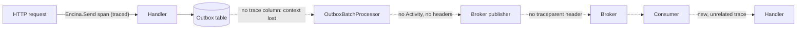
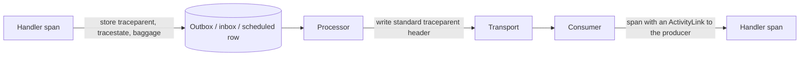

# Observability assessment, 2026-10-05

This page explains where Encina's observability stands and why, for a maintainer or contributor deciding what to build next. It records the 2026-10-05 assessment, the evidence behind each finding, the issue that tracks each one, and how Encina compares with other .NET messaging libraries. It is an explanation page: the fixes themselves live in the linked issues. See the [assessments index](index.md) for how assessments are written.

Counts below were measured on 2026-10-05 with `Select-String` over `src/` and `tests/`; they are approximate and are not coverage figures. Every `file:line` was re-checked against the repository on the same date (the counts were not re-run; a spot check gave 1596 `[LoggerMessage]` and 466 `ForLogging(` against the 1581 and 468 below); the ones that moved are marked "(moved)".

## Verdict

The base is good. Structured logs, health checks and the trace of the central dispatcher (`Encina.Send`) are well built and protect personal data. The problem is where observability matters most: the asynchronous and external boundaries. No transport, cache, lock, ADO or Dapper provider, MongoDB, Polly, Hangfire or Quartz package emits spans or metrics, and trace context does not cross the outbox or the brokers. `WithEncina()` also does not listen to most compliance and security sources, so a user who follows the documented path does not receive that telemetry.

## Summary

| Severity | Findings | Tracked by |
|---|---|---|
| Severe | 12 (1 to 12 below) | #1787, #1788, #1789, #1790, #1791 |
| Minor | 5 rows below (3 tracked: phantom source, RabbitMQ publisher, stale backlog; 2 not issued) | #1790, #1792, #1794 |
| Not issued | Finding 10 (provider-matrix gaps) | No issue in this set; existing backlog, see [finding 10](#severe-findings) |

## What is good

| Point | Evidence |
|---|---|
| The core dispatcher is traced and does not leak personal data | `src/Encina/Diagnostics/EncinaDiagnostics.cs:12-43`: guards with `HasListeners()` and sets only the error code as status (#1319) |
| Structured logs under governance | 1581 `[LoggerMessage]`, 88 ranges in `EventIdRanges.cs`, and the test `EncinaEventIdAllocationTests.cs` ([ADR-021](../../architecture/adr/021-eventid-uniqueness-enforcement.md)) |
| Exceptions do not leak into logs | `ForLogging()` is used 468 times; `LoggerExceptionLeakStaticScanTests.cs` scans all of `src` |
| Broad health checks | 92 `*HealthCheck.cs` files (database, 7 transports, compliance); results carry only the exception type (`EncinaHealthCheck.cs:92`) |
| Zero cost when nobody listens | `HasListeners()` guards, for example `OutboxActivitySource.cs:36-39` |
| Gaps are registered as issues | #725, #721-#728, #132, #265, #1043, #1048, #906: all open on 2026-10-05 |

## Where trace context stops

Solid arrows are instrumented today; dashed arrows are the boundaries the findings below describe. The design proposed for the ADR ([#1791](https://github.com/dlrivada/Encina/issues/1791); not yet decided) persists the W3C context with the message and restores it on the consumer:

## Findings

### Severe findings

| # | Finding | Evidence | Issue |
|---|---|---|---|
| 1 | No trace propagation: not in the outbox, not in the transports, no `traceparent` | 0 matches of `traceparent`, `ActivityLink` or `TextMapPropagator` in `src`. `src/Encina.Messaging/Outbox/IOutboxMessage.cs:21-72` has no trace field. `src/Encina.RabbitMQ/RabbitMQMessagePublisher.cs:61-67` sets no headers | [#1791](https://github.com/dlrivada/Encina/issues/1791) (related #132, #1164, #725) |
| 2 | About two thirds of projects have no spans or metrics | 35 of the 106 projects counted as `src/*/*.csproj` on 2026-10-05 have instrumentation (the 35 comes from the scan, repeated and confirmed; the project total was re-counted that day). Without `Testing.*`, the real gap is about 59 to 61 packages | [#1791](https://github.com/dlrivada/Encina/issues/1791) |
| 3 | `WithEncina()` registers about 19 sources and only the `"Encina"` meter | `src/Encina.OpenTelemetry/ServiceCollectionExtensions.cs:179-210` (19 `AddSource` calls, one `AddMeter`). No `Encina.Compliance.*` or `Encina.Security.*` source is registered there or by any other package. Only ABAC has an issue (#1637). The exact number of orphan sources is not verified | [#1787](https://github.com/dlrivada/Encina/issues/1787) |
| 4 | `EncinaError.Message` or an exception message reaches the Activity status in 26 files, against [`AGENTS.md`](../../../AGENTS.md) section 3 | Search for `SetStatus(Error, ...Message)`. Examples: `src/Encina.OpenTelemetry/MessagingStores/InstrumentedOutboxStore.cs:44,62,72,87,108` reaching `:213`, and, for an exception message, `src/Encina.Security.PII/Diagnostics/PIIDiagnostics.cs:135` (`exception.Message`). In the core, `src/Encina/Pipeline/Behaviors/CommandActivityPipelineBehavior.cs:155-158` (tag `FailureMessage`). Only the saga store has an open bug (#1468) | [#1788](https://github.com/dlrivada/Encina/issues/1788) |
| 5 | A returned `Left` does not mark the command span as error | `CommandActivityPipelineBehavior.cs:53-56` returns before `RecordOutcome`, so `RecordErrorOutcome` (`:162-168`) is dead code. The query behavior was not verified in the second pass | [#1789](https://github.com/dlrivada/Encina/issues/1789) |
| 6 | Dead and duplicated instrumentation | `Outbox/Inbox/SagaActivitySource` in `Encina.Messaging` have no callers. `InstrumentedOutboxStore.cs:24` creates `"Encina.Messaging.Outbox"` again. Without the OpenTelemetry package, outbox, inbox and saga emit no spans. `OutboxBatchProcessor` has no Activity | [#1790](https://github.com/dlrivada/Encina/issues/1790) |
| 7 | No exporters and no OpenTelemetry logs wired | 0 `AddOtlpExporter` or `WithLogging`. Milestone 30: 25 open and 0 closed | [#1791](https://github.com/dlrivada/Encina/issues/1791) (backlog: [#1794](https://github.com/dlrivada/Encina/issues/1794)) |
| 8 | Neither logs nor traces are correlated from Encina | 0 `BeginScope` or `ActivityTrackingOptions` in `src` | [#1791](https://github.com/dlrivada/Encina/issues/1791) |
| 9 | Health checks do not separate liveness from readiness | `src/Encina.AspNetCore/Health/HealthCheckBuilderExtensions.cs:32` uses `["encina","ready"]`. `"live"` appears only in comments. #454 is open | [#1791](https://github.com/dlrivada/Encina/issues/1791) (existing #454) |
| 10 | Gaps against the [`AGENTS.md`](../../../AGENTS.md) section 5 matrices | Health checks: 6 of 8 caches have none, and neither do the InMemory, Redis.PubSub and GraphQL transports. The packages `DistributedLock.PostgreSQL` and `.MySQL` are missing (`Test-Path` False for `src/Encina.DistributedLock.PostgreSQL` and `src/Encina.DistributedLock.MySQL`) | No issue in this set; the existing backlog covers it and [#1794](https://github.com/dlrivada/Encina/issues/1794) triages it |
| 11 | OpenTelemetry semantic conventions are not followed | `ActivityTagNames.cs` mixes standard keys with invented ones (`messaging.message.processed` at `src/Encina.OpenTelemetry/ActivityTagNames.cs:30`, `messaging.message.cron_expression` at `:48`); there are no `db.*` or `rpc.*` attributes. #177 and #185 are open | [#1791](https://github.com/dlrivada/Encina/issues/1791) |
| 12 | Nothing runnable for the user: no dashboards, no guide | `.github/observability/` contains no dashboard `.json`. There is no observability ADR and #906 is open | [#1791](https://github.com/dlrivada/Encina/issues/1791) (existing #906) |

### Minor findings

| Finding | Evidence | Issue |
|---|---|---|
| Phantom source `"Encina.Cdc.Sharded"` | `src/Encina.OpenTelemetry/ServiceCollectionExtensions.cs:181` | [#1790](https://github.com/dlrivada/Encina/issues/1790) |
| RabbitMQ publisher reads `DateTimeOffset.UtcNow` (breaks the `TimeProvider` rule) and generates a random `MessageId` instead of the outbox message id | `src/Encina.RabbitMQ/RabbitMQMessagePublisher.cs:65-66,112-113` (the assessment cited `:66,113`; lines 65 and 112 are the random `MessageId` of the two publish paths) | [#1792](https://github.com/dlrivada/Encina/issues/1792) |
| The backlog is stale: #174, #184 and #185 are open although parts already exist | See root causes | [#1794](https://github.com/dlrivada/Encina/issues/1794) |
| Default service name `"Encina"` | (moved) `src/Encina.OpenTelemetry/EncinaOpenTelemetryOptions.cs:11`; the assessment cited `ServiceCollectionExtensions.cs:173`, which now reads `options.ServiceName` at `:174` | None opened; decided in the ADR ([#1791](https://github.com/dlrivada/Encina/issues/1791)) |
| 17 unconditional `AddHostedService`, 0 `exception` events, three different health-check shapes (42/30/8), about 633 to 721 direct `logger.LogX` calls without an EventId | Counts as in the assessment, not re-counted | None opened |

## Root causes

The drift is from the start of the project, not from recent weeks.

| Cause | Evidence |
|---|---|
| Promises were written before the code and the gap was never closed | #72 ("Telemetry exhaustive tests", 2025-12-24) and #132 (W3C propagation, 2025-12-27) are both still open. The first commit of `ServiceCollectionExtensions.cs` (2026-02-17) is titled "comprehensive OpenTelemetry instrumentation for all features". #725 (transports) is from 2026-03-10 and #1637 from 2026-10-02: the same kind of gap throughout |
| Each module instrumented what it saw inside, not the boundaries between modules | Every new package (compliance, security, sharding) brought its own source and meters. Cross-cutting concerns (propagation, transports, providers) belonged to no package |
| Registration is manual, with literals, and no machine checks it | Sources are `internal const` in each assembly, so someone must copy the name into `WithEncina()`. No test compares "defined" with "registered", which is why phantom and orphan sources exist |
| Rules were applied as patches, not as invariants | #1319 fixed `Message` in the core, but there is no static scan for `SetStatus` or tags, although there is one for loggers |
| No written design | Without an observability ADR, each session (human or AI) chose its own naming, units and prefixes |
| The backlog is not pruned | Old issues mix done and pending work, which hides what is missing |

## Proposal

Machine-enforced rules first, then design.

| Step | What | Issue |
|---|---|---|
| 1 | Architecture test: every `ActivitySource` and `Meter` is subscribed by `WithEncina()`; it also fails on phantom sources | [#1787](https://github.com/dlrivada/Encina/issues/1787) |
| 2 | Static leak scan: extend `LoggerExceptionLeakStaticScanTests` to `SetStatus(..., *.Message)` and tags | [#1788](https://github.com/dlrivada/Encina/issues/1788) |
| 3 | Unit test: a returned `Left` leaves the span in `Error` | [#1789](https://github.com/dlrivada/Encina/issues/1789) |
| 4 | Naming rule (test or analyzer): prefix `encina.`, lower case, no `_total`, unit `s` | [#1791](https://github.com/dlrivada/Encina/issues/1791) |
| 5 | Remove dead sources and the phantom source | [#1790](https://github.com/dlrivada/Encina/issues/1790) |
| 6 | ADR on observability conventions: semantic conventions, names, W3C propagation in the outbox and every transport, what each provider family emits, liveness versus readiness. Then persist trace context in outbox, inbox and scheduling (#1164, #132) and instrument the 10 transports (#725) coherently | [#1791](https://github.com/dlrivada/Encina/issues/1791) |
| 7 | Fix the RabbitMQ publisher (`TimeProvider`, outbox message id) | [#1792](https://github.com/dlrivada/Encina/issues/1792) |
| 8 | Triage the backlog (#174, #184, #185, #622, #142) | [#1794](https://github.com/dlrivada/Encina/issues/1794) |

Issue titles:

| Issue | Title |
|---|---|
| [#1787](https://github.com/dlrivada/Encina/issues/1787) | `[TEST] Architecture test: every ActivitySource and Meter is subscribed by WithEncina()` |
| [#1788](https://github.com/dlrivada/Encina/issues/1788) | `[BUG] EncinaError.Message reaches Activity status and tags in about 26 satellite files` |
| [#1789](https://github.com/dlrivada/Encina/issues/1789) | `[BUG] Command and query activity behaviors leave spans Unset when the handler returns Left` |
| [#1790](https://github.com/dlrivada/Encina/issues/1790) | `[DEBT] Remove dead Outbox/Inbox/Saga ActivitySources and the phantom Encina.Cdc.Sharded source` |
| [#1791](https://github.com/dlrivada/Encina/issues/1791) | `[SPIKE] ADR: Encina observability conventions and cross-boundary trace propagation` |
| [#1792](https://github.com/dlrivada/Encina/issues/1792) | `[BUG] RabbitMQ publisher reads DateTimeOffset.UtcNow and drops the outbox message id` |
| [#1794](https://github.com/dlrivada/Encina/issues/1794) | `[DEBT] Triage the stale observability backlog (#174, #184, #185, #622, #142)` |

## How Encina compares

The assessment first compared Encina with other libraries from memory. On the same day a second pass read the official documentation and the source files of each library; the table below comes from that pass. "unverified" marks anything that was not confirmed.

| Library | Source and meter | Propagation | Span status on failure | Semantic conventions | Metric units |
|---|---|---|---|---|---|
| [MassTransit](https://github.com/MassTransit/MassTransit/blob/develop/src/MassTransit/Logging/Diagnostics/DiagnosticHeaders.cs) | One source and one meter, both `"MassTransit"` | Own header `MT-Activity-Id`; header `MT-Activity-Propagation` selects link, new trace or parent per message | Full exception message in status and event | Pre-1.24 names (`messaging.operation`) plus `messaging.masstransit.*` | `ms` histograms, unit `ea` counters |
| [NServiceBus](https://github.com/Particular/NServiceBus/tree/master/src/NServiceBus.Core/OpenTelemetry/Tracing) ([docs](https://docs.particular.net/nservicebus/operations/opentelemetry)) | Source `NServiceBus.Core`, meter `NServiceBus.Core.Pipeline.Incoming`; on by default in v10 | `traceparent` header plus baggage; send is a child, publish is a link, switchable per call | `ex.Message` in status and `ex.ToString()` in the event | Custom `nservicebus.*` only | Units not verified |
| [Wolverine](https://wolverinefx.net/guide/logging.html) ([source](https://github.com/JasperFx/wolverine/blob/main/src/Wolverine/Runtime/WolverineTracing.cs)) | Source `"Wolverine"`, meter `"Wolverine:{ServiceName}"` | Parent id stored in the envelope, so it survives the durable outbox; retries link to the failed attempt | Exception type name only | Pre-1.24 names plus `wolverine.*` | `ms` histograms; gauges for inbox, outbox and scheduled counts |
| [Brighter](https://brightercommand.gitbook.io/paramore-brighter-documentation/health-checks-and-observability/telemetry) ([source](https://github.com/BrighterCommand/Brighter/blob/master/src/Paramore.Brighter/Observability/BrighterTracer.cs)) | Source and meter `"Paramore.Brighter"` | W3C `traceparent` and `tracestate` in the message header; consumer is a child | `ex.Message` in status | Current names (the closest to the spec) | Derived from spans; known over-count bugs ([#4476](https://github.com/BrighterCommand/Brighter/issues/4476)) |
| Dapr ([tracing](https://docs.dapr.io/operations/observability/tracing/tracing-overview/), [metrics](https://docs.dapr.io/operations/observability/metrics/metrics-overview/)) | Sidecar traces; the .NET SDK has only `"Dapr.Workflow"` | W3C trace context written by the sidecar; header names unverified | SDK sets status with no description | Sidecar span names unverified | Prometheus, `dapr_*`, millisecond buckets |
| [Rebus](https://github.com/rebus-org/Rebus.OpenTelemetry) | Source and meter `"Rebus.Diagnostics"` | Custom headers `rbs-ot-tracestate` and `rbs-ot-correlation-context` | `e.Message` in status | Pre-1.24 names | Message type embedded in the metric name |
| MediatR ([repository](https://github.com/LuckyPennySoftware/MediatR)) | None found; users write a pipeline behavior | In-process only | Not applicable | Not applicable | Not applicable |
| Encina | `"Encina"` source and meter plus per-package sources, only part of them registered | None across the outbox or brokers (findings 1 and 3) | Core: error code only. Satellites: message in 26 files (finding 4) | Mixed standard and invented keys (finding 11) | Mostly `ms` today (87 `ms` against 1 `s`, not verified); the spec uses `s` |

The MediatR row rests on GitHub code search, which can be incomplete: "none" is likely, not proven.

### Corrected view of the assessment's section 6

The assessment's section 6 listed the comparison with MassTransit, NServiceBus, Wolverine, Brighter and Dapr as unverified, from memory. With the sources read, the corrected statement is:

- NServiceBus and MassTransit both record exception messages in span status (NServiceBus also the full `ToString()`), as do Brighter and Rebus. Wolverine records the exception type name only; the Dapr .NET SDK's error status carries no description.
- Encina's rule that `EncinaError.Message` never reaches spans ([`AGENTS.md`](../../../AGENTS.md) section 3, [ADR-006](../../architecture/adr/006-pure-rop-exception-handling.md) for the `Either` model) is therefore stricter than every compared library except Wolverine. Two qualifiers: the Dapr .NET SDK status also carries no description, and Wolverine's `AddException` still places the exception message in the span event, so no compared library is clean on every channel.
- The rule is stricter in policy than in practice: the core dispatcher complies, but 26 satellite files still do not (finding 4, [#1788](https://github.com/dlrivada/Encina/issues/1788)).
- No competitor enforces the rule mechanically, so the static scan of [#1788](https://github.com/dlrivada/Encina/issues/1788) goes beyond them.

### OpenTelemetry messaging conventions, status in 2026

Source: the [messaging spans](https://opentelemetry.io/docs/specs/semconv/messaging/messaging-spans/), [messaging metrics](https://opentelemetry.io/docs/specs/semconv/messaging/messaging-metrics/) and [recording errors](https://opentelemetry.io/docs/specs/semconv/general/recording-errors/) pages, fetched 2026-10-05.

| Topic | Status |
|---|---|
| Stability | Development, for spans and for all four client metrics. Instrumentations should not change the emitted version by default until the conventions are stable; migration uses `OTEL_SEMCONV_STABILITY_OPT_IN` |
| Attribute names | The current set replaced the v1.24.0 names (`messaging.operation` became `messaging.operation.name` and `messaging.operation.type`; `messaging.message_id` became `messaging.message.id`). The exact latest release number was not stated in the fetched text (unverified) |
| Span name | `{messaging.operation.name} {destination}` |
| Context | Consumer spans correlate with producers by links; a parent is allowed only for a single-message process span |
| Metrics | `messaging.client.operation.duration` and `messaging.process.duration` (histograms, `s`), `messaging.client.sent.messages` and `messaging.client.consumed.messages` (counters, `{message}`) |
| Errors | `error.type` only on failure, low cardinality; status description without sensitive details; do not record the same exception twice |

Only Brighter follows the current names; MassTransit, Wolverine and Rebus use the older ones, and NServiceBus uses custom names. MassTransit, Wolverine, Rebus and Dapr emit `ms` histograms; the NServiceBus units were not verified, and Brighter derives its metrics from spans.

### What the comparison implies for Encina

| Finding | Recommendation from the research |
|---|---|
| 1 (propagation) | Persist `traceparent`, `tracestate` and baggage with outbox, inbox and scheduled rows (Wolverine's model); write the standard `traceparent` header in each transport; default to a link on the consumer per the spec, with a per-message opt-in to parent (MassTransit and NServiceBus both offer a switch) |
| 2, 3 (coverage, registration) | Prefer few well-known sources (`Encina` plus family-level ones) over one per package. Combine the architecture test with a naming convention such as `AddSource("Encina*")`; trailing-wildcard support in OpenTelemetry .NET `AddSource` was not re-verified |
| 4 (message in status) | Copy Wolverine: status description is the error code or exception type name; `error.type` carries the code; never `exception.message` or stack-trace events |
| 5 (`Left`) | Treat `Left` as a failure: status `Error`, `error.type` is the error code. No compared library models `Either`, so there is nothing to copy |
| 7 (exporters) | Keep exporters out of the library; ship a sample and documentation |
| 8 (correlation) | Document `ActivityTrackingOptions` instead of hand-made scopes (low priority; no compared library adds `BeginScope` itself) |
| 11 (conventions) | Use the current names, record the pinned convention version in the ADR, keep one constants file, and put custom keys under an `encina.` prefix |
| Metrics (not a numbered finding) | Emit metrics directly, independent of tracing (Brighter's span-derived metrics over-count); dotted lower-case names, UCUM units, duration in seconds, never a message type in a name. Add outbox, inbox and saga gauges and counters in the style of Wolverine and MassTransit, tagged by message type and never by id |
| Opt-in cost | Keep the `HasListeners()` guards and add an options flags enum for payload and database detail, off by default (Brighter and Wolverine do this) |

## Not verified

- The exact per-package counts (34/34/77/62), the roughly 30 orphan sources, the roughly 230 unlistened instruments and the naming ratios (70 of 409; 87 `ms` against 1 `s`).
- The behavior of `QueryActivityPipelineBehavior`, and whether propagation is also missing in transports other than RabbitMQ (checked by reading text, not by running).
- Tags that carry personal identifiers (`security.user_id`, the shard key, `entity_id`).
- Whether registration order loses decorators in practice, and whether the 17 initializers are cheap.
- From the research: MassTransit default instrument names and NServiceBus meter units were not read in full; the NServiceBus `EnableOpenTelemetry()` call name before v10; Wolverine broker header names and logging scopes; Brighter and Dapr logging integration; Dapr sidecar span names and .NET SDK pub/sub tracing.

Discarded after refutation: that the outbox stored `EncinaError.Message` in clear (`OutboxBatchProcessor.cs:218-219` stores a code or a type), and the figure "15 sources / 52 meters".

## Related

- Rules measured against: [`AGENTS.md`](../../../AGENTS.md) sections 3 (errors never reach telemetry), 6 (cross-cutting check, [ADR-018](../../architecture/adr/018-cross-cutting-integration-principle.md)) and 7 (EventIds, [ADR-021](../../architecture/adr/021-eventid-uniqueness-enforcement.md)).
- No observability ADR exists yet; [#1791](https://github.com/dlrivada/Encina/issues/1791) creates it.
- The other assessment of the same date: [Railway Oriented Programming](2026-10-05-railway-oriented-programming.md).
