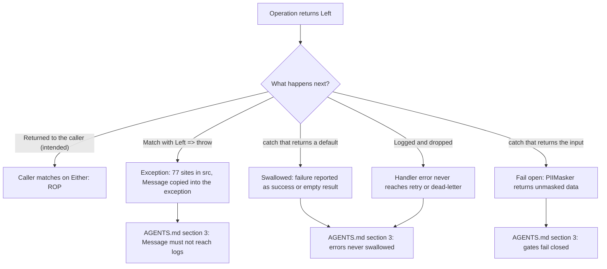

# Railway Oriented Programming assessment, 2026-10-05

This page explains how well Encina follows its Railway Oriented Programming (ROP) rule and why the gaps exist, for a maintainer or contributor deciding what to enforce next. It records the 2026-10-05 assessment of ROP and LanguageExt discipline, with the evidence behind each finding and the issue that tracks it. It is an explanation page: the fixes live in the linked issues. See the [assessments index](index.md) for how assessments are written.

Counts were measured on 2026-10-05 with `Select-String` over `src/` and `tests/`, and are approximate (a second independent count gave 581 non-guard throws at HEAD against the 595 of the first). They are not coverage figures. Every `file:line` was re-checked against the repository on the same date; the one that moved is marked "(moved)".

## Verdict

ROP is real and widely used. Of 378 asynchronous methods in the abstraction interfaces, 345 return `Either<EncinaError, ...>`, and most `throw` statements are guards or startup errors. Measured from the first commit (2025-12-06) and not only the last weeks, the erosion came in two bursts early in the project: January to February 2026 (providers, sharding, modules) and March 2026 (ABAC and compliance aggregates). Since then the ratio has barely moved. The real problem is not recent drift: nothing mechanical stops it from happening again, and concrete debt from those bursts remains. The LanguageExt style in use is imperative, with almost no composition.

The rule itself is in [`AGENTS.md`](../../../AGENTS.md) section 3 and in [ADR-001](../../architecture/adr/001-railway-oriented-programming.md) and [ADR-006](../../architecture/adr/006-pure-rop-exception-handling.md).

## Summary

| Severity | Findings | Tracked by |
|---|---|---|
| Priority security bug | 1 (finding 4a: `PIIMasker` fails open; it is part of the assessment's severe finding 4) | [#1793](https://github.com/dlrivada/Encina/issues/1793) |
| Severe | 8 (the assessment's numbering; finding 4 is split into 4a and 4b below) | #1793, #1795 to #1802 |
| Minor | 5 groups | None opened; partly covered by [#1795](https://github.com/dlrivada/Encina/issues/1795) |

## Where a `Left` goes today

The intended rule, recorded in [`AGENTS.md`](../../../AGENTS.md) section 3: a `Left` fails the operation (retry, dead-letter or exception per its semantics), never reports success, and `EncinaError.Message` never reaches logs. What is allowed to throw (guards, startup, framework boundaries) is not written down yet; that is [#1800](https://github.com/dlrivada/Encina/issues/1800).

## What is good

| Fact | Evidence |
|---|---|
| Public interfaces are almost all `Either` | 345 of 378 `Task`/`ValueTask...Async` methods. Example: `src/Encina.Security.ABAC/Persistence/IPolicyStore.cs:47-196` |
| The central converter is correct and respects cancellation | `src/Encina/Results/EitherHelpers.cs:38,65,89,116` rethrow `OperationCanceledException` and convert the rest; 296 calls |
| `catch` blocks that convert to `Left` keep the cause | 313 of 317 pass the exception to `Create` or `FromException`; an upper bound by heuristic |
| The course was corrected once | Commits 873ce415 (#670), 3e53b962 (#672) and f0a24f67 (#673), February 2026. Not reproduced in a second pass (not verified) |
| The `Either`-to-`throw` ratio recovered | 7.6 (Dec 2025), 3.4 (Jan 2026), 7.1 (Feb), 7.2 (Mar to Sep), 7.3 today |
| Typed assertion helpers exist | `ShouldBeErrorWithCode`, `ShouldBeError`, `ShouldBeSuccess` and similar in (the assessment named `EncinaErrorWithCode`, which does not exist in `src/`) `src/Encina.Testing.Shouldly/EitherShouldlyExtensions.cs:41-335`. Zero FluentAssertions |

## Findings

### Severe findings

| # | Finding | Evidence | Issue |
|---|---|---|---|
| 1 | No mechanical ROP control | `EncinaArchitectureRules.cs` (`src/Encina.Testing.Architecture`) mentions `Either` only in XML documentation (lines 397 and 592). No CA1031, CA2201 or other throw/catch rule in `.editorconfig`, and no workflow checks ROP. The only defenses are text: `.coderabbit.yaml:45` and `.claude/agents/pr-reviewer.md:67`. Neither `issue-worker.md` nor `worker-brief/SKILL.md` mentions ROP | [#1795](https://github.com/dlrivada/Encina/issues/1795) |
| 2 | 77 conversions of `Left` to exception in `src` | 10 in each of the 6 ADO and Dapper providers, 5 in EF Core, 3 in MongoDB and about 14 in other packages; some, such as Hangfire and Quartz, are legitimate boundaries. `src/Encina.ADO.MySQL/ABAC/PolicyStoreADO.cs:76,111,231,266` throw inside runtime data paths. `src/Encina.ADO.PostgreSQL/ServiceCollectionExtensions.cs:217,285` use `throw new InvalidOperationException(error.Message)`, which puts `EncinaError.Message` into an exception that [`AGENTS.md`](../../../AGENTS.md) section 3 says must not reach logs. Whether those exceptions are logged was not verified | [#1797](https://github.com/dlrivada/Encina/issues/1797) |
| 3 | Compliance aggregates enforce business rules with exceptions | 84 `throw new InvalidOperationException` in `*Aggregate*.cs` files, for example `src/Encina.Compliance.Consent/Aggregates/ConsentAggregate.cs:212,235,241,272`. `src/Encina.Compliance.Consent/Services/DefaultConsentService.cs:233,291,357` catches the whole `InvalidOperationException` type, so a repository failure would look like a business error. Only the Consent service was reviewed | [#1798](https://github.com/dlrivada/Encina/issues/1798) |
| 4a | **Priority security bug.** `PIIMasker` fails open | `src/Encina.Security.PII/PIIMasker.cs:110-120`: on an invalid regex it returns the value unmasked. [`AGENTS.md`](../../../AGENTS.md) section 3 requires security gates to fail closed; this can leak personal data | [#1793](https://github.com/dlrivada/Encina/issues/1793) |
| 4b | Other `catch` blocks fail open or swallow the error | `src/Encina.DomainModeling/Repository.cs:797-804`: `catch { return []; }`. `src/Encina.SignalR/MediatorHub.cs:105-129` only logs the error. InMemory, MQTT and Redis.PubSub log the handler error and drop it (partly verified) | [#1796](https://github.com/dlrivada/Encina/issues/1796) |
| 5 | The ADRs contradict each other | `docs/architecture/adr/001-railway-oriented-programming.md:42` (also 107, 228 and 243) keeps an "Exception Safety Net" that [ADR-006](../../architecture/adr/006-pure-rop-exception-handling.md) removed. Which one the running code follows is not verified | [#1800](https://github.com/dlrivada/Encina/issues/1800) |
| 6 | Documentation teaches `Left => throw` without a rule | `src/Encina.GraphQL/README.md:54,138,215,220`, `src/Encina.AzureFunctions/README.md:107,398`, `src/Encina.GuardClauses/README.md:59-65`, `docs/features/audit-tracking.md:990,1004`, `docs/features/field-level-encryption.md:236` | [#1801](https://github.com/dlrivada/Encina/issues/1801) |
| 7 | Many tests only check that the result is `Left` | `tests/` has 1,577 `IsLeft.ShouldBeTrue` against 107 `ShouldBeErrorWithCode`, 129 `ShouldBeError(` and 29 `ShouldBeLeft(`. If the code returns the wrong error, those tests still pass | [#1802](https://github.com/dlrivada/Encina/issues/1802) |
| 8 | `IDistributedLockProvider` is exception-based | `AcquireAsync` throws `LockAcquisitionException` (`src/Encina.DistributedLock/IDistributedLockProvider.cs:92-93`: the `<exception>` documentation at `:92`, the method at `:93`), and the rule does not provide for this exception | [#1799](https://github.com/dlrivada/Encina/issues/1799) |

### Minor findings

| Finding | Evidence | Issue |
|---|---|---|
| Composition is almost absent | 297 `if (x.IsLeft)` and 99 `Bind`, but 0 `Traverse`/`Sequence` and 2 `EitherAsync`, none of them the LanguageExt type | None opened |
| Fragile extractions | 59 explicit `(EncinaError)x` conversions and 45 to 53 `_ => default!`, for example `src/Encina/Sharding/Resharding/Phases/CopyingPhase.cs:74` (and a similar `null!` fallback at `:71`; the assessment cited `:71,74` for `default!`). Safe today because a guard precedes them, but easy to break | None opened |
| Errors without a code | `EncinaError.New` is used 138 to 141 times against about 700 of `EncinaErrors.Create`, so about 16 to 17 % of errors carry no code | None opened |
| Reinvented helpers | `src/Encina.DomainModeling/EitherExtensions.cs` reimplements LanguageExt functions; `GetOrThrow` (line 389) probably has no caller | None opened |
| Synchronous blocking | About 28 `GetAwaiter().GetResult()` in production, for example `src/Encina.ADO.MySQL/Tenancy/TenancyServiceCollectionExtensions.cs:74` | None opened ([`AGENTS.md`](../../../AGENTS.md) section 3 already requires asynchronous database calls) |

## Root causes

| # | Cause | Evidence |
|---|---|---|
| 1 | The rule exists only as prose | "NEVER use exceptions for business logic" does not say which cases are allowed, and the ADRs contradict each other. An agent reading ADR-001 receives two opposite rules |
| 2 | Mass generation from a template | The 10-provider pattern multiplies every defect by 10: the 77 `Left`-to-throw sites mostly come from copying one block. The January burst raised production `throw` from 47 to 308 in a month |
| 3 | Documentation and tests act as the model | READMEs and about 287 test lines with `Left: x => throw` teach exactly the style the project does not want, and agents imitate it |
| 4 | No machine watches | Review (CodeRabbit, the reviewer) checks ROP only superficially. The February correction left no barrier behind, so the March debt (ABAC, aggregates) entered without resistance |
| 5 | A design decision is missing for aggregates | Nobody has decided whether event-sourced aggregates return `Either` or are a documented exception |

## Proposal

From least to most effort.

| Step | What | Kind | Issue |
|---|---|---|---|
| 1 | Architecture test with an initial allowlist: the roughly 595 non-guard throws and the 77 `Left`-to-throw sites are recorded and any new one fails; the list can only shrink | Machine | [#1795](https://github.com/dlrivada/Encina/issues/1795) |
| 2 | In the same test, fail any `catch (Exception)` that neither returns `Left`, rethrows nor uses `ForLogging()` | Machine | [#1795](https://github.com/dlrivada/Encina/issues/1795) |
| 3 | Rule in `Encina.Testing.Architecture`: public methods of stores, orchestrators and handlers return `Either` (named list, like `EventIdUniquenessRule`, [ADR-021](../../architecture/adr/021-eventid-uniqueness-enforcement.md)) | Machine | [#1795](https://github.com/dlrivada/Encina/issues/1795) |
| 4 | Enable CA1031 and CA2201 as warnings in `src/`, with per-file exclusions for known boundaries | Machine | [#1795](https://github.com/dlrivada/Encina/issues/1795) |
| 5 | Add an ROP checklist to `pr-reviewer.md`, `adversarial-reviewer.md`, `worker-brief` and `.coderabbit.yaml` | Process | No issue in this set |
| 6 | One ADR on when to throw and when to return `Either` (guards and startup: throw; expected failure: `Either`; framework boundary: translate), replacing the contradictions of ADR-001 and ADR-006 | Design | [#1800](https://github.com/dlrivada/Encina/issues/1800) |
| 7 | Decide the aggregate design (`Decide` returns `Either`, or a documented exemption) and the lock provider design | Design | [#1798](https://github.com/dlrivada/Encina/issues/1798), [#1799](https://github.com/dlrivada/Encina/issues/1799) |

Issue titles:

| Issue | Title |
|---|---|
| [#1793](https://github.com/dlrivada/Encina/issues/1793) | `[BUG] PIIMasker returns the unmasked value when a masking regex is invalid (fail open)` (security, priority) |
| [#1795](https://github.com/dlrivada/Encina/issues/1795) | `[INFRA] Architecture test with a baseline allowlist for non-guard throws and Left-to-throw conversions` |
| [#1796](https://github.com/dlrivada/Encina/issues/1796) | `[BUG] Repository, MediatorHub and some transports swallow failures with bare catch blocks` |
| [#1797](https://github.com/dlrivada/Encina/issues/1797) | `[DEBT] Provider Left-to-throw conversions (77 sites) leak EncinaError.Message into exception messages` |
| [#1798](https://github.com/dlrivada/Encina/issues/1798) | `[SPIKE] Either-returning decisions for event-sourced compliance aggregates` |
| [#1799](https://github.com/dlrivada/Encina/issues/1799) | `[SPIKE] IDistributedLockProvider: exceptions or Either` |
| [#1800](https://github.com/dlrivada/Encina/issues/1800) | `[DEBT] Reconcile ADR-001 and ADR-006 on the exception safety net (one rule for throw vs Either)` |
| [#1801](https://github.com/dlrivada/Encina/issues/1801) | `[DEBT] Docs and READMEs teach Left => throw without a rule` |
| [#1802](https://github.com/dlrivada/Encina/issues/1802) | `[TEST] Replace bare IsLeft assertions with error-code assertions` |

## Not verified

- Which behavior the running code follows: the "safety net" of ADR-001 or the fail-fast of ADR-006.
- Whether the other compliance services have the same broad `catch` as Consent.
- Whether the exceptions that carry `error.Message` end up in the logs.
- The analysis of pull requests since 2026-09-20 (59 throws and 79 catches, almost all legitimate). It is consistent with the flat trend but was not reproduced.
- The per-package test tables (Core, Caching, Tenancy and others) and the 43 % of bare assertions.
- Code from before the repository, from the SimpleMediator era: it cannot be measured.
- All figures come from regex and are approximate; for example a second independent count gave 581 non-guard throws at HEAD against the 595 of the first.
- The benefits of migrating to LanguageExt v5 are from memory and were not checked.

## Related

- Decisions: [ADR-001](../../architecture/adr/001-railway-oriented-programming.md), [ADR-006](../../architecture/adr/006-pure-rop-exception-handling.md); cross-cutting check: [ADR-018](../../architecture/adr/018-cross-cutting-integration-principle.md).
- The other assessment of the same date: [Observability](2026-10-05-observability.md), whose finding 4 (`EncinaError.Message` in span status) is the telemetry counterpart of finding 2 here.
