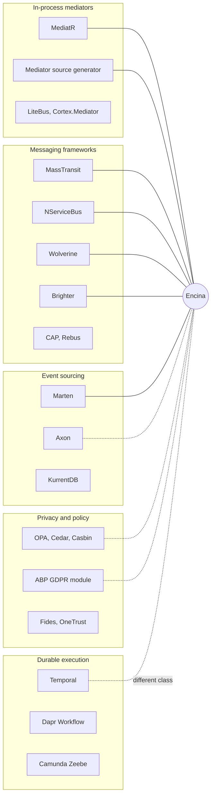

# Competitive landscape assessment, 2026-10-10

This page is for a maintainer or contributor who wants to know what exists around Encina, on any platform, topic by topic: what Encina has that the references lack, what they have that Encina lacks, and what they have in common. It is an explanation page, dated and evidence-backed, not a ranking and not marketing. The user-facing summary is the section [Where Encina stands](../../introduction.md#where-encina-stands) of the introduction; the issues that track each gap are linked from the tables below. See the [assessments index](index.md) for how assessments are written.

## Verdict

Encina overlaps with several product classes at once (in-process mediators, messaging frameworks, event-sourcing frameworks, privacy platforms) and is the only one found that combines an `Either`-based error model, a store matrix over ADO.NET, Dapper, EF Core and MongoDB, and in-process compliance modules. It is also pre-1.0, has a single maintainer and has no production track record, while several references have years of operations behind them and commercial support. Both statements hold together: the differentiators are real in the code, and the maturity gap is real in the issue list.

## What is good

Each item holds in `src/` or in a published record on 2026-10-10, and each names the topic table that compares it with the references.

| Strength | Evidence | Compared in |
|---|---|---|
| Failures are `Either<EncinaError, T>` values across the pipeline; no surveyed .NET mediator or messaging framework was found doing this | [ADR-001](../../architecture/adr/001-railway-oriented-programming.md), [ADR-006](../../architecture/adr/006-pure-rop-exception-handling.md) | [Error model](#error-model) |
| One store interface per messaging pattern, implemented over ADO.NET, Dapper, EF Core (SQL Server, PostgreSQL, MySQL) and MongoDB under a written rule | [`AGENTS.md`](../../../AGENTS.md) section 5; `src/Encina.Messaging` | [Messaging patterns and providers](#messaging-patterns-and-providers) |
| Compliance modules (consent, data subject rights, retention, NIS2, AI Act and others) run in the application layer next to the pipeline and stores | `src/Encina.Compliance.*`, [SPEC-002](../../specifications/SPEC-002-eu-regulatory-readiness.md) | [Privacy and compliance](#privacy-and-compliance) |
| Coverage, mutation and benchmark evidence is published, not claimed, and open defects are published too | [dashboards](https://dlrivada.github.io/Encina/), [SPEC-003](../../specifications/SPEC-003-closed-issue-knowledge-migration-and-quality-audit.md) | [Testing and quality evidence](#testing-and-quality-evidence) |
| Every messaging pattern is opt-in and off by default, so a project pays only for what it uses | [`AGENTS.md`](../../../AGENTS.md) section 3 | [Messaging patterns and providers](#messaging-patterns-and-providers) |

## Findings

Ranked by severity. Each finding names the topic table it comes from and the issue that tracks it; issue counts are not typed here because they drift (see [Maturity of Encina today](#maturity-of-encina-today) for the live links).

| Rank | Finding | Topic table | Tracked by |
|---|---|---|---|
| 1 | Pre-1.0 maturity: open p0 bugs, several shipped features that do not yet behave as documented, and no production track record, against references with years of operation | [Maturity](#maturity-of-encina-today) | [open p0 bugs](https://github.com/dlrivada/Encina/issues?q=is%3Aissue+is%3Aopen+label%3Abug+label%3Ap0-mandatory), Hardening milestone |
| 2 | Differentiators weakened by open bugs: dead-letter wiring, CDC outbox handler, saga timeouts, event-sourcing upcasting and projection rebuild, cross-tenant leaks | [Messaging](#messaging-patterns-and-providers), [Sagas](#sagas-and-workflows), [Event sourcing](#event-sourcing), [Multi-tenancy](#multi-tenancy) | [#1991](https://github.com/dlrivada/Encina/issues/1991), [#1968](https://github.com/dlrivada/Encina/issues/1968), [#2208](https://github.com/dlrivada/Encina/issues/2208), [#2187](https://github.com/dlrivada/Encina/issues/2187), [#2157](https://github.com/dlrivada/Encina/issues/2157), [#1963](https://github.com/dlrivada/Encina/issues/1963) |
| 3 | No operations tooling for failed messages, where the references ship a UI or an API | [Messaging](#messaging-patterns-and-providers) | [#2229](https://github.com/dlrivada/Encina/issues/2229), [#419](https://github.com/dlrivada/Encina/issues/419), [#445](https://github.com/dlrivada/Encina/issues/445) |
| 4 | A narrower transport list than the messaging frameworks, and no topology management from message types | [Messaging](#messaging-patterns-and-providers) | Post-1.0 transport milestone ([SPEC-000](../../specifications/SPEC-000-encina-1.0-baseline-and-release-scope.md)) |
| 5 | Not a durable-execution engine: sagas persist state but do not replay | [Sagas and workflows](#sagas-and-workflows) | Not planned (no issue found) |
| 6 | No source-generated dispatch or Native AOT, and no comparison benchmarks | [Mediator and CQRS core](#mediator-and-cqrs-core) | [#889](https://github.com/dlrivada/Encina/issues/889), [#2231](https://github.com/dlrivada/Encina/issues/2231) |
| 7 | Trace context propagation through brokers is not designed yet, and lock providers lack fencing tokens | [Observability](#observability), [Distributed locks](#distributed-locks-and-leader-election) | [#1791](https://github.com/dlrivada/Encina/issues/1791), [#218](https://github.com/dlrivada/Encina/issues/218) |
| 8 | Smaller ecosystem and no migration guide from the incumbent mediator | [Developer experience](#developer-experience) | [#85](https://github.com/dlrivada/Encina/issues/85) |

## Root causes

- **Pre-1.0 by policy.** The API is allowed to change and there is no release date, so features land before they are hardened ([`AGENTS.md`](../../../AGENTS.md) section 1).
- **Single maintainer.** One person builds, reviews and operates the project, which limits throughput and rules out commercial support.
- **Breadth before depth.** The scope covers every database provider of the matrix, several caches, many transports and a compliance suite ([SPEC-000](../../specifications/SPEC-000-encina-1.0-baseline-and-release-scope.md)); each addition multiplies the surface that must be correct.
- **The Hardening milestone is still open.** The bug clusters named in the topic tables are the work of that milestone and later ones, not yet done.

## How to read this page

- **Access date.** Every external source was read on 2026-10-10. Versions, licences and prices can change after that date.
- **Absence means "not found".** "Not found" or "No evidence found" means the research did not find the capability on the pages it read. It is not proof that the capability does not exist. Items the research could not confirm are marked "unverified".
- **Encina claims** were checked against `src/` and the issue tracker on the same date. "Shipped" means the code exists, not that it behaves correctly; open bugs are named where they weaken a claim.
- **No ranking.** A row says what each side has, not which is better. The right choice depends on the team.
- **No typed figures.** Encina coverage, mutation and benchmark numbers are never typed here; see the [dashboards](https://dlrivada.github.io/Encina/). Counts of issues are replaced by search links.

## Maturity of Encina today

| Fact | Evidence |
|---|---|
| Pre-1.0: the public API can still change, there is no backward compatibility | [`AGENTS.md`](../../../AGENTS.md) section 1, [SPEC-000](../../specifications/SPEC-000-encina-1.0-baseline-and-release-scope.md) |
| Latest release tag is v0.13.0; there is no 1.0 target date | `git tag` on 2026-10-10; [SPEC-000](../../specifications/SPEC-000-encina-1.0-baseline-and-release-scope.md) |
| Single maintainer, MIT licence, .NET 10 only | `LICENSE`, `Directory.Build.props` |
| Open p0 bugs exist and block 1.0 work in the Hardening milestone | [open bugs labelled p0](https://github.com/dlrivada/Encina/issues?q=is%3Aissue+is%3Aopen+label%3Abug+label%3Ap0-mandatory), [milestone v0.14.0 Hardening](https://github.com/dlrivada/Encina/milestones) |
| Several shipped features do not yet behave as documented (examples: saga timeouts [#2208](https://github.com/dlrivada/Encina/issues/2208), dead-letter wiring [#1991](https://github.com/dlrivada/Encina/issues/1991), CDC outbox handler [#1968](https://github.com/dlrivada/Encina/issues/1968)) | Each linked issue |
| Open defects are published openly, including a per-issue audit of closed work | [SPEC-003](../../specifications/SPEC-003-closed-issue-knowledge-migration-and-quality-audit.md) |

Issue counts drift daily, so none are typed here; use the links above for the current state.

## Where the references sit

Solid lines are direct functional overlap; dashed lines are partial overlap on one slice (policy decisions, privacy requests, event sourcing). Temporal, Dapr Workflow and Zeebe are a different product class (a runtime that replays workflows), not a library competitor.

## Topic by topic

Each table has one row per kind of finding. References are named with the source they were taken from.

### Mediator and CQRS core

| Item | Finding |
|---|---|
| References | MediatR ([NuGet](https://www.nuget.org/packages/MediatR)), martinothamar/Mediator ([GitHub](https://github.com/martinothamar/Mediator)), LiteBus ([GitHub](https://github.com/litenova/LiteBus)), Cortex.Mediator ([NuGet](https://www.nuget.org/packages/Cortex.Mediator)), Brighter and Darker ([GitHub](https://github.com/BrighterCommand/Brighter)), Wolverine ([docs](https://wolverinefx.net/tutorials/cqrs-with-marten.html)), FastEndpoints command bus ([docs](https://fast-endpoints.com/docs/command-bus)); outside .NET: NestJS CQRS ([recipe](https://docs.nestjs.com/recipes/cqrs)), Axon ([release notes](https://docs.axoniq.io/axon-framework-reference/5.2/release-notes/major-releases/)) |
| Encina has, they lack (as found) | Requests, notifications and streams with an `Either` result in one contract; three notification strategies (sequential, parallel, parallel-when-all); typed pre- and post-processors. Among the pure mediators found (MediatR, Mediator, LiteBus, Cortex), only Mediator's source generator advertises built-in OpenTelemetry, in its 3.1 previews ([README](https://github.com/martinothamar/Mediator)); Wolverine and Brighter, which are messaging frameworks, also document tracing. Encina's core emits traces and metrics too |
| They have, Encina lacks | Source-generated dispatch and Native AOT with build-time diagnostics (Mediator, per its README); convention-based handlers without interfaces (Wolverine); explicit numeric pipeline steps (Brighter `step:`); a very large ecosystem and tutorial base (MediatR) |
| Common | Request/handler dispatch, open-generic pipeline behaviors, pre/post processing |
| Notes | Ordering today is by registration; a named-stage contract is planned in [#2184](https://github.com/dlrivada/Encina/issues/2184). Generators are rejected in [ADR-005](../../architecture/adr/005-reject-source-generators.md) while [#889](https://github.com/dlrivada/Encina/issues/889) plans them post-1.0 (contradiction tracked in [#1717](https://github.com/dlrivada/Encina/issues/1717)). Comparison benchmarks: [#2231](https://github.com/dlrivada/Encina/issues/2231). MediatR migration guide: [#85](https://github.com/dlrivada/Encina/issues/85) |

### Error model

| Item | Finding |
|---|---|
| References | Effect for TypeScript ([GitHub](https://github.com/Effect-TS/effect)), Rust `Result`, Arrow for Kotlin, Vavr for Java, F# `Result` and Wlaschin's railway-oriented programming, ZIO for Scala (the last four unverified in the research, from background knowledge), LanguageExt and ErrorOr in .NET |
| Encina has, they lack | Every surveyed .NET mediator and messaging framework surfaces failures as exceptions (MediatR, Mediator, LiteBus, Brighter, Wolverine, MassTransit, NServiceBus, Rebus, CAP); none was found using `Either`. Outside .NET, none of the surveyed buses used a result type either (Watermill uses Go error values) |
| They have, Encina lacks | A typed error channel with typed requirements in one signature (Effect); ergonomic bind syntax (Rust `?`, Arrow `either { bind() }`); error accumulation as a first-class `Validation` (Vavr). `EncinaError` is one error type, not a typed union |
| Common | The railway idea itself: a step either continues or switches the rest of the chain to failure |
| Notes | Decisions: [ADR-001](../../architecture/adr/001-railway-oriented-programming.md), [ADR-006](../../architecture/adr/006-pure-rop-exception-handling.md). Message hygiene bugs weaken the claim today: [#2112](https://github.com/dlrivada/Encina/issues/2112), [#2108](https://github.com/dlrivada/Encina/issues/2108), [#1788](https://github.com/dlrivada/Encina/issues/1788). See the [ROP assessment](2026-10-05-railway-oriented-programming.md) |

### Messaging patterns and providers

| Item | Finding |
|---|---|
| References | MassTransit ([site](https://masstransit.massient.com/)), NServiceBus ([transports](https://docs.particular.net/transports/), [persistence](https://docs.particular.net/persistence/)), Wolverine ([durability](https://wolverinefx.net/guide/durability/)), CAP ([site](https://cap.dotnetcore.xyz/)), Rebus ([Pro](https://pro.rebus.fm/)), Brighter ([GitHub](https://github.com/BrighterCommand/Brighter)); outside .NET: Spring Modulith event publication registry ([docs](https://docs.spring.io/spring-modulith/reference/events.html)), Eventuate Tram ([manual](https://eventuate.io/docs/manual/eventuate-tram/latest/getting-started-eventuate-tram.html)), Debezium outbox router ([docs](https://debezium.io/documentation/reference/stable/transformations/outbox-event-router.html)), Watermill ([site](https://watermill.io/)) |
| Encina has, they lack | The same outbox, inbox, saga and scheduled-message store interfaces implemented across ADO.NET, Dapper, EF Core (SQL Server, PostgreSQL, MySQL) and MongoDB under a written rule ([`AGENTS.md`](../../../AGENTS.md) section 5). By comparison the MassTransit outbox is documented for EF Core and MongoDB ([outbox](https://masstransit.massient.com/documentation/configuration/middleware/outbox)), and CAP lists four stores. Everything is opt-in and off by default. Encina also ships routing slip, scatter-gather, content router and choreography helpers, and a CDC package (`Encina.Cdc` with SQL Server, PostgreSQL, MySQL, MongoDB and Debezium connectors) that includes an outbox handler (`src/Encina.Cdc/Messaging/OutboxCdcHandler.cs`), currently broken ([#1968](https://github.com/dlrivada/Encina/issues/1968)) |
| They have, Encina lacks | A much wider transport list (Wolverine lists about 19 transports, [guide](https://wolverinefx.net/guide/messaging/introduction.html)); topology management from message types (MassTransit, NServiceBus, Wolverine); operations tooling for failed messages: ServiceControl and ServicePulse ([pricing](https://particular.net/pricing)), Rebus Fleet Manager, CritterWatch, CAP Dashboard; Spring Modulith's publication registry statuses, completion modes and staleness monitor; years of production use |
| Common | Transactional outbox, inbox/deduplication, delayed retries, scheduled messages, dead-letter queue; Encina's transport list (RabbitMQ, Azure Service Bus, Amazon SQS, Kafka, NATS, MQTT, Redis pub/sub, gRPC, GraphQL, in-memory) overlaps the major ones |
| Notes | Dead-letter completion: [#1991](https://github.com/dlrivada/Encina/issues/1991), [#2203](https://github.com/dlrivada/Encina/issues/2203), operations API [#2229](https://github.com/dlrivada/Encina/issues/2229). Multi-instance row claiming: [#1251](https://github.com/dlrivada/Encina/issues/1251). Six more transports are post-1.0 (milestone "New Transport Providers"). Web dashboards: [#419](https://github.com/dlrivada/Encina/issues/419), [#445](https://github.com/dlrivada/Encina/issues/445) (both post-1.0). Shipped-but-broken examples: [#2105](https://github.com/dlrivada/Encina/issues/2105), [#1969](https://github.com/dlrivada/Encina/issues/1969), [#1967](https://github.com/dlrivada/Encina/issues/1967) |

### Sagas and workflows

| Item | Finding |
|---|---|
| References | MassTransit state machines and consumer sagas, NServiceBus sagas, Wolverine sagas ([matrix source](https://wolverinefx.net/)), Dapr Workflow ([docs](https://docs.dapr.io/developing-applications/building-blocks/workflow/workflow-overview/)), Temporal ([why Temporal](https://docs.temporal.io/evaluate/why-temporal)), Camunda Zeebe ([overview](https://docs.camunda.io/docs/components/zeebe/zeebe-overview/)), AWS Step Functions ([site](https://aws.amazon.com/step-functions/)), Eventuate Tram Sagas, NestJS sagas ([recipe](https://docs.nestjs.com/recipes/cqrs)) |
| Encina has, they lack | Persisted `SagaState` on the same store matrix as the outbox; a low-ceremony `SagaRunner`; a library-only model that needs no workflow server |
| They have, Encina lacks | Durable execution with replay, long durable timers and a management UI (Temporal, Dapr Workflow, Zeebe); mature state machines with timeouts, routing slips and job consumers (MassTransit, per the research list); managed visual orchestration (Step Functions) |
| Common | Persisted saga state, compensation as application code. NestJS sagas are in-memory and documented as not durable |
| Notes | Encina is not a durable-execution engine and says so; teams that need replayable long-running workflows should evaluate Temporal or Dapr Workflow. Saga timeouts are recorded but not enforced ([#2208](https://github.com/dlrivada/Encina/issues/2208), [#2207](https://github.com/dlrivada/Encina/issues/2207)); correlation by external key and wait-for-event is planned in [#1237](https://github.com/dlrivada/Encina/issues/1237) |

### Event sourcing

| Item | Finding |
|---|---|
| References | Marten ([martendb.io](https://martendb.io/events/)), Eventuous ([NuGet](https://www.nuget.org/packages/Eventuous)), Axon Framework and Axon Server ([axoniq.io](https://www.axoniq.io/)), KurrentDB ([docs](https://docs.kurrent.io/)) |
| Encina has, they lack | `Encina.Marten` ties aggregates, snapshots, projections and upcasting to the mediator pipeline and the `Either` model, and `Encina.Marten.GDPR` adds subject-keyed crypto-shredding. Crypto-shredding in Axon is a separate extension ([community extension](https://github.com/everest-engineering/axon-crypto-shredding-extension), [AxonIQ docs](https://docs.axoniq.io/axon-framework-reference/5.1/data-protection/)) |
| They have, Encina lacks | Their own event store product (Axon Server with high availability and command, query and event routing; KurrentDB with an admin UI, connectors and a managed cloud). Axon also lists sagas and deadlines as framework features (deadlines not verified). Encina delegates storage to Marten ([ADR-027](../../architecture/adr/027-marten-as-the-event-sourcing-provider.md), [ADR-019](../../architecture/adr/019-compliance-event-sourcing-marten.md)) |
| Common | Aggregate repositories, snapshots, projections, upcasting |
| Notes | A large cluster of open bugs says upcasting and projection rebuild are not reliable yet (for example [#2187](https://github.com/dlrivada/Encina/issues/2187) to [#2191](https://github.com/dlrivada/Encina/issues/2191), [#2157](https://github.com/dlrivada/Encina/issues/2157) to [#2164](https://github.com/dlrivada/Encina/issues/2164), [#2030](https://github.com/dlrivada/Encina/issues/2030)). EventStoreDB is deprecated and excluded from new features ([ADR-027](../../architecture/adr/027-marten-as-the-event-sourcing-provider.md)) |

### Caching

| Item | Finding |
|---|---|
| References | FusionCache ([GitHub](https://github.com/ZiggyCreatures/FusionCache)); outside .NET: Caffeine, Redis client-side caching ([docs](https://redis.io/docs/latest/develop/clients/client-side-caching/)), HTTP stale-while-revalidate (unverified in the research) |
| Encina has, they lack | One `ICacheProvider` abstraction over several backends (Memory, Hybrid, Redis, Valkey, Dragonfly, Garnet, KeyDB) with a pub/sub backplane abstraction, plus query caching and an EF Core interceptor, wired into the request pipeline |
| They have, Encina lacks | FusionCache documents stampede protection across nodes, fail-safe (serve an expired entry on failure), soft and hard timeouts, eager refresh and tag invalidation ([README](https://github.com/ZiggyCreatures/FusionCache)). Parity of each of these in `Encina.Caching` was not assessed for this page; Memcached is absent ([#277](https://github.com/dlrivada/Encina/issues/277)) |
| Common | L1 plus L2 with a backplane, TTL control, distributed-cache backends |
| Notes | Health checks for the remaining caches are planned ([#754](https://github.com/dlrivada/Encina/issues/754)). Known bugs: [#1912](https://github.com/dlrivada/Encina/issues/1912), [#1913](https://github.com/dlrivada/Encina/issues/1913) |

### Distributed locks and leader election

| Item | Finding |
|---|---|
| References | The Redlock debate ([antirez](https://www.antirez.com/news/101); Kleppmann's 2016 post was read through secondary summaries only), etcd, ZooKeeper with Curator, Consul, PostgreSQL advisory locks, Redisson (the last five unverified in the research) |
| Encina has, they lack | One `IDistributedLockProvider` over in-memory, Redis and SQL Server (`sp_getapplock`) so the same code can use a database lock where no Redis exists |
| They have, Encina lacks | Fencing tokens where the store supports them (etcd revisions, Kleppmann's argument); consensus-backed locks and election recipes (ZooKeeper/Curator, etcd); lease renewal watchdogs (Redisson). Encina documents no "efficiency versus correctness" statement per provider |
| Common | TryAcquire with timeout, auto-release, cancellation |
| Notes | PostgreSQL and MySQL providers: [#207](https://github.com/dlrivada/Encina/issues/207), [#208](https://github.com/dlrivada/Encina/issues/208) (1.0). Fencing tokens: [#218](https://github.com/dlrivada/Encina/issues/218) (post-1.0 milestone). Leader election: [#717](https://github.com/dlrivada/Encina/issues/717). Consul, etcd, ZooKeeper backends are post-1.0 |

### Resilience

| Item | Finding |
|---|---|
| References | Polly ([docs](https://www.pollydocs.org/)), Resilience4j ([docs](https://resilience4j.readme.io/docs/getting-started)), Envoy (proxy level), NServiceBus immediate and delayed retries, Wolverine error rules ([docs](https://wolverinefx.net/guide/handlers/error-handling.html)) |
| Encina has, they lack | Polly-based pipeline behaviors for retry, circuit breaker, database circuit breaker, bulkhead and rate limiting that return `Either`; message-level recoverability (immediate and delayed retries) in the same package as the outbox |
| They have, Encina lacks | Polly strategies without a dedicated Encina behavior: hedging and fallback (no `Hedg*` or fallback behavior found in `src/Encina.Polly`); Wolverine's rule language with jitter, requeue and listener pause; MassTransit's kill switch |
| Common | Built on Polly in the .NET case; retry, breaker, bulkhead, rate limiter concepts |
| Notes | Resilience for the message transports and the gRPC and GraphQL providers is post-1.0 ([#742](https://github.com/dlrivada/Encina/issues/742), [#745](https://github.com/dlrivada/Encina/issues/745)); outbound HTTP client: [#1233](https://github.com/dlrivada/Encina/issues/1233) |

### Multi-tenancy

| Item | Finding |
|---|---|
| References | Finbuckle.MultiTenant ([GitHub](https://github.com/Finbuckle/Finbuckle.MultiTenant)), ABP ([pricing and split](https://abp.io/docs/10.0/others/free-licenses-vs-pro-licenses)), Wolverine tenant-per-database ([durability](https://wolverinefx.net/guide/durability/)); outside .NET: Citus, django-tenants, Hibernate (unverified in the research) |
| Encina has, they lack | Tenant context carried into stores, caches and messaging folders of one library, with isolation strategies and a tenancy health check; a fail-closed rule for a missing tenant ([`AGENTS.md`](../../../AGENTS.md) section 3) |
| They have, Encina lacks | Per-tenant database failure isolation documented in depth (Wolverine); per-tenant options, resolution strategies and Identity isolation (Finbuckle); a tenant-management module and editions (ABP SaaS module, commercial) |
| Common | Tenant resolution and tenant-scoped data access |
| Notes | Finbuckle's licence is Apache-2.0 with an "Open Source Maintenance Fee" for revenue-generating use (README). Cross-tenant leaks in Encina are open bugs: [#1963](https://github.com/dlrivada/Encina/issues/1963), [#1949](https://github.com/dlrivada/Encina/issues/1949), [#1913](https://github.com/dlrivada/Encina/issues/1913). `TenantId` on outbox, saga and scheduled messages is 1.0 work ([#737](https://github.com/dlrivada/Encina/issues/737), [#738](https://github.com/dlrivada/Encina/issues/738), [#739](https://github.com/dlrivada/Encina/issues/739)) |

### Modular monolith

| Item | Finding |
|---|---|
| References | Spring Modulith ([reference](https://docs.spring.io/spring-modulith/reference/), [verification](https://docs.spring.io/spring-modulith/reference/verification.html)); packwerk, ArchUnit, NestJS modules (unverified in the research) |
| Encina has, they lack | Module execution context and database schema isolation (permission scripts), module-aware health checks, and `Encina.Testing.Architecture` rules |
| They have, Encina lacks | `verify()` that rejects module cycles and access to internal packages, generated module documentation, per-module integration test slices (Spring Modulith; listed in the reference index, the pages were not fetched) |
| Common | Boundary enforcement as tests; events between modules |
| Notes | The "Modular Monolith Architecture" milestone is post-1.0; `ModuleId` on audit entries is [#1636](https://github.com/dlrivada/Encina/issues/1636) |

### Sharding and read/write separation

| Item | Finding |
|---|---|
| References | Vitess ([docs](https://vitess.io/docs/), landing page only), Citus, Apache ShardingSphere, ProxySQL (the last three unverified in the research) |
| Encina has, they lack | In-process shard routing with compound keys, co-location, scatter-gather aggregation, sharded pagination and shard-prefixed ID generation, inside a mediator-adjacent library |
| They have, Encina lacks | Proxy-level routing, online resharding and connection pooling as separate infrastructure (Vitess, ProxySQL); replica-lag awareness and failover are listed by the research as expectations and were not assessed for Encina |
| Common | Only ShardingSphere-JDBC is a like-for-like in-process comparison |
| Notes | Open bugs: [#2032](https://github.com/dlrivada/Encina/issues/2032) (shadow sharding behaviors never run), [#2029](https://github.com/dlrivada/Encina/issues/2029) (read/write routing not registered in four packages) |

### Observability

| Item | Finding |
|---|---|
| References | OpenTelemetry messaging conventions ([spec](https://opentelemetry.io/docs/specs/semconv/messaging/messaging-spans/), status Development), Mediator source generator (OTel traces and metrics in the 3.1 previews), Wolverine ([logging](https://wolverinefx.net/guide/logging.html)), MassTransit ([observability](https://masstransit.massient.com/documentation/configuration/observability)), NServiceBus ServicePulse |
| Encina has, they lack | A governed `[LoggerMessage]` EventId registry with an architecture test ([ADR-021](../../architecture/adr/021-eventid-uniqueness-enforcement.md)); a rule that error messages never reach logs or traces; health checks across many packages |
| They have, Encina lacks | Documented instrument catalogs and `ActivitySource`/meter names (MassTransit, Wolverine, including Wolverine's `tenant.id` tag and dead-letter metrics); the OpenTelemetry messaging conventions define producer-consumer correlation through links, but whether each framework carries W3C trace context in message headers was not verified for this page; bundled monitoring (ServicePulse, CritterWatch) |
| Common | `ActivitySource` and `Meter` based telemetry on .NET |
| Notes | The detailed gaps are in the [observability assessment](2026-10-05-observability.md); the design for trace propagation is [#1791](https://github.com/dlrivada/Encina/issues/1791); OTLP logs: [#1048](https://github.com/dlrivada/Encina/issues/1048) |

### Security and authorization

| Item | Finding |
|---|---|
| References | Open Policy Agent ([pkg.go.dev](https://pkg.go.dev/github.com/open-policy-agent/opa@v1.13.2)), Cedar and Amazon Verified Permissions ([CloudTrail](https://docs.aws.amazon.com/verifiedpermissions/latest/userguide/monitoring-cloudtrail.html)), OpenFGA ([CNCF announcement](https://www.cncf.io/blog/2025/11/11/openfga-becomes-a-cncf-incubating-project/)), SpiceDB, Casbin ([jCasbin](https://github.com/apache/casbin-jcasbin)), AuthzForce CE ([features](https://authzforce-ce-fiware.readthedocs.io/en/release-8.0.1/Features.html)), WSO2 Balana, Keycloak Authorization Services |
| Encina has, they lack | An embedded XACML-style ABAC engine (`IPolicyDecisionPoint`, combining algorithms, obligations, a persistent policy store) running inside the request pipeline with Roslyn analyzers, next to role and permission attributes, PII masking, field encryption, anti-tampering, sanitization and four secret-manager adapters. Casbin and AuthzForce are embeddable but were not found to ship the same pipeline integration or a decision audit store |
| They have, Encina lacks | Decision logs with policy version metadata as a documented feature (OPA); a formally analysable policy language (Cedar); relationship-based authorization (OpenFGA, SpiceDB) with consistency tokens (SpiceDB); a standard policy language such as Rego |
| Common | Attribute-based decisions, combining algorithms, policy administration |
| Notes | A formal audit trail for ABAC decisions is in progress ([#751](https://github.com/dlrivada/Encina/issues/751)); OPA integration is post-1.0 ([#688](https://github.com/dlrivada/Encina/issues/688)). Open fail-open bug: [#1910](https://github.com/dlrivada/Encina/issues/1910) |

### Privacy and compliance

| Item | Finding |
|---|---|
| References | ABP GDPR module ([docs](https://abp.io/docs/10.5/modules/gdpr), Pro tier), Axon Data Protection ([docs](https://docs.axoniq.io/axon-framework-reference/5.1/data-protection/)), Fides ([PyPI](https://pypi.org/project/ethyca-fides/2.50.0rc1)), OneTrust, Microsoft Presidio ([Docker Hub](https://hub.docker.com/_/microsoft-presidio-analyzer)), Privado ([docs](https://docs.privado.ai/)), immudb ([docs](https://docs.immudb.io/)), Trillian Tessera ([announcement](https://blog.transparency.dev/announcing-the-alpha-release-of-trillian-tessera)), small NIS2 and AI Act tools (nisd2.eu, auditai-sdk) |
| Encina has, they lack | In-process modules for consent, data subject rights, retention, lawful basis, records of processing, breach notification, cross-border transfer, data residency, NIS2 and AI Act (the `Encina.Compliance.*` packages), tied to the messaging pipeline and stores, plus subject-keyed crypto-shredding on Marten. The research found no general-purpose application framework, in any language, shipping these in the application layer; ABP's GDPR module is commercial and covers export, deletion and cookie consent |
| They have, Encina lacks | Platform features: request-handling workflow with identity checks and deadlines, consent management and orchestration, administrator UIs (OneTrust, Fides); NER-based PII detection and image redaction (Presidio; Encina's PII package masks, it does not detect); verifiable append-only logs (immudb, Tessera); a vendor-maintained data-protection extension for crypto-shredding (Axon; commercial, terms unverified) |
| Common | Subject-keyed encryption as the erasure mechanism (Axon, Encina), RoPA and DPIA as records |
| Notes | The research searched a limited set of sources; "none found" is not "none exist". Encina's modules are software controls, not legal compliance. Open correctness bugs include [#1188](https://github.com/dlrivada/Encina/issues/1188), [#1256](https://github.com/dlrivada/Encina/issues/1256), [#1943](https://github.com/dlrivada/Encina/issues/1943), [#1144](https://github.com/dlrivada/Encina/issues/1144). The scope is [SPEC-002](../../specifications/SPEC-002-eu-regulatory-readiness.md); a persistent hash-chained log is [#1240](https://github.com/dlrivada/Encina/issues/1240) |

### Testing and quality evidence

| Item | Finding |
|---|---|
| References | Testcontainers, Pact, FsCheck and Hypothesis, Stryker.NET ([docs](https://stryker-mutator.io/docs/stryker-net/introduction/)), PIT (most unverified in the research); in-memory test harnesses of MassTransit and NServiceBus |
| Encina has, they lack | A family of `Encina.Testing*` packages wrapping the same tools; per-flag coverage obligations with per-file targets, a CRAP gate, per-file mutation scores and public dashboards, so the evidence is published rather than claimed ([coverage methodology](https://github.com/dlrivada/Encina/blob/main/docs/testing/coverage-measurement-methodology.md), [dashboards](https://dlrivada.github.io/Encina/)) |
| They have, Encina lacks | Independent production use as evidence; a test host for sagas and handlers that mirrors the real runtime (Encina's `FakeEncina` diverges, [#2087](https://github.com/dlrivada/Encina/issues/2087)) |
| Common | Real-database integration tests via containers, property-based and mutation testing tools |
| Notes | The evidence machinery has its own open bugs: [#2048](https://github.com/dlrivada/Encina/issues/2048), [#1653](https://github.com/dlrivada/Encina/issues/1653), [#1760](https://github.com/dlrivada/Encina/issues/1760). Read the dashboards with that in mind |

### Developer experience

| Item | Finding |
|---|---|
| References | ABP CLI, Suite and templates, Nest CLI, `dotnet new` templates, Rails generators (mostly unverified in the research) |
| Encina has, they lack | A CLI with `New`, `Add` and `Generate` commands (`src/Encina.Cli`); an `.slnx` layout and per-package READMEs; a documented quickstart ([tutorial](../../tutorials/quickstart.md)) |
| They have, Encina lacks | Admin and tenant UIs (ABP), visual CRUD generators (ABP Suite), a large community and learning ecosystem (MediatR, Nest, ABP e-book), a migration path from the incumbent mediator |
| Common | Scaffolding commands, generated API reference |
| Notes | MediatR migration guide: [#85](https://github.com/dlrivada/Encina/issues/85). Documentation work is the v0.21.0 milestone |

### Licensing and support

| Product | Licence and support (access 2026-10-10) | Source |
|---|---|---|
| MediatR 13 and later | Reciprocal Public License 1.5 or a commercial licence; free Community tier below a revenue threshold; 12.x stays Apache-2.0 without fixes | [Bogard](https://www.jimmybogard.com/automapper-and-mediatr-commercial-editions-launch-today/), [startdebugging](https://startdebugging.net/2026/05/mediatr-vs-plain-service-classes-in-2026/) |
| MassTransit 9 | Commercial, run by Massient; v8 and earlier free but unsupported under the v9 agreement | [license](https://massient.com/license) |
| NServiceBus | Commercial; free in development, per-endpoint pricing in production, community tier | [pricing](https://particular.net/pricing) |
| Wolverine | MIT; paid support plans and CritterWatch | [jasperfx.net](https://jasperfx.net/) |
| Rebus | MIT; Rebus Pro subscription for tooling and support | [pro.rebus.fm](https://pro.rebus.fm/) |
| ABP Framework | Free core; GDPR and SaaS modules in paid tiers | [pricing](https://abp.io/pricing) |
| Axon | Framework Apache-2.0; Axon Server standard free, enterprise commercial | [reference guide](https://github.com/AxonIQ/ReferenceGuide) |
| Encina | MIT, single maintainer, .NET 10 only, no commercial support or SLA, library to be renamed after 1.0 | `LICENSE`, [`AGENTS.md`](../../../AGENTS.md) section 1 |

Prices are not quoted: the research did not retrieve official figures for several products. Check each vendor page before deciding.

## Summary matrix

Rows are topics; cells say whether the research found the capability. "Y" is found on a fetched page or in `src/`; "P" partial; "N" not found; "?" listed but unverified; "-" not applicable. This is a map of the evidence, not a score.

| Topic | Encina | MediatR | Mediator SG | MassTransit | NServiceBus | Wolverine | Brighter | Temporal |
|---|---|---|---|---|---|---|---|---|
| `Either` error model | Y | N | N | N | N | N | N | N |
| Source-generated dispatch, AOT | N | N | Y | - | - | P | - | - |
| Outbox and inbox | Y | N | N | Y | Y | Y | Y | - |
| Sagas | P | N | N | Y | Y | Y | N | Y |
| Durable replayable workflows | N | N | N | N | N | N | N | Y |
| Failed-message operations UI | N | N | N | N | Y | ? (paid tool) | N | ? |
| Multi-tenancy | P | N | N | N | ? | Y | ? | - |
| Built-in compliance modules | Y | N | N | N | N | N | N | N |
| Commercial support | N | Y | N | Y | Y | Y | N | Y |

## Proposal

The smallest effective step comes first: fix the Hardening bugs that weaken the differentiators and ship the dead-letter operations API ([#2229](https://github.com/dlrivada/Encina/issues/2229)). Everything else in the table follows the milestones already set.

| Gap | Status | Issue |
|---|---|---|
| Hardening bugs that weaken the differentiators (p0 and the clusters named above) | 1.0 (v0.14.0 Hardening) | [open p0 bugs](https://github.com/dlrivada/Encina/issues?q=is%3Aissue+is%3Aopen+label%3Abug+label%3Ap0-mandatory) |
| Pipeline ordering contract with named stages | 1.0 (v0.14.0 Hardening) | [#2184](https://github.com/dlrivada/Encina/issues/2184) |
| Dead-letter queue completion | 1.0 (v0.19.0) | [#1991](https://github.com/dlrivada/Encina/issues/1991), [#2203](https://github.com/dlrivada/Encina/issues/2203) |
| Dead-letter operations API (and optional UI) | 1.0 (v0.19.0) | [#2229](https://github.com/dlrivada/Encina/issues/2229) |
| Comparison benchmarks against MediatR and Mediator | 1.0 (v0.19.0) | [#2231](https://github.com/dlrivada/Encina/issues/2231) |
| MediatR migration guide | 1.0 (v0.21.0) | [#85](https://github.com/dlrivada/Encina/issues/85) |
| PostgreSQL and MySQL lock providers, Memcached | 1.0 (v0.19.0) | [#207](https://github.com/dlrivada/Encina/issues/207), [#208](https://github.com/dlrivada/Encina/issues/208), [#277](https://github.com/dlrivada/Encina/issues/277) |
| Saga correlation by external key and wait-for-event | 1.0 (v0.18.0) | [#1237](https://github.com/dlrivada/Encina/issues/1237) |
| Trace propagation through outbox and brokers, OTLP logs | Planned with a design issue | [#1791](https://github.com/dlrivada/Encina/issues/1791), [#1048](https://github.com/dlrivada/Encina/issues/1048) |
| Formal audit trail of ABAC decisions | 1.0, in progress | [#751](https://github.com/dlrivada/Encina/issues/751) |
| Fix the CDC outbox handler | 1.0 (Hardening) | [#1968](https://github.com/dlrivada/Encina/issues/1968) |
| Web dashboards for operations (Aspire dashboard extensions, developer dashboard) | Post-1.0 | [#419](https://github.com/dlrivada/Encina/issues/419), [#445](https://github.com/dlrivada/Encina/issues/445) |
| Fencing tokens on lock handles | Post-1.0 | [#218](https://github.com/dlrivada/Encina/issues/218) |
| Source generators | Post-1.0 | [#889](https://github.com/dlrivada/Encina/issues/889) |
| Six additional transports, more lock backends, modular-monolith milestone | Post-1.0 | [SPEC-000](../../specifications/SPEC-000-encina-1.0-baseline-and-release-scope.md) |
| Durable-execution workflow runtime, hedging and fallback behaviors, ReBAC, consent banner UI, a hosted support offering | Not planned (no issue found on 2026-10-10) | none |

"Not planned" means no issue was found; it is not a decision to exclude. A maintainer who wants one of these opens an issue first.

## Not verified

- The research read pages through summaries; several sources lacked dates, release lists or prices, and are marked "unverified" in the rows where they matter.
- Rebus, Brighter, Eventuous and Temporal feature lists were only partly fetched; Wolverine's version history shows an unexplained jump between a search snippet and NuGet and should be re-checked before quoting.
- FusionCache feature parity, Encina replica-lag handling in read/write routing and the exact set of Polly strategies Encina exposes were not assessed.
- W3C trace-context carriage through brokers, the Spring Modulith documentation-generation and test-slice pages, Axon deadlines, and the terms of Axon Data Protection were not verified. openfga.dev did not respond from the checking machine on 2026-10-10, so OpenFGA is cited through the CNCF announcement.
- Nothing here has been benchmarked. Performance comparisons are tracked by [#2231](https://github.com/dlrivada/Encina/issues/2231).

The research files behind this page were gathered on 2026-10-10 and are kept outside the repository; every external claim above carries the URL it came from.
