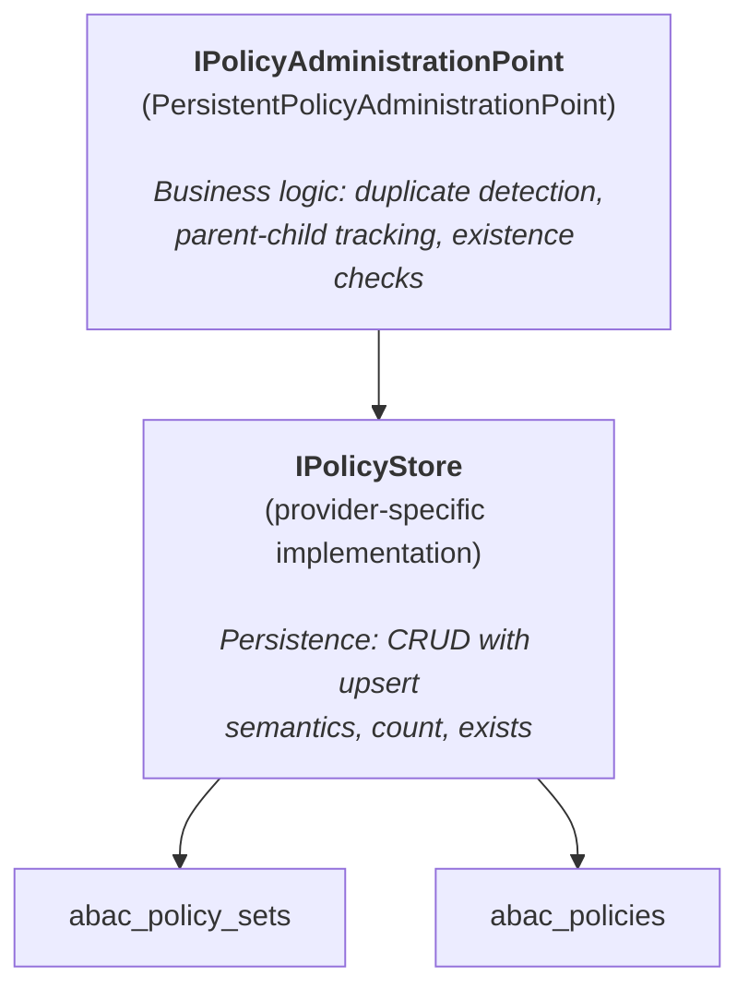

# Persistent PAP (Policy Administration Point)

## Overview

The Persistent PAP provides database-backed storage for XACML 3.0 policies, replacing the default in-memory implementation. Policies survive application restarts and can be shared across multiple application instances.

## Architecture



The persistent PAP follows a two-layer design:

1. **`PersistentPolicyAdministrationPoint`** implements `IPolicyAdministrationPoint` with business rules (duplicate detection, parent-child policy management, existence checks).
2. **`IPolicyStore`** is a pure persistence contract with upsert semantics, implemented by each database provider.

## Quick Start

### 1. Enable Persistent PAP

```csharp
services.AddEncinaABAC(options =>
{
    options.UsePersistentPAP = true;
});
```

### 2. Register a Database Provider

The persistent PAP requires an `IPolicyStore` implementation from a provider package:

```csharp
// Entity Framework Core
services.AddEncinaEntityFrameworkCore<AppDbContext>(config =>
{
    config.UseABACPolicyStore = true;
});

// Dapper
services.AddEncinaDapper(config =>
{
    config.UseABACPolicyStore = true;
});

// ADO.NET
services.AddEncinaADO(config =>
{
    config.UseABACPolicyStore = true;
});
```

### 3. (Optional) Enable Caching

```csharp
services.AddEncinaABAC(options =>
{
    options.UsePersistentPAP = true;

    options.PolicyCaching.Enabled = true;
    options.PolicyCaching.Duration = TimeSpan.FromMinutes(15);
    options.PolicyCaching.EnablePubSubInvalidation = true;
});
```

## Database Schema

### Tables

Two tables store ABAC policies:

#### `abac_policy_sets`

| Column | Type | Description |
|--------|------|-------------|
| `Id` | `string` (PK) | Policy set identifier |
| `Version` | `string?` | Optional version string |
| `Description` | `string?` | Human-readable description |
| `PolicyJson` | `string` (JSON) | Full serialized policy set graph |
| `IsEnabled` | `bool` | Enables SQL-level filtering |
| `Priority` | `int` | Enables SQL-level ordering |
| `CreatedAtUtc` | `DateTime` | First persisted timestamp |
| `UpdatedAtUtc` | `DateTime` | Last update timestamp |

#### `abac_policies`

| Column | Type | Description |
|--------|------|-------------|
| `Id` | `string` (PK) | Policy identifier |
| `Version` | `string?` | Optional version string |
| `Description` | `string?` | Human-readable description |
| `PolicyJson` | `string` (JSON) | Full serialized policy graph |
| `IsEnabled` | `bool` | Enables SQL-level filtering |
| `Priority` | `int` | Enables SQL-level ordering |
| `CreatedAtUtc` | `DateTime` | First persisted timestamp |
| `UpdatedAtUtc` | `DateTime` | Last update timestamp |

### Storage Strategy

The `PolicyJson` column stores the complete policy or policy set as serialized JSON, including all nested structures (rules, targets, conditions, obligations, advice, variable definitions, and expression trees). Metadata columns (`Id`, `Version`, `Description`, `IsEnabled`, `Priority`) are extracted for SQL-level filtering without deserializing.

**Standalone vs nested policies:**

- **Standalone policies** are stored in the `abac_policies` table.
- **Nested policies** (belonging to a policy set) are embedded in the parent policy set's `PolicyJson` and are NOT duplicated in the `abac_policies` table.

## Key Components

### IPolicyStore

The persistence contract. All methods return `ValueTask<Either<EncinaError, T>>` following Railway Oriented Programming.

**PolicySet operations:**

| Method | Description |
|--------|-------------|
| `GetAllPolicySetsAsync` | Retrieve all policy sets |
| `GetPolicySetAsync` | Retrieve a specific policy set by ID |
| `SavePolicySetAsync` | Upsert a policy set |
| `DeletePolicySetAsync` | Delete a policy set by ID |
| `ExistsPolicySetAsync` | Check existence by ID |
| `GetPolicySetCountAsync` | Count all policy sets |

**Standalone policy operations:**

| Method | Description |
|--------|-------------|
| `GetAllStandalonePoliciesAsync` | Retrieve all standalone policies |
| `GetPolicyAsync` | Retrieve a specific policy by ID |
| `SavePolicyAsync` | Upsert a standalone policy |
| `DeletePolicyAsync` | Delete a standalone policy by ID |
| `ExistsPolicyAsync` | Check existence by ID |
| `GetPolicyCountAsync` | Count all standalone policies |

### IPolicySerializer

Handles conversion between domain model objects and JSON strings for database storage.

```csharp
public interface IPolicySerializer
{
    string Serialize(PolicySet policySet);
    string Serialize(Policy policy);
    Either<EncinaError, PolicySet> DeserializePolicySet(string data);
    Either<EncinaError, Policy> DeserializePolicy(string data);
}
```

The default implementation (`DefaultPolicySerializer`) uses `System.Text.Json` with a polymorphic `$type` discriminator for `IExpression` trees. Register a custom serializer before `AddEncinaABAC()` to override:

```csharp
services.AddSingleton<IPolicySerializer, MyCustomSerializer>();
services.AddEncinaABAC(options => { options.UsePersistentPAP = true; });
```

### PolicyEntityMapper

Static mapper between domain models and database entities. Handles:

- Extracting metadata columns from the domain model for SQL-level filtering.
- Serializing/deserializing the full policy graph via `IPolicySerializer`.
- Preserving `CreatedAtUtc` on updates while refreshing `UpdatedAtUtc`.

### PersistentPolicyAdministrationPoint

The PAP implementation that wraps `IPolicyStore` with business rules:

- **Duplicate detection**: Checks both standalone policies and nested policies within all policy sets before adding.
- **Parent-child management**: `AddPolicyAsync` with a `parentPolicySetId` loads the parent, appends the policy, and saves the updated policy set.
- **Search-then-mutate**: `GetPolicyAsync`, `UpdatePolicyAsync`, and `RemovePolicyAsync` search standalone policies first, then scan all policy sets for nested matches.

## Policy Caching

### Configuration

```csharp
options.PolicyCaching.Enabled = true;
options.PolicyCaching.Duration = TimeSpan.FromMinutes(15);
options.PolicyCaching.EnablePubSubInvalidation = true;
options.PolicyCaching.InvalidationChannel = "abac:cache:invalidate";
options.PolicyCaching.CacheKeyPrefix = "abac";
options.PolicyCaching.CacheTag = "abac-policies";
```

### PolicyCachingOptions

| Property | Type | Default | Description |
|----------|------|---------|-------------|
| `Enabled` | `bool` | `false` | Enable the caching decorator |
| `Duration` | `TimeSpan` | 10 min | Cache TTL for all entries |
| `EnablePubSubInvalidation` | `bool` | `true` | Publish invalidation messages via PubSub |
| `InvalidationChannel` | `string` | `"abac:cache:invalidate"` | PubSub channel name |
| `CacheTag` | `string` | `"abac-policies"` | Tag for bulk invalidation |
| `CacheKeyPrefix` | `string` | `"abac"` | Prefix for all cache keys |

### CachingPolicyStoreDecorator

The caching layer wraps `IPolicyStore` as a decorator:

- **Read operations** use cache-aside with stampede protection via `ICacheProvider.GetOrSetAsync<T>`.
- **Write operations** use write-through invalidation: persist first, then evict cache keys and publish a PubSub message.
- **Count/exists operations** pass through to the inner store without caching (used by health checks, need fresh data).
- **Resilience**: Cache failures are logged at `Warning` level and fall back to the inner store.

### Cross-Instance Invalidation

When `EnablePubSubInvalidation` is `true`, a `PolicyCachePubSubHostedService` subscribes to the invalidation channel. On receiving a `PolicyCacheInvalidationMessage`, it evicts the affected cache keys from the local cache.

**Prerequisites:**

- `ICacheProvider` (from `Encina.Caching.*`)
- `IPubSubProvider` (from `Encina.Caching.*`, optional for PubSub)

## Supported Providers

| Provider | Package | Store Implementation |
|----------|---------|---------------------|
| EF Core (SqlServer) | `Encina.EntityFrameworkCore.SqlServer` | `PolicyStoreEF` |
| EF Core (PostgreSQL) | `Encina.EntityFrameworkCore.PostgreSQL` | `PolicyStoreEF` |
| EF Core (MySQL) | `Encina.EntityFrameworkCore.MySQL` | `PolicyStoreEF` |
| EF Core (SQLite) | `Encina.EntityFrameworkCore.Sqlite` | `PolicyStoreEF` |
| Dapper (SqlServer) | `Encina.Dapper.SqlServer` | `PolicyStoreDapper` |
| Dapper (PostgreSQL) | `Encina.Dapper.PostgreSQL` | `PolicyStoreDapper` |
| Dapper (MySQL) | `Encina.Dapper.MySQL` | `PolicyStoreDapper` |
| Dapper (SQLite) | `Encina.Dapper.Sqlite` | `PolicyStoreDapper` |
| ADO.NET (SqlServer) | `Encina.ADO.SqlServer` | `PolicyStoreADO` |
| ADO.NET (PostgreSQL) | `Encina.ADO.PostgreSQL` | `PolicyStoreADO` |
| ADO.NET (MySQL) | `Encina.ADO.MySQL` | `PolicyStoreADO` |
| ADO.NET (SQLite) | `Encina.ADO.Sqlite` | `PolicyStoreADO` |
| MongoDB | `Encina.MongoDB` | `PolicyStoreMongoDB` |

## Complete Configuration Example

```csharp
// 1. Register database provider with ABAC policy store
services.AddEncinaEntityFrameworkCore<AppDbContext>(config =>
{
    config.UseABACPolicyStore = true;
});

// 2. Register caching (optional)
services.AddEncinaCachingRedis(config =>
{
    config.ConnectionString = "localhost:6379";
});

// 3. Configure ABAC with persistent PAP
services.AddEncinaABAC(options =>
{
    options.EnforcementMode = ABACEnforcementMode.Block;
    options.DefaultNotApplicableEffect = Effect.Deny;
    options.AddHealthCheck = true;

    // Enable persistent storage
    options.UsePersistentPAP = true;

    // Enable caching with cross-instance invalidation
    options.PolicyCaching.Enabled = true;
    options.PolicyCaching.Duration = TimeSpan.FromMinutes(15);
    options.PolicyCaching.EnablePubSubInvalidation = true;

    // Seed initial policies
    options.SeedPolicySets.Add(organizationPolicies);
});
```

## Error Handling

All operations return `Either<EncinaError, T>`. Common errors:

| Error | Trigger |
|-------|---------|
| `ABACErrors.DuplicatePolicySet` | Adding a policy set with an existing ID |
| `ABACErrors.PolicySetNotFound` | Updating/removing a non-existent policy set |
| `ABACErrors.DuplicatePolicy` | Adding a policy with an existing ID (standalone or nested) |
| `ABACErrors.PolicyNotFound` | Updating/removing a non-existent policy |
| Store infrastructure errors | Database connection failures, serialization errors |

## Health Check

When `ABACOptions.AddHealthCheck = true`, the `ABACHealthCheck` verifies:

- The PAP is reachable (calls `GetPolicySetsAsync` and `GetPoliciesAsync`).
- At least one policy or policy set is loaded.
- Returns `Degraded` if the PAP is empty, `Healthy` if policies exist.

## See Also

- [ABAC Architecture](../xacml/architecture.md) -- Full XACML 3.0 architecture reference
- [Configuration Reference](configuration.md) -- Complete `ABACOptions` reference
- [Error Reference](errors.md) -- All ABAC error codes
