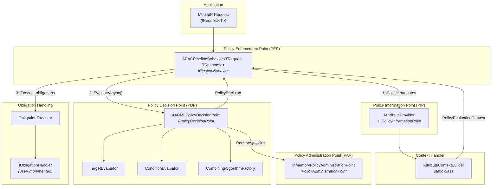
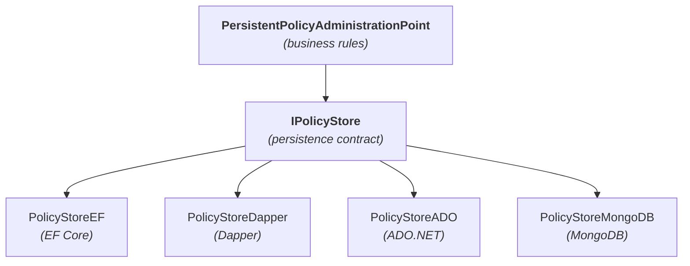
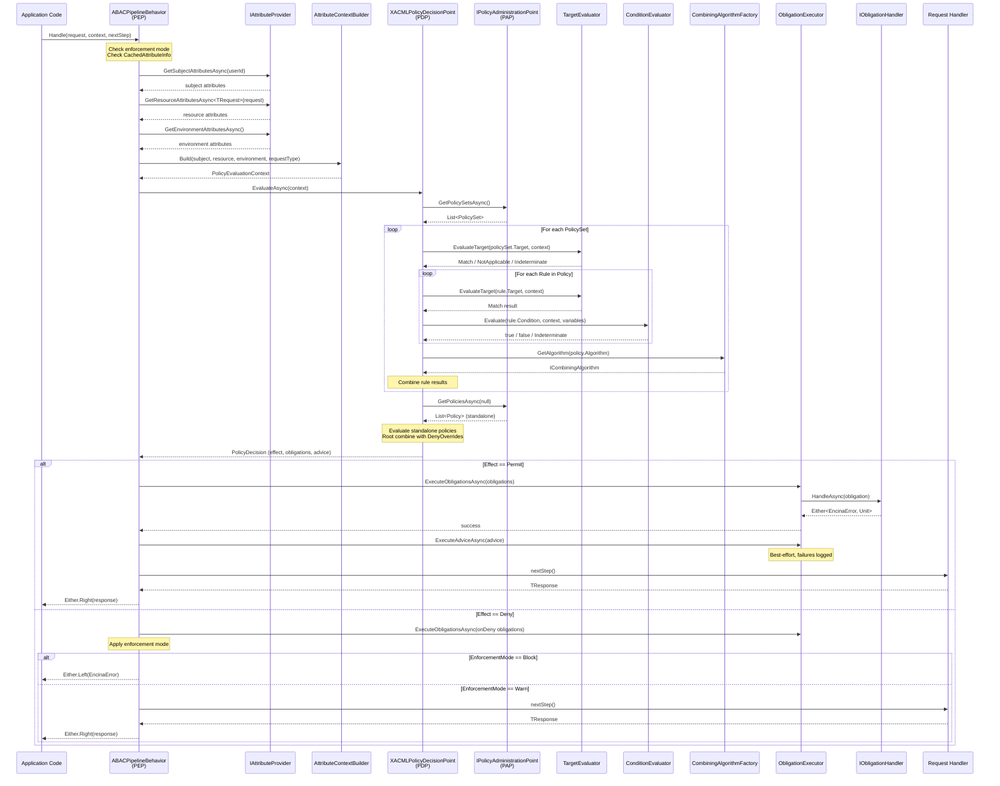
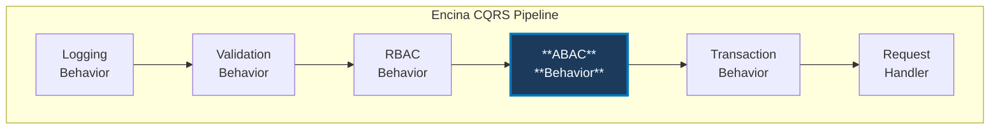

# ABAC Architecture

Encina.Security.ABAC implements the OASIS XACML 3.0 standard for Attribute-Based Access Control, integrated natively into the Encina CQRS/MediatR pipeline. This document describes the architectural components, their responsibilities, and how they collaborate to authorize requests.

---

## Table of Contents

1. [Overview](#1-overview)
2. [XACML Architecture Components](#2-xacml-architecture-components)
3. [Policy Enforcement Point (PEP)](#3-policy-enforcement-point-pep)
4. [Policy Decision Point (PDP)](#4-policy-decision-point-pdp)
5. [Policy Administration Point (PAP)](#5-policy-administration-point-pap)
6. [Policy Information Point (PIP)](#6-policy-information-point-pip)
7. [Context Handler](#7-context-handler)
8. [Request Flow](#8-request-flow)
9. [Integration with Encina Pipeline](#9-integration-with-encina-pipeline)
10. [Extensibility Points](#10-extensibility-points)

---

## 1. Overview

### ABAC vs RBAC

Role-Based Access Control (RBAC) grants access based on a user's assigned roles. It works well for coarse-grained authorization ("administrators can manage users") but struggles with fine-grained, context-dependent decisions.

Attribute-Based Access Control (ABAC) evaluates policies against attributes of the **subject** (who), **resource** (what), **action** (how), and **environment** (when/where). This enables decisions like "engineers in the security department can read classified documents during business hours from the corporate network."

| Criterion | RBAC | ABAC |
|-----------|------|------|
| Granularity | Coarse (role-level) | Fine (attribute-level) |
| Context awareness | No | Yes (time, location, risk) |
| Policy explosion | Grows with role combinations | Scales with attribute rules |
| Dynamic decisions | No | Yes |
| Compliance (GDPR, HIPAA) | Limited | Strong |

### When to Use ABAC

- Access depends on attributes beyond role membership (department, clearance level, data classification)
- Time-based or location-based restrictions are required
- Regulatory compliance demands fine-grained, auditable access decisions
- The number of role combinations would cause role explosion
- Policies need to change at runtime without code deployment

Encina supports RBAC and ABAC simultaneously in the same pipeline. RBAC runs first for fast coarse-grained checks; ABAC runs after for fine-grained attribute evaluation.

---

## 2. XACML Architecture Components

The XACML 3.0 standard defines four primary architectural components. Encina maps each to a concrete class or interface.



| XACML Component | Encina Type | Responsibility |
|-----------------|-------------|----------------|
| PEP | `ABACPipelineBehavior<TRequest, TResponse>` | Intercepts requests, coordinates evaluation, enforces decisions |
| PDP | `XACMLPolicyDecisionPoint` | Evaluates policies, applies combining algorithms, returns decisions |
| PAP | `InMemoryPolicyAdministrationPoint` / `PersistentPolicyAdministrationPoint` | Stores and manages policy sets and policies |
| PIP | `IAttributeProvider` + `IPolicyInformationPoint` | Resolves subject, resource, and environment attributes |
| Context Handler | `AttributeContextBuilder` | Transforms raw attributes into `PolicyEvaluationContext` |

---

## 3. Policy Enforcement Point (PEP)

The PEP is the entry point for authorization. In Encina, it is implemented as `ABACPipelineBehavior<TRequest, TResponse>`, a MediatR pipeline behavior that intercepts every request decorated with `[RequirePolicy]` or `[RequireCondition]` attributes.

### Class Signature

```csharp
public sealed class ABACPipelineBehavior<TRequest, TResponse>
    : IPipelineBehavior<TRequest, TResponse>
    where TRequest : IRequest<TResponse>
```

### Dependencies

The PEP depends on five collaborators, all injected via the constructor:

| Dependency | Purpose |
|------------|---------|
| `IPolicyDecisionPoint` | Evaluates the authorization decision |
| `IAttributeProvider` | Collects subject, resource, and environment attributes |
| `ISecurityContextAccessor` | Provides the current user identity |
| `ObligationExecutor` | Executes mandatory obligations and best-effort advice |
| `IOptions<ABACOptions>` | Configuration (enforcement mode, default effects) |

### Evaluation Steps

The `Handle` method follows XACML 3.0 section 7.18:

1. **Check enforcement mode** -- if `Disabled`, skip entirely and call `nextStep()`.
2. **Check for ABAC attributes** -- if the request type has no `[RequirePolicy]` or `[RequireCondition]`, skip.
3. **Collect attributes** -- call `IAttributeProvider` to resolve subject, resource, and environment attributes.
4. **Build evaluation context** -- use `AttributeContextBuilder.Build()` to create a `PolicyEvaluationContext`.
5. **Evaluate via PDP** -- call `IPolicyDecisionPoint.EvaluateAsync()` to get a `PolicyDecision`.
6. **Process the decision** -- handle the four possible effects:
   - **Permit**: execute obligations (mandatory), execute advice (best-effort), call `nextStep()`.
   - **Deny**: execute OnDeny obligations, apply enforcement mode (Block or Warn).
   - **NotApplicable**: apply `DefaultNotApplicableEffect` (Deny or Permit).
   - **Indeterminate**: apply enforcement mode.

### Static Attribute Caching

The PEP uses static per-generic-type caching for zero-cost attribute discovery after the first invocation:

```csharp
private static readonly ABACAttributeInfo? CachedAttributeInfo = ABACAttributeInfo.Resolve<TRequest>();
```

This means reflection occurs once per request type, not per request instance.

### Enforcement Modes

The `ABACEnforcementMode` enum controls how Deny decisions are handled:

| Mode | Behavior | Use Case |
|------|----------|----------|
| `Block` | Deny decisions reject the request with an `EncinaError` | Production |
| `Warn` | Deny decisions are logged but the request proceeds | Policy validation, gradual rollout |
| `Disabled` | ABAC evaluation is completely skipped | Development, feature-flagging |

---

## 4. Policy Decision Point (PDP)

The PDP is the core evaluation engine. It receives a `PolicyEvaluationContext`, evaluates all applicable policies, applies combining algorithms, and returns a `PolicyDecision`.

### Class Signature

```csharp
public sealed class XACMLPolicyDecisionPoint : IPolicyDecisionPoint
```

### Interface

```csharp
public interface IPolicyDecisionPoint
{
    ValueTask<PolicyDecision> EvaluateAsync(
        PolicyEvaluationContext context,
        CancellationToken cancellationToken = default);
}
```

### Evaluation Algorithm (XACML 3.0 sections 7.12-7.14)

1. Retrieve all **policy sets** from the PAP.
2. For each policy set, recursively evaluate:
   - **Target matching** via `TargetEvaluator` -- does this policy set apply to the request?
   - **Child evaluation** -- evaluate nested policies and policy sets.
   - **Combining** -- aggregate child results using the policy set's combining algorithm.
3. Retrieve all **standalone policies** (not in any policy set).
4. For each standalone policy, evaluate:
   - **Target matching** -- does this policy apply?
   - **Rule evaluation** -- evaluate each rule's target, then its condition via `ConditionEvaluator`.
   - **Combining** -- aggregate rule effects using the policy's combining algorithm.
5. **Root combining** -- merge all top-level results using `DenyOverrides`.
6. **Build final decision** -- filter obligations and advice based on the final effect.

### Four Possible Effects

The PDP returns exactly one of four effects, per XACML 3.0 section 7.1:

| Effect | Meaning |
|--------|---------|
| `Permit` | Access is explicitly granted |
| `Deny` | Access is explicitly refused |
| `NotApplicable` | No policy matched the request (the PDP has no opinion) |
| `Indeterminate` | An error prevented a definitive decision |

### Error Handling

The PDP never throws exceptions. Evaluation failures produce `Effect.Indeterminate` with a `DecisionStatus` describing the problem. This ensures the PEP always receives a usable decision.

---

## 5. Policy Administration Point (PAP)

The PAP manages the lifecycle of policies and policy sets. All operations return `Either<EncinaError, T>` following Railway Oriented Programming.

### Interface

```csharp
public interface IPolicyAdministrationPoint
{
    // PolicySet CRUD
    ValueTask<Either<EncinaError, IReadOnlyList<PolicySet>>> GetPolicySetsAsync(CancellationToken ct = default);
    ValueTask<Either<EncinaError, Option<PolicySet>>> GetPolicySetAsync(string policySetId, CancellationToken ct = default);
    ValueTask<Either<EncinaError, Unit>> AddPolicySetAsync(PolicySet policySet, CancellationToken ct = default);
    ValueTask<Either<EncinaError, Unit>> UpdatePolicySetAsync(PolicySet policySet, CancellationToken ct = default);
    ValueTask<Either<EncinaError, Unit>> RemovePolicySetAsync(string policySetId, CancellationToken ct = default);

    // Policy CRUD
    ValueTask<Either<EncinaError, IReadOnlyList<Policy>>> GetPoliciesAsync(string? policySetId, CancellationToken ct = default);
    ValueTask<Either<EncinaError, Option<Policy>>> GetPolicyAsync(string policyId, CancellationToken ct = default);
    ValueTask<Either<EncinaError, Unit>> AddPolicyAsync(Policy policy, string? parentPolicySetId, CancellationToken ct = default);
    ValueTask<Either<EncinaError, Unit>> UpdatePolicyAsync(Policy policy, CancellationToken ct = default);
    ValueTask<Either<EncinaError, Unit>> RemovePolicyAsync(string policyId, CancellationToken ct = default);
}
```

### Built-in Implementation: InMemoryPolicyAdministrationPoint

The default PAP stores policies in `ConcurrentDictionary` instances, ensuring thread-safe concurrent access. It tracks two categories of policies:

- **Nested policies** -- contained within a policy set, tracked via a parent mapping.
- **Standalone policies** -- not belonging to any policy set, stored separately.

```csharp
public sealed class InMemoryPolicyAdministrationPoint : IPolicyAdministrationPoint
{
    private readonly ConcurrentDictionary<string, PolicySet> _policySets = new();
    private readonly ConcurrentDictionary<string, Policy> _standalonePolicies = new();
    private readonly ConcurrentDictionary<string, string> _policyToParent = new();
    // ...
}
```

> **Note**: `InMemoryPolicyAdministrationPoint` is not suitable for production -- policies are lost on process restart. Use `PersistentPolicyAdministrationPoint` for production deployments.

### Production Implementation: PersistentPolicyAdministrationPoint

The `PersistentPolicyAdministrationPoint` delegates storage to an `IPolicyStore` provider, enabling database-backed policy persistence. It replicates the same business logic as the in-memory implementation while persisting policies across application restarts.

**Architecture (two-layer design):**



**Key behaviors:**

- **Duplicate detection**: Checks standalone policies and all nested policies within policy sets before adding.
- **Parent-child management**: Policies can be nested within a policy set or stored standalone. The PAP loads the parent, mutates, and saves back.
- **Upsert semantics**: The underlying store uses upsert (insert or update). The PAP layer enforces business constraints on top.

**Configuration:**

```csharp
services.AddEncinaEntityFrameworkCore<AppDbContext>(c => c.UseABACPolicyStore = true);

services.AddEncinaABAC(options =>
{
    options.UsePersistentPAP = true;

    // Optional: enable policy caching
    options.PolicyCaching.Enabled = true;
    options.PolicyCaching.Duration = TimeSpan.FromMinutes(15);
    options.PolicyCaching.EnablePubSubInvalidation = true;
});
```

**Caching decorator**: When `PolicyCaching.Enabled = true`, a `CachingPolicyStoreDecorator` wraps the inner store with cache-aside reads (stampede protection) and write-through invalidation. Cross-instance cache eviction is handled via PubSub when `EnablePubSubInvalidation = true`.

> See [Persistent PAP Reference](../reference/persistent-pap.md) for the complete configuration guide.

### Policy Seeding

Policies can be seeded at application startup via `ABACOptions`:

```csharp
services.AddEncinaABAC(options =>
{
    options.SeedPolicySets.Add(myPolicySet);
    options.SeedPolicies.Add(myStandalonePolicy);
});
```

When seed policies are configured, an `ABACPolicySeedingHostedService` is registered that loads them into the PAP during application startup.

---

## 6. Policy Information Point (PIP)

The PIP resolves attribute values needed during policy evaluation. Encina provides two complementary interfaces.

### IAttributeProvider -- Pre-Evaluation Attribute Collection

`IAttributeProvider` is called by the PEP before sending the request to the PDP. It collects all known attributes upfront.

```csharp
public interface IAttributeProvider
{
    ValueTask<IReadOnlyDictionary<string, object>> GetSubjectAttributesAsync(
        string userId, CancellationToken ct = default);

    ValueTask<IReadOnlyDictionary<string, object>> GetResourceAttributesAsync<TResource>(
        TResource resource, CancellationToken ct = default);

    ValueTask<IReadOnlyDictionary<string, object>> GetEnvironmentAttributesAsync(
        CancellationToken ct = default);
}
```

The default implementation (`DefaultAttributeProvider`) returns empty dictionaries. Applications **must** provide a custom implementation to supply meaningful attributes:

```csharp
public sealed class AppAttributeProvider : IAttributeProvider
{
    private readonly IUserService _userService;
    private readonly TimeProvider _timeProvider;

    public async ValueTask<IReadOnlyDictionary<string, object>> GetSubjectAttributesAsync(
        string userId, CancellationToken ct)
    {
        var user = await _userService.GetAsync(userId, ct);
        return new Dictionary<string, object>
        {
            ["department"] = user.Department,
            ["clearanceLevel"] = user.ClearanceLevel,
            ["roles"] = user.Roles
        };
    }

    public ValueTask<IReadOnlyDictionary<string, object>> GetResourceAttributesAsync<TResource>(
        TResource resource, CancellationToken ct)
    {
        var attrs = new Dictionary<string, object>();
        if (resource is IClassifiable classifiable)
        {
            attrs["classification"] = classifiable.Classification;
        }
        return ValueTask.FromResult<IReadOnlyDictionary<string, object>>(attrs);
    }

    public ValueTask<IReadOnlyDictionary<string, object>> GetEnvironmentAttributesAsync(
        CancellationToken ct)
    {
        var now = _timeProvider.GetUtcNow();
        return ValueTask.FromResult<IReadOnlyDictionary<string, object>>(
            new Dictionary<string, object>
            {
                ["currentTime"] = now.DateTime,
                ["isBusinessHours"] = now.Hour is >= 9 and < 18
            });
    }
}
```

### IPolicyInformationPoint -- On-Demand Attribute Resolution

`IPolicyInformationPoint` is used by the PDP during evaluation when an `AttributeDesignator` references an attribute not present in the context. Per XACML 3.0 section 7.3, if the attribute has `MustBePresent = true` and the PIP returns an empty bag, the result is `Indeterminate`.

```csharp
public interface IPolicyInformationPoint
{
    ValueTask<AttributeBag> ResolveAttributeAsync(
        AttributeDesignator designator,
        CancellationToken ct = default);
}
```

---

## 7. Context Handler

The `AttributeContextBuilder` is a static class that transforms raw attribute dictionaries (from `IAttributeProvider`) into a `PolicyEvaluationContext` -- the XACML-compatible structure expected by the PDP.

### Responsibilities

1. Convert `IReadOnlyDictionary<string, object>` to `AttributeBag` instances with inferred XACML data types.
2. Create an **action** attribute bag from the request type name.
3. Set the `IncludeAdvice` flag based on configuration.

```csharp
public static class AttributeContextBuilder
{
    public static PolicyEvaluationContext Build(
        IReadOnlyDictionary<string, object> subjectAttributes,
        IReadOnlyDictionary<string, object> resourceAttributes,
        IReadOnlyDictionary<string, object> environmentAttributes,
        Type requestType,
        bool includeAdvice = true);
}
```

### Data Type Inference

The builder infers XACML data types from .NET types:

| .NET Type | XACML Data Type |
|-----------|-----------------|
| `string` | `http://www.w3.org/2001/XMLSchema#string` |
| `int`, `long` | `http://www.w3.org/2001/XMLSchema#integer` |
| `bool` | `http://www.w3.org/2001/XMLSchema#boolean` |
| `double`, `float`, `decimal` | `http://www.w3.org/2001/XMLSchema#double` |
| `DateTime`, `DateTimeOffset` | `http://www.w3.org/2001/XMLSchema#dateTime` |
| `Uri` | `http://www.w3.org/2001/XMLSchema#anyURI` |

---

## 8. Request Flow

The following sequence diagram shows the complete authorization flow for a request decorated with `[RequirePolicy("finance-access")]`.



### Key Flow Details

- **Obligation failures cause denial**: per XACML 3.0 section 7.18, if any mandatory obligation handler fails or is missing, the PEP must deny access even if the PDP returned Permit.
- **Advice is best-effort**: advice handler failures are logged but do not affect the decision.
- **NotApplicable fallback**: when no policy matches, the `DefaultNotApplicableEffect` option determines whether the request is denied (closed-world assumption, the default) or permitted (open-world assumption).
- **Indeterminate handling**: evaluation errors produce `Indeterminate`, which is treated according to the enforcement mode.

---

## 9. Integration with Encina Pipeline

ABAC is one of several pipeline behaviors in the Encina CQRS pipeline. The ordering ensures coarse-grained checks run first, with ABAC providing fine-grained evaluation before the transactional boundary.



### Pipeline Order

| Order | Behavior | Purpose |
|-------|----------|---------|
| 1 | **Logging** | Structured logging of request start/end |
| 2 | **Validation** | Input validation (FluentValidation, DataAnnotations, MiniValidator) |
| 3 | **RBAC** | Role-based coarse-grained authorization |
| 4 | **ABAC** | Attribute-based fine-grained authorization |
| 5 | **Transaction** | Database transaction management (commit/rollback based on ROP result) |
| 6 | **Handler** | Business logic execution |

### Why This Order Matters

- **Validation before authorization**: invalid requests are rejected cheaply before any authorization logic runs.
- **RBAC before ABAC**: role checks are fast O(1) lookups. ABAC involves attribute resolution and policy evaluation -- potentially with database or external service calls. Running RBAC first avoids unnecessary ABAC computation for users who lack even the basic role.
- **ABAC before transactions**: the transactional boundary only opens for authorized requests, preventing wasted database connections.

### Decorating Requests

Requests opt into ABAC by applying attributes:

```csharp
// Named policy evaluation
[RequirePolicy("financial-data-access")]
public sealed record GetFinancialReportQuery(Guid ReportId) : IQuery<ReportDto>;

// Inline EEL condition
[RequireCondition("subject.clearanceLevel >= resource.classification")]
public sealed record GetClassifiedDocumentQuery(Guid DocumentId) : IQuery<DocumentDto>;

// Combining both: named policy AND inline condition
[RequirePolicy("data-access")]
[RequireCondition("environment.isBusinessHours == true")]
public sealed record ProcessPayrollCommand(Guid PayrollId) : ICommand;

// Multiple policies with OR logic
[RequirePolicy("admin-override", AllMustPass = false)]
[RequirePolicy("standard-access", AllMustPass = false)]
public sealed record GetResourceQuery(Guid ResourceId) : IQuery<ResourceDto>;
```

Requests without any ABAC attributes pass through the behavior with zero overhead (the `CachedAttributeInfo` is `null`).

---

## 10. Extensibility Points

Every XACML component is behind an interface, registered with `TryAdd` so custom implementations take precedence.

### Custom PAP Backend

Replace the in-memory PAP with a database-backed implementation for production:

```csharp
// Register before AddEncinaABAC -- TryAdd will not overwrite
services.AddSingleton<IPolicyAdministrationPoint, DatabasePolicyAdministrationPoint>();
services.AddEncinaABAC(options =>
{
    options.EnforcementMode = ABACEnforcementMode.Block;
});
```

A database-backed PAP might use EF Core, Dapper, or any other data access strategy to persist policies. The only requirement is implementing `IPolicyAdministrationPoint` with ROP return types (`Either<EncinaError, T>`).

### Custom Attribute Providers

Provide application-specific attribute resolution:

```csharp
// Register before AddEncinaABAC
services.AddScoped<IAttributeProvider, MyAttributeProvider>();
services.AddEncinaABAC();
```

Common attribute sources include:
- **Claims** from JWT tokens or cookies
- **Database lookups** for user profiles, resource metadata
- **External services** (LDAP, Active Directory, identity providers)
- **HTTP context** (IP address, request headers)

### Custom PIP for On-Demand Resolution

Provide late-binding attribute resolution during PDP evaluation:

```csharp
services.AddSingleton<IPolicyInformationPoint, LdapPolicyInformationPoint>();
services.AddEncinaABAC();
```

### Custom XACML Functions

Register domain-specific functions for use in policy conditions:

```csharp
services.AddEncinaABAC(options =>
{
    options.AddFunction("custom:geo-within", new GeoWithinFunction());
    options.AddFunction("custom:risk-score", new RiskScoreFunction());
});
```

Custom functions implement `IXACMLFunction`:

```csharp
public sealed class GeoWithinFunction : IXACMLFunction
{
    public string ReturnType => XACMLDataTypes.Boolean;

    public object? Evaluate(IReadOnlyList<object?> arguments)
    {
        if (arguments.Count != 3)
            throw new InvalidOperationException("geo-within requires 3 arguments: lat, lon, radius.");

        var lat = Convert.ToDouble(arguments[0]);
        var lon = Convert.ToDouble(arguments[1]);
        var radiusKm = Convert.ToDouble(arguments[2]);

        // Custom geofencing logic
        return IsWithinRadius(lat, lon, radiusKm);
    }
}
```

### Custom Obligation Handlers

Implement `IObligationHandler` to fulfill policy obligations:

```csharp
public sealed class AuditLogObligationHandler : IObligationHandler
{
    private readonly IAuditService _auditService;

    public bool CanHandle(string obligationId) => obligationId == "audit-log";

    public async ValueTask<Either<EncinaError, Unit>> HandleAsync(
        Obligation obligation,
        PolicyEvaluationContext context,
        CancellationToken ct)
    {
        await _auditService.LogAccessDecisionAsync(context, ct);
        return Unit.Default;
    }
}

// Register via DI
services.AddScoped<IObligationHandler, AuditLogObligationHandler>();
services.AddScoped<IObligationHandler, NotificationObligationHandler>();
```

### Custom Combining Algorithms

Implement `ICombiningAlgorithm` and register it with the factory:

```csharp
public sealed class WeightedPermitAlgorithm : ICombiningAlgorithm
{
    public CombiningAlgorithmId AlgorithmId => /* custom ID */;

    public Effect CombineRuleResults(IReadOnlyList<RuleEvaluationResult> results)
    {
        // Custom weighted logic
    }

    public PolicyEvaluationResult CombinePolicyResults(IReadOnlyList<PolicyEvaluationResult> results)
    {
        // Custom weighted logic
    }
}
```

### Full Registration Example

```csharp
// Custom implementations (register before AddEncinaABAC)
services.AddSingleton<IPolicyAdministrationPoint, EfCorePolicyAdministrationPoint>();
services.AddScoped<IAttributeProvider, ClaimsAttributeProvider>();
services.AddSingleton<IPolicyInformationPoint, LdapPolicyInformationPoint>();
services.AddScoped<IObligationHandler, AuditLogObligationHandler>();
services.AddScoped<IObligationHandler, MfaChallengeObligationHandler>();

// ABAC configuration
services.AddEncinaABAC(options =>
{
    options.EnforcementMode = ABACEnforcementMode.Block;
    options.DefaultNotApplicableEffect = Effect.Deny;
    options.IncludeAdvice = true;
    options.FailOnMissingObligationHandler = true;
    options.AddHealthCheck = true;

    // Custom functions
    options.AddFunction("custom:geo-within", new GeoWithinFunction());

    // Startup expression validation
    options.ValidateExpressionsAtStartup = true;
    options.ExpressionScanAssemblies.Add(typeof(GetFinancialReportQuery).Assembly);

    // Seed initial policies
    options.SeedPolicySets.Add(BuildAccessControlPolicySet());
});
```

### Service Lifetimes Summary

| Service | Lifetime | Rationale |
|---------|----------|-----------|
| `IFunctionRegistry` | Singleton | Immutable after startup |
| `CombiningAlgorithmFactory` | Singleton | Stateless |
| `TargetEvaluator` | Singleton | Stateless |
| `ConditionEvaluator` | Singleton | Stateless |
| `IPolicyAdministrationPoint` | Singleton | Shared policy store |
| `IPolicyDecisionPoint` | Singleton | Stateless evaluator |
| `IPolicyInformationPoint` | Singleton | Stateless resolver |
| `IAttributeProvider` | Scoped | Request-scoped attributes |
| `ObligationExecutor` | Scoped | Uses scoped handlers |
| `ABACPipelineBehavior<,>` | Transient | Lightweight, no state |

---

## See Also

- [Policy Language](policy-language.md) -- XACML policy model: PolicySet, Policy, Rule, Target, Condition
- [Effects](effects.md) -- Permit, Deny, NotApplicable, Indeterminate semantics
- [Combining Algorithms](combining-algorithms.md) -- DenyOverrides, PermitOverrides, FirstApplicable, and more
- [Attributes](attributes.md) -- Attribute categories, designators, bags, and data types
