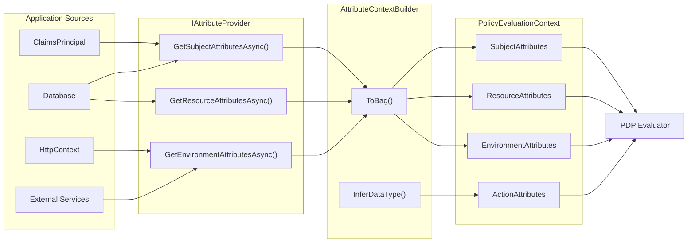

# XACML Attributes

## Overview

Attributes are the foundation of Attribute-Based Access Control (ABAC). Every authorization
decision in Encina's XACML 3.0 engine is driven by attributes -- named, typed values that
describe who is requesting access, what resource is being accessed, how it is being accessed,
and under what environmental conditions.

Unlike role-based access control (RBAC), where a fixed set of roles drives decisions, ABAC
evaluates policies against a rich, dynamic set of attributes collected at runtime. This makes
it possible to express fine-grained rules such as "allow access only during business hours for
users in the Finance department accessing confidential documents."

The attribute model in Encina follows the XACML 3.0 specification closely, organized around
four key types:

| Type | Purpose | XACML Reference |
|------|---------|-----------------|
| `AttributeCategory` | Classifies the source of an attribute | Appendix B |
| `AttributeDesignator` | Formal reference to a named, typed attribute | Section 7.3 |
| `AttributeValue` | A typed literal value | Section 7.3.1 |
| `AttributeBag` | Multi-valued container for attribute values | Section 7.3.2 |

## Attribute Categories

Every attribute belongs to one of four standard categories defined by XACML 3.0 Appendix B.
The `AttributeCategory` enum identifies which aspect of the access request an attribute describes:

```csharp
public enum AttributeCategory
{
    Subject,      // Who is requesting (user, service, principal)
    Resource,     // What is being accessed (document, API endpoint, record)
    Environment,  // Under what conditions (time, IP, tenant)
    Action        // How it is being accessed (read, write, delete)
}
```

Each category maps to a specific XACML URN and corresponds to a distinct section of the
`PolicyEvaluationContext`:

| Category | XACML URN | Typical Attributes |
|----------|-----------|--------------------|
| `Subject` | `urn:oasis:names:tc:xacml:1.0:subject-category:access-subject` | User ID, roles, department, clearance |
| `Resource` | `urn:oasis:names:tc:xacml:3.0:attribute-category:resource` | Resource type, classification, owner |
| `Action` | `urn:oasis:names:tc:xacml:3.0:attribute-category:action` | Action name, HTTP method, operation |
| `Environment` | `urn:oasis:names:tc:xacml:3.0:attribute-category:environment` | Current time, IP address, tenant ID |

The category determines which `IAttributeProvider` method is responsible for resolving the
attribute at evaluation time.

## AttributeDesignator

An `AttributeDesignator` is a formal reference to an attribute that should be resolved from
the request context during policy evaluation. It specifies the category, name, expected data
type, and whether the attribute is required.

```csharp
public sealed record AttributeDesignator : IExpression
{
    public required AttributeCategory Category { get; init; }
    public required string AttributeId { get; init; }
    public required string DataType { get; init; }
    public bool MustBePresent { get; init; }
}
```

Building designators for policy conditions:

```csharp
// Subject designator: user's department (required)
var departmentDesignator = new AttributeDesignator
{
    Category = AttributeCategory.Subject,
    AttributeId = "department",
    DataType = XACMLDataTypes.String,
    MustBePresent = true
};

// Resource designator: classification level (optional)
var classificationDesignator = new AttributeDesignator
{
    Category = AttributeCategory.Resource,
    AttributeId = "classification",
    DataType = XACMLDataTypes.String,
    MustBePresent = false
};

// Environment designator: current time (required for time-based rules)
var timeDesignator = new AttributeDesignator
{
    Category = AttributeCategory.Environment,
    AttributeId = EnvironmentAttributes.CurrentTime,
    DataType = XACMLDataTypes.DateTime,
    MustBePresent = true
};
```

When the PDP evaluates a condition containing a designator, it looks up the corresponding
attribute in the `PolicyEvaluationContext`. The `MustBePresent` flag controls what happens
when the attribute cannot be found (see [MustBePresent Semantics](#mustbepresent-semantics)).

## AttributeValue

An `AttributeValue` is a typed literal value used in `Match` elements and `Apply` function
arguments. It carries both the value and its XACML data type:

```csharp
public sealed record AttributeValue : IExpression
{
    public required string DataType { get; init; }
    public object? Value { get; init; }
}
```

The `DataType` property uses the standard XACML data type identifiers defined in
`XACMLDataTypes`:

| Constant | URI | CLR Type |
|----------|-----|----------|
| `XACMLDataTypes.String` | `http://www.w3.org/2001/XMLSchema#string` | `string` |
| `XACMLDataTypes.Boolean` | `http://www.w3.org/2001/XMLSchema#boolean` | `bool` |
| `XACMLDataTypes.Integer` | `http://www.w3.org/2001/XMLSchema#integer` | `int`, `long` |
| `XACMLDataTypes.Double` | `http://www.w3.org/2001/XMLSchema#double` | `double`, `float` |
| `XACMLDataTypes.DateTime` | `http://www.w3.org/2001/XMLSchema#dateTime` | `DateTime` |
| `XACMLDataTypes.Date` | `http://www.w3.org/2001/XMLSchema#date` | `DateTime` |
| `XACMLDataTypes.Time` | `http://www.w3.org/2001/XMLSchema#time` | `DateTime` |
| `XACMLDataTypes.AnyURI` | `http://www.w3.org/2001/XMLSchema#anyURI` | `Uri` |

Creating typed values:

```csharp
var stringValue = new AttributeValue { DataType = XACMLDataTypes.String, Value = "Finance" };
var intValue = new AttributeValue { DataType = XACMLDataTypes.Integer, Value = 5 };
var boolValue = new AttributeValue { DataType = XACMLDataTypes.Boolean, Value = true };
var dateValue = new AttributeValue { DataType = XACMLDataTypes.DateTime, Value = DateTime.UtcNow };
```

A `null` `Value` represents an absent or undefined value, distinct from an empty string or zero.

## AttributeBag

In XACML 3.0, every attribute is inherently multi-valued. A subject may hold multiple roles;
a resource may belong to multiple categories. The `AttributeBag` is the multi-valued container
that models this:

```csharp
public sealed class AttributeBag
{
    public static AttributeBag Empty { get; }
    public IReadOnlyList<AttributeValue> Values { get; }
    public int Count { get; }
    public bool IsEmpty { get; }

    public static AttributeBag Of(params AttributeValue[] values);
    public static AttributeBag FromValues(IReadOnlyList<AttributeValue> values);
    public AttributeValue SingleValue();
}
```

### Single Value vs. Bag

```csharp
// Single-valued: user's department
var departmentBag = AttributeBag.Of(
    new AttributeValue { DataType = XACMLDataTypes.String, Value = "Finance" });

// Multi-valued: user's roles
var rolesBag = AttributeBag.Of(
    new AttributeValue { DataType = XACMLDataTypes.String, Value = "Admin" },
    new AttributeValue { DataType = XACMLDataTypes.String, Value = "Auditor" },
    new AttributeValue { DataType = XACMLDataTypes.String, Value = "Manager" });

// Empty bag: attribute not found or not applicable
var emptyBag = AttributeBag.Empty;
```

The `SingleValue()` method implements the XACML `*-one-and-only` bag function semantics.
It returns the single value in the bag or throws `InvalidOperationException` if the bag does
not contain exactly one value.

Bag functions (`*-bag-size`, `*-is-in`, `*-intersection`, `*-union`, `*-subset`) operate on
`AttributeBag` instances and are available through the `IFunctionRegistry`.

## Attribute Resolution

The following diagram illustrates how attributes flow from application-specific sources through
the `IAttributeProvider` into the `PolicyEvaluationContext` and ultimately into the PDP for
policy evaluation:



The resolution pipeline works as follows:

1. The `ABACPipelineBehavior` invokes the registered `IAttributeProvider`.
2. Each `Get*AttributesAsync()` method returns `IReadOnlyDictionary<string, object>`.
3. The `AttributeContextBuilder.Build()` method converts dictionaries into `AttributeBag` instances.
4. Data types are automatically inferred from CLR types (string, int, bool, DateTime, etc.).
5. The assembled `PolicyEvaluationContext` is passed to the `IPolicyDecisionPoint.EvaluateAsync()`.

## PolicyEvaluationContext

The `PolicyEvaluationContext` carries all resolved attributes organized by category. This is
the primary input to the PDP:

```csharp
public sealed record PolicyEvaluationContext
{
    public required AttributeBag SubjectAttributes { get; init; }
    public required AttributeBag ResourceAttributes { get; init; }
    public required AttributeBag EnvironmentAttributes { get; init; }
    public required AttributeBag ActionAttributes { get; init; }
    public required Type RequestType { get; init; }
    public bool IncludeAdvice { get; init; } = true;
}
```

Building a context manually (useful in tests):

```csharp
var context = new PolicyEvaluationContext
{
    SubjectAttributes = AttributeBag.Of(
        new AttributeValue { DataType = XACMLDataTypes.String, Value = "Finance" },
        new AttributeValue { DataType = XACMLDataTypes.String, Value = "Manager" }),
    ResourceAttributes = AttributeBag.Of(
        new AttributeValue { DataType = XACMLDataTypes.String, Value = "confidential" }),
    EnvironmentAttributes = AttributeBag.Of(
        new AttributeValue { DataType = XACMLDataTypes.DateTime, Value = DateTime.UtcNow }),
    ActionAttributes = AttributeBag.Of(
        new AttributeValue { DataType = XACMLDataTypes.String, Value = "read" }),
    RequestType = typeof(GetFinancialReportQuery)
};
```

In production, use `AttributeContextBuilder.Build()` to construct the context from
`IAttributeProvider` dictionaries with automatic type inference:

```csharp
var context = AttributeContextBuilder.Build(
    subjectAttributes: subjectAttrs,
    resourceAttributes: resourceAttrs,
    environmentAttributes: environmentAttrs,
    requestType: typeof(GetFinancialReportQuery),
    includeAdvice: true);
```

## Environment Attributes

The `EnvironmentAttributes` static class defines well-known attribute identifiers for
environmental conditions. Using these constants ensures consistency between providers and
policies:

```csharp
public static class EnvironmentAttributes
{
    public const string CurrentTime = "currentTime";
    public const string DayOfWeek = "dayOfWeek";
    public const string IsBusinessHours = "isBusinessHours";
    public const string IpAddress = "ipAddress";
    public const string UserAgent = "userAgent";
    public const string TenantId = "tenantId";
    public const string Region = "region";
    public const string RequestPath = "requestPath";
    public const string HttpMethod = "httpMethod";
}
```

Reference these constants in both your `IAttributeProvider` implementation and your policy
conditions to avoid string mismatches.

## Implementing IAttributeProvider

The `IAttributeProvider` interface bridges the gap between your application's domain model
and the XACML attribute model. Implementations extract attributes from application-specific
sources and return them as key-value dictionaries.

```csharp
public interface IAttributeProvider
{
    ValueTask<IReadOnlyDictionary<string, object>> GetSubjectAttributesAsync(
        string userId, CancellationToken cancellationToken = default);

    ValueTask<IReadOnlyDictionary<string, object>> GetResourceAttributesAsync<TResource>(
        TResource resource, CancellationToken cancellationToken = default);

    ValueTask<IReadOnlyDictionary<string, object>> GetEnvironmentAttributesAsync(
        CancellationToken cancellationToken = default);
}
```

### Example: Resolving Attributes from ClaimsPrincipal

```csharp
public sealed class ClaimsAttributeProvider(
    IHttpContextAccessor httpContextAccessor,
    TimeProvider timeProvider) : IAttributeProvider
{
    public ValueTask<IReadOnlyDictionary<string, object>> GetSubjectAttributesAsync(
        string userId, CancellationToken cancellationToken = default)
    {
        var principal = httpContextAccessor.HttpContext?.User;
        var attrs = new Dictionary<string, object>
        {
            ["userId"] = userId,
            ["department"] = principal?.FindFirst("department")?.Value ?? "unknown",
            ["clearanceLevel"] = int.Parse(
                principal?.FindFirst("clearance")?.Value ?? "0",
                CultureInfo.InvariantCulture)
        };

        // Multi-valued attribute: extract all role claims
        var roles = principal?.FindAll(ClaimTypes.Role)
            .Select(c => c.Value)
            .ToList() ?? [];

        if (roles.Count > 0)
        {
            attrs["roles"] = roles;
        }

        return ValueTask.FromResult<IReadOnlyDictionary<string, object>>(attrs);
    }

    public ValueTask<IReadOnlyDictionary<string, object>> GetResourceAttributesAsync<TResource>(
        TResource resource, CancellationToken cancellationToken = default)
    {
        var attrs = new Dictionary<string, object>();

        if (resource is IClassifiedResource classified)
        {
            attrs["classification"] = classified.Classification;
            attrs["owner"] = classified.OwnerId;
        }

        return ValueTask.FromResult<IReadOnlyDictionary<string, object>>(attrs);
    }

    public ValueTask<IReadOnlyDictionary<string, object>> GetEnvironmentAttributesAsync(
        CancellationToken cancellationToken = default)
    {
        var now = timeProvider.GetUtcNow();
        var httpContext = httpContextAccessor.HttpContext;

        var attrs = new Dictionary<string, object>
        {
            [EnvironmentAttributes.CurrentTime] = now.UtcDateTime,
            [EnvironmentAttributes.DayOfWeek] = now.DayOfWeek.ToString(),
            [EnvironmentAttributes.IsBusinessHours] = now.Hour >= 9 && now.Hour < 17,
            [EnvironmentAttributes.IpAddress] =
                httpContext?.Connection.RemoteIpAddress?.ToString() ?? "unknown",
            [EnvironmentAttributes.HttpMethod] = httpContext?.Request.Method ?? "unknown",
            [EnvironmentAttributes.RequestPath] = httpContext?.Request.Path.Value ?? "/"
        };

        return ValueTask.FromResult<IReadOnlyDictionary<string, object>>(attrs);
    }
}
```

Register the custom provider in DI:

```csharp
services.AddSingleton<IAttributeProvider, ClaimsAttributeProvider>();
```

The `DefaultAttributeProvider` shipped with Encina returns empty dictionaries for all
categories. It serves as a placeholder -- replace it with your implementation to supply
real attributes.

## MustBePresent Semantics

The `MustBePresent` property on `AttributeDesignator` controls behavior when an attribute
cannot be resolved from the evaluation context. Per XACML 3.0 Section 5.4.2.7:

| `MustBePresent` | Attribute Found | Result |
|-----------------|-----------------|--------|
| `true` | Yes | The resolved `AttributeBag` |
| `true` | No | `Effect.Indeterminate` -- evaluation cannot continue |
| `false` | Yes | The resolved `AttributeBag` |
| `false` | No | `AttributeBag.Empty` -- evaluation continues |

This distinction is critical for security. Consider a policy that checks clearance level:

```csharp
// With MustBePresent = true: if clearance is missing, the result is Indeterminate
// (which combining algorithms typically treat as Deny)
var clearanceDesignator = new AttributeDesignator
{
    Category = AttributeCategory.Subject,
    AttributeId = "clearanceLevel",
    DataType = XACMLDataTypes.Integer,
    MustBePresent = true  // Missing clearance = Indeterminate (safe default)
};

// With MustBePresent = false: if the attribute is missing, an empty bag is returned
// and the condition using it may evaluate to false or be skipped
var optionalTag = new AttributeDesignator
{
    Category = AttributeCategory.Resource,
    AttributeId = "tags",
    DataType = XACMLDataTypes.String,
    MustBePresent = false  // Missing tags = empty bag (no match, but no error)
};
```

Best practice: set `MustBePresent = true` for security-critical attributes (clearance,
classification, department) to ensure that a missing attribute results in a safe
`Indeterminate` rather than silently producing an empty bag that might bypass a check.

## See Also

- [Architecture](architecture.md) -- ABAC component architecture and data flow
- [Data Types](../reference/data-types.md) -- Complete XACML data type reference
- [Functions](functions.md) -- XACML standard functions including bag and set operations
