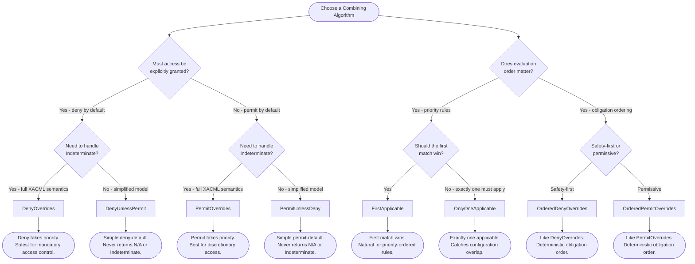

# XACML Combining Algorithms

## Overview

Combining algorithms determine how individual rule or policy evaluation results are
aggregated into a single authorization decision. When a policy contains multiple rules,
or a policy set contains multiple policies, their individual effects (Permit, Deny,
NotApplicable, Indeterminate) may conflict. The combining algorithm resolves these
conflicts according to well-defined semantics.

XACML 3.0 Appendix C defines eight standard combining algorithms. Encina implements all
eight via the `CombiningAlgorithmId` enum:

```csharp
public enum CombiningAlgorithmId
{
    DenyOverrides,          // Any Deny wins (safety-first)
    PermitOverrides,        // Any Permit wins (permissive)
    FirstApplicable,        // First matching result wins (order-dependent)
    OnlyOneApplicable,      // Exactly one policy must apply
    DenyUnlessPermit,       // Default Deny unless explicit Permit
    PermitUnlessDeny,       // Default Permit unless explicit Deny
    OrderedDenyOverrides,   // Deny-Overrides with guaranteed evaluation order
    OrderedPermitOverrides  // Permit-Overrides with guaranteed evaluation order
}
```

Algorithms apply at two distinct levels:

- **Rule-combining**: Within a `Policy`, combining the effects of its `Rule` elements.
- **Policy-combining**: Within a `PolicySet`, combining the decisions of its `Policy` and
  nested `PolicySet` elements.

Both levels use the same `CombiningAlgorithmId` values and the same `ICombiningAlgorithm`
interface, but operate on different input types (`RuleEvaluationResult` vs `PolicyEvaluationResult`).

## Algorithm Selection Guide

Choosing the right algorithm depends on the security posture and the nature of the
authorization model. The following decision flowchart helps identify the best fit:



### Quick Reference Matrix

| Algorithm | Default Bias | Handles Indeterminate? | Order Sensitive? | Best For |
|-----------|-------------|----------------------|-----------------|----------|
| DenyOverrides | Deny wins | Yes | No | Mandatory access control, compliance |
| PermitOverrides | Permit wins | Yes | No | Discretionary access, exception-based |
| FirstApplicable | First match | Passes through | Yes | Priority-ordered rule lists |
| OnlyOneApplicable | N/A | Flags ambiguity | No | Detecting configuration overlap |
| DenyUnlessPermit | Deny | Absorbs (becomes Deny) | No | Simple secure-by-default |
| PermitUnlessDeny | Permit | Absorbs (becomes Permit) | No | Simple open-by-default |
| OrderedDenyOverrides | Deny wins | Yes | Yes (obligations) | Deny-Overrides with predictable obligations |
| OrderedPermitOverrides | Permit wins | Yes | Yes (obligations) | Permit-Overrides with predictable obligations |

## Deny Overrides

**XACML 3.0 Section C.1** -- The safety-first algorithm. If any component returns Deny, the
combined result is Deny regardless of all other results. This is the default algorithm for
both `PolicyBuilder` and `PolicySetBuilder`.

### Semantics

1. Any Deny --> **Deny**
2. No Deny, but Indeterminate from a deny-intended rule/policy --> **Indeterminate**
3. No Deny, no Indeterminate{D}, but Permit + Indeterminate{P} --> **Indeterminate**
4. No Deny, no Indeterminate{D}, Permit only --> **Permit**
5. No Deny, no Permit, Indeterminate{P} only --> **Indeterminate**
6. Everything NotApplicable --> **NotApplicable**

### Truth Table

| Rule/Policy 1 | Rule/Policy 2 | Combined Result | Rationale |
|---------------|---------------|-----------------|-----------|
| Permit | Permit | Permit | No conflict |
| Permit | Deny | **Deny** | Deny overrides Permit |
| Permit | NotApplicable | Permit | N/A has no effect |
| Permit | Indeterminate | **Indeterminate** | Could be Deny, must be cautious |
| Deny | Deny | Deny | Both agree |
| Deny | NotApplicable | Deny | N/A has no effect |
| Deny | Indeterminate | Deny | Deny already present |
| NotApplicable | NotApplicable | NotApplicable | Nothing applies |
| NotApplicable | Indeterminate | **Indeterminate** | Error cannot be ignored |
| Indeterminate | Indeterminate | Indeterminate | Multiple errors |

### Use Cases

- Financial systems where regulatory compliance requires denial to take precedence.
- Healthcare systems where access to patient data must be blocked if any policy denies.
- Any system operating under the principle of least privilege.

### Code Example

```csharp
var policy = new PolicyBuilder("compliance-policy")
    .WithAlgorithm(CombiningAlgorithmId.DenyOverrides) // Default, shown explicitly
    .AddRule("allow-internal", Effect.Permit, rule => rule
        .WithCondition(ConditionBuilder.Equal(
            ConditionBuilder.Attribute(AttributeCategory.Subject, "department", XACMLDataTypes.String),
            ConditionBuilder.StringValue("internal"))))
    .AddRule("deny-after-hours", Effect.Deny, rule => rule
        .WithCondition(ConditionBuilder.GreaterThan(
            ConditionBuilder.Attribute(AttributeCategory.Environment, "currentHour", XACMLDataTypes.Integer),
            ConditionBuilder.IntegerValue(18))))
    .Build();
```

## Permit Overrides

**XACML 3.0 Section C.2** -- The permissive algorithm. Mirror of Deny-Overrides with
Permit and Deny swapped. If any component returns Permit, the combined result is Permit
regardless of all other results.

### Semantics

1. Any Permit --> **Permit**
2. No Permit, but Indeterminate from a permit-intended rule/policy --> **Indeterminate**
3. No Permit, no Indeterminate{P}, but Deny + Indeterminate{D} --> **Indeterminate**
4. No Permit, no Indeterminate{P}, Deny only --> **Deny**
5. No Permit, no Deny, Indeterminate{D} only --> **Indeterminate**
6. Everything NotApplicable --> **NotApplicable**

### Truth Table

| Rule/Policy 1 | Rule/Policy 2 | Combined Result | Rationale |
|---------------|---------------|-----------------|-----------|
| Permit | Permit | Permit | Both agree |
| Permit | Deny | **Permit** | Permit overrides Deny |
| Permit | NotApplicable | Permit | N/A has no effect |
| Permit | Indeterminate | Permit | Permit already present |
| Deny | Deny | Deny | No conflict |
| Deny | NotApplicable | Deny | N/A has no effect |
| Deny | Indeterminate | **Indeterminate** | Could be Permit, must be cautious |
| NotApplicable | NotApplicable | NotApplicable | Nothing applies |
| NotApplicable | Indeterminate | **Indeterminate** | Error cannot be ignored |
| Indeterminate | Indeterminate | Indeterminate | Multiple errors |

### Use Cases

- Exception-based access: a single "override" policy can grant access even when others deny.
- Admin escalation: an administrator permit rule overrides department-level restrictions.
- Discretionary access control where any grant is sufficient.

### Code Example

```csharp
var policy = new PolicyBuilder("exception-based-access")
    .WithAlgorithm(CombiningAlgorithmId.PermitOverrides)
    .AddRule("deny-by-default", Effect.Deny, _ => { })
    .AddRule("admin-override", Effect.Permit, rule => rule
        .WithCondition(ConditionBuilder.Equal(
            ConditionBuilder.Attribute(AttributeCategory.Subject, "role", XACMLDataTypes.String),
            ConditionBuilder.StringValue("admin"))))
    .Build();
```

## First Applicable

**XACML 3.0 Section C.3** -- Order-sensitive algorithm. Components are evaluated in
declaration order. The first component that returns a result other than NotApplicable
determines the combined decision. If all components are NotApplicable, the result is
NotApplicable.

### Semantics

1. Evaluate components sequentially in declaration order.
2. The first non-NotApplicable result is returned immediately.
3. Indeterminate is treated as a definitive result (returned immediately).
4. If all components return NotApplicable --> **NotApplicable**.

### Truth Table

For a two-rule policy where Rule 1 is evaluated before Rule 2:

| Rule 1 (first) | Rule 2 (second) | Combined Result | Rationale |
|-----------------|-----------------|-----------------|-----------|
| Permit | Permit | Permit | First match (Rule 1) |
| Permit | Deny | Permit | First match (Rule 1) |
| Permit | NotApplicable | Permit | First match (Rule 1) |
| Permit | Indeterminate | Permit | First match (Rule 1) |
| Deny | Permit | Deny | First match (Rule 1) |
| Deny | Deny | Deny | First match (Rule 1) |
| Deny | NotApplicable | Deny | First match (Rule 1) |
| Deny | Indeterminate | Deny | First match (Rule 1) |
| NotApplicable | Permit | Permit | First skipped, second matches |
| NotApplicable | Deny | Deny | First skipped, second matches |
| NotApplicable | NotApplicable | NotApplicable | Nothing applies |
| NotApplicable | Indeterminate | Indeterminate | First skipped, second errors |
| Indeterminate | Permit | **Indeterminate** | Error on first applicable |
| Indeterminate | Deny | **Indeterminate** | Error on first applicable |
| Indeterminate | NotApplicable | **Indeterminate** | Error on first applicable |
| Indeterminate | Indeterminate | **Indeterminate** | Error on first applicable |

### Use Cases

- Priority-ordered rules where specific overrides come before general defaults.
- Firewall-style rule lists: the first matching rule determines the outcome.
- Policies where evaluation order represents business priority.

### Code Example

```csharp
var policy = new PolicyBuilder("firewall-rules")
    .WithAlgorithm(CombiningAlgorithmId.FirstApplicable)
    .AddRule("block-blacklisted", Effect.Deny, rule => rule
        .WithCondition(ConditionBuilder.StringContains(
            ConditionBuilder.Attribute(AttributeCategory.Subject, "email", XACMLDataTypes.String),
            ConditionBuilder.StringValue("@blocked.com"))))
    .AddRule("allow-employees", Effect.Permit, rule => rule
        .WithCondition(ConditionBuilder.Equal(
            ConditionBuilder.Attribute(AttributeCategory.Subject, "type", XACMLDataTypes.String),
            ConditionBuilder.StringValue("employee"))))
    .AddRule("deny-default", Effect.Deny, _ => { }) // Catch-all at the end
    .Build();
```

## Only One Applicable

**XACML 3.0 Section C.4** -- Requires exactly one applicable component. If zero
components are applicable, the result is NotApplicable. If more than one is applicable,
the result is Indeterminate -- signaling a configuration error (overlapping targets).

### Semantics

1. Count the number of applicable components (those not returning NotApplicable).
2. Zero applicable --> **NotApplicable**.
3. Exactly one applicable --> return that component's effect.
4. More than one applicable --> **Indeterminate** (ambiguous configuration).
5. Any Indeterminate during evaluation --> **Indeterminate**.

### Truth Table

| Policy 1 | Policy 2 | Combined Result | Rationale |
|----------|----------|-----------------|-----------|
| Permit | NotApplicable | Permit | Exactly one applicable |
| Deny | NotApplicable | Deny | Exactly one applicable |
| NotApplicable | Permit | Permit | Exactly one applicable |
| NotApplicable | Deny | Deny | Exactly one applicable |
| Permit | Permit | **Indeterminate** | Two applicable -- ambiguous |
| Permit | Deny | **Indeterminate** | Two applicable -- ambiguous |
| Deny | Deny | **Indeterminate** | Two applicable -- ambiguous |
| Deny | Permit | **Indeterminate** | Two applicable -- ambiguous |
| NotApplicable | NotApplicable | NotApplicable | None applicable |
| Permit | Indeterminate | **Indeterminate** | Error during evaluation |
| Indeterminate | NotApplicable | **Indeterminate** | Error during evaluation |
| Indeterminate | Indeterminate | **Indeterminate** | Multiple errors |

> **Note**: At the rule level, Encina delegates to `FirstApplicable` semantics because
> `OnlyOneApplicable` is not standard for rules per XACML 3.0. It is designed for
> policy-combining within a `PolicySet`.

### Use Cases

- Detecting misconfigured policy sets where targets overlap unintentionally.
- Systems where exactly one department policy should apply per request.
- Quality assurance: forces policy authors to maintain non-overlapping targets.

### Code Example

```csharp
var policySet = new PolicySetBuilder("department-access")
    .WithAlgorithm(CombiningAlgorithmId.OnlyOneApplicable)
    .AddPolicy("finance-policy", policy => policy
        .ForResourceType<FinancialReport>()
        .AddRule("allow-finance", Effect.Permit, _ => { }))
    .AddPolicy("hr-policy", policy => policy
        .ForResourceType<EmployeeRecord>()
        .AddRule("allow-hr", Effect.Permit, _ => { }))
    .Build();
// If a request matches both targets -> Indeterminate (config error detected)
```

## Deny Unless Permit

**XACML 3.0 Section C.5** -- The simplest and safest combining algorithm. If any component
returns Permit, the combined result is Permit. Otherwise, the result is **always Deny**.
This algorithm never returns NotApplicable or Indeterminate, making it predictable for
systems that cannot tolerate ambiguity.

### Semantics

1. If any component returns Permit --> **Permit**.
2. Otherwise (Deny, NotApplicable, Indeterminate, or empty) --> **Deny**.

### Truth Table

| Rule/Policy 1 | Rule/Policy 2 | Combined Result | Rationale |
|---------------|---------------|-----------------|-----------|
| Permit | Permit | Permit | At least one Permit |
| Permit | Deny | Permit | At least one Permit |
| Permit | NotApplicable | Permit | At least one Permit |
| Permit | Indeterminate | Permit | At least one Permit |
| Deny | Deny | **Deny** | No Permit found |
| Deny | NotApplicable | **Deny** | No Permit found |
| Deny | Indeterminate | **Deny** | No Permit found, error absorbed |
| NotApplicable | NotApplicable | **Deny** | No Permit found |
| NotApplicable | Indeterminate | **Deny** | No Permit found, error absorbed |
| Indeterminate | Indeterminate | **Deny** | No Permit found, errors absorbed |

> **Key property**: Indeterminate and NotApplicable are absorbed into Deny. The output
> is always binary: Permit or Deny. This makes the algorithm ideal for systems that
> cannot handle ambiguous responses.

### Use Cases

- Security-critical systems operating under the principle of least privilege.
- Microservices where each service must be explicitly granted access by policy.
- Default algorithm for new deployments where safety is the top priority.

### Code Example

```csharp
var policy = new PolicyBuilder("least-privilege")
    .WithAlgorithm(CombiningAlgorithmId.DenyUnlessPermit)
    .AddRule("allow-authenticated-read", Effect.Permit, rule => rule
        .WithCondition(ConditionBuilder.And(
            ConditionBuilder.StringIsIn(
                ConditionBuilder.Attribute(AttributeCategory.Subject, "role", XACMLDataTypes.String),
                ConditionBuilder.StringBag("reader", "editor", "admin")),
            ConditionBuilder.Equal(
                ConditionBuilder.Attribute(AttributeCategory.Action, "name", XACMLDataTypes.String),
                ConditionBuilder.StringValue("read")))))
    .Build();
// If the role or action doesn't match -> Deny (no explicit Permit found)
```

## Permit Unless Deny

**XACML 3.0 Section C.6** -- Mirror of Deny-Unless-Permit. If any component returns Deny,
the combined result is Deny. Otherwise, the result is **always Permit**. Like its
counterpart, this algorithm never returns NotApplicable or Indeterminate.

### Semantics

1. If any component returns Deny --> **Deny**.
2. Otherwise (Permit, NotApplicable, Indeterminate, or empty) --> **Permit**.

### Truth Table

| Rule/Policy 1 | Rule/Policy 2 | Combined Result | Rationale |
|---------------|---------------|-----------------|-----------|
| Permit | Permit | Permit | No Deny found |
| Permit | Deny | **Deny** | At least one Deny |
| Permit | NotApplicable | Permit | No Deny found |
| Permit | Indeterminate | Permit | No Deny found, error absorbed |
| Deny | Deny | Deny | Both Deny |
| Deny | NotApplicable | Deny | At least one Deny |
| Deny | Indeterminate | Deny | At least one Deny |
| NotApplicable | NotApplicable | Permit | No Deny found |
| NotApplicable | Indeterminate | Permit | No Deny found, error absorbed |
| Indeterminate | Indeterminate | Permit | No Deny found, errors absorbed |

> **Key property**: Access is granted by default. Only an explicit Deny blocks the request.
> Errors are absorbed into the permissive default. This is appropriate only when false
> negatives (incorrect denials) are more costly than false positives (incorrect grants).

### Use Cases

- Open platforms where access is generally allowed and only specific denials are defined.
- Content management systems where most resources are public.
- Internal tools where the blocklist approach (deny specific things) is preferred over
  the allowlist approach (permit specific things).

### Code Example

```csharp
var policy = new PolicyBuilder("open-platform-access")
    .WithAlgorithm(CombiningAlgorithmId.PermitUnlessDeny)
    .AddRule("block-suspended-users", Effect.Deny, rule => rule
        .WithCondition(ConditionBuilder.Equal(
            ConditionBuilder.Attribute(AttributeCategory.Subject, "status", XACMLDataTypes.String),
            ConditionBuilder.StringValue("suspended"))))
    .AddRule("block-restricted-resources", Effect.Deny, rule => rule
        .WithCondition(ConditionBuilder.Equal(
            ConditionBuilder.Attribute(AttributeCategory.Resource, "classification", XACMLDataTypes.String),
            ConditionBuilder.StringValue("restricted"))))
    .Build();
// If neither deny rule matches -> Permit (open by default)
```

## Ordered Deny Overrides

**XACML 3.0 Section C.7** -- Identical to Deny-Overrides in its decision logic, but
guarantees that components are evaluated in declaration order. This affects obligation
and advice collection: the order in which obligations appear in the result is deterministic
and matches the policy declaration order.

### Semantics

Same decision table as [Deny Overrides](#deny-overrides), with the additional guarantee
that evaluation proceeds sequentially from first to last declared component.

### Truth Table

Same as Deny-Overrides -- refer to the [Deny Overrides truth table](#truth-table) above.

### Difference from Deny Overrides

| Aspect | DenyOverrides | OrderedDenyOverrides |
|--------|--------------|---------------------|
| Decision logic | Identical | Identical |
| Evaluation order | Implementation-defined | Declaration order guaranteed |
| Obligation ordering | Non-deterministic | Matches declaration order |
| Performance | May optimize (skip evaluation) | Must evaluate in order |

### Use Cases

- When obligation execution order matters (e.g., audit log must be written before
  notification is sent).
- Compliance requirements that mandate deterministic evaluation sequences.
- Debugging: reproducible obligation ordering simplifies troubleshooting.

### Code Example

```csharp
var policySet = new PolicySetBuilder("audit-ordered")
    .WithAlgorithm(CombiningAlgorithmId.OrderedDenyOverrides)
    .AddPolicy("audit-policy", policy => policy
        .AddRule("require-audit", Effect.Permit, _ => { })
        .AddObligation("write-audit-log", ob => ob.OnPermit()
            .WithAttribute("action", "Access granted")))
    .AddPolicy("notify-policy", policy => policy
        .AddRule("require-notify", Effect.Permit, _ => { })
        .AddObligation("send-notification", ob => ob.OnPermit()
            .WithAttribute("channel", "email")))
    .Build();
// Obligations collected in order: write-audit-log, then send-notification
```

## Ordered Permit Overrides

**XACML 3.0 Section C.8** -- Identical to Permit-Overrides in its decision logic, but
guarantees that components are evaluated in declaration order. This is the mirror of
Ordered-Deny-Overrides.

### Semantics

Same decision table as [Permit Overrides](#permit-overrides), with the additional guarantee
that evaluation proceeds sequentially from first to last declared component.

### Truth Table

Same as Permit-Overrides -- refer to the [Permit Overrides truth table](#truth-table-1) above.

### Difference from Permit Overrides

| Aspect | PermitOverrides | OrderedPermitOverrides |
|--------|----------------|----------------------|
| Decision logic | Identical | Identical |
| Evaluation order | Implementation-defined | Declaration order guaranteed |
| Obligation ordering | Non-deterministic | Matches declaration order |
| Performance | May optimize (skip evaluation) | Must evaluate in order |

### Use Cases

- Same as Ordered-Deny-Overrides but when the permissive model is desired.
- Systems that need deterministic obligation collection with a permit-biased algorithm.

### Code Example

```csharp
var policySet = new PolicySetBuilder("escalation-ordered")
    .WithAlgorithm(CombiningAlgorithmId.OrderedPermitOverrides)
    .AddPolicy("base-access", policy => policy
        .AddRule("department-access", Effect.Deny, _ => { })
        .AddAdvice("suggest-request-form", adv => adv.OnDeny()
            .WithAttribute("url", "/access-request")))
    .AddPolicy("admin-override", policy => policy
        .AddRule("admin-bypass", Effect.Permit, rule => rule
            .WithCondition(ConditionBuilder.Equal(
                ConditionBuilder.Attribute(AttributeCategory.Subject, "role", XACMLDataTypes.String),
                ConditionBuilder.StringValue("admin")))))
    .Build();
```

## Using Algorithms in Policies

### Setting the Algorithm in PolicyBuilder

The `PolicyBuilder` defaults to `CombiningAlgorithmId.DenyOverrides`. Use `WithAlgorithm()`
to select a different algorithm for rule-combining:

```csharp
var policy = new PolicyBuilder("my-policy")
    .WithAlgorithm(CombiningAlgorithmId.FirstApplicable)
    .AddRule("high-priority", Effect.Permit, rule => rule
        .WithDescription("Specific override that takes precedence"))
    .AddRule("low-priority", Effect.Deny, rule => rule
        .WithDescription("General restriction applied after"))
    .Build();
```

### Setting the Algorithm in PolicySetBuilder

The `PolicySetBuilder` also defaults to `CombiningAlgorithmId.DenyOverrides`. Use
`WithAlgorithm()` to select a different algorithm for policy-combining:

```csharp
var policySet = new PolicySetBuilder("organizational-policies")
    .WithAlgorithm(CombiningAlgorithmId.DenyOverrides)
    .AddPolicy("department-policy", p => p
        .WithAlgorithm(CombiningAlgorithmId.FirstApplicable) // Different at policy level
        .AddRule("rule-1", Effect.Permit, _ => { })
        .AddRule("rule-2", Effect.Deny, _ => { }))
    .AddPolicy("compliance-policy", p => p
        .WithAlgorithm(CombiningAlgorithmId.DenyUnlessPermit) // Another algorithm
        .AddRule("require-consent", Effect.Permit, _ => { }))
    .Build();
```

### Mixing Algorithms at Different Levels

A common pattern uses different algorithms at different levels of the hierarchy:

```csharp
// PolicySet level: DenyOverrides (if any policy denies, access is denied)
var policySet = new PolicySetBuilder("multi-layer-authorization")
    .WithAlgorithm(CombiningAlgorithmId.DenyOverrides)

    // Policy 1: FirstApplicable (priority-ordered rules)
    .AddPolicy("access-rules", p => p
        .WithAlgorithm(CombiningAlgorithmId.FirstApplicable)
        .AddRule("emergency-override", Effect.Permit, _ => { })
        .AddRule("time-restriction", Effect.Deny, _ => { })
        .AddRule("role-based-access", Effect.Permit, _ => { }))

    // Policy 2: DenyUnlessPermit (must have explicit consent)
    .AddPolicy("consent-policy", p => p
        .WithAlgorithm(CombiningAlgorithmId.DenyUnlessPermit)
        .AddRule("has-gdpr-consent", Effect.Permit, _ => { }))

    .Build();
```

In this example:
1. The access-rules policy evaluates its rules in order using `FirstApplicable`.
2. The consent-policy requires explicit consent using `DenyUnlessPermit`.
3. The policy set combines both policies using `DenyOverrides` -- so even if
   access-rules returns Permit, a Deny from consent-policy blocks the request.

### Complete Algorithm Comparison

| Algorithm | Returns N/A? | Returns Indeterminate? | Bias | Order Matters? |
|-----------|:-----------:|:---------------------:|------|:--------------:|
| DenyOverrides | Yes | Yes | Deny wins | No |
| PermitOverrides | Yes | Yes | Permit wins | No |
| FirstApplicable | Yes | Yes | First match | Yes |
| OnlyOneApplicable | Yes | Yes | None | No |
| DenyUnlessPermit | **No** | **No** | Deny default | No |
| PermitUnlessDeny | **No** | **No** | Permit default | No |
| OrderedDenyOverrides | Yes | Yes | Deny wins | Yes (obligations) |
| OrderedPermitOverrides | Yes | Yes | Permit wins | Yes (obligations) |

The "simplified" algorithms (DenyUnlessPermit, PermitUnlessDeny) absorb NotApplicable and
Indeterminate into their default effect. The "full" algorithms (DenyOverrides,
PermitOverrides, and their ordered variants) preserve these effects, providing more
diagnostic information at the cost of requiring the PEP to handle all four outcomes.

## Related Topics

- [Effects](effects.md) -- The four XACML decision effects and their semantics
- [Policy Language](policy-language.md) -- Building policies, rules, and targets
