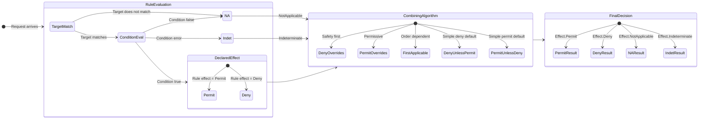

# XACML Decision Effects

## Overview

XACML 3.0 defines a **four-effect model** that provides precise semantics for every possible
outcome of a policy evaluation. Unlike simplified boolean allow/deny systems, the four-effect
model distinguishes between an explicit refusal, the absence of any applicable policy, and an
error condition. This distinction is critical for combining algorithms to produce correct
final authorization decisions.

The `Effect` enum in Encina represents these four outcomes:

```csharp
public enum Effect
{
    Permit,        // Access explicitly granted
    Deny,          // Access explicitly denied
    NotApplicable, // No policy has an opinion about this request
    Indeterminate  // An error prevented a definitive decision
}
```

Each effect carries different semantic weight. Collapsing them into a two-value model would
lose information that combining algorithms rely on to resolve conflicts between multiple
policies and rules.

## Permit

A **Permit** effect means the evaluated rule or policy explicitly allows the requested access.
When the PDP returns Permit, the PEP (Policy Enforcement Point) grants the request -- but
only after successfully executing all mandatory obligations attached to the decision.

```csharp
var decision = new PolicyDecision
{
    Effect = Effect.Permit,
    Obligations = [auditLogObligation],   // PEP MUST execute these
    Advice = [notifyAdminAdvice],          // PEP MAY execute these
    PolicyId = "finance-access-policy",
    RuleId = "allow-manager-read",
    Reason = "Subject has role=manager and action=read matches target",
    EvaluationDuration = TimeSpan.FromMilliseconds(2.3),
    Status = null
};
```

Key points about Permit:

- Obligations with `FulfillOn = FulfillOn.Permit` are collected and returned to the PEP.
- If the PEP cannot fulfill any obligation, it **must deny access** regardless of the Permit decision.
- Advice with `AppliesTo = FulfillOn.Permit` is included but failure to process it does not
  alter the decision.

## Deny

A **Deny** effect means the evaluated rule or policy explicitly refuses the requested access.
When the PDP returns Deny, the PEP blocks the request. In `ABACEnforcementMode.Block` mode,
the pipeline behavior returns an error. In `ABACEnforcementMode.Warn` mode, the deny is logged
but the request proceeds.

```csharp
var decision = new PolicyDecision
{
    Effect = Effect.Deny,
    Obligations = [lockAccountObligation], // PEP MUST execute these on Deny
    Advice = [showDeniedPageAdvice],       // PEP MAY process these
    PolicyId = "data-protection-policy",
    RuleId = "deny-external-access",
    Reason = "Subject environment.ipAddress is not in trusted-network range",
    EvaluationDuration = TimeSpan.FromMilliseconds(1.8),
    Status = null
};
```

Key points about Deny:

- Obligations with `FulfillOn = FulfillOn.Deny` are collected for the PEP.
- Unlike Permit, obligation failure on a Deny does not change the outcome -- the request
  is already denied.
- Deny is an **active refusal**, semantically different from NotApplicable.

## NotApplicable

A **NotApplicable** effect means no rule or policy in the evaluated set has a target that
matches the current request. The policy has no opinion about this request. This is distinct
from both Permit and Deny: it signals that the policy was simply irrelevant to the access
request being evaluated.

```csharp
// No policy targets the "analytics" resource type
var decision = new PolicyDecision
{
    Effect = Effect.NotApplicable,
    Obligations = [],
    Advice = [],
    PolicyId = null,
    RuleId = null,
    Reason = "No policy target matched the request attributes",
    EvaluationDuration = TimeSpan.FromMilliseconds(0.4),
    Status = null
};
```

NotApplicable is produced when:

- A rule's `Target` does not match the request attributes.
- A policy's `Target` does not match, so none of its rules are evaluated.
- All rules within a matching policy individually return NotApplicable.

The PEP decides what to do with NotApplicable via `ABACOptions.DefaultNotApplicableEffect`.

## Indeterminate

An **Indeterminate** effect means an error occurred during evaluation that prevented the PDP
from reaching a definitive Permit or Deny decision. This can happen when attributes are
missing, a function call fails, or an expression evaluates to an unexpected type.

```csharp
var decision = new PolicyDecision
{
    Effect = Effect.Indeterminate,
    Obligations = [],
    Advice = [],
    PolicyId = "location-based-policy",
    RuleId = "geo-fence-check",
    Reason = "Condition evaluation error: attribute 'subject.location' not found",
    EvaluationDuration = TimeSpan.FromMilliseconds(5.1),
    Status = new DecisionStatus
    {
        StatusCode = "missing-attribute",
        StatusMessage = "Required attribute 'subject.location' was not provided by any IAttributeProvider"
    }
};
```

The `DecisionStatus` record provides diagnostic details:

| StatusCode | Meaning |
|-----------|---------|
| `ok` | No error (normal Permit/Deny) |
| `missing-attribute` | A required attribute was not available |
| `syntax-error` | A condition expression has invalid syntax |
| `processing-error` | A function or evaluation failed at runtime |

Combining algorithms handle Indeterminate results according to their specific semantics.
For example, Deny-Overrides treats an Indeterminate from a deny-intended rule as potentially
Deny, erring on the side of caution.

## Effect vs Decision

The distinction between **Rule effects** and **Policy/PolicySet decisions** is fundamental
to understanding XACML evaluation:

### Rule Level

Rules are the leaf nodes of the policy hierarchy. A rule can only have `Effect.Permit` or
`Effect.Deny` as its declared effect. The other two effects are computed:

| Scenario | Returned Effect |
|----------|----------------|
| Target matches AND condition is true (or absent) | The rule's declared Effect (Permit or Deny) |
| Target does not match | NotApplicable |
| Condition evaluation throws an error | Indeterminate |

### Policy Level

A policy combines its rules' effects using a combining algorithm to produce a single decision.
All four effects are possible at this level:

```
Rule 1: Permit  ──┐
Rule 2: Deny    ──┼── Combining Algorithm ──► Policy Decision (any of 4 effects)
Rule 3: N/A     ──┘
```

### PolicySet Level

A policy set combines its child policies' and nested policy sets' decisions using another
combining algorithm, producing the final top-level decision:

```
Policy A: Permit     ──┐
Policy B: Deny       ──┼── Combining Algorithm ──► PolicySet Decision (any of 4 effects)
PolicySet C: Permit  ──┘
```

The `PolicyDecision` record carries the final result along with collected obligations, advice,
and diagnostic information from every level of the evaluation hierarchy.

## Default Not-Applicable Behavior

When no policy or rule applies to a request (the final combined effect is NotApplicable),
the PEP must decide how to proceed. The `ABACOptions.DefaultNotApplicableEffect` property
controls this behavior:

```csharp
services.AddEncinaABAC(options =>
{
    // Closed-world assumption (default): unmatched requests are denied
    options.DefaultNotApplicableEffect = Effect.Deny;

    // Open-world assumption: unmatched requests are allowed
    options.DefaultNotApplicableEffect = Effect.Permit;
});
```

| Setting | Behavior | Use Case |
|---------|----------|----------|
| `Effect.Deny` (default) | Unmatched requests are treated as denied | Security-critical systems, principle of least privilege |
| `Effect.Permit` | Unmatched requests are treated as permitted | Open systems, gradual policy adoption |

The default is `Effect.Deny` following the **secure-by-default** principle: if no policy
explicitly permits an action, it is denied.

## Indeterminate Handling

Indeterminate results propagate through the evaluation hierarchy. How they are ultimately
handled depends on two factors: the combining algorithm and the enforcement mode.

### Error Propagation Through Combining Algorithms

Different combining algorithms treat Indeterminate differently:

| Algorithm | Indeterminate Handling |
|-----------|----------------------|
| Deny-Overrides | Indeterminate from a deny-intended rule is treated conservatively (may produce Indeterminate) |
| Permit-Overrides | Indeterminate from a permit-intended rule is treated conservatively |
| First-Applicable | Returns Indeterminate immediately if the first applicable result is Indeterminate |
| Only-One-Applicable | Any Indeterminate during evaluation produces Indeterminate |
| Deny-Unless-Permit | Absorbs Indeterminate -- treats it as not-Permit, resulting in Deny |
| Permit-Unless-Deny | Absorbs Indeterminate -- treats it as not-Deny, resulting in Permit |

See [Combining Algorithms](combining-algorithms.md) for detailed truth tables.

### Enforcement Mode Interaction

The `ABACEnforcementMode` determines what the PEP does with the final decision:

```csharp
public enum ABACEnforcementMode
{
    Block,    // Deny/Indeterminate blocks the request (production)
    Warn,     // Deny/Indeterminate logs a warning but allows the request (observation)
    Disabled  // ABAC evaluation is skipped entirely
}
```

In `Block` mode, an Indeterminate final decision **denies the request** because the PDP
could not determine that access is allowed. In `Warn` mode, the Indeterminate is logged
for analysis but the request proceeds.

## Effect Precedence in Combining Algorithms

Combining algorithms resolve conflicts when multiple rules or policies produce different
effects. The precedence depends on the algorithm chosen:



The general precedence patterns are:

- **Deny-Overrides / Ordered-Deny-Overrides**: Deny > Indeterminate > Permit > NotApplicable
- **Permit-Overrides / Ordered-Permit-Overrides**: Permit > Indeterminate > Deny > NotApplicable
- **Deny-Unless-Permit**: Permit > everything else (defaults to Deny)
- **Permit-Unless-Deny**: Deny > everything else (defaults to Permit)
- **First-Applicable**: Whichever effect appears first in evaluation order wins
- **Only-One-Applicable**: The single applicable policy's effect, or Indeterminate if ambiguous

For detailed truth tables and decision matrices for each algorithm, see
[Combining Algorithms](combining-algorithms.md).

## Related Topics

- [Combining Algorithms](combining-algorithms.md) -- How effects are combined across rules and policies
- [Architecture](architecture.md) -- PDP, PEP, PAP, PIP component overview
