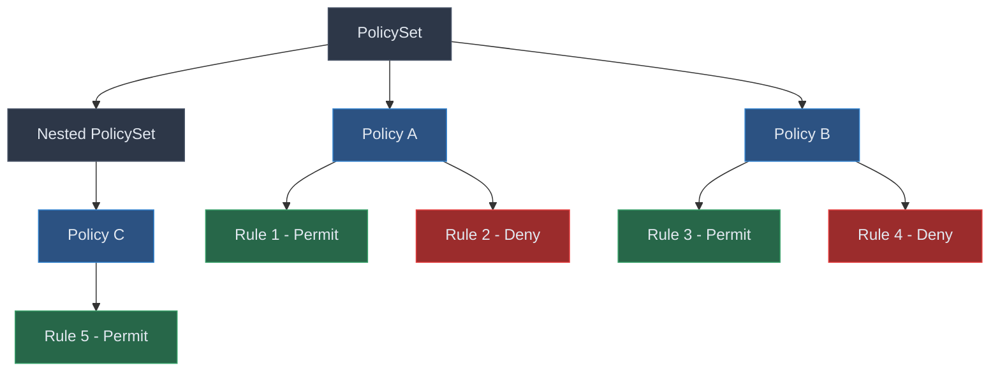
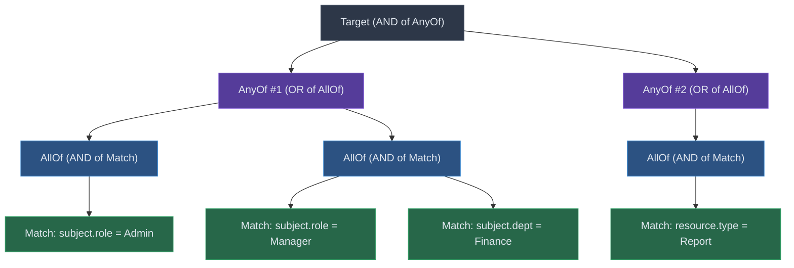

# XACML Policy Language

The XACML 3.0 policy language provides a structured, hierarchical model for expressing authorization logic. Encina.Security.ABAC implements this model as immutable C# records with a companion fluent builder API that makes policy construction type-safe and concise.

This guide covers the three-level policy hierarchy (PolicySet, Policy, Rule), the target matching predicate, condition expression trees, variable definitions, and practical patterns for building real-world authorization policies.

---

## Table of Contents

1. [Overview](#1-overview)
2. [PolicySet](#2-policyset)
3. [Policy](#3-policy)
4. [Rule](#4-rule)
5. [Target](#5-target)
6. [Condition](#6-condition)
7. [Variable Definitions](#7-variable-definitions)
8. [Hierarchy Evaluation](#8-hierarchy-evaluation)
9. [Building Policies with Fluent API](#9-building-policies-with-fluent-api)
10. [Best Practices](#10-best-practices)

---

## 1. Overview

XACML 3.0 organizes authorization logic into a three-level hierarchy. Each level serves a distinct role: PolicySets group related policies, Policies group related rules, and Rules are the leaf nodes that produce individual Permit or Deny effects.



**Key characteristics of the hierarchy:**

| Level | Contains | Combining Algorithm Scope | Can Define Variables |
|-------|----------|--------------------------|---------------------|
| **PolicySet** | Policies + nested PolicySets | Policy-combining | No |
| **Policy** | Rules | Rule-combining | Yes |
| **Rule** | Effect + Target + Condition | N/A (leaf node) | No |

Every level can carry an optional **Target** (matching predicate), **Obligations** (mandatory post-decision actions), and **Advice** (optional post-decision hints). The combining algorithm at each non-leaf level determines how child effects are aggregated into a single decision.

---

## 2. PolicySet

A `PolicySet` is the top-level container in the XACML hierarchy. It groups one or more `Policy` elements and/or nested `PolicySet` elements, combining their effects through a specified algorithm.

**XACML 3.0 reference**: Section 7.11.

### Properties

| Property | Type | Required | Default | Description |
|----------|------|----------|---------|-------------|
| `Id` | `string` | Yes | -- | Unique identifier for this policy set |
| `Version` | `string?` | No | `null` | Version string (e.g., `"1.0"`, `"2.1.3"`) |
| `Description` | `string?` | No | `null` | Human-readable description |
| `Target` | `Target?` | No | `null` | Matching predicate; `null` matches all requests |
| `Policies` | `IReadOnlyList<Policy>` | Yes | -- | Direct child policies |
| `PolicySets` | `IReadOnlyList<PolicySet>` | Yes | -- | Nested policy sets (recursive) |
| `Algorithm` | `CombiningAlgorithmId` | Yes | -- | How child effects are combined |
| `Obligations` | `IReadOnlyList<Obligation>` | Yes | -- | Mandatory post-decision actions |
| `Advice` | `IReadOnlyList<AdviceExpression>` | Yes | -- | Optional post-decision hints |
| `IsEnabled` | `bool` | No | `true` | When `false`, produces NotApplicable |
| `Priority` | `int` | No | `0` | Evaluation order (lower = higher priority) |

### Recursive Nesting

PolicySets can contain other PolicySets to model organizational hierarchies:

```
Organization PolicySet (DenyOverrides)
  |-- Finance Department PolicySet (FirstApplicable)
  |     |-- Budget Policy
  |     |-- Reporting Policy
  |-- HR Department PolicySet (DenyOverrides)
        |-- Employee Records Policy
        |-- Payroll Policy
```

When a PolicySet is disabled (`IsEnabled = false`), its entire subtree is skipped and the result is `NotApplicable`.

---

## 3. Policy

A `Policy` is a named container of rules. It applies a combining algorithm to its rules and can define reusable variable expressions scoped to itself.

**XACML 3.0 reference**: Section 7.10.

### Properties

| Property | Type | Required | Default | Description |
|----------|------|----------|---------|-------------|
| `Id` | `string` | Yes | -- | Unique identifier |
| `Version` | `string?` | No | `null` | Version string |
| `Description` | `string?` | No | `null` | Human-readable description |
| `Target` | `Target?` | No | `null` | Matching predicate; `null` matches all requests |
| `Rules` | `IReadOnlyList<Rule>` | Yes | -- | The rules to evaluate |
| `Algorithm` | `CombiningAlgorithmId` | Yes | -- | How rule effects are combined |
| `Obligations` | `IReadOnlyList<Obligation>` | Yes | -- | Mandatory post-decision actions |
| `Advice` | `IReadOnlyList<AdviceExpression>` | Yes | -- | Optional post-decision hints |
| `VariableDefinitions` | `IReadOnlyList<VariableDefinition>` | Yes | -- | Reusable sub-expressions |
| `IsEnabled` | `bool` | No | `true` | When `false`, produces NotApplicable |
| `Priority` | `int` | No | `0` | Evaluation order (lower = higher priority) |

A Policy can exist standalone or as a child of a PolicySet. The `ForResourceType<T>()` builder method provides a convenient shorthand for targeting policies at specific resource types.

---

## 4. Rule

A `Rule` is the leaf authorization unit. It produces exactly one `Effect` -- either `Permit` or `Deny` -- when its target matches and its condition evaluates to `true`. The two additional effects, `NotApplicable` and `Indeterminate`, are computed by the evaluation engine and cannot be assigned directly to a rule.

**XACML 3.0 reference**: Section 7.9.

### Properties

| Property | Type | Required | Default | Description |
|----------|------|----------|---------|-------------|
| `Id` | `string` | Yes | -- | Unique identifier within its policy |
| `Description` | `string?` | No | `null` | Human-readable description |
| `Effect` | `Effect` | Yes | -- | `Permit` or `Deny` only |
| `Target` | `Target?` | No | `null` | Matching predicate; `null` inherits from parent |
| `Condition` | `Apply?` | No | `null` | Expression tree that must evaluate to `true` |
| `Obligations` | `IReadOnlyList<Obligation>` | Yes | -- | Mandatory post-decision actions |
| `Advice` | `IReadOnlyList<AdviceExpression>` | Yes | -- | Optional post-decision hints |

### Rule Evaluation Logic

The evaluation engine processes each rule through a three-step sequence:

1. **Target match**: If the rule has a target and it does not match, the result is `NotApplicable`.
2. **Condition evaluation**: If the rule has a condition and it evaluates to `false`, the result is `NotApplicable`. If the condition evaluation fails (missing attribute, function error), the result is `Indeterminate`.
3. **Effect returned**: If both checks pass (or are absent), the rule's declared `Effect` is returned.

---

## 5. Target

A `Target` is a structured matching predicate that determines whether a policy, policy set, or rule applies to a given access request. It uses XACML's triple-nesting structure defined in Section 7.6.



### Structure Summary

| Level | Semantics | Logical Operator |
|-------|-----------|-----------------|
| **Target** | All `AnyOf` elements must match | AND |
| **AnyOf** | At least one `AllOf` must match | OR |
| **AllOf** | All `Match` elements must match | AND |
| **Match** | Compare attribute against literal value | Equality/comparison function |

Reading the diagram above:

- The **Target** matches when AnyOf #1 **AND** AnyOf #2 both match.
- **AnyOf #1** matches when AllOf containing `subject.role = Admin` **OR** AllOf containing (`subject.role = Manager` AND `subject.dept = Finance`) matches.
- **AnyOf #2** matches when AllOf containing `resource.type = Report` matches.

So the complete predicate is: `(role=Admin OR (role=Manager AND dept=Finance)) AND resource.type=Report`.

### Match Element

A `Match` compares a request attribute against a literal value using a named function:

| Property | Type | Description |
|----------|------|-------------|
| `FunctionId` | `string` | The comparison function (e.g., `"string-equal"`) |
| `AttributeDesignator` | `AttributeDesignator` | Resolves the attribute from the request context |
| `AttributeValue` | `AttributeValue` | The literal value to compare against |

The `AttributeDesignator` identifies the attribute by:

- **Category**: `Subject`, `Resource`, `Action`, or `Environment`
- **AttributeId**: The attribute name (e.g., `"department"`, `"classification"`)
- **DataType**: The expected XACML data type (e.g., `"string"`, `"integer"`)
- **MustBePresent**: When `true`, a missing attribute produces `Indeterminate`

### Empty Targets

A `null` target or one with an empty `AnyOfElements` list matches all requests unconditionally. This is valid per XACML 3.0 and is commonly used on rules that rely solely on conditions, or on catch-all default policies.

---

## 6. Condition

A `Condition` is an `Apply` expression tree -- a recursive structure of function invocations that evaluates to a boolean value. Unlike the Target (which uses the fixed `AnyOf/AllOf/Match` structure), conditions support arbitrary expression composition.

### Apply Node

An `Apply` node invokes a function by its ID with a list of `IExpression` arguments:

| Property | Type | Description |
|----------|------|-------------|
| `FunctionId` | `string` | The function to invoke (e.g., `"and"`, `"string-equal"`) |
| `Arguments` | `IReadOnlyList<IExpression>` | The function arguments |

### Expression Types

The `IExpression` interface is implemented by four types that can appear as arguments in an `Apply` node:

| Type | Role | Example |
|------|------|---------|
| `Apply` | Nested function invocation | `and(expr1, expr2)` |
| `AttributeDesignator` | Attribute lookup from context | `subject.department` |
| `AttributeValue` | Literal value | `"Finance"`, `10000` |
| `VariableReference` | Reference to a VariableDefinition | `isHighValue` |

### Expression Tree Example

The condition `subject.department == "Finance" AND resource.amount > 10000` is represented as:

```
Apply: "and"
  |-- Apply: "string-equal"
  |     |-- AttributeDesignator: subject.department (string)
  |     |-- AttributeValue: "Finance" (string)
  |-- Apply: "integer-greater-than"
        |-- AttributeDesignator: resource.amount (integer)
        |-- AttributeValue: 10000 (integer)
```

In code, the `ConditionBuilder` static class provides convenience methods that construct these trees:

```csharp
var condition = ConditionBuilder.And(
    ConditionBuilder.Equal(
        ConditionBuilder.Attribute(AttributeCategory.Subject, "department", XACMLDataTypes.String),
        ConditionBuilder.StringValue("Finance")),
    ConditionBuilder.GreaterThan(
        ConditionBuilder.Attribute(AttributeCategory.Resource, "amount", XACMLDataTypes.Integer),
        ConditionBuilder.IntValue(10000)));
```

### Target vs. Condition

| Aspect | Target | Condition |
|--------|--------|-----------|
| Structure | Fixed `AnyOf/AllOf/Match` hierarchy | Recursive `Apply` expression tree |
| Expressiveness | Equality and simple comparisons | Arbitrary function composition |
| Purpose | Fast applicability filtering | Detailed authorization logic |
| Evaluated when | Before condition | After target matches |
| Failure behavior | `NotApplicable` | `Indeterminate` |

Use targets for simple, indexable matching predicates (department equals, resource type equals). Use conditions for complex logic that requires boolean connectives, arithmetic, string manipulation, or variable references.

---

## 7. Variable Definitions

A `VariableDefinition` defines a named, reusable sub-expression scoped to a single `Policy`. Variables avoid duplicating complex expressions across multiple rule conditions.

**XACML 3.0 reference**: Section 7.8.

| Property | Type | Description |
|----------|------|-------------|
| `VariableId` | `string` | Unique identifier within the policy |
| `Expression` | `IExpression` | The expression that computes the variable's value |

### Defining and Referencing Variables

Define a variable at the policy level:

```csharp
var policy = new PolicyBuilder("approval-policy")
    .DefineVariable("isHighValue", ConditionBuilder.GreaterThan(
        ConditionBuilder.Attribute(AttributeCategory.Resource, "amount", XACMLDataTypes.Integer),
        ConditionBuilder.IntValue(10000)))
    .AddRule("require-manager-approval", Effect.Deny, rule => rule
        .WithDescription("Deny high-value transactions without manager approval")
        .WithCondition(ConditionBuilder.And(
            ConditionBuilder.Function("boolean-equal",
                ConditionBuilder.Variable("isHighValue"),
                ConditionBuilder.BoolValue(true)),
            ConditionBuilder.Not(
                ConditionBuilder.Equal(
                    ConditionBuilder.Attribute(AttributeCategory.Subject, "role", XACMLDataTypes.String),
                    ConditionBuilder.StringValue("Manager"))))))
    .Build();
```

### Scoping Rules

- Variables are scoped to their containing `Policy` -- they cannot be referenced across policies.
- Variables are evaluated lazily when first referenced and their results can be cached for the duration of a single policy evaluation.
- A `VariableReference` to an undefined `VariableId` produces an `Indeterminate` result.

---

## 8. Hierarchy Evaluation

The PDP evaluates the hierarchy top-down. At each level, the evaluation follows the same pattern:

1. **Check enabled**: If `IsEnabled` is `false`, return `NotApplicable`.
2. **Evaluate target**: If the target does not match, return `NotApplicable`.
3. **Evaluate children**: Evaluate all child elements (policies/policy sets for a PolicySet, rules for a Policy).
4. **Combine results**: Apply the combining algorithm to aggregate child effects into a single decision.
5. **Collect obligations and advice**: Propagate obligations and advice that match the final decision upward through the hierarchy.

### PolicySet Evaluation

```
PolicySet (DenyOverrides)
  |-- Target match? --> No --> NotApplicable
  |-- Yes
      |-- Evaluate Policy A --> Permit
      |-- Evaluate Policy B --> Deny
      |-- Evaluate Nested PolicySet --> NotApplicable
      |-- Apply DenyOverrides --> Deny (because any Deny wins)
      |-- Collect obligations/advice for Deny
```

### Policy Evaluation

```
Policy (FirstApplicable)
  |-- Target match? --> No --> NotApplicable
  |-- Yes
      |-- Evaluate Rule 1 --> NotApplicable (target mismatch)
      |-- Evaluate Rule 2 --> Permit (target match + condition true)
      |-- Apply FirstApplicable --> Permit (first applicable result)
      |-- Collect obligations/advice for Permit
```

### Rule Evaluation

```
Rule (Effect = Permit)
  |-- Target match? --> No --> NotApplicable
  |-- Yes
      |-- Condition present?
          |-- No --> return Permit
          |-- Yes --> Evaluate condition
              |-- true --> return Permit
              |-- false --> return NotApplicable
              |-- error --> return Indeterminate
```

The combining algorithm at each level determines conflict resolution. See [Combining Algorithms](combining-algorithms.md) for detailed semantics of each algorithm.

---

## 9. Building Policies with Fluent API

Encina provides four builder classes that mirror the hierarchy and eliminate boilerplate:

| Builder | Builds | Constructor Parameter |
|---------|--------|----------------------|
| `PolicySetBuilder` | `PolicySet` | `id` (string) |
| `PolicyBuilder` | `Policy` | `id` (string) |
| `RuleBuilder` | `Rule` | `id` (string), `effect` (Effect) |
| `TargetBuilder` | `Target` | (none) |

The `ConditionBuilder` static class provides factory methods for expression trees.

### Example: Finance Department Access Control

```csharp
var financePolicy = new PolicySetBuilder("finance-department")
    .WithVersion("1.0")
    .WithDescription("Finance department access control policies")
    .WithAlgorithm(CombiningAlgorithmId.DenyOverrides)
    .WithTarget(t => t
        .AnyOf(any => any
            .AllOf(all => all
                .MatchAttribute(
                    AttributeCategory.Subject,
                    "department",
                    ConditionOperator.Equals,
                    "Finance"))))
    .AddPolicy("budget-access", policy => policy
        .WithDescription("Controls access to budget resources")
        .ForResourceType<BudgetReport>()
        .WithAlgorithm(CombiningAlgorithmId.FirstApplicable)
        .AddRule("allow-read", Effect.Permit, rule => rule
            .WithDescription("Finance staff can read budget reports")
            .WithCondition(ConditionBuilder.Equal(
                ConditionBuilder.Attribute(
                    AttributeCategory.Action, "name", XACMLDataTypes.String),
                ConditionBuilder.StringValue("read"))))
        .AddRule("allow-manager-write", Effect.Permit, rule => rule
            .WithDescription("Finance managers can modify budget reports")
            .WithCondition(ConditionBuilder.And(
                ConditionBuilder.Equal(
                    ConditionBuilder.Attribute(
                        AttributeCategory.Action, "name", XACMLDataTypes.String),
                    ConditionBuilder.StringValue("write")),
                ConditionBuilder.Equal(
                    ConditionBuilder.Attribute(
                        AttributeCategory.Subject, "role", XACMLDataTypes.String),
                    ConditionBuilder.StringValue("Manager")))))
        .AddRule("deny-all", Effect.Deny, rule => rule
            .WithDescription("Default deny for unmatched requests")))
    .Build();
```

### Example: Time-Based Resource Restrictions

```csharp
var timeRestriction = new PolicyBuilder("business-hours-policy")
    .WithDescription("Restrict sensitive operations to business hours")
    .WithAlgorithm(CombiningAlgorithmId.DenyUnlessPermit)
    .AddRule("allow-business-hours", Effect.Permit, rule => rule
        .WithDescription("Permit access during business hours (09:00-18:00)")
        .WithCondition(ConditionBuilder.And(
            ConditionBuilder.GreaterThanOrEqual(
                ConditionBuilder.Attribute(
                    AttributeCategory.Environment, "currentTime", XACMLDataTypes.Time),
                ConditionBuilder.TimeValue(new TimeOnly(9, 0))),
            ConditionBuilder.LessThan(
                ConditionBuilder.Attribute(
                    AttributeCategory.Environment, "currentTime", XACMLDataTypes.Time),
                ConditionBuilder.TimeValue(new TimeOnly(18, 0))))))
    .AddRule("allow-emergency-override", Effect.Permit, rule => rule
        .WithDescription("Emergency override for on-call staff outside business hours")
        .WithCondition(ConditionBuilder.Equal(
            ConditionBuilder.Attribute(
                AttributeCategory.Subject, "emergencyOverride", XACMLDataTypes.Boolean),
            ConditionBuilder.BoolValue(true))))
    .Build();
```

### Example: Multi-Level Approval Workflow

```csharp
var approvalWorkflow = new PolicyBuilder("multi-level-approval")
    .WithDescription("High-value transactions require escalating approval levels")
    .WithAlgorithm(CombiningAlgorithmId.FirstApplicable)
    .DefineVariable("transactionAmount",
        ConditionBuilder.Attribute(
            AttributeCategory.Resource, "amount", XACMLDataTypes.Integer))
    .AddRule("auto-approve-low", Effect.Permit, rule => rule
        .WithDescription("Auto-approve transactions under 1,000")
        .WithCondition(ConditionBuilder.LessThan(
            ConditionBuilder.Variable("transactionAmount"),
            ConditionBuilder.IntValue(1000))))
    .AddRule("manager-approve-medium", Effect.Permit, rule => rule
        .WithDescription("Manager approval for transactions 1,000 - 50,000")
        .WithCondition(ConditionBuilder.And(
            ConditionBuilder.LessThanOrEqual(
                ConditionBuilder.Variable("transactionAmount"),
                ConditionBuilder.IntValue(50000)),
            ConditionBuilder.Equal(
                ConditionBuilder.Attribute(
                    AttributeCategory.Subject, "role", XACMLDataTypes.String),
                ConditionBuilder.StringValue("Manager")))))
    .AddRule("director-approve-high", Effect.Permit, rule => rule
        .WithDescription("Director approval for transactions over 50,000")
        .WithCondition(ConditionBuilder.And(
            ConditionBuilder.GreaterThan(
                ConditionBuilder.Variable("transactionAmount"),
                ConditionBuilder.IntValue(50000)),
            ConditionBuilder.Equal(
                ConditionBuilder.Attribute(
                    AttributeCategory.Subject, "role", XACMLDataTypes.String),
                ConditionBuilder.StringValue("Director")))))
    .AddRule("deny-default", Effect.Deny, rule => rule
        .WithDescription("Deny if no approval rule matched"))
    .Build();
```

### Example: Nested PolicySet with Mixed Algorithms

```csharp
var orgPolicies = new PolicySetBuilder("acme-corp")
    .WithDescription("ACME Corporation authorization policies")
    .WithAlgorithm(CombiningAlgorithmId.DenyOverrides)
    .AddPolicySet("engineering", nested => nested
        .WithDescription("Engineering department policies")
        .WithAlgorithm(CombiningAlgorithmId.PermitOverrides)
        .WithTarget(t => t
            .AnyOf(any => any
                .AllOf(all => all
                    .MatchAttribute(
                        AttributeCategory.Subject,
                        "department",
                        ConditionOperator.Equals,
                        "Engineering"))))
        .AddPolicy("source-code", policy => policy
            .AddRule("allow-engineers-read", Effect.Permit, rule => rule
                .WithCondition(ConditionBuilder.Equal(
                    ConditionBuilder.Attribute(
                        AttributeCategory.Action, "name", XACMLDataTypes.String),
                    ConditionBuilder.StringValue("read"))))))
    .AddPolicy("global-deny-classified", policy => policy
        .WithDescription("Deny access to classified resources without clearance")
        .AddRule("deny-classified", Effect.Deny, rule => rule
            .WithCondition(ConditionBuilder.And(
                ConditionBuilder.Equal(
                    ConditionBuilder.Attribute(
                        AttributeCategory.Resource, "classification", XACMLDataTypes.String),
                    ConditionBuilder.StringValue("Classified")),
                ConditionBuilder.Not(
                    ConditionBuilder.Equal(
                        ConditionBuilder.Attribute(
                            AttributeCategory.Subject, "clearanceLevel", XACMLDataTypes.String),
                        ConditionBuilder.StringValue("TopSecret")))))))
    .Build();
```

---

## 10. Best Practices

### Policy Organization

- **One domain concern per Policy**: Each Policy should address a single resource type or access scenario. Avoid monolithic policies with dozens of unrelated rules.
- **Use PolicySets for organizational structure**: Mirror your organizational hierarchy (department, team, application) in nested PolicySets. This makes policy administration and auditing straightforward.
- **Keep rule count manageable**: A Policy with 3-7 rules is typical. If a Policy grows beyond 10 rules, consider splitting it into multiple Policies within a PolicySet.

### Naming Conventions

| Element | Convention | Example |
|---------|-----------|---------|
| PolicySet Id | `{scope}-policies` | `"finance-department-policies"` |
| Policy Id | `{resource}-{concern}-policy` | `"budget-access-policy"` |
| Rule Id | `{action}-{subject}-{resource}` | `"allow-manager-write-budget"` |
| Variable Id | `camelCase` descriptive name | `"isHighValueTransaction"` |

### Choosing Between Target and Condition

- **Use Target** for simple attribute-equals checks that determine applicability. Targets are optimized for fast indexing and filtering.
- **Use Condition** for complex logic involving boolean connectives, arithmetic, negation, or variable references.
- **Combine both**: Use the Target to quickly filter applicability, then use the Condition for fine-grained authorization logic within matching rules.

### Combining Algorithm Selection

| Scenario | Recommended Algorithm |
|----------|----------------------|
| Security-critical, deny by default | `DenyUnlessPermit` |
| Mandatory access control (MAC) | `DenyOverrides` |
| Discretionary access control (DAC) | `PermitOverrides` |
| Priority-ordered rules | `FirstApplicable` |
| Exactly one policy must match | `OnlyOneApplicable` |
| Deterministic obligation order | `OrderedDenyOverrides` / `OrderedPermitOverrides` |

### Modularity and Reuse

- **Extract shared targets**: Build common targets (e.g., department matchers, resource type matchers) as reusable `Target` instances and pass them to multiple builders via `WithTarget(target)`.
- **Use VariableDefinitions**: When the same sub-expression appears in multiple rules within a policy, extract it into a `DefineVariable` call. This reduces duplication and improves readability.
- **Compose with pre-built elements**: All builders accept both inline delegates and pre-built instances. Use `AddPolicy(preBuiltPolicy)` when reusing policies across tests or configurations.

### IsEnabled and Priority

- Use `IsEnabled = false` to temporarily deactivate policies during maintenance or phased rollouts without removing them from the hierarchy.
- Use `Priority` with `FirstApplicable` or ordered combining algorithms to control evaluation order. Lower values are evaluated first.

---

## Cross-References

- **[Architecture](architecture.md)** -- PDP, PAP, PIP component architecture and request flow
- **[Effects](effects.md)** -- The four XACML effects (Permit, Deny, NotApplicable, Indeterminate)
- **[Combining Algorithms](combining-algorithms.md)** -- Detailed semantics of all eight algorithms
- **[Functions](functions.md)** -- Standard XACML function library (equality, comparison, string, logical, set, bag)
