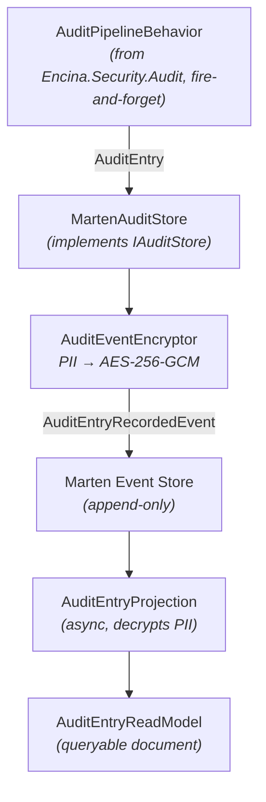

# Encina.Audit.Marten — Event-Sourced Audit with Temporal Crypto-Shredding

## Overview

`Encina.Audit.Marten` is a specialized `IAuditStore` provider that uses Marten's PostgreSQL event store for **immutable, compliance-grade audit trails** with temporal crypto-shredding.

Unlike the 13 database providers (ADO.NET, Dapper, EF Core, MongoDB) which store audit entries as mutable rows, this provider stores them as **append-only encrypted events**. PII fields are encrypted with time-partitioned AES-256-GCM keys, enabling GDPR data minimization via key destruction without breaking event stream integrity.

## Compliance Mapping

| Regulation | Article | Requirement | How This Package Addresses It |
|------------|---------|-------------|-------------------------------|
| **SOX** | Section 404 | Immutable audit trail of internal controls | Append-only event streams cannot be modified or deleted |
| **NIS2** | Art. 10 | Logging with integrity guarantees | Event stream integrity preserved even after crypto-shredding |
| **GDPR** | Art. 5(1)(e) | Data minimization — storage limitation | Temporal crypto-shredding renders PII unreadable after retention period |
| **GDPR** | Art. 17 | Right to erasure | Temporal key destruction achieves effective erasure |
| **HIPAA** | Section 164.312(b) | Audit controls | Comprehensive access tracking with configurable retention |
| **PCI-DSS** | Req. 10.2 | Logging and monitoring | Full audit trail of cardholder data operations |

## Architecture



## Configuration

```csharp
services.AddEncinaAuditMarten(options =>
{
    // Time partitioning for encryption keys
    options.TemporalGranularity = TemporalKeyGranularity.Monthly;

    // Which fields to encrypt (PiiFieldsOnly or AllFields)
    options.EncryptionScope = AuditEncryptionScope.PiiFieldsOnly;

    // Retention before crypto-shredding (SOX = 7 years)
    options.RetentionPeriod = TimeSpan.FromDays(2555);

    // Background auto-purge
    options.EnableAutoPurge = true;
    options.PurgeIntervalHours = 24;

    // Health check
    options.AddHealthCheck = true;
});
```

## Encryption Scope

### PiiFieldsOnly (default, recommended)

Encrypts: `UserId`, `IpAddress`, `UserAgent`, `RequestPayload`, `ResponsePayload`, `Metadata`.

Plaintext: `Action`, `EntityType`, `EntityId`, `Outcome`, `TimestampUtc`, `CorrelationId`, `TenantId`, `RequestPayloadHash`.

After crypto-shredding, compliance officers can still see "someone did X to entity Y at time Z" without knowing who.

### AllFields

Encrypts everything. After crypto-shredding, nothing is queryable. Use only when structural metadata is considered sensitive.

## Temporal Key Granularity

| Granularity | Key Format | Keys/Year | Shredding Precision | Use Case |
|-------------|-----------|-----------|---------------------|----------|
| Monthly | `2026-03` | 12 | ~30 days | GDPR strict minimization |
| Quarterly | `2026-Q1` | 4 | ~90 days | Balance of precision and overhead |
| Yearly | `2026` | 1 | ~365 days | Long retention (SOX 7-year) |

## Performance

<!-- docref-table: bench:audit-marten/* -->
| Operation | Latency | Notes |
|-----------|---------|-------|
| Encrypt 1 PII field (16B) | ~900 ns | AES-NI hardware accelerated |
| Encrypt full entry (6 PII fields) | ~8.6 us | Typical command overhead |
| Key lookup (existing) | ~60 ns | ConcurrentDictionary O(1) |
| Shredded path (null key) | ~0.4 ns | Zero-cost when key destroyed |
| **Load test throughput** | **508K entries/sec** | 8 workers, 2KB payload |
| **P50 latency** | **8.7 us** | |
| **P99 latency** | **0.24 ms** | |
<!-- /docref-table -->

The encryption overhead represents **< 1%** of total audit recording cost (PostgreSQL I/O dominates at 1-5 ms).

## Testing

| Type | Count | Coverage |
|------|-------|----------|
| Unit | 60 | Encryption round-trip, key lifecycle, options, encryptor |
| Guard | 13 | Null parameter validation |
| Property | 6 | FsCheck round-trip invariants |
| Integration | 7 | Real PostgreSQL via Docker/Testcontainers |
| Benchmark | 17 | EncryptedField, TemporalKeyProvider, AuditEventEncryptor |
| Load | 1 | 8-worker concurrent encryption with P50/P95/P99 |

## Related

- [Audit Trail Logging](audit-tracking.md) — Core `IAuditStore` interface and pipeline behavior
- [Crypto-Shredding](crypto-shredding.md) — GDPR Art. 17 per-subject crypto-shredding (Encina.Marten.GDPR)
- [Benchmark Results](../benchmarks/audit-marten-benchmark-results.md) — Detailed benchmark data
- [Load Test Baselines](../testing/load-test-baselines.md) — Throughput and latency baselines
