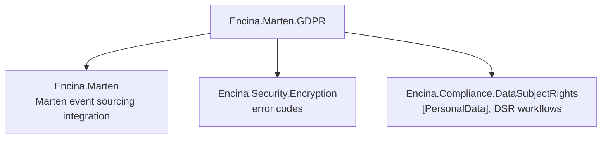
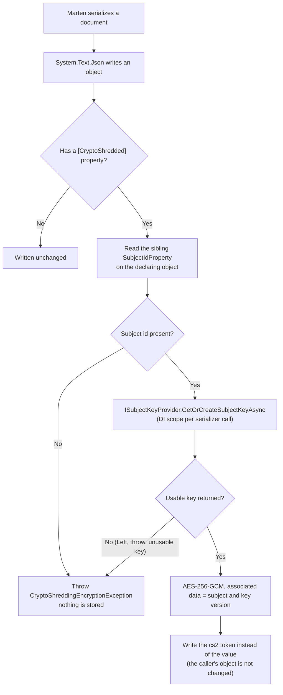
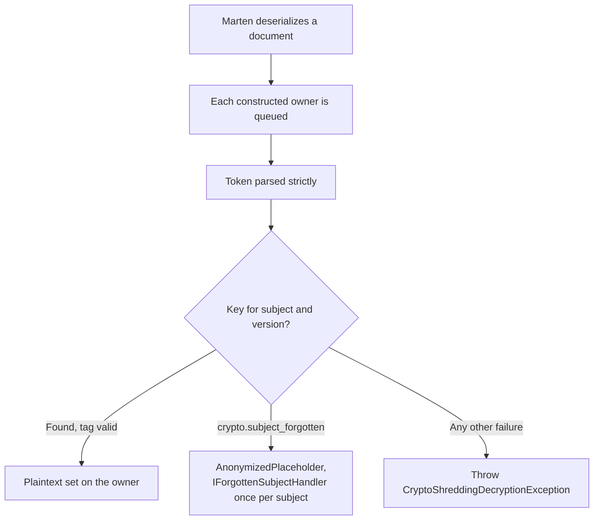
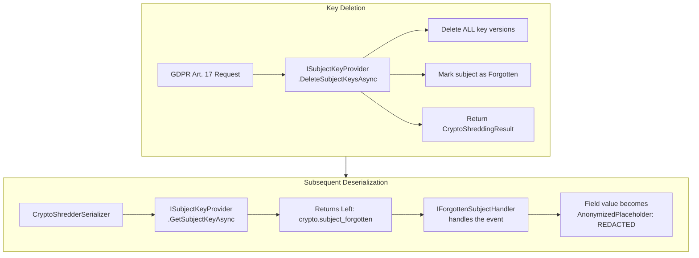
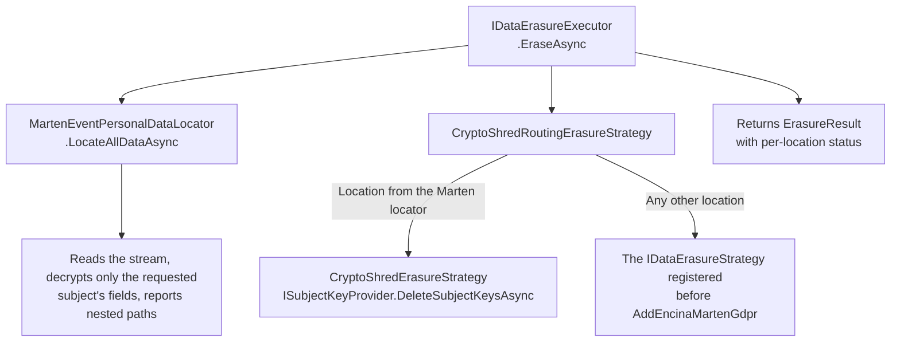

# Crypto-Shredding in Encina

This guide explains how to implement GDPR Article 17 "Right to be Forgotten" compliance in Marten event-sourced systems using the `Encina.Marten.GDPR` package. Crypto-shredding encrypts PII at the field level with per-subject keys, at any depth of an event, snapshot or document, and enables data erasure by deleting keys, rendering PII permanently unreadable without modifying the immutable event log.

The package is pre-1.0: names and behaviour described here can still change. The design reasons are in [ADR-034](../architecture/adr/034-crypto-shredding-through-the-stj-contract.md).

## Table of Contents

1. [Overview](#overview)
2. [The Problem](#the-problem)
3. [The Solution](#the-solution)
4. [Architecture](#architecture)
5. [Quick Start](#quick-start)
6. [The `[CryptoShredded]` Attribute](#the-cryptoshredded-attribute)
7. [Key Management](#key-management)
8. [Forgetting a Subject](#forgetting-a-subject)
9. [Key Rotation](#key-rotation)
10. [DSR Integration](#dsr-integration)
11. [Configuration Options](#configuration-options)
12. [Projection Handling](#projection-handling)
13. [Observability](#observability)
14. [Health Check](#health-check)
15. [Error Handling](#error-handling)
16. [Best Practices](#best-practices)
17. [Testing](#testing)
18. [FAQ](#faq)
19. [Limitations](#limitations)

---

## Overview

Encina.Marten.GDPR provides transparent, attribute-based crypto-shredding inside Marten's System.Text.Json serializer:

| Component | Description |
|-----------|-------------|
| **`[CryptoShredded]` Attribute** | Marks PII properties with subject binding, on events, snapshots, read models and the objects nested in them |
| **`CryptoShredderSerializer`** | Marten serializer wrapper that installs the System.Text.Json contract modifier which encrypts and decrypts PII transparently |
| **`ISubjectKeyProvider`** | Per-subject key lifecycle: create, retrieve, rotate, delete |
| **`CryptoShredErasureStrategy`** | Bridges DSR erasure workflows with crypto-shredding |
| **`MartenEventPersonalDataLocator`** | Discovers PII in Marten event streams, with nested paths |
| **`CryptoShreddingOptions`** | Configuration for key store, placeholder, startup validation, health check |

### Why Crypto-Shredding?

| Benefit | Description |
|---------|-------------|
| **Immutable event log** | Events are never modified or deleted, only keys are destroyed |
| **Per-subject isolation** | Each subject has independent encryption keys |
| **Forward-only encryption** | Key rotation encrypts new events; old events retain their key version |
| **Transparent** | Application code does not change, encryption is handled at the serializer level |

---

## The Problem

Event-sourced systems store an immutable log of domain events. When a user exercises their GDPR Article 17 right to erasure, traditional approaches face a fundamental conflict:

```csharp
// Problem: Events are immutable, we cannot delete or modify them
session.Events.Append(streamId, new UserRegisteredEvent
{
    UserId = "user-123",
    Email = "alice@example.com",  // PII stored in plaintext
    FullName = "Alice Smith"      // PII stored in plaintext
});

// GDPR Article 17 request: "Delete all my data"
// But we CANNOT modify or delete events in the event store!
```

---

## The Solution

Crypto-shredding encrypts PII at write time with a per-subject key. To "forget" a subject, delete the key: the encrypted value becomes permanently unreadable.

```csharp
// PII is encrypted transparently before storage
[PersonalData(Category = PersonalDataCategory.Contact, Erasable = true)]
[CryptoShredded(SubjectIdProperty = nameof(UserId))]
public string Email { get; init; } = string.Empty;

// In the event store, Email is stored as a token that carries no subject id:
// "cs2:1:<base64url of nonce, ciphertext and tag>"

// To forget the subject: delete the key
await keyProvider.DeleteSubjectKeysAsync("user-123");

// Now Email reads as "[REDACTED]": permanently unreadable
```

The token format is `cs2:{version}:{base64url(nonce || ciphertext || tag)}`, where `version` is the key version. The subject id is not stored in the token; it is bound to the ciphertext as AES-GCM associated data, so a token copied onto another subject's object fails the integrity check. When the placeholder of a forgotten subject is saved again (for example in a snapshot), the value `cs2:erased` (the tombstone) is stored.

---

## Architecture

### Dependency Diagram



### Encryption Flow (Serialization)

`AddEncinaMartenGdpr` installs a System.Text.Json contract modifier on every `JsonSerializerOptions` of Marten's serializer. System.Text.Json walks the object graph itself, so the same flow applies to the event, to each nested object, to collection elements and to dictionary values.



### Read Flow (Deserialization)



### Forget Flow (Key Deletion)



### DSR Integration Flow



---

## Quick Start

### 1. Install Packages

```bash
dotnet add package Encina.Security.Encryption
dotnet add package Encina.Marten.GDPR
```

### 2. Register Services

```csharp
// Required: encryption infrastructure
services.AddEncinaEncryption();

// Crypto-shredding for Marten
services.AddEncinaMartenGdpr(options =>
{
    options.UsePostgreSqlKeyStore = true;  // Production
    options.AddHealthCheck = true;
    options.AssembliesToScan.Add(typeof(Program).Assembly);
});
```

Order matters in two places:

- Call Marten's `UseTypeInfoResolver(context)` (a source-generated `JsonSerializerContext`) **before** `AddEncinaMartenGdpr`. Marten puts the context ahead of the resolver that holds the modifier, so a context added later is written without encryption. The installation check detects this at startup and stops the host.
- Register a custom `IDataErasureStrategy` or `IPersonalDataLocator` as described in [DSR Integration](#dsr-integration).

### 3. Decorate Event Properties

```csharp
public sealed record UserRegisteredEvent
{
    public string UserId { get; init; } = string.Empty;

    [PersonalData(Category = PersonalDataCategory.Contact, Erasable = true)]
    [CryptoShredded(SubjectIdProperty = nameof(UserId))]
    public string Email { get; init; } = string.Empty;

    [PersonalData(Category = PersonalDataCategory.Identity, Erasable = true)]
    [CryptoShredded(SubjectIdProperty = nameof(UserId))]
    public string FullName { get; init; } = string.Empty;

    public DateTimeOffset OccurredAtUtc { get; init; }
}
```

### 4. Use Normally, Encryption is Transparent

```csharp
// Write: Email and FullName are encrypted before storage
session.Events.Append(streamId, new UserRegisteredEvent
{
    UserId = "user-123",
    Email = "alice@example.com",
    FullName = "Alice Smith",
    OccurredAtUtc = DateTimeOffset.UtcNow
});
await session.SaveChangesAsync();

// Read: Email and FullName are decrypted automatically
var events = await session.Events.FetchStreamAsync(streamId);
var registered = events[0].Data as UserRegisteredEvent;
// registered.Email == "alice@example.com"
```

### Nested personal data

A `[CryptoShredded]` property can sit on any object System.Text.Json writes: a nested value object, an element of a list or array, a dictionary value, a member typed `object` or a `[JsonDerivedType]` member. The subject id is read from the **sibling property on the object that declares the property**, at every depth, so a nested value object carries its own subject-id property:

```csharp
public sealed record ContactInfo
{
    public string PatientId { get; init; } = string.Empty;

    [PersonalData(Category = PersonalDataCategory.Contact, Erasable = true)]
    [CryptoShredded(SubjectIdProperty = nameof(PatientId))]
    public string Email { get; init; } = string.Empty;
}

public sealed record PatientRegistered
{
    public string PatientId { get; init; } = string.Empty;
    public ContactInfo Contact { get; init; } = new();
}
```

A nested object that belongs to a different subject than its root uses its own subject's key and is erased independently.

---

## The `[CryptoShredded]` Attribute

### Requirements

| Requirement | Description |
|-------------|-------------|
| **`[PersonalData]` co-located** | Must be on the same property (governs DSR participation) |
| **`SubjectIdProperty`** | Must name a readable property of a supported subject-id type on the **same declaring type** (or a base class), which is serialized and can be deserialized; it must not itself be `[CryptoShredded]` |
| **Property type** | The encrypted property must be `string`. `List<string>` and `string[]` are rejected (`NotString`) |
| **Writable** | The property needs a setter or an `init` accessor (positional record properties qualify); a getter-only property is rejected |
| **Serialized and deserializable** | A non-public property needs `[JsonInclude]`; `[JsonIgnore]` is rejected; a property System.Text.Json writes but cannot read back is rejected |
| **Class or record class** | The declaring type must be a class or a record class. A `struct` or `record struct` is rejected: the deserializer receives it boxed, so the plaintext could not be written back |
| **Attribute on a class member** | Declare the attribute on a class or record property. An interface that declares a `[CryptoShredded]` property has no safe form: keep personal data off interfaces and type such members with the concrete class. An override inherits the attribute from the base declaration |
| **Use `nameof()`** | Compile-time safety for `SubjectIdProperty` |

Shapes that would store plaintext or make stored data unreadable are rejected by the classifier, once per declaring type (see [Validation](#validation) for the flags).

### Subject-id types

The subject-id property (the one `SubjectIdProperty` names, not the encrypted one) can have any of these types. The value is converted to a culture-invariant string, with the same rules as the other compliance packages, and that string is the subject id used for the key.

| Subject-id property type | Converted to |
|--------------------------|--------------|
| `string` | The value as is |
| `Guid` | Format `"D"`: lower-case, hyphenated (`7f3a2c1e-...`) |
| Integer types (`sbyte`, `byte`, `short`, `ushort`, `int`, `uint`, `long`, `ulong`, `Int128`, `UInt128`) | Invariant-culture digits; `0` is a valid id |
| Strongly-typed id (record struct, record class, struct or class) with a public `Value` property of a type above | The converted `Value` |
| Strongly-typed id declared outside the base class library that implements `IFormattable` | `ToString(null, CultureInfo.InvariantCulture)` |

A missing subject (`null`, `Guid.Empty`, or an empty or whitespace string) fails serialization with `CryptoShreddingEncryptionException` (reason `SubjectIdMissing`); the same condition fails a read with `CryptoShreddingDecryptionException`. An unsupported runtime value type is `SubjectIdInvalid`. The failure is logged as EventId 8466 with the declaring type, the property and the subject-id property name, never the id.

Any other declared type (`double`, `decimal`, `DateTime`, an enum, a wrapper without a supported `Value` property, `object`) is rejected as `SubjectIdTypeUnsupported`. An open generic owner such as `E<TId>` is checked by its reflection rules only at startup (logged as EventId 8473) and in full when a closed type such as `E<Guid>` is first used.

```csharp
public readonly record struct PatientId(Guid Value);

public sealed record PatientRegisteredEvent
{
    public PatientId PatientId { get; init; }   // Guid-backed strongly-typed id

    [PersonalData(Category = PersonalDataCategory.Identity, Erasable = true)]
    [CryptoShredded(SubjectIdProperty = nameof(PatientId))]
    public string FullName { get; init; } = string.Empty;
}
```

The subject id for this event is `PatientId.Value.ToString("D")`. Erasure is keyed by the invariant string form of the subject id, so erase the id the events were written with, in that string form:

```csharp
await keyProvider.DeleteSubjectKeysAsync(registered.PatientId.Value.ToString("D"));
```

### Validation

When `ValidateOnStartup` is `true`, a hosted service (`CryptoShreddingStartupValidationHostedService`) runs before the host serves traffic, in `IHostedLifecycleService.StartingAsync`, so it fails before any hosted service (including Marten's async daemon) starts. It checks, in order:

1. the Marten serializer is a `CryptoShredderSerializer` and the contract modifier is still installed: each captured `JsonSerializerOptions` holds the exact resolver instance that was installed, its resolver chain is unchanged, and a nested canary serializes to a `cs2` token;
2. the infrastructure (see the configuration problems below);
3. every candidate type of `AssembliesToScan` (or of the entry assembly when the list is empty): a type that declares or inherits a `[CryptoShredded]` property, or whose member graph reaches one. Closed types are checked through their System.Text.Json contract, which also covers closed generics used as property types and types from assemblies that are not scanned.

All issues are reported at once. The host does not start; one `CryptoShreddingConfigurationException` lists every issue as `{DeclaringType}.{PropertyName}: {Problems}`, each issue once, on its declaring type. Types outside the scanned assemblies are checked by the modifier on first use, and the append fails closed.

`CryptoShreddedPropertyProblems` is a `[Flags]` enum; several flags can apply to one property.

| Flag | Meaning |
|------|---------|
| `NotString` | The property is not a `string` |
| `MissingPersonalData` | No companion `[PersonalData]` |
| `NotReadable` | No getter |
| `Indexer` | The property is an indexer |
| `NoSetter` | No setter or `init` accessor, so the plaintext cannot be written back |
| `DeclaredOnValueType` | Declared on a struct or record struct |
| `DeclaredOnInterface` | The attribute is declared on an interface member |
| `AttributeOnlyOnInterface` | An interface member has the attribute, the implementing property does not |
| `ImplementsUnattributedMember` | The attributed property implements an interface member or overrides a base declaration without the attribute, so a member typed as that interface or base is written through the unattributed contract |
| `HiddenByDerivedProperty` | A derived type hides the property with a `new` property without the attribute |
| `BoundToConstructorParameter` | A constructor other than the compiler-synthesized primary constructor of a positional record receives the value, so it would receive the token on read |
| `OwnerImplementsOnDeserialized` | The owner implements `IJsonOnDeserialized`, whose callback would see the token |
| `OwnerInHashedCollection` | An owner with value equality is held in a hashed or sorted set; decrypting in place breaks its hash or order |
| `OwnerNotSerializedAsObject` | The owner is written by a converter or as a collection, not as a JSON object |
| `ConverterOverCryptoGraph` | A converter writes a type whose member graph reaches an owner |
| `SourceGeneratedContract` | A source-generated `JsonSerializerContext` produced the contract (for example a `Serialization`-mode context) |
| `NotSerialized` | Non-public without `[JsonInclude]`, or `[JsonIgnore]` |
| `NotDeserializable` | Serialized but cannot be deserialized (no accessible setter and no constructor parameter) |
| `CustomConverterOnProperty` | The property carries its own `[JsonConverter]` |
| `ComputedMemberBesideCryptoShredded` | A serialized member of the owner cannot be read back (for example `string Masked => Email[..3]`); fix with `[JsonIgnore]` or make it settable |
| `ComputedMemberOverCryptoGraph` | The same on a type whose graph reaches an owner |
| `DictionaryKeyCarriesCryptoShredded` | An owner is reachable from a dictionary key type |
| `SubjectIdPropertyNotFound` | The sibling does not exist on the declaring type or its bases |
| `SubjectIdPropertyNotReadable` | The sibling has no getter |
| `SubjectIdTypeUnsupported` | The sibling is not a supported subject-id type |
| `SubjectIdPropertyNotRoundTripped` | The sibling is not serialized or cannot be deserialized |
| `SubjectIdPropertyIsCryptoShredded` | The sibling itself carries `[CryptoShredded]` |

`CryptoShreddingConfigurationProblem` names what is wrong with the wiring:

| Problem | Cause |
|---------|-------|
| `MisconfiguredProperties` | One or more properties or types on the crypto graph are misconfigured; see `Issues` |
| `SerializerNotSupported` | The Marten serializer is not Marten's System.Text.Json serializer (Newtonsoft is not supported) |
| `SerializerNotWrapped` | The store serializer is not a `CryptoShredderSerializer` |
| `ContractModifierMissing` | The modifier is not installed, was replaced, or a resolver placed ahead of it produced a contract |
| `ProjectionSkipsSerializationErrors` | Marten's `Projections.Errors.SkipSerializationErrors` is `true` |
| `ErasureStrategyBypassed` | The resolved `IDataErasureStrategy` is not the crypto-shredding router: a strategy was registered after `AddEncinaMartenGdpr` |
| `PersonalDataLocatorBypassed` | More than one `IPersonalDataLocator` is registered and the resolved one is neither the Marten locator nor a `CompositePersonalDataLocator` that contains it |

Startup also logs warning 8478 when a subject-id property is itself marked `[PersonalData]` (use pseudonymous ids), and warning 8484 when the in-memory key store is in use. With `ValidateOnStartup = false` the validator logs the opt-out at Warning (EventId 8462) and returns; misconfigured types then fail on first use and the installation check still runs on the first write.

### Fail-closed serialization

The event store is append-only, so a value written in plaintext can never be crypto-shredded afterwards. The serializer therefore fails closed, as [SPEC-002](../specifications/SPEC-002-eu-regulatory-readiness.md) DEC-006 requires of compliance gates: when a non-null `[CryptoShredded]` value cannot be encrypted, serialization throws `CryptoShreddingEncryptionException` (derives from `InvalidOperationException`) and nothing is stored. A misconfigured type throws `CryptoShreddingConfigurationException` from the contract modifier on first use, before any byte is produced; System.Text.Json caches that failure, so the type stays rejected for the life of the process. There is no opt-out. A `null` value stays `null` without a key lookup, and a failed write leaves the caller's buffer untouched.

### The three exceptions

All derive from `InvalidOperationException`. Their messages carry type names, property names, reasons and error codes only: never a subject id, a value, an `EncinaError.Message` or the message of an inner exception, and no inner exception is attached.

**`CryptoShreddingConfigurationException`**: the model or its wiring is wrong. Fix the code or the registration; it is not transient.

| Member | Meaning |
|--------|---------|
| `Problem` | A `CryptoShreddingConfigurationProblem` |
| `Issues` | `IReadOnlyList<CryptoShreddedPropertyIssue>`, one per misconfigured property, with its `CryptoShreddedPropertyProblems` |
| `ComponentType` | The serializer, strategy or locator type involved in an infrastructure problem, or `null` |

**`CryptoShreddingEncryptionException`**: a value could not be encrypted while serializing.

| Member | Meaning |
|--------|---------|
| `DocumentTypeName` | Full name of the root type being serialized, or `"unknown"` |
| `DeclaringTypeName` | Full name of the type that declares the property |
| `PropertyName` | The property that could not be encrypted |
| `Reason` | A `CryptoShreddingEncryptionFailureReason`: `SubjectIdMissing`, `SubjectIdInvalid`, `KeyUnavailable` |
| `ErrorCode` | The key-provider error code for `KeyUnavailable` (for example `crypto.key_store_error`, `crypto.subject_forgotten`), or `null` |

`KeyUnavailable` covers a `Left` from `GetOrCreateSubjectKeyAsync` (including a forgotten subject: new personal data for a forgotten subject is not written), a provider that threw, and an unusable key (version below 1, or key material that is not 32 bytes). It is logged as EventId 8455 with the error code.

**`CryptoShreddingDecryptionException`**: a stored value could not be read.

| Member | Meaning |
|--------|---------|
| `DocumentTypeName` | Full name of the root type being deserialized, or `"unknown"` |
| `DeclaringTypeName` | Full name of the type that declares the property |
| `PropertyName` | The property whose value could not be read |
| `Reason` | A `CryptoShreddingDecryptionFailureReason`: `SubjectIdMissing`, `SubjectIdInvalid`, `KeyUnavailable`, `IntegrityCheckFailed`, `EnvelopeMalformed`, `PropertyNotWritable` |
| `ErrorCode` | For example `crypto.integrity_check_failed`, or `null` |

### Read semantics and the tombstone

Only a genuinely forgotten subject reads as `AnonymizedPlaceholder`. Everything else fails closed. The reasons are in [ADR-034](../architecture/adr/034-crypto-shredding-through-the-stj-contract.md).

| Stored value | Outcome |
|--------------|---------|
| `null` | Stays `null`, no key lookup |
| Token, key found, tag valid | Plaintext is set on the owner (EventId 8451, counter `crypto.decryption.total`) |
| Token, provider returns `crypto.subject_forgotten` | `AnonymizedPlaceholder`; `IForgottenSubjectHandler` is called once per subject per serializer call (EventId 8454) |
| Tombstone `cs2:erased`, provider confirms the subject is forgotten (`IsSubjectForgottenAsync`) | `AnonymizedPlaceholder`, no key lookup |
| Tombstone on a subject the provider does not report as forgotten | `CryptoShreddingDecryptionException`, `IntegrityCheckFailed` |
| Tombstone, provider error while checking | `KeyUnavailable` |
| Any other `Left` (key not found, key store error) or a provider that threw | `KeyUnavailable` with the error code |
| Unusable key (version below 1, length not 32) | `KeyUnavailable` |
| Authentication tag or associated data mismatch (tampering, a token copied to another subject) | `IntegrityCheckFailed` |
| Non-null value that is not a `cs2` token or the tombstone | `EnvelopeMalformed` |
| Subject id missing on the constructed owner | `SubjectIdMissing`, checked before every other branch |

Notes:

- **Re-saving a forgotten subject.** When the key provider reports the subject as forgotten and the value equals `AnonymizedPlaceholder`, the serializer writes the tombstone instead of throwing, so a snapshot or read model that carries the placeholder can be saved again (EventId 8474). Any other value for a forgotten subject still throws `KeyUnavailable`.
- **Key rotation.** The token carries the key version; `vN` and `vN+1` tokens decrypt in the same call.
- **A handler that throws** is logged as a Warning (EventId 8475, `ForgottenSubjectHandlerFailed`, with the exception type and stack trace only through `ForLogging()`, never its message or the subject id) and swallowed: the handler is a notification hook, not part of the fail-closed path, so the read still succeeds. Cancellation of the caller's `CancellationToken` is not swallowed.
- **Sync and async.** Marten's `ISerializer.FromJson` is synchronous, so the sync path blocks on the key provider; the async path passes the `CancellationToken` through.
- **`object`-typed members** are encrypted on write; read back, such a member is a `JsonElement` that holds the token (unreadable, not plaintext). Use `[JsonDerivedType]` for round trips.

### Async daemon and projections

Marten's continuous projections skip serialization errors by default, which would dead-letter an event whose personal data cannot be decrypted (for example during a key-store outage) and make the projection miss it for good. `AddEncinaMartenGdpr` sets `Projections.Errors.SkipSerializationErrors = false`, so a decryption failure pauses the shard and the projection resumes after recovery. If a later configuration turns it back on, startup stops with `ProjectionSkipsSerializationErrors`. `SkipApplyErrors` stays your choice: decryption happens during deserialization, before `Apply`.

---

## Key Management

### Key Lifecycle

| Operation | Method | Description |
|-----------|--------|-------------|
| **Create** | `GetOrCreateSubjectKeyAsync` | Creates AES-256 key on first use (idempotent); returns `ValueTask<Either<EncinaError, SubjectEncryptionKey>>` |
| **Retrieve** | `GetSubjectKeyAsync` | Gets key material for a specific version |
| **Rotate** | `RotateSubjectKeyAsync` | Creates new key version; old versions remain |
| **Delete** | `DeleteSubjectKeysAsync` | Deletes ALL versions (crypto-shredding) |
| **Query** | `GetSubjectInfoAsync` | Returns `SubjectEncryptionInfo` with status and version history |
| **Check** | `IsSubjectForgottenAsync` | Checks if subject has been forgotten |

### Key Storage

| Provider | Registration | Persistence |
|----------|-------------|-------------|
| `InMemorySubjectKeyProvider` | `UsePostgreSqlKeyStore = false` (default) | Process lifetime |
| `PostgreSqlSubjectKeyProvider` | `UsePostgreSqlKeyStore = true` | Marten document store |

`SubjectEncryptionKey` carries `Version` and `KeyMaterial`, read together, so the version in the token always names the key that encrypted the value. A custom `ISubjectKeyProvider` must return key and version from one read of its store; both built-in providers do.

The serializer reaches the provider through `IServiceScopeFactory`, in a DI scope created lazily on the first key need of a serializer call. Scoped providers such as `PostgreSqlSubjectKeyProvider` work unchanged. Keys are cached per call only, never across calls, so a key deleted by erasure is never served from a cache.

`PostgreSqlSubjectKeyProvider` serializes key creation, rotation and erasure of one subject with a PostgreSQL transaction-scoped advisory lock (`pg_advisory_xact_lock`) keyed by the Marten tenant and the subject id. The lock is taken inside the same transaction as the forgotten-marker check and the writes, so concurrent first writers all receive the one stored key, each rotation creates exactly one new version, and no key can be created after an erasure commits.

- Key documents are inserted, not upserted. If another writer stored the same version first, the stored key is returned and the provider logs EventId 8468.
- Each operation opens its own Marten session for the injected session's store and tenant; the provider never flushes the caller's session.
- `DeleteSubjectKeysAsync` is idempotent. A repeated call deletes any key document still present (EventId 8469 when it finds some), writes the forgotten marker if it is missing, and returns the error code `crypto.subject_forgotten` when the subject was already forgotten.
- `InMemorySubjectKeyProvider` returns copies of key material, so erasure, which zeroes the stored keys, never alters a key a caller still holds.

**In-memory key store and restarts.** `InMemorySubjectKeyProvider` is the default and loses every key when the process restarts, while the events persist. Afterwards every older crypto field fails to read with `KeyUnavailable` (and with `IntegrityCheckFailed` once a new version 1 key has been created for that subject); it does not read as the placeholder, and a subject forgotten before the restart is no longer known as forgotten. Use the PostgreSQL store in production. Startup logs warning 8484 when the in-memory store is resolved, and the health check reports `keyProviderType`. A durable default is tracked in [#1191](https://github.com/dlrivada/Encina/issues/1191).

---

## Forgetting a Subject

```csharp
var keyProvider = serviceProvider.GetRequiredService<ISubjectKeyProvider>();

// Delete all encryption keys
var result = await keyProvider.DeleteSubjectKeysAsync("user-123");

result.Match(
    Right: r => Console.WriteLine($"Subject forgotten: {r.KeysDeleted} keys deleted"),
    Left:  e => Console.WriteLine($"Error: {e.GetCode().IfNone("encina.unknown")}"));

// Verify
var isForgotten = await keyProvider.IsSubjectForgottenAsync("user-123");
// isForgotten == Right(true)
```

After forgetting:

- All encrypted PII for the subject becomes permanently unreadable.
- Deserialization returns the `AnonymizedPlaceholder` value (default: `[REDACTED]`).
- Erasure is subject-wide: deleting the keys shreds every crypto-shredded field of the subject, whatever `FieldName` a location reports and whatever `ErasureScope.SpecificFields` says. Field-scoped erasure of crypto-shredded data is not available until [#1144](https://github.com/dlrivada/Encina/issues/1144) is resolved.

---

## Key Rotation

```csharp
var result = await keyProvider.RotateSubjectKeyAsync("user-123");

result.Match(
    Right: r => Console.WriteLine($"Rotated: v{r.OldVersion} -> v{r.NewVersion}"),
    Left:  e => Console.WriteLine($"Error: {e.GetCode().IfNone("encina.unknown")}"));
```

Key rotation behavior:

- Creates a new key version (monotonically increasing)
- Previous key transitions to `Rotated` status
- **New events** are encrypted with the latest version
- **Existing events** are decrypted with the version stored in their token

---

## DSR Integration

When `Encina.Compliance.DataSubjectRights` is registered, crypto-shredding integrates automatically:

```csharp
services.AddEncinaEncryption();
services.AddEncinaDataSubjectRights();
services.AddEncinaMartenGdpr(options =>
{
    options.UsePostgreSqlKeyStore = true;
});
```

- **`MartenEventPersonalDataLocator`** (`IPersonalDataLocator`, added to the registrations): reads the event store and returns one `PersonalDataLocation` per non-null crypto field of the requested subject. `FieldName` is the path of the field: a top-level property keeps its bare name, nested members use dots, sequence elements `[]`, dictionary values `{}` (`Email`, `Contact.Email`, `Items[].Note`, `Notes{}.Text`). A path never contains an index or a key. `ErasureScope.SpecificFields` matches the full path. The locator decrypts only the fields of the requested subject, so an unreadable event of another subject does not block access, portability or erasure. It returns `Left(crypto.serializer_unsupported)` when the store serializer is not the crypto-shredding serializer, and `Left(crypto.key_store_error)` when reading the requested subject's data fails; it never reports a partial inventory.
- **`CryptoShredErasureStrategy`**: deletes the subject's keys. It is idempotent: a `crypto.subject_forgotten` result counts as success (EventId 8480), so several locations of one subject do not report failures.
- **`CryptoShredRoutingErasureStrategy`** (internal, registered as `IDataErasureStrategy`): the DSR executor applies one strategy to every location, so this router sends the locations produced by the Marten locator to `CryptoShredErasureStrategy` and every other location to the strategy that was registered before `AddEncinaMartenGdpr`, or fails with `crypto.erasure_strategy_missing` when there is none. The router recognises Marten locations first by the marker the Marten locator puts on each `PersonalDataLocation` instance; a location without the marker (copied or rehydrated between locate and erase) whose `EntityType` is, or reaches, a `[CryptoShredded]` owner is still crypto-shredded, and one whose entity type cannot be classified fails instead of reaching the inner strategy.

Registration order:

| You register | Before `AddEncinaMartenGdpr` | After `AddEncinaMartenGdpr` |
|--------------|------------------------------|-----------------------------|
| A custom `IDataErasureStrategy` | It becomes the router's inner strategy and receives only locations of other locators | It bypasses the router: startup stops with `ErasureStrategyBypassed` |
| Another `IPersonalDataLocator` | Resolve a `CompositePersonalDataLocator` that includes the Marten locator | Same: otherwise startup stops with `PersonalDataLocatorBypassed` |
| `AddEncinaDataSubjectRights` | Its default strategy becomes the inner strategy | Its `TryAdd` is a no-op |

`CompositePersonalDataLocator` returns `Left` when any inner locator fails, so a failing Marten locator fails the request instead of being dropped.

---

## Configuration Options

| Option | Type | Default | Description |
|--------|------|---------|-------------|
| `UsePostgreSqlKeyStore` | `bool` | `false` | Use PostgreSQL-backed key storage |
| `AnonymizedPlaceholder` | `string` | `"[REDACTED]"` | Placeholder for forgotten data |
| `KeyRotationDays` | `int` | `90` | Recommended rotation interval (informational) |
| `ValidateOnStartup` | `bool` | `true` | Run the startup validation; `false` is a logged opt-out (EventId 8462) |
| `AddHealthCheck` | `bool` | `false` | Register health check |
| `PublishEvents` | `bool` | `true` | Reserved: the key lifecycle events are not published yet |
| `AssembliesToScan` | `List<Assembly>` | `[]` | Assemblies for the startup validation |

---

## Projection Handling

The serializer handles forgotten subjects automatically. Projections receive the `AnonymizedPlaceholder` value:

```csharp
public class UserProjection : SingleStreamProjection<UserView>
{
    public void Apply(UserRegisteredEvent e, UserView view)
    {
        view.UserId = e.UserId;
        view.Email = e.Email;     // "[REDACTED]" if subject forgotten
        view.FullName = e.FullName; // "[REDACTED]" if subject forgotten
    }
}
```

For projections that need explicit forgotten-subject handling:

```csharp
var isForgotten = await keyProvider.IsSubjectForgottenAsync(e.UserId);
isForgotten.IfRight(forgotten =>
{
    if (forgotten)
    {
        view.DisplayName = "Deleted User";
    }
});
```

Projections, snapshots and read models are encrypted too. `SnapshotEnvelope<T>.State` and documents that Marten serializes carry tokens, and subclasses of `AggregateBase` and `Entity<TId>` from `Encina.DomainModeling` work as owners (those types keep their `Id` and leave uncommitted and domain events out of the serialized form). A copy of the data in a type that does not carry the attributes is not encrypted.

Read failures surface: a projection that deserializes an event whose data cannot be decrypted fails instead of receiving the placeholder (see [Async daemon and projections](#async-daemon-and-projections)). Other readers of the whole event store that deserialize through the crypto serializer, `MartenEventMetadataQuery` and `MartenProjectionManager`, return `Left` when any returned event cannot be decrypted. A mode that reads metadata without decrypting is tracked as a follow-up.

---

## Observability

### Tracing

`ActivitySource`: `Encina.Marten.GDPR`

One `Activity` is started per serializer call, lazily on the first crypto field, so documents without PII produce none.

| Activity | Kind | Tags |
|----------|------|------|
| `CryptoShredding.Encrypt` | Internal | `crypto.event_type`, `crypto.outcome`, `crypto.failure_reason` (on failure) |
| `CryptoShredding.Decrypt` | Internal | `crypto.event_type`, `crypto.outcome`, `crypto.failure_reason` (on failure) |
| `CryptoShredding.Forget` | Internal | `crypto.outcome`, `crypto.failure_reason` (on failure) |
| `CryptoShredding.KeyRotation` | Internal | `crypto.outcome`, `crypto.failure_reason` (on failure) |
| `CryptoShredding.Erasure` | Internal | `crypto.outcome`, `crypto.failure_reason` (on failure) |

No tag carries a subject id.

### Metrics

`Meter`: `Encina.Marten.GDPR`. The failure counters carry the low-cardinality tag `crypto.failure_reason`.

| Metric | Type | Unit | Description |
|--------|------|------|-------------|
| `crypto.encryption.total` | Counter | none | Total PII field encryptions |
| `crypto.decryption.total` | Counter | none | Total PII field decryptions |
| `crypto.encryption.failed` | Counter | none | Encryption failures |
| `crypto.decryption.failed` | Counter | none | Decryption failures |
| `crypto.forgotten_access.total` | Counter | none | Decrypt attempts on forgotten subjects |
| `crypto.key_rotation.total` | Counter | none | Subject key rotations |
| `crypto.forget.total` | Counter | none | Subject forget operations |
| `crypto.configuration.misconfigured.total` | Counter | none | Misconfiguration findings |
| `crypto.encryption.duration` | Histogram | ms | Encryption duration |
| `crypto.decryption.duration` | Histogram | ms | Decryption duration |
| `crypto.forget.duration` | Histogram | ms | Forget operation duration |

### Structured Logging

Event IDs 8450-8499 are registered as `EventIdRanges.MartenGDPRCryptoShredding`. No message carries a subject id, a value, a collection index, a dictionary key, a Marten stream id or an `EncinaError.Message`; exceptions are logged through `ForLogging()`.

| EventId | Name | Level |
|---------|------|-------|
| 8450 | `PiiFieldEncrypted` | Debug |
| 8451 | `PiiFieldDecrypted` | Debug |
| 8452 | `SubjectForgotten` | Information |
| 8453 | `KeyRotated` | Information |
| 8454 | `ForgottenSubjectAccessed` | Information |
| 8455 | `EncryptionFailed` | Error |
| 8456 | `DecryptionFailed` | Error |
| 8457 | `KeyStoreError` | Error |
| 8458 | `CryptoContractBuilt` | Debug |
| 8459 | `AttributeMisconfigured` (once per issue) | Error |
| 8460 | `SerializerWrapped` (contract modifier installed) | Information |
| 8461 | `StartupValidationCompleted` | Information |
| 8462 | `StartupValidationSkipped` | Warning |
| 8463 | `HealthCheckCompleted` | Debug |
| 8464 | `KeyRotationScheduled` | Information |
| 8465 | `ReEncryptionStarted` | Information |
| 8466 | `SubjectIdMissing` | Error |
| 8467 | initial key created | Debug |
| 8468 | concurrent key write resolved to the stored key | Warning |
| 8469 | leftover keys erased on a repeated erasure | Warning |
| 8470 | `StartupValidationFailed` | Error |
| 8471 | `CryptoShreddingInfrastructureInvalid` | Critical |
| 8472 | `StartupTypeLoadPartial` | Warning |
| 8473 | `OpenGenericCheckDeferred` | Debug |
| 8474 | `ForgottenSubjectTombstoneWritten` | Debug |
| 8475 | `ForgottenSubjectHandlerFailed` | Warning |
| 8476 | `ImplicitCryptoScopeUsed` | Debug |
| 8477 | `ForgottenSubjectEncountered` | Information |
| 8478 | `SubjectIdPropertyIsPersonalData` | Warning |
| 8479 | `ErasureRequested` | Debug |
| 8480 | `ErasureSubjectAlreadyForgotten` | Debug |
| 8481 | `PersonalDataLocateStarted` | Debug |
| 8482 | `PersonalDataLocateCompleted` | Debug |
| 8483 | `PersonalDataLocateFailed` | Error |
| 8484 | `InMemoryKeyStoreInUse` | Warning |

Messages 8450-8469 are defined in `Diagnostics/CryptoShreddingLogMessages.cs`, 8470-8484 in `Diagnostics/CryptoShreddingLog.cs`. 8464 and 8465 are defined but not called yet.

---

## Health Check

When `AddHealthCheck = true`, the `encina-crypto-shredding` health check is Unhealthy when:

| Check | Unhealthy If |
|-------|-------------|
| Serializer | The Marten store serializer is not a `CryptoShredderSerializer` |
| Installation | The contract modifier was replaced or bypassed (resolver identity or chain), or the nested canary is not encrypted |
| Key provider | `ISubjectKeyProvider` cannot be resolved in a scope |

Data: `keyProviderType`, `cryptoContractCount` (contracts with crypto fields built so far) and `misconfiguredTypeCount` (types rejected at runtime since start).

Tags: `encina`, `gdpr`, `crypto-shredding`, `security`, `ready`

---

## Error Handling

Key providers and the DSR strategies follow the Railway Oriented Programming pattern (`Either<EncinaError, T>`):

| Error Code | Meaning |
|------------|---------|
| `crypto.subject_forgotten` | Subject has been cryptographically forgotten |
| `crypto.encryption_failed` | PII field encryption failed |
| `crypto.decryption_failed` | PII field decryption failed |
| `crypto.key_rotation_failed` | Key rotation failed |
| `crypto.key_store_error` | Key store infrastructure error |
| `crypto.invalid_subject_id` | Invalid or empty subject ID |
| `crypto.key_already_exists` | Active key exists (use rotation) |
| `crypto.serialization_error` | Serialization/deserialization error |
| `crypto.attribute_misconfigured` | `[CryptoShredded]` attribute misconfigured |
| `crypto.envelope_malformed` | A stored value is neither a `cs2` token nor the tombstone |
| `crypto.integrity_check_failed` | Authentication tag or associated data did not match |
| `crypto.serializer_unsupported` | The Marten store serializer is not the crypto-shredding serializer |
| `crypto.erasure_strategy_missing` | A non-Marten location reached the erasure router and no other strategy is registered |

Serialization and deserialization do not return these as `Either` values: they throw the exceptions described in [The three exceptions](#the-three-exceptions), which carry the key-provider error code in `ErrorCode`.

---

## Best Practices

1. **Use `nameof()` for `SubjectIdProperty`**: compile-time safety prevents misconfiguration.
2. **Always co-locate `[PersonalData]` with `[CryptoShredded]`**: required for validation and DSR integration.
3. **Use pseudonymous subject ids** (a GUID or an opaque id), never an email address or a name. The subject id is stored in the clear in the same document and in key stores; a subject-id property marked `[PersonalData]` logs warning 8478. Do not key event streams by a personal identifier either.
4. **Give every value object its own subject-id property.** A nested value object that holds `[CryptoShredded]` data repeats the subject id; there is no ancestor lookup.
5. **Use the PostgreSQL key store in production**: `InMemorySubjectKeyProvider` loses keys on restart and older data then fails to read.
6. **Rotate keys periodically**: configure `KeyRotationDays` and implement a rotation schedule.
7. **Keep `ValidateOnStartup` on**: it catches misconfigured types and wiring at startup instead of on first use.
8. **Enable the health check in production**: it detects a replaced or bypassed contract modifier.
9. **Register custom erasure strategies and locators in the documented order** (see [DSR Integration](#dsr-integration)).
10. **Handle forgotten subjects in projections**: check for `[REDACTED]` or use `IsSubjectForgottenAsync`.
11. **Keep non-PII fields unencrypted**: crypto-shredding only applies to `[CryptoShredded]` properties.

---

## Testing

The package is covered by unit, guard, property, contract, integration and benchmark tests in the consolidated test projects. Coverage is per flag and measured, not typed here: see the [coverage dashboard](https://dlrivada.github.io/Encina/coverage/) and the [coverage methodology](../testing/coverage-measurement-methodology.md).

Use `InMemorySubjectKeyProvider` (the default) for unit and integration tests; it provides the same API as the PostgreSQL provider without requiring a database. The full lifecycle (serialize, forget, verify redaction) runs against PostgreSQL through Testcontainers.

---

## FAQ

### Does crypto-shredding modify the event store?

No. The encrypted tokens remain in the event store. Only the encryption keys are deleted, making the tokens permanently unreadable.

### What happens to projections after a subject is forgotten?

Projections that rebuild from the event stream receive `[REDACTED]` (or your configured placeholder) for all crypto-shredded fields of forgotten subjects. A decryption failure for any other reason fails the rebuild instead.

### Can I use crypto-shredding with existing events?

Crypto-shredding applies to events written after enabling it. Existing plaintext events are not retroactively encrypted, and a stored plaintext value in a `[CryptoShredded]` property is read as `EnvelopeMalformed`. Consider a migration strategy for pre-existing PII.

### What encryption algorithm is used?

AES-256-GCM, applied by `CryptoShredderSerializer` directly with the 32-byte subject key. The associated data binds the subject and the key version.

### Can I use Newtonsoft.Json?

No. Marten's System.Text.Json serializer is required; any other inner serializer stops the host with `SerializerNotSupported` and is never passed through unencrypted.

### What if the key provider is unavailable during serialization?

Serialization throws `CryptoShreddingEncryptionException` with reason `KeyUnavailable` and the provider's error code, and the event is not stored. See [Fail-closed serialization](#fail-closed-serialization).

### Why does appending an event throw `CryptoShreddingEncryptionException`?

Read `Reason`, `DeclaringTypeName` and `PropertyName` on the exception:

- `SubjectIdMissing`: set the subject-id property the attribute names (`SubjectIdProperty`) on the declaring object, before appending; `null`, `Guid.Empty` and empty or whitespace strings are rejected.
- `SubjectIdInvalid`: the runtime value of the subject-id property is not of a supported subject-id type.
- `KeyUnavailable`: check `ErrorCode`. `crypto.key_store_error` points at the key store; `crypto.subject_forgotten` means the subject was erased and no new personal data can be written for it; `crypto.encryption_failed` means the provider returned an unusable key or a `Left` with no code.

A `CryptoShreddingConfigurationException` instead means a type is misconfigured; `Issues` lists the flags for every property.

---

## Limitations

- **Coverage equals what System.Text.Json writes with Marten's options.** `IncludeFields` is off, so public fields are not covered, and a property System.Text.Json does not write is rejected as `NotSerialized`.
- **Writes that bypass serialization are not covered.** Marten `Patch().Set(...)` and `FlatTableProjection` columns store values without the serializer: do not use them for `[CryptoShredded]` data. Members that Marten duplicates into columns (duplicated fields) are stored in plaintext in addition to the JSON; do not duplicate a `[CryptoShredded]` member.
- **LINQ `Select` projections** that read a `[CryptoShredded]` member directly in the database return the stored token, because the value does not pass through the serializer's read path.
- **Raw `JsonDocument` upcasters are not supported.** Marten casts the serializer to the concrete `SystemTextJsonSerializer` for them, so a stream that uses one fails to load while crypto-shredding is enabled (fail closed). Encina's own versioning (`EventUpcasterBase`, `LambdaEventUpcaster`) is not affected.
- **System.Text.Json only.** Newtonsoft is not supported; a follow-up covers it.
- **Source-generated contexts** are supported only in the default generation mode and when placed before `AddEncinaMartenGdpr`; a `Serialization`-mode context is rejected as `SourceGeneratedContract`.
- **Structs, string collections and personal data on interfaces** are rejected (`DeclaredOnValueType`, `NotString`, `DeclaredOnInterface`); string collections are tracked as a follow-up.
- **Non-polymorphic bases.** Members declared only on a derived type are not written at all when the declared type is a non-sealed base without polymorphism configuration; this is a System.Text.Json behaviour and stores no plaintext. Use `[JsonDerivedType]`.
- **Constructors that transform values** (`BoundToConstructorParameter`) and owners that implement `IJsonOnDeserialized` are rejected, because both would see the token.
- **A settable property that the application fills from PII** (for example `Summary = Contact.Email`) cannot be detected and is stored in plaintext. Computed getters are rejected; derived settable values are the application's responsibility.
- **Erasure is subject-wide** ([#1144](https://github.com/dlrivada/Encina/issues/1144)).
- **Key lifecycle events are not published.** `PublishEvents` is reserved; `SubjectForgottenEvent` and `SubjectKeyRotatedEvent` exist but nothing publishes them yet.
- **Metadata queries over undecryptable events fail** (see [Projection Handling](#projection-handling)).
- **In-memory key store** loses keys on restart ([#1191](https://github.com/dlrivada/Encina/issues/1191)).

---

## Related

- [ADR-034: Crypto-Shredding Runs Through the System.Text.Json Contract](../architecture/adr/034-crypto-shredding-through-the-stj-contract.md): why it works this way
- [GDPR Compliance](gdpr-compliance.md): Processing activities and RoPA at the pipeline level
- [Security Authorization](security-authorization.md): Transport-agnostic security
- [Encina.Marten.GDPR README](../../src/Encina.Marten.GDPR/README.md): Package quick reference
