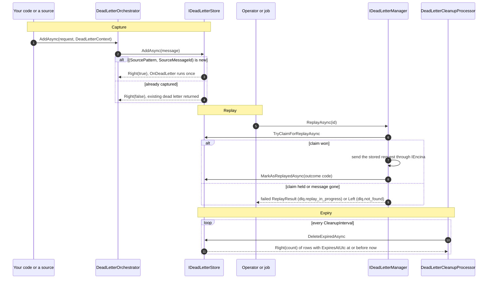

# How to enable the persistent dead letter queue

This guide shows you how to turn on the database-backed dead letter queue (DLQ) on any of the 10 database providers, create its table, and use `IDeadLetterManager` to list, replay, count and clean up the messages that failed for good. It assumes you already use one of the Encina provider packages (ADO.NET, Dapper, EF Core or MongoDB). The pre-1.0 API may still change.

The reasons behind the design (oldest-first order, one dead letter per source message, the tenant column, binary collation) are in [ADR-046](../architecture/adr/046-persistent-dead-letter-queue.md). The members of every type are in the generated API reference (`/api/` on the site).

## What you get



A message is stored in a `DeadLetterMessages` table (a `dead_letter_messages` collection on MongoDB), survives restarts, and expires after `DeadLetterOptions.RetentionPeriod` (default 7 days; `null` disables expiry).

## Before you start

- A provider registration you already call: `AddEncinaADO`, `AddEncinaDapper`, `AddEncinaEntityFrameworkCore<TDbContext>` or `AddEncinaMongoDB`.
- ADO.NET and Dapper stores need a connection that derives from `System.Data.Common.DbConnection` (`SqlConnection`, `NpgsqlConnection`, `MySqlConnection`). Any other `IDbConnection` is rejected with an `ArgumentException`, because the stores never fall back to synchronous calls.
- With the queue on, the built-in sources (recoverability, outbox, inbox, scheduling and sagas) capture their terminal failures on their own; step 1 switches the queue on and "What each source captures" lists what each one stores. You call `DeadLetterOrchestrator` yourself only for your own sources (step 3).

## 1. Switch the queue on

The queue is opt-in. Set `UseDeadLetterQueue` in the same configuration action you already pass to the provider. Registration is first-wins: the store, the factory and `DeadLetterOptions` keep the values of the first call, so a later `AddEncinaDeadLetterQueue` after a provider registered the queue with `UseDeadLetterQueue` does not replace the options. Configure the queue in the first call. The registration adds the store, the message factory, `DeadLetterOrchestrator`, `IDeadLetterManager`, `DeadLetterHealthCheck` and, when `EnableAutomaticCleanup` is `true` and `RetentionPeriod` is set, the `DeadLetterCleanupProcessor` hosted service.

ADO.NET and Dapper (SQL Server shown; PostgreSQL and MySQL use the same call from their own namespace):

```csharp
using Encina.ADO.SqlServer;

services.AddEncinaADO(connectionString, config =>
{
    config.UseDeadLetterQueue = true;
    config.DeadLetterOptions.RetentionPeriod = TimeSpan.FromDays(14);
});
```

With `Encina.Dapper.*`, call `AddEncinaDapper(connectionString, config => { ... })` the same way. On the ADO.NET tenancy path, `AddEncinaADOWithTenancy` (SQL Server), `AddEncinaADOPostgreSQLWithTenancy` and `AddEncinaADOMySQLWithTenancy` also honour `UseDeadLetterQueue`.

EF Core:

```csharp
using Encina.EntityFrameworkCore;

services.AddEncinaEntityFrameworkCore<AppDbContext>(config =>
{
    config.UseDeadLetterQueue = true;
});
```

MongoDB (the options class has the same two members):

```csharp
using Encina.MongoDB;

services.AddEncinaMongoDB(options =>
{
    options.ConnectionString = connectionString;
    options.UseDeadLetterQueue = true;
    options.DeadLetterOptions.RetentionPeriod = TimeSpan.FromDays(14);
});
```

If your application registers its own `IDeadLetterStore` first (or the test fake from `Encina.Testing.Fakes`), that registration is kept: the store and factory use `TryAdd`, and a provider registered first is not replaced by a later call with other types.

## 2. Create the table

Run the script that matches your provider, or apply the EF Core configuration and create a migration.

| Provider family | What to run |
| --- | --- |
| ADO.NET and Dapper, SQL Server | `src/Encina.ADO.SqlServer/Scripts/029_CreateDeadLetterMessagesTable.sql` (the Dapper package has the same file under `src/Encina.Dapper.SqlServer/Scripts/`) |
| ADO.NET and Dapper, PostgreSQL | `029_CreateDeadLetterMessagesTable.sql` in `src/Encina.ADO.PostgreSQL/Scripts/` or `src/Encina.Dapper.PostgreSQL/Scripts/` |
| ADO.NET and Dapper, MySQL | `029_CreateDeadLetterMessagesTable.sql` in `src/Encina.ADO.MySQL/Scripts/` or `src/Encina.Dapper.MySQL/Scripts/` |
| EF Core | `DeadLetterMessageConfiguration` in `OnModelCreating`, then `dotnet ef migrations add AddDeadLetterQueue` |
| MongoDB | nothing: `MongoDbIndexCreator` creates the indexes at startup while `EncinaMongoDbOptions.CreateIndexes` is `true` (the default) |

The scripts, the EF configuration and the MongoDB indexes describe the same table, so switching the provider family does not change the schema. On PostgreSQL the identifiers are quoted PascalCase (`"DeadLetterMessages"`).

### EF Core: pass the collation

`DeadLetterMessageConfiguration` has no parameterless constructor. You must pass the collation of the six filter-key columns (`RequestType`, `ErrorCode`, `CorrelationId`, `SourcePattern`, `SourceMessageId`, `TenantId`). A case-insensitive default would make the unique source key and the filters behave differently from PostgreSQL and MongoDB.

```csharp
using Encina.EntityFrameworkCore.DeadLetter;

protected override void OnModelCreating(ModelBuilder modelBuilder)
{
    // SQL Server
    modelBuilder.ApplyConfiguration(
        new DeadLetterMessageConfiguration(DeadLetterMessageConfiguration.SqlServerBinaryCollation));

    // MySQL
    // modelBuilder.ApplyConfiguration(
    //     new DeadLetterMessageConfiguration(DeadLetterMessageConfiguration.MySqlBinaryCollation));

    // PostgreSQL: a case-sensitive comparison is the default, so pass null explicitly
    // modelBuilder.ApplyConfiguration(new DeadLetterMessageConfiguration(null));
}
```

`SqlServerBinaryCollation` is `Latin1_General_100_BIN2` and `MySqlBinaryCollation` is `utf8mb4_bin`; the 029 scripts use the same collations.

### MongoDB: collection and unique index

The collection name is `EncinaMongoDbOptions.Collections.DeadLetterMessages` (default `dead_letter_messages`). The index creator builds six indexes, among them the unique `UX_DeadLetterMessages_Source` on `SourcePattern` and `SourceMessageId` that makes capture idempotent. There is no TTL index: expired documents are deleted by the same cleanup loop as on the other providers, so `EnableAutomaticCleanup` and the metrics stay accurate.

## 3. Capture a failed message

The built-in sources capture on their own (see "What each source captures" below). To capture from your own source, resolve `DeadLetterOrchestrator` from a scope and pass the failed request with a `DeadLetterContext`. `SourceMessageId` is the idempotency key. Pass it whenever the failed item has a stable id: a retry of the same item then returns the existing dead letter. If you omit it, `DeadLetterOrchestrator` uses the new dead letter's id, so every capture is unique and nothing is deduplicated. Every store (and the fake store) throws `ArgumentException` for an empty key. It must be unique per `SourcePattern` across tenants, because the unique key has no tenant: if two tenants dead-letter the same source id, the second capture returns the first tenant's message. Use a globally unique id such as a GUID or an inbox message id, as the built-in sources do.

```csharp
using Encina.Messaging.DeadLetter;

// orchestrator is a DeadLetterOrchestrator resolved from the current scope
var result = await orchestrator.AddAsync(
    request,
    new DeadLetterContext(
        Error: error,
        Exception: exception,
        SourcePattern: DeadLetterSourcePatterns.Outbox,
        TotalRetryAttempts: 5,
        FirstFailedAtUtc: firstFailedAtUtc,
        CorrelationId: correlationId,
        SourceMessageId: outboxMessage.Id.ToString("D")),
    cancellationToken);
```

The result is `Either<EncinaError, IDeadLetterMessage>`. A repeated capture of the same `(SourcePattern, SourceMessageId)` returns the existing dead letter and does not invoke `DeadLetterOptions.OnDeadLetter`. The tenant is stamped from `IRequestContext.TenantId`, or from `DeadLetterContext.TenantId` when you set it. The record keeps the error code and the exception type, never the error or exception message.

On EF Core the store shares the scoped `DbContext`, so `SaveChangesAsync` also saves anything else tracked in it. When you capture in a failure path, use a new scope.

## 4. List, replay and delete

Use `IDeadLetterManager`:

```csharp
using Encina.Messaging.DeadLetter;

// manager is an IDeadLetterManager resolved from the current scope
// Oldest pending messages from the outbox
var pending = await manager.GetMessagesAsync(
    DeadLetterFilter.FromSource(DeadLetterSourcePatterns.Outbox), skip: 0, take: 50);

// Replay one message, then everything that matches a filter (at most 100 by default)
var one = await manager.ReplayAsync(messageId);
var batch = await manager.ReplayAllAsync(DeadLetterFilter.FromSource(DeadLetterSourcePatterns.Outbox));

// Counts, statistics and cleanup
var count = await manager.GetCountAsync(DeadLetterFilter.All);
var stats = await manager.GetStatisticsAsync();
var removed = await manager.CleanupExpiredAsync();

// Delete one message or every message that matches (DeadLetterFilter.All deletes the whole queue)
await manager.DeleteAsync(messageId);
await manager.DeleteAllAsync(new DeadLetterFilter { ErrorCode = "orders.invalid" });
```

All methods return `Either<EncinaError, T>`. A replay:

1. rejects a message that is already replayed (`dlq.already_replayed`) or expired (`dlq.expired`);
2. claims the message before dispatching (`ReplayClaimedAtUtc`). If another replay holds a claim younger than `DeadLetterOptions.ReplayClaimTimeout` (default 5 minutes), you get a failed `ReplayResult` with `dlq.replay_in_progress`. A claim older than the timeout is treated as abandoned by a crashed host and can be taken over;
3. sends the stored request through `IEncina`, and records an outcome code in `ReplayResult` (the code, never error text) and `ReplayedAtUtc`. After that the message cannot be replayed again.

## Provider coverage

All 10 providers of the database matrix are covered ([AGENTS.md section 5](https://github.com/dlrivada/Encina/blob/main/AGENTS.md)); Oracle and SQLite are outside the matrix (ADR-009, ADR-024).

| Provider | Registration | Store | Schema | Filter-key comparison |
| --- | --- | --- | --- | --- |
| ADO.NET SQL Server | `AddEncinaADO` | `DeadLetterStoreADO` | `029` script | binary (`Latin1_General_100_BIN2`) |
| ADO.NET PostgreSQL | `AddEncinaADO` | `DeadLetterStoreADO` | `029` script | case-sensitive by default |
| ADO.NET MySQL | `AddEncinaADO` | `DeadLetterStoreADO` | `029` script | binary (`utf8mb4_bin`) |
| Dapper SQL Server | `AddEncinaDapper` | `DeadLetterStoreDapper` | `029` script | binary (`Latin1_General_100_BIN2`) |
| Dapper PostgreSQL | `AddEncinaDapper` | `DeadLetterStoreDapper` | `029` script | case-sensitive by default |
| Dapper MySQL | `AddEncinaDapper` | `DeadLetterStoreDapper` | `029` script | binary (`utf8mb4_bin`) |
| EF Core SQL Server | `AddEncinaEntityFrameworkCore<TDbContext>` | `DeadLetterStoreEF` | `DeadLetterMessageConfiguration(SqlServerBinaryCollation)` | binary |
| EF Core PostgreSQL | `AddEncinaEntityFrameworkCore<TDbContext>` | `DeadLetterStoreEF` | `DeadLetterMessageConfiguration(null)` | case-sensitive by default |
| EF Core MySQL | `AddEncinaEntityFrameworkCore<TDbContext>` | `DeadLetterStoreEF` | `DeadLetterMessageConfiguration(MySqlBinaryCollation)` | binary |
| MongoDB | `AddEncinaMongoDB` | `DeadLetterStoreMongoDB` | indexes created at startup | case-sensitive |

## Behavior to know

- **Order.** `GetMessagesAsync` returns the oldest first (`DeadLetteredAtUtc`, then `Id`); `newestFirst: true` reverses it on the store. The `DeadLetteredAtUtc` order is the contract. The `Id` tie-break is stable within one provider only, because providers compare GUIDs in different byte orders.
- **Tenants.** A store returns every tenant unless `DeadLetterFilter.TenantId` names one. `IDeadLetterManager` reads, replays and deletes default to the ambient `IRequestContext.TenantId` when there is one; an explicit `TenantId` on the filter wins over the ambient tenant, and `AllTenants = true` opts out for operator tooling. The cleanup processor and the health check work across the whole deployment. See "Multi-tenancy fails closed" below for what happens when no tenant is resolved.
- **Expiry.** A message is expired when `ExpiresAtUtc <= now`, with "now" taken from `TimeProvider`. The store contract tests this boundary under a non-UTC PostgreSQL session time zone as well.
- **Duplicates.** A repeated capture of the same `(SourcePattern, SourceMessageId)` is not an error. The PostgreSQL ADO.NET and Dapper stores insert with `ON CONFLICT ("SourcePattern", "SourceMessageId") DO NOTHING`, so no server error is raised and the capture is safe inside an open transaction. On MongoDB without the unique index and on an EF Core lost race, a duplicate is not yet reported as `Right(false)`; this is tracked in [#2079](https://github.com/dlrivada/Encina/issues/2079).
- **Errors.** Every store failure comes back as a `Left`; nothing is reported as "not found" or "not deleted" to hide it. `DeadLetterHealthCheck` reports Unhealthy when the store fails.
- **Limits.** `take` is at most `DeadLetterStoreLimits.MaxPageSize`; the other lengths in `DeadLetterStoreLimits` are checked before any I/O.

### What each source captures

The registration also adds `DeadLetterSourceCapture`, which the built-in sources use. Each source has a flag on `DeadLetterOptions`, `true` by default; a flag set to `false` captures nothing from that source. The decisions behind this wiring are in [ADR-046](../architecture/adr/046-persistent-dead-letter-queue.md), "Decisions added with the source capture".

| Flag | Captures when | `SourceMessageId` | `RequestType` and `RequestContent` | A failed capture |
| --- | --- | --- | --- | --- |
| `IntegrateWithRecoverability` | A permanent failure in `RecoverabilityPipelineBehavior` (a permanent error, or immediate retries exhausted with no delayed retry scheduled), or the end of a delayed-retry chain in `DelayedRetryProcessor`. A cancelled request is not captured. | `FailedMessage.Id`, the retry chain id, so one dead letter per chain | The failed request. A delayed-retry row that cannot be re-dispatched keeps its stored type name and content | Logged (EventId 2996 or 2997); the request already returns its failure |
| `IntegrateWithOutbox` | The failed delivery that brings the message to `OutboxOptions.MaxRetries` | The outbox message id | The stored notification type and content, kept as is | Captured before the exhausted state is recorded, so the message stays un-exhausted, is logged (EventId 2961, operation `DeadLetterCapture`) and is delivered again later. A requeued message that is exhausted again keeps one dead letter |
| `IntegrateWithInbox` | The attempt that uses up `InboxOptions.MaxRetries`. Only a thrown exception is an attempt: a handler `Left` is a cached business result and never retries | The inbox message id | The request object (`InboxOrchestrator.ProcessAsync` takes it as its first parameter); the tenant comes from the inbox metadata | Returned as the attempt's `Left`. A rejected redelivery captures again idempotently, which repairs a failed capture |
| `IntegrateWithScheduling` | The failure that the scheduling retry policy dead-letters | The scheduled message id | The stored request type and content | Captured before the state is recorded, so the message stays due for a later cycle |
| `IntegrateWithSagas` | `SagaOrchestrator.FailAsync` ends the saga `Failed` (in `SagaRunner`: a failed compensation, a cancelled run or an unexpected exception). A `Compensated` saga is not captured | The saga id | The saga type name and the saga data | Returned by `FailAsync` after `Failed` was stored |

- Every capture runs in a DI scope of its own, so on EF Core it never saves the source's tracked changes.
- A capture that throws is reported as `dlq.capture_failed` (`DeadLetterErrorCodes.CaptureFailed`).
- An outbox dead letter is replayed by publishing the notification again. Saga data is not a request, so a saga's replay is normally recorded as failed (`dlq.deserialization_failed`) unless the stored saga type name resolves to a request or notification type; the record is kept for inspection.
- Dead letters from outbox and scheduled rows carry no tenant, because those rows have none yet (#737, #739); a saga's context sets none either, so the tenant is the ambient one, if any. Under `AddEncinaTenancy` a dead letter without a tenant is seen only by an operator using `DeadLetterFilter.AllTenants`.
- The "saga not found" path (`SagaNotFoundContext.MoveToDeadLetterAsync`) is not wired yet: it waits for a maintainer decision on the identity of a not-found message.

### Multi-tenancy fails closed

When `AddEncinaTenancy` is registered (it registers the `TenancyInUse` marker) and no tenant is resolved, `DeadLetterManager` denies the operation instead of working across the whole queue. An empty `TenantId` counts as no tenant.

| Operation | With tenancy in use and no tenant resolved |
| --- | --- |
| `GetMessagesAsync`, `GetCountAsync`, `ReplayAllAsync`, `DeleteAllAsync` | Denied, unless the filter sets `AllTenants = true` or names a `TenantId` |
| `ReplayAsync`, `GetMessageAsync`, `DeleteAsync` (by message id), `GetStatisticsAsync` | Denied: there is no filter to opt out with |
| `CleanupExpiredAsync` | Not gated: it is retention maintenance across the deployment |

A denial returns the error code `encina.authorization.dlq_tenant_required` (`DeadLetterErrorCodes.TenantRequired`). It is an `encina.authorization.*` code, which `Encina.AspNetCore` maps to HTTP 403. Whether the by-id operations and the statistics should get an opt-out is an open question tracked in [#2080](https://github.com/dlrivada/Encina/issues/2080).

Every use of `AllTenants` while tenancy is in use is logged as a warning (EventId 2993), and every denial is logged (EventId 2994); neither records the tenant id (2993 carries the operation; 2994 carries the operation and the error code). Without `AddEncinaTenancy` nothing changes: no ambient tenant means the whole queue.

### Input rules

The orchestrator and the manager enforce these before any store call, so all 10 providers behave the same. A violation throws `ArgumentException`.

- Instants must have `DateTimeKind.Utc`: `DeadLetterContext.FirstFailedAtUtc`, `FailedMessage.FirstAttemptAtUtc` and the filter instants `DeadLetteredAfterUtc`, `DeadLetteredBeforeUtc` and `ExpiresAtOrBeforeUtc`. `Local` and `Unspecified` are rejected, not converted: an `Unspecified` value has no defined instant, so converting it would guess the server's time zone.
- `SourceMessageId`, `SourcePattern`, `RequestType` and `TenantId` (in the context, in the filter, and the ambient tenant id) must not start or end with white space. SQL Server and MySQL ignore trailing spaces when they compare strings; PostgreSQL and MongoDB do not.
- Every store returns instants with `DateTimeKind.Utc` (the EF Core mapping has a UTC value converter).

### Replay of a batch

`ReplayAllAsync` handles failures by kind:

| Situation | Result |
| --- | --- |
| A store returns a `Left` for one message | The whole operation fails with that error. Messages already replayed stay recorded; the abort is logged (EventId 2995) |
| The store throws | The exception propagates |
| Already replayed, expired, payload cannot be deserialized, handler failure, claim held by another replay | A failed `ReplayResult` for that message; the batch continues |
| The handler throws `OperationCanceledException` | A failed replay of that message |
| The caller's `CancellationToken` is cancelled (also between messages) | The cancellation propagates |

## Testing

`AddFakeDeadLetterStore` (`Encina.Testing.Fakes`) uses the `TimeProvider` registered in the container, so a `FakeTimeProvider` drives claim expiry and retention; without one it uses `TimeProvider.System`. The SQL Server `029` schema script is covered by an integration test, like the PostgreSQL and MySQL ones.

## Telemetry

With `Encina.OpenTelemetry` registered, the store is decorated with spans from the activity source `Encina.Messaging.DeadLetter` (`encina.dlq.add`, `encina.dlq.query`, `encina.dlq.count`, `encina.dlq.replay_claim` and the delete operations). `Encina.Messaging` itself emits, on the `Encina` meter, the counters `encina.dlq.messages_added_total`, `encina.dlq.duplicates_ignored_total`, `encina.dlq.messages_replayed_total`, `encina.dlq.messages_deleted_total` and `encina.dlq.store_failures_total`. Their dimensions are the source pattern, an outcome, a reason, an operation name and an error code. Telemetry never carries the tenant id, the request payload or the text of an error or exception, and logs record only error codes and exception types.

## See also

- [ADR-046: Persistent dead letter queue](../architecture/adr/046-persistent-dead-letter-queue.md) (why the contract looks like this)
- [ADR-029: Recoverability error classification](../architecture/adr/029-recoverability-error-classification.md) (which failures reach the queue)
- The README of your provider package, for the short version of steps 1 and 2: [Encina.Messaging](https://github.com/dlrivada/Encina/blob/main/src/Encina.Messaging/README.md), [Encina.EntityFrameworkCore](https://github.com/dlrivada/Encina/blob/main/src/Encina.EntityFrameworkCore/README.md), [Encina.MongoDB](https://github.com/dlrivada/Encina/blob/main/src/Encina.MongoDB/README.md)
