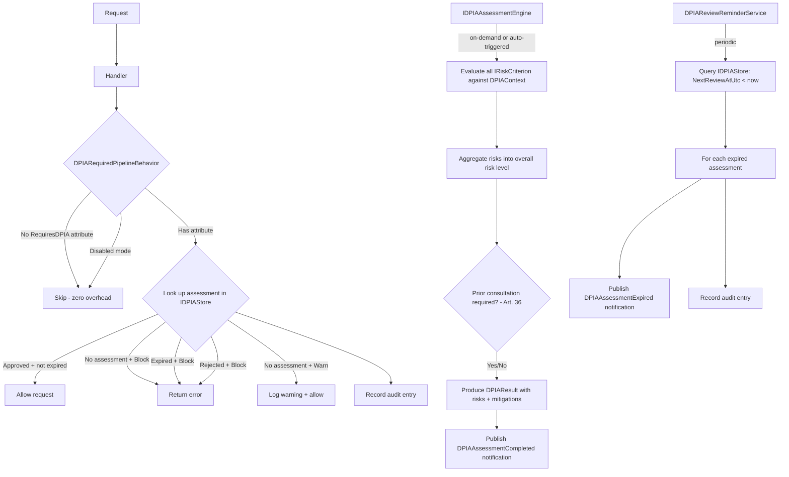
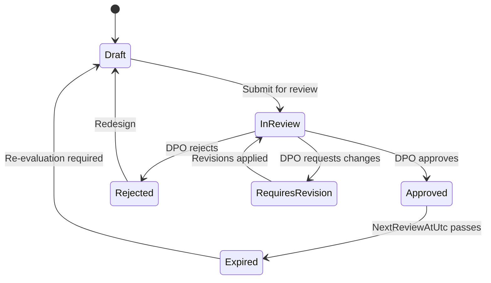

# Data Protection Impact Assessment (DPIA) in Encina

This guide explains how to manage GDPR Articles 35-36 Data Protection Impact Assessments -- pipeline-level DPIA enforcement, risk evaluation through pluggable criteria, DPO consultation workflows, periodic review monitoring, and audit trails using the `Encina.Compliance.DPIA` package. DPIA enforcement operates at the CQRS pipeline level, ensuring consistent compliance across all entry points.

## Table of Contents

1. [Overview](#overview)
2. [The Problem](#the-problem)
3. [The Solution](#the-solution)
4. [Quick Start](#quick-start)
5. [RequiresDPIA Attribute](#requiresdpia-attribute)
6. [Assessment Lifecycle](#assessment-lifecycle)
7. [Assessment Engine](#assessment-engine)
8. [Built-In Risk Criteria](#built-in-risk-criteria)
9. [Custom Risk Criteria](#custom-risk-criteria)
10. [DPO Consultation](#dpo-consultation)
11. [Templates](#templates)
12. [Expiration Monitoring](#expiration-monitoring)
13. [Auto-Registration](#auto-registration)
14. [Audit Trail](#audit-trail)
15. [Domain Notifications](#domain-notifications)
16. [Configuration Options](#configuration-options)
17. [Enforcement Modes](#enforcement-modes)
18. [Database Providers](#database-providers)
19. [Observability](#observability)
20. [Health Check](#health-check)
21. [Error Handling](#error-handling)
22. [Best Practices](#best-practices)
23. [Testing](#testing)
24. [FAQ](#faq)

---

## Overview

Encina.Compliance.DPIA provides attribute-based DPIA enforcement and assessment management at the CQRS pipeline level:

| Component | Description |
|-----------|-------------|
| **`[RequiresDPIA]` Attribute** | Marks request types that require an approved DPIA before execution |
| **`DPIARequiredPipelineBehavior`** | Pipeline behavior that verifies a current, approved assessment exists |
| **`IDPIAAssessmentEngine`** | Orchestrates risk evaluation through `IRiskCriterion` implementations and DPO consultation |
| **`IDPIAStore`** | Assessment persistence (full lifecycle tracking per assessment) |
| **`IDPIAAuditStore`** | Immutable audit trail for all assessment operations |
| **`IDPIATemplateProvider`** | Structured assessment templates per Article 35(7) requirements |
| **`DPIAReviewReminderService`** | `BackgroundService` for periodic review expiration detection |
| **`DPIAOptions`** | Configuration for enforcement mode, review periods, DPO details, and monitoring |

### Why Pipeline-Level DPIA Enforcement?

| Benefit | Description |
|---------|-------------|
| **Automatic enforcement** | Assessments are verified whenever a `[RequiresDPIA]`-decorated request passes through the pipeline |
| **Declarative** | DPIA requirements live with the request types, not scattered across services |
| **Transport-agnostic** | Same enforcement for HTTP, message queue, gRPC, and serverless |
| **Pluggable criteria** | Add custom risk criteria via `IRiskCriterion` or use the six built-in criteria |
| **Periodic review** | Automatic expiration detection and notification per Article 35(11) |
| **Auditable** | Every assessment action is recorded with timestamps, actors, and compliance metadata |

---

## The Problem

GDPR Articles 35 and 36 impose structured impact assessment requirements on data controllers:

- **No systematic tracking** of which processing operations require a DPIA (Art. 35(1))
- **No automated risk evaluation** against the nine EDPB high-risk criteria (WP 248 rev.01)
- **No DPO consultation workflow** to satisfy the mandatory advisory requirement (Art. 35(2))
- **No periodic review infrastructure** to detect expired assessments (Art. 35(11))
- **No audit trail** to demonstrate assessment compliance under the accountability principle (Art. 5(2))
- **No prior consultation tracking** for high residual risk scenarios (Art. 36(1))
- **Manual assessment processes** that are error-prone, inconsistent, and difficult to audit

---

## The Solution

Encina solves this with a unified DPIA enforcement and assessment pipeline:



---

## Quick Start

### 1. Install the Package

```bash
dotnet add package Encina.Compliance.DPIA
```

### 2. Decorate Request Types with DPIA Requirements

```csharp
// Basic usage -- DPIA required before this command can execute
[RequiresDPIA]
public sealed record ProcessBiometricDataCommand(string SubjectId)
    : ICommand<Either<EncinaError, Unit>>;

// With explicit processing type and reason
[RequiresDPIA(
    ProcessingType = "AutomatedDecisionMaking",
    Reason = "Credit scoring uses automated profiling with legal effects per Article 22")]
public sealed record CreditScoringCommand(string CustomerId)
    : ICommand<Either<EncinaError, CreditScore>>;
```

### 3. Register Services

```csharp
services.AddEncina(config =>
    config.RegisterServicesFromAssemblyContaining<Program>());

services.AddEncinaDPIA(options =>
{
    options.EnforcementMode = DPIAEnforcementMode.Warn;
    options.DefaultReviewPeriod = TimeSpan.FromDays(365);
    options.DPOEmail = "dpo@company.com";
    options.DPOName = "Jane Doe";
    options.AddHealthCheck = true;
    options.EnableExpirationMonitoring = true;
    options.AssembliesToScan.Add(typeof(Program).Assembly);
});
```

### 4. Conduct an Assessment

```csharp
var engine = serviceProvider.GetRequiredService<IDPIAAssessmentEngine>();

// Build the assessment context
var context = new DPIAContext
{
    RequestType = typeof(ProcessBiometricDataCommand),
    DataCategories = ["BiometricData", "IdentificationData"],
    HighRiskTriggers = [HighRiskTriggers.BiometricData, HighRiskTriggers.LargeScaleProcessing]
};

// Perform risk evaluation
var result = await engine.AssessAsync(context);

result.Match(
    Right: dpiaResult =>
    {
        Console.WriteLine($"Overall risk: {dpiaResult.OverallRisk}");
        Console.WriteLine($"Risks found: {dpiaResult.IdentifiedRisks.Count}");
        Console.WriteLine($"Prior consultation required: {dpiaResult.RequiresPriorConsultation}");
    },
    Left: error => Console.WriteLine($"Assessment failed: {error.Code}"));
```

---

## RequiresDPIA Attribute

The `[RequiresDPIA]` attribute marks request types that require an approved DPIA before execution:

```csharp
// Minimal -- processing type inferred from context
[RequiresDPIA]
public sealed record AnalyzeBehaviorCommand : ICommand<Either<EncinaError, Unit>>;

// With processing type for template matching
[RequiresDPIA(ProcessingType = "SystematicProfiling")]
public sealed record ProfileUserCommand(string UserId)
    : ICommand<Either<EncinaError, ProfileResult>>;

// Disable periodic review for stable processing
[RequiresDPIA(ReviewRequired = false)]
public sealed record AggregateAnalyticsQuery : IQuery<Either<EncinaError, Report>>;
```

| Property | Type | Default | Description |
|----------|------|---------|-------------|
| `ProcessingType` | `string?` | `null` | Matches against `DPIATemplate.ProcessingType` for structured assessments |
| `Reason` | `string?` | `null` | Justification for the DPIA requirement; used in audit trail entries |
| `ReviewRequired` | `bool` | `true` | Whether the assessment must be periodically reviewed per Art. 35(11) |

---

## Assessment Lifecycle

Each assessment progresses through a defined lifecycle tracked by `DPIAAssessmentStatus`:



| Status | Description |
|--------|-------------|
| `Draft` | Assessment is being prepared; not yet submitted for review |
| `InReview` | Submitted for DPO or stakeholder review per Article 35(2) |
| `Approved` | Processing may proceed; valid until `NextReviewAtUtc` |
| `Rejected` | Processing must not proceed; redesign required |
| `RequiresRevision` | DPO identified gaps; revisions needed before approval |
| `Expired` | Review date has passed per Article 35(11); re-evaluation required |

An assessment is considered "current" (allowing processing to proceed) when its status is `Approved` AND its `NextReviewAtUtc` has not passed.

---

## Assessment Engine

The `IDPIAAssessmentEngine` orchestrates the full assessment process:

```csharp
public interface IDPIAAssessmentEngine
{
    ValueTask<Either<EncinaError, DPIAResult>> AssessAsync(
        DPIAContext context, CancellationToken cancellationToken = default);

    ValueTask<Either<EncinaError, bool>> RequiresDPIAAsync(
        Type requestType, CancellationToken cancellationToken = default);

    ValueTask<Either<EncinaError, DPOConsultation>> RequestDPOConsultationAsync(
        Guid assessmentId, CancellationToken cancellationToken = default);
}
```

The `DefaultDPIAAssessmentEngine` implementation:

1. Evaluates all registered `IRiskCriterion` implementations against the `DPIAContext`.
2. Aggregates identified risks into an overall `RiskLevel`.
3. Determines if prior consultation with the supervisory authority is required (Article 36(1)).
4. Produces a `DPIAResult` containing identified risks, proposed mitigations, and the overall assessment.

---

## Built-In Risk Criteria

Six risk criteria are registered by default, aligned with the EDPB WP 248 rev.01 guidance:

| Criterion | GDPR Reference | Evaluates |
|-----------|----------------|-----------|
| `SystematicProfilingCriterion` | Art. 35(3)(a) | Systematic evaluation of personal aspects based on automated processing |
| `SpecialCategoryDataCriterion` | Art. 9 / Art. 10 | Processing of special category data or criminal conviction data |
| `SystematicMonitoringCriterion` | Art. 35(3)(c) | Systematic monitoring of publicly accessible areas |
| `AutomatedDecisionMakingCriterion` | Art. 22 | Automated decisions with legal or similarly significant effects |
| `LargeScaleProcessingCriterion` | Art. 35(3)(b) | Processing of personal data on a large scale |
| `VulnerableSubjectsCriterion` | Recital 75 / WP 248 | Processing data of vulnerable subjects (children, employees, patients) |

All built-in criteria are registered via `TryAddEnumerable`, so custom implementations supplement rather than replace them. Each criterion returns a `RiskItem` when triggered or `null` when not applicable.

---

## Custom Risk Criteria

Implement `IRiskCriterion` for organization-specific risk factors:

```csharp
public sealed class CrossBorderTransferCriterion : IRiskCriterion
{
    public string Name => "CrossBorderTransfer";

    public ValueTask<RiskItem?> EvaluateAsync(
        DPIAContext context,
        CancellationToken cancellationToken = default)
    {
        var hasCrossBorder = context.HighRiskTriggers
            .Contains(HighRiskTriggers.CrossBorderTransfer);

        if (!hasCrossBorder)
            return ValueTask.FromResult<RiskItem?>(null);

        return ValueTask.FromResult<RiskItem?>(new RiskItem(
            Category: "International Transfer",
            Level: RiskLevel.High,
            Description: "Data transferred outside the EEA without adequacy decision.",
            MitigationSuggestion: "Implement Standard Contractual Clauses (SCCs) "
                + "and conduct a Transfer Impact Assessment."));
    }
}

// Register alongside built-in criteria
services.AddSingleton<IRiskCriterion, CrossBorderTransferCriterion>();
services.AddSingleton<IRiskCriterion, NovelTechnologyCriterion>();
services.AddEncinaDPIA(options => { /* ... */ });
```

---

## DPO Consultation

Per Article 35(2), the controller must seek the DPO's advice when carrying out a DPIA. The engine provides a structured consultation workflow:

```csharp
var engine = serviceProvider.GetRequiredService<IDPIAAssessmentEngine>();

// Initiate consultation (publishes DPOConsultationRequested notification)
var consultationResult = await engine.RequestDPOConsultationAsync(assessmentId);

consultationResult.Match(
    Right: consultation =>
    {
        Console.WriteLine($"Consultation {consultation.Id} requested");
        Console.WriteLine($"DPO: {consultation.DPOName} ({consultation.DPOEmail})");
        Console.WriteLine($"Decision: {consultation.Decision}"); // Pending
    },
    Left: error => Console.WriteLine($"Failed: {error.Code}"));
```

### DPO Consultation Decisions

| Decision | Description | Effect on Assessment |
|----------|-------------|---------------------|
| `Pending` | DPO has not yet responded | Assessment remains `InReview` |
| `Approved` | DPO approves the assessment | Assessment transitions to `Approved` |
| `Rejected` | DPO rejects the assessment | Assessment transitions to `Rejected` |
| `ConditionallyApproved` | DPO approves with conditions | Assessment transitions to `RequiresRevision` until conditions met |

The `DPOConsultation` record captures the full consultation lifecycle:

```csharp
public sealed record DPOConsultation
{
    public required Guid Id { get; init; }
    public required string DPOName { get; init; }
    public required string DPOEmail { get; init; }
    public required DateTimeOffset RequestedAtUtc { get; init; }
    public DateTimeOffset? RespondedAtUtc { get; init; }
    public required DPOConsultationDecision Decision { get; init; }
    public string? Conditions { get; init; }  // For ConditionallyApproved
    public string? Comments { get; init; }
}
```

---

## Templates

Templates provide structured assessment frameworks per Article 35(7) requirements. The `IDPIATemplateProvider` supplies pre-configured templates matched by processing type:

```csharp
var templateProvider = serviceProvider.GetRequiredService<IDPIATemplateProvider>();

// Get a template for automated decision-making assessments
var result = await templateProvider.GetTemplateAsync("AutomatedDecisionMaking");

result.Match(
    Right: template =>
    {
        Console.WriteLine($"Template: {template.Name}");
        Console.WriteLine($"Sections: {template.Sections.Count}");
        // Sections cover Art. 35(7)(a)-(d) requirements
    },
    Left: error => Console.WriteLine($"No template found: {error.Code}"));

// List all available templates
var allTemplates = await templateProvider.GetAllTemplatesAsync();
```

Templates are optional. When no matching template exists, the assessment engine proceeds with criteria-based evaluation without template guidance. The `DefaultDPIATemplateProvider` includes templates for common processing types. Implement `IDPIATemplateProvider` for custom template sources (database, configuration files, external APIs).

---

## Expiration Monitoring

The `DPIAReviewReminderService` runs periodic checks for expired assessments and publishes `DPIAAssessmentExpired` notifications:

```csharp
services.AddEncinaDPIA(options =>
{
    options.EnableExpirationMonitoring = true;
    options.ExpirationCheckInterval = TimeSpan.FromHours(1);
    options.DefaultReviewPeriod = TimeSpan.FromDays(365);
});
```

Subscribe to expiration notifications:

```csharp
public sealed class ExpirationAlertHandler
    : INotificationHandler<DPIAAssessmentExpired>
{
    public Task Handle(DPIAAssessmentExpired notification, CancellationToken ct)
    {
        // Alert compliance team, create re-assessment task, etc.
        return Task.CompletedTask;
    }
}
```

The service queries `IDPIAStore.GetExpiredAssessmentsAsync` on each cycle, compares `NextReviewAtUtc` against the current time, and transitions expired assessments to `DPIAAssessmentStatus.Expired`.

---

## Auto-Registration

When enabled, a hosted service scans assemblies at startup and creates draft assessments for request types decorated with `[RequiresDPIA]`:

```csharp
services.AddEncinaDPIA(options =>
{
    options.AutoRegisterFromAttributes = true;
    options.AutoDetectHighRisk = true; // Heuristic detection supplement
    options.AssembliesToScan.Add(typeof(Program).Assembly);
});
```

| Option | Default | Description |
|--------|---------|-------------|
| `AutoRegisterFromAttributes` | `false` | Scan for `[RequiresDPIA]` attributes and create draft assessments |
| `AutoDetectHighRisk` | `false` | Apply heuristic analysis based on naming patterns (biometric, health, profiling) |
| `AssembliesToScan` | `[]` | Assemblies to scan; falls back to entry assembly if empty |

Auto-registration creates assessments in `Draft` status. They must still be evaluated, reviewed, and approved before processing is allowed in `Block` enforcement mode.

---

## Audit Trail

Every assessment operation is recorded in an immutable audit trail for Article 5(2) compliance:

```csharp
var auditStore = serviceProvider.GetRequiredService<IDPIAAuditStore>();

// Retrieve the full audit trail for an assessment
var trail = await auditStore.GetAuditTrailAsync(assessmentId);

trail.Match(
    Right: entries =>
    {
        foreach (var entry in entries)
        {
            Console.WriteLine($"[{entry.OccurredAtUtc:O}] {entry.Action} by {entry.PerformedBy}");
            Console.WriteLine($"  {entry.Details}");
        }
    },
    Left: error => Console.WriteLine($"Failed: {error.Code}"));
```

Typical audit actions: `Created`, `RiskEvaluated`, `SubmittedForReview`, `DPOConsultationRequested`, `DPOApproved`, `DPORejected`, `Approved`, `Rejected`, `RequiresRevision`, `Expired`, `Deleted`.

Each `DPIAAuditEntry` includes `TenantId` and `ModuleId` for multi-tenancy and modular monolith support.

---

## Domain Notifications

The DPIA module publishes domain notifications at key lifecycle points:

| Notification | Trigger | Key Properties |
|-------------|---------|----------------|
| `DPIAAssessmentCompleted` | Risk evaluation completed | AssessmentId, RequestTypeName, OverallRisk, RequiresPriorConsultation |
| `DPIAAssessmentExpired` | Review date passed | AssessmentId, RequestTypeName, ExpiredAtUtc |
| `DPOConsultationRequested` | DPO consultation initiated | AssessmentId, ConsultationId, DPOEmail |

Notifications can be disabled via `options.PublishNotifications = false`.

---

## Configuration Options

```csharp
services.AddEncinaDPIA(options =>
{
    // Pipeline enforcement mode
    options.EnforcementMode = DPIAEnforcementMode.Warn;

    // Convenience alias: options.BlockWithoutDPIA = true;
    // Equivalent to: options.EnforcementMode = DPIAEnforcementMode.Block;

    // Review period for approved assessments (Art. 35(11))
    options.DefaultReviewPeriod = TimeSpan.FromDays(365);

    // DPO details (Art. 35(2))
    options.DPOEmail = "dpo@company.com";
    options.DPOName = "Jane Doe";

    // Notifications and audit
    options.PublishNotifications = true;
    options.TrackAuditTrail = true;

    // Expiration monitoring
    options.EnableExpirationMonitoring = true;
    options.ExpirationCheckInterval = TimeSpan.FromHours(1);

    // Auto-registration
    options.AutoRegisterFromAttributes = true;
    options.AutoDetectHighRisk = true;
    options.AssembliesToScan.Add(typeof(Program).Assembly);

    // Health check
    options.AddHealthCheck = true;
});
```

---

## Enforcement Modes

| Mode | Pipeline Behavior | Use Case |
|------|-------------------|----------|
| `Block` | Returns error when no current assessment exists | Production (GDPR Article 35 compliant) |
| `Warn` | Logs warning, allows request through | Migration/testing phase (default) |
| `Disabled` | Skips all DPIA enforcement entirely (no-op) | Development environments |

The pipeline behavior checks the following conditions when enforcement is active:

| Condition | Block Mode | Warn Mode |
|-----------|------------|-----------|
| No assessment exists | Returns `dpia.assessment_required` error | Logs warning, allows request |
| Assessment is `Expired` | Returns `dpia.assessment_expired` error | Logs warning, allows request |
| Assessment is `Rejected` | Returns `dpia.assessment_rejected` error | Logs warning, allows request |
| Assessment is `Approved` and current | Allows request | Allows request |

---

## Database Providers

The in-memory stores (`InMemoryDPIAStore`, `InMemoryDPIAAuditStore`) are suitable for development and testing. For production, use a database-backed provider:

| Provider Category | Providers | Registration |
|-------------------|-----------|-------------|
| ADO.NET | SQL Server, PostgreSQL, MySQL | `config.UseDPIA = true` in `AddEncinaADO()` |
| Dapper | SQL Server, PostgreSQL, MySQL | `config.UseDPIA = true` in `AddEncinaDapper()` |
| EF Core | SQL Server, PostgreSQL, MySQL | `config.UseDPIA = true` in `AddEncinaEntityFrameworkCore()` |
| MongoDB | MongoDB | `config.UseDPIA = true` in `AddEncinaMongoDB()` |

Each provider registers `IDPIAStore` and `IDPIAAuditStore` backed by the corresponding database. Register the provider-specific package before calling `AddEncinaDPIA()` -- all registrations use `TryAdd`, so provider implementations take precedence over the in-memory defaults.

---

## Observability

### OpenTelemetry Tracing

The module creates activities with the `Encina.Compliance.DPIA` ActivitySource:

| Activity | Tags |
|----------|------|
| `DPIA.PipelineCheck` | `dpia.request_type`, `dpia.outcome`, `dpia.enforcement_mode` |
| `DPIA.Assessment` | `dpia.request_type`, `dpia.risk_level`, `dpia.outcome` |
| `DPIA.DPOConsultation` | `dpia.assessment_id`, `dpia.outcome` |
| `DPIA.ReviewReminderCycle` | `dpia.outcome` |
| `DPIA.Endpoint` | `dpia.endpoint`, `dpia.status_code`, `dpia.outcome` |

### Metrics

| Metric | Type | Description |
|--------|------|-------------|
| `dpia.pipeline.checks.total` | Counter | Total DPIA pipeline compliance checks |
| `dpia.pipeline.checks.passed` | Counter | Pipeline checks that passed (assessment current) |
| `dpia.pipeline.checks.failed` | Counter | Pipeline checks that failed (no/expired/rejected assessment) |
| `dpia.pipeline.checks.skipped` | Counter | Requests skipped (no `[RequiresDPIA]` attribute) |
| `dpia.assessment.total` | Counter | Total risk assessments executed by the engine |
| `dpia.dpo_consultation.total` | Counter | DPO consultations requested |
| `dpia.auto_registration.total` | Counter | Draft assessments auto-registered at startup |
| `dpia.review_reminder.cycles.total` | Counter | Review reminder cycles executed |
| `dpia.review_reminder.expired.total` | Counter | Expired assessments detected by the reminder |
| `dpia.endpoint.requests.total` | Counter | ASP.NET Core DPIA endpoint requests |
| `dpia.pipeline.check.duration` | Histogram (ms) | DPIA pipeline check duration |
| `dpia.assessment.duration` | Histogram (ms) | Risk assessment execution duration |
| `dpia.endpoint.duration` | Histogram (ms) | ASP.NET Core endpoint response duration |

### Structured Logging

Log events use `[LoggerMessage]` source-generated methods for zero-allocation structured logging. All log messages include `dpia.request_type`, `dpia.assessment_id`, and `dpia.outcome` as structured properties.

---

## Health Check

Opt-in via `options.AddHealthCheck = true`:

```csharp
services.AddEncinaDPIA(options =>
{
    options.AddHealthCheck = true;
});
```

The health check (`encina-dpia`) verifies:

- `DPIAOptions` are configured and valid
- `IDPIAStore` is resolvable from DI
- `IDPIAAuditStore` is resolvable when `TrackAuditTrail` is enabled
- `IDPIAAssessmentEngine` is resolvable from DI
- `IDPIATemplateProvider` is resolvable from DI

Tags: `encina`, `gdpr`, `dpia`, `compliance`, `ready`.

---

## Error Handling

All operations return `Either<EncinaError, T>`:

```csharp
var result = await engine.AssessAsync(context);

result.Match(
    Right: dpiaResult =>
    {
        logger.LogInformation(
            "Assessment completed: {OverallRisk}, consultation required: {Required}",
            dpiaResult.OverallRisk,
            dpiaResult.RequiresPriorConsultation);
    },
    Left: error =>
    {
        logger.LogError(
            "Assessment failed: {Code} - {Message}",
            error.Code,
            error.Message);
    }
);
```

### Error Codes

| Code | Description |
|------|-------------|
| `dpia.assessment_required` | DPIA assessment is required but none exists for the request type |
| `dpia.assessment_expired` | Assessment has passed its review date and needs re-evaluation |
| `dpia.assessment_rejected` | Assessment was rejected by the DPO or review process |
| `dpia.prior_consultation_required` | Residual risk remains high; supervisory authority consultation needed (Art. 36) |
| `dpia.dpo_consultation_required` | DPO consultation has not been completed (Art. 35(2)) |
| `dpia.risk_too_high` | Assessed risk level exceeds acceptable threshold |
| `dpia.store_error` | Store persistence operation failed |
| `dpia.template_not_found` | No template found for the specified processing type |

---

## Best Practices

1. **Start with `Warn` mode, switch to `Block` when ready** -- `Warn` mode lets you observe enforcement behavior without blocking requests; switch to `Block` once assessments are in place for all decorated request types.

2. **Configure `DPOEmail` and `DPOName` for production** -- set the DPO details before going live; the options validator warns if missing when DPO consultation features are used.

3. **Enable expiration monitoring** -- set `EnableExpirationMonitoring = true` and subscribe to `DPIAAssessmentExpired` notifications to ensure periodic reviews are not missed per Article 35(11).

4. **Use auto-registration for discovery** -- enable `AutoRegisterFromAttributes` during development to discover which request types require assessments. Combine with `AutoDetectHighRisk` for heuristic detection of high-risk processing that may lack `[RequiresDPIA]` attributes.

5. **Track the audit trail** -- keep `TrackAuditTrail = true` in production for Article 5(2) accountability evidence. The audit trail provides the chronological record needed for regulatory audits.

6. **Use templates for consistency** -- define `DPIATemplate` instances for common processing types to ensure assessments cover all Article 35(7) requirements systematically.

7. **Register database-backed stores for production** -- in-memory stores do not survive restarts. Use a provider package (EF Core, Dapper, ADO.NET, or MongoDB) for durable persistence.

8. **Implement custom `IRiskCriterion` for domain-specific risks** -- the six built-in criteria cover common GDPR scenarios; add organization-specific criteria for industry regulations or internal policies.

9. **Use `TimeProvider` for testable time-based logic** -- the review reminder service and assessment engine accept `TimeProvider` for deterministic testing of expiration and review period behavior.

10. **Monitor the `dpia.pipeline.checks.failed` counter** -- a rising count indicates processing operations are being attempted without current assessments, which may signal compliance gaps.

---

## Testing

### Unit Tests with In-Memory Stores

```csharp
var store = new InMemoryDPIAStore(
    TimeProvider.System,
    NullLogger<InMemoryDPIAStore>.Instance);

var assessment = new DPIAAssessment
{
    Id = Guid.NewGuid(),
    RequestTypeName = typeof(ProcessBiometricDataCommand).FullName!,
    Status = DPIAAssessmentStatus.Approved,
    CreatedAtUtc = DateTimeOffset.UtcNow,
    ApprovedAtUtc = DateTimeOffset.UtcNow,
    NextReviewAtUtc = DateTimeOffset.UtcNow.AddDays(365)
};

await store.SaveAssessmentAsync(assessment);

var result = await store.GetAssessmentByIdAsync(assessment.Id);
result.IsRight.Should().BeTrue();
```

### Full Pipeline Test

```csharp
var services = new ServiceCollection();
services.AddEncina(c => c.RegisterServicesFromAssemblyContaining<TestCommand>());
services.AddEncinaDPIA(o =>
{
    o.EnforcementMode = DPIAEnforcementMode.Block;
    o.EnableExpirationMonitoring = false;
});

var provider = services.BuildServiceProvider();
using var scope = provider.CreateScope();

var encina = scope.ServiceProvider.GetRequiredService<IEncina>();

// Without an approved assessment, the request should be blocked
var result = await encina.Send(new ProcessBiometricDataCommand("subject-1"));
result.IsLeft.Should().BeTrue();
result.Match(
    Right: _ => { },
    Left: error => error.Code.Should().Be("dpia.assessment_required"));
```

### Testing Risk Criteria

```csharp
var criterion = new SystematicProfilingCriterion();
var context = new DPIAContext
{
    RequestType = typeof(ProfileUserCommand),
    DataCategories = ["BehavioralData"],
    HighRiskTriggers = [HighRiskTriggers.SystematicProfiling]
};

var riskItem = await criterion.EvaluateAsync(context);

riskItem.Should().NotBeNull();
riskItem!.Level.Should().Be(RiskLevel.High);
riskItem.Category.Should().NotBeNullOrEmpty();
```

---

## FAQ

**Q: How does the pipeline behavior decide which requests to enforce?**
The `DPIARequiredPipelineBehavior` checks for `[RequiresDPIA]` attributes on the request type. Attribute presence is cached statically per closed generic type, so there is zero reflection overhead after the first resolution.

**Q: What happens if no `[RequiresDPIA]` attribute is present on the request?**
The pipeline behavior skips all DPIA enforcement with zero overhead. The `dpia.pipeline.checks.skipped` counter is incremented for observability.

**Q: How are risk criteria evaluated?**
The `DefaultDPIAAssessmentEngine` evaluates all registered `IRiskCriterion` implementations against the `DPIAContext`. Each criterion returns a `RiskItem` if triggered or `null` if not applicable. All triggered risks are aggregated into a `DPIAResult` with an overall `RiskLevel`.

**Q: Can I register custom implementations before calling `AddEncinaDPIA`?**
Yes. All service registrations use `TryAdd`, so existing registrations are preserved. Register your custom `IDPIAStore`, `IDPIAAuditStore`, `IDPIATemplateProvider`, or `IDPIAAssessmentEngine` before calling `AddEncinaDPIA()`.

**Q: What is the relationship between `DPIAResult.OverallRisk` and prior consultation?**
When the overall risk is `VeryHigh` or residual risk after mitigations remains `High`, `RequiresPriorConsultation` is set to `true`. Per Article 36(1), the controller must then consult the supervisory authority before proceeding with processing.

**Q: How does the review period work?**
When an assessment is approved, `NextReviewAtUtc` is set to the current time plus `DPIAOptions.DefaultReviewPeriod` (default 365 days). The `DPIAReviewReminderService` periodically checks for assessments past their review date and publishes `DPIAAssessmentExpired` notifications.

**Q: Can I use the module without the expiration monitoring service?**
Yes. Set `EnableExpirationMonitoring = false` (default). The pipeline behavior still checks `NextReviewAtUtc` on each request, but no background service actively scans for expired assessments.

**Q: What is the difference between `RequiresDPIAAsync` and the pipeline behavior?**
`RequiresDPIAAsync` is a programmatic check that evaluates whether a request type needs a DPIA based on attributes and configuration. The pipeline behavior uses the `IDPIAStore` to verify that a current, approved assessment exists. The former is for discovery; the latter is for enforcement.

**Q: How does multi-tenancy work with DPIA?**
`DPIAAssessment` includes a `TenantId` field. When multi-tenancy is enabled, assessments are scoped per tenant. The pipeline behavior populates the tenant from the request context. This is a soft dependency -- DPIA works identically with or without multi-tenancy.

**Q: What GDPR articles does this module address?**
Article 35(1) (obligation to conduct DPIA), Article 35(2) (DPO consultation), Article 35(3) (mandatory DPIA scenarios), Article 35(7) (assessment content requirements), Article 35(9) (data subject views), Article 35(11) (periodic review), Article 36 (prior consultation), and Article 5(2) (accountability principle for audit trails).
