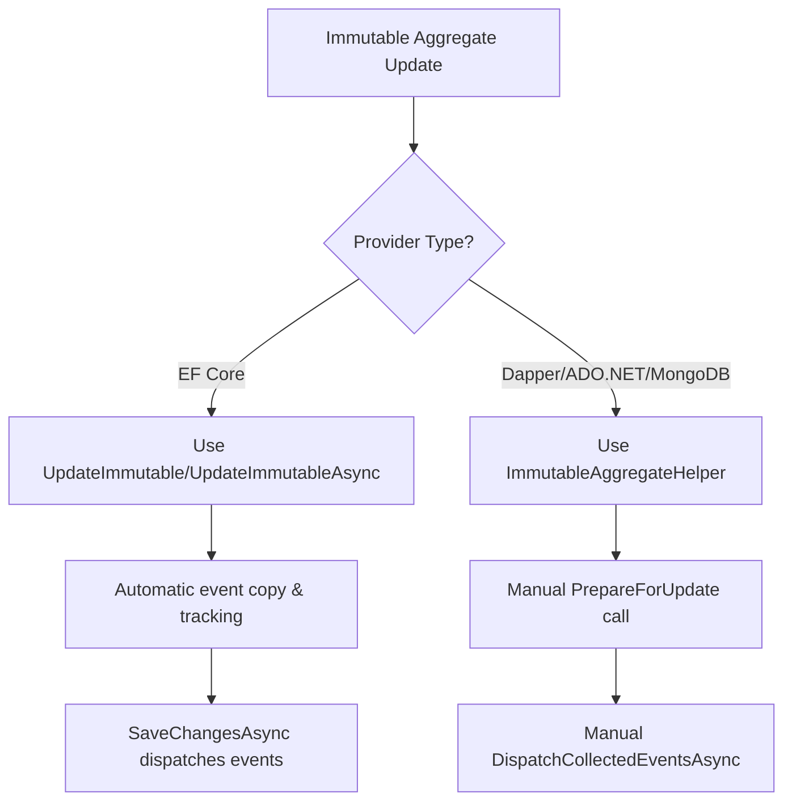

# Immutable Domain Models in Encina

This guide explains how to use immutable domain entities (C# records) with EF Core while preserving domain events. Immutability is a powerful pattern for Domain-Driven Design, ensuring entities cannot be modified after creation except through explicit state transitions.

## Table of Contents

1. [Overview](#overview)
2. [The Problem](#the-problem)
3. [The Solution](#the-solution)
4. [Quick Start](#quick-start)
5. [API Reference](#api-reference)
6. [Best Practices](#best-practices)
7. [Integration with EF Core](#integration-with-ef-core)
8. [Immutable Updates with Unit of Work Pattern](#immutable-updates-with-unit-of-work-pattern)
9. [Immutable Updates with IFunctionalRepository](#immutable-updates-with-ifunctionalrepository)
10. [Non-EF Core Provider Workflow](#non-ef-core-provider-workflow)
11. [Provider Support Comparison](#provider-support-comparison)
12. [Testing](#testing)
13. [FAQ](#faq)

---

## Overview

Immutable entities provide several benefits:

| Benefit | Description |
|---------|-------------|
| **Thread Safety** | No mutable state means no race conditions |
| **Predictability** | State changes are explicit and traceable |
| **Testing** | Easier to reason about and test |
| **Event Sourcing Ready** | Natural fit for event-driven architectures |
| **Audit Trail** | State transitions through methods leave clear audit points |

### Why Immutable Aggregates?

In DDD, aggregate roots should enforce invariants and control all state changes. With immutable records, state changes are explicit:

```csharp
// Mutable (traditional) - state changes hidden
order.Status = OrderStatus.Shipped; // Where did this happen? Who authorized it?

// Immutable - state changes explicit
var shippedOrder = order.Ship(); // Clear intent, domain event raised
```

---

## The Problem

When using C# records with EF Core, you face two challenges:

### Challenge 1: Change Tracker Confusion

EF Core tracks entity instances by reference. When you use a with-expression, you create a **new instance**:

```csharp
var order = await context.Orders.FindAsync(orderId);
var modifiedOrder = order with { Status = OrderStatus.Shipped }; // New instance!

// EF Core still tracks 'order', not 'modifiedOrder'
// SaveChanges won't persist the changes correctly
```

### Challenge 2: Lost Domain Events

Domain events raised during state transitions are lost when creating new instances:

```csharp
public record Order : AggregateRoot<OrderId>
{
    public Order Ship()
    {
        AddDomainEvent(new OrderShippedEvent(Id)); // Event on 'this'
        return this with { Status = OrderStatus.Shipped }; // New instance without events!
    }
}
```

---

## The Solution

Encina provides two complementary utilities:

### 1. `WithPreservedEvents<TAggregateRoot>()` - Event Preservation

Copies domain events from the original instance to the new instance:

```csharp
var shippedOrder = order.Ship().WithPreservedEvents(order);
// shippedOrder now has the OrderShippedEvent
```

### 2. `UpdateImmutable<TEntity>()` - Change Tracker Management

Handles the detach/attach pattern with automatic event preservation:

```csharp
var result = context.UpdateImmutable(shippedOrder);
// - Detaches original tracked entity
// - Attaches modified entity
// - Marks as Modified
// - Copies events (if both are IAggregateRoot)
```

### How It Works

```
┌─────────────────────────────────────────────────────────────────────┐
│                        Immutable Update Flow                         │
├─────────────────────────────────────────────────────────────────────┤
│                                                                      │
│  1. Load Entity                                                      │
│     ┌───────────────┐                                               │
│     │ order (tracked)│ ←── EF Core Change Tracker                   │
│     │ Status: Pending│                                               │
│     │ Events: []     │                                               │
│     └───────────────┘                                               │
│              │                                                       │
│              ▼                                                       │
│  2. State Transition (with-expression)                              │
│     ┌───────────────┐     ┌────────────────┐                        │
│     │ order          │ ──► │ shippedOrder   │ (new instance)         │
│     │ Status: Pending│     │ Status: Shipped│                        │
│     │ Events: []     │     │ Events: [Event]│ ←── Event raised here  │
│     └───────────────┘     └────────────────┘                        │
│              │                                                       │
│              ▼                                                       │
│  3. WithPreservedEvents (optional, if events raised in method)      │
│     ┌────────────────┐                                              │
│     │ shippedOrder   │ ←── Events copied from original if needed    │
│     │ Status: Shipped│                                               │
│     │ Events: [Event]│                                               │
│     └────────────────┘                                              │
│              │                                                       │
│              ▼                                                       │
│  4. UpdateImmutable                                                  │
│     ┌───────────────┐     ┌────────────────┐                        │
│     │ order          │     │ shippedOrder   │                        │
│     │ State: Detached│     │ State: Modified│ ←── Now tracked        │
│     └───────────────┘     └────────────────┘                        │
│              │                                                       │
│              ▼                                                       │
│  5. SaveChanges → Events Dispatched                                 │
│                                                                      │
└─────────────────────────────────────────────────────────────────────┘
```

---

## Quick Start

### 1. Define an Immutable Aggregate Root

```csharp
using Encina.DomainModeling;

public record Order : AggregateRoot<Guid>
{
    public required string CustomerName { get; init; }
    public required OrderStatus Status { get; init; }
    public required decimal Total { get; init; }

    // State transition with domain event
    public Order Ship()
    {
        if (Status != OrderStatus.Confirmed)
            throw new InvalidOperationException("Only confirmed orders can be shipped");

        AddDomainEvent(new OrderShippedEvent(Id, DateTime.UtcNow));
        return this with { Status = OrderStatus.Shipped };
    }

    public Order Cancel(string reason)
    {
        if (Status == OrderStatus.Shipped)
            throw new InvalidOperationException("Cannot cancel shipped orders");

        AddDomainEvent(new OrderCancelledEvent(Id, reason));
        return this with { Status = OrderStatus.Cancelled };
    }
}
```

### 2. Configure EF Core

```csharp
public class OrdersDbContext : DbContext
{
    public DbSet<Order> Orders => Set<Order>();

    protected override void OnModelCreating(ModelBuilder modelBuilder)
    {
        modelBuilder.Entity<Order>(entity =>
        {
            entity.HasKey(e => e.Id);
            entity.Property(e => e.CustomerName).HasMaxLength(200).IsRequired();
            entity.Property(e => e.Status).HasConversion<string>();
            entity.Property(e => e.Total).HasPrecision(18, 2);
        });
    }
}
```

### 3. Update with Event Preservation

```csharp
using Encina.EntityFrameworkCore.Extensions;

public class ShipOrderHandler : ICommandHandler<ShipOrderCommand, Unit>
{
    private readonly OrdersDbContext _context;

    public async ValueTask<Either<EncinaError, Unit>> Handle(
        ShipOrderCommand command,
        IRequestContext ctx,
        CancellationToken ct)
    {
        var order = await _context.Orders.FindAsync([command.OrderId], ct);
        if (order is null)
            return EncinaError.NotFound($"Order {command.OrderId} not found");

        // State transition - returns new instance with event
        var shippedOrder = order.Ship().WithPreservedEvents(order);

        // Update change tracker with event preservation
        var result = _context.UpdateImmutable(shippedOrder);

        return await result.MatchAsync(
            Left: error => error,
            Right: async _ =>
            {
                await _context.SaveChangesAsync(ct);
                return unit;
            });
    }
}
```

---

## API Reference

### `WithPreservedEvents<TAggregateRoot>()`

Copies domain events from the original instance to the new instance.

```csharp
public static TAggregateRoot WithPreservedEvents<TAggregateRoot>(
    this TAggregateRoot newInstance,
    TAggregateRoot originalInstance)
    where TAggregateRoot : class, IAggregateRoot
```

**Parameters:**

| Parameter | Description |
|-----------|-------------|
| `newInstance` | The new instance created from a with-expression |
| `originalInstance` | The original instance containing domain events |

**Returns:** The new instance with events copied, for fluent chaining.

**Example:**

```csharp
var shippedOrder = order.Ship().WithPreservedEvents(order);
```

### `UpdateImmutable<TEntity>()`

Updates an immutable entity in the change tracker.

```csharp
public static Either<EncinaError, Unit> UpdateImmutable<TEntity>(
    this DbContext context,
    TEntity modified)
    where TEntity : class
```

**Parameters:**

| Parameter | Description |
|-----------|-------------|
| `context` | The DbContext containing the entity |
| `modified` | The modified entity instance to track |

**Returns:** `Either<EncinaError, Unit>` where Right indicates success.

**Error Cases:**

| Error Code | Description |
|------------|-------------|
| `ENTITY_NOT_TRACKED` | Original entity not found in change tracker |
| `UPDATE_FAILED` | Detach/attach operation failed |

**Example:**

```csharp
var result = context.UpdateImmutable(modifiedOrder);
result.Match(
    Right: _ => Console.WriteLine("Success"),
    Left: error => Console.WriteLine($"Failed: {error.Code}"));
```

### `UpdateImmutableAsync<TEntity>()`

Async overload for API consistency.

```csharp
public static Task<Either<EncinaError, Unit>> UpdateImmutableAsync<TEntity>(
    this DbContext context,
    TEntity modified,
    CancellationToken cancellationToken = default)
    where TEntity : class
```

---

## Best Practices

### 1. Raise Events Before Creating New Instance

Domain events should be raised before the with-expression:

```csharp
// Correct: Event raised before with-expression
public Order Ship()
{
    AddDomainEvent(new OrderShippedEvent(Id)); // Event on 'this'
    return this with { Status = OrderStatus.Shipped };
}

// Wrong: Event on new instance (lost without WithPreservedEvents)
public Order Ship()
{
    var shipped = this with { Status = OrderStatus.Shipped };
    shipped.AddDomainEvent(new OrderShippedEvent(Id)); // Event on new instance
    return shipped;
}
```

### 2. Use `WithPreservedEvents` When Events Are Raised in Methods

If your state transition methods raise events, always use `WithPreservedEvents`:

```csharp
// When the method raises events
var shippedOrder = order.Ship().WithPreservedEvents(order);

// When just using with-expression (no events in method)
var renamedOrder = order with { CustomerName = "New Name" };
var result = context.UpdateImmutable(renamedOrder); // Copies events automatically
```

### 3. Keep State Transition Logic in the Aggregate

Encapsulate all state changes in aggregate methods:

```csharp
// Good: State change through aggregate method
var confirmedOrder = order.Confirm();

// Bad: Direct property modification (breaks encapsulation)
var confirmedOrder = order with { Status = OrderStatus.Confirmed };
```

### 4. Validate Before State Transition

Enforce invariants before creating new instances:

```csharp
public Order Ship()
{
    // Guard clause first
    if (Status != OrderStatus.Confirmed)
        throw new InvalidOperationException("Only confirmed orders can be shipped");

    if (Items.Count == 0)
        throw new InvalidOperationException("Cannot ship empty order");

    AddDomainEvent(new OrderShippedEvent(Id));
    return this with { Status = OrderStatus.Shipped };
}
```

### 5. Use Result Types for Validation

For ROP-style validation:

```csharp
public Either<OrderError, Order> Ship()
{
    if (Status != OrderStatus.Confirmed)
        return OrderError.InvalidStatusTransition(Status, OrderStatus.Shipped);

    AddDomainEvent(new OrderShippedEvent(Id));
    return this with { Status = OrderStatus.Shipped };
}

// Usage
var result = order.Ship()
    .Map(shipped => shipped.WithPreservedEvents(order));
```

---

## Integration with EF Core

### Domain Event Dispatcher

For automatic event dispatch after SaveChanges, configure the domain event dispatcher:

```csharp
services.AddEncinaEntityFrameworkCore<OrdersDbContext>(config =>
{
    config.UseDomainEvents = true; // Enables DomainEventDispatcherInterceptor
});
```

The interceptor automatically:

1. Collects events from tracked aggregate roots before SaveChanges
2. Dispatches events after SaveChanges succeeds
3. Handles both sync and async SaveChanges

### Optimistic Concurrency

Combine immutable updates with row versioning:

```csharp
public record Order : AggregateRoot<Guid>, IConcurrencyAware
{
    public byte[] RowVersion { get; init; } = [];
    // ... other properties
}

// EF Core configuration
modelBuilder.Entity<Order>()
    .Property(e => e.RowVersion)
    .IsRowVersion();
```

---

## Immutable Updates with Unit of Work Pattern

When using `IUnitOfWork`, Encina provides a clean API for updating immutable aggregates:

### Using `UpdateImmutable()`

```csharp
public class ShipOrderHandler : ICommandHandler<ShipOrderCommand, Unit>
{
    private readonly IUnitOfWork _unitOfWork;

    public async ValueTask<Either<EncinaError, Unit>> Handle(
        ShipOrderCommand command,
        IRequestContext ctx,
        CancellationToken ct)
    {
        await using (_unitOfWork)
        {
            var repository = _unitOfWork.Repository<Order, Guid>();
            var orderResult = await repository.GetByIdAsync(command.OrderId, ct);

            return await orderResult.MatchAsync(
                Left: error => error,
                Right: async order =>
                {
                    // 1. Perform domain operation
                    var shippedOrder = order.Ship().WithPreservedEvents(order);

                    // 2. Use UpdateImmutable - handles change tracking automatically
                    var updateResult = _unitOfWork.UpdateImmutable(shippedOrder);

                    return await updateResult.MatchAsync(
                        Left: error => error,
                        Right: async _ =>
                        {
                            // 3. Commit changes - events dispatched automatically
                            await _unitOfWork.SaveChangesAsync(ct);
                            return Unit.Default;
                        });
                });
        }
    }
}
```

### API Reference

```csharp
// Synchronous update
Either<EncinaError, Unit> UpdateImmutable<TEntity>(TEntity modified)
    where TEntity : class, IAggregateRoot;

// Asynchronous update
ValueTask<Either<EncinaError, Unit>> UpdateImmutableAsync<TEntity>(
    TEntity modified,
    CancellationToken cancellationToken = default)
    where TEntity : class, IAggregateRoot;
```

**Returns**: `Either<EncinaError, Unit>` where:

- `Right(Unit.Default)` - Success
- `Left(RepositoryErrors.EntityNotTracked)` - Original entity not found in change tracker
- `Left(RepositoryErrors.UpdateFailed)` - Detach/attach operation failed

### Complete Workflow Example

```csharp
public async ValueTask<Either<EncinaError, Unit>> TransferOrderOwnership(
    Guid orderId,
    Guid newOwnerId,
    CancellationToken ct)
{
    await using (_unitOfWork)
    {
        var orderRepo = _unitOfWork.Repository<Order, Guid>();
        var customerRepo = _unitOfWork.Repository<Customer, Guid>();

        // Load both entities
        var orderResult = await orderRepo.GetByIdAsync(orderId, ct);
        var customerResult = await customerRepo.GetByIdAsync(newOwnerId, ct);

        return await (orderResult, customerResult).Apply((order, customer) =>
        {
            // Domain operations
            var updatedOrder = order.TransferTo(customer.Id)
                .WithPreservedEvents(order);

            // Update immutable aggregate
            return _unitOfWork.UpdateImmutable(updatedOrder)
                .BindAsync(_ => _unitOfWork.SaveChangesAsync(ct));
        });
    }
}
```

---

## Immutable Updates with IFunctionalRepository

`IFunctionalRepository<TEntity, TId>` also supports immutable updates through `UpdateImmutableAsync`:

### Basic Usage

```csharp
public class UpdateOrderStatusHandler : ICommandHandler<UpdateOrderStatusCommand, Unit>
{
    private readonly IFunctionalRepository<Order, Guid> _repository;
    private readonly IUnitOfWork _unitOfWork;

    public async ValueTask<Either<EncinaError, Unit>> Handle(
        UpdateOrderStatusCommand command,
        IRequestContext ctx,
        CancellationToken ct)
    {
        return await _repository.GetByIdAsync(command.OrderId, ct)
            .BindAsync(async order =>
            {
                var modifiedOrder = order.UpdateStatus(command.NewStatus)
                    .WithPreservedEvents(order);

                return await _repository.UpdateImmutableAsync(modifiedOrder, ct);
            })
            .BindAsync(_ => _unitOfWork.SaveChangesAsync(ct));
    }
}
```

### API Reference

```csharp
ValueTask<Either<EncinaError, Unit>> UpdateImmutableAsync(
    TEntity modified,
    CancellationToken cancellationToken = default);
```

### Repository Pattern Benefits

Using `IFunctionalRepository` for immutable updates provides:

| Benefit | Description |
|---------|-------------|
| **Consistency** | Same API across EF Core repositories |
| **Encapsulation** | Aggregate-specific update logic stays in one place |
| **Testability** | Easy to mock `UpdateImmutableAsync` in unit tests |
| **ROP Integration** | Returns `Either<EncinaError, Unit>` for explicit error handling |

---

## Non-EF Core Provider Workflow

For providers without change tracking (Dapper, ADO.NET, MongoDB), use `ImmutableAggregateHelper`:

### Why a Different Approach?

Non-EF Core providers lack automatic change tracking. When you update an immutable aggregate:

1. Domain events on the original instance need to be manually copied
2. The modified aggregate needs to be registered for event dispatch
3. There's no "detach/attach" pattern needed

### Using `ImmutableAggregateHelper.PrepareForUpdate()`

```csharp
public class ShipOrderHandler : ICommandHandler<ShipOrderCommand, Unit>
{
    private readonly IFunctionalRepository<Order, Guid> _repository;
    private readonly IDomainEventCollector _eventCollector;
    private readonly DomainEventDispatchHelper _dispatchHelper;

    public async ValueTask<Either<EncinaError, Unit>> Handle(
        ShipOrderCommand command,
        IRequestContext context,
        CancellationToken ct)
    {
        // 1. Load the order
        var orderResult = await _repository.GetByIdAsync(command.OrderId, ct);

        return await orderResult.MatchAsync(
            Left: error => error,
            Right: async order =>
            {
                // 2. Perform domain operation (raises event, returns new instance)
                var shippedOrder = order.Ship();

                // 3. Prepare for update (copies events, tracks aggregate)
                ImmutableAggregateHelper.PrepareForUpdate(
                    shippedOrder,
                    order,
                    _eventCollector);

                // 4. Persist changes
                var updateResult = await _repository.UpdateAsync(shippedOrder, ct);

                // 5. Dispatch domain events
                if (updateResult.IsRight)
                    await _dispatchHelper.DispatchCollectedEventsAsync(ct);

                return updateResult.Map(_ => Unit.Default);
            });
    }
}
```

### API Reference

```csharp
public static TAggregate PrepareForUpdate<TAggregate>(
    TAggregate modified,
    TAggregate original,
    IDomainEventCollector collector)
    where TAggregate : class, IAggregateRoot
```

**What it does**:

1. **Copies events**: Calls `modified.CopyEventsFrom(original)` to preserve domain events
2. **Tracks aggregate**: Calls `collector.TrackAggregate(modified)` for event dispatch
3. **Returns modified**: Returns the modified aggregate for fluent chaining

**Parameters**:

| Parameter | Description |
|-----------|-------------|
| `modified` | The new aggregate instance created via with-expression |
| `original` | The original aggregate containing domain events |
| `collector` | The `IDomainEventCollector` for tracking and dispatch |

### Required Dependencies

Register these services when using non-EF Core providers:

```csharp
services.AddScoped<IDomainEventCollector, DomainEventCollector>();
services.AddScoped<DomainEventDispatchHelper>();
```

### Fluent Chaining Pattern

```csharp
// Compact fluent style
var preparedOrder = ImmutableAggregateHelper.PrepareForUpdate(
    order.Ship(),
    order,
    _eventCollector);

await _repository.UpdateAsync(preparedOrder, ct);
await _dispatchHelper.DispatchCollectedEventsAsync(ct);
```

---

## Provider Support Comparison

| Provider | Change Tracking | UpdateImmutable Support | Helper Required |
|----------|----------------|------------------------|-----------------|
| **EF Core** | Yes | `IUnitOfWork.UpdateImmutable()` | None |
| **EF Core** | Yes | `IFunctionalRepository.UpdateImmutableAsync()` | None |
| **EF Core** | Yes | `DbContext.UpdateImmutable()` | None |
| **Dapper** | No | Returns `OperationNotSupported` | `ImmutableAggregateHelper` |
| **ADO.NET** | No | Returns `OperationNotSupported` | `ImmutableAggregateHelper` |
| **MongoDB** | No | Returns `OperationNotSupported` | `ImmutableAggregateHelper` |

### Error Handling for Non-EF Providers

Non-EF providers return `RepositoryErrors.OperationNotSupported` from `UpdateImmutableAsync`:

```csharp
var result = await dapperRepository.UpdateImmutableAsync(modified, ct);
result.Match(
    Left: error =>
    {
        if (error.Code == "REPO_OPERATION_NOT_SUPPORTED")
        {
            // Use ImmutableAggregateHelper instead
            ImmutableAggregateHelper.PrepareForUpdate(modified, original, collector);
            // ... proceed with manual update
        }
    },
    Right: _ => { /* Success */ });
```

### Choosing the Right Approach



---

## Testing

### Unit Testing State Transitions

```csharp
[Fact]
public void Ship_ConfirmedOrder_ReturnsShippedOrderWithEvent()
{
    // Arrange
    var order = new Order(Guid.NewGuid())
    {
        CustomerName = "Test",
        Status = OrderStatus.Confirmed,
        Total = 100m
    };

    // Act
    var shippedOrder = order.Ship().WithPreservedEvents(order);

    // Assert
    shippedOrder.Status.ShouldBe(OrderStatus.Shipped);
    shippedOrder.DomainEvents.Count.ShouldBe(1);
    shippedOrder.DomainEvents[0].ShouldBeOfType<OrderShippedEvent>();
}
```

### Integration Testing with EF Core

```csharp
[Fact]
public async Task UpdateImmutable_ModifiedEntity_PersistsChanges()
{
    // Arrange
    await using var context = CreateDbContext();
    var order = new Order(Guid.NewGuid())
    {
        CustomerName = "Test",
        Status = OrderStatus.Pending,
        Total = 100m
    };
    context.Orders.Add(order);
    await context.SaveChangesAsync();

    // Act
    var modifiedOrder = order with { Status = OrderStatus.Confirmed };
    var result = context.UpdateImmutable(modifiedOrder);
    await context.SaveChangesAsync();

    // Assert
    result.IsRight.ShouldBeTrue();

    await using var verifyContext = CreateDbContext();
    var stored = await verifyContext.Orders.FindAsync(order.Id);
    stored!.Status.ShouldBe(OrderStatus.Confirmed);
}
```

---

## FAQ

### When should I use immutable entities?

Use immutable entities when:

- You want explicit, auditable state transitions
- Thread safety is important
- You're preparing for event sourcing
- Your domain model benefits from functional programming patterns

### Can I use this with non-record types?

Yes, but records provide better ergonomics with the with-expression. For classes, you'd need to implement cloning manually.

### What if I forget `WithPreservedEvents`?

`UpdateImmutable` automatically copies events from the original tracked entity to the modified entity. `WithPreservedEvents` is only needed when you raise events in the state transition method and want them on the new instance before calling `UpdateImmutable`.

### Does this work with disconnected entities?

No, `UpdateImmutable` requires the original entity to be tracked. For disconnected scenarios, attach the entity first:

```csharp
context.Attach(entity);
var result = context.UpdateImmutable(modifiedEntity);
```

### How does this interact with the Unit of Work pattern?

`IUnitOfWork` has full support for immutable updates via `UpdateImmutable()` and `UpdateImmutableAsync()`:

```csharp
var order = await unitOfWork.Repository<Order, Guid>().GetByIdAsync(orderId);
var shipped = order.Ship().WithPreservedEvents(order);

// Use UpdateImmutable on the UnitOfWork
var result = unitOfWork.UpdateImmutable(shipped);
await unitOfWork.SaveChangesAsync();
```

See [Immutable Updates with Unit of Work Pattern](#immutable-updates-with-unit-of-work-pattern) for complete documentation.

### How do I use immutables with Dapper/ADO.NET?

Non-EF Core providers don't have a change tracker. Use `ImmutableAggregateHelper.PrepareForUpdate()`:

```csharp
// 1. Load entity
var order = await repository.GetByIdAsync(orderId);

// 2. Create modified instance
var shipped = order.Ship();

// 3. PrepareForUpdate copies events and tracks aggregate
ImmutableAggregateHelper.PrepareForUpdate(shipped, order, eventCollector);

// 4. Update and dispatch events
await repository.UpdateAsync(shipped);
await dispatchHelper.DispatchCollectedEventsAsync();
```

See [Non-EF Core Provider Workflow](#non-ef-core-provider-workflow) for complete documentation.

---

## Further Reading

- [Domain Modeling in Encina](../../src/Encina.DomainModeling/README.md)
- [Entity Framework Core Integration](../../src/Encina.EntityFrameworkCore/README.md)
- [Domain Events Support](../../src/Encina.DomainModeling/README.md#domain-events)
- [Railway Oriented Programming](https://fsharpforfunandprofit.com/rop/)
