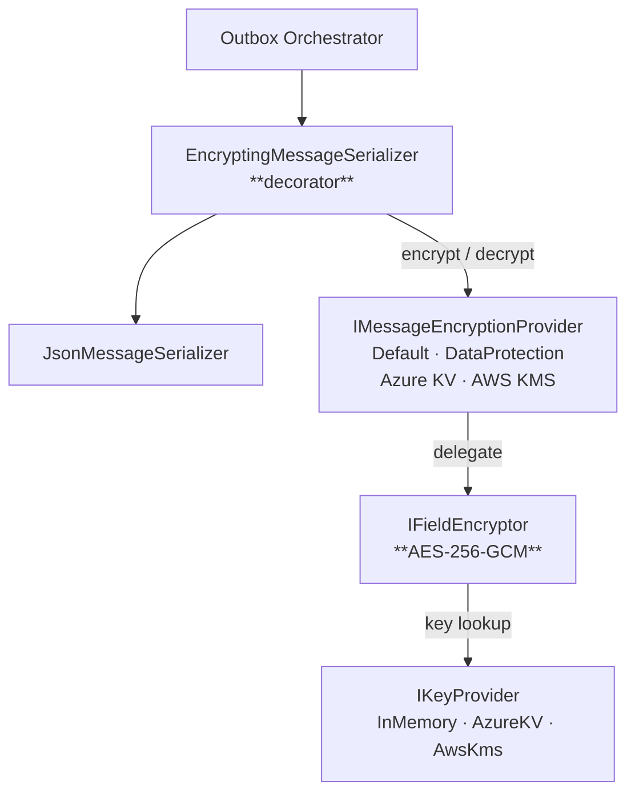
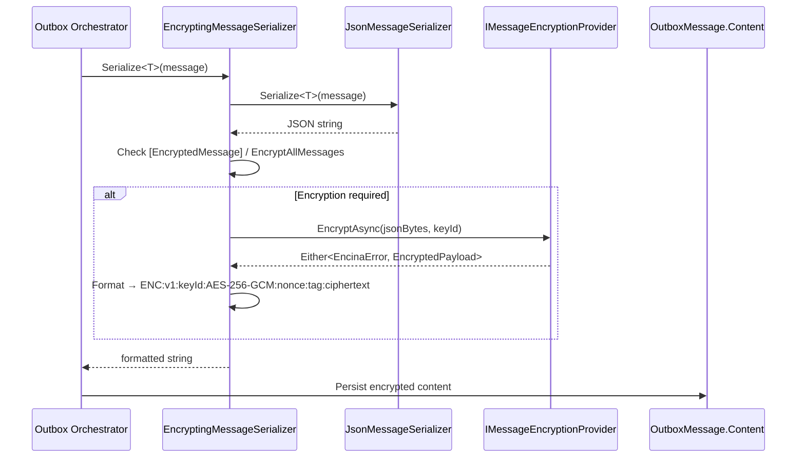
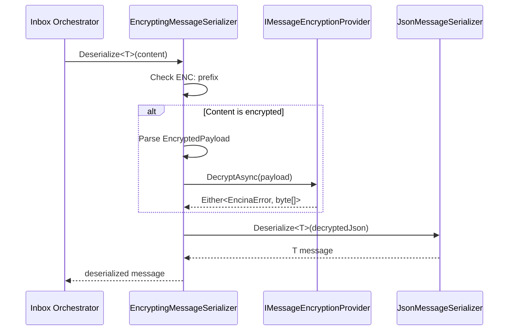

# Message Payload Encryption

## Overview

Encina.Messaging.Encryption provides transparent, payload-level encryption for outbox/inbox messages. Unlike [field-level encryption](field-level-encryption.md) (which encrypts individual properties), message encryption operates on the entire serialized message content, ensuring that sensitive payloads are encrypted at rest in the outbox/inbox tables.

| Component | Description |
|-----------|-------------|
| **`IMessageEncryptionProvider`** | Encrypt/decrypt facade returning `Either<EncinaError, T>` |
| **`EncryptingMessageSerializer`** | Decorator wrapping `IMessageSerializer` with transparent encryption |
| **`EncryptedPayloadFormatter`** | Compact serialization format for encrypted payloads |
| **`ITenantKeyResolver`** | Per-tenant key ID resolution for multi-tenant isolation |
| **`MessageEncryptionHealthCheck`** | Roundtrip verification of the encryption pipeline |

**Key characteristics**:

- **AES-256-GCM** (NIST SP 800-38D) via `Encina.Security.Encryption`
- **Railway Oriented Programming**: All operations return `Either<EncinaError, T>`
- **Zero overhead** for unencrypted messages (attribute check short-circuit)
- **Compact format**: `ENC:v{Version}:{KeyId}:{Algorithm}:{Nonce}:{Tag}:{Ciphertext}`
- **Pluggable KMS**: Azure Key Vault, AWS KMS, ASP.NET Core Data Protection

## Architecture



### Serialization Flow

#### Encrypt (Outbox persist)



#### Decrypt (Inbox consume)



## Quick Start

### 1. Enable message encryption

```csharp
services.AddEncinaEntityFrameworkCore<AppDbContext>(config =>
{
    config.UseOutbox = true;
    config.UseInbox = true;
});

services.AddEncinaMessageEncryption(options =>
{
    options.EncryptAllMessages = true;
    options.DefaultKeyId = "msg-key-2024";
});
```

### 2. Per-type encryption

```csharp
// Only this message type is encrypted
[EncryptedMessage(KeyId = "orders-key")]
public sealed record OrderPlacedEvent(Guid OrderId, decimal Total, string CustomerEmail);

// This message is NOT encrypted (default when EncryptAllMessages = false)
public sealed record OrderShippedEvent(Guid OrderId, DateTime ShippedAtUtc);
```

### 3. Multi-tenant encryption

```csharp
services.AddEncinaMessageEncryption(options =>
{
    options.UseTenantKeys = true;
    options.TenantKeyPattern = "tenant-{0}-msg-key";
});

// Each tenant gets a unique encryption key:
// tenant-acme-msg-key, tenant-contoso-msg-key, etc.
```

## Encrypted Payload Format

Messages are stored in the outbox/inbox with the following format:

```
ENC:v1:msg-key-2024:AES-256-GCM:base64(nonce):base64(tag):base64(ciphertext)
```

| Field | Description |
|-------|-------------|
| `ENC:` | Magic prefix for detection |
| `v1` | Format version (for future changes) |
| `msg-key-2024` | Key ID used for encryption |
| `AES-256-GCM` | Algorithm identifier |
| `base64(nonce)` | 12-byte random nonce (Base64) |
| `base64(tag)` | 16-byte authentication tag (Base64) |
| `base64(ciphertext)` | Encrypted payload (Base64) |

## KMS Providers

### Azure Key Vault

```csharp
services.AddEncinaMessageEncryptionAzureKeyVault(azure =>
{
    azure.VaultUri = new Uri("https://my-vault.vault.azure.net/");
    azure.KeyName = "msg-encryption-key";
});
```

### AWS KMS

```csharp
services.AddEncinaMessageEncryptionAwsKms(aws =>
{
    aws.KeyId = "arn:aws:kms:us-east-1:123456789:key/abc-123";
    aws.Region = "us-east-1";
});
```

### ASP.NET Core Data Protection

```csharp
services.AddDataProtection()
    .PersistKeysToAzureBlobStorage(connectionString, containerName, blobName);

services.AddEncinaMessageEncryptionDataProtection(dp =>
{
    dp.Purpose = "Encina.Messaging.Payload";
});
```

### Provider Comparison

| Feature | Default (AES-GCM) | Azure Key Vault | AWS KMS | Data Protection |
|---------|-------------------|----------------|---------|----------------|
| Key storage | Application-managed | HSM-backed | HSM-backed | DPAPI/file/blob |
| Key rotation | Manual | Automatic | Automatic | Automatic (90d) |
| Multi-tenant | Via `ITenantKeyResolver` | Per-vault keys | Per-region keys | Per-purpose keys |
| Cloud dependency | None | Azure | AWS | None |
| Best for | Development, testing | Azure production | AWS production | On-premises |

## Observability

### Tracing

Activities under `Encina.Messaging.Encryption` ActivitySource:

| Activity | Tags |
|----------|------|
| `MessageEncryption.Encrypt` | `operation`, `message_type`, `key_id`, `algorithm`, `outcome` |
| `MessageEncryption.Decrypt` | `operation`, `key_id`, `algorithm`, `outcome` |

### Metrics

Instruments under `Encina.Messaging.Encryption` Meter:

| Metric | Type | Unit | Description |
|--------|------|------|-------------|
| `messaging.encryption.operations` | Counter | — | Total encrypt/decrypt operations |
| `messaging.encryption.failures` | Counter | — | Total failed operations |
| `messaging.encryption.duration` | Histogram | ms | Operation duration |
| `messaging.encryption.payload_size` | Histogram | bytes | Encrypted payload size |

### Health Check

```csharp
options.AddHealthCheck = true;
// Registers "encina-message-encryption" health check
// Tags: encina, messaging, encryption, ready
```

The health check performs a full roundtrip: encrypt a probe payload, decrypt it, verify the result matches.

## Error Handling

All errors use the `msg_encryption.*` prefix:

| Code | When |
|------|------|
| `msg_encryption.encryption_failed` | Encryption operation failed |
| `msg_encryption.decryption_failed` | Decryption operation failed |
| `msg_encryption.key_not_found` | Encryption key not found |
| `msg_encryption.invalid_payload` | Malformed encrypted payload |
| `msg_encryption.unsupported_version` | Unknown payload format version |
| `msg_encryption.tenant_key_resolution_failed` | Tenant key resolution failed |
| `msg_encryption.serialization_failed` | JSON serialization failed |
| `msg_encryption.deserialization_failed` | JSON deserialization failed |
| `msg_encryption.provider_unavailable` | Encryption provider unavailable |

## Compliance

| Regulation | Article/Requirement | How Encina Helps |
|------------|--------------------|--------------------|
| **GDPR** | Article 32 | Encryption at rest for personal data in outbox/inbox |
| **HIPAA** | §164.312(a)(2)(iv) | Encryption of PHI in message payloads |
| **PCI-DSS** | Requirement 3 | Encryption of cardholder data at rest |

## Configuration Reference

| Property | Type | Default | Description |
|----------|------|---------|-------------|
| `Enabled` | `bool` | `true` | Global encryption toggle |
| `EncryptAllMessages` | `bool` | `false` | Encrypt all messages by default |
| `DefaultKeyId` | `string?` | `null` | Default key (null = resolve from `IKeyProvider`) |
| `UseTenantKeys` | `bool` | `false` | Per-tenant key isolation |
| `TenantKeyPattern` | `string` | `"tenant-{0}-key"` | Tenant key naming pattern |
| `AuditDecryption` | `bool` | `false` | Log decryption for compliance |
| `AddHealthCheck` | `bool` | `false` | Register health check |
| `EnableTracing` | `bool` | `false` | OpenTelemetry tracing |
| `EnableMetrics` | `bool` | `false` | OpenTelemetry metrics |

## Relationship to Field-Level Encryption

| Aspect | Field-Level (`Encina.Security.Encryption`) | Message-Level (`Encina.Messaging.Encryption`) |
|--------|--------------------------------------------|-------------------------------------------------|
| **Scope** | Individual properties (`[Encrypt]`) | Entire serialized message payload |
| **Pipeline** | `EncryptionPipelineBehavior` | `EncryptingMessageSerializer` (decorator) |
| **Storage** | Encrypted fields in entity columns | Encrypted `OutboxMessage.Content` |
| **Use case** | PII protection in domain entities | Message-at-rest encryption in outbox/inbox |
| **Complementary** | Yes — can use both together | Yes — different protection layers |

## Testing

```bash
# Run all message encryption tests
dotnet test --filter "FullyQualifiedName~Messaging.Encryption"
```

Test coverage: 118 tests across 4 projects (unit, guard, property, contract) plus BenchmarkDotNet benchmarks.
