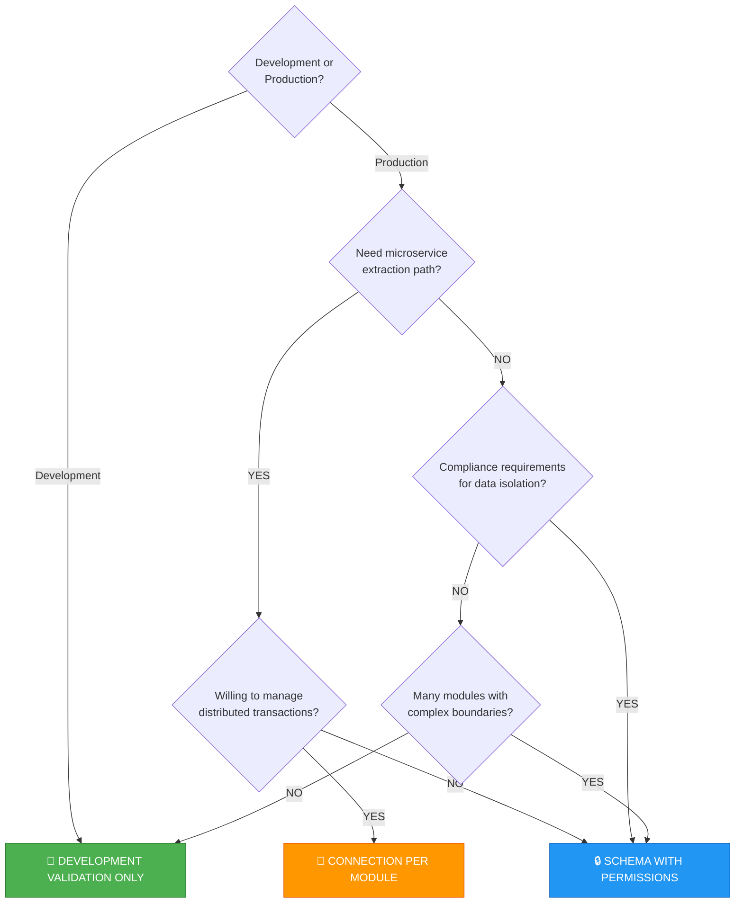
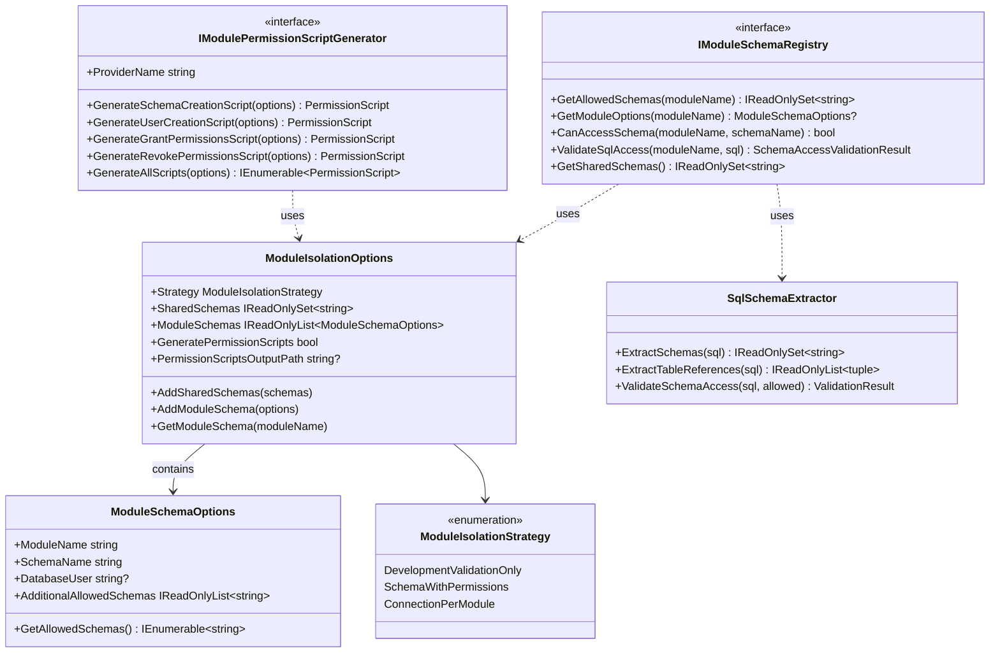
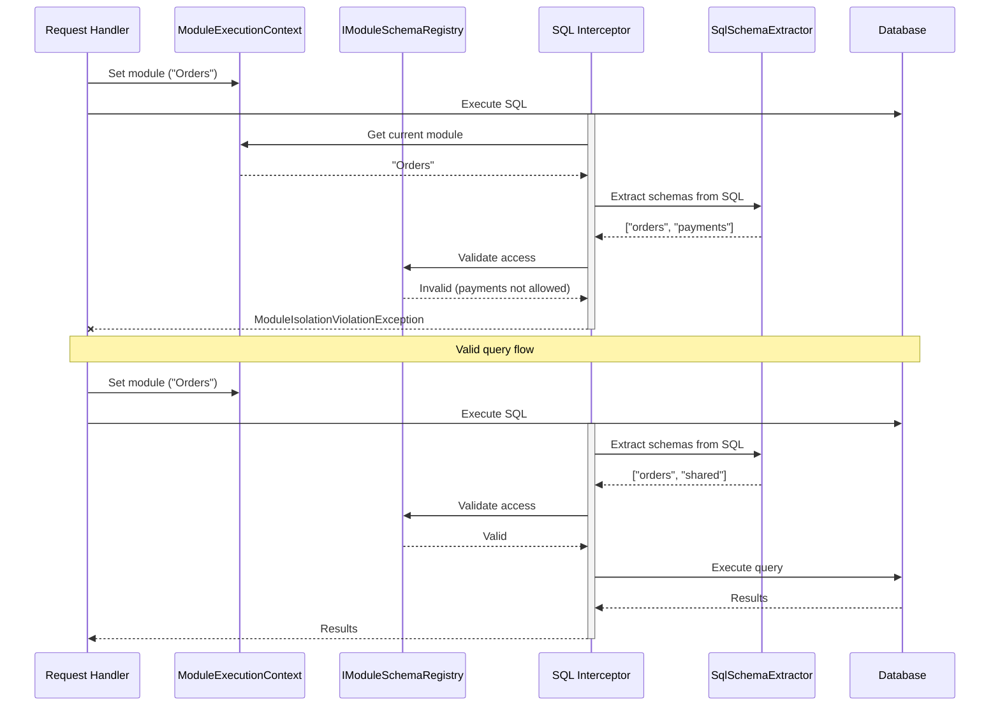

# Module Isolation in Encina

This guide explains how to implement database-level module isolation in modular monolith applications using Encina. Module isolation ensures bounded contexts cannot directly access each other's data, enforcing clean architecture at the database level.

## Table of Contents

1. [Overview](#overview)
2. [Isolation Strategy Comparison](#isolation-strategy-comparison)
3. [Decision Flowchart](#decision-flowchart)
4. [Architecture](#architecture)
5. [Configuration](#configuration)
6. [Provider-Specific Setup](#provider-specific-setup)
7. [Shared Schema Patterns](#shared-schema-patterns)
8. [Permission Script Generation](#permission-script-generation)
9. [SQL Schema Extraction](#sql-schema-extraction)
10. [Inter-Module Communication](#inter-module-communication)
11. [Combined with Multi-Tenancy](#combined-with-multi-tenancy)
12. [FAQ](#faq)

---

## Overview

In a modular monolith architecture, modules represent bounded contexts with their own domain models. While they share a database, they should not directly access each other's tables. Module isolation enforces this boundary at the database level through three complementary strategies:

| Strategy | Enforcement Level | Use Case |
|----------|-------------------|----------|
| **DevelopmentValidationOnly** | Runtime validation | Development/testing |
| **SchemaWithPermissions** | Database permissions | Production |
| **ConnectionPerModule** | Connection strings | Microservice preparation |

> **Key Benefit**: Encina's module isolation works identically across EF Core, Dapper, ADO.NET, and MongoDB. Switch providers without changing your isolation logic.

### Why Module Isolation?

1. **Prevent accidental coupling**: SQL JOINs across modules create hidden dependencies
2. **Enable independent evolution**: Modules can change their schema without breaking others
3. **Prepare for microservices**: Isolated modules are easier to extract later
4. **Improve testability**: Modules can be tested in isolation
5. **Audit compliance**: Clear data ownership boundaries

### How It Works

```
┌─────────────────────────────────────────────────────────────────────────┐
│                           Application                                    │
├─────────────────────────────────────────────────────────────────────────┤
│  ┌──────────────┐  ┌──────────────┐  ┌──────────────┐                   │
│  │ Orders Module│  │Payments Module│  │Inventory Module│                │
│  │              │  │              │  │              │                   │
│  │ [orders_user]│  │[payments_user]│  │[inventory_user]│                │
│  └──────┬───────┘  └──────┬───────┘  └──────┬───────┘                   │
│         │                 │                 │                            │
│  ═══════╪═════════════════╪═════════════════╪═══════  Isolation Layer   │
│         │                 │                 │                            │
│  ┌──────▼───────┐  ┌──────▼───────┐  ┌──────▼───────┐  ┌──────────────┐ │
│  │ orders schema│  │payments schema│  │inventory     │  │ shared schema│ │
│  │              │  │              │  │ schema       │  │  (read-only) │ │
│  │ ✓ FULL ACCESS│  │ ✓ FULL ACCESS│  │ ✓ FULL ACCESS│  │ ✓ SELECT only│ │
│  └──────────────┘  └──────────────┘  └──────────────┘  └──────────────┘ │
│                                                                          │
│                            Database                                      │
└─────────────────────────────────────────────────────────────────────────┘
```

---

## Isolation Strategy Comparison

### DevelopmentValidationOnly (Default)

SQL statements are validated at runtime using regex pattern matching. No database-level permissions are required.

```
┌─────────────────────────────────────────────────────────────────┐
│                         Application                              │
├─────────────────────────────────────────────────────────────────┤
│  Orders Module                                                   │
│  ┌───────────────┐                                              │
│  │ SELECT * FROM │  ──► SqlSchemaExtractor validates schemas    │
│  │ orders.Orders │                                               │
│  └───────────────┘      ✓ Valid: "orders" is allowed            │
│                                                                  │
│  ┌───────────────┐                                              │
│  │ SELECT * FROM │  ──► SqlSchemaExtractor validates schemas    │
│  │payments.Payments│                                             │
│  └───────────────┘      ✗ Invalid: "payments" not allowed       │
│                         → Throws ModuleIsolationViolationException│
└─────────────────────────────────────────────────────────────────┘
```

**Pros:**

- No database setup required
- Fast feedback during development
- Works with any database connection

**Cons:**

- Only validates at runtime (not compile-time)
- Relies on SQL parsing heuristics
- No protection against direct SQL execution

**Best for:** Development, testing, CI/CD pipelines.

### SchemaWithPermissions (Recommended for Production)

Each module has a dedicated database user with limited permissions. The database itself enforces isolation.

```
┌─────────────────────────────────────────────────────────────────┐
│                         Application                              │
├─────────────────────────────────────────────────────────────────┤
│  Orders Module                                                   │
│  ┌───────────────┐                                              │
│  │ Connection:   │                                              │
│  │ orders_user   │  ──► Database: orders_user permissions       │
│  └───────────────┘                                               │
│                         ✓ orders schema: FULL ACCESS            │
│                         ✓ shared schema: SELECT only            │
│                         ✗ payments schema: NO ACCESS            │
└─────────────────────────────────────────────────────────────────┘
```

**Pros:**

- Defense-in-depth (database enforces isolation)
- Works even for direct SQL/stored procedures
- Audit trail in database logs
- Protection against application bugs

**Cons:**

- Requires database user setup
- More complex deployment
- Connection pool per module user

**Best for:** Production, compliance-sensitive environments.

### ConnectionPerModule (Strongest Isolation)

Each module uses a completely separate connection string, enabling different servers/databases.

```
┌─────────────────────────────────────────────────────────────────┐
│                         Application                              │
├─────────────────────────────────────────────────────────────────┤
│  ┌──────────────────┐  ┌──────────────────┐                     │
│  │   Orders Module   │  │  Payments Module  │                    │
│  │                   │  │                   │                    │
│  │ Connection String:│  │ Connection String:│                    │
│  │ Server=orders-db  │  │ Server=payments-db│                    │
│  │ User=orders_user  │  │ User=payments_user│                    │
│  └─────────┬─────────┘  └─────────┬─────────┘                    │
│            │                       │                              │
│            ▼                       ▼                              │
│  ┌─────────────────┐    ┌─────────────────┐                      │
│  │  orders-db      │    │  payments-db    │                      │
│  │  (dedicated)    │    │  (dedicated)    │                      │
│  └─────────────────┘    └─────────────────┘                      │
└─────────────────────────────────────────────────────────────────┘
```

**Pros:**

- Maximum isolation
- Independent scaling per module
- Clear migration path to microservices
- No cross-module queries possible

**Cons:**

- Highest complexity
- No cross-module transactions
- Requires distributed data patterns
- Multiple connection pools

**Best for:** Microservice preparation, very large modules.

### Comparison Table

| Aspect | DevelopmentValidationOnly | SchemaWithPermissions | ConnectionPerModule |
|--------|---------------------------|----------------------|---------------------|
| **Enforcement** | Runtime validation | Database permissions | Connection strings |
| **Setup Complexity** | None | Medium | High |
| **Cross-Module JOINs** | Blocked by validation | Blocked by DB | Impossible |
| **Performance** | Slight overhead | No overhead | Highest isolation |
| **Transactions** | Single transaction | Single transaction | Distributed only |
| **Microservice Ready** | No | Partial | Yes |
| **Audit Trail** | Application logs | Database logs | Database logs |
| **Bug Protection** | Application only | Application + DB | Full isolation |

---

## Decision Flowchart



---

## Architecture

### Core Components



### Request Flow



---

## Configuration

### Basic Setup

```csharp
// Program.cs
services.AddEncinaEntityFrameworkCore<AppDbContext>(config =>
{
    config.UseModuleIsolation = true;

    // Configure isolation strategy
    config.ModuleIsolation.Strategy = ModuleIsolationStrategy.DevelopmentValidationOnly;

    // Define shared schemas (all modules get SELECT access)
    config.ModuleIsolation.AddSharedSchemas("shared", "lookup");

    // Configure each module's schema
    config.ModuleIsolation.AddModuleSchema(new ModuleSchemaOptions
    {
        ModuleName = "Orders",
        SchemaName = "orders",
        DatabaseUser = "orders_user"  // Required for SchemaWithPermissions
    });

    config.ModuleIsolation.AddModuleSchema(new ModuleSchemaOptions
    {
        ModuleName = "Payments",
        SchemaName = "payments",
        DatabaseUser = "payments_user"
    });

    config.ModuleIsolation.AddModuleSchema(new ModuleSchemaOptions
    {
        ModuleName = "Inventory",
        SchemaName = "inventory",
        DatabaseUser = "inventory_user",
        AdditionalAllowedSchemas = ["catalog"]  // Can also read catalog schema
    });
});
```

### Fluent Configuration

```csharp
services.AddEncinaEntityFrameworkCore<AppDbContext>(config =>
{
    config.UseModuleIsolation = true;
    config.ModuleIsolation.Strategy = ModuleIsolationStrategy.SchemaWithPermissions;

    // Fluent builder syntax
    config.ModuleIsolation
        .AddSharedSchemas("shared", "lookup")
        .AddModuleSchema("Orders", "orders", builder =>
            builder.WithDatabaseUser("orders_user")
                   .WithAdditionalAllowedSchemas("audit"))
        .AddModuleSchema("Payments", "payments", builder =>
            builder.WithDatabaseUser("payments_user"))
        .AddModuleSchema("Inventory", "inventory", builder =>
            builder.WithDatabaseUser("inventory_user")
                   .WithAdditionalAllowedSchemas("catalog"));

    // Enable script generation
    config.ModuleIsolation.GeneratePermissionScripts = true;
    config.ModuleIsolation.PermissionScriptsOutputPath = "./scripts/permissions";
});
```

### Environment-Based Configuration

```csharp
services.AddEncinaEntityFrameworkCore<AppDbContext>(config =>
{
    config.UseModuleIsolation = true;

    // Use validation-only in development, permissions in production
    config.ModuleIsolation.Strategy = builder.Environment.IsDevelopment()
        ? ModuleIsolationStrategy.DevelopmentValidationOnly
        : ModuleIsolationStrategy.SchemaWithPermissions;

    // Common configuration
    config.ModuleIsolation.AddSharedSchemas("shared", "lookup");
    config.ModuleIsolation.AddModuleSchema("Orders", "orders", b =>
        b.WithDatabaseUser("orders_user"));
});
```

---

## Provider-Specific Setup

### Entity Framework Core

```csharp
// Configure EF Core with module isolation
services.AddEncinaEntityFrameworkCore<AppDbContext>(config =>
{
    config.UseModuleIsolation = true;
    config.ModuleIsolation.Strategy = ModuleIsolationStrategy.SchemaWithPermissions;
    config.ModuleIsolation.AddSharedSchemas("shared");
    config.ModuleIsolation.AddModuleSchema("Orders", "orders", b =>
        b.WithDatabaseUser("orders_user"));
});

// DbContext with schema configuration
public class AppDbContext : DbContext
{
    protected override void OnModelCreating(ModelBuilder modelBuilder)
    {
        // Orders module tables in "orders" schema
        modelBuilder.Entity<Order>().ToTable("Orders", "orders");
        modelBuilder.Entity<OrderItem>().ToTable("OrderItems", "orders");

        // Payments module tables in "payments" schema
        modelBuilder.Entity<Payment>().ToTable("Payments", "payments");

        // Shared lookup tables
        modelBuilder.Entity<OrderStatus>().ToTable("OrderStatuses", "shared");
        modelBuilder.Entity<Currency>().ToTable("Currencies", "shared");
    }
}
```

### Dapper (SQL Server)

```csharp
// Configure Dapper with module isolation
services.AddEncinaDapperSqlServerWithModuleIsolation(
    builder.Configuration.GetConnectionString("DefaultConnection")!,
    config =>
    {
        config.UseOutbox = true;
        config.UseInbox = true;
    },
    isolation =>
    {
        isolation.Strategy = ModuleIsolationStrategy.SchemaWithPermissions;
        isolation.AddSharedSchemas("shared", "lookup");
        isolation.AddModuleSchema("Orders", "orders", b =>
            b.WithDatabaseUser("orders_user"));
    });

// Usage in handlers with explicit schema references
public class GetOrdersHandler : IQueryHandler<GetOrdersQuery, IEnumerable<Order>>
{
    private readonly IDbConnection _connection;

    public async ValueTask<Either<EncinaError, IEnumerable<Order>>> Handle(
        GetOrdersQuery query,
        IRequestContext context,
        CancellationToken ct)
    {
        // Schema-qualified SQL (validated by interceptor)
        const string sql = """
            SELECT o.*, s.Name as StatusName
            FROM orders.Orders o
            JOIN shared.OrderStatuses s ON o.StatusId = s.Id
            WHERE o.CustomerId = @CustomerId
            """;

        var orders = await _connection.QueryAsync<Order>(sql, new { query.CustomerId });
        return orders.ToList();
    }
}
```

### ADO.NET (SQL Server)

```csharp
// Configure ADO.NET with module isolation
services.AddEncinaADOSqlServerWithModuleIsolation(
    builder.Configuration.GetConnectionString("DefaultConnection")!,
    isolation =>
    {
        isolation.Strategy = ModuleIsolationStrategy.SchemaWithPermissions;
        isolation.AddSharedSchemas("shared");
        isolation.AddModuleSchema("Orders", "orders", b =>
            b.WithDatabaseUser("orders_user"));
    });
```

### MongoDB

```csharp
// Configure MongoDB with module isolation
services.AddEncinaMongoDBWithModuleIsolation(
    config =>
    {
        config.ConnectionString = "mongodb://localhost:27017";
        config.DatabaseName = "MyApp";
    },
    isolation =>
    {
        isolation.Strategy = ModuleIsolationStrategy.DevelopmentValidationOnly;

        // MongoDB uses collection prefixes instead of schemas
        isolation.AddModuleSchema(new ModuleSchemaOptions
        {
            ModuleName = "Orders",
            SchemaName = "orders"  // Collection prefix: orders_Orders, orders_OrderItems
        });

        isolation.AddModuleSchema(new ModuleSchemaOptions
        {
            ModuleName = "Payments",
            SchemaName = "payments"  // Collection prefix: payments_Payments
        });
    });
```

---

## Shared Schema Patterns

### Common Shared Schema Types

| Schema | Purpose | Example Tables |
|--------|---------|----------------|
| `shared` | Application-wide reference data | Countries, Currencies, Languages |
| `lookup` | Lookup tables and enumerations | OrderStatuses, PaymentTypes |
| `audit` | Cross-module audit trails | AuditLogs, EventLog |
| `messaging` | Outbox/Inbox tables | OutboxMessages, InboxMessages |

### Shared Schema Configuration

```csharp
config.ModuleIsolation.AddSharedSchemas(
    "shared",    // Reference data
    "lookup",    // Lookup tables
    "messaging"  // Outbox/Inbox (all modules publish)
);
```

### Shared Schema SQL Scripts

```sql
-- Create shared schema
CREATE SCHEMA [shared];
GO

-- Shared lookup tables
CREATE TABLE [shared].[Countries] (
    [Code] NVARCHAR(3) NOT NULL PRIMARY KEY,
    [Name] NVARCHAR(100) NOT NULL
);

CREATE TABLE [shared].[Currencies] (
    [Code] NVARCHAR(3) NOT NULL PRIMARY KEY,
    [Name] NVARCHAR(50) NOT NULL,
    [Symbol] NVARCHAR(5) NOT NULL
);

CREATE TABLE [shared].[OrderStatuses] (
    [Id] INT NOT NULL PRIMARY KEY,
    [Code] NVARCHAR(20) NOT NULL UNIQUE,
    [Name] NVARCHAR(50) NOT NULL
);
```

### Read-Only vs Read-Write Shared Schemas

```csharp
// Most shared schemas are read-only
config.ModuleIsolation.AddSharedSchemas("lookup", "reference");

// Some modules might need write access to specific shared schemas
config.ModuleIsolation.AddModuleSchema("Administration", "admin", b =>
    b.WithDatabaseUser("admin_user")
     .WithAdditionalAllowedSchemas("lookup"));  // Full access to lookup

// The permission script generator creates:
// - SELECT on shared for all modules
// - FULL ACCESS on lookup for Administration module only
```

---

## Permission Script Generation

### Enabling Script Generation

```csharp
config.ModuleIsolation.GeneratePermissionScripts = true;
config.ModuleIsolation.PermissionScriptsOutputPath = "./scripts/permissions";
```

### Generated Scripts

The permission script generators create provider-specific SQL scripts:

| Script | Order | Description |
|--------|-------|-------------|
| `000_revoke_permissions.sql` | 0 | Revokes all existing permissions (cleanup) |
| `001_create_schemas.sql` | 1 | Creates schemas for each module |
| `002_create_users.sql` | 2 | Creates database users/logins |
| `003_grant_permissions.sql` | 3 | Grants schema-level permissions |

### SQL Server Scripts

```sql
-- 001_create_schemas.sql
IF NOT EXISTS (SELECT * FROM sys.schemas WHERE name = N'orders')
    EXEC('CREATE SCHEMA [orders]');
GO

IF NOT EXISTS (SELECT * FROM sys.schemas WHERE name = N'payments')
    EXEC('CREATE SCHEMA [payments]');
GO

IF NOT EXISTS (SELECT * FROM sys.schemas WHERE name = N'shared')
    EXEC('CREATE SCHEMA [shared]');
GO

-- 002_create_users.sql
IF NOT EXISTS (SELECT * FROM sys.database_principals WHERE name = N'orders_user')
    CREATE USER [orders_user] WITHOUT LOGIN;
GO

IF NOT EXISTS (SELECT * FROM sys.database_principals WHERE name = N'payments_user')
    CREATE USER [payments_user] WITHOUT LOGIN;
GO

-- 003_grant_permissions.sql
-- Orders module permissions
GRANT SELECT, INSERT, UPDATE, DELETE ON SCHEMA::[orders] TO [orders_user];
GRANT SELECT ON SCHEMA::[shared] TO [orders_user];
GRANT SELECT ON SCHEMA::[lookup] TO [orders_user];

-- Payments module permissions
GRANT SELECT, INSERT, UPDATE, DELETE ON SCHEMA::[payments] TO [payments_user];
GRANT SELECT ON SCHEMA::[shared] TO [payments_user];
GRANT SELECT ON SCHEMA::[lookup] TO [payments_user];
```

### PostgreSQL Scripts

```sql
-- 001_create_schemas.sql
CREATE SCHEMA IF NOT EXISTS orders;
CREATE SCHEMA IF NOT EXISTS payments;
CREATE SCHEMA IF NOT EXISTS shared;

-- 002_create_users.sql
DO $$
BEGIN
    IF NOT EXISTS (SELECT FROM pg_roles WHERE rolname = 'orders_user') THEN
        CREATE ROLE orders_user WITH LOGIN PASSWORD 'CHANGE_ME';
    END IF;
END
$$;

-- 003_grant_permissions.sql
-- Orders module permissions
GRANT USAGE ON SCHEMA orders TO orders_user;
GRANT SELECT, INSERT, UPDATE, DELETE ON ALL TABLES IN SCHEMA orders TO orders_user;
GRANT USAGE, SELECT, UPDATE ON ALL SEQUENCES IN SCHEMA orders TO orders_user;

-- Default privileges for future tables
ALTER DEFAULT PRIVILEGES IN SCHEMA orders
    GRANT SELECT, INSERT, UPDATE, DELETE ON TABLES TO orders_user;
ALTER DEFAULT PRIVILEGES IN SCHEMA orders
    GRANT USAGE, SELECT, UPDATE ON SEQUENCES TO orders_user;

-- Shared schema (read-only)
GRANT USAGE ON SCHEMA shared TO orders_user;
GRANT SELECT ON ALL TABLES IN SCHEMA shared TO orders_user;
```

### Programmatic Script Generation

```csharp
// Inject the generator
public class PermissionScriptService
{
    private readonly IModulePermissionScriptGenerator _generator;
    private readonly ModuleIsolationOptions _options;

    public async Task GenerateScriptsAsync(string outputPath)
    {
        var scripts = _generator.GenerateAllScripts(_options);

        foreach (var script in scripts.OrderBy(s => s.Order))
        {
            var path = Path.Combine(outputPath, script.Name);
            await File.WriteAllTextAsync(path, script.Content);
        }
    }

    public PermissionScript GenerateModuleScript(string moduleName)
    {
        var moduleOptions = _options.GetModuleSchema(moduleName)
            ?? throw new InvalidOperationException($"Module {moduleName} not configured");

        return _generator.GenerateModulePermissionsScript(
            moduleOptions,
            _options.SharedSchemas);
    }
}
```

---

## SQL Schema Extraction

The `SqlSchemaExtractor` class parses SQL statements to identify schema-qualified table references.

### Pattern Matching

```csharp
// Extracts schemas from various SQL patterns
var sql = "SELECT * FROM orders.Orders o JOIN shared.Statuses s ON o.StatusId = s.Id";
var schemas = SqlSchemaExtractor.ExtractSchemas(sql);
// Returns: ["orders", "shared"]

// Handles bracketed and quoted identifiers
var sql2 = "INSERT INTO [payments].[Payments] (Id, Amount) VALUES (@Id, @Amount)";
var schemas2 = SqlSchemaExtractor.ExtractSchemas(sql2);
// Returns: ["payments"]

// PostgreSQL double quotes
var sql3 = "UPDATE \"inventory\".\"Products\" SET Quantity = @Qty WHERE Id = @Id";
var schemas3 = SqlSchemaExtractor.ExtractSchemas(sql3);
// Returns: ["inventory"]
```

### Validation

```csharp
// Validate SQL against allowed schemas
var sql = "SELECT * FROM orders.Orders JOIN payments.Payments ON ...";
var allowed = new[] { "orders", "shared" };

var (isValid, unauthorized) = SqlSchemaExtractor.ValidateSchemaAccess(sql, allowed);
// isValid: false
// unauthorized: ["payments"]
```

### Table Reference Extraction

```csharp
// Get both schema and table names
var sql = "SELECT * FROM orders.Orders JOIN orders.OrderItems ON ...";
var refs = SqlSchemaExtractor.ExtractTableReferences(sql);
// Returns: [("orders", "Orders"), ("orders", "OrderItems")]
```

### Limitations

The SQL schema extractor is designed for development-time validation, not production SQL parsing:

- Does not handle dynamic SQL or string concatenation
- May produce false positives for schema-like patterns in strings
- Does not parse CTEs or derived table aliases
- Alias.column patterns may be matched as schema.table

---

## Inter-Module Communication

When modules need to communicate, use messaging patterns instead of direct database access:

### Using Outbox/Inbox Pattern

```csharp
// Orders module publishes an event
public class CreateOrderHandler : ICommandHandler<CreateOrderCommand, OrderCreated>
{
    private readonly IOutboxStore _outbox;

    public async ValueTask<Either<EncinaError, OrderCreated>> Handle(
        CreateOrderCommand command,
        IRequestContext context,
        CancellationToken ct)
    {
        // Create order in orders schema
        var order = new Order { /* ... */ };
        await _dbContext.Orders.AddAsync(order, ct);

        // Publish event via outbox (goes to messaging schema)
        var @event = new OrderCreatedIntegrationEvent(order.Id, order.CustomerId, order.Total);
        await _outbox.AddAsync(new OutboxMessage
        {
            NotificationType = typeof(OrderCreatedIntegrationEvent).AssemblyQualifiedName!,
            Payload = JsonSerializer.Serialize(@event)
        }, ct);

        await _dbContext.SaveChangesAsync(ct);
        return new OrderCreated(order.Id);
    }
}

// Payments module handles the event
public class OrderCreatedHandler : INotificationHandler<OrderCreatedIntegrationEvent>
{
    public async ValueTask Handle(
        OrderCreatedIntegrationEvent notification,
        IRequestContext context,
        CancellationToken ct)
    {
        // Create payment record in payments schema
        var payment = new PaymentPending
        {
            OrderId = notification.OrderId,
            Amount = notification.Total
        };
        await _dbContext.PaymentsPending.AddAsync(payment, ct);
        await _dbContext.SaveChangesAsync(ct);
    }
}
```

### Using Query Handlers for Cross-Module Reads

```csharp
// Payments module needs order details
public class GetOrderDetailsQuery : IQuery<OrderDetailsDto>
{
    public Guid OrderId { get; init; }
}

// Orders module exposes a query handler
public class GetOrderDetailsHandler : IQueryHandler<GetOrderDetailsQuery, OrderDetailsDto>
{
    public async ValueTask<Either<EncinaError, OrderDetailsDto>> Handle(
        GetOrderDetailsQuery query,
        IRequestContext context,
        CancellationToken ct)
    {
        var order = await _dbContext.Orders
            .Where(o => o.Id == query.OrderId)
            .Select(o => new OrderDetailsDto
            {
                OrderId = o.Id,
                CustomerId = o.CustomerId,
                Total = o.Total,
                Status = o.Status.Name
            })
            .FirstOrDefaultAsync(ct);

        return order is not null
            ? Either<EncinaError, OrderDetailsDto>.Right(order)
            : Either<EncinaError, OrderDetailsDto>.Left(
                EncinaError.NotFound($"Order {query.OrderId} not found"));
    }
}
```

---

## Combined with Multi-Tenancy

Module isolation can be combined with multi-tenancy for SaaS applications:

```csharp
// Configure both module isolation and multi-tenancy
services.AddEncinaDapperSqlServerWithTenancy(
    connectionString,
    config =>
    {
        config.UseOutbox = true;
        config.UseInbox = true;
    },
    tenancy =>
    {
        tenancy.AutoFilterTenantQueries = true;
        tenancy.AutoAssignTenantId = true;
    });

services.AddEncinaModuleIsolation(isolation =>
{
    isolation.Strategy = ModuleIsolationStrategy.SchemaWithPermissions;
    isolation.AddSharedSchemas("shared", "lookup");
    isolation.AddModuleSchema("Orders", "orders", b =>
        b.WithDatabaseUser("orders_user"));
});

services.AddEncinaTenancyAspNetCore(options =>
{
    options.HeaderResolver.Enabled = true;
});
```

### Combined Data Model

```sql
-- Each table has both schema isolation and tenant isolation
CREATE TABLE [orders].[Orders] (
    [Id] UNIQUEIDENTIFIER NOT NULL PRIMARY KEY,
    [TenantId] NVARCHAR(50) NOT NULL,  -- Multi-tenancy
    [CustomerId] UNIQUEIDENTIFIER NOT NULL,
    [Total] DECIMAL(18,2) NOT NULL,
    [CreatedAtUtc] DATETIME2 NOT NULL
);

-- Index for tenant filtering
CREATE INDEX IX_Orders_TenantId ON [orders].[Orders] ([TenantId]);
```

### Request Flow

```
HTTP Request
    │
    ▼
┌─────────────────┐
│ Tenant Resolver │  ──► TenantId = "acme"
└────────┬────────┘
         │
         ▼
┌─────────────────┐
│ Module Context  │  ──► ModuleName = "Orders"
└────────┬────────┘
         │
         ▼
┌─────────────────┐
│  SQL Generator  │  ──► WHERE TenantId = 'acme'
└────────┬────────┘
         │
         ▼
┌─────────────────┐
│  SQL Validator  │  ──► Validates schema access
└────────┬────────┘
         │
         ▼
┌─────────────────┐
│    Database     │  ──► Uses orders_user credentials
└─────────────────┘
```

---

## FAQ

### How do I prevent cross-module JOINs?

The isolation mechanism validates SQL statements and blocks queries that reference unauthorized schemas:

```csharp
// This will throw ModuleIsolationViolationException
var sql = @"
    SELECT o.*, p.Amount
    FROM orders.Orders o
    JOIN payments.Payments p ON o.Id = p.OrderId";  // ❌ Blocked

// Use messaging or public APIs instead
var order = await _encina.SendAsync(new GetOrderQuery { OrderId = orderId });
var payment = await _encina.SendAsync(new GetPaymentForOrderQuery { OrderId = orderId });
```

### Can a module access another module's schema for reads?

Yes, by configuring additional allowed schemas:

```csharp
config.ModuleIsolation.AddModuleSchema("Reports", "reports", b =>
    b.WithDatabaseUser("reports_user")
     .WithAdditionalAllowedSchemas("orders", "payments", "inventory"));
     // Reports module can SELECT from all business schemas
```

### How do I handle cross-module transactions?

For `DevelopmentValidationOnly` and `SchemaWithPermissions`, transactions work normally because all modules use the same database connection.

For `ConnectionPerModule`, you need distributed transaction patterns:

1. **Saga Pattern**: Orchestrate operations with compensations
2. **Outbox Pattern**: Reliable event publishing for eventual consistency
3. **Two-Phase Commit**: Using `TransactionScope` (complex, not recommended)

### What happens if validation fails?

A `ModuleIsolationViolationException` is thrown with details about the violation:

```csharp
try
{
    await _connection.QueryAsync<Order>(sql);
}
catch (ModuleIsolationViolationException ex)
{
    // ex.ModuleName: "Orders"
    // ex.UnauthorizedSchemas: ["payments"]
    // ex.AllowedSchemas: ["orders", "shared", "lookup"]
    // ex.Message: "Module 'Orders' attempted to access unauthorized schema(s): payments.
    //              Allowed schemas: orders, shared, lookup"
}
```

### How do I disable isolation for specific operations?

Use a bypass scope for system operations:

```csharp
// For admin operations that need cross-module access
using (var scope = _isolationContext.CreateBypassScope())
{
    // Operations here skip validation
    await _connection.QueryAsync<dynamic>("SELECT * FROM payments.Payments");
}
```

### Can I use different isolation strategies per module?

Currently, the strategy is global. However, you can achieve similar effects:

```csharp
// All modules use SchemaWithPermissions, but some don't have users
config.ModuleIsolation.Strategy = ModuleIsolationStrategy.SchemaWithPermissions;

// Modules with users get database-level isolation
config.ModuleIsolation.AddModuleSchema("Orders", "orders", b =>
    b.WithDatabaseUser("orders_user"));

// Modules without users only get runtime validation
config.ModuleIsolation.AddModuleSchema("Utilities", "utils");
// No DatabaseUser = uses default connection = runtime validation only
```

### How do I migrate from no isolation to full isolation?

1. **Phase 1**: Add `DevelopmentValidationOnly` to identify violations

   ```csharp
   config.ModuleIsolation.Strategy = ModuleIsolationStrategy.DevelopmentValidationOnly;
   ```

2. **Phase 2**: Fix violations using messaging patterns

3. **Phase 3**: Create database users and run permission scripts

4. **Phase 4**: Switch to `SchemaWithPermissions`

   ```csharp
   config.ModuleIsolation.Strategy = ModuleIsolationStrategy.SchemaWithPermissions;
   ```

### Does module isolation work with stored procedures?

For `DevelopmentValidationOnly`, stored procedure bodies are not analyzed.

For `SchemaWithPermissions`, the database enforces permissions:

- The procedure runs with caller's permissions (EXECUTE AS CALLER)
- Or you grant EXECUTE on specific procedures to module users

```sql
-- Grant execute permission on a shared procedure
GRANT EXECUTE ON [shared].[usp_GetLookupData] TO [orders_user];
GRANT EXECUTE ON [shared].[usp_GetLookupData] TO [payments_user];
```

---

## Further Reading

- [Multi-Tenancy in Encina](./multi-tenancy.md) - Tenant isolation patterns
- [Modular Monolith Architecture](https://docs.microsoft.com/en-us/azure/architecture/guide/architecture-styles/modular-monolith)
- [Bounded Contexts in DDD](https://martinfowler.com/bliki/BoundedContext.html)
- [Database-per-Service Pattern](https://microservices.io/patterns/data/database-per-service.html)
- [Saga Pattern](https://microservices.io/patterns/data/saga.html)
