# Multi-Tenancy in Encina

This guide explains how to implement multi-tenant applications using Encina's comprehensive tenancy support across all data providers.

## Table of Contents

1. [Overview](#overview)
2. [Isolation Strategies](#isolation-strategies)
3. [Decision Flowchart](#decision-flowchart)
4. [Architecture](#architecture)
5. [Configuration](#configuration)
6. [Provider-Specific Setup](#provider-specific-setup)
7. [Tenant Resolution (ASP.NET Core)](#tenant-resolution-aspnet-core)
8. [Custom Tenant Stores](#custom-tenant-stores)
9. [Migration Guide](#migration-guide)
10. [FAQ](#faq)

---

## Overview

Multi-tenancy allows a single application instance to serve multiple customers (tenants) while keeping their data isolated. Encina provides **three isolation strategies** that work consistently across all supported data providers:

| Strategy | Isolation Level | Use Case |
|----------|-----------------|----------|
| **SharedSchema** | Row-level (TenantId column) | Cost-effective, many small tenants |
| **SchemaPerTenant** | Schema-level | Balance of isolation and cost |
| **DatabasePerTenant** | Database-level | Maximum isolation, compliance requirements |

> **Key Benefit**: Encina's tenancy abstraction works identically across EF Core, Dapper, ADO.NET, and MongoDB. Switch providers without changing your tenancy logic.

---

## Isolation Strategies

### SharedSchema (Row-Level Isolation)

All tenants share the same database and tables. Each row contains a `TenantId` column.

```
┌─────────────────────────────────────────────────────────┐
│                    Database: AppDb                       │
├─────────────────────────────────────────────────────────┤
│ Orders Table                                             │
│ ┌──────────┬───────────┬────────────┬─────────────┐     │
│ │ OrderId  │ TenantId  │ CustomerId │ Total       │     │
│ ├──────────┼───────────┼────────────┼─────────────┤     │
│ │ 1        │ tenant-A  │ C001       │ 150.00      │     │
│ │ 2        │ tenant-B  │ C002       │ 200.00      │     │
│ │ 3        │ tenant-A  │ C003       │ 75.00       │     │
│ └──────────┴───────────┴────────────┴─────────────┘     │
└─────────────────────────────────────────────────────────┘
```

**Pros:**
- Lowest cost (single database)
- Simplest deployment and backup
- Easy cross-tenant reporting

**Cons:**
- Risk of data leakage if filters misconfigured
- Limited performance isolation
- Complex migrations affect all tenants

**Best for:** SaaS applications with many small tenants, development/testing environments.

### SchemaPerTenant (Schema-Level Isolation)

Each tenant has a dedicated schema within the same database.

```
┌─────────────────────────────────────────────────────────┐
│                    Database: AppDb                       │
├─────────────────────────────────────────────────────────┤
│ Schema: tenant_a                                         │
│ ┌──────────────────────────────────────────────────┐    │
│ │ Orders, Customers, Products tables               │    │
│ └──────────────────────────────────────────────────┘    │
├─────────────────────────────────────────────────────────┤
│ Schema: tenant_b                                         │
│ ┌──────────────────────────────────────────────────┐    │
│ │ Orders, Customers, Products tables               │    │
│ └──────────────────────────────────────────────────┘    │
└─────────────────────────────────────────────────────────┘
```

**Pros:**
- Better isolation than shared schema
- Schema-level permissions possible
- Per-tenant schema customization

**Cons:**
- More complex migrations
- Cross-tenant queries require explicit joins
- Database limits on schema count

**Best for:** Medium-sized tenants needing logical isolation, compliance requirements within same server.

### DatabasePerTenant (Database-Level Isolation)

Each tenant has a completely separate database.

```
┌─────────────────────┐ ┌─────────────────────┐ ┌─────────────────────┐
│ Database: TenantA   │ │ Database: TenantB   │ │ Database: TenantC   │
├─────────────────────┤ ├─────────────────────┤ ├─────────────────────┤
│ Orders              │ │ Orders              │ │ Orders              │
│ Customers           │ │ Customers           │ │ Customers           │
│ Products            │ │ Products            │ │ Products            │
└─────────────────────┘ └─────────────────────┘ └─────────────────────┘
```

**Pros:**
- Maximum isolation
- Per-tenant backup and restore
- Independent scaling
- Compliance-friendly (data residency)

**Cons:**
- Highest cost
- Complex connection management
- Cross-tenant reporting requires aggregation

**Best for:** Enterprise customers, compliance requirements (GDPR, HIPAA), tenants with high data volumes.

---

## Decision Flowchart

```mermaid
flowchart TD
    A{Do you have strict<br/>compliance requirements?}
    A -->|YES| B{Is data residency<br/>required per tenant?}
    A -->|NO| C{How many tenants?}

    B -->|YES| D[🏢 DATABASE PER TENANT]
    B -->|NO| E{Is performance isolation<br/>critical?}

    E -->|YES| D
    E -->|NO| F[📁 SCHEMA PER TENANT]

    C -->|< 50| G{Do tenants need<br/>custom schema?}
    C -->|50-500| H{Budget constraints?}
    C -->|> 500| I[📋 SHARED SCHEMA]

    G -->|YES| F
    G -->|NO| I

    H -->|Tight| I
    H -->|Flexible| F

    style D fill:#FF9800,stroke:#E65100,color:#fff
    style F fill:#4CAF50,stroke:#2E7D32,color:#fff
    style I fill:#2196F3,stroke:#1565C0,color:#fff
```



---

## Architecture

### Core Components


### Request Flow


---

## Configuration

### Basic Setup

```csharp
// Program.cs or Startup.cs
services.AddEncinaTenancy(options =>
{
    // Default isolation strategy for all tenants
    options.Strategy = TenantIsolationStrategy.SharedSchema;

    // Require tenant context for all operations (recommended)
    options.RequireTenant = true;

    // Custom property name for tenant ID (default: "TenantId")
    options.TenantIdPropertyName = "TenantId";

    // Throw if tenant context missing (vs. silently skip filtering)
    options.ThrowOnMissingTenantContext = true;
});
```

### Registering Tenants

```csharp
// Using InMemoryTenantStore (development/testing)
services.AddSingleton<ITenantStore>(new InMemoryTenantStore(
[
    new TenantInfo(
        TenantId: "tenant-a",
        Name: "Acme Corporation",
        Strategy: TenantIsolationStrategy.SharedSchema),

    new TenantInfo(
        TenantId: "tenant-b",
        Name: "Enterprise Inc",
        Strategy: TenantIsolationStrategy.DatabasePerTenant,
        ConnectionString: "Server=enterprise-db;Database=EnterpriseData;..."),

    new TenantInfo(
        TenantId: "tenant-c",
        Name: "Contoso Ltd",
        Strategy: TenantIsolationStrategy.SchemaPerTenant,
        SchemaName: "contoso")
]));
```

---

## Provider-Specific Setup

### Entity Framework Core

```csharp
// Configure tenancy for EF Core
services.AddEncinaEntityFrameworkCoreWithTenancy<AppDbContext>(
    config =>
    {
        config.ConnectionString = "Server=localhost;Database=MultiTenantApp;...";
    },
    tenancy =>
    {
        tenancy.AutoFilterTenantQueries = true;    // Global query filter
        tenancy.AutoAssignTenantId = true;         // Set TenantId on insert
        tenancy.ValidateTenantOnModify = true;     // Prevent cross-tenant updates
    });

// Entity with TenantId
public class Order : ITenantEntity
{
    public Guid Id { get; set; }
    public string TenantId { get; set; } = string.Empty;
    public decimal Total { get; set; }
}

// DbContext configuration
public class AppDbContext : DbContext
{
    private readonly string? _tenantId;

    public AppDbContext(
        DbContextOptions<AppDbContext> options,
        ITenantProvider tenantProvider)
        : base(options)
    {
        _tenantId = tenantProvider.GetCurrentTenantId();
    }

    protected override void OnModelCreating(ModelBuilder modelBuilder)
    {
        // Automatic tenant filter (when AutoFilterTenantQueries = true)
        modelBuilder.Entity<Order>()
            .HasQueryFilter(o => o.TenantId == _tenantId);
    }
}
```

### Dapper (SQL Server, PostgreSQL, MySQL, SQLite)

```csharp
// Configure tenancy for Dapper
services.AddEncinaDapperSqlServerWithTenancy(
    "Server=localhost;Database=MultiTenantApp;...",
    config =>
    {
        config.UseOutbox = true;
        config.UseInbox = true;
    },
    tenancy =>
    {
        tenancy.AutoFilterTenantQueries = true;
        tenancy.AutoAssignTenantId = true;
        tenancy.TenantColumnName = "TenantId";
    });

// Register tenant-aware repository
services.AddTenantAwareRepository<Order, Guid>(mapping =>
    mapping.ToTable("Orders")
           .HasId(o => o.Id)
           .HasTenantId(o => o.TenantId)
           .MapProperty(o => o.CustomerId)
           .MapProperty(o => o.Total));

// Usage in handlers
public class GetOrdersHandler : IQueryHandler<GetOrdersQuery, IEnumerable<Order>>
{
    private readonly IFunctionalReadRepository<Order, Guid> _repository;

    public GetOrdersHandler(IFunctionalReadRepository<Order, Guid> repository)
    {
        _repository = repository;
    }

    public async ValueTask<Either<EncinaError, IEnumerable<Order>>> Handle(
        GetOrdersQuery query,
        IRequestContext context,
        CancellationToken ct)
    {
        // Automatically filtered by current tenant
        return await _repository.GetAllAsync(ct);
    }
}
```

### ADO.NET

```csharp
// Configure tenancy for ADO.NET
services.AddEncinaADOSqlServerWithTenancy(
    "Server=localhost;Database=MultiTenantApp;...",
    tenancy =>
    {
        tenancy.AutoFilterTenantQueries = true;
        tenancy.AutoAssignTenantId = true;
        tenancy.TenantColumnName = "TenantId";
    });

// Register tenant-aware repository
services.AddTenantAwareRepository<Order, Guid>(mapping =>
    mapping.ToTable("Orders")
           .HasId(o => o.Id)
           .HasTenantId(o => o.TenantId)
           .MapProperty(o => o.CustomerId)
           .MapProperty(o => o.Total));
```

### MongoDB

```csharp
// Configure tenancy for MongoDB
services.AddEncinaMongoDBWithTenancy(
    config =>
    {
        config.ConnectionString = "mongodb://localhost:27017";
        config.DatabaseName = "MultiTenantApp";
    },
    tenancy =>
    {
        tenancy.AutoFilterTenantQueries = true;
        tenancy.AutoAssignTenantId = true;
        tenancy.TenantFieldName = "TenantId";           // MongoDB field name
        tenancy.EnableDatabasePerTenant = true;         // Optional: separate DBs
        tenancy.DatabaseNamePattern = "{baseName}_{tenantId}";
    });

// Register tenant-aware repository
services.AddTenantAwareRepository<Order, Guid>(mapping =>
    mapping.ToCollection("orders")
           .HasId(o => o.Id)
           .HasTenantId(o => o.TenantId)
           .MapField(o => o.CustomerId)
           .MapField(o => o.Total));
```

---

## Tenant Resolution (ASP.NET Core)

### Available Resolvers

Encina provides four built-in tenant resolvers that execute in priority order:

| Resolver | Priority | Source | Example |
|----------|----------|--------|---------|
| **HeaderTenantResolver** | 100 | HTTP Header | `X-Tenant-Id: acme` |
| **ClaimTenantResolver** | 110 | JWT Claim | `tenant_id: acme` |
| **RouteTenantResolver** | 120 | Route Parameter | `/api/{tenant}/orders` |
| **SubdomainTenantResolver** | 130 | Subdomain | `acme.example.com` |

### Configuration

```csharp
// Configure ASP.NET Core tenant resolution
services.AddEncinaTenancyAspNetCore(options =>
{
    // Header-based resolution (API clients)
    options.HeaderResolver.Enabled = true;
    options.HeaderResolver.HeaderName = "X-Tenant-Id";
    options.HeaderResolver.Priority = 100;

    // Claim-based resolution (authenticated users)
    options.ClaimResolver.Enabled = true;
    options.ClaimResolver.ClaimType = "tenant_id";
    options.ClaimResolver.Priority = 110;

    // Route-based resolution
    options.RouteResolver.Enabled = true;
    options.RouteResolver.ParameterName = "tenant";
    options.RouteResolver.Priority = 120;

    // Subdomain-based resolution
    options.SubdomainResolver.Enabled = true;
    options.SubdomainResolver.BaseDomain = "example.com";
    options.SubdomainResolver.Priority = 130;
    options.SubdomainResolver.ExcludedSubdomains.Add("www");
    options.SubdomainResolver.ExcludedSubdomains.Add("api");
    options.SubdomainResolver.ExcludedSubdomains.Add("admin");
});

// Add middleware to pipeline
app.UseEncinaTenantResolution();
app.UseAuthentication();
app.UseAuthorization();
```

### Custom Tenant Resolver

```csharp
// Implement ITenantResolver for custom logic
public class CookieTenantResolver : ITenantResolver
{
    private readonly IOptions<TenancyAspNetCoreOptions> _options;

    public CookieTenantResolver(IOptions<TenancyAspNetCoreOptions> options)
    {
        _options = options;
    }

    // Lower number = higher priority
    public int Priority => 90;

    public ValueTask<string?> ResolveAsync(
        HttpContext context,
        CancellationToken cancellationToken = default)
    {
        var tenantId = context.Request.Cookies["TenantId"];
        return ValueTask.FromResult(
            string.IsNullOrWhiteSpace(tenantId) ? null : tenantId);
    }
}

// Register custom resolver
services.AddSingleton<ITenantResolver, CookieTenantResolver>();
```

---

## Custom Tenant Stores

### Database-Backed Tenant Store

```csharp
public class SqlTenantStore : ITenantStore
{
    private readonly IDbConnection _connection;

    public SqlTenantStore(IDbConnection connection)
    {
        _connection = connection;
    }

    public async ValueTask<TenantInfo?> GetTenantAsync(
        string tenantId,
        CancellationToken cancellationToken = default)
    {
        const string sql = """
            SELECT TenantId, Name, Strategy, ConnectionString, SchemaName
            FROM Tenants
            WHERE TenantId = @TenantId AND IsActive = 1
            """;

        var row = await _connection.QueryFirstOrDefaultAsync<TenantRow>(
            sql,
            new { TenantId = tenantId });

        if (row is null)
            return null;

        return new TenantInfo(
            row.TenantId,
            row.Name,
            Enum.Parse<TenantIsolationStrategy>(row.Strategy),
            row.ConnectionString,
            row.SchemaName);
    }

    public async ValueTask<IReadOnlyList<TenantInfo>> GetAllTenantsAsync(
        CancellationToken cancellationToken = default)
    {
        const string sql = """
            SELECT TenantId, Name, Strategy, ConnectionString, SchemaName
            FROM Tenants
            WHERE IsActive = 1
            """;

        var rows = await _connection.QueryAsync<TenantRow>(sql);

        return rows.Select(row => new TenantInfo(
            row.TenantId,
            row.Name,
            Enum.Parse<TenantIsolationStrategy>(row.Strategy),
            row.ConnectionString,
            row.SchemaName))
            .ToList();
    }

    public async ValueTask<bool> ExistsAsync(
        string tenantId,
        CancellationToken cancellationToken = default)
    {
        const string sql = """
            SELECT COUNT(1) FROM Tenants
            WHERE TenantId = @TenantId AND IsActive = 1
            """;

        var count = await _connection.ExecuteScalarAsync<int>(
            sql,
            new { TenantId = tenantId });

        return count > 0;
    }

    private record TenantRow(
        string TenantId,
        string Name,
        string Strategy,
        string? ConnectionString,
        string? SchemaName);
}

// Register
services.AddScoped<ITenantStore, SqlTenantStore>();
```

### Cached Tenant Store

```csharp
public class CachedTenantStore : ITenantStore
{
    private readonly ITenantStore _inner;
    private readonly IMemoryCache _cache;
    private readonly TimeSpan _cacheDuration = TimeSpan.FromMinutes(5);

    public CachedTenantStore(ITenantStore inner, IMemoryCache cache)
    {
        _inner = inner;
        _cache = cache;
    }

    public async ValueTask<TenantInfo?> GetTenantAsync(
        string tenantId,
        CancellationToken cancellationToken = default)
    {
        var cacheKey = $"tenant:{tenantId}";

        if (_cache.TryGetValue(cacheKey, out TenantInfo? cached))
            return cached;

        var tenant = await _inner.GetTenantAsync(tenantId, cancellationToken);

        if (tenant is not null)
        {
            _cache.Set(cacheKey, tenant, _cacheDuration);
        }

        return tenant;
    }

    // ... other methods with similar caching
}

// Register with decorator pattern
services.AddScoped<SqlTenantStore>();
services.AddScoped<ITenantStore>(sp =>
    new CachedTenantStore(
        sp.GetRequiredService<SqlTenantStore>(),
        sp.GetRequiredService<IMemoryCache>()));
```

---

## Migration Guide

### Adding TenantId to Existing Tables

#### Step 1: Add Column (Non-Breaking)

```sql
-- SQL Server / PostgreSQL
ALTER TABLE Orders ADD TenantId NVARCHAR(50) NULL;
ALTER TABLE Customers ADD TenantId NVARCHAR(50) NULL;

-- Create index for performance
CREATE INDEX IX_Orders_TenantId ON Orders (TenantId);
CREATE INDEX IX_Customers_TenantId ON Customers (TenantId);
```

#### Step 2: Backfill Data

```sql
-- Assign all existing data to a default tenant
UPDATE Orders SET TenantId = 'default' WHERE TenantId IS NULL;
UPDATE Customers SET TenantId = 'default' WHERE TenantId IS NULL;
```

#### Step 3: Make Column Required

```sql
ALTER TABLE Orders ALTER COLUMN TenantId NVARCHAR(50) NOT NULL;
ALTER TABLE Customers ALTER COLUMN TenantId NVARCHAR(50) NOT NULL;
```

### EF Core Migration

```csharp
public partial class AddTenantIdToOrders : Migration
{
    protected override void Up(MigrationBuilder migrationBuilder)
    {
        // Add nullable column
        migrationBuilder.AddColumn<string>(
            name: "TenantId",
            table: "Orders",
            type: "nvarchar(50)",
            nullable: true);

        // Backfill with default tenant
        migrationBuilder.Sql(
            "UPDATE Orders SET TenantId = 'default' WHERE TenantId IS NULL");

        // Make required and add index
        migrationBuilder.AlterColumn<string>(
            name: "TenantId",
            table: "Orders",
            type: "nvarchar(50)",
            nullable: false,
            oldClrType: typeof(string),
            oldType: "nvarchar(50)",
            oldNullable: true);

        migrationBuilder.CreateIndex(
            name: "IX_Orders_TenantId",
            table: "Orders",
            column: "TenantId");
    }

    protected override void Down(MigrationBuilder migrationBuilder)
    {
        migrationBuilder.DropIndex(
            name: "IX_Orders_TenantId",
            table: "Orders");

        migrationBuilder.DropColumn(
            name: "TenantId",
            table: "Orders");
    }
}
```

---

## FAQ

### How do I prevent cross-tenant data access?

Encina provides multiple layers of protection:

1. **Automatic Query Filtering**: All queries automatically include `WHERE TenantId = @CurrentTenantId`
2. **Tenant Validation on Modify**: Updates/deletes verify the entity belongs to current tenant
3. **Auto-Assignment on Insert**: New entities automatically get the current tenant ID

```csharp
// All enabled by default
tenancy.AutoFilterTenantQueries = true;
tenancy.AutoAssignTenantId = true;
tenancy.ValidateTenantOnModify = true;
```

### Can I have tenant-specific configuration?

Yes, use the `TenantInfo` record to store per-tenant settings:

```csharp
var tenant = await _tenantProvider.GetCurrentTenantAsync(ct);

if (tenant?.Strategy == TenantIsolationStrategy.DatabasePerTenant)
{
    // Use tenant-specific connection
    var connectionString = tenant.ConnectionString;
}
```

### How do I handle admin/system operations without tenant context?

Use a bypass mechanism for system operations:

```csharp
// Option 1: Disable tenant requirement for specific operations
services.AddEncinaTenancy(options =>
{
    options.RequireTenant = false;  // Don't throw if missing
});

// Option 2: Use a system tenant
var systemTenant = new TenantInfo(
    TenantId: "SYSTEM",
    Name: "System Operations",
    Strategy: TenantIsolationStrategy.SharedSchema);

// Option 3: Create a TenantBypass scope
using (var scope = _tenantProvider.CreateBypassScope())
{
    // Operations here ignore tenant filtering
    await _repository.GetAllUnfilteredAsync(ct);
}
```

### What happens if tenant resolution fails?

It depends on your configuration:

```csharp
// Strict mode (recommended for production)
options.ThrowOnMissingTenantContext = true;
// → Throws InvalidOperationException

// Lenient mode (useful for development/migration)
options.ThrowOnMissingTenantContext = false;
// → Queries run without tenant filter (DANGEROUS in production!)
```

### How do I implement multi-database tenancy with connection pooling?

Use the `TenantConnectionFactory`:

```csharp
public class TenantConnectionFactory : ITenantConnectionFactory
{
    private readonly ConcurrentDictionary<string, string> _connectionCache = new();
    private readonly ITenantStore _tenantStore;

    public async ValueTask<IDbConnection> GetConnectionAsync(
        string tenantId,
        CancellationToken cancellationToken = default)
    {
        if (!_connectionCache.TryGetValue(tenantId, out var connectionString))
        {
            var tenant = await _tenantStore.GetTenantAsync(tenantId, cancellationToken);
            if (tenant is null)
                throw new TenantNotFoundException(tenantId);

            connectionString = tenant.ConnectionString
                ?? throw new InvalidOperationException(
                    $"Tenant {tenantId} does not have a connection string configured.");

            _connectionCache[tenantId] = connectionString;
        }

        // Connection pooling handled by ADO.NET
        return new SqlConnection(connectionString);
    }
}
```

### Can I use different isolation strategies for different entities?

Yes, by registering entities with different configurations:

```csharp
// Tenant-scoped orders
services.AddTenantAwareRepository<Order, Guid>(mapping =>
    mapping.ToTable("Orders")
           .HasId(o => o.Id)
           .HasTenantId(o => o.TenantId)  // Has tenant column
           .MapProperty(o => o.Total));

// Global products (no tenant filtering)
services.AddRepository<Product, Guid>(mapping =>
    mapping.ToTable("Products")
           .HasId(p => p.Id)
           // No HasTenantId() = no tenant filtering
           .MapProperty(p => p.Name));
```

---

## Further Reading

- [Multi-Tenant Architecture (Microsoft)](https://learn.microsoft.com/en-us/azure/architecture/guide/multitenant/overview)
- [SaaS Tenancy Patterns](https://learn.microsoft.com/en-us/azure/azure-sql/database/saas-tenancy-app-design-patterns)
- [Row-Level Security in SQL Server](https://learn.microsoft.com/en-us/sql/relational-databases/security/row-level-security)
- [MongoDB Multi-Tenant Best Practices](https://www.mongodb.com/blog/post/building-multi-tenant-applications-mongodb)
