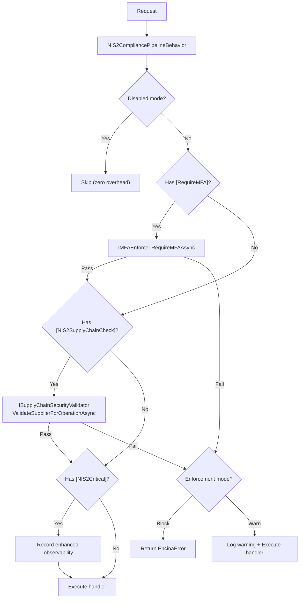
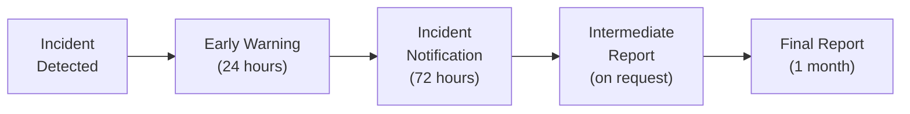

# NIS2 Directive Compliance in Encina

This guide explains how to enforce NIS2 Directive (EU 2022/2555) cybersecurity requirements declaratively at the CQRS pipeline level using the `Encina.Compliance.NIS2` package. Compliance validation operates independently of the transport layer, ensuring consistent Article 21 enforcement across all entry points.

## Table of Contents

1. [Overview](#overview)
2. [The Problem](#the-problem)
3. [The Solution](#the-solution)
4. [Quick Start](#quick-start)
5. [NIS2Critical Attribute](#nis2critical-attribute)
6. [RequireMFA Attribute](#requiremfa-attribute)
7. [NIS2SupplyChainCheck Attribute](#nis2supplychaincheck-attribute)
8. [The 10 Mandatory Measures](#the-10-mandatory-measures)
9. [Measure Evaluators](#measure-evaluators)
10. [Incident Notification Timeline](#incident-notification-timeline)
11. [Supply Chain Security](#supply-chain-security)
12. [Encryption Validation](#encryption-validation)
13. [Management Accountability](#management-accountability)
14. [Entity Classification](#entity-classification)
15. [Configuration Options](#configuration-options)
16. [Enforcement Modes](#enforcement-modes)
17. [Observability](#observability)
18. [Health Check](#health-check)
19. [Error Handling](#error-handling)
20. [Cross-Cutting Integrations](#cross-cutting-integrations)
21. [Best Practices](#best-practices)
22. [Testing](#testing)
23. [FAQ](#faq)

---

## Overview

Encina.Compliance.NIS2 provides attribute-based NIS2 compliance enforcement at the CQRS pipeline level:

| Component | Description |
|-----------|-------------|
| **`[NIS2Critical]` Attribute** | Marks request types as critical infrastructure operations for enhanced monitoring |
| **`[RequireMFA]` Attribute** | Requires multi-factor authentication before request execution (Art. 21(2)(j)) |
| **`[NIS2SupplyChainCheck]` Attribute** | Validates supplier risk level before request execution (Art. 21(2)(d)) |
| **`NIS2CompliancePipelineBehavior`** | Pipeline behavior that evaluates all NIS2 attributes and compliance checks |
| **`INIS2ComplianceValidator`** | Evaluates the overall compliance posture across all 10 mandatory measures |
| **`INIS2IncidentHandler`** | Manages the four-phase incident notification timeline (Art. 23(4)) |
| **`IMFAEnforcer`** | Pluggable MFA enforcement (default: claim-based check) |
| **`IEncryptionValidator`** | Validates encryption at rest and in transit (Art. 21(2)(h)) |
| **`ISupplyChainSecurityValidator`** | Validates supplier security posture (Art. 21(2)(d)) |
| **`INIS2MeasureEvaluator`** | Pluggable evaluator interface — one implementation per Art. 21(2) measure |
| **`NIS2Options`** | Configuration for entity type, sector, enforcement mode, measures, and suppliers |

### Why Pipeline-Level NIS2 Compliance?

| Benefit | Description |
|---------|-------------|
| **Automatic enforcement** | Compliance is validated whenever a decorated request enters the pipeline |
| **Declarative** | NIS2 requirements live with the request types, not scattered across services |
| **Transport-agnostic** | Same compliance enforcement for HTTP, message queue, gRPC, and serverless |
| **Stateless rule engine** | No database dependency — evaluates configured state at runtime |
| **Pluggable** | Replace any default service (MFA, encryption, supply chain) with custom implementations |
| **Observable** | Every check emits OpenTelemetry traces, metrics, and structured log events |

---

## The Problem

The NIS2 Directive (EU 2022/2555) imposes strict cybersecurity obligations on essential and important entities across 18 sectors in the EU:

- **10 mandatory measures** (Art. 21(2)) with no systematic tracking or validation
- **Incident notification deadlines** (24h/72h/1mo) with no automated timeline management
- **Supply chain security** requirements (Art. 21(2)(d)) with no automated risk validation
- **MFA enforcement** (Art. 21(2)(j)) implemented inconsistently across entry points
- **Encryption policies** (Art. 21(2)(h)) with no centralized validation
- **Management accountability** (Art. 20) with no governance tracking
- **Administrative fines** up to EUR 10M or 2% worldwide turnover for non-compliance (Art. 34)

---

## The Solution

Encina solves this with a unified compliance pipeline:



---

## Quick Start

### 1. Install the Package

```bash
dotnet add package Encina.Compliance.NIS2
```

### 2. Register Services

```csharp
services.AddEncina(config =>
    config.RegisterServicesFromAssemblyContaining<Program>());

services.AddEncinaNIS2(options =>
{
    options.EntityType = NIS2EntityType.Essential;
    options.Sector = NIS2Sector.DigitalInfrastructure;
    options.EnforcementMode = NIS2EnforcementMode.Block;
    options.EnforceMFA = true;
    options.CompetentAuthority = "csirt@authority.eu";
    options.AddHealthCheck = true;

    // Declare organizational measures
    options.HasRiskAnalysisPolicy = true;
    options.HasIncidentHandlingProcedures = true;
    options.HasBusinessContinuityPlan = true;
});
```

### 3. Decorate Requests

```csharp
[NIS2Critical(Description = "Core payment processing")]
[RequireMFA(Reason = "Financial transaction")]
[NIS2SupplyChainCheck("payment-provider")]
public sealed record ProcessPaymentCommand(decimal Amount)
    : ICommand<PaymentResult>;
```

The pipeline behavior handles the rest: MFA is validated, the supplier risk level is checked, and enhanced observability is recorded for the critical operation.

---

## NIS2Critical Attribute

Marks a request as a critical infrastructure operation under NIS2 Article 21. The pipeline behavior records enhanced observability data (activity spans, metrics) for the request execution.

```csharp
[NIS2Critical(Description = "DNS resolution service — digital infrastructure")]
public sealed record ResolveDnsQuery(string Domain)
    : IQuery<DnsResult>;
```

| Property | Type | Default | Description |
|----------|------|---------|-------------|
| `Description` | `string?` | `null` | Reason this operation is considered critical |

---

## RequireMFA Attribute

Requires multi-factor authentication per Art. 21(2)(j). The pipeline invokes `IMFAEnforcer.RequireMFAAsync` before the handler executes.

```csharp
[RequireMFA(Reason = "Administrative operation requiring elevated authentication")]
public sealed record AdminOperationCommand : ICommand<Unit>;
```

| Property | Type | Default | Description |
|----------|------|---------|-------------|
| `Reason` | `string?` | `null` | Reason MFA is required (included in errors and audit trail) |

---

## NIS2SupplyChainCheck Attribute

Validates a supplier's security posture before processing the request per Art. 21(2)(d). Supports `AllowMultiple` for requests involving multiple suppliers.

```csharp
[NIS2SupplyChainCheck("cloud-provider")]
[NIS2SupplyChainCheck("data-processor", MinimumRiskLevel = SupplierRiskLevel.Medium)]
public sealed record MigrateDataCommand(string DataSetId) : ICommand<Unit>;
```

| Property | Type | Default | Description |
|----------|------|---------|-------------|
| `SupplierId` | `string` | (required) | Supplier ID as registered via `NIS2Options.AddSupplier()` |
| `MinimumRiskLevel` | `SupplierRiskLevel` | `Medium` | Suppliers at or above this risk level are flagged |

---

## The 10 Mandatory Measures

Article 21(2) defines 10 mandatory cybersecurity risk-management measures. Each has a dedicated evaluator:

| # | Measure | Article | Evaluator |
|---|---------|---------|-----------|
| 1 | Risk analysis and security policies | (a) | `RiskAnalysisEvaluator` |
| 2 | Incident handling | (b) | `IncidentHandlingEvaluator` |
| 3 | Business continuity and crisis management | (c) | `BusinessContinuityEvaluator` |
| 4 | Supply chain security | (d) | `SupplyChainSecurityEvaluator` |
| 5 | Network and system security (SDLC, CVD) | (e) | `NetworkSecurityEvaluator` |
| 6 | Effectiveness assessment | (f) | `EffectivenessAssessmentEvaluator` |
| 7 | Cyber hygiene and training | (g) | `CyberHygieneEvaluator` |
| 8 | Cryptography and encryption | (h) | `CryptographyEvaluator` |
| 9 | HR security and access control | (i) | `HumanResourcesSecurityEvaluator` |
| 10 | Multi-factor authentication | (j) | `MultiFactorAuthenticationEvaluator` |

---

## Measure Evaluators

Each measure evaluator implements `INIS2MeasureEvaluator` and is registered as a singleton via `TryAddEnumerable`. You can replace or extend individual evaluators.

The `INIS2ComplianceValidator` orchestrates all 10 evaluators and returns `NIS2ComplianceResult` with:

- `IsCompliant` — Whether all 10 measures are satisfied
- `CompliancePercentage` — Percentage of satisfied measures (0-100)
- `MissingCount` — Number of unsatisfied measures
- `MissingMeasures` — List of unsatisfied measure identifiers
- `EntityType` / `Sector` — Entity classification context
- `EvaluatedAtUtc` — Timestamp of the evaluation

---

## Incident Notification Timeline

Article 23(4) defines a four-phase incident notification process:



| Phase | Enum Value | Deadline | Content |
|-------|------------|----------|---------|
| **Early Warning** | `EarlyWarning` | 24 hours | Whether incident is suspected malicious, cross-border impact |
| **Incident Notification** | `IncidentNotification` | 72 hours | Severity, impact assessment, indicators of compromise |
| **Intermediate Report** | `IntermediateReport` | On request | Status updates per CSIRT/authority request |
| **Final Report** | `FinalReport` | 1 month | Detailed description, root cause, mitigation, cross-border impact |

Use `INIS2IncidentHandler` to manage the notification lifecycle:

```csharp
// Report new incident
var result = await handler.ReportIncidentAsync(incident);

// Advance to next phase
var advanceResult = await handler.AdvancePhaseAsync(incidentId);
```

---

## Supply Chain Security

Register suppliers via `NIS2Options.AddSupplier()` and validate them with `[NIS2SupplyChainCheck]`:

```csharp
services.AddEncinaNIS2(options =>
{
    options.AddSupplier("payment-provider", supplier =>
    {
        supplier.Name = "PayCorp";
        supplier.RiskLevel = SupplierRiskLevel.High;
        supplier.LastAssessmentAtUtc = DateTimeOffset.UtcNow.AddMonths(-3);
        supplier.CertificationStatus = "ISO 27001";
    });

    options.AddSupplier("cloud-provider", supplier =>
    {
        supplier.Name = "CloudCo";
        supplier.RiskLevel = SupplierRiskLevel.Low;
        supplier.CertificationStatus = "SOC 2 Type II";
    });
});
```

Risk levels: `Low`, `Medium`, `High`, `Critical`.

---

## Encryption Validation

Configure encrypted data categories and endpoints to validate Art. 21(2)(h) compliance:

```csharp
services.AddEncinaNIS2(options =>
{
    options.EnforceEncryption = true;

    // Data at rest
    options.EncryptedDataCategories.Add("PII");
    options.EncryptedDataCategories.Add("FinancialData");

    // Data in transit
    options.EncryptedEndpoints.Add("https://api.example.com");
    options.EncryptedEndpoints.Add("https://payments.example.com");
});
```

Replace the default validator with a custom implementation that checks actual infrastructure state:

```csharp
services.AddSingleton<IEncryptionValidator, InfrastructureEncryptionValidator>();
services.AddEncinaNIS2(options => { ... });
```

---

## Management Accountability

Article 20 requires management body members to approve cybersecurity measures and complete cybersecurity training:

```csharp
services.AddEncinaNIS2(options =>
{
    options.ManagementAccountability = new ManagementAccountabilityRecord
    {
        ApprovedByManagement = true,
        ApprovalDateUtc = new DateTimeOffset(2026, 1, 15, 0, 0, 0, TimeSpan.Zero),
        TrainingCompletedByManagement = true,
        TrainingDateUtc = new DateTimeOffset(2026, 2, 1, 0, 0, 0, TimeSpan.Zero)
    };
});
```

---

## Entity Classification

### Entity Types (Art. 3)

| Type | Supervision | Maximum Fines (Art. 34) |
|------|-------------|------------------------|
| **Essential** | Ex-ante (proactive supervision) | EUR 10,000,000 or 2% worldwide annual turnover |
| **Important** | Ex-post (reactive supervision) | EUR 7,000,000 or 1.4% worldwide annual turnover |

### Sectors (Annexes I and II)

**Annex I — Sectors of High Criticality (11):**
Energy, Transport, Banking, Financial Market Infrastructure, Health, Drinking Water, Waste Water, Digital Infrastructure, ICT Service Management, Public Administration, Space

**Annex II — Other Critical Sectors (7):**
Postal and Courier, Waste Management, Chemical Manufacturing, Food Production, Manufacturing, Digital Providers, Research

---

## Configuration Options

See [README Configuration Options](../../src/Encina.Compliance.NIS2/README.md#configuration-options) for the full table of `NIS2Options` properties.

---

## Enforcement Modes

| Mode | Behavior | Use Case |
|------|----------|----------|
| `Block` | Returns `Left<EncinaError>` — handler not invoked | Production with mature compliance |
| `Warn` | Logs warning, executes handler normally | Migration/rollout phase (default) |
| `Disabled` | No-op — no checks, no logging, no metrics | Development environments |

---

## Observability

### Tracing

`Encina.Compliance.NIS2` ActivitySource with 5 activity types:

| Activity | Tags |
|----------|------|
| `NIS2.Pipeline` | `nis2.request_type`, `nis2.enforcement_mode`, `nis2.outcome` |
| `NIS2.ComplianceCheck` | `nis2.entity_type`, `nis2.sector`, `nis2.outcome` |
| `NIS2.MeasureEvaluation` | `nis2.measure`, `nis2.outcome` |
| `NIS2.IncidentReport` | `nis2.incident_id`, `nis2.incident_severity`, `nis2.outcome` |
| `NIS2.SupplyChainAssessment` | `nis2.supplier_id`, `nis2.supplier_risk_level`, `nis2.outcome` |

### Metrics

9 counters and 4 histograms under the `Encina.Compliance.NIS2` Meter:

**Counters:**
- `nis2.pipeline.executions.total` — Pipeline behavior invocations
- `nis2.compliance.checks.total` — Aggregate compliance validations
- `nis2.measure.evaluations.total` — Individual measure evaluations
- `nis2.mfa.checks.total` — MFA enforcement checks
- `nis2.supply_chain.checks.total` — Supply chain validations
- `nis2.encryption.checks.total` — Encryption validations
- `nis2.incident.reports.total` — Incident report submissions
- `nis2.incident.deadline_checks.total` — Notification deadline checks
- `nis2.supply_chain.assessments.total` — Supplier risk assessments

**Histograms:**
- `nis2.pipeline.duration.ms` — Pipeline execution duration
- `nis2.compliance.check.duration.ms` — Compliance validation duration
- `nis2.measure.evaluation.duration.ms` — Measure evaluation duration
- `nis2.supply_chain.assessment.duration.ms` — Supply chain assessment duration

### Logging

Structured log events via `[LoggerMessage]` source generator (EventIds 9200-9209) for zero-allocation logging.

---

## Health Check

Enable via `NIS2Options.AddHealthCheck = true`. The health check (`encina-nis2-compliance`) resolves `INIS2ComplianceValidator` via a scoped service provider and runs a full compliance validation:

| Status | Condition |
|--------|-----------|
| **Healthy** | All 10 measures satisfied |
| **Degraded** | Some measures satisfied, gaps exist (reports percentage and missing measures) |
| **Unhealthy** | Validation failed or threw an exception |

Tags: `encina`, `nis2`, `compliance`, `security`, `ready`

---

## Error Handling

All operations return `Either<EncinaError, T>`. Error codes follow the `nis2.*` convention:

| Code | Article | Meaning |
|------|---------|---------|
| `nis2.compliance_check_failed` | 21(2) | Overall compliance validation failed |
| `nis2.measure_not_satisfied` | 21(2) | Specific measure not satisfied |
| `nis2.mfa_required` | 21(2)(j) | MFA not enabled for decorated request |
| `nis2.encryption_required` | 21(2)(h) | Encryption requirements not met |
| `nis2.supplier_risk_high` | 21(2)(d) | Supplier risk exceeds threshold |
| `nis2.deadline_exceeded` | 23(4) | Notification deadline exceeded |
| `nis2.management_accountability_missing` | 20 | Management accountability not configured |
| `nis2.pipeline_blocked` | — | Request blocked by enforcement |

---

## Cross-Cutting Integrations

Encina.Compliance.NIS2 integrates with several Encina cross-cutting modules to provide resilience, caching, multi-tenancy, breach notification forwarding, encryption infrastructure verification, and GDPR alignment. All integrations are **opt-in** — they activate only when the corresponding service is registered in the DI container.

### Resilience

All external service calls (caching, breach notification, encryption key verification, GDPR registry) are protected by `NIS2ResilienceHelper`, an internal helper that provides two-tier resilience:

1. **Polly v8 pipeline** — If a `ResiliencePipelineProvider<string>` is registered and contains the pipeline key `"nis2-external"`, all external calls execute through that pipeline. This allows you to configure retry, circuit breaker, bulkhead, and timeout policies centrally.

2. **Timeout fallback** — If no Polly pipeline is registered (or the key is missing), calls are protected by a simple `CancellationTokenSource` timeout configured via `NIS2Options.ExternalCallTimeout` (default: 5 seconds).

In both tiers, any exception is caught and a safe fallback value is returned — compliance evaluation never fails due to an infrastructure outage.

```csharp
// Register a Polly pipeline for NIS2 external calls
services.AddResiliencePipeline("nis2-external", builder =>
{
    builder
        .AddRetry(new RetryStrategyOptions { MaxRetryAttempts = 2 })
        .AddCircuitBreaker(new CircuitBreakerStrategyOptions())
        .AddTimeout(TimeSpan.FromSeconds(3));
});

// Configure the fallback timeout (used when no Polly pipeline is registered)
services.AddEncinaNIS2(options =>
{
    options.ExternalCallTimeout = TimeSpan.FromSeconds(10);
});
```

### Caching

Compliance validation results are cached when an `ICacheProvider` is registered in the DI container. This avoids re-evaluating the 10 mandatory measures on every request.

| Option | Type | Default | Description |
|--------|------|---------|-------------|
| `ComplianceCacheTTL` | `TimeSpan` | 5 minutes | How long compliance results are cached. Set to `TimeSpan.Zero` to disable caching. |

Cache reads and writes are protected by `NIS2ResilienceHelper` — a cache failure never prevents compliance evaluation.

### Multi-Tenancy

When `IRequestContext` is registered and provides a `TenantId`, compliance results are cached per-tenant. The cache key includes the tenant identifier, ensuring tenant isolation:

```
nis2:compliance:{tenantId}   // when TenantId is available
nis2:compliance:global        // when no TenantId
```

This ensures that each tenant's compliance posture is evaluated and cached independently.

### Breach Notification Forwarding

When `IBreachNotificationService` (from `Encina.Compliance.BreachNotification`) is registered, significant incidents reported via `INIS2IncidentHandler.ReportIncidentAsync` are automatically forwarded to the breach notification system. The NIS2 incident severity is mapped to breach severity:

| NIS2 Severity | Breach Severity |
|---------------|-----------------|
| `Critical` | `Critical` |
| `High` | `High` |
| `Medium` | `Medium` |
| `Low` | `Low` |

Forwarding is awaited and protected by `NIS2ResilienceHelper` — a breach notification service failure does not prevent the NIS2 incident from being reported successfully.

### Encryption Infrastructure Verification

When `IKeyProvider` (from `Encina.Security.Encryption`) is registered, the `DefaultEncryptionValidator.ValidateEncryptionPolicyAsync` method goes beyond configuration checks and verifies that the encryption infrastructure has an active key. This catches misconfigured key vaults or expired keys:

- Configuration declares encryption categories → `true` (policy exists)
- `IKeyProvider` registered with active key → `true` (infrastructure verified)
- `IKeyProvider` registered but no active key or error → `false` (infrastructure mismatch)
- No `IKeyProvider` registered → config-only validation (no infrastructure check)

### GDPR Alignment (Art. 35)

The `RiskAnalysisEvaluator` (Art. 21(2)(a)) integrates with `Encina.Compliance.GDPR` when `IProcessingActivityRegistry` is registered. It queries the registry to count active processing activities, enriching the evaluation details with DPIA (Data Protection Impact Assessment) context per Art. 35. This creates a bridge between NIS2 risk analysis and GDPR processing activity tracking.

---

## Best Practices

1. **Start with `Warn` mode** — Deploy with `NIS2EnforcementMode.Warn` first to identify compliance gaps without disrupting operations
2. **Set all measure flags** — Even if your evaluators are simple policy checks, declare the organizational measures you have in place
3. **Register all suppliers** — Every third-party dependency should be in the supplier registry with an assessed risk level
4. **Configure `CompetentAuthority`** — Required for incident reporting workflows in production
5. **Enable the health check** — Provides continuous compliance posture visibility
6. **Replace default services** — The default `IMFAEnforcer` checks claims; integrate with your real identity provider
7. **Track management accountability** — Set `ManagementAccountability` to demonstrate Art. 20 compliance
8. **Combine with other compliance packages** — Use alongside `Encina.Compliance.BreachNotification` for GDPR breach notification and `Encina.Security` for authorization

---

## Testing

```csharp
// Fully compliant test scenario
services.AddEncinaNIS2(options =>
{
    options.EntityType = NIS2EntityType.Essential;
    options.Sector = NIS2Sector.DigitalInfrastructure;
    options.EnforcementMode = NIS2EnforcementMode.Block;
    options.EnforceMFA = true;
    options.EnforceEncryption = true;

    // Declare all measures as satisfied
    options.HasRiskAnalysisPolicy = true;
    options.HasIncidentHandlingProcedures = true;
    options.HasBusinessContinuityPlan = true;
    options.HasNetworkSecurityPolicy = true;
    options.HasEffectivenessAssessment = true;
    options.HasCyberHygieneProgram = true;
    options.HasHumanResourcesSecurity = true;

    options.EncryptedDataCategories.Add("PII");
    options.EncryptedEndpoints.Add("https://api.test.com");
});

// Non-compliant test scenario (to verify enforcement)
services.AddEncinaNIS2(options =>
{
    options.EnforcementMode = NIS2EnforcementMode.Block;
    options.HasRiskAnalysisPolicy = false; // Missing measure
});
```

---

## FAQ

**Q: Does this package replace a GRC (Governance, Risk, Compliance) platform?**
A: No. It provides automated runtime compliance checks at the application level. Use it alongside your GRC platform to ensure technical controls match documented policies.

**Q: Can I use this without the pipeline behavior?**
A: Yes. You can inject `INIS2ComplianceValidator` and `INIS2IncidentHandler` directly for programmatic use without decorating requests with attributes.

**Q: What happens when enforcement is `Disabled`?**
A: The pipeline behavior is a complete no-op — no attribute detection, no validation, no logging, no metrics.

**Q: Does this package store incidents in a database?**
A: The core package is stateless. The default `INIS2IncidentHandler` operates in-memory. For persistent incident tracking, register a custom `INIS2IncidentHandler` that integrates with your incident management system or SIEM.

**Q: Which sectors are covered?**
A: All 18 sectors from NIS2 Annexes I (11 sectors of high criticality) and Annex II (7 other critical sectors), from Energy and Transport to Digital Providers and Research.
