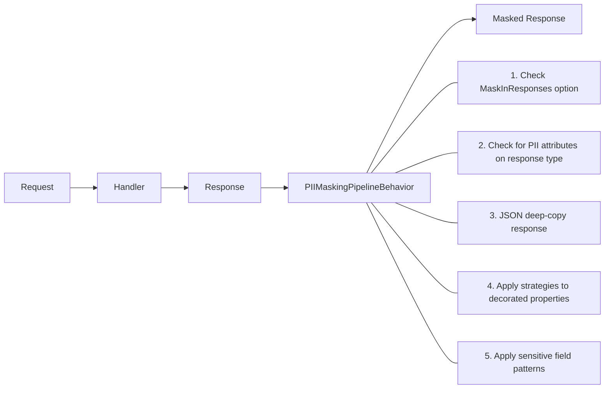

# PII Masking in Encina

Automatic masking of personally identifiable information at the CQRS pipeline level.

## Table of Contents

1. [Overview](#overview)
2. [The Problem](#the-problem)
3. [Quick Start](#quick-start)
4. [Attributes](#attributes)
5. [Masking Strategies](#masking-strategies)
6. [Masking Modes](#masking-modes)
7. [Configuration](#configuration)
8. [Pipeline Integration](#pipeline-integration)
9. [Audit Trail Integration](#audit-trail-integration)
10. [Logging Extensions](#logging-extensions)
11. [Custom Strategies](#custom-strategies)
12. [Observability](#observability)
13. [Health Check](#health-check)
14. [Error Handling](#error-handling)
15. [Testing](#testing)
16. [Troubleshooting](#troubleshooting)

---

## Overview

| Component | Description |
|-----------|-------------|
| **`IPIIMasker`** | Core masking interface — `Mask(string, PIIType)`, `Mask(string, pattern)`, `MaskObject<T>(T)` |
| **`IMaskingStrategy`** | Extensible strategy interface for custom masking logic |
| **`PIIMaskingPipelineBehavior`** | Post-handler behavior — masks PII in response objects automatically |
| **`PIIOptions`** | Configuration — modes, strategies, field patterns, health check, tracing |
| **`PIIAttribute`** | Declarative attribute — marks properties with PII type and masking mode |

**Key characteristics**:

- **Attribute-based** — decorate properties with `[PII(PIIType.Email)]`
- **9 built-in strategies** — one per PII type, all customizable
- **JSON deep-copy** — original objects are never mutated
- **Zero overhead** for requests without PII attributes
- **Audit integration** — implements `IPiiMasker` from `Encina.Security.Audit`

---

## The Problem

Without Encina, PII masking requires manual, error-prone code scattered across your application:

```csharp
// Without Encina — manual masking everywhere
public class GetUserHandler
{
    public async Task<UserResponse> Handle(GetUserQuery query)
    {
        var user = await _repository.GetAsync(query.Id);

        // Manual masking — easy to forget, inconsistent
        return new UserResponse
        {
            Email = MaskEmail(user.Email),        // Custom helper
            Phone = MaskPhone(user.Phone),        // Another helper
            SSN = "***-**-" + user.SSN[^4..],     // Inline logic
            Name = user.Name                       // Forgot to mask!
        };
    }
}
```

---

## Quick Start

### 1. Install

```bash
dotnet add package Encina.Security.PII
```

### 2. Register Services

```csharp
services.AddEncinaPII(options =>
{
    options.MaskInResponses = true;     // Mask response objects
    options.MaskInLogs = true;          // Enable log masking extensions
    options.MaskInAuditTrails = true;   // Mask audit entries
    options.DefaultMode = MaskingMode.Partial;
});
```

### 3. Decorate Properties

```csharp
public sealed record UserResponse
{
    [PII(PIIType.Email)]
    public string Email { get; init; }

    [PII(PIIType.Phone)]
    public string Phone { get; init; }

    [PII(PIIType.SSN)]
    public string SSN { get; init; }

    public string DisplayName { get; init; }  // Not masked
}
```

### 4. Results

The pipeline automatically masks response properties:

| Property | Original | Masked |
|----------|----------|--------|
| Email | `user@example.com` | `u***@example.com` |
| Phone | `555-123-4567` | `***-***-4567` |
| SSN | `123-45-6789` | `***-**-6789` |
| DisplayName | `John` | `John` (unchanged) |

---

## Attributes

### `[PII]` — Primary Attribute

```csharp
// Basic usage — type determines masking strategy
[PII(PIIType.Email)]
public string Email { get; set; }

// With explicit mode (Mode = MaskingMode.Hash needs a HashKey, see "Hash mode and its key")
[PII(PIIType.CreditCard, Mode = MaskingMode.Full)]
public string CardNumber { get; set; }

// With custom pattern (regex)
[PII(PIIType.Custom, Pattern = @"\b\d{3}-\d{2}-\d{4}\b")]
public string CustomField { get; set; }

// With fixed replacement
[PII(PIIType.Custom, Replacement = "[CLASSIFIED]")]
public string TopSecret { get; set; }
```

### `[SensitiveData]` — Lightweight Marker

```csharp
// Defaults to PIIType.Custom + MaskingMode.Full
[SensitiveData]
public string ApiKey { get; set; }

// With explicit mode
[SensitiveData(MaskingMode.Redact)]
public string Password { get; set; }
```

### `[MaskInLogs]` — Log-Only Masking

```csharp
// Masked only when using PIILoggerExtensions, not in responses
[MaskInLogs]
public string InternalId { get; set; }

[MaskInLogs(MaskingMode.Hash)]
public string CorrelationToken { get; set; }
```

A Hash attribute (`[MaskInLogs(MaskingMode.Hash)]` or `[PII(..., Mode = MaskingMode.Hash)]`) needs a usable `PIIOptions.HashKey`. Without one (missing or blank, and no `AllowUnkeyedHash`) the value becomes `[REDACTED]`; a key set must be at least 32 UTF-8 bytes to pass validation; a blank key still redacts when `AllowUnkeyedHash` is `true`. See [Hash mode and its key](#hash-mode-and-its-key).

---

## Masking Strategies

### Built-in Strategies

| PIIType | Input | Output (Partial) | Strategy |
|---------|-------|-------------------|----------|
| `Email` | `user@example.com` | `u***@example.com` | Preserves domain, masks local part |
| `Phone` | `555-123-4567` | `***-***-4567` | Shows last 4 digits |
| `CreditCard` | `4111-1111-1111-1111` | `****-****-****-1111` | Shows last 4, preserves dashes |
| `SSN` | `123-45-6789` | `***-**-6789` | Shows last 4, preserves dashes |
| `Name` | `John Doe` | `J*** D**` | Shows first char per word |
| `Address` | `123 Main St, City, ST` | `*** **** **, City, ST` | Masks street, preserves city/state |
| `DateOfBirth` | `01/15/1990` | `**/**/1990` | Preserves year, masks month/day |
| `IPAddress` | `192.168.1.100` | `192.168.***.***` | Masks last two octets |
| `Custom` | `SensitiveData` | `**************` | Full masking fallback |

---

## Masking Modes

| Mode | Description | Example (Email) |
|------|-------------|-----------------|
| **Partial** | Show selected characters | `u***@example.com` |
| **Full** | Replace all characters | `***@example.com` |
| **Hash** | Deterministic keyed hash: HMAC-SHA256, lowercase hex (64 characters), key from `PIIOptions.HashKey` | `a1b2c3d4e5f6...` |
| **Tokenize** | Passthrough for external systems | `user@example.com` (unchanged) |
| **Redact** | Fixed replacement text | `[REDACTED]` |

### Hash mode and its key

`MaskingMode.Hash` computes HMAC-SHA256 over the UTF-8 value, keyed by `PIIOptions.HashKey` (a UTF-8 string). The same value and key always give the same hash, so you can correlate records. Changing the key changes every hash, so hashes made under different keys do not correlate.

Hash mode fails closed:

- `DefaultMode = MaskingMode.Hash` without a key throws `OptionsValidationException` from `AddEncinaPII` and again at startup (`ValidateOnStart`). An empty or whitespace key is invalid.
- The check inside `AddEncinaPII` sees only the `configure` delegate of that call, so set `HashKey` (and `AllowUnkeyedHash`) in the same delegate. Options bound or configured elsewhere are validated by `ValidateOnStart` instead.
- Masking in Hash mode (selected by an attribute, or by `DefaultMode` when validation was skipped) while no key and no opt-out exist replaces the value with `[REDACTED]`; this covers a property masked through a strategy (no `Pattern` or `Replacement` on its attribute). An error is logged once per `PIIType`, not on every call (EventId 8020).
- A blank (empty or whitespace) key that skipped validation is treated like a missing key: values are redacted, never hashed with it. This holds even when `AllowUnkeyedHash` is `true`: the opt-out covers a missing key (`null`), not a blank one.
- `PIIOptionsValidator` requires a key to be at least `PIIOptions.MinimumHashKeyBytes` (32) UTF-8 bytes, the HMAC-SHA256 output length. A shorter key fails validation at `AddEncinaPII` and at startup (`ValidateOnStart`), whatever the default mode. The length counts UTF-8 bytes, not characters, so a 32-character string with accented or non-Latin characters can be longer than 32 bytes, and 16 such characters can already be enough. The masker itself does not re-check the length: a short key that skipped validation still hashes, so keep validation on.
- Use a random key, for example 32 random bytes encoded as base64 (44 characters), generated once and kept in a secret store.
- The explicit opt-out `PIIOptions.AllowUnkeyedHash = true` keeps a plain, unkeyed SHA-256. One warning is logged per service provider (host), when the options are validated with the opt-out set and no key, whatever the default mode (EventId 8019).

An unkeyed SHA-256 of a low-entropy value (SSN, phone number, date of birth) can be reversed with a dictionary attack. Load the key from a secret store, never from source code. `HashKey` is excluded from JSON serialization and from `ToString()`. `MaskingOptions.HashKey` carries the key to custom `IMaskingStrategy` implementations.

```csharp
services.AddEncinaPII(options =>
{
    options.DefaultMode = MaskingMode.Hash;
    // At least 32 UTF-8 bytes, for example 32 random bytes as base64, read from a secret store
    options.HashKey = configuration["Pii:HashKey"];
});
```

---

## Configuration

### PIIOptions Reference

| Property | Type | Default | Description |
|----------|------|---------|-------------|
| `DefaultMode` | `MaskingMode` | `Partial` | Default masking mode for all strategies |
| `HashKey` | `string?` | `null` | Secret key for `MaskingMode.Hash` (HMAC-SHA256); at least `MinimumHashKeyBytes` (32) UTF-8 bytes when set; required when `DefaultMode` is `Hash` unless `AllowUnkeyedHash` is set; never serialized or printed |
| `AllowUnkeyedHash` | `bool` | `false` | Explicit opt-out that lets Hash run without a key using unkeyed SHA-256; logs one warning per service provider when the options are validated without a key |
| `MaskInResponses` | `bool` | `true` | Enable pipeline behavior for responses |
| `MaskInLogs` | `bool` | `true` | Enable `PIILoggerExtensions` masking |
| `MaskInAuditTrails` | `bool` | `true` | Enable `MaskForAudit` integration |
| `AddHealthCheck` | `bool` | `false` | Register `PIIHealthCheck` |
| `EnableTracing` | `bool` | `false` | Enable OpenTelemetry tracing |
| `EnableMetrics` | `bool` | `false` | Enable OpenTelemetry metrics |

### Sensitive Field Patterns

Automatically mask fields matching these patterns (convention-based):

```csharp
// Default patterns (9):
// password, secret, token, key, credential, authorization, ssn, creditcard, cvv

// Add custom patterns:
options.AddSensitiveFieldPattern("apiKey");
options.AddSensitiveFieldPattern("accessToken");
```

---

## Pipeline Integration

The `PIIMaskingPipelineBehavior` operates as a post-handler behavior:



**Skip conditions** (zero overhead):

- `PIIOptions.MaskInResponses = false`
- Response is `Either.Left` (error path)
- Response type has no PII attributes and no sensitive field matches

---

## Audit Trail Integration

`PIIMasker` implements `IPiiMasker` from `Encina.Security.Audit`, enabling automatic PII redaction in audit entries:

```csharp
// Both interfaces resolve to the same singleton instance
var piiMasker = provider.GetRequiredService<IPIIMasker>();
var auditMasker = provider.GetRequiredService<IPiiMasker>();
// piiMasker == auditMasker (same instance)
```

The audit pipeline uses `MaskForAudit<T>()` to redact PII before persisting audit records.

---

## Logging Extensions

Mask PII before it reaches log sinks:

```csharp
// Level-aware — skips masking when log level is disabled
logger.LogInformationMasked(masker, "User registered: {@User}", user);
logger.LogWarningMasked(masker, "Failed login for: {@User}", user);
logger.LogErrorMasked(masker, ex, "Error processing: {@Order}", order);

// Custom level
logger.LogMasked(masker, LogLevel.Debug, "Debug data: {@Data}", data);
```

**Safety**: If masking fails, the original message is logged with `[MASKING FAILED]` prefix — never silently drops logs.

---

## Custom Strategies

### Implement `IMaskingStrategy`

```csharp
public sealed class PhoneLastSixStrategy : IMaskingStrategy
{
    public string Apply(string value, MaskingOptions options)
    {
        var digits = new string(value.Where(char.IsDigit).ToArray());
        if (digits.Length < 6) return new string(options.MaskCharacter, value.Length);
        return new string(options.MaskCharacter, digits.Length - 6)
            + digits[^6..];
    }
}
```

### Register via Options

```csharp
services.AddEncinaPII(options =>
{
    options.AddStrategy<PhoneLastSixStrategy>(PIIType.Phone);
});
```

The custom strategy is resolved from DI — register it as a service if it has dependencies.

---

## Observability

### OpenTelemetry Tracing

Activities created under `Encina.Security.PII` ActivitySource:

| Activity | Tags |
|----------|------|
| `PII.MaskObject` | `pii.type_name`, `pii.property_count`, `pii.masked_count`, `pii.outcome` |
| `PII.MaskProperty` | `pii.property_name`, `pii.type`, `pii.strategy` |
| `PII.ApplyStrategy` | `pii.mode`, `pii.type` |

### Metrics

Instruments under `Encina.Security.PII` Meter:

| Instrument | Type | Description |
|------------|------|-------------|
| `pii.masking.operations` | Counter | Total masking operations |
| `pii.masking.properties` | Counter | Properties masked |
| `pii.masking.errors` | Counter | Masking failures |
| `pii.masking.duration` | Histogram | Operation duration (ms) |
| `pii.pipeline.operations` | Counter | Pipeline-level masking operations |

---

## Health Check

```csharp
services.AddEncinaPII(options =>
{
    options.AddHealthCheck = true;
});
```

The `PIIHealthCheck` verifies:

1. **Service resolution** — `IPIIMasker` is resolvable from DI
2. **Strategy availability** — all 9 built-in strategies are registered
3. **Masking probe** — masks a test email and verifies the output differs from input

Returns `Healthy`, `Degraded` (some strategies missing), or `Unhealthy` (critical failure).

---

## Error Handling

| Error Code | Description | Metadata |
|------------|-------------|----------|
| `pii.masking_failed` | Masking operation error | `piiType`, `propertyName` |
| `pii.strategy_not_found` | No strategy for PIIType | `piiType` |
| `pii.invalid_configuration` | Invalid options | `stage` |

---

## Testing

### Unit Testing with Mocks

```csharp
var masker = Substitute.For<IPIIMasker>();
masker.Mask("user@example.com", PIIType.Email).Returns("u***@example.com");
masker.MaskObject(Arg.Any<UserResponse>()).Returns(callInfo =>
{
    var original = callInfo.Arg<UserResponse>();
    return original with { Email = "u***@example.com" };
});
```

### Integration Testing with Real DI

```csharp
var services = new ServiceCollection();
services.AddEncinaPII();
var provider = services.BuildServiceProvider();
var masker = provider.GetRequiredService<IPIIMasker>();

var result = masker.Mask("user@example.com", PIIType.Email);
Assert.Contains("***", result);
Assert.Contains("@example.com", result);
```

---

## Troubleshooting

### Properties Not Being Masked

- Verify the property has `[PII]`, `[SensitiveData]`, or `[MaskInLogs]` attribute
- Only `string` properties with public getters AND setters are supported
- `PIIOptions.MaskInResponses` must be `true` (default)
- Check if the response is on the error path (`Either.Left` bypasses masking)

### Performance Considerations

- Property metadata is cached per type via `ConcurrentDictionary` — first access incurs reflection cost, subsequent calls are O(1) lookup
- JSON serialization creates a deep copy — for hot paths with large objects, consider disabling response masking and using `Mask(string, PIIType)` directly
- Hash mode computes HMAC-SHA256 — slightly slower than Partial/Full but deterministic for a given key

### Masking Not Applied in Logs

- Ensure `PIIOptions.MaskInLogs = true`
- Use `PIILoggerExtensions` methods (`LogInformationMasked`, etc.) — standard `ILogger` methods don't mask
- If the log level is disabled, masking is skipped for performance

## Performance

<!-- docref-table: bench:security/*-partial -->
<!-- /docref-table -->

<!-- docref-table: bench:security/mask-* -->
<!-- /docref-table -->

*See [security benchmark results](../benchmarks/security-benchmark-results.md) for detailed analysis.*
