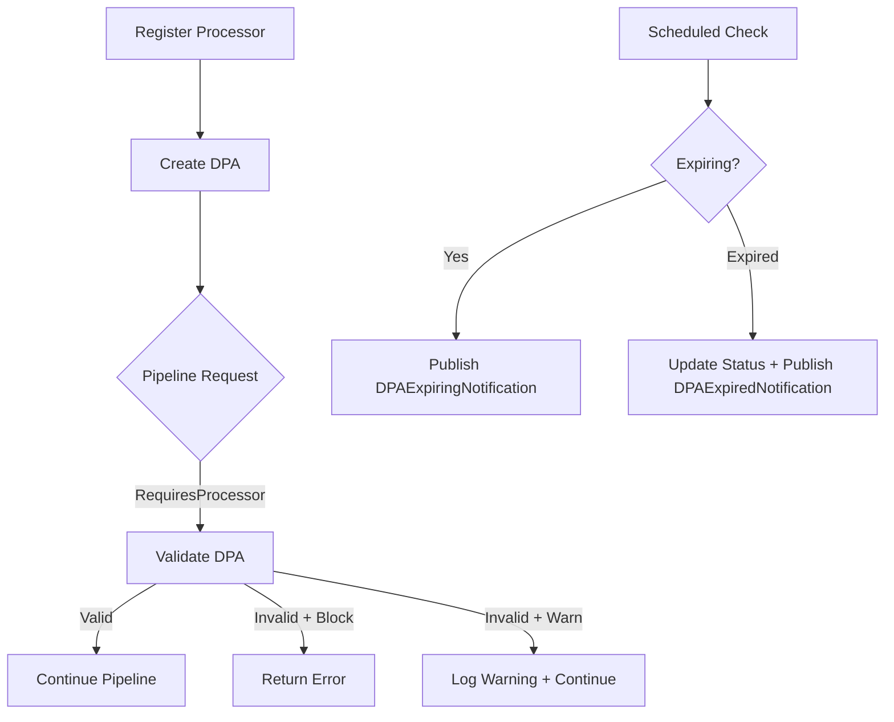
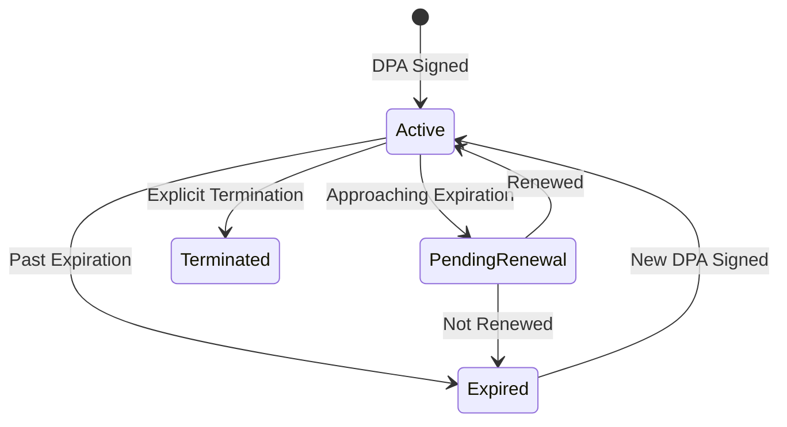

# Processor Agreements (GDPR Article 28)

GDPR Article 28 compliance for managing Data Processing Agreements (DPAs) between controllers and processors. Provides a complete lifecycle for processor registration, DPA validation, sub-processor hierarchy tracking, mandatory terms compliance, and pipeline-level enforcement.

**Package**: `Encina.Compliance.ProcessorAgreements`
**Issue**: [#410](https://github.com/dlrivada/Encina/issues/410)

---

## Table of Contents

1. [The Problem](#the-problem)
2. [The Solution](#the-solution)
3. [Quick Start](#quick-start)
4. [Core Concepts](#core-concepts)
5. [Mandatory Terms (Art. 28(3))](#mandatory-terms-art-283)
6. [Sub-Processor Management (Art. 28(2))](#sub-processor-management-art-282)
7. [Pipeline Enforcement](#pipeline-enforcement)
8. [Expiration Monitoring](#expiration-monitoring)
9. [Notifications](#notifications)
10. [Database Providers](#database-providers)
11. [Observability](#observability)
12. [Error Codes](#error-codes)
13. [Configuration Reference](#configuration-reference)
14. [Best Practices](#best-practices)
15. [Testing](#testing)
16. [FAQ](#faq)

---

## The Problem

GDPR Article 28 requires controllers to:

1. Only use processors providing sufficient guarantees (Art. 28(1))
2. Obtain authorization before engaging sub-processors (Art. 28(2))
3. Ensure DPAs contain eight mandatory contractual terms (Art. 28(3))
4. Maintain accountability through documentation and audit trails (Art. 5(2))

Without automated enforcement, organizations risk:

- Processing data through processors without valid agreements
- Missing mandatory contractual clauses
- Unauthorized sub-processor chains
- Expired agreements going undetected
- Incomplete audit trails during supervisory authority inspections

## The Solution

`Encina.Compliance.ProcessorAgreements` separates **processor identity** from **contractual state**, providing:



**Key design decisions:**

- **Identity vs. State**: `IProcessorRegistry` tracks who processors are; `IDPAStore` tracks contractual agreements
- **Bounded hierarchy**: Sub-processor depth limited to prevent unbounded chains
- **Railway Oriented Programming**: All operations return `Either<EncinaError, T>`
- **Provider coherence**: All 13 database providers supported

## Quick Start

### 1. Install

```bash
dotnet add package Encina.Compliance.ProcessorAgreements
```

### 2. Configure

```csharp
services.AddEncina(config =>
    config.RegisterServicesFromAssemblyContaining<Program>());

services.AddEncinaProcessorAgreements(options =>
{
    options.EnforcementMode = ProcessorAgreementEnforcementMode.Block;
    options.MaxSubProcessorDepth = 3;
    options.ExpirationWarningDays = 30;
    options.EnableExpirationMonitoring = true;
    options.TrackAuditTrail = true;
    options.AddHealthCheck = true;
});
```

### 3. Register Processors and DPAs

```csharp
// Register a processor
var processor = new Processor
{
    Id = "stripe-payments",
    Name = "Stripe Inc.",
    Country = "US",
    ContactEmail = "privacy@stripe.com",
    Depth = 0,
    SubProcessorAuthorizationType = SubProcessorAuthorizationType.Specific,
    CreatedAtUtc = DateTimeOffset.UtcNow,
    LastUpdatedAtUtc = DateTimeOffset.UtcNow
};

await registry.RegisterProcessorAsync(processor);

// Create a DPA with all mandatory terms
var dpa = new DataProcessingAgreement
{
    Id = Guid.NewGuid().ToString(),
    ProcessorId = "stripe-payments",
    Status = DPAStatus.Active,
    SignedAtUtc = DateTimeOffset.UtcNow,
    ExpiresAtUtc = DateTimeOffset.UtcNow.AddYears(2),
    HasSCCs = true,
    ProcessingPurposes = ["Payment processing", "Fraud detection"],
    MandatoryTerms = new DPAMandatoryTerms
    {
        ProcessOnDocumentedInstructions = true,
        ConfidentialityObligations = true,
        SecurityMeasures = true,
        SubProcessorRequirements = true,
        DataSubjectRightsAssistance = true,
        ComplianceAssistance = true,
        DataDeletionOrReturn = true,
        AuditRights = true
    },
    CreatedAtUtc = DateTimeOffset.UtcNow,
    LastUpdatedAtUtc = DateTimeOffset.UtcNow
};

await store.AddAsync(dpa);
```

### 4. Enforce at Pipeline Level

```csharp
[RequiresProcessor(ProcessorId = "stripe-payments")]
public sealed record ProcessPaymentCommand(decimal Amount)
    : ICommand<Either<EncinaError, PaymentResult>>;
```

## Core Concepts

### Processor (Identity Entity)

A `Processor` represents the long-lived identity of a data processor or sub-processor. It tracks:

- **Who** the processor is (name, country, contact)
- **Where** in the hierarchy (parent, depth)
- **How** sub-processors are authorized (Specific vs. General)

Processors are registered once and updated as needed. They are independent of any specific DPA.

### DataProcessingAgreement (Temporal Contract)

A `DataProcessingAgreement` represents the contractual state between controller and processor. It has a lifecycle:



**Constraint**: At most one Active DPA per processor at any time.

### DPAValidator (Compliance Engine)

`DefaultDPAValidator` performs multi-step validation:

1. Verify processor exists in `IProcessorRegistry`
2. Retrieve active DPA from `IDPAStore`
3. Check DPA status is Active and not expired
4. Verify all eight mandatory terms are present
5. Check SCC requirements for cross-border processors
6. Return `DPAValidationResult` with detailed findings

## Mandatory Terms (Art. 28(3))

GDPR Article 28(3) requires eight mandatory contractual terms. `DPAMandatoryTerms` tracks each:

| Property | Article | Requirement |
|----------|---------|-------------|
| `ProcessOnDocumentedInstructions` | 28(3)(a) | Process only on documented controller instructions |
| `ConfidentialityObligations` | 28(3)(b) | Persons authorized to process have committed to confidentiality |
| `SecurityMeasures` | 28(3)(c) | Take all measures required pursuant to Article 32 |
| `SubProcessorRequirements` | 28(3)(d) | Respect conditions for engaging sub-processors |
| `DataSubjectRightsAssistance` | 28(3)(e) | Assist controller in responding to data subject requests |
| `ComplianceAssistance` | 28(3)(f) | Assist controller in ensuring compliance with Articles 32-36 |
| `DataDeletionOrReturn` | 28(3)(g) | Delete or return all personal data after end of services |
| `AuditRights` | 28(3)(h) | Make available all information necessary for audits |

Use `DPAMandatoryTerms.IsFullyCompliant` to check if all terms are present, or `MissingTerms` to get a list of absent clauses.

## Sub-Processor Management (Art. 28(2))

### Authorization Types

- **Specific**: Controller must approve each individual sub-processor
- **General**: Processor has general authorization but must notify controller of changes

### Hierarchy Depth

Sub-processor chains are bounded by `MaxSubProcessorDepth` (default: 3):

```
Controller
└── Stripe (Depth 0, top-level processor)
    └── AWS (Depth 1, sub-processor)
        └── Cloudflare (Depth 2, sub-sub-processor)
            └── ❌ Depth 3 exceeded
```

### Querying the Hierarchy

```csharp
// Direct children only
var subs = await registry.GetSubProcessorsAsync("stripe-payments");

// Full recursive chain
var chain = await registry.GetFullSubProcessorChainAsync("stripe-payments");
```

## Pipeline Enforcement

### How It Works

`ProcessorValidationPipelineBehavior` intercepts any request decorated with `[RequiresProcessor]`:

1. Reads `ProcessorId` from the attribute
2. Calls `IDPAValidator.HasValidDPAAsync(processorId)`
3. Based on `EnforcementMode`:
   - **Block**: Returns `ProcessorAgreementErrors.DPAMissing()` if no valid DPA
   - **Warn**: Logs a warning but allows the request to proceed
   - **Disabled**: No validation performed

### Convenience Configuration

```csharp
// These are equivalent:
options.EnforcementMode = ProcessorAgreementEnforcementMode.Block;
options.BlockWithoutValidDPA = true;
```

## Expiration Monitoring

### Scheduled Command

`CheckDPAExpirationCommand` runs on a configurable schedule:

```csharp
options.EnableExpirationMonitoring = true;
options.ExpirationCheckInterval = TimeSpan.FromHours(1);
options.ExpirationWarningDays = 30;
```

### Behavior

The handler:

1. Queries `IDPAStore.GetExpiringAsync()` for agreements within the warning threshold
2. Queries `IDPAStore.GetByStatusAsync(DPAStatus.Expired)` for already-expired agreements
3. For newly expired: Updates status to `Expired`, publishes `DPAExpiredNotification`
4. For approaching expiration: Publishes `DPAExpiringNotification`
5. Records audit entries if `TrackAuditTrail` is enabled

## Notifications

Seven domain notifications integrate with downstream workflows:

| Notification | Published When | Key Properties |
|-------------|---------------|----------------|
| `ProcessorRegisteredNotification` | Processor registered | `ProcessorId`, `ProcessorName` |
| `DPASignedNotification` | DPA created with Active status | `ProcessorId`, `DPAId`, `SignedAtUtc` |
| `DPAExpiringNotification` | Within expiration warning threshold | `DPAId`, `DaysUntilExpiration` |
| `DPAExpiredNotification` | Past expiration date | `DPAId`, `ExpiredAtUtc` |
| `DPATerminatedNotification` | Status changed to Terminated | `ProcessorId`, `DPAId` |
| `SubProcessorAddedNotification` | Sub-processor registered | `ProcessorId`, `SubProcessorId`, `Depth` |
| `SubProcessorRemovedNotification` | Sub-processor removed | `ProcessorId`, `SubProcessorId` |

## Database Providers

All 13 database providers implement the three store interfaces:

| Provider | Registry | DPA Store | Audit Store |
|----------|----------|-----------|-------------|
| **ADO.NET SQLite** | `ProcessorRegistryADO` | `DPAStoreADO` | `ProcessorAuditStoreADO` |
| **ADO.NET SQL Server** | `ProcessorRegistryADO` | `DPAStoreADO` | `ProcessorAuditStoreADO` |
| **ADO.NET PostgreSQL** | `ProcessorRegistryADO` | `DPAStoreADO` | `ProcessorAuditStoreADO` |
| **ADO.NET MySQL** | `ProcessorRegistryADO` | `DPAStoreADO` | `ProcessorAuditStoreADO` |
| **Dapper SQLite** | `ProcessorRegistryDapper` | `DPAStoreDapper` | `ProcessorAuditStoreDapper` |
| **Dapper SQL Server** | `ProcessorRegistryDapper` | `DPAStoreDapper` | `ProcessorAuditStoreDapper` |
| **Dapper PostgreSQL** | `ProcessorRegistryDapper` | `DPAStoreDapper` | `ProcessorAuditStoreDapper` |
| **Dapper MySQL** | `ProcessorRegistryDapper` | `DPAStoreDapper` | `ProcessorAuditStoreDapper` |
| **EF Core** (all DBs) | `ProcessorRegistryEF` | `DPAStoreEF` | `ProcessorAuditStoreEF` |
| **MongoDB** | `ProcessorRegistryMongoDB` | `DPAStoreMongoDB` | `ProcessorAuditStoreMongoDB` |

### Provider Configuration

```csharp
// EF Core
services.AddEncinaEntityFrameworkCore<AppDbContext>(config =>
{
    config.UseProcessorAgreements = true;
});

// ADO.NET (SQL Server example)
services.AddEncinaAdoSqlServer(connectionString, config =>
{
    config.UseProcessorAgreements = true;
});

// Dapper (PostgreSQL example)
services.AddEncinaDapperPostgreSQL(connectionString, config =>
{
    config.UseProcessorAgreements = true;
});

// MongoDB
services.AddEncinaMongoDB(connectionString, config =>
{
    config.UseProcessorAgreements = true;
});
```

### SQL Migration Scripts

ADO.NET and Dapper providers include migration scripts:

- `025_CreateProcessorsTable.sql`
- `026_CreateDataProcessingAgreementsTable.sql`
- `027_CreateProcessorAgreementAuditEntriesTable.sql`

## Observability

### Tracing

OpenTelemetry activities via `Encina.Compliance.ProcessorAgreements` ActivitySource with semantic attributes:

- `processor.id`, `processor.name`, `processor.country`
- `dpa.id`, `dpa.status`, `dpa.has_sccs`
- `enforcement.mode`, `enforcement.outcome`

### Logging

Structured log events via `[LoggerMessage]` source generator for zero-allocation logging. Log categories include processor registration, DPA validation, pipeline enforcement, and expiration monitoring.

### Health Check

```csharp
options.AddHealthCheck = true;
// Tags: "encina", "compliance", "processor-agreements", "ready"
```

Verifies all four services are resolvable from DI: `IDPAValidator`, `IProcessorRegistry`, `IDPAStore`, `IProcessorAuditStore`.

## Error Codes

| Code | Description | GDPR Reference |
|------|-------------|----------------|
| `processor.not_found` | Processor not registered | Art. 28(1) |
| `processor.already_exists` | Duplicate processor ID | -- |
| `processor.dpa_not_found` | DPA not found by ID | -- |
| `processor.dpa_missing` | No active DPA for processor | Art. 28(3) |
| `processor.dpa_expired` | Agreement past expiration | Art. 28(3) |
| `processor.dpa_terminated` | Agreement explicitly terminated | Art. 28(3)(g) |
| `processor.dpa_pending_renewal` | Approaching expiration | Art. 28(3) |
| `processor.dpa_incomplete` | Missing mandatory terms | Art. 28(3)(a)-(h) |
| `processor.sub_processor_unauthorized` | Sub-processor not authorized | Art. 28(2) |
| `processor.sub_processor_depth_exceeded` | Hierarchy depth limit reached | Art. 28(4) |
| `processor.scc_required` | SCCs needed for cross-border | Art. 46 |
| `processor.store_error` | Persistence layer failure | -- |
| `processor.validation_failed` | General validation failure | -- |

## Configuration Reference

```csharp
services.AddEncinaProcessorAgreements(options =>
{
    // Enforcement
    options.EnforcementMode = ProcessorAgreementEnforcementMode.Block;
    // or: options.BlockWithoutValidDPA = true;

    // Sub-processor limits
    options.MaxSubProcessorDepth = 3; // Range: 1-10

    // Expiration monitoring
    options.EnableExpirationMonitoring = true;
    options.ExpirationCheckInterval = TimeSpan.FromHours(1);
    options.ExpirationWarningDays = 30;

    // Audit and health
    options.TrackAuditTrail = true;
    options.AddHealthCheck = true;
});
```

## Best Practices

1. **Start with Warn mode** during initial rollout, then switch to Block once all processors have valid DPAs
2. **Register processors before creating DPAs** -- the validator checks processor existence first
3. **Set realistic expiration warning days** (30-90 days) to give compliance teams time to renew
4. **Use Specific authorization** for sub-processors unless your organization has a documented general authorization policy
5. **Keep MaxSubProcessorDepth low** (2-3) -- deeper chains are harder to audit
6. **Enable audit trail** for production environments -- it provides accountability evidence during inspections
7. **Monitor DPAExpiringNotification** to prevent service disruption from expired agreements
8. **Validate all processors periodically** using `ValidateAllAsync()` for compliance audits
9. **Use DPATerminatedNotification** to trigger Article 28(3)(g) data deletion/return procedures
10. **Configure health checks** in production for operational monitoring

## Testing

```csharp
// The core package includes in-memory stores registered by default
services.AddEncinaProcessorAgreements(options =>
{
    options.EnforcementMode = ProcessorAgreementEnforcementMode.Block;
});

// InMemoryProcessorRegistry, InMemoryDPAStore, InMemoryProcessorAuditStore
// are all ConcurrentDictionary-based and thread-safe
```

For integration tests against real databases, use the provider-specific packages with Testcontainers.

## FAQ

**Q: Can a processor have multiple active DPAs?**
A: No. The `IDPAStore` enforces at most one Active DPA per processor. To renew, create a new DPA and the previous one transitions to Expired.

**Q: What happens when a request has `[RequiresProcessor]` but the processor has no DPA?**
A: In Block mode, the pipeline returns `ProcessorAgreementErrors.DPAMissing()`. In Warn mode, it logs a warning and continues.

**Q: How does sub-processor depth work?**
A: Top-level processors have `Depth = 0`. Each sub-processor level increments by 1. `MaxSubProcessorDepth` (default: 3) prevents unbounded chains.

**Q: Is the audit trail optional?**
A: Yes, controlled by `TrackAuditTrail` (default: true). Disabling it is not recommended for production as it weakens Art. 5(2) accountability.

**Q: Can I use this without the pipeline behavior?**
A: Yes. You can use `IProcessorRegistry`, `IDPAStore`, and `IDPAValidator` directly without the pipeline enforcement.
