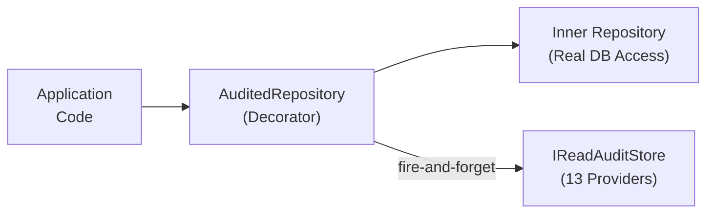

# Read Auditing

## Overview

Encina Read Auditing provides a comprehensive audit trail for read access to sensitive entities. While CUD (Create, Update, Delete) operations are audited at the CQRS pipeline level via `AuditPipelineBehavior`, read operations require separate tracking at the repository level.

Read auditing answers critical compliance questions:

- **GDPR Art. 15**: "Who accessed this patient's data and why?"
- **HIPAA §164.312(b)**: "What protected health information did this user access?"
- **SOX §302/§404**: "Who viewed financial records during the audit period?"
- **PCI-DSS Req. 10.2**: "Who accessed the cardholder data environment?"

## Architecture



### Key Design Decisions

1. **Fire-and-Forget**: Audit recording never blocks read operations. A failed audit entry is logged but the read result is always returned.
2. **Decorator Pattern**: `AuditedRepository<TEntity, TId>` wraps any `IRepository<TEntity, TId>` transparently.
3. **Sampling Support**: High-traffic entities can use lower sampling rates (e.g., 10%) to reduce storage overhead.
4. **Per-Entity Configuration**: Each entity type can be independently registered for read auditing.

## Quick Start

### 1. Mark entities as auditable

```csharp
public class Patient : Entity<PatientId>, IReadAuditable
{
    public string Name { get; set; }
    // ...
}
```

### 2. Register read auditing

```csharp
services.AddEncinaReadAuditing(options =>
{
    options.AuditReadsFor<Patient>();
    options.AuditReadsFor<FinancialRecord>();

    // High-traffic entity with 10% sampling
    options.AuditReadsFor<AuditLog>(samplingRate: 0.1);

    // GDPR Art. 15 compliance
    options.RequirePurpose = true;

    // Skip background jobs
    options.ExcludeSystemAccess = true;

    // Retention policy
    options.RetentionDays = 2555; // 7 years for SOX
    options.EnableAutoPurge = true;
    options.PurgeIntervalHours = 24;
});
```

### 3. Declare access purpose (optional, GDPR)

```csharp
public class GetPatientHandler
{
    private readonly IReadAuditContext _auditContext;

    public async Task<Patient> Handle(GetPatientQuery query)
    {
        _auditContext.WithPurpose("Patient care review");
        return await _repository.GetByIdAsync(query.PatientId);
    }
}
```

## Configuration Options

| Option | Default | Description |
|--------|---------|-------------|
| `Enabled` | `true` | Global kill switch for read auditing |
| `ExcludeSystemAccess` | `false` | Skip auditing when no UserId in request context |
| `RequirePurpose` | `false` | Log warning when purpose is not declared |
| `BatchSize` | `1` | Entries to batch before writing (provider-dependent) |
| `RetentionDays` | `365` | Days to retain audit entries |
| `EnableAutoPurge` | `false` | Enable background purge service |
| `PurgeIntervalHours` | `24` | Hours between purge cycles |

## Supported Providers

Read auditing is implemented for all 13 database providers:

| Category | Provider | Implementation |
|----------|----------|----------------|
| **ADO.NET** | SQLite | `ReadAuditStoreADO` |
| **ADO.NET** | SQL Server | `ReadAuditStoreADO` |
| **ADO.NET** | PostgreSQL | `ReadAuditStoreADO` |
| **ADO.NET** | MySQL | `ReadAuditStoreADO` |
| **Dapper** | SQLite | `ReadAuditStoreDapper` |
| **Dapper** | SQL Server | `ReadAuditStoreDapper` |
| **Dapper** | PostgreSQL | `ReadAuditStoreDapper` |
| **Dapper** | MySQL | `ReadAuditStoreDapper` |
| **EF Core** | All databases | `ReadAuditStoreEF` |
| **MongoDB** | MongoDB | `ReadAuditStoreMongoDB` |

Plus `InMemoryReadAuditStore` for testing.

## Querying Audit Entries

```csharp
// Get access history for a specific entity
var history = await store.GetAccessHistoryAsync("Patient", "PAT-12345");

// Get what a specific user accessed
var userHistory = await store.GetUserAccessHistoryAsync(
    userId: "user-123",
    fromUtc: DateTimeOffset.UtcNow.AddDays(-30),
    toUtc: DateTimeOffset.UtcNow);

// Advanced query with pagination
var query = ReadAuditQuery.Builder()
    .ForUser("user-123")
    .ForEntityType("Patient")
    .WithAccessMethod(ReadAccessMethod.Export)
    .InDateRange(startDate, endDate)
    .WithPageSize(100)
    .OnPage(1)
    .Build();

var result = await store.QueryAsync(query);
```

## Observability

Read auditing integrates with OpenTelemetry:

- **Traces**: `Encina.ReadAudit` activity source with spans for LogRead and Purge operations
- **Metrics**: `encina.read_audit.entries_logged_total`, `encina.read_audit.log_failures_total`, `encina.read_audit.entries_purged_total`
- **Logging**: Structured log messages via `ILogger` with `ReadAuditLog` high-performance logging

## Testing

For unit tests, use `InMemoryReadAuditStore`:

```csharp
var store = new InMemoryReadAuditStore();

// Log entries
await store.LogReadAsync(new ReadAuditEntry { ... });

// Verify
var all = store.GetAllEntries(); // Test helper
store.Count.ShouldBe(1);        // Test helper
store.Clear();                   // Test helper
```

## Related Files

- `src/Encina.Security.Audit/` — Core abstractions and in-memory implementation
- `src/Encina.Security.Audit/AuditedRepository.cs` — Repository decorator
- `src/Encina.Security.Audit/ReadAuditRetentionService.cs` — Background purge service
- `src/Encina.Security.Audit/Diagnostics/` — OpenTelemetry integration
