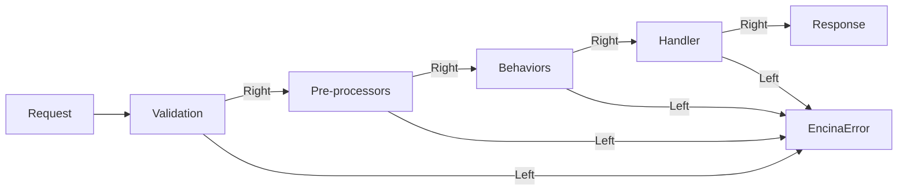
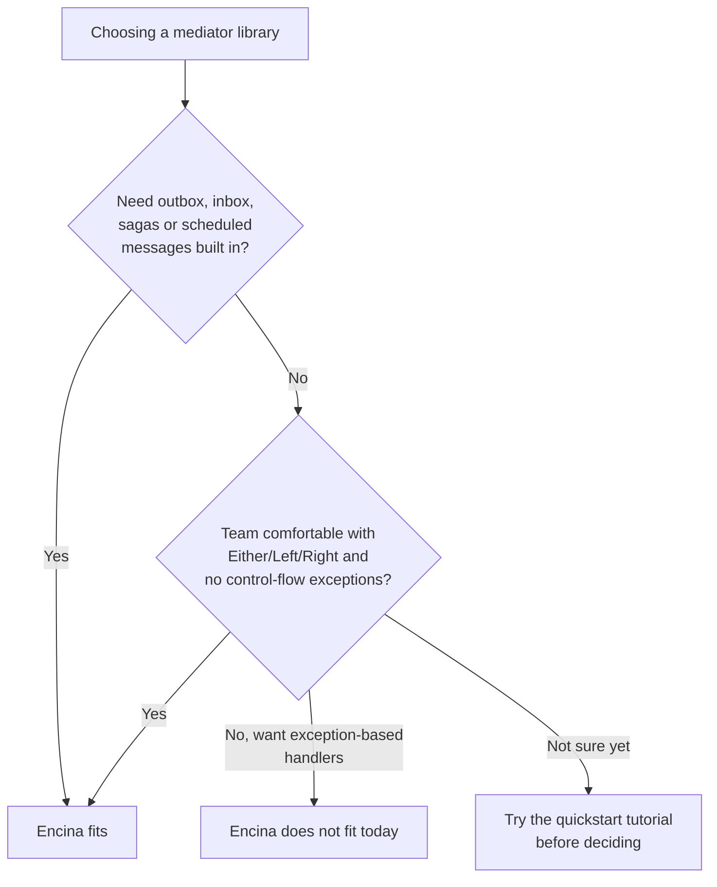

# Introduction and philosophy

This page is for a .NET developer who has not used Encina before and is deciding whether it fits their team. After reading it you will know what Encina is, why it returns `Either<EncinaError, T>` instead of throwing, what "opt-in, pay for what you use" means in practice, and how it compares with MediatR on points you can check yourself.

## What Encina is

Encina is a mediator library for .NET 10, in the same family as MediatR: you define requests (`IRequest<TResponse>`) and notifications (`INotification`), implement handlers, and send them through a pipeline of behaviors instead of calling services directly. The difference is in what the pipeline returns and what ships alongside it.

Every operation returns `Either<EncinaError, TResponse>` rather than throwing on expected failures, and a set of optional [messaging patterns](messaging/index.md) — outbox, inbox, [sagas](messaging/sagas.md), [scheduled messages](features/scheduling.md) — live in the same repository as concrete, provider-backed packages rather than being left to the application to build.

Encina is **pre-1.0**: the public API can still change, and nothing here should be read as a stability promise. [SPEC-000](specifications/SPEC-000-encina-1.0-baseline-and-release-scope.md) is the authoritative statement of what the 1.0 release will contain and how that boundary was decided.

## Why Railway Oriented Programming

Railway Oriented Programming (ROP) is the pattern popularised by [Scott Wlaschin](https://fsharpforfunandprofit.com/rop/): a function either stays on the "success" track or switches to the "failure" track, and once it is on the failure track every following step is skipped until something explicitly handles the error. Encina's pipeline works the same way: requests move through validation, pre-processors, behaviors and the handler, and any step can return `Left<EncinaError>` to switch the whole request to the failure track.

`Send` and `Publish` on `IEncina` return `ValueTask<Either<EncinaError, TResponse>>` and `ValueTask<Either<EncinaError, Unit>>`; `IPipelineBehavior<TRequest, TResponse>.Handle` and every handler follow the same shape. `EncinaError` itself is a small `readonly record struct` with a `Message` and an optional wrapped `Exception`; the `EncinaErrors.Create(code, message, exception, details)` factory attaches a code and a metadata dictionary that a caller reads back with the `EncinaErrorExtensions.GetCode()` and `GetDetails()` extension methods, so a caller can branch on the failure without parsing an exception message.

Three decisions explain why the pipeline is built this way, and each is recorded as an ADR rather than restated here:

- [ADR-001: Railway Oriented Programming for Error Handling](architecture/adr/001-railway-oriented-programming.md) is the original decision to use `Either<EncinaError, T>` instead of exceptions for expected failures.
- [ADR-004: Decision to NOT Implement `EncinaResult<T>`](architecture/adr/004-reject-mediator-result.md) explains why Encina exposes LanguageExt's `Either` directly instead of wrapping it in a friendlier-looking type.
- [ADR-006: Pure Railway Oriented Programming — Fail-Fast Exception Handling](architecture/adr/006-pure-rop-exception-handling.md) explains why an exception thrown inside a handler or behavior is treated as a bug and is allowed to crash the process, rather than being caught and converted to a `Left`.

## Opt-in design

None of Encina's messaging patterns run unless you turn them on. A minimal application registers the mediator and nothing else; outbox, inbox, sagas and scheduled messages are each a separate configuration flag, and each has its own package per data-access provider so that adding the capability does not add code paths you are not using. [SPEC-000](specifications/SPEC-000-encina-1.0-baseline-and-release-scope.md) is where this scope is fixed for the 1.0 release: which packages ship, which providers a provider-dependent feature must cover, and which decisions were made by the maintainer rather than assumed.

## Comparison with MediatR

Encina and MediatR solve the same request/handler problem; the table below lists only points that are checkable from each project's own public sources. Rows that could not be verified this way are left out.

| Aspect | MediatR | Encina |
| --- | --- | --- |
| Error handling | Handlers throw; MediatR ships `IRequestExceptionHandler<,,>` and `IRequestExceptionAction<,>` to intercept exceptions after the fact ([MediatR README](https://github.com/LuckyPennySoftware/MediatR/blob/master/README.md)) | Handlers return `Either<EncinaError, TResponse>`; an uncaught exception is treated as a bug, not a control-flow signal ([ADR-001](architecture/adr/001-railway-oriented-programming.md), [ADR-006](architecture/adr/006-pure-rop-exception-handling.md)) |
| License | Reciprocal Public License 1.5 or a paid commercial license ([LICENSE.md](https://github.com/LuckyPennySoftware/MediatR/blob/master/LICENSE.md)); the README describes a license-key mechanism ([README](https://github.com/LuckyPennySoftware/MediatR/blob/master/README.md)) | MIT (repository `LICENSE`) |
| Outbox pattern | Not part of MediatR; not mentioned in its README | Built in, with a provider-specific `IOutboxStore` implementation for every supported database (`src/Encina.Messaging/Outbox`, `src/Encina.EntityFrameworkCore/Outbox`, `src/Encina.Dapper.*/Outbox`, `src/Encina.ADO.*/Outbox`, `src/Encina.MongoDB/Outbox`) |
| Sagas | Not part of MediatR; not mentioned in its README | Built in, with a provider-specific `ISagaStore`/`SagaState` implementation for every supported database (`src/Encina.Messaging/Sagas`, and the equivalent folders in the EF Core, Dapper, ADO.NET and MongoDB packages) |

This is not a completeness ranking: MediatR is a smaller, single-purpose library by design, and teams that only need in-process request dispatch may prefer that smaller surface. See [ADR-004](architecture/adr/004-reject-mediator-result.md) for why Encina chose to expose `Either` directly instead of a MediatR-style wrapper.

## When Encina fits and when it does not

Encina fits a team that wants explicit error types in the handler signature and is willing to adopt `Either` for that; it also fits a team that would otherwise build outbox, inbox or saga infrastructure by hand, since those patterns ship as opt-in packages instead. It does not fit a team that wants to keep throwing exceptions for expected failures inside handlers: [ADR-006](architecture/adr/006-pure-rop-exception-handling.md) makes that a fail-fast crash by design, not a supported pattern.

## Next steps

- [Quickstart tutorial](tutorials/quickstart.md) walks through installing Encina and sending your first request.
- [Architecture Decision Records](architecture/adr/index.md) record every design choice referenced above, and the ones that came after it.
- [Features](features/index.md) indexes the reference documentation for outbox, inbox, sagas, scheduling and every other opt-in capability.
