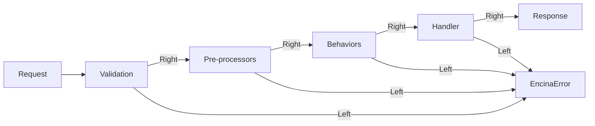
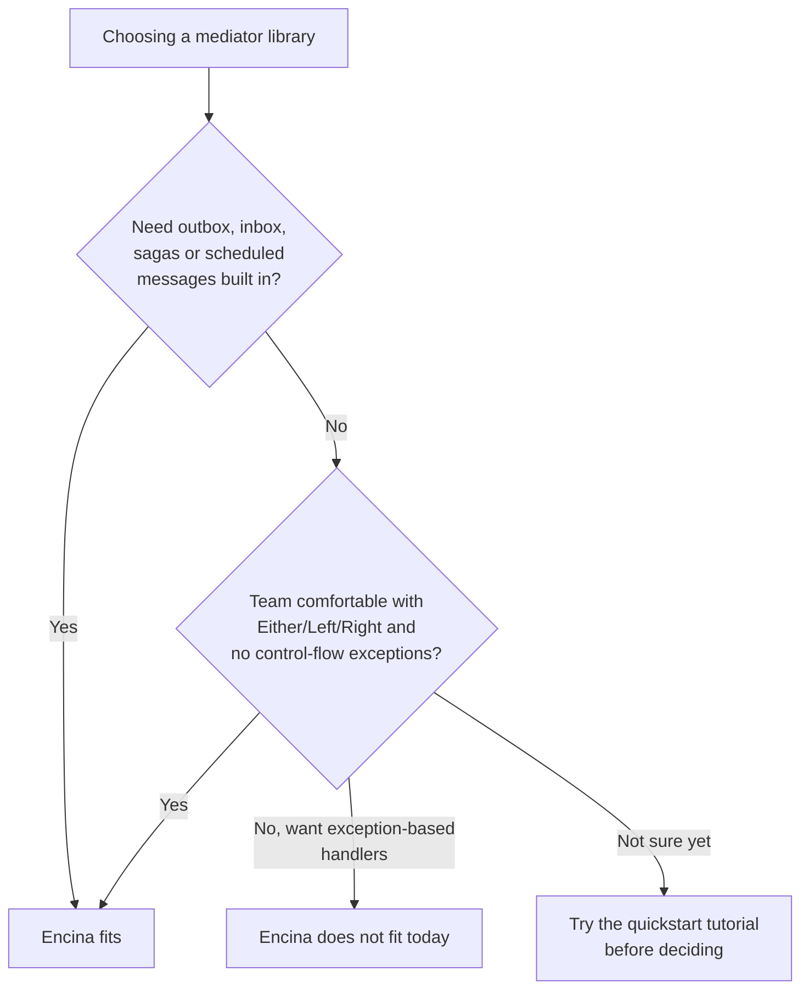

# Introduction and philosophy

This page is for a .NET developer who has not used Encina before and is deciding whether it fits their team. After reading it you will know what Encina is, why it returns `Either<EncinaError, T>` instead of throwing, what "opt-in, pay for what you use" means in practice, and how it compares with MediatR on points you can check yourself.

## What Encina is

Encina is a mediator library for .NET 10, in the same family as MediatR: you define requests (`IRequest<TResponse>`) and notifications (`INotification`), implement handlers, and send them through a pipeline of behaviors instead of calling services directly. The difference is in what the pipeline returns and what ships alongside it.

Every operation returns `Either<EncinaError, TResponse>` rather than throwing on expected failures, and a set of optional [messaging patterns](messaging/index.md) — outbox, inbox, [sagas](messaging/sagas.md), [scheduled messages](features/scheduling.md) — live in the same repository as concrete, provider-backed packages rather than being left to the application to build.

Encina is **pre-1.0**: the public API can still change, and nothing here should be read as a stability promise. [SPEC-000](specifications/SPEC-000-encina-1.0-baseline-and-release-scope.md) is the authoritative statement of what the 1.0 release will contain and how that boundary was decided.

## Why Railway Oriented Programming

Railway Oriented Programming (ROP) is the pattern popularised by [Scott Wlaschin](https://fsharpforfunandprofit.com/rop/): a function either stays on the "success" track or switches to the "failure" track, and once it is on the failure track every following step is skipped until something explicitly handles the error. Encina's pipeline works the same way: requests move through validation, pre-processors, behaviors and the handler, and any step can return `Left<EncinaError>` to switch the whole request to the failure track.

```mermaid
flowchart LR
    A[Request] --> B[Validation]
    B -- Right --> C[Pre-processors]
    C -- Right --> D[Behaviors]
    D -- Right --> E[Handler]
    E -- Right --> F[Response]
    B -- Left --> G[EncinaError]
    C -- Left --> G
    D -- Left --> G
    E -- Left --> G
```

`Send` and `Publish` on `IEncina` return `ValueTask<Either<EncinaError, TResponse>>` and `ValueTask<Either<EncinaError, Unit>>`; `IPipelineBehavior<TRequest, TResponse>.Handle` and every handler follow the same shape. `EncinaError` itself is a small `readonly record struct` with a `Message` and an optional wrapped `Exception`; the `EncinaErrors.Create(code, message, exception, details)` factory attaches a code and a metadata dictionary that a caller reads back with the `EncinaErrorExtensions.GetCode()` and `GetDetails()` extension methods, so a caller can branch on the failure without parsing an exception message.

Three decisions explain why the pipeline is built this way, and each is recorded as an ADR rather than restated here:

- [ADR-001: Railway Oriented Programming for Error Handling](architecture/adr/001-railway-oriented-programming.md) is the original decision to use `Either<EncinaError, T>` instead of exceptions for expected failures.
- [ADR-004: Decision to NOT Implement `EncinaResult<T>`](architecture/adr/004-reject-mediator-result.md) explains why Encina exposes LanguageExt's `Either` directly instead of wrapping it in a friendlier-looking type.
- [ADR-006: Pure Railway Oriented Programming — Fail-Fast Exception Handling](architecture/adr/006-pure-rop-exception-handling.md) explains why an exception thrown inside a handler or behavior is treated as a bug and is left to propagate out of `Send`/`Publish`, rather than being caught and converted to a `Left`.

## Opt-in design

None of Encina's messaging patterns run unless you turn them on. A minimal application registers the mediator and nothing else; outbox, inbox, sagas and scheduled messages are each a separate configuration flag, and each has its own package per data-access provider so that adding the capability does not add code paths you are not using. [SPEC-000](specifications/SPEC-000-encina-1.0-baseline-and-release-scope.md) is where this scope is fixed for the 1.0 release: which packages ship, which providers a provider-dependent feature must cover, and which decisions were made by the maintainer rather than assumed.

## Comparison with MediatR

Encina and MediatR solve the same request/handler problem; the table below lists only points that are checkable from each project's own public sources. Rows that could not be verified this way are left out.

| Aspect | MediatR | Encina |
| --- | --- | --- |
| Error handling | Handlers throw; MediatR ships `IRequestExceptionHandler<,,>` and `IRequestExceptionAction<,>` to intercept exceptions after the fact ([MediatR README](https://github.com/LuckyPennySoftware/MediatR/blob/master/README.md)) | Handlers return `Either<EncinaError, TResponse>`; an uncaught exception is treated as a bug, not a control-flow signal ([ADR-001](architecture/adr/001-railway-oriented-programming.md), [ADR-006](architecture/adr/006-pure-rop-exception-handling.md)) |
| License | Reciprocal Public License 1.5 or a paid commercial license ([LICENSE.md](https://github.com/LuckyPennySoftware/MediatR/blob/master/LICENSE.md)); the README describes a license-key mechanism ([README](https://github.com/LuckyPennySoftware/MediatR/blob/master/README.md)) | MIT (repository `LICENSE`) |
| Outbox pattern | Not part of MediatR; not mentioned in its README | Built in, with a provider-specific `IOutboxStore` implementation for every supported database (`src/Encina.Messaging/Outbox`, `src/Encina.EntityFrameworkCore/Outbox`, `src/Encina.Dapper.*/Outbox`, `src/Encina.ADO.*/Outbox`, `src/Encina.MongoDB/Outbox`) |
| Sagas | Not part of MediatR; not mentioned in its README | Built in, with a provider-specific `ISagaStore`/`SagaState` implementation for every supported database (`src/Encina.Messaging/Sagas`, and the equivalent folders in the EF Core, Dapper, ADO.NET and MongoDB packages) |

This is not a completeness ranking: MediatR is a smaller, single-purpose library by design, and teams that only need in-process request dispatch may prefer that smaller surface. See [ADR-004](architecture/adr/004-reject-mediator-result.md) for why Encina chose to expose `Either` directly instead of a MediatR-style wrapper.

## Where Encina stands

Beyond MediatR, Encina overlaps with messaging frameworks, event-sourcing frameworks and privacy tooling. This section lists what is different and where another product is the better tool for a job; it is not a ranking. Sources were read on 2026-10-10, and "not found" means the research did not find the capability, not that it does not exist. The full topic-by-topic evidence is in the [competitive landscape assessment](engineering/assessments/2026-10-10-competitive-landscape.md).

| Where Encina differs | Evidence |
| --- | --- |
| Failures are `Either` values; none of the surveyed .NET mediators and messaging frameworks was found using a result type (the research's error-model rows list exceptions for all of them) | [MassTransit](https://masstransit.massient.com/), [NServiceBus](https://docs.particular.net/nservicebus/), [Wolverine error handling](https://wolverinefx.net/guide/handlers/error-handling.html) |
| Outbox, inbox, saga and scheduled-message stores share one interface over ADO.NET, Dapper, EF Core and MongoDB; the MassTransit outbox is documented for EF Core and MongoDB | [MassTransit outbox](https://masstransit.massient.com/documentation/configuration/middleware/outbox), [`AGENTS.md`](https://github.com/dlrivada/Encina/blob/main/AGENTS.md) section 5 |
| Consent, data subject rights, retention, NIS2 and AI Act modules run in the application layer; no general-purpose framework with these was found, and ABP's GDPR module is a commercial tier | [ABP GDPR module](https://abp.io/docs/10.5/modules/gdpr), [SPEC-002](specifications/SPEC-002-eu-regulatory-readiness.md) |
| MIT licence for the whole library | [MediatR dual licence](https://www.jimmybogard.com/automapper-and-mediatr-commercial-editions-launch-today/), [MassTransit v9 licence](https://massient.com/license) |

| Choose something else when | Why | Source |
| --- | --- | --- |
| You need durable, replayable long-running workflows | Temporal and Dapr Workflow are workflow runtimes; Encina's sagas persist state but do not replay | [Temporal](https://docs.temporal.io/evaluate/why-temporal), [Dapr Workflow](https://docs.dapr.io/developing-applications/building-blocks/workflow/workflow-overview/) |
| You need failed-message tooling and commercial support today | NServiceBus ships ServiceControl and ServicePulse and sells tiered support; MassTransit v9 and Rebus Pro are commercial offerings. Encina's dead-letter operations API is planned ([#2229](https://github.com/dlrivada/Encina/issues/2229)) | [NServiceBus pricing](https://particular.net/pricing), [MassTransit licence](https://massient.com/license), [Rebus Pro](https://pro.rebus.fm/) |
| You need source-generated dispatch or Native AOT | The Mediator source generator advertises both; Encina's generators are post-1.0 ([#889](https://github.com/dlrivada/Encina/issues/889)) and its benchmarks are planned ([#2231](https://github.com/dlrivada/Encina/issues/2231)) | [Mediator](https://github.com/martinothamar/Mediator) |
| You need a broad transport list or a battle-tested release | Wolverine lists many transports and the older frameworks have years of production use; Encina is pre-1.0 with a single maintainer and open p0 bugs ([list](https://github.com/dlrivada/Encina/issues?q=is%3Aissue+is%3Aopen+label%3Abug+label%3Ap0-mandatory)) | [Wolverine transports](https://wolverinefx.net/guide/messaging/introduction.html) |

## When Encina fits and when it does not

```mermaid
flowchart TD
    A[Choosing a mediator library] --> B{Need outbox, inbox,\nsagas or scheduled\nmessages built in?}
    B -- Yes --> C[Encina fits]
    B -- No --> D{Team comfortable with\nEither/Left/Right and\nno control-flow exceptions?}
    D -- Yes --> C
    D -- No, want exception-based\nhandlers --> E[Encina does not fit today]
    D -- Not sure yet --> F[Try the quickstart tutorial\nbefore deciding]
```

Encina fits a team that wants explicit error types in the handler signature and is willing to adopt `Either` for that; it also fits a team that would otherwise build outbox, inbox or saga infrastructure by hand, since those patterns ship as opt-in packages instead. It does not fit a team that wants to keep throwing exceptions for expected failures inside handlers: `IEncina.Send` and `Publish` catch only `OperationCanceledException` and convert it to `Left<EncinaError>`; any other exception thrown by a handler, behavior or processor propagates out of the call uncaught, and whether that crashes the process depends on the caller and host, not on Encina. [ADR-006](architecture/adr/006-pure-rop-exception-handling.md) records why the pipeline was changed from catching every exception to this fail-fast design.

## Next steps

- [Quickstart tutorial](tutorials/quickstart.md): build a console app that sends your first command and handles both tracks of the result.
- [Architecture Decision Records](architecture/adr/index.md) record every design choice referenced above, and the ones that came after it.
- [Features](features/index.md) indexes the reference documentation for outbox, inbox, sagas, scheduling and every other opt-in capability.
