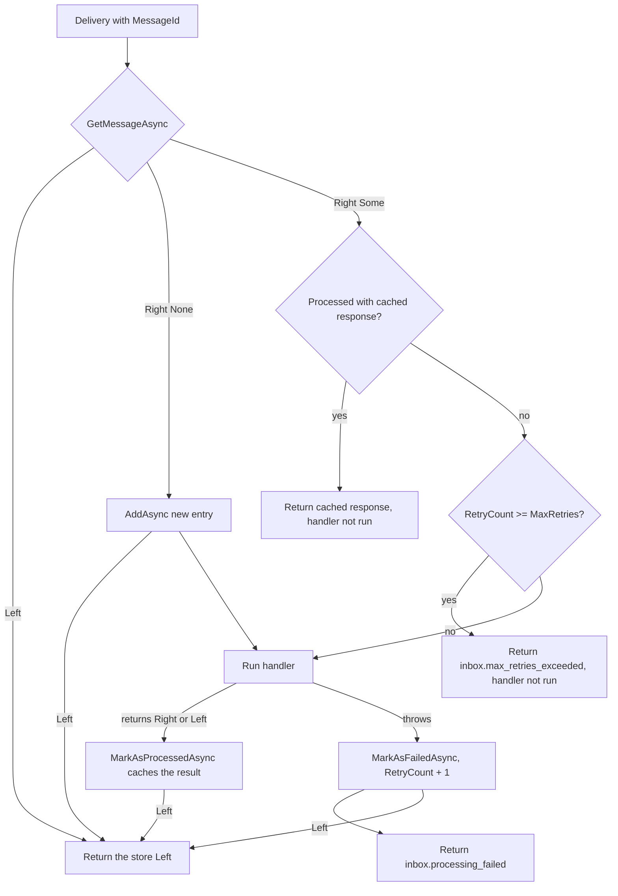

# Inbox Pattern

This page is for developers who receive messages that can arrive more than once (webhooks, queue consumers) and want to understand how Encina makes their processing idempotent, how retries are counted and what the options and error codes mean. The inbox is part of `Encina.Messaging` and is pre-1.0.

## What the inbox does

A message broker or a webhook sender delivers at least once, so the same message can reach a handler twice. The inbox records each message by its `MessageId` (the idempotency key) in a store. The first delivery runs the handler and caches its result; later deliveries of the same `MessageId` get the cached result without running the handler again.

The inbox is opt-in, like every messaging pattern in Encina:

```csharp
services.AddEncinaEntityFrameworkCore<AppDbContext>(config =>
{
    config.UseInbox = true;
    config.InboxOptions.MaxRetries = 3;
});
```

`UseInbox` and `InboxOptions` belong to `MessagingConfiguration`, which each persistence provider's registration method passes to your callback (the example uses the EF Core one). `InboxOptions` is a read-only property; you set its members, you do not replace it.

## How a delivery is processed

`InboxOrchestrator.ProcessAsync` takes the `MessageId`, the request type and a callback that runs your handler. It asks `IInboxStore` for the message and then follows one of three paths.



## How MaxRetries counts attempts

`InboxOptions.MaxRetries` is the maximum number of handler attempts. For sequential deliveries of a message the handler runs at most `MaxRetries` times; with the default of 3 it runs three times. Two limits apply. The inbox does not serialize concurrent redeliveries of the same message, so two concurrent deliveries can both read the same `RetryCount` and both run the handler. And an attempt that crashes the process before `MarkAsFailedAsync` completes is not counted.

Each attempt that throws is recorded by `IInboxStore.MarkAsFailedAsync`. That method is the single place where the message's `RetryCount` grows, by exactly one per failed attempt. When `RetryCount` reaches `MaxRetries`, the next delivery is rejected with `inbox.max_retries_exceeded` and the handler does not run.

Timeline for `MaxRetries = 3` when the handler throws every time:

| Delivery | `RetryCount` before | Handler runs | Result | `RetryCount` after |
|---|---|---|---|---|
| 1 | no entry | yes (attempt 1) | `inbox.processing_failed` | 1 |
| 2 | 1 | yes (attempt 2) | `inbox.processing_failed` | 2 |
| 3 | 2 | yes (attempt 3) | `inbox.processing_failed` | 3 |
| 4 | 3 | no | `inbox.max_retries_exceeded` | 3 |

## Business failures are not failed attempts

Encina uses Railway Oriented Programming: operations return `Either<EncinaError, T>` and a business failure is a `Left`, not an exception ([ADR-001](../architecture/adr/001-railway-oriented-programming.md), [ADR-006](../architecture/adr/006-pure-rop-exception-handling.md)).

- A handler that **returns a `Left`** has finished its work with a business outcome. The inbox caches it as the processed response and does not run the handler again on redelivery. It does not consume attempts. Only the error code is cached, never the error message, because the message can carry personal data. On redelivery the caller receives a `Left` with the code `inbox.cached_error`, whose message is the original error code. A cached `Right` whose value equals `default(T)` (for example `0` or `false`) is returned the same way.
- A handler that **throws** has failed. The attempt is recorded and counts towards `MaxRetries`. The returned error has the code `inbox.processing_failed`, and only the exception type is stored.

## Store errors

Every call the orchestrator makes to `IInboxStore` (`GetMessageAsync`, `AddAsync`, `MarkAsProcessedAsync`, `MarkAsFailedAsync`) returns an `Either`. A `Left` from any of them fails the operation and is returned to the caller as that same `Left`. The orchestrator never reports success when the store failed.

## Providers

The inbox behaves the same on all 10 database providers, because they share the `IInboxStore` contract and `InboxOptions` from `Encina.Messaging` and differ only in implementation:

| Family | Providers |
|---|---|
| ADO.NET | SqlServer, PostgreSQL, MySQL |
| Dapper | SqlServer, PostgreSQL, MySQL |
| EF Core | SqlServer, PostgreSQL, MySQL |
| MongoDB | MongoDB |

Switching provider means changing the DI registration, not the inbox configuration.

Two provider caveats apply:

- The EF Core stores only change tracked entities; the application owns `SaveChanges` and the unit of work. The failure record (`RetryCount`) is therefore persisted only when the unit of work is saved, and a transaction that rolls back on a `Left` discards it.
- The EF Core MySQL variant has its integration tests skipped until Pomelo supports EF Core 10 (issue [#2086](https://github.com/dlrivada/Encina/issues/2086)), so it is verified only by the shared EF Core store code and the other EF Core providers.

## Reference

### InboxOptions

| Option | Type | Default | Effect |
|---|---|---|---|
| `MaxRetries` | `int` | 3 | Maximum handler attempts for one message. |
| `MessageRetentionPeriod` | `TimeSpan` | 30 days | How long a message stays in the inbox so that delayed duplicates are still recognised. Set it longer than your longest expected duplicate delay. |
| `PurgeInterval` | `TimeSpan` | 24 hours | How often expired messages are purged. |
| `EnableAutomaticPurge` | `bool` | `true` | Whether expired messages are purged automatically. |
| `PurgeBatchSize` | `int` | 100 | How many expired messages one purge pass removes. |

### InboxErrorCodes

| Code | Constant | Meaning |
|---|---|---|
| `inbox.missing_message_id` | `MissingMessageId` | An idempotent request arrived without a `MessageId`. |
| `inbox.max_retries_exceeded` | `MaxRetriesExceeded` | `RetryCount` reached `MaxRetries`; the handler was not run. |
| `inbox.deserialization_failed` | `DeserializationFailed` | The cached response could not be deserialized. |
| `inbox.cached_error` | `CachedError` | Redelivery of a message whose cached response was a `Left`, or a `Right` equal to `default(T)`. |
| `inbox.processing_failed` | none (literal in `InboxOrchestrator`) | The handler threw; the attempt was recorded. |

## See also

- [Messaging](index.md) for the other patterns and the persistence providers.
- [Saga Patterns](sagas.md) for distributed transactions with compensation.
