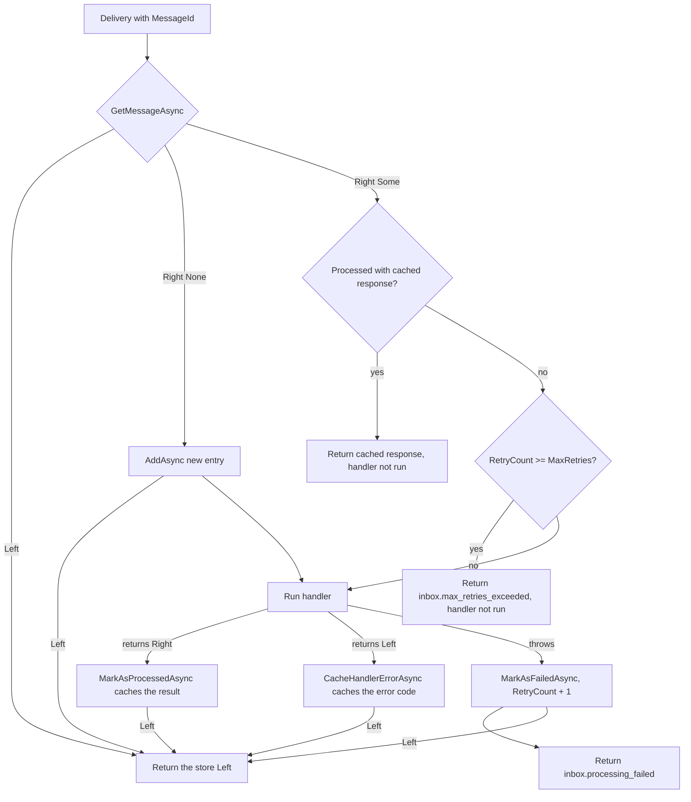

# Inbox Pattern

This page is for developers who receive messages that can arrive more than once (webhooks, queue consumers) and want to understand how Encina makes their processing idempotent, how retries are counted and what the options and error codes mean. The inbox is part of `Encina.Messaging` and is pre-1.0.

## What the inbox does

A message broker or a webhook sender delivers at least once, so the same message can reach a handler twice. The inbox records each message by its `MessageId` (the idempotency key) in a store. The first delivery runs the handler and caches its result; later deliveries of the same `MessageId` get the cached result without running the handler again.

The inbox is opt-in, like every messaging pattern in Encina:

```csharp
services.AddEncinaEntityFrameworkCore<AppDbContext>(config =>
{
    config.UseInbox = true;
    config.InboxOptions.MaxRetries = 3;
});
```

`UseInbox` and `InboxOptions` belong to `MessagingConfiguration`, which the ADO.NET, Dapper and EF Core registration methods pass to your callback (the example uses the EF Core one). The MongoDB provider declares the same two members on `EncinaMongoDbOptions`. `InboxOptions` is a read-only property; you set its members, you do not replace it.

A request enters the inbox when its type implements the marker interface `IIdempotentRequest` and the `IRequestContext` carries an `IdempotencyKey`; that key is the `MessageId`. `InboxPipelineBehavior<TRequest, TResponse>` does the work: a request without the marker skips the inbox, a marked request with no `IdempotencyKey` fails with `inbox.missing_message_id`, and a marked request sent from inside another dispatch without a key of its own runs without an inbox entry, covered by the entry point's one.

## How a delivery is processed

The pipeline behavior calls `InboxOrchestrator.ProcessAsync`, which takes the `MessageId`, the request type, a correlation id, optional `InboxMetadata`, a callback that runs your handler and a `CancellationToken`. It asks `IInboxStore` for the message and then follows one of three paths.



## How MaxRetries counts attempts

`InboxOptions.MaxRetries` is the maximum number of handler attempts. For sequential deliveries of a message the handler runs at most `MaxRetries` times; with the default of 3 it runs three times. Two limits apply. The inbox does not serialize concurrent redeliveries of the same message, so two concurrent deliveries can both read the same `RetryCount` and both run the handler. And an attempt that crashes the process before `MarkAsFailedAsync` completes is not counted.

Each attempt that throws is recorded by `IInboxStore.MarkAsFailedAsync`. That method is the single place where the message's `RetryCount` grows, by exactly one per failed attempt. When `RetryCount` reaches `MaxRetries`, the next delivery is rejected with `inbox.max_retries_exceeded` and the handler does not run.

Timeline for `MaxRetries = 3` when the handler throws every time:

| Delivery | `RetryCount` before | Handler runs | Result | `RetryCount` after |
|---|---|---|---|---|
| 1 | no entry | yes (attempt 1) | `inbox.processing_failed` | 1 |
| 2 | 1 | yes (attempt 2) | `inbox.processing_failed` | 2 |
| 3 | 2 | yes (attempt 3) | `inbox.processing_failed` | 3 |
| 4 | 3 | no | `inbox.max_retries_exceeded` | 3 |

## Business failures are not failed attempts

Encina uses Railway Oriented Programming: operations return `Either<EncinaError, T>` and a business failure is a `Left`, not an exception ([ADR-001](../architecture/adr/001-railway-oriented-programming.md), [ADR-006](../architecture/adr/006-pure-rop-exception-handling.md)).

- A handler that **returns a `Left`** has finished its work with a business outcome. The inbox caches it as the processed response and does not run the handler again on redelivery. It does not consume attempts. Only the error code is cached, never the error message, because the message can carry personal data. On redelivery the caller receives a `Left` with the code `inbox.cached_error`, whose message is the original error code. A cached `Right` whose value equals `default(T)` (for example `0`, `false` or `Unit`) is still a success: on redelivery it is returned as that `Right`, not as `inbox.cached_error`.
- A handler that **throws** has failed. The attempt is recorded and counts towards `MaxRetries`. The returned error has the code `inbox.processing_failed`, and only the exception type is stored.
- A **cancellation requested by the caller's `CancellationToken`** is not a failed attempt: the `OperationCanceledException` is rethrown, nothing is recorded and `RetryCount` does not change. An `OperationCanceledException` that the caller's token did not cause (for example an internal timeout) is treated like any other exception and counts as a failed attempt.

## Store errors

Every call the orchestrator makes to `IInboxStore` (`GetMessageAsync`, `AddAsync`, `MarkAsProcessedAsync`, `CacheHandlerErrorAsync`, `MarkAsFailedAsync`) returns an `Either`. A `Left` from any of them fails the operation and is returned to the caller as that same `Left`. The orchestrator never reports success when the store failed.

## Providers

The inbox behaves the same on all 10 database providers, because they share the `IInboxStore` contract and `InboxOptions` from `Encina.Messaging` and differ only in implementation:

| Family | Providers |
|---|---|
| ADO.NET | SqlServer, PostgreSQL, MySQL |
| Dapper | SqlServer, PostgreSQL, MySQL |
| EF Core | SqlServer, PostgreSQL, MySQL |
| MongoDB | MongoDB |

Switching provider means changing the DI registration; the inbox options (`InboxOptions`) stay the same.

The EF Core MySQL variant has its integration tests skipped until Pomelo supports EF Core 10 (issue [#2086](https://github.com/dlrivada/Encina/issues/2086)), so it is verified only by the shared EF Core store code and the other EF Core providers.

## The inbox and the business transaction

A request can run inside a business transaction (the Transaction pattern: `TransactionPipelineBehavior`, registered before the inbox behavior in `AddMessagingServices`, `AddMessagingServicesCore` and the EF Core registration), which rolls back on a `Left` or an exception. `IInboxStore` therefore splits its writes in two kinds, so that the processed mark follows the business effect while the failure records survive the rollback ([ADR-048](../architecture/adr/048-inbox-record-vs-business-transaction.md)):

| Kind | `IInboxStore` methods | Behavior |
|---|---|---|
| Enlisted | `MarkAsProcessedAsync`, `GetMessageAsync`, `GetExpiredMessagesAsync`, `RemoveExpiredMessagesAsync` | Join the active business transaction. |
| Independent | `AddAsync`, `MarkAsFailedAsync`, `CacheHandlerErrorAsync` | Commit on their own, outside the business transaction. |

`InboxOrchestrator` sends a handler `Right` to `MarkAsProcessedAsync`, a handler `Left` to `CacheHandlerErrorAsync` and a thrown exception to `MarkAsFailedAsync`. If the business commit fails after a successful handler, the processed mark rolls back with it: the message stays unprocessed and the redelivery runs the handler again. The entry and the failure records are never lost.

| Family | Mechanism |
|---|---|
| ADO.NET, Dapper | The store reads the open transaction from `IDbTransactionAccessor` through `DbLease`. Enlisted writes use it; independent writes use the shared connection when no transaction is open and otherwise an opened clone of the connection. A connection that decorates another one implements `IWrappedDbConnection` and exposes it as `InnerConnection` (the module-isolation `SchemaValidatingConnection` does); `DbLease` follows the chain to find the business transaction and clones the innermost connection. The innermost connection must implement `ICloneable` (`SqlConnection`, `NpgsqlConnection` and `MySqlConnection` do) and every decorator must implement `IWrappedDbConnection`; otherwise the independent write fails with a `Left`. |
| EF Core | Independent writes run on an isolated `DbContext` built from the injected context's options, with its own connection. `MarkAsProcessedAsync` runs on the injected context and joins its current transaction. Relational providers use `ExecuteUpdate`, so `RetryCount + 1` is atomic. |
| MongoDB | The pipeline has no business transaction, so every write is immediate. |

EF Core requirements:

- The `DbContext` type has a public constructor taking `DbContextOptions<TContext>`; `InboxStoreEF.ValidateContextType` checks it at registration.
- The `DbContext` is configured with a connection string, not a shared `DbConnection` instance; otherwise the first inbox write fails with a `Left`.

Limits:

- While a business transaction is open, each independent write uses a second pooled connection, so size the connection pool for it.
- Under a repeatable-read or serializable `[Transaction]`, the lock taken by the lookup on the business connection can block an independent write until the command timeout.
- The ADO.NET and Dapper `UnitOfWork` (an explicit `IUnitOfWork` transaction) is not visible to the inbox.
- Concurrent redeliveries of one message are not serialized; `MaxRetries` holds for sequential deliveries.

## Reference

### InboxOptions

| Option | Type | Default | Effect |
|---|---|---|---|
| `MaxRetries` | `int` | 3 | Maximum handler attempts for one message. |
| `MessageRetentionPeriod` | `TimeSpan` | 30 days | How long a message stays in the inbox so that delayed duplicates are still recognised. Set it longer than your longest expected duplicate delay. |
| `PurgeInterval` | `TimeSpan` | 24 hours | How often expired messages are purged. |
| `EnableAutomaticPurge` | `bool` | `true` | Whether expired messages are purged automatically. |
| `PurgeBatchSize` | `int` | 100 | How many expired messages one purge pass removes. |

### InboxErrorCodes

| Code | Constant | Meaning |
|---|---|---|
| `inbox.missing_message_id` | `MissingMessageId` | An `IIdempotentRequest` arrived with no `IdempotencyKey` in its `IRequestContext`. |
| `inbox.max_retries_exceeded` | `MaxRetriesExceeded` | `RetryCount` reached `MaxRetries`; the handler was not run. |
| `inbox.deserialization_failed` | `DeserializationFailed` | The cached response could not be deserialized. |
| `inbox.cached_error` | `CachedError` | Redelivery of a message whose cached response was a `Left`. |
| `inbox.processing_failed` | none (literal in `InboxOrchestrator`) | The handler threw; the attempt was recorded. |

## See also

- [Messaging](index.md) for the other patterns and the persistence providers.
- [Saga Patterns](sagas.md) for distributed transactions with compensation.
