# Saga Patterns in Encina

This guide explains the two saga strategies available in Encina for managing distributed transactions: **Orchestration** and **Choreography**.

## Table of Contents

1. [Overview](#overview)
2. [Decision Flowchart](#decision-flowchart)
3. [Orchestration Sagas](#orchestration-sagas)
4. [Choreography Sagas](#choreography-sagas)
5. [Comparison Table](#comparison-table)
6. [Examples](#examples)
7. [FAQ](#faq)

---

## Overview

Distributed transactions across multiple services cannot use traditional ACID transactions. Instead, we use the **Saga Pattern** to maintain data consistency through a sequence of local transactions with compensating actions for rollback.

Encina provides **two mutually exclusive strategies**:

| Strategy | Coordination | Best For |
|----------|--------------|----------|
| **Orchestration** | Centralized coordinator | Well-defined workflows, critical business processes |
| **Choreography** | Decentralized events | Loosely coupled services, high scalability |

> **Important**: Choose ONE strategy for your application. Mixing both creates complexity without benefits.

---

## Decision Flowchart

Use this flowchart to choose the right strategy:

```mermaid
flowchart TD
    A{Do you need a clear, linear flow<br/>with well-defined steps?}
    A -->|YES| B{Is monitoring/visibility<br/>of saga state important?}
    A -->|NO| C{Do services need to<br/>evolve independently?}

    B -->|YES| D[🎯 ORCHESTRATION]
    B -->|NO| D

    C -->|YES| E[🎭 CHOREOGRAPHY]
    C -->|NO| E

    style D fill:#4CAF50,stroke:#2E7D32,color:#fff
    style E fill:#2196F3,stroke:#1565C0,color:#fff
```



### Quick Decision Guide

**Choose Orchestration when:**
- You have a clear sequence of steps (checkout, fulfillment)
- You need to monitor saga progress in real-time
- Business analysts need to understand the flow
- Compensation logic is complex and sequential
- You're building a monolith or modular monolith

**Choose Choreography when:**
- Services are owned by different teams
- Services need to scale independently
- You're building microservices with separate deployments
- Adding new participants shouldn't require changes to existing services
- Event-driven architecture is already established

---

## Orchestration Sagas

### Concept

A **central coordinator** (the orchestrator) controls the saga flow, telling each participant what to do and when.

```mermaid
flowchart LR
    subgraph Orchestrator["🎯 SAGA ORCHESTRATOR"]
        direction TB
        S1[Step 1: Reserve Inventory]
        S2[Step 2: Process Payment]
        S3[Step 3: Ship Order]
        S4[Step 4: Send Confirmation]

        S1 --> S2 --> S3 --> S4
    end

    Orchestrator --> Inv[(Inventory)]
    Orchestrator --> Pay[(Payment)]
    Orchestrator --> Ship[(Shipping)]
    Orchestrator --> Email[(Email)]

    style Orchestrator fill:#E8F5E9,stroke:#4CAF50
```



**On Failure - Compensation in Reverse:**

```mermaid
flowchart RL
    subgraph Compensation["⚠️ COMPENSATION FLOW"]
        direction TB
        C3[Undo Shipment]
        C2[Refund Payment]
        C1[Release Inventory]

        C3 --> C2 --> C1
    end

    style Compensation fill:#FFEBEE,stroke:#F44336
```



### Configuration

```csharp
services.AddEncina(config =>
{
    config.UseSagas = true;
});

// Choose your persistence provider
services.AddEncinaEntityFrameworkCore<AppDbContext>(config =>
{
    config.UseSagas = true;
});
// OR
services.AddEncinaDapperSqlServer(connectionString, config =>
{
    config.UseSagas = true;
});
```

### Usage

```csharp
// Define saga data
public record OrderSagaData
{
    public Guid OrderId { get; init; }
    public List<OrderItem> Items { get; init; } = [];
    public decimal TotalAmount { get; init; }
    public string? ReservationId { get; set; }
    public string? PaymentId { get; set; }
    public string? ShipmentId { get; set; }
}

// In your command handler
public class CreateOrderHandler : ICommandHandler<CreateOrderCommand, Order>
{
    private readonly SagaOrchestrator _sagaOrchestrator;
    private readonly IInventoryService _inventory;
    private readonly IPaymentService _payment;

    public async ValueTask<Either<EncinaError, Order>> Handle(
        CreateOrderCommand command,
        IRequestContext context,
        CancellationToken ct)
    {
        // Start the saga
        var sagaId = await _sagaOrchestrator.StartAsync(
            "OrderFulfillment",
            new OrderSagaData
            {
                OrderId = command.OrderId,
                Items = command.Items,
                TotalAmount = command.TotalAmount
            },
            ct);

        try
        {
            // Step 1: Reserve inventory
            var reservation = await _inventory.ReserveAsync(command.Items, ct);
            await _sagaOrchestrator.AdvanceAsync<OrderSagaData>(
                sagaId,
                data => data with { ReservationId = reservation.Id },
                ct);

            // Step 2: Process payment
            var payment = await _payment.ProcessAsync(command.TotalAmount, ct);
            await _sagaOrchestrator.AdvanceAsync<OrderSagaData>(
                sagaId,
                data => data with { PaymentId = payment.Id },
                ct);

            // Step 3: Ship order
            var shipment = await _shipping.CreateAsync(command.OrderId, ct);
            await _sagaOrchestrator.AdvanceAsync<OrderSagaData>(
                sagaId,
                data => data with { ShipmentId = shipment.Id },
                ct);

            // Complete saga
            await _sagaOrchestrator.CompleteAsync(sagaId, ct);

            return new Order(command.OrderId, OrderStatus.Completed);
        }
        catch (Exception ex)
        {
            // Start compensation
            var stepToCompensate = await _sagaOrchestrator.StartCompensationAsync(
                sagaId, ex.Message, ct);

            // Get saga data for compensation
            var sagaState = await _sagaOrchestrator.GetAsync<OrderSagaData>(sagaId, ct);
            var data = sagaState.Match(s => s.Data, () => null!);

            // Compensate in reverse order
            while (stepToCompensate > 0)
            {
                switch (stepToCompensate)
                {
                    case 3: // Undo shipment
                        if (data.ShipmentId != null)
                            await _shipping.CancelAsync(data.ShipmentId, ct);
                        break;
                    case 2: // Refund payment
                        if (data.PaymentId != null)
                            await _payment.RefundAsync(data.PaymentId, ct);
                        break;
                    case 1: // Release inventory
                        if (data.ReservationId != null)
                            await _inventory.ReleaseAsync(data.ReservationId, ct);
                        break;
                }

                stepToCompensate = await _sagaOrchestrator
                    .CompensateStepAsync(sagaId, ct)
                    .Match(step => step, _ => 0);
            }

            return EncinaErrors.Create("order.failed", ex.Message);
        }
    }
}
```

### Saga States


---

## Choreography Sagas

### Concept

**No central coordinator**. Each service listens to events and decides what to do next. Services publish events, other services react.

```mermaid
flowchart TB
    subgraph Orders["📦 Orders Service"]
        O1[Create Order]
        O2[Order Complete]
    end

    subgraph Inventory["📋 Inventory Service"]
        I1[Reserve Stock]
    end

    subgraph Payment["💳 Payment Service"]
        P1[Process Payment]
    end

    subgraph Shipping["🚚 Shipping Service"]
        S1[Ship Order]
    end

    O1 -->|OrderCreated| I1
    I1 -->|InventoryReserved| P1
    P1 -->|PaymentProcessed| S1
    S1 -->|OrderShipped| O2

    style Orders fill:#E3F2FD,stroke:#1976D2
    style Inventory fill:#F3E5F5,stroke:#7B1FA2
    style Payment fill:#E8F5E9,stroke:#388E3C
    style Shipping fill:#FFF3E0,stroke:#F57C00
```



**Failure Flow - Compensation Events:**


### Configuration

```csharp
services.AddEncina(config =>
{
    config.UseChoreography = true;
});

services.AddEncinaChoreography(options =>
{
    options.StuckSagaTimeout = TimeSpan.FromMinutes(30);
});
```

### Usage

```csharp
// Define events
public record OrderCreatedEvent(Guid OrderId, List<OrderItem> Items, decimal Total)
    : IChoreographySaga
{
    public string CorrelationId => OrderId.ToString();
}

public record InventoryReservedEvent(Guid OrderId, string ReservationId)
    : IChoreographySaga
{
    public string CorrelationId => OrderId.ToString();
}

public record PaymentProcessedEvent(Guid OrderId, string PaymentId)
    : IChoreographySaga
{
    public string CorrelationId => OrderId.ToString();
}

public record PaymentFailedEvent(Guid OrderId, string Reason)
    : IChoreographySaga
{
    public string CorrelationId => OrderId.ToString();
}

// Define reactions
public class ReserveInventoryReaction : IEventReaction<OrderCreatedEvent>
{
    private readonly IInventoryService _inventory;
    private readonly IChoreographyEventBus _eventBus;

    public async Task ReactAsync(
        OrderCreatedEvent @event,
        IEventHandlerScope scope,
        CancellationToken ct)
    {
        // Execute action
        var reservationId = await _inventory.ReserveAsync(@event.Items, ct);

        // Register compensation (will be called if saga fails later)
        scope.AddCompensation(async token =>
            await _inventory.ReleaseAsync(reservationId, token));

        // Publish next event
        await scope.PublishAsync(new InventoryReservedEvent(
            @event.OrderId,
            reservationId
        ), ct);
    }
}

public class ProcessPaymentReaction : IEventReaction<InventoryReservedEvent>
{
    private readonly IPaymentService _payment;

    public async Task ReactAsync(
        InventoryReservedEvent @event,
        IEventHandlerScope scope,
        CancellationToken ct)
    {
        try
        {
            var paymentId = await _payment.ProcessAsync(@event.OrderId, ct);

            scope.AddCompensation(async token =>
                await _payment.RefundAsync(paymentId, token));

            await scope.PublishAsync(new PaymentProcessedEvent(
                @event.OrderId,
                paymentId
            ), ct);
        }
        catch (PaymentException ex)
        {
            // Trigger compensation chain
            await scope.PublishAsync(new PaymentFailedEvent(
                @event.OrderId,
                ex.Message
            ), ct);
        }
    }
}

// Handle compensation
public class ReleaseInventoryReaction : IEventReaction<PaymentFailedEvent>
{
    private readonly IChoreographyStateStore _store;

    public async Task ReactAsync(
        PaymentFailedEvent @event,
        IEventHandlerScope scope,
        CancellationToken ct)
    {
        // Get all registered compensations and execute in reverse
        var compensations = await _store.GetPendingCompensationsAsync(
            @event.CorrelationId, ct);

        foreach (var compensation in compensations)
        {
            await ExecuteCompensationAsync(compensation, ct);
            await _store.MarkCompensationCompletedAsync(
                @event.CorrelationId,
                compensation.Id,
                ct);
        }

        await scope.PublishAsync(new OrderCancelledEvent(@event.OrderId), ct);
    }
}
```

---

## Comparison Table

| Aspect | Orchestration | Choreography |
|--------|---------------|--------------|
| **Coordination** | Central orchestrator | Decentralized (events) |
| **Coupling** | Orchestrator knows all steps | Services don't know each other |
| **Visibility** | Easy to monitor (one place) | Harder to trace (distributed) |
| **Complexity** | Complex orchestrator, simple services | Simple services, complex overall |
| **Adding steps** | Modify orchestrator | Add new event reaction |
| **Testing** | Test orchestrator end-to-end | Test each reaction independently |
| **Failure handling** | Explicit compensation steps | Compensation events |
| **Best for** | Critical business flows | Highly distributed systems |
| **Scaling** | Orchestrator can bottleneck | Scales independently |
| **Debugging** | Query saga state | Aggregate from event log |

### Code Complexity

**Orchestration** - All logic in one place:
```csharp
// Single file, sequential steps, clear flow
public class OrderSagaOrchestrator
{
    public async Task ExecuteAsync(OrderData data)
    {
        Step1_ReserveInventory();
        Step2_ProcessPayment();
        Step3_ShipOrder();
        // Clear order, easy to understand
    }
}
```

**Choreography** - Logic distributed:
```csharp
// Multiple files, event-driven, emergent flow
// ReserveInventoryReaction.cs
// ProcessPaymentReaction.cs
// ShipOrderReaction.cs
// ReleaseInventoryReaction.cs
// RefundPaymentReaction.cs
// CancelShipmentReaction.cs
```

---

## Examples

### E-Commerce Checkout

**Recommended: Orchestration**

Why? Checkout is a critical business flow with well-defined steps. You need visibility into where each order is in the process, and compensation must happen in a specific order.

```csharp
// OrderCheckoutSaga orchestrates:
// 1. Validate cart
// 2. Reserve inventory
// 3. Apply discounts
// 4. Process payment
// 5. Create shipment
// 6. Send confirmation email
```

### Event-Driven Notifications

**Recommended: Choreography**

Why? Multiple independent services need to react to events. The notification service shouldn't need to know about analytics, audit logging, or third-party integrations.

```csharp
// UserRegisteredEvent triggers independent reactions:
// - SendWelcomeEmailReaction
// - CreateAnalyticsProfileReaction
// - SyncToCrmReaction
// - LogAuditTrailReaction
// Each can fail independently without affecting others
```

### Microservices with Separate Deployments

**Recommended: Choreography**

Why? Services are owned by different teams and deployed independently. The Orders team shouldn't need to redeploy when Inventory adds a new feature.

---

## FAQ

### Can I use both strategies in the same application?

**Not recommended.** While technically possible, it creates:
- Cognitive overhead (which saga uses which pattern?)
- Duplicate infrastructure (two stores, two monitoring approaches)
- Testing complexity

If you have genuinely different needs, consider separate bounded contexts.

### How do I migrate from one strategy to another?

Migration is a **manual process**, not an automatic one:

1. Stop creating new sagas
2. Wait for all pending sagas to complete (or compensate them)
3. Change configuration
4. Rewrite saga definitions
5. Resume processing

The two strategies store data differently and are not compatible.

### What happens to stuck sagas?

Both strategies include stuck saga detection:

```csharp
// Orchestration
var stuckSagas = await _sagaOrchestrator.GetStuckSagasAsync(ct);

// Choreography
var stuckSagas = await _stateStore.GetStuckSagasAsync(
    timeout: TimeSpan.FromMinutes(30),
    batchSize: 100,
    ct);
```

Implement a background job to handle stuck sagas (retry, compensate, or alert).

### How do I handle partial failures in compensation?

**Orchestration**: The saga moves to `Failed` status. Implement alerting and manual intervention.

**Choreography**: The compensation event can be retried. Implement idempotent compensation handlers.

---

## Further Reading

- [Saga Pattern (microservices.io)](https://microservices.io/patterns/data/saga.html)
- [Compensating Transaction Pattern](https://learn.microsoft.com/en-us/azure/architecture/patterns/compensating-transaction)
- [Event-Driven Architecture](https://martinfowler.com/articles/201701-event-driven.html)
