# Messaging Transports in Encina

This guide explains the messaging transport options available in Encina and helps you choose the right one for your use case.

## Table of Contents

1. [Overview](#overview)
2. [Decision Flowchart](#decision-flowchart)
3. [Transport Categories](#transport-categories)
4. [Transport Comparison](#transport-comparison)
5. [Detailed Transport Guides](#detailed-transport-guides)
6. [Testing with InMemory](#testing-with-inmemory)
7. [FAQ](#faq)

---

## Overview

Encina provides **10 messaging transport packages**, each exposing the full API of its underlying technology. Unlike a unified abstraction, each transport is purpose-built to leverage its unique characteristics.

| Category | Transports | Primary Use Case |
|----------|-----------|------------------|
| **Message Broker** | RabbitMQ, AzureServiceBus, AmazonSQS | Task distribution, work queues |
| **Event Streaming** | Kafka, NATS JetStream | Event sourcing, audit logs, replay |
| **Pub/Sub** | Redis.PubSub, NATS Core, MQTT | Real-time notifications, IoT |
| **In-Memory** | Encina.InMemory | Testing, local development |
| **API Bridge** | gRPC, GraphQL | Request/response, API integration |

> **Design Philosophy**: Each transport exposes its native API. We don't hide features behind a lowest-common-denominator interface. Kafka users get offsets and partitions. RabbitMQ users get exchanges and bindings.

---

## Decision Flowchart

Use this flowchart to choose the right transport:

```mermaid
flowchart TD
    A{Need message<br/>persistence?}
    A -->|YES| B{Need message<br/>replay?}
    A -->|NO| C{Real-time<br/>required?}

    B -->|YES| D{High throughput<br/>required?}
    B -->|NO| E{Cloud-native<br/>solution?}

    D -->|YES| F[📊 KAFKA]
    D -->|NO| G[🌊 NATS JetStream]

    E -->|Azure| H[☁️ Azure Service Bus]
    E -->|AWS| I[☁️ Amazon SQS/SNS]
    E -->|Self-hosted| J[🐰 RabbitMQ]

    C -->|YES| K{IoT/Constrained<br/>devices?}
    C -->|NO| L{Testing or<br/>local dev?}

    K -->|YES| M[📡 MQTT]
    K -->|NO| N{Need patterns<br/>& queues?}

    N -->|YES| O[⚡ NATS Core]
    N -->|NO| P[🔴 Redis Pub/Sub]

    L -->|YES| Q[💾 InMemory]
    L -->|NO| R[Consider gRPC<br/>for RPC patterns]

    style F fill:#FF6B35,stroke:#E55A2B,color:#fff
    style G fill:#27AE60,stroke:#1E8449,color:#fff
    style H fill:#0078D4,stroke:#005A9E,color:#fff
    style I fill:#FF9900,stroke:#CC7A00,color:#fff
    style J fill:#FF6600,stroke:#CC5200,color:#fff
    style M fill:#660099,stroke:#4D0073,color:#fff
    style O fill:#27AE60,stroke:#1E8449,color:#fff
    style P fill:#DC382D,stroke:#B02D24,color:#fff
    style Q fill:#6C757D,stroke:#545B62,color:#fff
```



### Quick Selection Guide

| Scenario | Recommended Transport |
|----------|----------------------|
| **Microservices task distribution** | RabbitMQ |
| **Event sourcing / Event streaming** | Kafka |
| **Real-time notifications** | NATS Core or Redis.PubSub |
| **IoT device messaging** | MQTT |
| **Cloud-native (Azure)** | Azure Service Bus |
| **Cloud-native (AWS)** | Amazon SQS/SNS |
| **High-performance pub/sub with optional persistence** | NATS |
| **Unit/Integration testing** | Encina.InMemory |
| **Request/Response patterns** | gRPC |
| **Frontend API bridge** | GraphQL |

---

## Transport Categories

### Message Broker (Queue-based)

Best for **task distribution** where each message should be processed exactly once by one consumer.


**Characteristics:**
- Messages removed after consumption
- Load balancing across consumers
- At-least-once delivery
- No replay capability

**Transports:** RabbitMQ, AzureServiceBus, AmazonSQS

### Event Streaming (Log-based)

Best for **event sourcing** where you need to replay events and maintain audit logs.


**Characteristics:**
- Messages retained (time/size based)
- Multiple consumers read independently
- Offset-based consumption
- Full replay capability

**Transports:** Kafka, NATS JetStream

### Pub/Sub (Broadcast)

Best for **real-time notifications** where all subscribers should receive every message.


**Characteristics:**
- Fire-and-forget broadcast
- No persistence (ephemeral)
- Subscribers must be online
- Lowest latency

**Transports:** Redis.PubSub, NATS Core, MQTT

### In-Memory (Testing)

Best for **unit and integration testing** without external dependencies.

**Characteristics:**
- No external infrastructure needed
- Fast execution
- Perfect for CI/CD pipelines
- Drop-in replacement for any transport

**Transports:** Encina.InMemory

### API Bridge (RPC)

Best for **request/response patterns** and frontend integration.

**Characteristics:**
- Synchronous communication
- Strong typing (gRPC)
- Frontend-friendly (GraphQL)
- Not true messaging (no queuing)

**Transports:** gRPC, GraphQL

---

## Transport Comparison

| Transport | Model | Ordering | Persistence | Replay | Consumer Model | Use Case |
|-----------|-------|----------|-------------|--------|----------------|----------|
| **RabbitMQ** | Broker | Per-queue FIFO | Until consumed | No | Push | Task distribution |
| **Kafka** | Stream | Per-partition | Time/size | Yes | Pull | Event streaming |
| **NATS Core** | Pub/Sub | Subject-based | No | No | Push | Real-time |
| **NATS JetStream** | Stream | Per-stream | Yes | Yes | Pull/Push | Event streaming |
| **Azure Service Bus** | Broker | Per-queue FIFO | Until consumed | No | Push | Enterprise |
| **Amazon SQS** | Queue | Best-effort | 14 days max | No | Pull | Serverless |
| **Redis Pub/Sub** | Pub/Sub | None | No | No | Push | Cache invalidation |
| **MQTT** | Pub/Sub | Per-topic | QoS-based | No | Push | IoT |
| **InMemory** | Channel | FIFO | No | No | Pull | Testing |
| **gRPC** | RPC | Per-stream | No | No | Streaming | API calls |
| **GraphQL** | RPC | Per-request | No | No | Request | Frontend |

---

## Detailed Transport Guides

### RabbitMQ

**Package:** `Encina.RabbitMQ`

**When to use:**
- Classic message broker patterns (work queues, pub/sub, routing)
- You need exchange-based routing logic
- Dead letter handling is important
- You're comfortable with AMQP concepts

```csharp
services.AddEncinaRabbitMQ(options =>
{
    options.ConnectionString = "amqp://localhost";
    options.Exchange = "my-exchange";
    options.ExchangeType = ExchangeType.Topic;
});

// Publishing
await publisher.PublishAsync(new OrderCreated(orderId), routingKey: "orders.created");

// Consuming
public class OrderCreatedHandler : IMessageHandler<OrderCreated>
{
    public async Task HandleAsync(OrderCreated message, CancellationToken ct)
    {
        // Process message
    }
}
```

---

### Kafka

**Package:** `Encina.Kafka`

**When to use:**
- Event sourcing and event streaming
- You need to replay events
- High throughput is critical (millions of messages/sec)
- You need consumer groups for scaling

```csharp
services.AddEncinaKafka(options =>
{
    options.BootstrapServers = "localhost:9092";
    options.ConsumerGroup = "my-service";
    options.DefaultTopic = "events";
});

// Publishing with partition key
await publisher.ProduceAsync(
    new OrderCreated(orderId),
    key: orderId.ToString()); // Same order always goes to same partition

// Consuming from specific offset
await consumer.ConsumeFromAsync(
    topic: "events",
    offset: 12345, // Replay from this point
    ct);
```

---

### NATS

**Package:** `Encina.NATS`

**When to use:**
- High-performance pub/sub with optional persistence
- You want both modes in one package
- Microservices communication
- Edge computing scenarios

NATS offers two modes:

#### NATS Core (Pub/Sub)

```csharp
services.AddEncinaNatsCore(options =>
{
    options.Url = "nats://localhost:4222";
});

// Fire-and-forget publish
await publisher.PublishAsync(new OrderCreated(orderId), subject: "orders.created");
```

#### NATS JetStream (Streaming)

```csharp
services.AddEncinaNatsJetStream(options =>
{
    options.Url = "nats://localhost:4222";
    options.StreamName = "ORDERS";
    options.ConsumerName = "order-processor";
});

// Publish with acknowledgment
await publisher.PublishAsync(new OrderCreated(orderId));

// Replay from timestamp
await consumer.ReplayFromAsync(DateTimeOffset.UtcNow.AddHours(-1), ct);
```

---

### Azure Service Bus

**Package:** `Encina.AzureServiceBus`

**When to use:**
- Azure-native applications
- Enterprise features (sessions, transactions, scheduled delivery)
- Hybrid cloud scenarios

```csharp
services.AddEncinaAzureServiceBus(options =>
{
    options.ConnectionString = "Endpoint=sb://...";
    options.QueueName = "orders";
});

// Scheduled delivery
await publisher.ScheduleAsync(
    new SendReminder(orderId),
    scheduledEnqueueTime: DateTimeOffset.UtcNow.AddHours(24));
```

---

### Amazon SQS/SNS

**Package:** `Encina.AmazonSQS`

**When to use:**
- AWS-native applications
- Serverless architectures (Lambda integration)
- You need both queue (SQS) and pub/sub (SNS)

```csharp
services.AddEncinaAmazonSQS(options =>
{
    options.Region = RegionEndpoint.USEast1;
    options.QueueUrl = "https://sqs.us-east-1.amazonaws.com/123456789/my-queue";
});

// Publishing to SNS topic
await publisher.PublishToTopicAsync(new OrderCreated(orderId), topicArn);

// Consuming from SQS queue
await consumer.StartAsync(ct);
```

---

### Redis Pub/Sub

**Package:** `Encina.Redis.PubSub`

**When to use:**
- Cache invalidation across instances
- Real-time notifications where persistence isn't needed
- You already have Redis in your stack

```csharp
services.AddEncinaRedisPubSub(options =>
{
    options.ConnectionString = "localhost:6379";
});

// Publish
await publisher.PublishAsync(new CacheInvalidated("user:123"), channel: "cache-events");

// Subscribe to pattern
await subscriber.SubscribeAsync("cache-*", async (channel, message) =>
{
    await InvalidateCacheAsync(message);
});
```

---

### MQTT

**Package:** `Encina.MQTT`

**When to use:**
- IoT devices with limited bandwidth
- Unreliable networks (QoS levels handle this)
- Sensor data collection
- Mobile applications

```csharp
services.AddEncinaMQTT(options =>
{
    options.BrokerAddress = "localhost";
    options.Port = 1883;
    options.ClientId = "sensor-collector";
});

// Publish with QoS
await publisher.PublishAsync(
    new SensorReading(temperature: 22.5),
    topic: "sensors/temperature",
    qos: MqttQualityOfService.AtLeastOnce);

// Subscribe with wildcard
await subscriber.SubscribeAsync("sensors/+/temperature", async (topic, message) =>
{
    await ProcessReadingAsync(message);
});
```

---

### gRPC

**Package:** `Encina.gRPC`

**When to use:**
- Synchronous service-to-service communication
- Strong typing is important
- Bidirectional streaming needed
- Performance-critical APIs

```csharp
services.AddEncinaGrpc(options =>
{
    options.ServerAddress = "https://localhost:5001";
});

// Encina command over gRPC
var result = await grpcClient.SendAsync(new CreateOrder(items));
```

---

### GraphQL

**Package:** `Encina.GraphQL`

**When to use:**
- Frontend API needs
- Clients need flexible queries
- You're using HotChocolate

```csharp
services.AddEncinaGraphQL()
    .AddQueryType<QueryRoot>()
    .AddMutationType<MutationRoot>();

// Bridge Encina commands to mutations
public class MutationRoot
{
    public async Task<Order> CreateOrder(
        [Service] IEncina encina,
        CreateOrderInput input)
    {
        var result = await encina.Send(new CreateOrderCommand(input));
        return result.Match(
            order => order,
            error => throw new GraphQLException(error.Message));
    }
}
```

---

## Testing with InMemory

**Package:** `Encina.InMemory`

Use `Encina.InMemory` as a drop-in replacement for any transport during testing:

```csharp
// In your test setup
services.AddEncinaInMemory();

// Your test
[Fact]
public async Task Order_WhenCreated_ShouldPublishEvent()
{
    // Arrange
    var bus = _serviceProvider.GetRequiredService<IInMemoryMessageBus>();

    // Act
    await _encina.Send(new CreateOrderCommand(items));

    // Assert
    var publishedEvents = bus.GetPublishedMessages<OrderCreatedEvent>();
    Assert.Single(publishedEvents);
    Assert.Equal(orderId, publishedEvents[0].OrderId);
}
```

**Benefits:**
- No Docker containers needed
- Fast test execution
- Full control over message timing
- Inspect all published messages

---

## FAQ

### Should I use a unified messaging interface?

**No.** Encina intentionally exposes transport-specific APIs because:

1. Each transport has unique features that would be lost in abstraction
2. Users choose transports precisely for their differences
3. A lowest-common-denominator API removes the value of each transport

If you need transport abstraction, consider MassTransit or NServiceBus (different architectural approach).

### Can I use multiple transports in one application?

**Yes.** Each transport is independent:

```csharp
services.AddEncinaKafka(kafkaOptions);      // For event streaming
services.AddEncinaRabbitMQ(rabbitOptions);  // For task distribution
services.AddEncinaRedisPubSub(redisOptions); // For cache invalidation
```

### How do I handle transport failures?

Each transport has its own retry and error handling. Use `Encina.Polly` for resilience:

```csharp
services.AddEncinaPolly(options =>
{
    options.RetryCount = 3;
    options.CircuitBreakerThreshold = 5;
});
```

### When should I use gRPC vs a message broker?

| Pattern | Use |
|---------|-----|
| **Request/Response** | gRPC |
| **Fire-and-forget** | Message Broker |
| **Event notification** | Pub/Sub |
| **Event sourcing** | Kafka/NATS JetStream |

gRPC is synchronous; message brokers are asynchronous.

### How do I switch transports?

Since each transport has its own API, switching requires code changes. However, if your handlers use Encina's core abstractions (`ICommandHandler`, `INotificationHandler`), only the transport registration and publishing code needs to change.

---

## Further Reading

- [RabbitMQ Documentation](https://www.rabbitmq.com/documentation.html)
- [Apache Kafka Documentation](https://kafka.apache.org/documentation/)
- [NATS Documentation](https://docs.nats.io/)
- [Azure Service Bus Documentation](https://learn.microsoft.com/en-us/azure/service-bus-messaging/)
- [Amazon SQS Documentation](https://docs.aws.amazon.com/sqs/)
