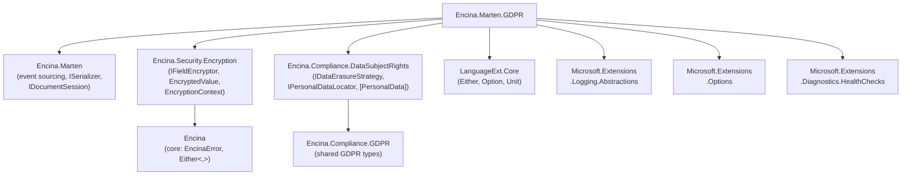

# Implementation Plan: `Encina.Marten.GDPR` — Crypto-Shredding for GDPR Compliance

> **Issue**: [#322](https://github.com/dlrivada/Encina/issues/322)
> **Type**: Feature (new package)
> **Complexity**: High (8 phases, ~50-60 files)
> **Estimated Scope**: ~2,500-3,500 lines of production code + ~2,000-3,000 lines of tests
> **Milestone**: v0.13.0 — Security & Compliance

---

## Summary

Implement **crypto-shredding** for GDPR compliance in event-sourced systems via a new `Encina.Marten.GDPR` package. Crypto-shredding is the industry-recommended solution for reconciling event sourcing's immutability with GDPR Article 17 ("Right to be Forgotten"): PII fields in events are encrypted with subject-specific keys, and "forgetting" a subject means deleting the key — rendering encrypted data permanently unreadable.

### Key Architecture Decision: Reuse Existing Infrastructure

This package **builds upon** existing Encina infrastructure rather than reimplementing encryption, key management, or personal data discovery:

| Concern | Existing Infrastructure | This Package Adds |
|---------|------------------------|-------------------|
| **Encryption** | `IFieldEncryptor` + `AesGcmFieldEncryptor` (`Encina.Security.Encryption`) | Nothing — reuses directly |
| **Encrypted values** | `EncryptedValue` record struct (`Encina.Security.Encryption`) | Nothing — reuses directly |
| **Encryption context** | `EncryptionContext` with `KeyId`, `Purpose`, `TenantId` (`Encina.Security.Encryption`) | Uses `Purpose = "crypto-shred:{subjectId}"` |
| **Key management** | `IKeyProvider` (`Encina.Security.Encryption`) | `ISubjectKeyProvider` — per-subject key lifecycle (get/create/delete/rotate) |
| **PII marking** | `[PersonalData]` attribute (`Encina.Compliance.DataSubjectRights`) | `[CryptoShredded]` marker — binds PII field to subject ID property |
| **PII discovery** | `EncryptedPropertyCache` + compiled expression setters (`Encina.Security.Encryption`) | `CryptoShreddedPropertyCache` — discovers `[CryptoShredded]` fields |
| **Data erasure** | `IDataErasureStrategy` (`Encina.Compliance.DataSubjectRights`) | `CryptoShredErasureStrategy` — erases by deleting subject key |
| **Data location** | `IPersonalDataLocator` (`Encina.Compliance.DataSubjectRights`) | `MartenEventPersonalDataLocator` — locates PII in Marten event streams |
| **Vault integration** | `ISecretReader`, `ISecretWriter` (`Encina.Security.Secrets`) + 4 vault satellites | Adapters connecting `ISubjectKeyProvider` to existing vault infrastructure |

The package provides:

1. **`[CryptoShredded]` attribute** — binds a PII property on a domain event to its data subject via `SubjectIdProperty`
2. **`ISubjectKeyProvider`** — per-subject key lifecycle management (builds on `IKeyProvider`)
3. **`CryptoShredderSerializer`** — transparent Marten `ISerializer` wrapper: encrypts on save, decrypts on load
4. **`CryptoShredErasureStrategy : IDataErasureStrategy`** — plugs into DSR erasure workflow
5. **`MartenEventPersonalDataLocator : IPersonalDataLocator`** — discovers PII across Marten event streams
6. **Key rotation** — versioned keys with forward-only encryption
7. **Projection handling** — graceful `[REDACTED]` substitution when subject is forgotten
8. **Full observability** — ActivitySource, Meter, structured logging with `[LoggerMessage]`

**Provider category**: Event Sourcing (Marten-specific, PostgreSQL only). This is NOT a 13-database-provider feature — it exclusively targets `Encina.Marten`'s event store.

---

## Design Choices

<details>
<summary><strong>1. Package Placement — New <code>Encina.Marten.GDPR</code> package</strong></summary>

### Options Considered

| Option | Pros | Cons |
|--------|------|------|
| **A) New `Encina.Marten.GDPR` package** | Clean separation, own observability, doesn't bloat Encina.Marten, independent versioning | New NuGet package to maintain |
| **B) Extend `Encina.Marten`** | Single package, shared config | Forces GDPR dependencies on non-GDPR users (crypto libs, key management), violates pay-for-what-you-use |
| **C) Put in `Encina.Compliance.GDPR`** | Shared with other GDPR modules | Couples Marten-specific serialization to general compliance, wrong dependency direction |

### Chosen Option: **A — New `Encina.Marten.GDPR` package**

### Rationale

- Follows the pay-for-what-you-use principle: users who don't need GDPR compliance don't pay for crypto dependencies
- Clear dependency graph: `Encina.Marten.GDPR` → `Encina.Marten` + `Encina.Security.Encryption` + `Encina.Compliance.DataSubjectRights`
- Matches the existing pattern: `Encina.Marten` is core event sourcing, `.GDPR` adds compliance layer
- The issue itself proposes `Encina.Marten.GDPR` as the package name

</details>

<details>
<summary><strong>2. Encryption Architecture — Compose with Existing <code>IFieldEncryptor</code></strong></summary>

### Options Considered

| Option | Pros | Cons |
|--------|------|------|
| **A) Compose with existing `IFieldEncryptor`** | Reuses battle-tested AES-256-GCM, consistent encryption format, leverages `EncryptedValue` | Must adapt `EncryptionContext` for per-subject scoping |
| **B) Create new `ICryptoShredder` with own AES-256-GCM** | Total control, crypto-shredding-specific API | Duplicates `AesGcmFieldEncryptor`, `EncryptedValue`, nonce/tag management — all already exist |
| **C) Use `EncryptionOrchestrator` directly** | Full pipeline behavior integration | Too coupled to CQRS pipeline, doesn't fit serializer-level interception |

### Chosen Option: **A — Compose with Existing `IFieldEncryptor`**

### Rationale

- `IFieldEncryptor.EncryptStringAsync` / `DecryptStringAsync` already provide exactly what crypto-shredding needs
- `AesGcmFieldEncryptor` implements AES-256-GCM with proper nonce generation and tag management
- `EncryptedValue` (record struct with `Ciphertext`, `Algorithm`, `KeyId`, `Nonce`, `Tag`) is the perfect serialization format
- `EncryptionContext` already has `KeyId` (for subject key), `Purpose` (for key derivation), and `TenantId` (for multi-tenancy)
- Zero code duplication: all encryption logic comes from `Encina.Security.Encryption`
- The new code focuses exclusively on **subject key lifecycle** and **Marten serializer integration**

</details>

<details>
<summary><strong>3. Key Management — <code>ISubjectKeyProvider</code> Building on <code>IKeyProvider</code></strong></summary>

### Options Considered

| Option | Pros | Cons |
|--------|------|------|
| **A) New `ISubjectKeyProvider` composing `IKeyProvider`** | Extends proven key infrastructure, adds per-subject lifecycle, reuses `InMemoryKeyProvider` patterns | New interface with subject-specific methods |
| **B) Create independent `IEncryptionKeyStore`** | Complete control | Duplicates `IKeyProvider.GetKeyAsync`, `RotateKeyAsync`, `GetCurrentKeyIdAsync` — all already exist |
| **C) Use `IKeyProvider` directly (without extension)** | No new interface | `IKeyProvider` lacks `DeleteKey` (essential for forgetting) and per-subject semantics |

### Chosen Option: **A — New `ISubjectKeyProvider` Composing `IKeyProvider`**

### Rationale

- `IKeyProvider` provides the foundation: `GetKeyAsync(keyId)`, `RotateKeyAsync()`, `GetCurrentKeyIdAsync()`
- Missing operations for crypto-shredding: `GetOrCreateKeyForSubjectAsync`, `DeleteSubjectKeysAsync`, `IsSubjectForgottenAsync`
- `ISubjectKeyProvider` adds the per-subject lifecycle while internally using `IFieldEncryptor` for the actual encryption
- Key ID convention: `"subject:{subjectId}:v{version}"` — maps naturally to `IKeyProvider.GetKeyAsync(keyId)`
- `InMemorySubjectKeyProvider` reuses the same `ConcurrentDictionary` + `RandomNumberGenerator` patterns from `InMemoryKeyProvider`
- `PostgreSqlSubjectKeyProvider` stores keys in Marten documents with `SubjectId` index
- Vault adapters connect `ISubjectKeyProvider` to existing `ISecretReader`/`ISecretWriter` from `Encina.Security.Secrets`

</details>

<details>
<summary><strong>4. PII Attribute — Reuse <code>[PersonalData]</code> + New <code>[CryptoShredded]</code> Marker</strong></summary>

### Options Considered

| Option | Pros | Cons |
|--------|------|------|
| **A) Reuse `[PersonalData]` + add `[CryptoShredded]` marker** | No attribute duplication, `[PersonalData]` already has `Category`, `Erasable`, `LegalRetention`; `[CryptoShredded]` adds subject binding | Two attributes on a property |
| **B) Create a new standalone `[PersonalData]` attribute** | Self-contained | Duplicates the existing attribute from `Encina.Compliance.DataSubjectRights` — identical concerns |
| **C) Extend existing `[PersonalData]` with `SubjectIdProperty`** | Single attribute | Adds event-sourcing-specific concerns to a general GDPR attribute; wrong package dependency direction |

### Chosen Option: **A — Reuse `[PersonalData]` + New `[CryptoShredded]` Marker**

### Rationale

- `[PersonalData]` from `Encina.Compliance.DataSubjectRights` already provides: `Category` (Identity, Contact, Financial, Health, etc.), `Erasable`, `Portable`, `LegalRetention`, `RetentionReason`
- `[CryptoShredded]` is a small, focused marker attribute with one essential property: `SubjectIdProperty` — the name of the sibling property identifying the data subject
- Usage: `[PersonalData(Category = PersonalDataCategory.Contact, Erasable = true)] [CryptoShredded(SubjectIdProperty = "UserId")] public string Email { get; init; }`
- `[CryptoShredded]` without `[PersonalData]` is invalid — validator warns at startup
- This separation means:
  - `[PersonalData]` governs **what** is personal data and **how** it's handled by DSR workflows
  - `[CryptoShredded]` governs **which subject** owns this data and triggers **serializer-level encryption**
- `CryptoShreddedPropertyCache` scans for `[CryptoShredded]` attributes and validates that `[PersonalData]` is also present

</details>

<details>
<summary><strong>5. Serialization Interception — Marten's <code>ISerializer</code> Wrapper</strong></summary>

### Options Considered

| Option | Pros | Cons |
|--------|------|------|
| **A) Wrap Marten's `ISerializer`** | Transparent, works with any Marten serializer, no changes to user code | Must handle all serialization edge cases |
| **B) Custom `JsonConverter` per PII property** | Fine-grained, System.Text.Json native | Requires per-type converter registration, doesn't scale |
| **C) `IDocumentSessionListener`** | Built-in Marten hook | Operates on serialized JSON, not on typed objects — requires JSON manipulation |

### Chosen Option: **A — Wrap Marten's `ISerializer`**

### Rationale

- Marten allows replacing `ISerializer` via `StoreOptions.Serializer()`
- `CryptoShredderSerializer` wraps the default `SystemTextJsonSerializer`:
  1. **On serialize**: Detect `[CryptoShredded]` properties → encrypt via `IFieldEncryptor.EncryptStringAsync` → serialize the modified event
  2. **On deserialize**: Deserialize → detect encrypted values → decrypt via `IFieldEncryptor.DecryptStringAsync` (or substitute `[REDACTED]` if key deleted)
- The wrapper delegates all non-PII serialization to the inner serializer unchanged
- Uses `CryptoShreddedPropertyCache` (modeled after `EncryptedPropertyCache`) to avoid runtime reflection
- Encrypted values stored as a structured JSON object: `{"__enc": true, "v": 1, "alg": "AES256GCM", "kid": "subject:user123:v1", "ct": "base64", "n": "base64", "t": "base64"}`

</details>

<details>
<summary><strong>6. DSR Integration — <code>CryptoShredErasureStrategy : IDataErasureStrategy</code></strong></summary>

### Options Considered

| Option | Pros | Cons |
|--------|------|------|
| **A) Implement `IDataErasureStrategy`** | Plugs directly into existing DSR workflow, composable with other strategies, reuses `ErasureResult` | Requires DSR package dependency |
| **B) Standalone forget API** | Self-contained, no DSR dependency | Duplicates erasure orchestration, audit trail, exemption handling |
| **C) Domain events only (loose coupling)** | Maximum decoupling | Users must wire up handlers manually, no out-of-the-box DSR integration |

### Chosen Option: **A — Implement `IDataErasureStrategy`**

### Rationale

- `IDataErasureStrategy` from `Encina.Compliance.DataSubjectRights` has exactly one method: `EraseFieldAsync(PersonalDataLocation, CancellationToken)`
- `CryptoShredErasureStrategy` implements this by deleting the subject's encryption keys via `ISubjectKeyProvider.DeleteSubjectKeysAsync(subjectId)`
- Plugs into `DefaultDataErasureExecutor` workflow automatically — no user wiring needed
- `MartenEventPersonalDataLocator : IPersonalDataLocator` discovers PII in Marten event streams
- The DSR audit trail (`IDSRAuditStore`) automatically records crypto-shredding operations
- `ErasureResult` provides metrics: `FieldsErased`, `FieldsRetained`, `RetentionReasons`
- Also expose a standalone `ISubjectKeyProvider.DeleteSubjectKeysAsync` for direct API usage outside DSR workflows

</details>

<details>
<summary><strong>7. Key Rotation Strategy — Versioned Keys with Forward-Only Encryption</strong></summary>

### Options Considered

| Option | Pros | Cons |
|--------|------|------|
| **A) Versioned keys, forward-only** | No re-encryption of old events, simple, performant | Old events use old key version forever |
| **B) Full re-encryption on rotation** | All events use latest key | Extremely expensive for large event stores, violates immutability |
| **C) No rotation support** | Simple | Security risk, doesn't meet enterprise requirements |

### Chosen Option: **A — Versioned Keys with Forward-Only Encryption**

### Rationale

- Each subject DEK has a version number (monotonically increasing)
- Key ID format: `"subject:{subjectId}:v{version}"` — self-describing, maps to `IFieldEncryptor`'s `EncryptionContext.KeyId`
- Encrypted values include the key ID with version: `{"kid": "subject:user123:v2", ...}`
- `RotateSubjectKeyAsync` creates a new version; old versions remain for decrypting old events
- New events always encrypted with the latest key version
- `DeleteSubjectKeysAsync` (forget) deletes ALL versions of the subject's key
- Optional: `ReEncryptEventsAsync(subjectId)` for compliance requirements that mandate re-encryption

</details>

---

## Implementation Phases

### Phase 1: Project Setup, Core Models & Domain Records

> **Goal**: Establish the new `Encina.Marten.GDPR` project with foundational types.

<details>
<summary><strong>Tasks</strong></summary>

#### New project: `src/Encina.Marten.GDPR/`

1. **Create project file** `Encina.Marten.GDPR.csproj`
   - Target: `net10.0`
   - Dependencies:
     - `ProjectReference`: `Encina.Marten`, `Encina.Security.Encryption`, `Encina.Compliance.DataSubjectRights`
     - `PackageReference`: `LanguageExt.Core`, `Microsoft.Extensions.Logging.Abstractions`, `Microsoft.Extensions.Options`, `Microsoft.Extensions.Diagnostics.HealthChecks`
   - Enable nullable, implicit usings, XML doc
   - InternalsVisibleTo: `Encina.UnitTests`, `Encina.IntegrationTests`, `Encina.ContractTests`, `Encina.PropertyTests`

2. **Enums** (`Model/` folder):
   - `SubjectKeyStatus` — `Active`, `Rotated`, `Deleted`
   - `SubjectStatus` — `Active`, `Forgotten`, `PendingDeletion`

3. **Domain records** (`Model/` folder):
   - `SubjectKeyInfo` — sealed record: `SubjectId (string)`, `KeyId (string)`, `Version (int)`, `Status (SubjectKeyStatus)`, `CreatedAtUtc (DateTimeOffset)`, `ExpiresAtUtc (DateTimeOffset?)`
   - `SubjectEncryptionInfo` — sealed record: `SubjectId (string)`, `Status (SubjectStatus)`, `ActiveKeyVersion (int)`, `TotalKeyVersions (int)`, `CreatedAtUtc (DateTimeOffset)`, `ForgottenAtUtc (DateTimeOffset?)`
   - `CryptoShreddingResult` — sealed record: `SubjectId (string)`, `KeysDeleted (int)`, `FieldsAffected (int)`, `ShreddedAtUtc (DateTimeOffset)`
   - `KeyRotationResult` — sealed record: `SubjectId (string)`, `OldKeyId (string)`, `NewKeyId (string)`, `OldVersion (int)`, `NewVersion (int)`, `RotatedAtUtc (DateTimeOffset)`
   - `CryptoShreddedFieldMetadata` — sealed record: `DeclaringType (Type)`, `PropertyName (string)`, `SubjectIdProperty (string)`, `Category (PersonalDataCategory)`

4. **Notification events** (`Events/` folder):
   - `SubjectForgottenEvent` — sealed record implementing `INotification`: `SubjectId`, `KeysDeleted`, `FieldsAffected`, `OccurredAtUtc`
   - `SubjectKeyRotatedEvent` — sealed record implementing `INotification`: `SubjectId`, `OldKeyId`, `NewKeyId`, `OccurredAtUtc`
   - `PiiEncryptionFailedEvent` — sealed record implementing `INotification`: `SubjectId`, `PropertyName`, `ErrorMessage`, `OccurredAtUtc`

5. **Error codes** (`CryptoShreddingErrors.cs`):
   - Error code prefix: `crypto.`
   - Codes: `crypto.subject_forgotten`, `crypto.encryption_failed`, `crypto.decryption_failed`, `crypto.key_rotation_failed`, `crypto.key_store_error`, `crypto.invalid_subject_id`, `crypto.key_already_exists`, `crypto.serialization_error`, `crypto.attribute_misconfigured`
   - Follow `EncryptionErrors.cs` pattern: `public static class CryptoShreddingErrors` with factory methods returning `EncinaError`
   - Reuse `EncryptionErrors.KeyNotFound` where appropriate — no duplication

6. **`PublicAPI.Unshipped.txt`** — Add all public types

</details>

<details>
<summary><strong>Prompt for AI Agents — Phase 1</strong></summary>

```
You are implementing Phase 1 of Encina.Marten.GDPR (Issue #322) — Crypto-Shredding for GDPR Compliance.

CONTEXT:
- Encina is a .NET 10 / C# 14 library using Railway Oriented Programming (Either<EncinaError, T>)
- This is a NEW project: src/Encina.Marten.GDPR/
- This package REUSES existing infrastructure:
  - Encina.Security.Encryption: IFieldEncryptor, EncryptedValue, EncryptionContext, EncryptionErrors
  - Encina.Compliance.DataSubjectRights: [PersonalData] attribute, IDataErasureStrategy, PersonalDataCategory
- Reference existing patterns in src/Encina.Security.Encryption/EncryptionErrors.cs (error factory)
- Reference existing patterns in src/Encina.Compliance.GDPR/Model/ (sealed records)
- All domain models are sealed records with XML documentation
- Use LanguageExt for Option<T> and Either<L, R>
- Timestamps use DateTimeOffset with AtUtc suffix convention
- Notification events implement INotification from Encina core

TASK:
Create the project file and all model types, enums, events, and error codes listed in Phase 1 Tasks.

KEY RULES:
- Target net10.0, enable nullable, enable implicit usings
- All types are sealed records (not classes) except enums
- All public types need XML documentation with <summary>, <remarks>, and GDPR article references
- Error factory reuses EncryptionErrors.KeyNotFound for key-not-found scenarios — do NOT duplicate
- CryptoShreddedFieldMetadata uses PersonalDataCategory from Encina.Compliance.DataSubjectRights
- Add InternalsVisibleTo for test projects
- Add PublicAPI.Unshipped.txt with all public symbols
- Project references: Encina.Marten, Encina.Security.Encryption, Encina.Compliance.DataSubjectRights

REFERENCE FILES:
- src/Encina.Marten/Encina.Marten.csproj (project structure)
- src/Encina.Security.Encryption/EncryptionErrors.cs (error factory pattern — REUSE where possible)
- src/Encina.Compliance.GDPR/Model/ProcessingActivity.cs (sealed record pattern)
- src/Encina.Compliance.Consent/Events/ConsentGrantedEvent.cs (notification event pattern)
- src/Encina.Compliance.DataSubjectRights/Attributes/PersonalDataAttribute.cs (PersonalDataCategory enum)
```

</details>

---

### Phase 2: Interfaces & `[CryptoShredded]` Attribute

> **Goal**: Define the public API surface — `ISubjectKeyProvider`, the `[CryptoShredded]` attribute, and supporting abstractions.

<details>
<summary><strong>Tasks</strong></summary>

1. **`[CryptoShredded]` attribute** (`Attributes/CryptoShreddedAttribute.cs`):
   - `[AttributeUsage(AttributeTargets.Property, AllowMultiple = false, Inherited = true)]`
   - Properties:
     - `SubjectIdProperty (string)` — **required**: name of the sibling property identifying the data subject (e.g., `"UserId"`)
   - The target property MUST also have `[PersonalData]` from `Encina.Compliance.DataSubjectRights`
   - Validated at startup by auto-registration: warn if `[CryptoShredded]` exists without `[PersonalData]`

2. **Core interfaces** (`Abstractions/` folder):
   - `ISubjectKeyProvider` — per-subject key lifecycle:
     - `ValueTask<Either<EncinaError, byte[]>> GetOrCreateSubjectKeyAsync(string subjectId, CancellationToken ct = default)` — gets existing key or creates new one
     - `ValueTask<Either<EncinaError, byte[]>> GetSubjectKeyAsync(string subjectId, int? version = null, CancellationToken ct = default)` — gets specific version; `Left` if subject forgotten
     - `ValueTask<Either<EncinaError, CryptoShreddingResult>> DeleteSubjectKeysAsync(string subjectId, CancellationToken ct = default)` — deletes ALL key versions (= forget)
     - `ValueTask<Either<EncinaError, bool>> IsSubjectForgottenAsync(string subjectId, CancellationToken ct = default)`
     - `ValueTask<Either<EncinaError, KeyRotationResult>> RotateSubjectKeyAsync(string subjectId, CancellationToken ct = default)`
     - `ValueTask<Either<EncinaError, SubjectEncryptionInfo>> GetSubjectInfoAsync(string subjectId, CancellationToken ct = default)`
   - `IForgottenSubjectHandler` — callback for custom projection handling:
     - `ValueTask HandleForgottenSubjectAsync(string subjectId, string propertyName, Type eventType, CancellationToken ct = default)`
     - Default implementation: log + no-op
   - `ICryptoShreddedPropertyCache` — startup-built metadata (follows `EncryptedPropertyCache` pattern):
     - `CryptoShreddedFieldInfo[] GetFields(Type eventType)` — returns cached field descriptors
     - `bool HasCryptoShreddedFields(Type eventType)`
   - `CryptoShreddedFieldInfo` — internal record: `PropertyInfo`, `CryptoShreddedAttribute`, `Action<object, object?>` compiled setter, `string SubjectIdProperty`

3. **`PublicAPI.Unshipped.txt`** — Update with all new public symbols

</details>

<details>
<summary><strong>Prompt for AI Agents — Phase 2</strong></summary>

```
You are implementing Phase 2 of Encina.Marten.GDPR (Issue #322).

CONTEXT:
- Phase 1 models, enums, events, and errors are already implemented in src/Encina.Marten.GDPR/
- This package REUSES existing infrastructure:
  - [PersonalData] attribute from Encina.Compliance.DataSubjectRights (Category, Erasable, Portable, LegalRetention)
  - IKeyProvider from Encina.Security.Encryption (GetKeyAsync, RotateKeyAsync, GetCurrentKeyIdAsync)
  - EncryptedPropertyCache from Encina.Security.Encryption (compiled expression property setters)
- Encina uses Railway Oriented Programming: all methods return ValueTask<Either<EncinaError, T>>
- LanguageExt provides Option<T>, Either<L, R>, Unit

TASK:
Create the [CryptoShredded] attribute, all core interfaces, and update PublicAPI.Unshipped.txt.

KEY RULES:
- [CryptoShredded] targets properties (AttributeTargets.Property) and requires SubjectIdProperty
- [CryptoShredded] MUST coexist with [PersonalData] — validated at startup
- ISubjectKeyProvider manages per-subject key lifecycle — NOT general key management
- Key ID convention: "subject:{subjectId}:v{version}" for IFieldEncryptor compatibility
- ICryptoShreddedPropertyCache follows the EXACT pattern of EncryptedPropertyCache:
  ConcurrentDictionary<Type, CryptoShreddedFieldInfo[]> with compiled expression setters
- CryptoShreddedFieldInfo is internal, caches PropertyInfo + compiled setter delegate
- All interface methods use ValueTask (not Task) for consistency with Security.Encryption
- Comprehensive XML documentation with GDPR article references

REFERENCE FILES:
- src/Encina.Security.Encryption/EncryptedPropertyCache.cs (EXACT pattern to follow for property cache)
- src/Encina.Security.Encryption/EncryptedPropertyInfo.cs (field info record pattern)
- src/Encina.Security.Encryption/Attributes/EncryptAttribute.cs (attribute pattern)
- src/Encina.Security.Encryption/Abstractions/IKeyProvider.cs (key provider interface pattern)
- src/Encina.Compliance.DataSubjectRights/Attributes/PersonalDataAttribute.cs (existing [PersonalData])
- src/Encina.Compliance.DataSubjectRights/Abstractions/IDataErasureStrategy.cs (erasure interface)
```

</details>

---

### Phase 3: Implementations — Key Providers & Erasure Strategy

> **Goal**: Provide working implementations — `InMemorySubjectKeyProvider`, `PostgreSqlSubjectKeyProvider`, `CryptoShredErasureStrategy`, and `MartenEventPersonalDataLocator`.

<details>
<summary><strong>Tasks</strong></summary>

1. **`InMemorySubjectKeyProvider`** (`KeyStore/InMemorySubjectKeyProvider.cs`):
   - Implements `ISubjectKeyProvider`
   - `ConcurrentDictionary<string, SubjectKeyRecord>` where `SubjectKeyRecord` = `(List<SubjectKeyInfo>, byte[][] KeyMaterials)`
   - Key generation: `RandomNumberGenerator.GetBytes(32)` (AES-256, same pattern as `InMemoryKeyProvider`)
   - Thread-safe with lock per subject ID
   - Key ID format: `"subject:{subjectId}:v{version}"`
   - `DeleteSubjectKeysAsync` removes ALL key material and marks subject as `Forgotten`
   - Dependencies: `TimeProvider`, `ILogger<InMemorySubjectKeyProvider>`

2. **`PostgreSqlSubjectKeyProvider`** (`KeyStore/PostgreSqlSubjectKeyProvider.cs`):
   - Implements `ISubjectKeyProvider`
   - Uses Marten's `IDocumentSession` to store key documents
   - Document: `SubjectKeyDocument` with `Id = "subject:{subjectId}:v{version}"`, `SubjectId`, `KeyMaterial (byte[])`, `Version`, `Status`, `CreatedAtUtc`, `ExpiresAtUtc`
   - Index: Marten computed index on `SubjectId` for efficient lookups
   - `DeleteSubjectKeysAsync`: deletes all documents for subject (hard delete from PostgreSQL)
   - Dependencies: `IDocumentSession`, `TimeProvider`, `ILogger<PostgreSqlSubjectKeyProvider>`

3. **`CryptoShredErasureStrategy`** (`Erasure/CryptoShredErasureStrategy.cs`):
   - Implements `IDataErasureStrategy` from `Encina.Compliance.DataSubjectRights`
   - `EraseFieldAsync(PersonalDataLocation location, CancellationToken ct)`:
     1. Extract subject ID from `PersonalDataLocation.EntityId`
     2. Call `ISubjectKeyProvider.DeleteSubjectKeysAsync(subjectId)`
     3. Return `Unit` on success
   - This is the **bridge** between DSR workflow and crypto-shredding
   - NOTE: Unlike `HardDeleteErasureStrategy` which nullifies fields, this strategy deletes encryption keys — the data remains in the event store but becomes permanently unreadable

4. **`MartenEventPersonalDataLocator`** (`Locator/MartenEventPersonalDataLocator.cs`):
   - Implements `IPersonalDataLocator` from `Encina.Compliance.DataSubjectRights`
   - `LocateAllDataAsync(string subjectId, CancellationToken ct)`:
     1. Query Marten event store for events with matching subject ID
     2. Scan events for `[CryptoShredded]` + `[PersonalData]` properties
     3. Return `PersonalDataLocation` for each PII field found
   - Uses `ICryptoShreddedPropertyCache` for efficient property lookup
   - Dependencies: `IDocumentSession`, `ICryptoShreddedPropertyCache`, `ILogger`

5. **`DefaultForgottenSubjectHandler`** (`DefaultForgottenSubjectHandler.cs`):
   - Implements `IForgottenSubjectHandler`
   - Logs at `LogLevel.Information` via structured logging
   - No-op by default — projections handle the placeholder values from the serializer

6. **`CryptoShreddedPropertyCache`** (`Metadata/CryptoShreddedPropertyCache.cs`):
   - Implements `ICryptoShreddedPropertyCache`
   - Follows `EncryptedPropertyCache` pattern exactly:
     - `ConcurrentDictionary<Type, CryptoShreddedFieldInfo[]>`
     - `GetOrAdd` with static factory method
     - Compiled expression tree property setters via `Expression.Lambda<Action<object, object?>>`
   - Discovers properties with `[CryptoShredded]` attribute
   - Validates `[PersonalData]` co-existence at discovery time
   - Validates `SubjectIdProperty` exists on the declaring type
   - Thread-safe, zero-reflection after initial discovery

7. **`SubjectKeyDocument`** (`KeyStore/SubjectKeyDocument.cs`):
   - Marten document entity for PostgreSQL key storage
   - Properties: `Id (string)`, `SubjectId (string)`, `KeyMaterial (byte[])`, `Version (int)`, `Status (SubjectKeyStatus)`, `CreatedAtUtc (DateTimeOffset)`, `ExpiresAtUtc (DateTimeOffset?)`
   - Marten index on `SubjectId` for efficient lookups

</details>

<details>
<summary><strong>Prompt for AI Agents — Phase 3</strong></summary>

```
You are implementing Phase 3 of Encina.Marten.GDPR (Issue #322).

CONTEXT:
- Phases 1-2 are implemented (models, interfaces, attributes, errors)
- This package REUSES:
  - IFieldEncryptor from Encina.Security.Encryption (AES-256-GCM encryption — NOT reimplemented)
  - IDataErasureStrategy from Encina.Compliance.DataSubjectRights (pluggable erasure)
  - IPersonalDataLocator from Encina.Compliance.DataSubjectRights (data discovery)
  - EncryptedPropertyCache pattern from Encina.Security.Encryption (compiled expression setters)
  - InMemoryKeyProvider pattern from Encina.Security.Encryption (ConcurrentDictionary + RandomNumberGenerator)
- Encina uses ROP: all methods return ValueTask<Either<EncinaError, T>>
- TimeProvider is injected for testable time-dependent logic

TASK:
Create InMemorySubjectKeyProvider, PostgreSqlSubjectKeyProvider, CryptoShredErasureStrategy,
MartenEventPersonalDataLocator, DefaultForgottenSubjectHandler, CryptoShreddedPropertyCache,
and SubjectKeyDocument.

KEY RULES:
- InMemorySubjectKeyProvider: follows InMemoryKeyProvider pattern exactly
  (ConcurrentDictionary, RandomNumberGenerator.GetBytes(32), volatile state)
- PostgreSqlSubjectKeyProvider: uses IDocumentSession (Marten document storage), NOT raw SQL
- CryptoShredErasureStrategy: implements IDataErasureStrategy.EraseFieldAsync by calling
  ISubjectKeyProvider.DeleteSubjectKeysAsync — does NOT modify event data directly
- MartenEventPersonalDataLocator: implements IPersonalDataLocator.LocateAllDataAsync by
  querying Marten event store and returning PersonalDataLocation records
- CryptoShreddedPropertyCache: follows EncryptedPropertyCache EXACTLY — same ConcurrentDictionary
  pattern, same compiled expression tree setters, same thread-safety guarantees
- Key material NEVER logged — use structured logging that excludes sensitive data
- DeleteSubjectKeysAsync must delete ALL key versions for a subject (not just current)
- All constructors validate parameters with ArgumentNullException.ThrowIfNull

REFERENCE FILES:
- src/Encina.Security.Encryption/InMemoryKeyProvider.cs (EXACT pattern for InMemorySubjectKeyProvider)
- src/Encina.Security.Encryption/EncryptedPropertyCache.cs (EXACT pattern for CryptoShreddedPropertyCache)
- src/Encina.Security.Encryption/EncryptedPropertyInfo.cs (field info record with compiled setter)
- src/Encina.Compliance.DataSubjectRights/Erasure/HardDeleteErasureStrategy.cs (erasure strategy pattern)
- src/Encina.Compliance.DataSubjectRights/Abstractions/IPersonalDataLocator.cs (locator pattern)
- src/Encina.Marten/MartenAggregateRepository.cs (IDocumentSession usage)
```

</details>

---

### Phase 4: Marten Serialization Interceptor

> **Goal**: Implement the transparent encryption/decryption layer that wraps Marten's `ISerializer`, using `IFieldEncryptor` from `Encina.Security.Encryption`.

<details>
<summary><strong>Tasks</strong></summary>

1. **`CryptoShredderSerializer`** (`Serialization/CryptoShredderSerializer.cs`):
   - Implements Marten's `ISerializer` interface by wrapping the inner serializer
   - Constructor: `ISerializer innerSerializer`, `IFieldEncryptor fieldEncryptor`, `ISubjectKeyProvider subjectKeyProvider`, `ICryptoShreddedPropertyCache propertyCache`, `IOptions<CryptoShreddingOptions> options`, `ILogger`
   - **Serialize flow** (`ToJson`, `ToCleanJson`):
     1. Check `propertyCache.HasCryptoShreddedFields(type)` — if false, delegate to inner
     2. Get field descriptors from cache
     3. For each `[CryptoShredded]` property:
        a. Extract subject ID from the `SubjectIdProperty` value on the event
        b. Extract the plaintext value
        c. Get or create subject key: `ISubjectKeyProvider.GetOrCreateSubjectKeyAsync(subjectId)`
        d. Build `EncryptionContext` with `KeyId = "subject:{subjectId}:v{version}"`, `Purpose = "crypto-shred"`
        e. Call `IFieldEncryptor.EncryptStringAsync(value, context)` → `EncryptedValue`
        f. Serialize `EncryptedValue` to compact JSON: `{"__enc": true, "v": 1, "kid": "...", "ct": "base64", "n": "base64", "t": "base64", "alg": 0}`
        g. Replace property value with the JSON string
     4. Serialize modified object with inner serializer
   - **Deserialize flow** (`FromJson`):
     1. Deserialize with inner serializer
     2. Check `propertyCache.HasCryptoShreddedFields(type)` — if false, return directly
     3. For each field with `[CryptoShredded]`:
        a. Check if string value starts with `{"__enc":true` (encrypted marker)
        b. Parse `EncryptedValue` from the compact JSON
        c. Build `EncryptionContext` from stored `KeyId`
        d. Get subject key: `ISubjectKeyProvider.GetSubjectKeyAsync(subjectId, version)`
        e. If key not found (subject forgotten) → apply `CryptoShreddingOptions.AnonymizedPlaceholder` (default: `"[REDACTED]"`)
        f. Call `IFieldEncryptor.DecryptStringAsync(encryptedValue, context)` → plaintext
        g. Replace property value with decrypted plaintext
     4. Return deserialized object with decrypted values
   - **Edge cases**:
     - Non-string PII: convert to/from string via `Convert.ToString` / type-specific parsing
     - Null PII values: skip encryption (null → null)
     - Missing subject ID property: log warning, skip encryption for that field

2. **`CryptoShredderSerializerFactory`** (`Serialization/CryptoShredderSerializerFactory.cs`):
   - Helper that configures Marten's `StoreOptions` to use `CryptoShredderSerializer`
   - Called from `ServiceCollectionExtensions` via `ConfigureMarten` callback
   - Preserves any existing serializer settings (enum storage, casing policy, etc.)

3. **`EncryptedFieldJsonConverter`** (`Serialization/EncryptedFieldJsonConverter.cs`):
   - Converts between compact JSON representation and `EncryptedValue` record struct
   - Compact format: `{"__enc": true, "v": 1, "kid": "subject:user123:v1", "ct": "base64-ciphertext", "n": "base64-nonce", "t": "base64-tag", "alg": 0}`
   - Used by `CryptoShredderSerializer` for efficient JSON serialization of encrypted fields

</details>

<details>
<summary><strong>Prompt for AI Agents — Phase 4</strong></summary>

```
You are implementing Phase 4 of Encina.Marten.GDPR (Issue #322).

CONTEXT:
- Phases 1-3 are implemented (models, interfaces, key providers, erasure strategy, property cache)
- This is the CRITICAL phase: transparent PII encryption at Marten's serialization layer
- REUSES IFieldEncryptor.EncryptStringAsync/DecryptStringAsync from Encina.Security.Encryption
  — does NOT reimplement AES-256-GCM encryption
- REUSES EncryptedValue record struct for ciphertext + metadata storage
- REUSES EncryptionContext for key selection and purpose binding
- Marten's ISerializer interface has: ToJson, FromJson, ToCleanJson, and related methods
- The wrapper must handle ALL ISerializer methods — delegate non-PII work to inner serializer

TASK:
Create CryptoShredderSerializer (wraps Marten ISerializer using IFieldEncryptor),
CryptoShredderSerializerFactory (configuration helper), and EncryptedFieldJsonConverter.

KEY RULES:
- CryptoShredderSerializer wraps the existing Marten ISerializer — never replaces it entirely
- On serialize: encrypt PII using IFieldEncryptor.EncryptStringAsync with EncryptionContext
- On deserialize: decrypt PII using IFieldEncryptor.DecryptStringAsync
- Forgotten subjects: GetSubjectKeyAsync returns Left → apply AnonymizedPlaceholder (default: "[REDACTED]")
- EncryptionContext constructed per-field: KeyId = "subject:{subjectId}:v{version}", Purpose = "crypto-shred"
- Encrypted values in JSON: {"__enc": true, "v": 1, "kid": "...", "ct": "base64", "n": "base64", "t": "base64", "alg": 0}
- Thread-safe: CryptoShredderSerializer may be called concurrently by Marten
- Encrypt only non-null values — null stays null
- Subject ID extracted from sibling property via SubjectIdProperty on [CryptoShredded] attribute

REFERENCE FILES:
- src/Encina.Security.Encryption/Abstractions/IFieldEncryptor.cs (encryption interface)
- src/Encina.Security.Encryption/EncryptedValue.cs (encrypted data structure)
- src/Encina.Security.Encryption/EncryptionContext.cs (context for key selection)
- src/Encina.Security.Encryption/EncryptionOrchestrator.cs (orchestration pattern — reference, don't copy)
- src/Encina.Marten/MartenAggregateRepository.cs (IDocumentSession/Marten patterns)
```

</details>

---

### Phase 5: Configuration, DI & Auto-Registration

> **Goal**: Wire everything together with options, service registration, auto-registration, and health check.

<details>
<summary><strong>Tasks</strong></summary>

1. **Options** (`CryptoShreddingOptions.cs`):
   - `string AnonymizedPlaceholder { get; set; }` — default: `"[REDACTED]"`
   - `bool AutoRegisterFromAttributes { get; set; }` — default: `true`
   - `bool AddHealthCheck { get; set; }` — default: `false`
   - `bool PublishEvents { get; set; }` — default: `true`
   - `int KeyRotationDays { get; set; }` — default: `90`
   - `bool UsePostgreSqlKeyStore { get; set; }` — default: `false` (uses InMemory by default)
   - `List<Assembly> AssembliesToScan { get; }` — default: `[]`

2. **Options validator** (`CryptoShreddingOptionsValidator.cs`):
   - `IValidateOptions<CryptoShreddingOptions>`
   - Validates: `KeyRotationDays > 0`, `AnonymizedPlaceholder` not empty

3. **Service collection extensions** (`ServiceCollectionExtensions.cs`):
   - `AddEncinaMartenGdpr(this IServiceCollection services, Action<CryptoShreddingOptions>? configure = null)`
   - Registers:
     - `CryptoShreddingOptions` via `services.Configure()`
     - `CryptoShreddingOptionsValidator` via `TryAddSingleton<IValidateOptions<>>`
     - `ISubjectKeyProvider` → `InMemorySubjectKeyProvider` or `PostgreSqlSubjectKeyProvider` (based on options) via `TryAddScoped`
     - `ICryptoShreddedPropertyCache` → `CryptoShreddedPropertyCache` via `TryAddSingleton`
     - `IForgottenSubjectHandler` → `DefaultForgottenSubjectHandler` via `TryAddSingleton`
     - `IDataErasureStrategy` → `CryptoShredErasureStrategy` via `TryAddSingleton` (NOTE: only if DSR is configured — check for existing registration)
     - `IPersonalDataLocator` → `MartenEventPersonalDataLocator` via service collection add (multiple locators are composited by `CompositePersonalDataLocator`)
     - `TimeProvider.System` via `TryAddSingleton`
   - Configures Marten: `services.ConfigureMarten(opts => CryptoShredderSerializerFactory.Apply(opts, ...))`
   - Conditional: health check if `AddHealthCheck == true`
   - Conditional: auto-registration if `AutoRegisterFromAttributes == true`
   - NOTE: Does NOT register `IFieldEncryptor` — expects it to be already registered via `AddEncinaEncryption()`

4. **Auto-registration** (`CryptoShreddingAutoRegistrationDescriptor.cs` + `CryptoShreddingAutoRegistrationHostedService.cs`):
   - `internal sealed record CryptoShreddingAutoRegistrationDescriptor(IReadOnlyList<Assembly> Assemblies)`
   - `internal sealed class CryptoShreddingAutoRegistrationHostedService : IHostedService`
   - `StartAsync`: scans assemblies for event types with `[CryptoShredded]` properties → builds `CryptoShreddedPropertyCache`
   - Validates:
     - `SubjectIdProperty` references exist on the declaring type
     - `[PersonalData]` co-exists on the same property
   - Logs via dedicated event IDs (8400 range)

5. **Health check** (`Health/CryptoShreddingHealthCheck.cs`):
   - `public sealed class CryptoShreddingHealthCheck : IHealthCheck`
   - `const string DefaultName = "encina-crypto-shredding"`
   - Tags: `["encina", "gdpr", "crypto-shredding", "security", "ready"]`
   - Checks: `ISubjectKeyProvider` resolvable, `IFieldEncryptor` resolvable, key store connectivity
   - Warns (Degraded): key store unreachable, metadata cache empty
   - Uses scoped resolution pattern

</details>

<details>
<summary><strong>Prompt for AI Agents — Phase 5</strong></summary>

```
You are implementing Phase 5 of Encina.Marten.GDPR (Issue #322).

CONTEXT:
- Phases 1-4 are implemented (models, interfaces, implementations, serializer)
- This package REQUIRES Encina.Security.Encryption to be configured FIRST (via AddEncinaEncryption)
  — it provides IFieldEncryptor and IKeyProvider
- DI registration follows the TryAdd pattern — allows overriding
- Auto-registration uses IHostedService with a descriptor record
- Health checks use IServiceProvider.CreateScope() for scoped service resolution
- Marten configuration uses ConfigureMarten callback for serializer setup
- CompositePersonalDataLocator from Encina.Compliance.DataSubjectRights aggregates multiple locators

TASK:
Create options, DI registration, auto-registration, and health check.

KEY RULES:
- Options pattern: sealed class with defaults, IValidateOptions<T> for validation
- ServiceCollectionExtensions.AddEncinaMartenGdpr:
  - Does NOT register IFieldEncryptor — expects AddEncinaEncryption() was called first
  - Registers ISubjectKeyProvider (InMemory or PostgreSql based on UsePostgreSqlKeyStore option)
  - Registers CryptoShredErasureStrategy as IDataErasureStrategy
  - Registers MartenEventPersonalDataLocator as additional IPersonalDataLocator
  - ConfigureMarten wraps the serializer with CryptoShredderSerializerFactory
- Auto-registration validates [CryptoShredded] + [PersonalData] co-existence at startup
- HostedService pattern: StartAsync does work, StopAsync returns Task.CompletedTask
- Health check returns Unhealthy if IFieldEncryptor not found, Degraded if cache empty, Healthy otherwise

REFERENCE FILES:
- src/Encina.Security.Encryption/ServiceCollectionExtensions.cs (AddEncinaEncryption DI pattern)
- src/Encina.Compliance.DataSubjectRights/ServiceCollectionExtensions.cs (DSR DI pattern)
- src/Encina.Marten/ServiceCollectionExtensions.cs (ConfigureMarten pattern)
- src/Encina.Compliance.Consent/ConsentAutoRegistrationHostedService.cs (auto-registration)
- src/Encina.Security.Encryption/Health/EncryptionHealthCheck.cs (health check pattern)
```

</details>

---

### Phase 6: Observability

> **Goal**: Add comprehensive diagnostics — ActivitySource, Meter, structured logging.

<details>
<summary><strong>Tasks</strong></summary>

1. **`CryptoShreddingDiagnostics`** (`Diagnostics/CryptoShreddingDiagnostics.cs`):
   - `internal const string SourceName = "Encina.Marten.GDPR"`
   - `internal const string SourceVersion = "1.0"`
   - `internal static readonly ActivitySource ActivitySource = new(SourceName, SourceVersion)`
   - `internal static readonly Meter Meter = new(SourceName, SourceVersion)`
   - Counters:
     - `crypto.encryption.total` — PII fields encrypted (tags: `event_type`, `property_name`)
     - `crypto.decryption.total` — PII fields decrypted
     - `crypto.forget.total` — Subjects forgotten
     - `crypto.key_rotation.total` — Key rotations performed
     - `crypto.forgotten_access.total` — Attempts to decrypt forgotten subjects (tags: `event_type`)
   - Histograms:
     - `crypto.encryption.duration` — Encryption time (ms)
     - `crypto.decryption.duration` — Decryption time (ms)
     - `crypto.forget.duration` — Forget operation time (ms)
   - Helper methods: `StartEncryption(eventType)`, `StartDecryption(eventType)`, `StartForget(subjectId)`
   - NOTE: Never include `subject_id` as a counter tag — high cardinality risks. Use trace attributes only.

2. **`CryptoShreddingLogMessages`** (`Diagnostics/CryptoShreddingLogMessages.cs`):
   - EventId range: **8400-8449** (non-colliding with existing ranges)
   - Uses `LoggerMessage.Define<>()` pattern (consistent with GDPR/Consent)
   - Events:
     - 8400: `PiiFieldEncrypted` — Debug: PII field encrypted for subject
     - 8401: `PiiFieldDecrypted` — Debug: PII field decrypted for subject
     - 8402: `SubjectForgotten` — Information: Subject forgotten, keys deleted
     - 8403: `KeyRotated` — Information: Key rotated for subject
     - 8404: `ForgottenSubjectAccessed` — Warning: Attempt to decrypt forgotten subject's data
     - 8405: `EncryptionFailed` — Error: Failed to encrypt PII field
     - 8406: `DecryptionFailed` — Error: Failed to decrypt PII field
     - 8407: `KeyStoreError` — Error: Key store operation failed
     - 8408: `MetadataCacheBuilt` — Information: Crypto-shredded metadata cache built
     - 8409: `AttributeMisconfigured` — Warning: [CryptoShredded] without [PersonalData]
     - 8410: `SerializerWrapped` — Information: Marten serializer wrapped with crypto-shredding
     - 8411: `AutoRegistrationCompleted` — Information: Auto-registration completed
     - 8412: `AutoRegistrationSkipped` — Debug: Type skipped during auto-registration
     - 8413: `HealthCheckCompleted` — Debug: Health check completed
     - 8414: `KeyRotationScheduled` — Information: Key rotation scheduled
     - 8415: `ReEncryptionStarted` — Information: Re-encryption started for subject

3. **Instrument all Phase 3-4 implementations**:
   - `CryptoShredderSerializer`: traces + counters on serialization/deserialization with PII
   - `InMemorySubjectKeyProvider`: traces on key operations
   - `PostgreSqlSubjectKeyProvider`: traces on key operations
   - `CryptoShredErasureStrategy`: traces on erasure

</details>

<details>
<summary><strong>Prompt for AI Agents — Phase 6</strong></summary>

```
You are implementing Phase 6 of Encina.Marten.GDPR (Issue #322).

CONTEXT:
- Phases 1-5 are implemented (models, interfaces, implementations, serializer, DI)
- Encina uses a standardized observability pattern: ActivitySource + Meter + LoggerMessage.Define
- Event IDs must be in the 8400-8449 range (non-colliding with existing ranges)

TASK:
Create CryptoShreddingDiagnostics (ActivitySource, Meter, counters, histograms),
CryptoShreddingLogMessages (structured logging with EventId), and instrument existing implementations.

KEY RULES:
- EventId range: 8400-8449 (verified non-colliding: Security 8000-8004, GDPR 8100-8112/8211-8220, Consent 8200-8250)
- LoggerMessage.Define<>() pattern for source generator-compatible structured logging
- ActivitySource named "Encina.Marten.GDPR"
- Meter named "Encina.Marten.GDPR"
- Counter dimensions: event_type, property_name (NOT subject_id — high cardinality)
- subject_id ONLY in trace Activity tags (low cardinality per trace)
- NEVER include key material in log messages or trace attributes
- Histogram unit: "ms" for durations
- Follow the exact pattern from src/Encina.Compliance.GDPR/Diagnostics/GDPRDiagnostics.cs

REFERENCE FILES:
- src/Encina.Compliance.GDPR/Diagnostics/GDPRDiagnostics.cs (ActivitySource + Meter pattern)
- src/Encina.Compliance.GDPR/Diagnostics/GDPRLogMessages.cs (LoggerMessage.Define pattern)
- src/Encina.Compliance.Consent/Diagnostics/ConsentDiagnostics.cs (counter pattern)
- src/Encina.Security.Encryption/EncryptionOptions.cs (EnableTracing, EnableMetrics flags)
```

</details>

---

### Phase 7: Testing

> **Goal**: Comprehensive test coverage following Encina testing standards.

<details>
<summary><strong>Tasks</strong></summary>

1. **Unit Tests** (`tests/Encina.UnitTests/Marten/GDPR/`):
   - `CryptoShredderSerializerTests.cs` — serialize with encryption, deserialize with decryption, forgotten subject handling, non-PII passthrough
   - `InMemorySubjectKeyProviderTests.cs` — get/create, key versioning, delete (forget), rotation, concurrent access
   - `CryptoShreddedPropertyCacheTests.cs` — discovery, compiled setter, co-attribute validation
   - `CryptoShredErasureStrategyTests.cs` — erases by deleting keys, returns Unit, integrates with mocked ISubjectKeyProvider
   - `MartenEventPersonalDataLocatorTests.cs` — locates PII fields in mock events
   - `CryptoShreddingOptionsValidatorTests.cs` — valid/invalid options
   - `CryptoShreddedAttributeTests.cs` — attribute properties, defaults
   - `CryptoShreddingErrorsTests.cs` — error factory methods
   - `EncryptedFieldJsonConverterTests.cs` — JSON roundtrip, compact format
   - `DefaultForgottenSubjectHandlerTests.cs` — logs and returns without error
   - Coverage target: ≥85%

2. **Guard Tests** (`tests/Encina.GuardTests/Marten/GDPR/`):
   - `InMemorySubjectKeyProviderGuardTests.cs` — null/empty subject IDs
   - `CryptoShredderSerializerGuardTests.cs` — null inner serializer, null field encryptor, null key provider
   - `CryptoShredErasureStrategyGuardTests.cs` — null location

3. **Property Tests** (`tests/Encina.PropertyTests/Marten/GDPR/`):
   - `CryptoShreddingPropertyTests.cs` — FsCheck:
     - Encrypt via IFieldEncryptor then decrypt = original (round-trip via existing infrastructure)
     - Forget then decrypt = placeholder (forgotten invariant)
     - Key rotation preserves decryptability of old data
     - Encrypted output never contains plaintext

4. **Contract Tests** (`tests/Encina.ContractTests/Marten/GDPR/`):
   - `ISubjectKeyProviderContractTests.cs` — verify InMemory and PostgreSql follow same contract
   - `IDataErasureStrategyContractTests.cs` — verify CryptoShredErasureStrategy follows IDataErasureStrategy contract

5. **Integration Tests** (`tests/Encina.IntegrationTests/Marten/GDPR/`):
   - `PostgreSqlSubjectKeyProviderIntegrationTests.cs` — real PostgreSQL via Marten
   - `CryptoShredderSerializerIntegrationTests.cs` — full roundtrip with real Marten event store + real AesGcmFieldEncryptor
   - `ForgetSubjectIntegrationTests.cs` — forget flow end-to-end: store event → forget subject → read event → verify [REDACTED]
   - `DSRIntegrationTests.cs` — verify CryptoShredErasureStrategy works in DSR workflow with DefaultDataErasureExecutor
   - Use `[Collection("Marten-PostgreSQL")]` shared fixture
   - `[Trait("Category", "Integration")]`, `[Trait("Database", "PostgreSQL")]`

6. **Load Tests** — Justification `.md`:
   - `tests/Encina.LoadTests/Marten/GDPR/CryptoShredding.md`
   - Justification: encryption/decryption performance is dominated by AES-256-GCM CPU time (already benchmarked in Encina.Security.Encryption), not concurrency patterns. The serializer wrapper is stateless and thread-safe by design. Unit benchmarks are more appropriate than load tests.

7. **Benchmark Tests** (`tests/Encina.BenchmarkTests/Encina.Marten.GDPR.Benchmarks/`):
   - `CryptoShredderSerializerBenchmarks.cs` — measure serializer overhead: plain vs crypto-shredded (with real IFieldEncryptor)
   - `SubjectKeyProviderBenchmarks.cs` — key lookup/create throughput
   - Use `BenchmarkSwitcher.FromAssembly().Run(args, config)` (not `BenchmarkRunner`)
   - Output to `artifacts/performance/`

</details>

<details>
<summary><strong>Prompt for AI Agents — Phase 7</strong></summary>

```
You are implementing Phase 7 of Encina.Marten.GDPR (Issue #322).

CONTEXT:
- Phases 1-6 are implemented (models, interfaces, implementations, serializer, DI, observability)
- This package REUSES IFieldEncryptor from Encina.Security.Encryption — integration tests should use
  real AesGcmFieldEncryptor (not mock) to verify the full encryption chain works
- Encina uses xUnit with AAA pattern, sealed test classes, descriptive method names
- Integration tests use [Collection] shared fixtures to reduce Docker containers
- Property tests use FsCheck for invariant verification
- Guard tests verify ArgumentNullException for all public parameters
- BenchmarkDotNet uses BenchmarkSwitcher (NOT BenchmarkRunner)

TASK:
Create all test classes listed in Phase 7 Tasks across unit, guard, property, contract, integration,
and benchmark test projects.

KEY RULES:
- Unit tests: mock IFieldEncryptor, ISubjectKeyProvider — test serializer logic in isolation
- Integration tests: use REAL AesGcmFieldEncryptor + InMemoryKeyProvider + InMemorySubjectKeyProvider
  to verify end-to-end encryption chain without mocks
- Guard tests: verify ArgumentNullException.ThrowIfNull on all constructors and public methods
- Property tests: FsCheck generators for string inputs, verify encrypt→decrypt roundtrip invariant
  using real IFieldEncryptor (not mock — this tests the integration)
- Contract tests: run same assertions against InMemory and PostgreSql subject key store implementations
- Integration tests with Marten: use [Collection("Marten-PostgreSQL")] with shared fixture
- Integration tests: ClearAllDataAsync in InitializeAsync, NEVER dispose shared fixture
- Benchmarks: use BenchmarkSwitcher.FromAssembly().Run(args, config)
- Coverage target: ≥85%
- AAA pattern: Arrange, Act, Assert with clear separation
- Descriptive names: MethodName_Scenario_ExpectedBehavior

REFERENCE FILES:
- tests/Encina.UnitTests/Security/Encryption/ (encryption test patterns)
- tests/Encina.UnitTests/Marten/ (Marten test patterns)
- tests/Encina.GuardTests/ (guard test pattern)
- tests/Encina.PropertyTests/ (FsCheck pattern)
- tests/Encina.IntegrationTests/ (collection fixtures)
- tests/Encina.BenchmarkTests/ (BenchmarkSwitcher pattern)
```

</details>

---

### Phase 8: Documentation & Finalization

> **Goal**: Complete all documentation, verify build, and finalize.

<details>
<summary><strong>Tasks</strong></summary>

1. **XML doc comments** — verify all public APIs have `<summary>`, `<remarks>`, `<param>`, `<returns>`, `<example>` where applicable

2. **`CHANGELOG.md`** — add entry under `## [Unreleased]`:
   ```markdown
   ### Added
   - `Encina.Marten.GDPR` — Crypto-shredding for GDPR compliance in event-sourced systems (Fixes #322)
     - `[CryptoShredded]` attribute for marking PII properties on domain events with subject binding
     - Reuses `IFieldEncryptor` (AES-256-GCM) from `Encina.Security.Encryption` — zero crypto code duplication
     - Transparent Marten serializer interception (automatic encrypt on save, decrypt on load)
     - `ISubjectKeyProvider` with InMemory and PostgreSQL implementations
     - Per-subject key management with key rotation support
     - Subject forgetting via key deletion (GDPR Art. 17)
     - `CryptoShredErasureStrategy` — plugs into DSR erasure workflow
     - `MartenEventPersonalDataLocator` — discovers PII in Marten event streams
     - Configurable placeholder for forgotten data (default: `[REDACTED]`)
     - Health check (`encina-crypto-shredding`)
     - Full observability (ActivitySource, Meter, structured logging)
   ```

3. **`ROADMAP.md`** — update if crypto-shredding was listed as planned feature

4. **Package README** — `src/Encina.Marten.GDPR/README.md`:
   - Overview: what is crypto-shredding and why
   - Prerequisites: `AddEncinaEncryption()` + `AddEncinaDataSubjectRights()` (optional)
   - Quick start with code examples
   - Configuration options
   - DSR integration guide
   - Key rotation guide
   - Projection handling

5. **Feature documentation** — `docs/features/crypto-shredding.md`:
   - Architecture overview showing integration with existing packages
   - Dependency diagram: `Encina.Marten.GDPR` → `Encina.Marten` + `Encina.Security.Encryption` + `Encina.Compliance.DataSubjectRights`
   - Encryption flow using `IFieldEncryptor`
   - Forget flow using `ISubjectKeyProvider.DeleteSubjectKeysAsync`
   - DSR integration via `CryptoShredErasureStrategy`

6. **`docs/INVENTORY.md`** — add new package and files

7. **`PublicAPI.Unshipped.txt`** — final verification of all public symbols

8. **Build verification**:
   - `dotnet build --configuration Release` → 0 errors, 0 warnings
   - `dotnet test` → all pass
   - Coverage ≥ 85%

</details>

<details>
<summary><strong>Prompt for AI Agents — Phase 8</strong></summary>

```
You are implementing Phase 8 of Encina.Marten.GDPR (Issue #322).

CONTEXT:
- Phases 1-7 are complete (all code and tests implemented)
- This is the final phase: documentation and build verification
- Encina requires XML documentation on ALL public APIs
- CHANGELOG.md follows Keep a Changelog format
- docs/INVENTORY.md tracks all project files and packages

TASK:
Complete all documentation listed in Phase 8 Tasks, verify build, and finalize.

KEY RULES:
- XML docs: every public type, method, property, parameter must be documented
- CHANGELOG: emphasize reuse of existing infrastructure (IFieldEncryptor, [PersonalData], IDataErasureStrategy)
- README: include Prerequisites section (AddEncinaEncryption required, AddEncinaDataSubjectRights optional)
- Feature doc: show architecture diagram with dependency arrows to existing packages
- Build: 0 errors, 0 warnings in Release mode
- Tests: all pass, ≥85% coverage

REFERENCE FILES:
- src/Encina.Marten/README.md (package README format)
- docs/features/ (feature documentation format)
- CHANGELOG.md (Keep a Changelog format)
- docs/INVENTORY.md (inventory format)
```

</details>

---

## Research

### Relevant Standards & Specifications

| Standard | Article/Section | Relevance |
|----------|-----------------|-----------|
| **GDPR Art. 17** | Right to erasure ("Right to be Forgotten") | Core motivation — crypto-shredding satisfies erasure |
| **GDPR Art. 17(3)** | Exemptions to right to erasure | Legal retention, public interest, legal claims |
| **GDPR Art. 5(1)(e)** | Storage limitation | Data should not be kept longer than necessary |
| **GDPR Art. 25** | Data protection by design and by default | Encryption as a design-time measure |
| **GDPR Art. 32** | Security of processing | Encryption as a security measure |
| **GDPR Art. 34(3)(a)** | Communication of breach not required if encrypted | Crypto-shredding provides breach protection |
| **NIST SP 800-38D** | GCM specification | AES-256-GCM algorithm standard |
| **NIST SP 800-57** | Key Management | Key rotation, key lifecycle |

### Existing Encina Infrastructure Reused (Critical)

| Component | Package | How This Feature Uses It |
|-----------|---------|--------------------------|
| `IFieldEncryptor` | `Encina.Security.Encryption` | **Direct reuse** — all encryption/decryption goes through this interface (AES-256-GCM) |
| `AesGcmFieldEncryptor` | `Encina.Security.Encryption` | **Default implementation** — no new encryption code written |
| `EncryptedValue` | `Encina.Security.Encryption` | **Direct reuse** — stores ciphertext + nonce + tag + keyId + algorithm |
| `EncryptionContext` | `Encina.Security.Encryption` | **Direct reuse** — carries KeyId, Purpose, TenantId for per-subject scoping |
| `EncryptionErrors` | `Encina.Security.Encryption` | **Reuse `.KeyNotFound`** — no duplicate error codes |
| `InMemoryKeyProvider` | `Encina.Security.Encryption` | **Pattern reference** — same ConcurrentDictionary + RandomNumberGenerator pattern |
| `EncryptedPropertyCache` | `Encina.Security.Encryption` | **Pattern clone** — same compiled expression tree property setters |
| `[PersonalData]` | `Encina.Compliance.DataSubjectRights` | **Direct reuse** — Category, Erasable, Portable, LegalRetention metadata |
| `PersonalDataCategory` | `Encina.Compliance.DataSubjectRights` | **Direct reuse** — enum for PII classification |
| `IDataErasureStrategy` | `Encina.Compliance.DataSubjectRights` | **Implemented** — `CryptoShredErasureStrategy` plugs into DSR workflow |
| `IPersonalDataLocator` | `Encina.Compliance.DataSubjectRights` | **Implemented** — `MartenEventPersonalDataLocator` discovers PII in events |
| `PersonalDataLocation` | `Encina.Compliance.DataSubjectRights` | **Direct reuse** — locator return type |
| `ErasureResult` | `Encina.Compliance.DataSubjectRights` | **Direct reuse** — DSR erasure outcome |
| `IDocumentSession` | `Marten` (via `Encina.Marten`) | **Direct reuse** — key document storage in PostgreSQL |
| `ServiceCollectionExtensions` | `Encina.Marten` | **Pattern reference** — `ConfigureMarten` callback for serializer setup |

### What This Package Creates (Net New Code)

| Component | Purpose | Why It Can't Be Reused |
|-----------|---------|----------------------|
| `[CryptoShredded]` attribute | Binds PII property to subject ID | Event-sourcing specific — `SubjectIdProperty` concept doesn't exist in general encryption |
| `ISubjectKeyProvider` | Per-subject key lifecycle (get/create/delete/rotate) | `IKeyProvider` lacks per-subject semantics and key deletion |
| `InMemorySubjectKeyProvider` | Testing/development key store | Per-subject key management layer |
| `PostgreSqlSubjectKeyProvider` | Production key store via Marten | Per-subject key management in PostgreSQL |
| `CryptoShredderSerializer` | Marten ISerializer wrapper | Marten-specific serialization interception |
| `CryptoShredErasureStrategy` | DSR integration — erases by deleting keys | Bridges crypto-shredding with DSR workflow |
| `MartenEventPersonalDataLocator` | Discovers PII in Marten events | Marten-specific event stream scanning |
| `CryptoShreddedPropertyCache` | Compiled property setters for `[CryptoShredded]` fields | Specific to `[CryptoShredded]` attribute |

### Event ID Allocation

| Package | Range | Notes |
|---------|-------|-------|
| `Encina.OpenTelemetry` (Resharding) | 7000-7009 | Resharding operations |
| `Encina.Security` | 8000-8004 | Authorization |
| `Encina.Compliance.GDPR` (Core) | 8100-8112 | Compliance checks, RoPA |
| `Encina.Compliance.GDPR` (LawfulBasis) | 8211-8220 | Lawful basis, processing activity health |
| `Encina.Compliance.Consent` | 8200-8250 | Consent lifecycle |
| **`Encina.Marten.GDPR`** (NEW) | **8400-8449** | **Crypto-shredding operations** |

### Estimated File Count

| Category | Count | Details |
|----------|-------|---------|
| Production code (models, enums) | 7 | Records, enums, events, errors |
| Production code (interfaces/attributes) | 4 | ISubjectKeyProvider, ICryptoShreddedPropertyCache, IForgottenSubjectHandler, [CryptoShredded] |
| Production code (implementations) | 8 | 2 key providers, serializer, serializer factory, JSON converter, property cache, erasure strategy, locator, forgotten handler |
| Production code (DI/config) | 5 | Options, validator, extensions, auto-registration (descriptor + service), health check |
| Production code (observability) | 2 | Diagnostics, LogMessages |
| Test files (unit) | 10 | One per implementation class |
| Test files (guard) | 3 | Core public APIs |
| Test files (property) | 1 | Round-trip invariants |
| Test files (contract) | 2 | Key store + erasure strategy contracts |
| Test files (integration) | 4 | PostgreSQL key store, serializer roundtrip, forget flow, DSR integration |
| Test files (benchmark) | 2 | Serializer overhead, key provider throughput |
| Test files (load justification) | 1 | `.md` justification |
| Documentation | 5 | README, feature doc, CHANGELOG, INVENTORY, PublicAPI.txt |
| **Total** | **~54-58** | |

### Dependency Graph



### Usage Example

```csharp
// 1. Configure services (requires encryption + optionally DSR)
services.AddEncinaEncryption();  // Provides IFieldEncryptor (AES-256-GCM)
services.AddEncinaDataSubjectRights();  // Optional: enables DSR integration
services.AddEncinaMartenGdpr(options =>
{
    options.UsePostgreSqlKeyStore = true;
    options.AddHealthCheck = true;
    options.AssembliesToScan.Add(typeof(UserRegistered).Assembly);
});

// 2. Mark PII on events
public sealed record UserRegistered(
    Guid UserId,

    [property: PersonalData(Category = PersonalDataCategory.Contact)]
    [property: CryptoShredded(SubjectIdProperty = nameof(UserId))]
    string Email,

    [property: PersonalData(Category = PersonalDataCategory.Identity)]
    [property: CryptoShredded(SubjectIdProperty = nameof(UserId))]
    string FullName,

    DateTimeOffset RegisteredAtUtc
);

// 3. Events are encrypted transparently by the serializer on save
// 4. Events are decrypted transparently by the serializer on load
// 5. Forget via DSR workflow or directly:
var result = await subjectKeyProvider.DeleteSubjectKeysAsync("user-123");
// After this, all PII for user-123 deserializes as "[REDACTED]"
```

---

## Combined AI Agent Prompts

<details>
<summary><strong>Complete Combined Prompt for All Phases</strong></summary>

```
You are implementing Encina.Marten.GDPR — Crypto-Shredding for GDPR Compliance (Issue #322).

PROJECT CONTEXT:
- Encina is a .NET 10 / C# 14 messaging library with Railway Oriented Programming (Either<EncinaError, T>)
- This is a NEW package: src/Encina.Marten.GDPR/
- Package implements transparent PII encryption in Marten event streams via crypto-shredding
- Crypto-shredding = encrypt PII with per-subject keys → delete key to "forget" subject

CRITICAL — REUSE EXISTING INFRASTRUCTURE:
This package MUST reuse existing Encina components. DO NOT reimplement:
- Encryption: Use IFieldEncryptor + AesGcmFieldEncryptor from Encina.Security.Encryption
- Encrypted values: Use EncryptedValue record struct from Encina.Security.Encryption
- Encryption context: Use EncryptionContext (KeyId, Purpose, TenantId) from Encina.Security.Encryption
- PII attributes: Use [PersonalData] from Encina.Compliance.DataSubjectRights
- PII categories: Use PersonalDataCategory enum from Encina.Compliance.DataSubjectRights
- Data erasure: Implement IDataErasureStrategy from Encina.Compliance.DataSubjectRights
- Data location: Implement IPersonalDataLocator from Encina.Compliance.DataSubjectRights
- Property cache pattern: Follow EncryptedPropertyCache from Encina.Security.Encryption
- Error codes: Reuse EncryptionErrors.KeyNotFound where applicable

Dependencies: Encina.Marten + Encina.Security.Encryption + Encina.Compliance.DataSubjectRights

IMPLEMENTATION OVERVIEW:

Phase 1 — Core Models (7 files):
- Project file targeting net10.0 with ProjectReferences to Marten, Security.Encryption, DataSubjectRights
- Enums: SubjectKeyStatus, SubjectStatus
- Records: SubjectKeyInfo, SubjectEncryptionInfo, CryptoShreddingResult, KeyRotationResult, CryptoShreddedFieldMetadata
- Events: SubjectForgottenEvent, SubjectKeyRotatedEvent, PiiEncryptionFailedEvent (INotification)
- Error codes: CryptoShreddingErrors (crypto. prefix, reuse EncryptionErrors.KeyNotFound)
- PublicAPI.Unshipped.txt

Phase 2 — Interfaces (4 files):
- [CryptoShredded] attribute (SubjectIdProperty — binds PII to subject; MUST co-exist with [PersonalData])
- ISubjectKeyProvider: per-subject key lifecycle (GetOrCreate, Get, Delete, Rotate, GetInfo)
- ICryptoShreddedPropertyCache: compiled expression property cache (follows EncryptedPropertyCache)
- IForgottenSubjectHandler: callback for projection handling

Phase 3 — Implementations (8 files):
- InMemorySubjectKeyProvider: ConcurrentDictionary, RandomNumberGenerator (same pattern as InMemoryKeyProvider)
- PostgreSqlSubjectKeyProvider: Marten IDocumentSession, SubjectKeyDocument
- CryptoShredErasureStrategy: IDataErasureStrategy — erases by deleting subject keys
- MartenEventPersonalDataLocator: IPersonalDataLocator — discovers PII in Marten events
- CryptoShreddedPropertyCache: compiled expression tree setters (same pattern as EncryptedPropertyCache)
- DefaultForgottenSubjectHandler: log + no-op
- SubjectKeyDocument: Marten document entity

Phase 4 — Serialization Interceptor (3 files):
- CryptoShredderSerializer: wraps Marten ISerializer, uses IFieldEncryptor for encrypt/decrypt
- CryptoShredderSerializerFactory: configuration helper
- EncryptedFieldJsonConverter: compact JSON ↔ EncryptedValue conversion

Phase 5 — Configuration & DI (5 files):
- CryptoShreddingOptions: placeholder, rotation days, health check, PostgreSQL toggle
- CryptoShreddingOptionsValidator: IValidateOptions
- ServiceCollectionExtensions: AddEncinaMartenGdpr() — registers providers, wraps serializer
  NOTE: Expects AddEncinaEncryption() called first for IFieldEncryptor
- Auto-registration: descriptor + IHostedService for [CryptoShredded] scanning
- Health check: IFieldEncryptor resolvable, key store connectivity

Phase 6 — Observability (2 files):
- CryptoShreddingDiagnostics: ActivitySource, Meter, counters, histograms
- CryptoShreddingLogMessages: EventId 8400-8449, LoggerMessage.Define pattern

Phase 7 — Testing (~22 files):
- Unit: 10 test classes (one per implementation, mock IFieldEncryptor)
- Guard: 3 classes (null checks)
- Property: 1 class (encrypt/decrypt roundtrip via real IFieldEncryptor)
- Contract: 2 classes (subject key store + erasure strategy contracts)
- Integration: 4 classes (PostgreSQL, serializer, forget flow, DSR integration — real AesGcmFieldEncryptor)
- Benchmark: 2 classes (serializer overhead, key provider throughput)
- Load justification: 1 .md file

Phase 8 — Documentation (5 files):
- XML doc comments on all public APIs
- CHANGELOG.md, ROADMAP.md, README.md, feature doc, INVENTORY.md
- Build verification: 0 errors, 0 warnings, all tests pass

KEY PATTERNS:
- ROP: Either<EncinaError, T> on ALL store/handler methods
- ValueTask (not Task) for consistency with Security.Encryption interfaces
- Timestamps: DateTimeOffset with AtUtc suffix
- DI: TryAdd* for all registrations (allows override)
- Observability: ActivitySource + Meter + LoggerMessage.Define with EventId 8400-8449
- Testing: [Collection("Marten-PostgreSQL")] for integration, BenchmarkSwitcher for benchmarks
- No [Obsolete], no backward compatibility — pre-1.0 best solution first
- Encryption via IFieldEncryptor — NEVER reimplement AES-256-GCM
- Key ID format: "subject:{subjectId}:v{version}"
- Encrypted JSON: {"__enc": true, "v": 1, "kid": "subject:user123:v1", "ct": "base64", "n": "base64", "t": "base64", "alg": 0}
- Forgotten subjects: GetSubjectKeyAsync returns Left → serializer applies "[REDACTED]" placeholder
- Key material: NEVER logged, NEVER in error messages

REFERENCE FILES:
- src/Encina.Security.Encryption/ (ALL files — encryption infrastructure to REUSE)
- src/Encina.Compliance.DataSubjectRights/ (ALL files — DSR infrastructure to INTEGRATE)
- src/Encina.Marten/ (ALL files — event sourcing patterns)
- src/Encina.Compliance.GDPR/ (GDPR patterns, diagnostics, DI)
- tests/Encina.UnitTests/ (test organization)
- tests/Encina.IntegrationTests/ (collection fixtures)
```

</details>

---

## Next Steps

1. **Review** this plan for completeness and alignment with project architecture
2. **Prerequisite check**: Verify `AddEncinaEncryption()` and `AddEncinaDataSubjectRights()` are working — both are from closed issues (#396, #404) with completed implementations
3. **Implement** phase by phase:
   - Phase 1: Core models → Phase 2: Interfaces → Phase 3: Implementations → Phase 4: Serializer → Phase 5: DI → Phase 6: Observability → Phase 7: Tests → Phase 8: Docs
4. **Final commit** with `Fixes #322` to auto-close the issue
5. **Future enhancements** (separate issues):
   - Vault adapter: connect `ISubjectKeyProvider` to `ISecretReader`/`ISecretWriter` from `Encina.Security.Secrets` + existing vault satellites (HashiCorp, Azure, AWS, GCP)
   - Re-encryption command: traverse event stream and re-encrypt with rotated key
   - Scheduled key rotation: integrate with `Encina.Messaging` scheduling
