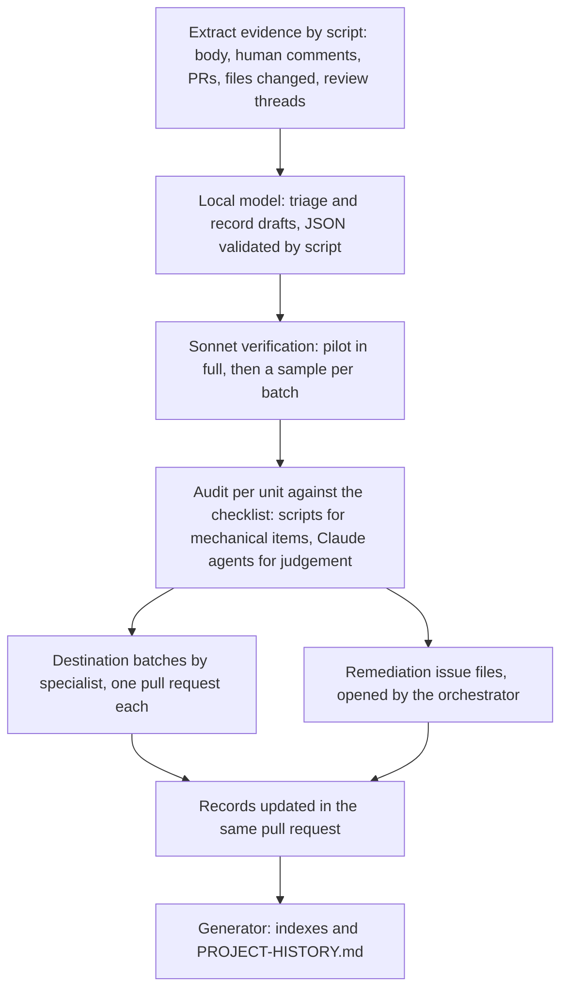

# SPEC-003 — Closed-Issue Knowledge Migration and Quality Audit

| | |
|---|---|
| **Status** | DRAFT — not yet APPROVED. The goal, the destination taxonomy, the knowledge record, the audit checklist, the grouping of findings, the execution model, the continuity rule and the definition of done were approved by the maintainer on 2026-09-24 and are encoded here; DEC-001 … DEC-005 are DECIDED (maintainer, 2026-09-24). Approval awaits the pilot amendment (REQ-029): pilot 1 (REQ-026) is done, and a proposed amendment from its report is pending the maintainer's approval |
| **Author** | Specifier (Claude), from the maintainer's brief of 2026-09-24 |
| **Date** | 2026-09-24 |
| **Refines** | [AI-DEVELOPMENT-MODEL.md](../engineering/AI-DEVELOPMENT-MODEL.md) §9 (Historian), §10 (Auditor), §16 (existing code audit), §17 (knowledge debt) and §22 (audit passes); turns [PROJECT-HISTORY.md](../engineering/PROJECT-HISTORY.md) into a generated document |
| **Evidence** | `gh issue list --repo dlrivada/Encina --state closed --limit 3000 --json number,stateReason`, run on 2026-09-24: 378 closed issues, 350 `COMPLETED` and 28 `NOT_PLANNED`; the Historian pass of 2026-09-22 recorded in `PROJECT-HISTORY.md`; the scripts under `tools/ai/` (`historian-extract-closed.ps1`, `archaeology-run.ps1`, `consolidate-run.ps1`, `history-sections-run.ps1`, `local-ai-ask.cs`), read on 2026-09-24 |
| **Supersedes** | — |

> This specification implements nothing. It states what must be true when the knowledge of every closed issue lives in the repository and the code those issues touched has been audited against today's standards. Requirements state *what*; the design choices that arise while building the tooling go through the ADR process ([AI-DEVELOPMENT-MODEL.md](../engineering/AI-DEVELOPMENT-MODEL.md) §7).
>
> **Identifiers.** Unprefixed REQ, AC, DEC, INV and AUD identifiers are this specification's. Identifiers of other specifications carry their prefix (SPEC-000 REQ-011, SPEC-002 DEC-006).

---

## 1. Problem

GitHub holds most of what Encina decided, rejected and learned. The principle of [AI-DEVELOPMENT-MODEL.md](../engineering/AI-DEVELOPMENT-MODEL.md) §2 is that GitHub preserves history and the repository preserves current engineering knowledge; for closed issues that principle is only partly met.

- **The first Historian pass is a summary, not a migration.** The pass of 2026-09-22 read the 331 issues closed by then and consolidated its items per area in `PROJECT-HISTORY.md`. It says what the issues decided; it does not say, per issue, where that knowledge lives today, and several of its candidates for promotion are still open (`PROJECT-HISTORY.md`, "Candidates for promotion"). Issues closed since then are in no document.
- **Issues were closed under weaker controls than today's.** Many rules that now bind every change are younger than the issues they would have applied to: the per-flag coverage model replaced the project-wide percentage on 2026-09-21 ([AI-DEVELOPMENT-MODEL.md](../engineering/AI-DEVELOPMENT-MODEL.md) §3), the cross-cutting rule is [ADR-018](../architecture/adr/018-cross-cutting-integration-principle.md), EventId ranges are [ADR-021](../architecture/adr/021-eventid-uniqueness-enforcement.md), `TimeProvider` became a rule after #543 and #667, fail-closed security defaults are [SPEC-002](SPEC-002-eu-regulatory-readiness.md) DEC-006. Defects that a current review would have caught were found after closure: stored scheduled messages that were never executed because the processor was never registered (#765), an inbox orchestrator that could not resolve its options on MongoDB (#1273), and the retention and legal-hold defects of SPEC-002 §1 (#1142, #1143, #1160, #1161).
- **There is no per-issue record for agents.** `CHANGELOG.md` is a release artifact generated from `changelog.d/` fragments; it answers "what shipped in this version", not "what did issue N decide, where is that knowledge now, and does the code still conform". An agent that needs the second answer reads the issue thread, which is the knowledge debt of [AI-DEVELOPMENT-MODEL.md](../engineering/AI-DEVELOPMENT-MODEL.md) §17.

The goal is therefore not a better summary. It is that the durable knowledge of every closed issue is moved into the artifact that governs it today, and that the code each issue touched is audited against the standards that apply today, so that the gaps become remediation work for the specialist agents and the quality of Encina rises.

## 2. Scope and definitions

### 2.1 In scope

- Every issue of `dlrivada/Encina` in state *closed*, whatever its state reason (completed, not planned, duplicate), as of the approval of this specification and every issue closed afterwards (§6.7).
- For each issue, its evidence set: the body; the human comments; the pull requests that reference or close it (title, description, the files they changed, merge state); the review threads of those pull requests, where a bot comment counts as evidence only when a human replied to it or a commit acted on it; and the commits that reference the issue.
- The code each issue touched, as it exists today (§5.1).
- The generated history documents (`PROJECT-HISTORY.md` and the area indexes).

### 2.2 Definitions

| Term | Meaning |
|---|---|
| Knowledge item | One durable statement taken from an issue's evidence: a decision, a rejected alternative, a rule, a change of direction or a failure mode learned the hard way (the item types of `tools/ai/briefs/archaeology-rules.md`), or pending work the issue left behind. |
| Current | A knowledge item still constrains today's work: the decision was not reversed and the feature was not removed. |
| Destination | The repository artifact where a knowledge item lives today (§4). |
| Knowledge record | The small per-issue file of §3 that lists an issue's knowledge items, their destinations, its audit verdict and its remediation issues. |
| Audit unit | The part of the code audited as one: a project under `src/`, or, for the core `Encina` package, one top-level folder of `src/Encina/` (the same folders the mutation matrix shards on). |
| Finding | A checklist item (§5) that fails on verified evidence. |
| Remediation issue | A GitHub issue that groups the findings of one audit unit or feature for one template type (§5.4). |
| Batch | A set of records or findings handled by one specialist in one pull request (§6). |

### 2.3 Non-goals

- A narrative summary of history. `PROJECT-HISTORY.md` becomes a view generated from the records (REQ-017), not a document written by hand.
- Retroactive implementation plans. No file under `docs/plans/` is written for a closed issue.
- Rewriting GitHub. Closed issues are not reopened, retitled or edited; the record links to them.
- Reopening decisions. A finding that contradicts a recorded decision is escalated (INV-004), not fixed by changing the decision.
- Merged pull requests that reference no issue (DEC-003).
- Changing `CHANGELOG.md`, its fragments or their tooling (REQ-018).
- Changing coverage targets. A manifest is corrected only where it misdeclares a file (REQ-012).

## 3. The knowledge record

One file per closed issue at `docs/knowledge/issues/<n>.md`, where `<n>` is the issue number without padding (DEC-001). The file is Markdown with a YAML front matter block, so that scripts read the fields and people read the body.

### 3.1 Front matter

| Field | Type | Values and rules |
|---|---|---|
| `schema` | integer | Version of this table; starts at 1 and changes only through an amendment of this specification (REQ-030). |
| `nav_exclude` | boolean | Always `true`: records are internal and stay out of the site navigation. |
| `issue` | integer | The issue number. |
| `title` | string | The issue title as it was at closure. |
| `closed` | date | `yyyy-MM-dd`. |
| `state_reason` | enum | `completed`, `not-planned`, `duplicate`. |
| `outcome` | enum | `delivered`, `partial`, `rejected`, `superseded`, `duplicate`, `moved`, `no-evidence` (DEC-002). |
| `type` | enum | The template prefix: `bug`, `feature`, `debt`, `test`, `spike`, `infra`, `refactor`, `epic`, or `other` for issues opened without a template. |
| `area` | enum | One of the fourteen areas of `PROJECT-HISTORY.md` (the keys of `tools/ai/consolidate-run.ps1`: `core`, `messaging`, `data`, `caching`, `eventsourcing`, `validation`, `observability`, `security-compliance`, `testing-quality`, `ci-process`, `docs-dx`, `web-cloud`, `modules-tenancy`, `resilience`). |
| `packages` | list | The projects under `src/` whose code the issue touched, by project name; empty when it touched none. |
| `prs` | list | Pull request numbers in the evidence set, with `merged` or `closed`. |
| `duplicate_of` / `superseded_by` | integer | Required when the outcome says so. |
| `knowledge` | list | One entry per knowledge item: `kind` (decision, rejected-alternative, rule, direction-change, gotcha, pending-work), `statement` (one sentence), `current` (`yes`, `no`, `unknown`), `sources` (at least one: URL, date, and a quote or paraphrase marked `quote:` or `paraphrase:`), `destinations` (list, §4). |
| `audit` | map | `unit` (list of audit units), `checklist` (version of §5), `date`, `verdict` (§5.3), `record` (link to the audit unit's result file, REQ-011). |
| `remediation` | list | Issue numbers of the remediation issues that carry this issue's findings. |
| `review` | enum | `draft` (local model), `verified` (a Claude agent followed every source link), `sampled` (part of a verified sample, REQ-022). |

Keys that Jekyll interprets (`layout`, `permalink`, `parent`) are not used.

### 3.2 Body

At most 200 words, in four fixed sections: **Asked** (what the issue requested), **Outcome** (how it ended and through which pull requests), **Where the knowledge lives** (one line per destination, as links) and **Audit** (verdict and remediation links). The body is an index; knowledge is written in its destination, never only in the record.

## 4. Destination taxonomy

A knowledge item has zero or more destinations. Zero is allowed only when the item is not current (REQ-005). The kinds, in the order a writer considers them:

| Kind | Takes | Artifact | Owner | Done when |
|---|---|---|---|---|
| `executable-rule` | A rule that a machine can check | An architecture test, analyzer rule, CI script or hook under `.claude/hooks/` | `issue-worker` (code), `mechanical-fixer` (decided configuration) | The check exists, fails on a violating example and passes on `main` |
| `rule` | A rule that needs judgement | `CLAUDE.md`, a skill under `.claude/skills/` or `.opencode/skills/`, or an agent definition | `mechanical-fixer`, from text the maintainer approved | The rule is in the file, with the issue cited as "project history: #n" in the style `CLAUDE.md` already uses |
| `adr` | A decision and the alternatives it rejected | A new ADR under `docs/architecture/adr/` or an addendum to an existing one | `docs-writer` drafts; the maintainer approves | The ADR is merged with its `Status` and `Date` |
| `regression-test` | A fixed bug | A test in the test project the flag belongs to | `issue-worker` | A test exists that fails on the parent commit of the fix and passes today (AUD-06) |
| `review-checklist` | A failure pattern seen in more than one issue | The checklist of `.claude/agents/adversarial-reviewer.md` or `docs-reviewer.md` | `mechanical-fixer` | The pattern is a line of the checklist, with the issues cited |
| `benchmark` | A performance claim | A benchmark under `tests/Encina.BenchmarkTests/` and a DocRef citation where the claim is written, or the claim removed (SPEC-000 REQ-016) | `issue-worker` | The citation renders from the performance index, or the claim is gone |
| `quality-method` | A decision about coverage or mutation testing | `.github/coverage-manifest/*.json`, `docs/testing/coverage-measurement-methodology.md`, `docs/testing/mutation-measurement-methodology.md` | `mechanical-fixer` (manifests), `docs-writer` (methodology) | The manifest or page states it |
| `docs` | What a user or contributor needs to use or understand a feature | A page in one Diátaxis quadrant under `docs/`, or a package README (`.claude/skills/encina-docs/SKILL.md`) | `docs-writer` | The page is merged and `docs-reviewer` found no blocker |
| `backlog` | Work the issue left pending | An open issue (existing or new) or a line of `ROADMAP.md` | Orchestrator, from an issue file (`open-issue` skill) | The issue is open with a milestone, or the roadmap line exists |
| `spec-invariant` | A requirement that still binds a specification's scope | A REQ or INV of an existing `SPEC-NNN`, through a pull request against it (SPEC-000 INV-005) | Specifier (Claude); the maintainer approves | The amendment is merged |
| `none` | A routine delivery with no durable knowledge, or an item that is not current | Nothing; the record states the reason | Record writer | The reason is one sentence in the record |

Precedence: a rule that can be checked mechanically goes to `executable-rule`, and a prose rule, if still useful, links the check (AI-DEVELOPMENT-MODEL §22, Pass 7). Knowledge that several issues share goes to one artifact, and every record links that same artifact (REQ-007).

## 5. Audit

### 5.1 What is audited

For each record whose outcome is `delivered` or `partial`, or whose outcome is `no-evidence` and whose subject exists in `src/`, the auditor maps the issue to the code it touched: the files changed by the merged pull requests of its evidence set, followed through later renames to their current paths. Files deleted since are recorded as `code-removed` and are not audited. The files are grouped by audit unit.

A unit is audited once per checklist version, and the result is shared by every record whose files fall in that unit. Two items are issue-specific and run per record: AUD-01 (decision conformance) and AUD-06 (regression test).

### 5.2 Checklist, version 1

Each item has one outcome per unit (or per record, for AUD-01 and AUD-06): **pass** with the evidence named in the table, **finding** with its class (A, B or C of [AI-DEVELOPMENT-MODEL.md](../engineering/AI-DEVELOPMENT-MODEL.md) §14) and severity (blocker, major, minor), or **not applicable** with a one-sentence reason. For AUD-02, a function may also be **deferred** to an open issue.

| ID | Check (what must be true today) | Applies when | Normative source | How it is verified | Passing evidence |
|---|---|---|---|---|---|
| AUD-01 | The code still does what the issue decided, or a later change of direction is recorded in an ADR, a SPEC or a later issue. Drift without a record is Class B. | The record has a `decision` item | [AI-DEVELOPMENT-MODEL.md](../engineering/AI-DEVELOPMENT-MODEL.md) §14, §22 Pass 4 | Reading the code named by the issue and its merged pull requests against the decision | The file that implements the decision, or the record of the change |
| AUD-02 | Each of the twelve cross-cutting functions (§5.2.1) is integrated, deferred to an open issue, or not applicable with a reason. | The unit creates entities, stores, pipeline behaviors, background services or external integrations | [ADR-018](../architecture/adr/018-cross-cutting-integration-principle.md); `CLAUDE.md`, "Cross-Cutting Integration Rule" | Reading the unit for each function's integration pattern | One line per function: file, deferral issue or reason |
| AUD-03 | Every source file of the package has an entry in its coverage manifest, no entry names a file that does not exist, and every applicable flag reaches the package target. | Always | `.github/coverage-manifest/{Package}.json`; `.github/scripts/coverage-report.cs`; [SPEC-001](SPEC-001-coverage-docref-citations.md) | Comparing manifest entries with the files of the unit; reading `perFlag` against its `target` in the published `docref-index.json` | A covref citation per flag in the unit's result file (§5.5); no figure typed by hand |
| AUD-04 | No test that counts for a flag is reflection-only or asserts only on types. | Always | `CLAUDE.md`, "Tests must execute real package code" | Reading the tests that cover the unit | The test classes read |
| AUD-05 | Every test type required for the unit's feature category exists, or a justification file sits where the tests would be; a justification is never accepted for unit, guard or contract tests, nor for integration tests of a database feature. | Always | `CLAUDE.md`, "Test Type Guidelines by Feature Category" and "Test Justification Documents" | Listing the test folders for the unit | The folders or the justification files |
| AUD-06 | A fixed bug has at least one test that fails on the parent commit of the fix and passes today. | The record's type is `bug` and its outcome `delivered` or `partial` | This specification; [AI-DEVELOPMENT-MODEL.md](../engineering/AI-DEVELOPMENT-MODEL.md) §12 | Finding the test that names the issue or reproduces its scenario; when in doubt, running it against the parent commit | The test's fully qualified name |
| AUD-07 | A provider-dependent feature is implemented and integration-tested on every provider of its category (the ten database providers; eight caching; the five lock providers of 1.0; three validation; AWS Lambda and Azure Functions), or each missing provider is deferred to an issue; the Marten-only compliance modules are PostgreSQL-only by decision. | The unit is provider-dependent | `CLAUDE.md`, "Multi-Provider Implementation Rule" and "Specialized Provider Categories"; SPEC-000 REQ-004, REQ-027, REQ-028; [ADR-019](../architecture/adr/019-compliance-event-sourcing-marten.md); SPEC-002 DEC-008 | Listing the implementations and the integration-test collections per provider | One row per provider: implementation, test class or deferral issue |
| AUD-08 | Every `[LoggerMessage]` and `LoggerMessage.Define` EventId lies in a range registered in `src/Encina/Diagnostics/EventIdRanges.cs`, and the assembly is in the `AssemblyRanges` map of `EncinaEventIdAllocationTests`. | The unit logs | [ADR-021](../architecture/adr/021-eventid-uniqueness-enforcement.md); `CLAUDE.md`, "Structured Logging & EventId Allocation" | `tests/Encina.UnitTests/Testing/Architecture/EncinaEventIdAllocationTests.cs` passes with the assembly listed | The range name and the passing test |
| AUD-09 | Every public type and member is declared in the project's `PublicAPI.Shipped.txt` or `PublicAPI.Unshipped.txt`, and RS0016 and RS0017 report nothing. | Always | `CLAUDE.md`, "PublicAPI Analyzers (RS0016/RS0017)"; SPEC-000 REQ-013 | A Release build with zero warnings | The build run |
| AUD-10 | Every public type and member has XML documentation. | Always | `CLAUDE.md`, "Documentation"; SPEC-000 REQ-013 | The build's documentation warnings, and reading | The build run |
| AUD-11 | The package README exists, every type it names exists in the package's PublicAPI files, it states which providers it covers, and every feature page of the unit keeps to one Diátaxis quadrant, names real API and cites its figures. | Always | `.claude/skills/encina-docs/SKILL.md`; SPEC-002 REQ-023; SPEC-000 REQ-016 and INV-001; [SPEC-001](SPEC-001-coverage-docref-citations.md) | `docs-reviewer` on the README and the pages; the `coverage-citations` job of `ci.yml` | The review verdict |
| AUD-12 | A security- or compliance-relevant behaviour fails closed by default; failing open needs an explicit option whose use is logged. | Security, compliance, audit and personal-data units | SPEC-002 DEC-006 and INV-005; #1155 | A test of the default options that drives the failure path | The test's name |
| AUD-13 | No `EncinaError` (its `Message`, its metadata or the exception it wraps), log message, activity attribute or metric tag carries a payload, a response body, a secret or a direct identifier of a data subject. | Always | #856; SPEC-002 REQ-034 and REQ-062 (SPEC-002 AC-044) | Reading the error factories and log messages of the unit; a test that asserts the absence | The test's name |
| AUD-14 | Production code of the unit never reads `DateTime.UtcNow` or `DateTimeOffset.UtcNow`; it takes `TimeProvider` by injection. | Always | `CLAUDE.md`, "Code Quality Standards"; #543, #667 | Searching the unit's files for both tokens | The search, with no match |
| AUD-15 | An options class with a password, connection string, token or key marks that property `[JsonIgnore]` and overrides `ToString()`. | The unit has options classes | `CLAUDE.md`, "Code Quality Standards"; #851 | Reading the options classes; a test of `ToString()` | The test's name |
| AUD-16 | Database calls use `OpenAsync`, `BeginTransactionAsync`, `ExecuteNonQueryAsync` and their siblings with a `CancellationToken`, never the synchronous overloads. | Database provider units | `CLAUDE.md`, "Code Quality Standards"; #794, #897; Sonar S6966 | Searching the unit for the synchronous calls | The search, with no match |
| AUD-17 | Every `AddEncina*` extension of the unit registers every service that the services it registers resolve: a service provider built with `ValidateOnBuild` and `ValidateScopes` starts and resolves each registered service. | The unit has `AddEncina*` extensions | #1273; #522 | A test that builds the provider with both validations on and resolves each registered service | The test's name |
| AUD-18 | The unit has no `[Obsolete]` member, compatibility alias or migration helper. | Always | `CLAUDE.md`, "Code Quality Standards" | Searching the unit for `[Obsolete]` and reading its public surface | The search, with no match |

#### 5.2.1 The twelve functions of AUD-02

As `CLAUDE.md` lists them: caching, OpenTelemetry, structured logging, health checks, validation, resilience, distributed locks, transactions, idempotency, multi-tenancy, module isolation and audit trail. For units in the SPEC-002 scope, multi-tenancy and telemetry are integrations, not deferrals (SPEC-002 REQ-061, REQ-062).

### 5.3 Verdicts

A record's `audit.verdict` is one of: `conforms` (every applicable item passes), `conforms-with-na` (passes, with items not applicable and reasons), `findings-tracked` (at least one finding, each in a remediation issue), `findings-fixed` (every finding fixed, with the pull request), `code-removed` (the code no longer exists) or `not-audited` (the issue touched no code, for example a rejected or duplicate issue).

### 5.4 From findings to remediation issues

- Findings are grouped **per audit unit or feature and per template type**, never one issue per finding: all the missing tests of `Encina.Compliance.Retention` go to one `[TEST]` issue, its defects to one `[BUG]` issue per defect family. An open issue that already covers a finding takes it as a comment or a checklist line instead of a new issue.
- Each remediation issue uses the headers of its template in `.github/ISSUE_TEMPLATE/` verbatim, in order, with the checkboxes ticked, lists its findings with the checklist ID, file and evidence, and links the records it came from. Workers write it as an issue file under `artifacts/issues/`; the orchestrator opens it through the `open-issue` skill.
- **Milestones.** Defects go to `v0.14.0 — Hardening`. Missing tests, telemetry and documentation go to the pre-1.0 milestone that owns the package; when none owns it, to `v0.21.0 — Documentation`.
- **Priority.** P0 – P3 as in [ENCINA-1.0-RECONCILIATION.md](../engineering/ENCINA-1.0-RECONCILIATION.md) §4. A remediation issue enters P0 only with a recorded reason citing a SPEC-000 requirement (SPEC-000 INV-004), for example REQ-007 for coverage, REQ-010 for EventIds, REQ-011 for defects or REQ-013 for public API and XML documentation. A security-classified defect cannot be deferred (SPEC-000 REQ-011).
- **Labels.** The template's default label, the `area-*` label of the unit, and `ai:local-candidate` or `ai:claude-required` (`ai-task-routing.md` §6).

### 5.5 Where audit results live

One result file per audit unit at `docs/knowledge/audits/<unit>.md` (same folder decision as the records, DEC-001), with the checklist version, the date, one row per checklist item with its outcome and evidence, coverage figures only as covref citations, and the remediation issues. Records link the result file; they do not copy it.

## 6. Requirements

Identifiers are stable. Each requirement has at least one acceptance criterion in §7 and a verification method in §11.

### 6.1 Records

- **REQ-001** Every closed issue in scope (§2.1) has exactly one knowledge record with the front matter of §3.1 and the body of §3.2.
- **REQ-002** Every knowledge item carries provenance: at least one source with a link, the date of that source and a one-line quote or paraphrase, marked as which ([AI-DEVELOPMENT-MODEL.md](../engineering/AI-DEVELOPMENT-MODEL.md) §9). An item whose source cannot be found is recorded with `current: unknown` under an "Unverified" list in the body and is never promoted to a destination.
- **REQ-003** A record is written in English and names the private reference application only as "the reference application: a small Spanish psychology practice", as SPEC-002 §4 does.

### 6.2 Destinations

- **REQ-004** Every knowledge item is classified into zero or more destinations of §4, and each destination entry names its kind, its target (path and anchor, or issue number) and its status: `done`, or `planned` with the batch or issue that will deliver it.
- **REQ-005** No record leaves current knowledge only in the issue. A knowledge item with `current: yes` has at least one destination other than `none`; `none` is allowed only for items that are not current or for a routine delivery with no durable knowledge, with the reason.
- **REQ-006** No destination of kind `plan` exists: closed issues get no implementation plan under `docs/plans/`.
- **REQ-007** Knowledge shared by several issues lives in one artifact, and every record concerned links that artifact. A destination never duplicates a rule that another layer already states (AI-DEVELOPMENT-MODEL §19).
- **REQ-008** A fixed bug has a `regression-test` destination whose target is an existing test (AUD-06), or a finding tracked in a remediation issue.
- **REQ-009** A performance claim found in the evidence is either cited from a benchmark through DocRef where it is written or removed (SPEC-000 REQ-016).

### 6.3 Audit

- **REQ-010** Every record whose outcome is `delivered` or `partial`, and every `no-evidence` record whose subject exists in `src/`, is audited against the current checklist version (§5), on the code as it is today, through its audit units.
- **REQ-011** Every audit unit touched by at least one record has a result file (§5.5) whose rows cover every checklist item with an outcome and evidence.
- **REQ-012** A finding is recorded only after it has been checked against the code, with file, line and the evidence that exposes it; a local-model draft of a finding is not a finding until verified. A manifest entry that misdeclares a file is a finding for `quality-method`, not a change of target.
- **REQ-013** Every finding is fixed (with the pull request that fixed it), tracked in a remediation issue (§5.4), or not applicable with a reason. Class B and Class C findings go to the maintainer with the options (INV-004).
- **REQ-014** Remediation issues follow §5.4: grouped per unit or feature and template type, deduplicated against open issues, templated, milestoned, prioritised and labelled as stated there, and linked from the records they came from.

### 6.4 Generated documents

- **REQ-015** A deterministic script (a C# file-based app; no model) generates, from the records alone, an index per area and per package under the records folder and `PROJECT-HISTORY.md`, with the same groups the document has today (areas; decisions, rules, rejected alternatives, lessons, changes of direction) and a citation to the issue on every line.
- **REQ-016** Generated files state at the top that they are generated, by which script and from which records, and are never edited by hand (INV-005). When they are regenerated is DEC-004.
- **REQ-017** `PROJECT-HISTORY.md` is replaced by its generated form; the "Editorial corrections" and "Candidates for promotion" of the current document are carried into the records they cite (as `direction-change` items and as `adr` or `rule` destinations with status `planned`) before the hand-written version is replaced.
- **REQ-018** `CHANGELOG.md` stays the release artifact generated from `changelog.d/`. Records do not replace fragments; a user-visible change still adds a fragment.
- **REQ-019** A validation script checks every record: the front matter matches §3.1 (required fields, enum values, `schema` version), every destination with status `done` points at a file (and anchor) that exists or an issue that exists, every `planned` destination names its batch or issue, REQ-005 holds, and every knowledge item has a source. It runs in `ci.yml` on every pull request that changes a record.

### 6.5 Execution

- **REQ-020** The migration runs as a pipeline of stages whose handoffs are files, never conversation (§8 diagram): extraction by script, triage and record drafts by the local model, verification by Claude agents, audit per unit, destination batches by specialists, remediation issue files, generation.
- **REQ-021** The local model drafts records in bounded batches with a closed brief and a JSON output that a script validates before anything is kept (every input issue present, enum values valid, a source on every item), as `tools/ai/archaeology-run.ps1` does today; a batch that fails validation twice is re-briefed, not accepted in part. Every local run is recorded in `artifacts/local-ai/ledger.csv`.
- **REQ-022** Drafts are verified by a Sonnet agent that follows the source links: every record of the pilot, and after the pilot a sample per batch whose size and rejection threshold the pilot fixes (REQ-029). A batch whose sample fails the threshold is verified in full. Every record with an `adr`, `rule`, `executable-rule` or `spec-invariant` destination is verified in full, whatever the sample.
- **REQ-023** Destinations are delivered by the specialist that owns the kind (§4), in batches, each batch one pull request that names the records it resolves and updates their destination status in the same pull request. Code batches get an `adversarial-reviewer` pass and documentation batches a `docs-reviewer` pass before they are reported.
- **REQ-024** The orchestrator's context holds batch manifests and one-line batch results, never per-issue evidence; per-issue content stays in files under `artifacts/` and in the records.
- **REQ-025** The cost of the program is reported from the ledgers (`artifacts/local-ai/ledger.csv`, `artifacts/agent-usage/ledger.csv`), never typed by hand.

### 6.6 Pilot

- **REQ-026** Before scaling, a pilot runs the whole pipeline (REQ-020) on 20 closed issues.
- **REQ-027** The pilot set is chosen by script from criteria and confirmed by the maintainer before it runs. It covers every outcome of §3.1 that occurs in the closed set, the types `bug`, `feature`, `debt` and at least one of `test`, `infra` or `spike`, at least six areas, issues closed before and after 2026-09-21, at least one not-planned and one duplicate issue, at least one issue closed without comments or references, and at least three issues whose evidence holds a decision.
- **REQ-028** The pilot produces a report under the records folder with, from the ledgers and the records: local-model errors found by verification, by kind; knowledge items per destination kind; items that fit no destination kind; findings per checklist item, and findings that turned out false; findings that no checklist item covers; checklist items that were ambiguous or too costly to verify; time and tokens per stage.
- **REQ-029** The pilot's results amend this specification before scaling: the destination taxonomy, the record schema, the checklist and the verification sample size and threshold change only through a pull request against this document that the maintainer approves (INV-007), with a change-log entry that cites the pilot report. Scaling starts when that pull request is merged, or when the maintainer records in the change log that the pilot needs no change.
- **REQ-030** An amendment that changes the record schema or the checklist increments `schema` or the checklist version; the validation script migrates or flags records of the older schema, and units audited under an older checklist are re-audited only for the items added or changed.

### 6.7 Continuity

- **REQ-031** Every pull request that closes an issue adds that issue's record in the same pull request, with the audit outcomes of the pull request itself: the change passes the checklist before it merges, and its ADR-018 evaluation is the AUD-02 row. The `pr-cycle` skill carries this step, and a CI check fails a pull request that closes an issue (`Fixes #n`, `Closes #n`, `Resolves #n`) without adding the record `<n>.md` in the records folder that DEC-001 fixes. The record is written by the agent that DEC-005 names, and the path-ownership hook allows that agent to write it.
- **REQ-032** A weekly history pass finds closed issues without a record (issues closed without a pull request, closed as not planned or as duplicates), drafts their records through the pipeline and regenerates the generated documents (DEC-004).
- **REQ-033** When a milestone closes, a pass verifies that every issue of that milestone has a record and re-runs the checklist on the audit units the milestone touched.
- **REQ-034** The checklist is enforced for new work: the review checklists of `adversarial-reviewer` and `docs-reviewer` reference the current checklist version, and every item that a machine can check runs as a test or CI check (at least AUD-08, AUD-09, AUD-14, AUD-16, AUD-17 and AUD-18).

## 7. Acceptance criteria

The definition of done of the program is AC-001 – AC-006; the others verify the requirements that lead there.

| AC | Requirement | Criterion |
|---|---|---|
| AC-001 | REQ-001, REQ-032 | A script compares the numbers returned by `gh issue list --repo dlrivada/Encina --state closed` with the files under `docs/knowledge/issues/`: no closed issue without a record, no record without a closed issue. |
| AC-002 | REQ-004, REQ-005 | The validation script (REQ-019) reports no knowledge item with `current: yes` whose destinations are empty or only `none`, and no destination with status `done` whose target does not exist. |
| AC-003 | REQ-010, REQ-011, REQ-013 | Every audit result file has an outcome for every checklist item; every finding row carries the pull request that fixed it, an open or completed remediation issue, or a not-applicable reason. |
| AC-004 | REQ-015, REQ-016, REQ-017 | `PROJECT-HISTORY.md` and the area and package indexes carry the generated header, and running the generator over the records of the commit of the last generation reproduces them byte for byte. |
| AC-005 | REQ-031, REQ-034 | A test pull request that closes an issue without its record fails the CI check; the same pull request with the record passes. `.claude/agents/adversarial-reviewer.md`, `.claude/agents/docs-reviewer.md` and `.claude/skills/pr-cycle/SKILL.md` reference the checklist version; the tests or CI checks for AUD-08, AUD-09, AUD-14, AUD-16, AUD-17 and AUD-18 exist and are green on `main`. |
| AC-006 | REQ-002, REQ-022 | Every knowledge item has a source with link, date and a marked quote or paraphrase; every batch has a verification report listing the records checked and the errors found. |
| AC-007 | REQ-008 | Every record of type `bug` with outcome `delivered` or `partial` has a `regression-test` destination whose target test exists, or an AUD-06 finding tracked in a remediation issue. |
| AC-008 | REQ-014 | No two open remediation issues from this program share an audit unit and a template type; each follows its template (`.claude/hooks/check-issue-template.ps1` accepts it), has the milestone and labels of §5.4, and each P0 one cites a SPEC-000 requirement. |
| AC-009 | REQ-006 | No file under `docs/plans/` is added by a pull request of this program. |
| AC-010 | REQ-009 | No performance claim quoted in any record's evidence remains in `docs/`, a README or an ADR without a DocRef citation. |
| AC-011 | REQ-019 | The validation job fails a pull request with a record that has an unknown enum value, a missing required field, a `done` destination pointing at a missing file, or an item without a source; it passes with the record fixed. |
| AC-012 | REQ-023 | Every destination batch pull request names its records and updates their status, and shows the `adversarial-reviewer` or `docs-reviewer` verdict. |
| AC-013 | REQ-026 – REQ-029 | Twenty pilot records exist with `review: verified`, the pilot report exists with the measurements of REQ-028, and before the first scaling batch the change log of this specification carries the amendment or the maintainer's "no change". |
| AC-014 | REQ-032, REQ-033 | After approval, a weekly-pass pull request exists for each week in which issues were closed, and each milestone closed after approval has a milestone-pass pull request. |
| AC-015 | REQ-021, REQ-025 | Every local-model batch has a ledger line; the program report quotes its costs from the ledgers. |
| AC-016 | REQ-003 | No record names the private reference application. |

## 8. Execution model

- **Extraction** extends `tools/ai/historian-extract-closed.ps1` with the files each pull request changed, the review threads of those pull requests and the referencing commits, and writes one evidence file per issue under `artifacts/knowledge/`.
- **Drafting** replaces the output schema of `tools/ai/archaeology-run.ps1` with the record schema of §3; `consolidate-run.ps1` and `history-sections-run.ps1` are retired, because the generator of REQ-015 needs no model.
- **Routing** follows [ai-task-routing.md](../engineering/ai-task-routing.md): the Historian role is local with Claude sampling; the Auditor's mechanical items are scripts; judgement items (AUD-01, AUD-02, AUD-12, AUD-13) are Claude agents; the orchestrator dispatches and never reads evidence (REQ-024).
- **Order.** After the pilot, batches run by area, starting with the areas whose packages are in the 1.0 contract and have the most records, so that remediation reaches the pre-1.0 milestones first.

## 9. Constraints

- Scripting in PowerShell or C# file-based apps only (`CLAUDE.md`, "Scripting & Tooling Policy").
- The local model's known limits shape every brief: one bounded task, enumerated points, a validated output, no open-ended research ([HOW-ENCINA-IS-BUILT.md](../engineering/HOW-ENCINA-IS-BUILT.md) §3.2, [ai-task-routing.md](../engineering/ai-task-routing.md) §2.1).
- Every change reaches `main` through a pull request with green required checks, including generated files (SPEC-000 INV-006); no bot commits to `main`.
- Path ownership applies to records as to any documentation: under DEC-001 the records are `docs/**/*.md`, which only the `docs-writer` may edit today (`.claude/hooks/enforce-path-ownership.ps1`), while the closing pull requests of REQ-031 are usually an `issue-worker`'s. DEC-005 names the `issue-worker` as the record writer, so the hook must move the records folder to that worker's allowlist before REQ-031 is enforced (§13, T-07).
- Issue bodies use the templates verbatim (`CLAUDE.md`, "Issue Body Format"); workers write issue files and the orchestrator opens them.
- Figures in records, audit results and reports are citations or ledger quotes, never typed (SPEC-001; `.claude/skills/encina-docs/SKILL.md` §3).

## 10. Invariants

- **INV-001** GitHub stays the historical record: no agent reopens, retitles or edits a closed issue for this program.
- **INV-002** A knowledge item without provenance never becomes a destination.
- **INV-003** The audit measures against today's standards and the current checklist version; no finding is resolved by weakening a standard, a target or a test (AI-DEVELOPMENT-MODEL §11).
- **INV-004** No agent changes a recorded decision (an ADR, a SPEC decision or an approved rule) to resolve a finding; drift is Class B and goes to the maintainer.
- **INV-005** Generated files are never edited by hand.
- **INV-006** A record is an index: knowledge is written in its destination, and a record body stays within §3.2.
- **INV-007** Agents do not change this document once approved; they propose changes as a pull request with the maintainer as approver (as SPEC-000 INV-005).

## 11. Verification

| Requirement group | Method |
|---|---|
| Records (REQ-001 – REQ-003) | The AC-001 script; the validation script of REQ-019; the verification reports of REQ-022 |
| Destinations (REQ-004 – REQ-009) | The validation script; the batch pull requests; for regression tests, running the named test on the parent commit of the fix |
| Audit (REQ-010 – REQ-014) | Result files per unit; the mechanical checks as scripts or tests; `adversarial-reviewer` on a sample of findings; the issue template hook |
| Generated documents (REQ-015 – REQ-019) | Regenerating over the records of the last generation commit and comparing; the CI validation job |
| Execution (REQ-020 – REQ-025) | Batch manifests and verification reports under `artifacts/knowledge/`; the ledgers |
| Pilot (REQ-026 – REQ-030) | The pilot report; the amendment pull request of this specification |
| Continuity (REQ-031 – REQ-034) | A test pull request against the CI check; the weekly and milestone pass pull requests; the reviewer agent definitions |

## 12. Decisions for the maintainer

Class C decisions ([AI-DEVELOPMENT-MODEL.md](../engineering/AI-DEVELOPMENT-MODEL.md) §14). Each becomes a line in this table once decided.

| ID | Decision | Options | Recommendation | Consequences | Status |
|---|---|---|---|---|---|
| **DEC-001** | Where records and audit results live | (a) `docs/knowledge/issues/` and `docs/knowledge/audits/`; (b) `docs/engineering/knowledge/…`, next to `PROJECT-HISTORY.md`; (c) a root folder `knowledge/` outside `docs/` | (a): a short, stable path of its own for generated and per-issue files, apart from the hand-written process documents of `docs/engineering/` | Under (a) and (b) the Jekyll build, DocFX input and the offline link check process every record, and the records are documentation under the ownership hook (DEC-005). Under (c) the site does not publish them and the hook needs a new category for the folder | DECIDED (a): maintainer, 2026-09-24 |
| **DEC-002** | Closed-as-duplicate, not-planned and no-evidence issues | (a) a full record for every closed issue: a duplicate points to the canonical record and is not audited; a not-planned issue records its rejection as a `rejected-alternative` item (an `adr` destination when still current) and is not audited; a no-evidence issue is audited when its subject exists in `src/`; (b) index entries only for duplicates and not-planned issues, no record; (c) the same treatment as delivered issues | (a): AC-001 stays literally true, and rejected ideas are knowledge that stops agents from proposing them again | Under (b) AC-001 counts only `completed` issues, and rejected alternatives live only in GitHub | DECIDED (a): maintainer, 2026-09-24 |
| **DEC-003** | Merged pull requests that reference no issue | (a) out of scope; the continuity rule makes new pull requests reference an issue; (b) in scope, one record per such pull request | (a) | Under (b) the record key becomes "issue or pull request" and AC-001 counts both | DECIDED (a): maintainer, 2026-09-24 |
| **DEC-004** | When the generated documents are regenerated | (a) by the weekly and milestone passes only, committed through their pull requests; a record added in between appears at the next pass; (b) in every pull request that adds a record; (c) at site build time only, not committed | (a): each record is a new file, so pull requests never conflict; regenerating in every pull request would recreate the conflict hot spot that `changelog.d/` removed; under (c) agents reading the repository would not see the history | Under (a) the committed history lags the records by up to one pass, and AC-004 compares against the records of the last generation commit | DECIDED (a): maintainer, 2026-09-24 |
| **DEC-005** | Who writes the record in a pull request that closes an issue (REQ-031) | (a) the `issue-worker` itself: the records folder moves from the documentation category to the worker's allowlist in `enforce-path-ownership.ps1`, because a record is structured data rather than prose; (b) the `issue-worker` spawns `docs-writer` for the record, as for any documentation; (c) the orchestrator adds the record through `mechanical-fixer` after the worker reports | (a): the worker holds the facts of the change and the audit outcomes of its own diff; a spawn per record adds cost without adding judgement, and the validation script of REQ-019 checks the result | Under (a) the hook and `.claude/agents/README.md` change; under (b) every closing pull request costs one more spawn; under (c) the record can lag the pull request's last push | DECIDED (a): maintainer, 2026-09-24 |

## 13. Tracking plan (proposed, not opened)

| T-id | Proposed title | Type | Milestone | REQ |
|---|---|---|---|---|
| T-00 | Closed-issue knowledge migration and quality audit (SPEC-003) | `[EPIC]` | — | all |
| T-01 | Knowledge record schema, validation script and CI job | `[INFRA]` | v0.21.0 — Documentation | REQ-001, REQ-019 |
| T-02 | Evidence extractor: pull-request files, review threads and commits per closed issue | `[INFRA]` | v0.21.0 — Documentation | REQ-020 |
| T-03 | Record drafter on the local model with schema validation | `[INFRA]` | v0.21.0 — Documentation | REQ-021 |
| T-04 | Audit tooling: unit mapping, mechanical checklist items as scripts or tests, result file | `[INFRA]` | v0.21.0 — Documentation | REQ-010 – REQ-012, REQ-034 |
| T-05 | Generator for the indexes and `PROJECT-HISTORY.md` | `[INFRA]` | v0.21.0 — Documentation | REQ-015 – REQ-017 |
| T-06 | Pilot: 20 closed issues end to end, report and amendment of SPEC-003 | `[SPIKE]` | v0.21.0 — Documentation | REQ-026 – REQ-030 |
| T-07 | Continuity: `pr-cycle` step, closing-PR record check, reviewer checklists, weekly and milestone passes | `[INFRA]` | v0.21.0 — Documentation | REQ-031 – REQ-034 |
| T-08 | Move `docs/knowledge/issues/` and `docs/knowledge/audits/` from the documentation category to the `issue-worker` allowlist in `.claude/hooks/enforce-path-ownership.ps1` (DEC-005) | `[INFRA]` | v0.21.0 — Documentation | REQ-031 |

Scaling batches are tracked by the batch manifests, not by one issue per batch; remediation issues are opened as §5.4 says. T-08 must land before REQ-031 is enforced, since until then the hook still routes the records folder to `docs-writer`.

## 14. Traceability

| Source | Requirements and decisions |
|---|---|
| Maintainer approval of 2026-09-24, point 1 (goal: migrate, then audit against today's standards; not a summary) | §1, §2; REQ-001, REQ-010; INV-003 |
| Point 2 (destination taxonomy; no retroactive plans) | §4; REQ-004 – REQ-009 |
| Point 3 (per-issue record replaces the changelog for multi-agent work; generated indexes and history; CHANGELOG stays) | §3; REQ-015 – REQ-019; DEC-001, DEC-004 |
| Point 4 (deep audit checklist) | §5.2; REQ-010 – REQ-012 |
| Point 5 (findings grouped per package or feature; labels and milestones) | §5.4; REQ-013, REQ-014 |
| Point 6 (execution model, pilot of 20, amendment before scaling) | §8; REQ-020 – REQ-030 |
| Point 7 (continuity) | REQ-031 – REQ-034; DEC-005 |
| Point 8 (definition of done) | AC-001 – AC-006 |
| [AI-DEVELOPMENT-MODEL.md](../engineering/AI-DEVELOPMENT-MODEL.md) §9 (provenance), §14 (classes), §17 (knowledge debt), §18 – §19, §22 | REQ-002, REQ-007, REQ-013; INV-002, INV-004 |
| `PROJECT-HISTORY.md` (2026-09-22): editorial corrections and candidates for promotion | REQ-017 |
| [HOW-ENCINA-IS-BUILT.md](../engineering/HOW-ENCINA-IS-BUILT.md) §3.2 and [ai-task-routing.md](../engineering/ai-task-routing.md) §2.1, §4 | REQ-021, REQ-022; §8 |
| `tools/ai/historian-extract-closed.ps1`, `archaeology-run.ps1`, `consolidate-run.ps1`, `history-sections-run.ps1` | §8 |
| SPEC-000 REQ-011, REQ-013, REQ-016, INV-004 – INV-006 | §5.4; REQ-009; §9 |
| SPEC-002 DEC-006, REQ-034, REQ-061, REQ-062 | AUD-12, AUD-13; §5.2.1 |
| Issues #522, #543, #667, #765, #794, #851, #856, #897, #1155, #1273 | §1; AUD-12 – AUD-17 |

## 15. Change log

| Date | Change |
|---|---|
| 2026-09-24 | DRAFT created from the maintainer's approval of the program's goal, taxonomy, record, checklist, grouping, execution model, continuity and definition of done. DEC-001 … DEC-005 open. Counts: 34 REQ, 16 AC, 7 INV, 18 checklist items, 5 DEC. The first draft of the checklist table was produced by the local model from a facts file and rewritten. |
| 2026-09-24 | DEC-001 … DEC-005 DECIDED: the maintainer took option (a) for all five. Records and audit results live under `docs/knowledge/`; every closed issue gets a full record, with duplicates and not-planned issues recorded but not audited; merged pull requests with no issue stay out of scope; the generated documents regenerate only through the weekly and milestone passes; the closing `issue-worker` writes the record, and the path-ownership hook change that requires (T-08) is tracked, not yet made. The document no longer hedges these five points as open. Status stays DRAFT pending the pilot amendment of REQ-029. |

## 16. Related documents

- [SPEC-000 — Encina 1.0 Baseline and Release Scope](SPEC-000-encina-1.0-baseline-and-release-scope.md)
- [SPEC-001 — DocRef citations for coverage](SPEC-001-coverage-docref-citations.md)
- [SPEC-002 — EU Regulatory Readiness](SPEC-002-eu-regulatory-readiness.md)
- [AI-DEVELOPMENT-MODEL.md](../engineering/AI-DEVELOPMENT-MODEL.md)
- [HOW-ENCINA-IS-BUILT.md](../engineering/HOW-ENCINA-IS-BUILT.md)
- [PROJECT-HISTORY.md](../engineering/PROJECT-HISTORY.md)
- [ai-task-routing.md](../engineering/ai-task-routing.md)
- [ENCINA-1.0-RECONCILIATION.md](../engineering/ENCINA-1.0-RECONCILIATION.md)
- [ADR-018 — Cross-cutting integration principle](../architecture/adr/018-cross-cutting-integration-principle.md)
- [ADR-021 — EventId uniqueness enforcement](../architecture/adr/021-eventid-uniqueness-enforcement.md)
