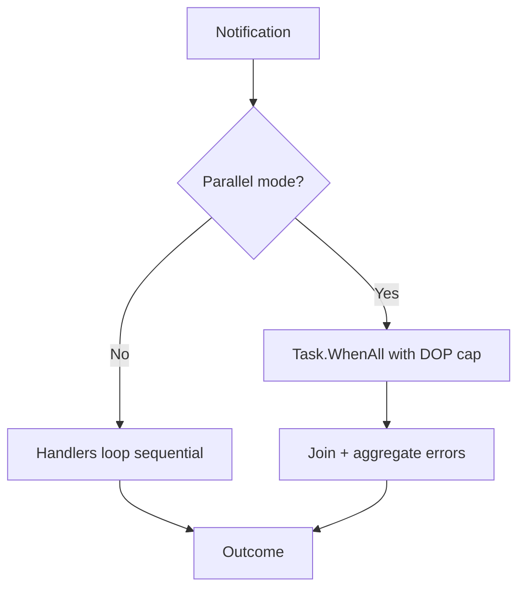

# Multicore/Concurrency Assessment

## Summary

- Mediator does not schedule threads; it relies on the host (ASP.NET, workers, NATS consumers) for concurrency. Each Send/Publish uses its own DI scope.
- Request pipeline is fully sequential (pre → behaviors → handler → post). Notification handlers are invoked sequentially and fail-fast.
- Multicore use today comes from running many requests at once; a single request/publish stays on one thread unless handlers introduce parallelism themselves.
- To reach “real” multitasking inside one publish, we would need opt-in parallel fan-out and careful safety knobs.

## Current execution model

- Scope per request/notification; no internal task spawning. See SimpleMediator.cs and SimpleMediator.RequestDispatcher.cs.
- Pipeline composition is linear by design (PipelineBuilder.cs).
- Notifications iterate handlers one by one (SimpleMediator.NotificationDispatcher.cs), with an explicit TODO about parallel dispatch.
- Scoped lifetimes by default (ServiceCollectionExtensions.cs, SimpleMediatorConfiguration.cs); parallelizing inside one scope demands thread-safe services.

### Mermaid: request path (sequential)


## Can it use multiple cores today?

- Yes, indirectly: multiple concurrent requests are handled by the thread pool across cores.
- Within a single request/notification, execution stays single-threaded unless custom code introduces parallelism (e.g., Task.WhenAll inside a handler).

## Gaps vs “true multitasking”

- No built-in parallel dispatch for notifications.
- No parallel composition of independent pre/post processors or behaviors.
- No batching/partition helpers for CPU-heavy workloads; CPU-bound handlers block their thread unless they parallelize.

## Options to add multicore exploitation

- Opt-in parallel notification publish: flag to run handlers via Task.WhenAll with cancellation and max-degree-of-parallelism (DOP); keep sequential as default for determinism.
- Parallel-friendly processors/behaviors: helpers that fan out independent work with Task.WhenAll, documenting thread-safety expectations for scoped services.
- Handler guidance: for CPU-bound work use Parallel.ForEachAsync/partitioning; for I/O-bound keep everything async to free the thread pool.
- Metrics/diagnostics: tag handler count and parallel mode; capture per-handler duration to spot stragglers.
- Safety knobs: DOP limits, cooperative cancellation, fail-fast vs “collect all”, and a switch to preserve ordering when needed.

### Mermaid: opt-in parallel publish (concept)



## Concept code sketch: opt-in parallel publish

```csharp
public enum PublishMode { Sequential, Parallel }

public sealed record PublishOptions(PublishMode Mode = PublishMode.Sequential, int? DegreeOfParallelism = null);

// Inside NotificationDispatcher.ExecuteAsync
if (options.Mode == PublishMode.Parallel)
{
    var dop = options.DegreeOfParallelism ?? Environment.ProcessorCount;
    using var throttler = new SemaphoreSlim(dop);
    var tasks = handlers.Select(async handler =>
    {
        await throttler.WaitAsync(cancellationToken);
        try { return await InvokeNotificationHandler(handler, notification, cancellationToken); }
        finally { throttler.Release(); }
    });

    var results = await Task.WhenAll(tasks);
    return results.FirstOrDefault(r => r.IsLeft) ?? Right<MediatorError, Unit>(Unit.Default);
}
// Fallback: existing sequential loop
```

## Practical recommendation

- For throughput, lean on host-level concurrency and keep handlers/behaviors fully async.
- To unlock intra-publish parallelism, start with an opt-in parallel notification mode guarded by DOP and clear ordering semantics.

## Real-time / NATS-like IoT scenarios

- Today it can sit behind NATS/AMQP/MQTT consumers, but latency and fan-out are bounded by the same sequential rules: one message enters one pipeline on one thread; notifications fan out sequentially.
- For “hard” low-latency workloads (high message rate, many subscribers, CPU-bound transforms), consider new artifacts:
  - Parallel publish mode with DOP cap and back-pressure (e.g., channel-based) to avoid thread-pool storms.
  - A batching/fused handler adapter that groups small messages before entering the pipeline, reducing per-message overhead.
  - A “fast path” pipeline profile: disable optional behaviors/processors, pre-allocate contexts, and avoid extra allocations/diagnostics when a low-latency flag is set.
  - Partitioned notification dispatchers (by key) to preserve ordering per device/tenant while still using multiple cores.
- Risks/limits: scoped services must be thread-safe if reused across parallel handler invocations; ordering guarantees become weaker unless partitioned; any blocking I/O in handlers will dominate latency.
- If strict determinism and per-handler isolation are required, parallel modes should be opt-in and clearly documented; otherwise the current design is safe but single-threaded per message.
